# Wing Commander Saga: AI System Analysis

This document analyzes the AI system from the original Wing Commander Saga C++ codebase and proposes an implementation strategy for the Godot conversion project, following the guidelines in `tasks/00_analysis_setup.md`.

*Source Code Folders:* `ai/`, `cmeasure/`, `iff_defs/`

## 1. Original System Overview

The original Wing Commander Saga AI system is a complex entity responsible for controlling non-player ships (fighters, bombers, capital ships) and turrets. It encompasses targeting, navigation, combat maneuvers, goal management, and interaction with various game systems. Key C++ files include `ai.cpp`, `aicode.cpp`, `aibig.cpp`, `aiturret.cpp`, `aigoals.cpp`, `ai_profiles.cpp`, `cmeasure.cpp`, and `iff_defs.cpp`.

```mermaid
graph TD
    A[AI System] --> B(Core AI Logic);
    A --> C(AI Profiles);
    A --> D(Big Ship AI);
    A --> T(Turret AI);
    A --> GOALS(Goal Management);
    A --> IFF(IFF System);
    A --> CM(Countermeasures);

    B --> BEHAV(AI Behaviors/Modes);
    B --> NAV(Navigation & Movement);
    B --> TGT(Targeting & Perception);
    B --> WPNS(Weapon Management);
    B --> FORM(Formation Flying);
    B --> COLL(Collision Avoidance);
    B --> STL(Stealth Handling);
    B --> DOCK(Docking/Bay Ops);
    B --> GUARD(Guard Behavior);
    B --> REPAIR(Repair/Rearm Logic);

    C --> SKILL(Skill Levels);
    C --> FLAGS(Profile Flags);

    D --> STRAFE(Strafe Behavior);
    D --> ATKPAT(Attack Patterns);
    D --> SUBSYS(Subsystem Targeting);

    T --> TTGT(Turret Targeting);
    T --> TFIRE(Turret Firing Logic);
    T --> TFOV(Turret FOV);

    GOALS --> GTYPES(Goal Types);
    GOALS --> GPRIO(Goal Prioritization);

    NAV --> PATH(Path Following);
    NAV --> WP(Waypoint Navigation);

    TGT --> IFF;
    TGT --> SENSOR(Sensor Simulation);
    TGT --> STL;

    WPNS --> WSEL(Weapon Selection);
    WPNS --> WFIRE(Firing Logic);
    WPNS --> CM;

    COLL --> AVOID(Avoidance Maneuvers);
    COLL --> SHKWV(Shockwave Evasion);

    DOCK --> DPATH(Docking Paths);
    DOCK --> DBAY(Bay Emergence/Departure);
```



### 1.1. Core Components

1.  **AI Info Structure (`ai_info` in `ai.h`)**: Central data structure holding runtime AI state for a ship (flags, mode, target, goals, path data, timers, skill parameters, etc.).
2.  **AI Modes & Submodes (`AIM_*`, `SM_*`, `AIS_*` in `ai.h`)**: Defines the primary behavioral state (Chase, Evade, Waypoints, Guard, Dock, Strafe, Path, etc.) and specific sub-behaviors within those modes.
3.  **AI Profiles & Classes (`ai_profile_t` in `ai_profiles.h`, `ai_class` in `ai.h`)**: Configurable parameters defining AI skill (accuracy, evasion, courage), behavior flags (smart shield/weapon use), and tactical preferences across different skill levels and AI classes. Loaded from `ai_profiles.tbl` and `ai.tbl`.
4.  **Goal Management (`ai_goal` in `ai.h`, `aigoals.cpp`)**: System for assigning and prioritizing multiple objectives (Attack, Guard, Dock, Waypoints, etc.) from mission scripts or dynamic events.
5.  **Targeting & Perception (`aicode.cpp`, `aiturret.cpp`)**: Logic for selecting targets (ships, weapons, subsystems), considering IFF, threat level, sensor range, AWACS, and stealth. Includes aspect lock calculation (`update_aspect_lock_information`).
6.  **Navigation & Movement (`aicode.cpp`, `aibig.cpp`)**: Core functions for controlling ship movement (`ai_turn_towards_vector`, `accelerate_ship`, `set_accel_for_target_speed`). Includes path following (`ai_path`), waypoint navigation (`ai_waypoints`), formation flying (`ai_formation`), and collision avoidance (`maybe_avoid_big_ship`, `avoid_player`).
7.  **Weapon Management (`aicode.cpp`, `aiturret.cpp`)**: Logic for selecting primary/secondary weapons (`ai_select_primary_weapon`, `ai_select_secondary_weapon`), managing firing delays (`set_secondary_fire_delay`), and deciding when to fire (`ai_fire_primary_weapon`, `ai_fire_secondary_weapon`, `turret_fire_weapon`).
8.  **Big Ship AI (`aibig.cpp`)**: Specialized behaviors for capital ships (chase patterns) and fighters attacking them (strafe runs, attack point selection `ai_bpap`).
9.  **Turret AI (`aiturret.cpp`)**: Independent AI for ship turrets, including target prioritization (`find_turret_enemy`), FOV checks (`turret_fov_test`), and firing logic.
10. **Countermeasures (`cmeasure.cpp`)**: Automated deployment of flares/chaff against incoming missiles based on threat and AI profile settings.
11. **IFF System (`iff_defs.cpp`)**: Identification Friend or Foe logic determining team relationships, crucial for targeting.
12. **Docking/Bay Operations (`aicode.cpp`, `objectdock.cpp`)**: Logic for ships entering/exiting carriers or docking with other ships, including path following and orientation matching (`dock_orient_and_approach`).
13. **Guard Behavior (`aicode.cpp`)**: Protecting specific ships or wings (`ai_guard`, `ai_big_guard`).
14. **Repair/Rearm System (`aicode.cpp`)**: Support ship logic for servicing other ships (`ai_do_repair_frame`, `ai_issue_rearm_request`).
15. **Stealth Detection (`aicode.cpp`)**: Systems for detecting and tracking stealth ships (`ai_is_stealth_visible`, `ai_stealth_find`, `ai_stealth_sweep`).
16. **Collision Avoidance (`aicode.cpp`, `aibig.cpp`)**: Logic to prevent collisions with other ships and objects, including shockwave evasion.

### 1.2. AI Info Structure (`ai_info` in `ai.h`)

This central struct holds the runtime state for an AI-controlled ship. Key fields include:

*   **Basic Info:** `shipnum`, `type`, `wing`, `behavior`, `ai_class`.
*   **State Flags:** `ai_flags` (bitmask using `AIF_*` constants).
*   **Mode Control:** `mode`, `previous_mode`, `submode`, `previous_submode`, `mode_time` (timestamp), `submode_start_time` (timestamp).
*   **Targeting:** `target_objnum`, `target_signature`, `previous_target_objnum`, `targeted_subsys`, `last_subsys_target`, `targeted_subsys_parent`.
*   **Goal Management:** `goals[MAX_AI_GOALS]`, `active_goal`, `goal_check_time` (timestamp).
*   **Path Following:** `path_start`, `path_cur`, `path_length`, `path_dir`, `path_flags`, `path_objnum`, `mp_index`, `path_goal_dist`, `path_subsystem_next_check` (timestamp), `path_goal_obj_hash`, `path_next_create_time` (timestamp), `path_create_pos`, `path_create_orient`.
*   **Waypoint Navigation:** `wp_list`, `wp_index`, `wp_flags`, `wp_dir`, `waypoint_speed_cap`.
*   **Guard Behavior:** `guard_objnum`, `guard_signature`, `guard_wingnum`, `guard_vec`.
*   **Stealth Tracking:** `stealth_last_pos`, `stealth_velocity`, `stealth_last_visible_stamp` (timestamp), `stealth_last_cheat_visible_stamp` (timestamp), `stealth_sweep_box_size`.
*   **Threat Assessment:** `danger_weapon_objnum`, `danger_weapon_signature`, `nearest_locked_object`, `nearest_locked_distance`.
*   **Repair/Rearm:** `support_ship_objnum`, `support_ship_signature`, `next_rearm_request_timestamp` (timestamp), `abort_rearm_timestamp` (timestamp).
*   **Weapon State:** `aspect_locked_time`, `current_target_is_locked`, `last_secondary_index`.
*   **Skill Parameters:** `ai_accuracy`, `ai_evasion`, `ai_courage`, `ai_patience`, `ai_aburn_use_factor`, `ai_shockwave_evade_chance`, `ai_get_away_chance`, `ai_secondary_range_mult`, `ai_bump_range_mult`, `ai_class_autoscale`, `ai_cmeasure_fire_chance`, `ai_in_range_time`, `ai_link_ammo_levels_maybe`, `ai_link_ammo_levels_always`, `ai_primary_ammo_burst_mult`, `ai_link_energy_levels_maybe`, `ai_link_energy_levels_always`, `ai_predict_position_delay` (timestamp), `ai_shield_manage_delay`, `ai_ship_fire_delay_scale_friendly`, `ai_ship_fire_delay_scale_hostile`, `ai_ship_fire_secondary_delay_scale_friendly`, `ai_ship_fire_secondary_delay_scale_hostile`, `ai_turn_time_scale`, `ai_glide_attack_percent`, `ai_circle_strafe_percent`, `ai_glide_strafe_percent`, `ai_stalemate_time_thresh`, `ai_stalemate_dist_thresh`, `ai_chance_to_use_missiles_on_plr`, `ai_max_aim_update_delay`, `ai_profile_flags`.
*   **Timers:** `next_predict_pos_time`, `next_aim_pos_time`, `afterburner_stop_time`, `shield_manage_timestamp`, `choose_enemy_timestamp`, `ok_to_target_timestamp`, `pick_big_attack_point_timestamp`, `scan_for_enemy_timestamp`, `warp_out_timestamp`, `primary_select_timestamp`, `secondary_select_timestamp`, `self_destruct_timestamp`, `mode_time` (timeout), `resume_goal_time`.
*   **Collision Avoidance:** `avoid_ship_num`, `avoid_goal_point`, `avoid_check_timestamp` (timestamp), `big_collision_normal`, `big_recover_pos_1`, `big_recover_pos_2`, `big_recover_timestamp` (timestamp).
*   **Other State:** `prev_accel`, `prev_dot_to_goal`, `time_enemy_in_range`, `time_enemy_near`, `last_attack_time` (timestamp), `last_hit_time` (timestamp), `last_hit_quadrant`, `last_hit_target_time` (timestamp), `hitter_objnum`, `hitter_signature`, `ignore_objnum`, `ignore_signature`, `ignore_new_objnums[]`, `ignore_new_signatures[]`, `ignore_expire_timestamp` (timestamp), `shockwave_object`, `kamikaze_damage`, `big_attack_point`, `big_attack_surface_normal`, `artillery_objnum`, `artillery_sig`, `artillery_lock_time`, `artillery_lock_pos`, `lethality`.
*   **SEXP Override:** `ai_override_flags`, `ai_override_ci`, `ai_override_timestamp` (timestamp).

### 1.3. AI Flags System (`AIF_*` in `ai.h`)

An extensive bitmask system (`ai_flags` in `ai_info`) controls fine-grained AI states and behaviors:


### 1.4. AI Profile Flags (`AIPF_*` in `ai_profiles.h`)

These flags, defined in `ai_profiles.tbl`, control specific AI capabilities and behaviors globally or per profile:


## 2. Implementation in Godot

The AI system will be implemented using a combination of state machines (for high-level modes like Chase, Guard, Dock) and behavior trees (using the LimboAI addon) for more complex decision-making within states. AI configuration will be managed through custom Godot Resources.

### 2.1. Godot Project Structure

```
scripts/
├── ai/
│   ├── ai_controller.gd         # Main AI logic node/script attached to ships
│   ├── perception_component.gd  # Handles sensing environment, targets, threats
│   ├── ai_goal_manager.gd       # Handles goal processing and prioritization within AIController
│   ├── ai_state_machine.gd      # (Optional) State machine implementation (or use LimboAI BTState)
│   ├── ai_behavior_tree.gd      # (Optional) Base/helper for LimboAI BehaviorTree resources
│   ├── ai_blackboard.gd         # (Optional) LimboAI blackboard resource script (if needed beyond BTPlayer's)
│   ├── behaviors/               # Scripts defining specific AI states/behaviors (LimboAI tasks)
│   │   ├── approach_target.gd   # BTAction: Steers towards target position
│   │   ├── chase_target.gd      # BTAction: Basic chase movement towards target
│   │   ├── deploy_countermeasure.gd # BTAction: Triggers countermeasure deployment
│   │   ├── fire_primary.gd      # BTAction: Triggers primary weapon fire
│   │   ├── has_target.gd        # BTCondition: Checks if AI has a target
│   │   ├── is_missile_locked.gd # BTCondition: Checks if AI is locked by a missile
│   │   ├── is_target_in_range.gd # BTCondition: Checks if target is within weapon range
│   │   ├── select_primary_weapon.gd # BTAction: Selects primary weapon bank
│   │   └── select_secondary_weapon.gd # BTAction: Selects secondary weapon bank
│   ├── navigation/              # (Placeholder) Navigation related scripts
│   │   ├── path_follower.gd     # (Placeholder)
│   │   └── collision_avoidance.gd # (Placeholder)
│   ├── targeting/               # (Placeholder) Targeting related scripts
│   │   ├── targeting_system.gd  # (Placeholder) Could be part of AIController or separate
│   │   └── stealth_detector.gd  # (Placeholder)
│   └── turret/                  # (Placeholder) Turret specific AI
│       └── turret_ai.gd         # (Placeholder)
├── globals/
│   ├── ai_constants.gd          # Enums for AIMode, Submodes, Flags
│   ├── ai_profile_manager.gd    # (Placeholder) Autoload for managing AIProfile resources
│   └── iff_manager.gd           # (Placeholder) Autoload for managing IFF data/logic
├── resources/                   # Scripts defining custom Resource types (Moved to scripts/resources/)
│   ├── ai_profile.gd            # Defines AI behavior parameters (Moved to scripts/resources/)
│   ├── ai_goal.gd               # Defines AI goal structure (Moved to scripts/resources/)
│   └── ai_class.gd              # (Optional) If merged into AIProfile (Moved to scripts/resources/)
resources/                       # Instantiated Resource files (.tres)
├── ai/
│   ├── profiles/                # AIProfile resources (.tres) - Defines AI skill/behavior parameters
│   │   ├── default_profile.tres
│   │   └── terran_ace.tres
│   ├── classes/                 # AIClass resources (.tres) - Optional
│   │   ├── fighter_class.tres
│   │   └── bomber_class.tres
│   └── behavior_trees/          # LimboAI BehaviorTree resources (.tres)
│       ├── fighter_attack_bt.tres
│       └── capital_defense_bt.tres
├── iff/
│   └── iff_defs.tres            # Converted IFF table data
scenes/
├── ai/                        # Optional: Scenes for complex AI components (e.g., debug visualizers)
└── ship_weapon_systems/       # Ship scenes will contain AIController node
    └── components/
        └── ai_controller.tscn   # Scene containing AIController node and potentially BTPlayer
```
*(Note: Moved resource scripts to `scripts/resources/` for better organization as per `00_analysis_setup.md`)*

### 2.2. Key Classes and Resources

#### AIController (`scripts/ai/ai_controller.gd`)

The main AI controller node attached to ship entities (`ShipBase`). This script manages the AI's runtime state (mirroring `ai_info`), orchestrates the `PerceptionComponent`, `AIGoalManager`, and the `BTPlayer` (LimboAI). It updates the `Blackboard` with current state and reads desired actions (movement, firing) set by the Behavior Tree to apply them to the `ShipBase`.

#### PerceptionComponent (`scripts/ai/perception_component.gd`)

Handles sensing the environment, finding potential targets, evaluating threats (missiles, projectiles), updating target status (range, timers), and managing stealth visibility checks. Corresponds to perception logic spread across `aicode.cpp` and `aiturret.cpp`.

#### AIGoalManager (`scripts/ai/ai_goal_manager.gd`)

Manages the AI's goal queue (`goals` array). Handles adding, removing, validating (checking achievability based on game state), sorting by priority, and selecting the active goal. Sets the `AIController`'s mode based on the active goal. Corresponds to logic in `aigoals.cpp`.

#### AIGoal (`scripts/resources/ai_goal.gd`)

A `Resource` defining the structure for an AI goal, including its mode, target, priority, and flags. Corresponds to the `ai_goal` struct.

#### AIProfile (`scripts/resources/ai_profile.gd`)

A `Resource` defining static AI behavior parameters (accuracy, evasion, courage, weapon usage chances, timers, etc.) based on skill level. Includes helper methods to retrieve skill-specific values. Corresponds to `ai_profile_t` and data from `ai_profiles.tbl`.

### 2.4. AI Submodes (`SM_*`, `AIS_*` constants)

Defined as enums in `scripts/globals/ai_constants.gd`.

### 2.5. Behavior Tree Implementation (LimboAI)

Behavior trees offer a structured way to define complex AI logic.

*   **Structure:** Use LimboAI's editor to create `BehaviorTree` resources (`.tres`).
*   **Nodes:** Utilize built-in LimboAI nodes (Sequence, Selector, Decorators like Inverter, Condition) and create custom `BTAction`, `BTCondition` scripts for game-specific logic (e.g., `ApproachTarget`, `ChaseTarget`, `DeployCountermeasure`, `FirePrimary`, `HasTarget`, `IsMissileLocked`, `IsTargetInRange`, `SelectPrimaryWeapon`, `SelectSecondaryWeapon`).
*   **Blackboard:** Use `Blackboard` resources to store and share AI state (target ID, distance, mode, flags) and desired actions (desired_movement, fire_primary). `AIController` writes state to the blackboard before the BT runs and reads desired actions from it after the BT runs. BT nodes read state and write desired actions.
*   **Integration:** Attach a `BTPlayer` node to the `AIController` scene and assign the `BehaviorTree` and `BlackboardPlan` resources.


**Example Behavior Tree Structure (Conceptual):**

```
(Root: Selector)
  |-- (Sequence: Emergency Evade)
  |   |-- (Condition: Is Critically Damaged?)
  |   |-- (Condition: Can Evade?)
  |   `-- (Action: Execute Evasion Maneuver)
  |-- (Sequence: Handle Threat)
  |   |-- (Condition: Is Weapon Danger?)
  |   |-- (Action: Evade Weapon)
  |-- (Sequence: Collision Avoidance)
  |   |-- (Condition: Collision Imminent?)
  |   |-- (Action: Avoid Collision)
  |-- (Sequence: Attack Target)
  |   |-- (Condition: Has Valid Target?)
  |   |-- (Selector: Attack Strategy)
  |   |   |-- (Sequence: Special Tactic - e.g., Strafe)
  |   |   |   |-- (Condition: Should Use Strafe?)
  |   |   |   `-- (Action: Execute Strafe)
  |   |   |-- (Sequence: Standard Attack)
  |   |   |   |-- (Action: Approach Target)
  |   |   |   |-- (Condition: Is Target In Range?)
  |   |   |   |-- (Action: Select Weapon)
  |   |   |   `-- (Action: Fire Weapon)
  |   |   `-- (Action: Pursue Target) # Fallback if not in range/using tactic
  |-- (Sequence: Follow Formation)
  |   |-- (Condition: Is In Formation?)
  |   `-- (Action: Maintain Formation Position)
  `-- (Action: Default Behavior - e.g., Patrol/Idle)
```

## 3. AI Goals System (`aigoals.cpp`, `aigoals.h`)

The goal system allows assigning prioritized objectives to AI ships. Implemented via `AIGoal` resource and `AIGoalManager` node.

### 3.1. AIGoal Resource (`scripts/resources/ai_goal.gd`)

Defines the goal structure (mode, target, priority, flags). See Section 2.2.

### 3.2. Goal Management (`scripts/ai/ai_goal_manager.gd`)

Manages the goal queue within `AIController`. See Section 2.2.


### 3.3. Goal Types (`AI_GOAL_*` constants)

Defined as `GoalMode` enum within `AIGoal` resource script.

## 4. AI Profiles System (`ai_profiles.cpp`, `ai_profiles.h`)

Implemented as `AIProfile` resource (`scripts/resources/ai_profile.gd`). See Section 2.2. Loading handled by a global manager (`scripts/globals/ai_profile_manager.gd`).


## 5. Path Following System (`aicode.cpp`)

The original system uses a global `Path_points` array. Godot's `NavigationServer3D` and `NavigationAgent3D` are preferred for pathfinding in complex environments. However, the original paths are often pre-defined model paths or simple point-to-point paths with collision avoidance checks.

**Approach:**

1.  **Model Paths:** Store paths defined in models (`$path` tag) as `Curve3D` resources within the `ModelMetadata` resource.
2.  **Dynamic Paths:** For simple point-to-point or docking paths, generate a `Curve3D` or `PackedVector3Array` at runtime.
3.  **Path Following Logic:** Implement path following in a dedicated script (`scripts/ai/navigation/path_follower.gd`) or within specific AI behaviors. Use `NavigationAgent3D` if complex obstacle avoidance is needed, otherwise, implement steering behaviors towards points along the `Curve3D` or array.
4.  **Path Recreation:** Implement logic similar to `maybe_recreate_path` if paths need dynamic updates based on target movement (e.g., docking with a moving carrier).


## 6. Big Ship AI (`aibig.cpp`)

Specialized logic for capital ships and fighters attacking them.

*   **Fighter Strafe:** Implement as a dedicated AI state/behavior tree (`scripts/ai/behaviors/strafe_behavior.gd`). Use submodes (`AIConstants.StrafeSubmode.*`) for different phases (positioning, attack run, retreat, avoid). Attack point selection (`ai_bpap`) needs porting - select random points on target octants or bounding box faces. Retreat logic (`ai_big_strafe_maybe_retreat`) based on time, distance, collision prediction.
*   **Capital Ship Behavior:** Implement logic for capital ships targeting fighters (potentially switching to strafe mode `ai_big_maybe_enter_strafe_mode`) and other large ships (approach, circle, parallel patterns `ai_big_chase`).

## 7. Countermeasure System (`cmeasure.cpp`)

Logic for AI deploying countermeasures.

*   **Integration:** Add logic within `AIController._physics_process` or a dedicated behavior tree task (`scripts/ai/behaviors/bt_deploy_countermeasure.gd`).
*   **Decision:** Check for missile threats (`is_missile_threat()`). Use `ai_profile.cmeasure_fire_chance[skill_level]` and `randf()` to decide whether to fire. Respect cooldown (`CMEASURE_WAIT`).
*   **Action:** Call `ship.fire_countermeasure()` method (needs implementation on `ShipBase`).

## 8. Turret AI System (`aiturret.cpp`)

Independent AI for turrets.

*   **Implementation:** Create `scripts/ai/turret/turret_ai.gd` script attached to turret subsystem nodes.
*   **Targeting:** Port `find_turret_enemy` logic, considering weapon flags (huge, small, tagged), IFF, FOV (`turret_fov_test`), range, and target prioritization (bombs > attackers > others). Use physics queries or `Area3D` for detection.
*   **Firing:** Port `turret_fire_weapon` logic. Check fire delays, target validity (`check_ok_to_fire`), FOV. Call weapon firing methods on the turret's `WeaponSystem`. Handle beam/swarm/flak specifics.

## 9. IFF System (`iff_defs.cpp`)

Manages team relationships and targeting rules.

*   **Implementation:** Create `scripts/globals/iff_manager.gd` Singleton (Autoload).
*   **Data:** Load IFF definitions (names, colors, attack masks) from a resource (`resources/iff/iff_defs.tres`, converted from `iff_defs.tbl`).
*   **Functions:** Implement `iff_x_attacks_y`, `get_attackee_mask`, `get_attacker_mask`, `get_color_by_team`, `get_color_by_object`.

## 10. Targeting System (`aicode.cpp`, `hudtarget.cpp`)

Core logic for target selection and locking.

*   **Implementation:** Centralize targeting logic in `scripts/ai/targeting/targeting_system.gd` (Singleton or component within `AIController`).
*   **Target Selection:** Port `find_enemy`, `get_nearest_objnum` logic. Consider IFF, range, visibility (AWACS, stealth), ignore flags, max attackers.
*   **Aspect Lock:** Port `update_aspect_lock_information` logic. Calculate dot products, check aspect requirements based on missile type, manage lock timer (`aspect_locked_time`). Store lock status (`current_target_is_locked`) in `AIController`.

## 11. Detailed Code Analysis Guidelines (Refined for AI)

*   **Focus on State:** Clearly identify all state variables within `ai_info` and map them to `AIController` properties or `Blackboard` variables. Pay attention to data types (int vs float, timestamps).
*   **Map Modes/Submodes:** Explicitly list all `AIM_*`, `SM_*`, `AIS_*` constants and describe the behavior associated with each. Map these to Godot state machine states or behavior tree branches using Enums.
*   **Analyze Core Functions:** Detail the logic within key functions like `ai_execute_behavior`, `ai_chase`, `ai_waypoints`, `ai_formation`, `ai_guard`, `ai_dock`, `ai_path`, `ai_turn_towards_vector`, `find_enemy`, `ai_fire_*_weapon`, `update_aspect_lock_information`, `ai_big_strafe`, `find_turret_enemy`, `turret_fire_weapon`. Identify inputs, outputs, and side effects.
*   **Parameter Mapping:** Document parameters from `ai_profiles.tbl` and `ai.tbl` and how they influence behavior. Map these to `AIProfile` and `AIClass` resource properties. Ensure skill level indexing is handled correctly.
*   **Flag Usage:** Explain the purpose of key `AIF_*` and `AIPF_*` flags and how they control conditional logic. Map these to constants in Godot.
*   **Interactions:** Explicitly describe how AI interacts with Physics (movement commands), Weapons (firing, selection), Targeting (getting target info), Mission System (goals), and HUD (status updates). Define necessary signals or function calls between Godot components.
*   **Godot Implementation:** Suggest specific Godot nodes (`NavigationAgent3D`, `Area3D`, `Timer`, `Tween`, `BTPlayer`), resources (`AIProfile`, `AIGoal`, `BehaviorTree`), and patterns (State Machine, Behavior Tree) for implementing each feature. Provide concise GDScript examples where appropriate. Ensure proposed project structure is consistent.
*   **Data Structures:** Map C++ structs (`ai_info`, `ai_goal`, `ai_profile_t`, `ai_class`) to Godot classes (`AIController`) and Resources (`AIGoal`, `AIProfile`, `AIClass`). Map C-style arrays/linked lists to Godot Arrays/Dictionaries.

## 11.5. Identify Relations (C++ to Godot Mapping)

Based on the current implementation:

*   **`ai_info` struct (`ai.h`)**: Mapped to properties within `AIController` (`scripts/ai/ai_controller.gd`). Runtime state like `mode`, `target_object_id`, `ai_flags`, skill parameters, timers, etc., are managed here.
*   **`ai_execute_behavior` (Conceptual C++ loop)**: Mapped to `AIController._physics_process`. This method orchestrates the perception update (`PerceptionComponent.update_perception`), goal processing (`AIGoalManager.process_goals`), blackboard update (`_update_blackboard`), behavior tree execution (`BTPlayer.update`), and action execution (`_execute_actions_from_blackboard`).
*   **`aigoals.cpp` / `ai_goal` struct**: Mapped to `AIGoalManager` node (`scripts/ai/ai_goal_manager.gd`) and `AIGoal` resource (`scripts/resources/ai_goal.gd`). `AIGoalManager` handles the logic for adding, removing, validating, sorting, and activating goals defined by `AIGoal` resources.
*   **Targeting/Perception Logic (`aicode.cpp`, `aiturret.cpp`)**:
    *   `find_enemy`, `get_nearest_objnum`: Implemented within `PerceptionComponent._find_potential_targets`. Requires `ObjectManager` and `IFFManager`.
    *   Threat Assessment (`ai_update_danger_weapon`, missile lock checks): Implemented within `PerceptionComponent._evaluate_threats`. Requires `ObjectManager`.
    *   `update_aspect_lock_information`: Logic needs to be ported, likely within `PerceptionComponent` or `AIController`, updating `aspect_locked_time` and `current_target_is_locked` on `AIController`.
    *   Stealth Detection (`ai_is_stealth_visible`): Partially implemented in `PerceptionComponent._update_stealth_visibility` and `_check_stealth_visibility`. Requires further refinement (LoS, AWACS).
*   **Movement/Action Execution (`aicode.cpp`)**:
    *   `ai_turn_towards_vector`, `accelerate_ship`, `set_accel_for_target_speed`: These concepts are handled by Behavior Tree actions (like `ApproachTarget`, `ChaseTarget`) writing `desired_rotation` and `desired_movement` to the blackboard. `AIController._execute_actions_from_blackboard` then reads these and calls corresponding methods on the `ShipBase` script (e.g., `set_ai_rotation_input`, `set_ai_movement_input`).
*   **Weapon Management (`aicode.cpp`, `aiturret.cpp`)**:
    *   `ai_select_primary_weapon`, `ai_select_secondary_weapon`: Implemented as BT Actions (`SelectPrimaryWeapon`, `SelectSecondaryWeapon`) which call methods on the `ShipBase` (e.g., `set_selected_primary_bank_ai`). The complex selection logic needs to be ported into these actions or helper functions.
    *   `ai_fire_primary_weapon`, `ai_fire_secondary_weapon`: Implemented as BT Actions (`FirePrimary`, `FireSecondary`) which set flags (`fire_primary`, `fire_secondary`) on the blackboard. `AIController._execute_actions_from_blackboard` reads these flags and calls methods on `ShipBase` (e.g., `fire_primary_ai`).
*   **Countermeasures (`cmeasure.cpp`)**: Implemented via `BTConditionIsMissileLocked` and `BTActionDeployCountermeasure`. The action sets a flag (`deploy_countermeasure`) on the blackboard, read by `AIController._execute_actions_from_blackboard` which calls `ShipBase.deploy_countermeasure_ai()`. Cooldown and chance logic reside within the BT structure or `PerceptionComponent`.
*   **AI Profiles (`ai_profiles.tbl`, `ai_profile_t`)**: Mapped to `AIProfile` resource (`scripts/resources/ai_profile.gd`). `AIController._initialize_from_profile` reads skill-based values from the assigned profile.
*   **AI Constants (`AIF_*`, `AIM_*`, `SM_*`, `AIS_*`, `AIPF_*`)**: Mapped to enums and constants within `AIConstants` (`scripts/globals/ai_constants.gd`).
*   **IFF System (`iff_defs.cpp`)**: Planned to be implemented in `IFFManager` singleton (`scripts/globals/iff_manager.gd`). `PerceptionComponent` will rely on this.
*   **Turret AI (`aiturret.cpp`)**: Planned to be implemented in `TurretAI` script (`scripts/ai/turret/turret_ai.gd`).

## 12. Migration Notes

### Key Differences from Original Implementation

1.  **Component-Based Approach**: Using Godot's node system (`AIController`, `PathFollower`, `TargetingSystem` components) instead of monolithic AI functions operating on global/struct data.
2.  **Resource-Based Configuration**: `AIProfile`, `AIClass`, `AIGoal` as Godot Resources (`.tres`) instead of parsed tables (`.tbl`) and hardcoded structs. Easier editing and management.
3.  **Behavior Trees/State Machines**: Formalizing AI logic using established patterns (LimboAI or custom state machines) instead of complex `switch` statements on modes/submodes.
4.  **Event-Driven Communication**: Using Godot's signal system for communication between AI and other systems (e.g., `goal_completed`, `target_destroyed`, `weapon_fired`) instead of direct function calls or flag checking.
5.  **Navigation:** Leveraging Godot's `NavigationServer3D` / `NavigationAgent3D` for complex pathfinding if needed, supplementing the original model path following.
6.  **Data Storage:** Using Godot Dictionaries and Arrays instead of C-style arrays and linked lists for managing goals, targets, etc.

### Implementation Priorities

1.  Core `AIController` script and `AIProfile` resource definition.
2.  Basic AI Modes (Chase, Evade, Waypoints) using State Machine or simple BT.
3.  Targeting System integration (`find_enemy` equivalent).
4.  Weapon Selection and Firing logic integration.
5.  Goal Management system (`AIGoal` resource, `AIGoalManager` script).
6.  Path Following for model paths.
7.  Advanced behaviors (Strafe, Guard, Docking, Stealth).
8.  Turret AI implementation.
9.  Countermeasure and IFF integration.
10. Collision Avoidance refinement.

## 13. Original Code Reference

*   `ai/ai.h`: Defines `ai_info`, `ai_goal`, `ai_class`, `AIF_*` flags, `AIM_*` modes, `SM_*`/`AIS_*` submodes.
*   `ai/aicode.cpp`: Contains core AI logic for various modes (chase, evade, waypoints, dock, guard, path, formation, etc.), helper functions (`ai_turn_towards_vector`, `accelerate_ship`, `find_enemy`, `set_target_objnum`, `ai_fire_*_weapon`, `update_aspect_lock_information`).
*   `ai/aibig.cpp`: Logic specific to capital ships and fighters attacking them (strafe, attack point selection).
*   `ai/aiturret.cpp`: Logic for independent turret AI (targeting, firing).
*   `ai/aigoals.cpp`: Goal management functions (adding, removing, validating, prioritizing).
*   `ai/ai_profiles.h`: Defines `ai_profile_t`, `AIPF_*` flags.
*   `ai/ai_profiles.cpp`: Parses `ai_profiles.tbl`.
*   `cmeasure/cmeasure.cpp`: Countermeasure deployment logic.
*   `iff_defs/iff_defs.cpp`: IFF system logic.
