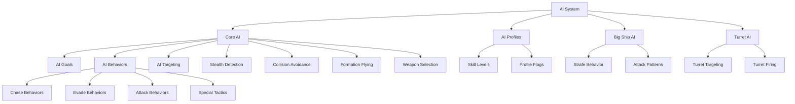
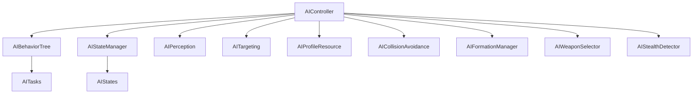
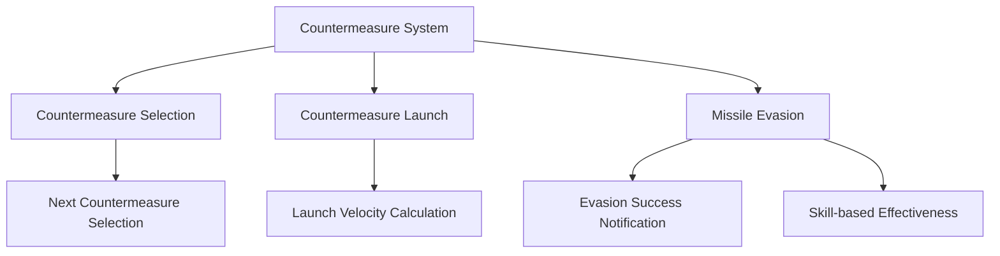
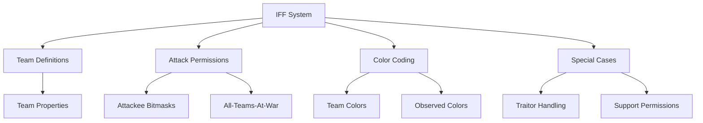

# Wing Commander Saga: AI System

This document outlines the AI system architecture and implementation details for the Wing Commander Saga Godot conversion.

## Original System Overview

The original Wing Commander Saga AI system, primarily located in the `ai/` directory (`ai.cpp`, `aicode.cpp`, `aibig.cpp`, `aiturret.cpp`, `aigoals.cpp`, `ai_profiles.cpp`), is divided into several key components:



### Core Components

1. **AI Info Structure**: Central data structure that holds all AI-related information for a ship
2. **AI Modes**: Different behavioral states (chase, evade, waypoints, etc.)
3. **AI Profiles**: Configuration settings that define AI behavior across skill levels
4. **Big Ship AI**: Specialized behaviors for capital ships and large vessels
5. **Turret AI**: Specialized AI for ship turrets with independent targeting and firing logic
6. **Stealth Detection**: Systems for detecting and tracking stealth ships
7. **Collision Avoidance**: Logic to prevent collisions with other ships and objects
8. **Formation Flying**: Coordinated movement in wing formations
9. **Weapon Selection**: Intelligent weapon selection based on target type and situation.
10. **Countermeasures**: Automated deployment of flares/chaff against incoming missiles (`cmeasure.cpp`).
11. **IFF System**: Identification Friend or Foe logic for targeting and radar (`iff_defs.cpp`).
12. **Docking/Bay Operations**: Logic for ships entering/exiting carriers (`aicode.cpp`).
13. **Guard Behavior**: Protecting specific ships or wings (`aicode.cpp`).
14. **Repair/Rearm System**: Support ship logic for servicing other ships (`aicode.cpp`).

#### AI Info Structure Details

The original C++ implementation uses a comprehensive `ai_info` structure that contains:

- AI flags for various states and behaviors
- Current mode and submode information
- Target tracking (objnum, signature, subsystem)
- Goal management (up to 5 prioritized goals)
- Path following data
- Weapon selection and firing parameters
- Evasion and attack timing
- Skill-based parameters (accuracy, evasion, courage, etc.)
- Stealth tracking information (last position, velocity, visibility timestamp)
- Danger weapon tracking (for threat assessment and evasion)
- Formation parameters (guard vectors, wing positions)
- Timestamps for various behaviors and decision making (e.g., `next_predict_pos_time`, `next_aim_pos_time`, `afterburner_stop_time`, `shield_manage_timestamp`).
- Path following data (`path_start`, `path_cur`, `path_length`, `path_dir`, `path_flags`, `path_objnum`, `mp_index`).
- Repair/Rearm status (`support_ship_objnum`, `support_ship_signature`).

### AI Flags System

The original code uses an extensive set of flags to control AI behavior:

```gdscript
# AI Flags
const AIF_FORMATION_WING = 1 << 0       # Ship is flying in wing formation
const AIF_AWAITING_REPAIR = 1 << 1      # Ship is waiting for repair
const AIF_BEING_REPAIRED = 1 << 2       # Ship is currently being repaired
const AIF_REPAIRING = 1 << 3            # Ship is repairing another ship
const AIF_SEEK_LOCK = 1 << 4            # Ship is trying to get missile lock
const AIF_FORMATION_OBJECT = 1 << 5     # Ship is flying in formation with object
const AIF_TEMPORARY_IGNORE = 1 << 6     # Temporarily ignore target
const AIF_USE_EXIT_PATH = 1 << 7        # Ship is using exit path
const AIF_USE_STATIC_PATH = 1 << 8      # Ship is using a static path
const AIF_TARGET_COLLISION = 1 << 9     # Ship is avoiding collision with target
const AIF_UNLOAD_SECONDARIES = 1 << 10  # Ship should unload secondary weapons
const AIF_ON_SUBSYS_PATH = 1 << 11      # Ship is on path to subsystem
const AIF_AVOID_SHOCKWAVE_SHIP = 1 << 12 # Ship is avoiding shockwave from ship
const AIF_AVOID_SHOCKWAVE_WEAPON = 1 << 13 # Ship is avoiding shockwave from weapon
const AIF_AVOID_SHOCKWAVE_STARTED = 1 << 14 # Ship has started avoiding shockwave
const AIF_ATTACK_SLOWLY = 1 << 15       # Ship should attack slowly
const AIF_REPAIR_OBSTRUCTED = 1 << 16   # Repair is obstructed
const AIF_KAMIKAZE = 1 << 17            # Ship is in kamikaze mode
const AIF_NO_DYNAMIC = 1 << 18          # Ship doesn't use dynamic goals
const AIF_AVOIDING_SMALL_SHIP = 1 << 19 # Ship is avoiding small ship
const AIF_AVOIDING_BIG_SHIP = 1 << 20   # Ship is avoiding big ship
const AIF_STEALTH_PURSUIT = 1 << 23     # Ship is pursuing stealth target
const AIF_UNLOAD_PRIMARIES = 1 << 24    # Ship should unload primary weapons
const AIF_FORMATION = AIF_FORMATION_WING | AIF_FORMATION_OBJECT # Combined formation flag
const AIF_AVOID_SHOCKWAVE = AIF_AVOID_SHOCKWAVE_SHIP | AIF_AVOID_SHOCKWAVE_WEAPON # Combined shockwave flag
const AIF_BIG_SHIP_COLLIDE_RECOVER_1 = 1 << 21 # Big ship collision recovery phase 1
const AIF_BIG_SHIP_COLLIDE_RECOVER_2 = 1 << 22 # Big ship collision recovery phase 2
const AIF_TRYING_UNSUCCESSFULLY_TO_WARP = 1 << 25 # Ship failed to warp due to obstruction/damage
const AIF_CLOSING_DISTANCE_WITH_AB = 1 << 26 # Ship is using afterburner to close distance
```

### AI Profile Flags

The AI profiles system uses additional flags to control behavior:

```gdscript
# AI Profile Flags
const AIPF_SMART_SHIELD_MANAGEMENT = 1 << 0
const AIPF_BIG_SHIPS_CAN_ATTACK_BEAM_TURRETS_ON_UNTARGETED_SHIPS = 1 << 1
const AIPF_SMART_PRIMARY_WEAPON_SELECTION = 1 << 2
const AIPF_SMART_SECONDARY_WEAPON_SELECTION = 1 << 3
const AIPF_ALLOW_RAPID_SECONDARY_DUMBFIRE = 1 << 4
const AIPF_HUGE_TURRET_WEAPONS_IGNORE_BOMBS = 1 << 5
const AIPF_DONT_INSERT_RANDOM_TURRET_FIRE_DELAY = 1 << 6
const AIPF_SMART_AFTERBURNER_MANAGEMENT = 1 << 19
const AIPF_FIX_LINKED_PRIMARY_BUG = 1 << 20
const AIPF_PREVENT_TARGETING_BOMBS_BEYOND_RANGE = 1 << 21
const AIPF_SMART_SUBSYSTEM_TARGETING_FOR_TURRETS = 1 << 22
const AIPF_FIX_HEAT_SEEKER_STEALTH_BUG = 1 << 23
const AIPF_MULTI_ALLOW_EMPTY_PRIMARIES = 1 << 24 # Multiplayer: Allow ships with no primary weapons
const AIPF_MULTI_ALLOW_EMPTY_SECONDARIES = 1 << 25 # Multiplayer: Allow ships with no secondary weapons
const AIPF_ALLOW_TURRETS_TARGET_WEAPONS_FREELY = 1 << 26 # Turrets can target any weapon, not just bombs
const AIPF_USE_ONLY_SINGLE_FOV_FOR_TURRETS = 1 << 27 # Use a simplified FOV check for turrets
const AIPF_ALLOW_VERTICAL_DODGE = 1 << 28 # Allow AI ships to dodge vertically
const AIPF_GLOBAL_DISARM_DISABLE_EFFECTS = 1 << 29 # Disarm/Disable goals affect all AI targeting globally
const AIPF_FORCE_BEAM_TURRET_FOV = 1 << 30 # Force beam turrets to use standard FOV checks
const AIPF_FIX_AI_CLASS_BUG = 1 << 31 # Fix for a potential bug related to AI class scaling

# AI Profile Flags 2 (flags2) - Less common flags
const AIPF2_TURRETS_IGNORE_TARGET_RADIUS = 1 << 0 # Turrets ignore target radius in range checks
const AIPF2_CAP_VS_CAP_COLLISIONS = 1 << 1 # Enable collision detection between capital ships
```

## Implementation in Godot

The AI system will be implemented using a combination of state machines and behavior trees with the LimboAI addon.

### Class Structure



### Key Classes

#### AIController

The main AI controller attached to ship entities:

```gdscript
class_name AIController
extends Node

# AI configuration
var ai_profile: AIProfile
var skill_level: int

# AI state
var current_mode: int
var current_submode: int
var target_object: Node3D
var goals: Array[AIGoal]

# Behavior components
var behavior_tree: BehaviorTree
var state_machine: StateMachine

# Stealth tracking
var stealth_last_pos: Vector3
var stealth_velocity: Vector3
var stealth_last_visible_stamp: int
var stealth_sweep_box_size: float

# Collision avoidance
var avoid_goal_point: Vector3
var avoid_check_timestamp: int
var avoid_ship_num: int

# Weapon management
var aspect_locked_time: float
var current_target_is_locked: bool
var danger_weapon_objnum: int
var danger_weapon_signature: int

# Formation flying
var guard_objnum: int
var guard_signature: int
var guard_wingnum: int
var guard_vec: Vector3
var ai_flags: int = 0 # Holds the current AI state flags (AIF_*)

# Timestamps
var next_predict_pos_time: int = 0
var next_aim_pos_time: int = 0
var afterburner_stop_time: int = 0
var shield_manage_timestamp: int = 0
var choose_enemy_timestamp: int = 0
var ok_to_target_timestamp: int = 0
var pick_big_attack_point_timestamp: int = 0
var scan_for_enemy_timestamp: int = 0
var warp_out_timestamp: int = 0
var next_rearm_request_timestamp: int = 0
var primary_select_timestamp: int = 0
var secondary_select_timestamp: int = 0
var self_destruct_timestamp: int = -1
var abort_rearm_timestamp: int = -1

# Path following
var path_start: int = -1
var path_cur: int = -1
var path_length: int = 0
var path_dir: int = 1 # PD_FORWARD
var path_flags: int = 0
var path_objnum: int = -1
var mp_index: int = -1 # Model path index
var path_goal_dist: float = -1.0
var path_subsystem_next_check: int = 1
var path_goal_obj_hash: int = 0
var path_next_create_time: int = 0
var path_create_pos: Vector3
var path_create_orient: Basis

# Big ship collision recovery
var big_collision_normal: Vector3
var big_recover_pos_1: Vector3
var big_recover_pos_2: Vector3
var big_recover_timestamp: int = 0

# Other state
var prev_accel: float = 0.0
var prev_dot_to_goal: float = 0.0
var time_enemy_in_range: float = 0.0
var time_enemy_near: float = 0.0
var last_attack_time: int = 0
var last_hit_time: int = 0
var last_hit_quadrant: int = 0
var last_hit_target_time: int = 0
var hitter_objnum: int = -1
var hitter_signature: int = -1
var resume_goal_time: int = -1
var ignore_objnum: int = -1 # Corresponds to UNUSED_OBJNUM
var ignore_signature: int = -1
var ignore_new_objnums: Array[int] = [] # MAX_IGNORE_NEW_OBJECTS size
var ignore_new_signatures: Array[int] = [] # MAX_IGNORE_NEW_OBJECTS size
var support_ship_objnum: int = -1
var support_ship_signature: int = -1
var shockwave_object: int = -1
var kamikaze_damage: float = 0.0
var big_attack_point: Vector3
var big_attack_surface_normal: Vector3
var artillery_objnum: int = -1
var artillery_sig: int = -1
var artillery_lock_time: float = 0.0
var artillery_lock_pos: Vector3
var lethality: float = 0.0 # Measure of how dangerous this AI is perceived

func _ready() -> void:
    ignore_new_objnums.resize(7) # MAX_IGNORE_NEW_OBJECTS
    ignore_new_signatures.resize(7) # MAX_IGNORE_NEW_OBJECTS
    for i in range(7):
        ignore_new_objnums[i] = -1
        ignore_new_signatures[i] = -1
    # Initialize AI components
    pass

func process_ai(delta: float) -> void:
    # Update AI state and execute behaviors
    pass

func set_target(target: Node3D) -> void:
    # Set and validate target
    pass

func add_goal(goal: AIGoal) -> void:
    # Add a new goal to the AI
    pass
    
func is_stealth_visible(viewer: Node3D, target: Node3D) -> int:
    # Determine if stealth ship is visible
    # Returns STEALTH_INVISIBLE, STEALTH_VISIBLE, or STEALTH_FULLY_TARGETABLE
    pass
```

#### AIProfile

Resource that defines AI behavior parameters:

```gdscript
class_name AIProfile
extends Resource

# Profile identification
@export var profile_name: String

# Skill level parameters
@export var accuracy: Array[float]
@export var evasion: Array[float]
@export var courage: Array[float]
@export var patience: Array[float]

# Behavior flags
@export var smart_shield_management: bool
@export var smart_weapon_selection: bool
@export var allow_vertical_dodge: bool

# Combat parameters
@export var max_attackers: Array[int]
@export var predict_position_delay: Array[float]
@export var turn_time_scale: Array[float]

# Weapon parameters
@export var ai_cmeasure_fire_chance: Array[float]
@export var ai_in_range_time: Array[float]
@export var ai_link_ammo_levels_maybe: Array[float]
@export var ai_link_ammo_levels_always: Array[float]
@export var ai_primary_ammo_burst_mult: Array[float]
@export var ai_link_energy_levels_maybe: Array[float]
@export var ai_link_energy_levels_always: Array[float]
@export var ai_ship_fire_delay_scale_friendly: Array[float]
@export var ai_ship_fire_delay_scale_hostile: Array[float]
@export var ai_ship_fire_secondary_delay_scale_friendly: Array[float]
@export var ai_ship_fire_secondary_delay_scale_hostile: Array[float]

# Special tactics
@export var ai_glide_attack_percent: Array[float]
@export var ai_circle_strafe_percent: Array[float]
@export var ai_glide_strafe_percent: Array[float]
@export var ai_stalemate_time_thresh: Array[float]
@export var ai_stalemate_dist_thresh: Array[float]
@export var ai_chance_to_use_missiles_on_plr: Array[int]
@export var ai_max_aim_update_delay: Array[float]
@export var ai_aburn_use_factor: Array[int]
@export var ai_shockwave_evade_chance: Array[float]
@export var ai_get_away_chance: Array[float]
@export var ai_secondary_range_mult: Array[float]
@export var ai_bump_range_mult: Array[float] # Multiplier for bomb range checks
@export var afterburner_recharge_scale: Array[float] # Player only
@export var beam_friendly_damage_cap: Array[float] # Max damage beams can do to friendlies
@export var cmeasure_life_scale: Array[float] # Player only
@export var max_allowed_player_homers: Array[int] # Max missiles allowed targeting player
@export var max_incoming_asteroids: Array[int] # Max asteroids AI will track/evade
@export var player_damage_scale: Array[float] # Scales damage AI deals to player hull
@export var subsys_damage_scale: Array[float] # Scales damage AI deals to player subsystems
@export var shield_energy_scale: Array[float] # Player only
@export var weapon_energy_scale: Array[float] # Player only
@export var max_turret_ownage_target: Array[int] # Max turrets allowed targeting a single non-player ship
@export var max_turret_ownage_player: Array[int] # Max turrets allowed targeting the player
@export var kill_percentage_scale: Array[float] # Scales damage % required for a kill
@export var assist_percentage_scale: Array[float] # Scales damage % required for an assist
@export var assist_award_percentage_scale: Array[float] # Scales % of kill score awarded for assist
@export var repair_penalty: Array[int] # Score penalty for player requesting repairs
@export var delay_bomb_arm_timer: Array[float] # Delay before bombs can be shot down
```

### AI Modes

The AI system will implement these core modes from the original:

1. **AIM_CHASE**: Pursue and attack target
2. **AIM_EVADE**: Evade from danger
3. **AIM_WAYPOINTS**: Follow waypoint path
4. **AIM_GUARD**: Guard a specific object
5. **AIM_STRAFE**: Strafe attack pattern (for fighters vs capital ships)
6. **AIM_STILL**: Stay in position
7. **AIM_WARP_OUT**: Exit the battlefield
8. **AIM_GET_BEHIND**: Maneuver behind target
9. **AIM_STAY_NEAR**: Stay near a specific object
10. **AIM_AVOID**: Avoid collision with object
11. **AIM_DOCK**: Dock with another ship
12. **AIM_BIGSHIP**: Special behaviors for capital ships
13. **AIM_PATH**: Follow a specific path
14. **AIM_BE_REARMED**: Receive rearming/repairs
15. **AIM_SAFETY**: Retreat to safe position
16. **AIM_EVADE_WEAPON**: Evade incoming weapon
17. **AIM_PLAY_DEAD**: Simulate being disabled
18. **AIM_FLY_TO_SHIP**: Fly directly to a ship

### AI Submodes

Each AI mode can have multiple submodes that define specific behaviors:

```gdscript
# Chase Submodes
const SM_CONTINUOUS_TURN = 1    # Continuous turning maneuver
const SM_ATTACK = 2             # Standard attack
const SM_EVADE_SQUIGGLE = 3     # Evasive squiggle pattern
const SM_EVADE_BRAKE = 4        # Brake to evade
const SM_EVADE = 5              # Standard evasion
const SM_SUPER_ATTACK = 6       # Aggressive attack
const SM_AVOID = 7              # Avoid collision
const SM_GET_BEHIND = 8         # Get behind target
const SM_GET_AWAY = 9           # Retreat from target
const SM_EVADE_WEAPON = 10      # Evade weapon
const SM_FLY_AWAY = 11          # Fly away from target
const SM_ATTACK_FOREVER = 12    # Attack without interruption
const AIS_CHASE_GLIDEATTACK = 13 # Glide attack maneuver
const AIS_CHASE_CIRCLESTRAFE = 14 # Circle strafe around target

# Strafe Submodes
const AIS_STRAFE_ATTACK = 201   # Strafe attack
const AIS_STRAFE_AVOID = 202    # Avoid during strafe
const AIS_STRAFE_RETREAT1 = 203 # Retreat phase 1
const AIS_STRAFE_RETREAT2 = 204 # Retreat phase 2
const AIS_STRAFE_POSITION = 205 # Position for strafe
const AIS_STRAFE_GLIDE_ATTACK = 206 # Glide during strafe

# Stealth Submodes
const SM_SF_AHEAD = 0           # Stealth find - ahead
const SM_SF_BEHIND = 1          # Stealth find - behind
const SM_SF_BAIL = 2            # Stealth find - bail out
const SM_SS_SET_GOAL = -1       # Stealth sweep - set goal
const SM_SS_BOX0 = 0            # Stealth sweep - box point 0
const SM_SS_LR = 1              # Stealth sweep - lower right
const SM_SS_UL = 2              # Stealth sweep - upper left
const SM_SS_BOX1 = 3            # Stealth sweep - box point 1
const SM_SS_UR = 4              # Stealth sweep - upper right
const SM_SS_LL = 5              # Stealth sweep - lower left
const SM_SS_BOX2 = 6            # Stealth sweep - box point 2
const SM_SS_DONE = 7            # Stealth sweep - done

# Guard Submodes
const AIS_GUARD_STATIC = 101    # Guard static position relative to target
const AIS_GUARD_PATROL = 102    # Patrol around the guarded object
const AIS_GUARD_ATTACK = 103    # Attack threats to the guarded object

# Docking Submodes
const AIS_DOCK_0 = 21           # Initial docking state (unused?)
const AIS_DOCK_1 = 22           # Follow path to approach dock point
const AIS_DOCK_2 = 23           # Orient and approach final dock point
const AIS_DOCK_3 = 24           # Final docking maneuver, attach
const AIS_DOCK_4 = 26           # Stay docked (repairing state)
const AIS_DOCK_4A = 27          # Stay docked (non-repairing state)
const AIS_UNDOCK_0 = 30         # Start undocking sequence, find path
const AIS_UNDOCK_1 = 31         # Initial move away from dock point
const AIS_UNDOCK_2 = 32         # Continue moving away along path
const AIS_UNDOCK_3 = 33         # Final separation maneuver
const AIS_UNDOCK_4 = 34         # Undocking complete, switch mode

# Safety Submodes
const AISS_1 = 41               # Pick a safe spot
const AISS_2 = 42               # Go to the safe spot
const AISS_3 = 43               # Circle the safe spot

# Warp Out Submodes
const AIS_WARP_1 = 300          # Initial state, check for obstructions
const AIS_WARP_2 = 301          # Wait for clear path or timeout
const AIS_WARP_3 = 302          # Accelerate to warp speed
const AIS_WARP_4 = 303          # Initiate warp effect
const AIS_WARP_5 = 304          # Warping out (effect playing)
```

### Behavior Tree Implementation

Using LimboAI, the behavior trees will be structured as:

```gdscript
# Example fighter attack behavior tree
var bt = BehaviorTree.new()

# Root selector
var root = BTSelector.new()
bt.set_root(root)

# Evade sequence (higher priority)
var evade_sequence = BTSequence.new()
evade_sequence.add_child(BTCondition.new("is_endangered"))
evade_sequence.add_child(BTAction.new("execute_evasion"))
root.add_child(evade_sequence)

# Attack sequence
var attack_sequence = BTSequence.new()
attack_sequence.add_child(BTCondition.new("has_target"))
attack_sequence.add_child(BTAction.new("approach_target"))
attack_sequence.add_child(BTAction.new("fire_weapons"))
root.add_child(attack_sequence)

# Example of more complex behavior tree with stealth handling
var complex_bt = BehaviorTree.new()
var complex_root = BTSelector.new()
complex_bt.set_root(complex_root)

# Weapon evasion (highest priority)
var weapon_evade = BTSequence.new()
weapon_evade.add_child(BTCondition.new("is_weapon_danger"))
weapon_evade.add_child(BTAction.new("evade_weapon"))
complex_root.add_child(weapon_evade)

# Collision avoidance
var avoid_collision = BTSequence.new()
avoid_collision.add_child(BTCondition.new("collision_imminent"))
avoid_collision.add_child(BTAction.new("avoid_collision"))
complex_root.add_child(avoid_collision)

# Stealth target handling
var stealth_sequence = BTSequence.new()
stealth_sequence.add_child(BTCondition.new("has_stealth_target"))
stealth_sequence.add_child(BTSelector.new()
    .add_child(BTSequence.new()
        .add_child(BTCondition.new("stealth_target_visible"))
        .add_child(BTAction.new("attack_visible_stealth")))
    .add_child(BTSequence.new()
        .add_child(BTCondition.new("recent_stealth_contact"))
        .add_child(BTAction.new("search_last_position")))
    .add_child(BTAction.new("stealth_sweep_pattern")))
complex_root.add_child(stealth_sequence)

# Standard attack behaviors
var standard_attack = BTSequence.new()
standard_attack.add_child(BTCondition.new("has_normal_target"))
standard_attack.add_child(BTSelector.new()
    .add_child(BTSequence.new()
        .add_child(BTCondition.new("should_use_special_tactic"))
        .add_child(BTAction.new("execute_special_tactic")))
    .add_child(BTSequence.new()
        .add_child(BTCondition.new("in_weapon_range"))
        .add_child(BTAction.new("select_weapon"))
        .add_child(BTAction.new("fire_weapon")))
    .add_child(BTAction.new("pursue_target")))
complex_root.add_child(standard_attack)

# Formation flying behavior
var formation_sequence = BTSequence.new()
formation_sequence.add_child(BTCondition.new("is_in_formation"))
formation_sequence.add_child(BTAction.new("maintain_formation_position"))
complex_root.add_child(formation_sequence)

# Default behavior (e.g., idle or patrol)
complex_root.add_child(BTAction.new("execute_default_behavior"))
```

## AI Goals System

The original code implements a sophisticated goal-based AI system where ships can have multiple prioritized goals. Goals can come from mission scripting, player orders, or be generated dynamically during gameplay.

```gdscript
class_name AIGoal
extends Resource

enum GoalType {
    GOAL_TYPE_EVENT_SHIP = 1,  # Goal assigned by mission event to a ship
    GOAL_TYPE_EVENT_WING = 2,  # Goal assigned by mission event to a wing
    GOAL_TYPE_PLAYER_SHIP = 3, # Goal assigned by player to a ship
    GOAL_TYPE_PLAYER_WING = 4, # Goal assigned by player to a wing
    GOAL_TYPE_DYNAMIC = 5      # Goal generated during gameplay
}

enum GoalFlags {
    GOAL_DOCKER_INDEX_VALID = 1 << 0,  # Docker index has been validated
    GOAL_DOCKEE_INDEX_VALID = 1 << 1,  # Dockee index has been validated
    GOAL_ON_HOLD = 1 << 2,             # Goal is temporarily on hold
    GOAL_SUBSYS_NEEDS_FIXUP = 1 << 3,  # Subsystem reference needs to be fixed
    GOAL_OVERRIDE = 1 << 4,            # Goal overrides other goals
    GOAL_PURGE = 1 << 5,               # Goal should be purged
    GOAL_GOALS_PURGED = 1 << 6,        # Goals have been purged
    GOAL_DOCK_SOUND_PLAYED = 1 << 7    # Docking sound has been played
}

# Goal properties
var signature: int              # Unique identifier
var ai_mode: int                # Primary goal mode (chase, dock, etc.)
var ai_submode: int             # Submode for the goal
var type: GoalType              # Type of goal (event, player, dynamic)
var flags: int                  # Goal flags
var time: float                 # Time when goal was created
var priority: int               # Priority (higher values = higher priority)
var ship_name: String           # Target ship name
var ship_name_index: int        # Index of ship name in name table
var wp_index: int               # Waypoint index
var weapon_signature: int       # Weapon signature for chase weapon goals
var docker_name: String         # Docker point name
var docker_index: int           # Docker point index
var dockee_name: String         # Dockee point name
var dockee_index: int           # Dockee point index
var docker: AIGoalDockInfo = AIGoalDockInfo.new() # Stores docker name/index
var dockee: AIGoalDockInfo = AIGoalDockInfo.new() # Stores dockee name/index

class AIGoalDockInfo:
	var name: String = ""
	var index: int = -1
```

### Goal Management

The AI system can manage multiple goals with different priorities. Goals are sorted by priority, with higher priority goals taking precedence:

```gdscript
# In AIController
const MAX_AI_GOALS = 5

var goals: Array[AIGoal] = []
var active_goal: int = -1

func add_goal(goal: AIGoal) -> void:
    # Find slot for goal based on priority
    var slot = -1
    for i in range(goals.size()):
        if goals[i].priority < goal.priority:
            slot = i
            break
    
    if slot == -1

### Goal Management

The AI system can manage multiple goals with different priorities. Goals are sorted by priority, with higher priority goals taking precedence:

```gdscript
# In AIController
const MAX_AI_GOALS = 5

var goals: Array[AIGoal] = []
var active_goal: int = -1

func add_goal(goal: AIGoal) -> void:
    # Find slot for goal based on priority
    var slot = -1
    for i in range(goals.size()):
        if goals[i].priority < goal.priority:
            slot = i
            break
    
    if slot == -1 and goals.size() < MAX_AI_GOALS:
        slot = goals.size()
    
    if slot != -1:
        if slot < goals.size():
            goals.insert(slot, goal)
            if goals.size() > MAX_AI_GOALS:
                goals.pop_back()
        else:
            goals.append(goal)

    # Ensure active_goal index is updated if insertion happened before it
    if slot != -1 and slot <= active_goal:
        active_goal += 1

    # If no goal was active, make the new highest priority goal active
    if active_goal == -1 and goals.size() > 0:
        active_goal = 0
        # Potentially trigger goal execution logic here or in process_goals
```

### Goal Processing

Goals are processed each frame, with the highest priority valid goal becoming active:

```gdscript
func validate_goals() -> void:
	# Check if current goals are still valid (target exists, conditions met)
	# Remove or mark invalid goals (e.g., set AIGF_PURGE flag)
	var i = 0
	while i < goals.size():
		var goal = goals[i]
		var state = ai_mission_goal_achievable(goal) # Needs implementation based on original logic
		if state == AI_GOAL_NOT_ACHIEVABLE or state == AI_GOAL_SATISFIED:
			goals.remove_at(i)
			if active_goal == i:
				active_goal = -1 # Force re-evaluation
			elif active_goal > i:
				active_goal -= 1
		elif state == AI_GOAL_NOT_KNOWN:
			goal.flags |= GoalFlags.GOAL_ON_HOLD
			i += 1
		else: # AI_GOAL_ACHIEVABLE
			goal.flags &= ~GoalFlags.GOAL_ON_HOLD
			i += 1

func prioritize_goals() -> void:
	# Sort goals based on priority and time
	goals.sort_custom(func(a, b): return ai_goal_priority_compare(a, b)) # Needs implementation

func execute_active_goal() -> void:
	# Set AI mode and submode based on the active goal
	if active_goal >= 0 and active_goal < goals.size():
		var goal = goals[active_goal]
		# Map goal.ai_mode (AI_GOAL_*) to current_mode (AIM_*)
		# Set current_submode based on goal.ai_submode or goal type
		# Example mapping:
		match goal.ai_mode:
			GoalType.AI_GOAL_CHASE:
				current_mode = AIM_CHASE
				current_submode = SM_ATTACK # Default chase submode
			GoalType.AI_GOAL_DOCK:
				current_mode = AIM_DOCK
				current_submode = goal.ai_submode # Docking has specific submodes
			GoalType.AI_GOAL_WAYPOINTS, GoalType.AI_GOAL_WAYPOINTS_ONCE:
				current_mode = AIM_WAYPOINTS
				# Set waypoint list and index from goal
			# ... other goal types
		
		# Set target based on goal.ship_name or other goal parameters
		# ...

func process_goals() -> void:
    # Validate all goals, remove invalid ones
    validate_goals()
    
    # Sort goals by priority
    prioritize_goals()
    
    # Process the highest priority goal
    if goals.size() > 0 and goals[0].ai_mode != AI_GOAL_NONE:
        if active_goal != 0:
            active_goal = 0
            execute_active_goal()
```

### Goal Types

The original system supports many goal types:

```gdscript
# AI Goal Types
const AI_GOAL_CHASE = 1 << 1            # Chase and attack a ship
const AI_GOAL_DOCK = 1 << 2             # Dock with a ship
const AI_GOAL_WAYPOINTS = 1 << 3        # Follow waypoints
const AI_GOAL_WAYPOINTS_ONCE = 1 << 4   # Follow waypoints once
const AI_GOAL_WARP = 1 << 5             # Warp out
const AI_GOAL_DESTROY_SUBSYSTEM = 1 << 6 # Destroy a subsystem
const AI_GOAL_FORM_ON_WING = 1 << 7     # Form on wing
const AI_GOAL_UNDOCK = 1 << 8           # Undock from ship
const AI_GOAL_CHASE_WING = 1 << 9       # Chase and attack a wing
const AI_GOAL_GUARD = 1 << 10           # Guard a ship
const AI_GOAL_DISABLE_SHIP = 1 << 11    # Disable a ship
const AI_GOAL_DISARM_SHIP = 1 << 12     # Disarm a ship
const AI_GOAL_CHASE_ANY = 1 << 13       # Chase any enemy
const AI_GOAL_IGNORE = 1 << 14          # Ignore a ship
const AI_GOAL_GUARD_WING = 1 << 15      # Guard a wing
const AI_GOAL_EVADE_SHIP = 1 << 16      # Evade a ship
const AI_GOAL_STAY_NEAR_SHIP = 1 << 17  # Stay near a ship
const AI_GOAL_KEEP_SAFE_DISTANCE = 1 << 18 # Keep safe distance
const AI_GOAL_REARM_REPAIR = 1 << 19    # Rearm and repair
const AI_GOAL_STAY_STILL = 1 << 20      # Stay still
const AI_GOAL_PLAY_DEAD = 1 << 21       # Play dead
const AI_GOAL_CHASE_WEAPON = 1 << 22    # Chase a weapon
const AI_GOAL_FLY_TO_SHIP = 1 << 23     # Fly to a ship
const AI_GOAL_IGNORE_NEW = 1 << 24      # Ignore a ship temporarily (newer system)
const AI_GOAL_NONE = 0                  # No goal
```

## AI Profiles System

The AI profiles system will be implemented as a resource-based configuration system:

```gdscript
# Load AI profiles from configuration
var ai_profiles = {}

func load_ai_profiles() -> void:
    var profile_files = DirAccess.get_files_at("res://resources/ai_profiles/")
    for file in profile_files:
        if file.ends_with(".tres"):
            var profile = load("res://resources/ai_profiles/" + file)
            ai_profiles[profile.profile_name] = profile
```

## Path Following System

The original code implements a sophisticated path following system for ships:

```gdscript
# Path node structure
class_name PathNode
extends Resource

var position: Vector3
var path_num: int
var path_index: int

# Path constants
const MAX_PATH_POINTS = 1000
const WPF_REPEAT = 1 << 0
const WPF_BACKTRACK = 1 << 1
const PD_FORWARD = 1
const PD_BACKWARD = -1
```

Path following implementation:

```gdscript
# In AIController
var path_start: int = -1
var path_cur: int = -1
var path_length: int = 0
var path_dir: int = PD_FORWARD
var path_flags: int = 0

func find_path(ship: ShipBase, target_obj: Node3D, path_num: int, exit_flag: bool, subsys_path: bool = false) -> void:
    # Implementation to find and set up a path for the ship to follow
    pass

func follow_path() -> float:
    # Implementation to make the ship follow its current path
    # Returns distance to next waypoint

    if path_start == -1 or path_cur == -1:
        return -1.0

    var current_pos = Path_points[path_cur].pos
    var next_pos_index = path_cur + path_dir
    var next_pos: Vector3

    # Check bounds and handle path end/looping/backtracking
    if next_pos_index < path_start or next_pos_index >= path_start + path_length:
        if path_flags & WPF_REPEAT:
            if path_dir == PD_FORWARD:
                next_pos_index = path_start
            else:
                next_pos_index = path_start + path_length - 1
        elif path_flags & WPF_BACKTRACK:
            path_dir *= -1
            next_pos_index = path_cur + path_dir
            # Ensure it's still within bounds after reversing
            if next_pos_index < path_start or next_pos_index >= path_start + path_length:
                 path_start = -1 # Path finished
                 return -1.0
        else:
            path_start = -1 # Path finished
            return -1.0

    next_pos = Path_points[next_pos_index].pos

    # --- Navigation Logic ---
    var ship = get_parent() as ShipBase # Assuming AIController is child of ShipBase
    var vec_to_current = current_pos - ship.global_position
    var dist_to_current = vec_to_current.length()

    # Check if current waypoint is reached
    # Use a threshold based on ship size and speed
    var reach_threshold = ship.radius * 0.5 + MIN_DIST_TO_WAYPOINT_GOAL
    if dist_to_current < reach_threshold:
        path_cur = next_pos_index
        current_pos = Path_points[path_cur].pos
        # Recalculate next point after advancing
        next_pos_index = path_cur + path_dir
        if next_pos_index < path_start or next_pos_index >= path_start + path_length:
             # Handle path end again after advancing
            if path_flags & WPF_REPEAT:
                 if path_dir == PD_FORWARD: next_pos_index = path_start
                 else: next_pos_index = path_start + path_length - 1
            elif path_flags & WPF_BACKTRACK:
                 path_dir *= -1
                 next_pos_index = path_cur + path_dir
                 if next_pos_index < path_start or next_pos_index >= path_start + path_length:
                     path_start = -1; return -1.0
            else:
                 path_start = -1; return -1.0 # Path finished

        next_pos = Path_points[next_pos_index].pos
        dist_to_current = (current_pos - ship.global_position).length() # Update distance


    # Turn towards current waypoint
    turn_towards_point(ship, current_pos) # Needs implementation based on ai_turn_towards_vector

    # Set acceleration based on distance and dot product
    var vec_to_next = next_pos - ship.global_position
    var dist_to_next = vec_to_next.length()
    var dot_to_current = vec_to_current.normalized().dot(ship.global_transform.basis.z)
    var dot_to_next = vec_to_next.normalized().dot(ship.global_transform.basis.z)

    # Simplified acceleration logic (needs refinement based on original)
    var desired_speed = ship.cruise_speed # Default speed
    if dist_to_current < 200.0: # Slow down near waypoint
        desired_speed *= (dist_to_current / 200.0)
    desired_speed = max(desired_speed, 5.0) # Minimum speed

    set_accel_for_target_speed(ship, desired_speed * max(0.0, dot_to_current)) # Needs implementation

    # Maybe recreate path if dynamic
    maybe_recreate_path(ship, self, false) # Needs implementation

    return dist_to_current
```

## Big Ship AI

Special behaviors for capital ships will be implemented with dedicated state machines:

```gdscript
class_name BigShipAI
extends AIController

# Specialized big ship behaviors
func strafe_attack() -> void:
    # Implementation of strafing run against target
    pass

func pick_attack_point(target: Node3D) -> Vector3:
    # Select optimal attack point on large target
    pass

func execute_subsystem_attack() -> void:
    # Attack specific subsystem
    pass
```

### Big Ship Attack Implementation

The original code has sophisticated behaviors for fighters attacking capital ships:

```gdscript
# Strafe attack constants
const STRAFE_RETREAT_COLLIDE_TIME = 2.0
const STRAFE_RETREAT_COLLIDE_DIST = 100.0
const STRAFE_RETREAT_BOX_DIST = 300.0
const STRAFE_MAX_UNHIT_TIME = 20.0
const GLIDE_STRAFE_DISTANCE = 50.0
const GLIDE_STRAFE_MIN_TIME = 2
const GLIDE_STRAFE_MAX_TIME = 15

# Strafe attack implementation (Simplified from ai_big_strafe_attack)
func execute_strafe_attack(ship: ShipBase, target: ShipBase, delta: float) -> void:
    var aip = ship.ai_controller # Assuming AIController is attached
    # Get attack point on the target (simplified, original is complex)
    var attack_point = pick_attack_point(target, ship) # Needs implementation based on ai_bpap

    # Calculate distance and direction to target
    var distance = ship.global_position.distance_to(attack_point)
    var direction = (attack_point - ship.global_position).normalized()
    
    # Check if we need to retreat (simplified)
    if ai_big_strafe_maybe_retreat(distance, attack_point): # Needs implementation
        # Original sets submode to AIS_STRAFE_RETREAT1/AIS_STRAFE_AVOID
        aip.current_submode = AIS_STRAFE_RETREAT1 # Or AVOID based on conditions
        # ... handle retreat logic ...
        return

    # Turn towards the attack point
    turn_towards_point(ship, attack_point) # Needs implementation based on ai_turn_towards_vector

    # Adjust speed based on distance (simplified)
    var speed_factor = 1.0
    var attack_time = (Time.get_ticks_msec() - aip.submode_start_time) / 1000.0 # Assuming submode_start_time tracks attack start
    if distance < 1200.0:
        # Reduce speed as we get closer (simplified logic)
        if attack_time > 15.0: speed_factor = 0.2
        elif attack_time > 10.0: speed_factor = 0.4
        elif attack_time > 8.0: speed_factor = 0.6
        elif attack_time > 5.0: speed_factor = 0.8

    # Apply thrust
    set_accel_for_target_speed(ship, ship.max_speed * speed_factor) # Needs implementation

    # Fire weapons if in range and facing target
    var dot = ship.global_transform.basis.z.dot(direction)
    var weapon_range = ship.get_primary_weapon_range() # Assuming this function exists
    if dot > 0.95 and distance < weapon_range:
        # Original uses ai_big_maybe_fire_weapons which includes secondary checks
        ship.fire_primary_weapons() # Needs implementation

    # Check if attack run is too long without hitting
    if attack_time > STRAFE_MAX_UNHIT_TIME and aip.last_hit_target_time < aip.submode_start_time:
         # Original switches to chase mode
         aip.current_mode = AIM_CHASE
         aip.current_submode = SM_ATTACK
```

## Countermeasure System

The original code implements a countermeasure system that allows ships to deploy defensive measures (flares/chaff) to evade incoming missiles. This system is integrated with the AI to provide automated defensive responses.



### Countermeasure Constants

The original code defines several key constants for the countermeasure system:

```gdscript
# Countermeasure constants
const CMEASURE_WAIT = 333                # Delay between countermeasure deployments
const MAX_CMEASURE_TRACK_DIST = 300.0    # Maximum distance for tracking countermeasures
const CMEASURE_LIFE = 5.0                # Base lifetime of a countermeasure in seconds (example, needs verification)
```

### Global Variables

The system uses global variables to control countermeasure behavior:

```gdscript
# Countermeasure global variables
var Cmeasures_homing_check: int = 0      # Flag for checking homing missiles
var Countermeasures_enabled: int = 1     # Flag to enable/disable countermeasures
var Skill_level_cmeasure_life_scale: Array[float] # Skill-based scaling for countermeasure lifetime
```

### Countermeasure Implementation

The countermeasure system will be implemented with these key functions:

```gdscript
class_name CountermeasureSystem
extends Node

# Set the launch velocity for a countermeasure (Based on cmeasure_set_ship_launch_vel)
func cmeasure_set_ship_launch_vel(countermeasure: RigidBody3D, parent_ship: ShipBase, random_seed: int) -> void:
    # Calculate base velocity (opposite of parent ship's forward direction)
    var base_vel = parent_ship.linear_velocity - parent_ship.global_transform.basis.z * 25.0

    # Add randomization (using Godot's random functions)
    var rng = RandomNumberGenerator.new()
    rng.seed = random_seed + 1
    var rand_vec = Vector3(rng.randf_range(-1.0, 1.0), rng.randf_range(-1.0, 1.0), rng.randf_range(-1.0, 1.0)).normalized()
    var final_vel = base_vel + rand_vec * 2.0

    # Apply to countermeasure physics properties
    countermeasure.linear_velocity = final_vel
    countermeasure.angular_velocity = Vector3.ZERO
    # Godot handles max velocities differently, often through damping or limits in _integrate_forces
    # Simulating high rotational damping and side slip resistance might require custom integration
    countermeasure.linear_damp = 0 # Low linear damping initially
    countermeasure.angular_damp = 5.0 # High angular damping (adjust as needed)

    # The desired_vel and max_vel.z logic seems specific to FS2 physics.
    # In Godot, you might apply a constant force or impulse opposite to launch direction
    # or simply let the initial velocity dictate movement.
    # For simplicity, we'll rely on initial velocity and damping for now.

# Select the next available countermeasure type (Based on cmeasure_select_next)
func cmeasure_select_next(ship: ShipBase) -> void:
    # Assuming ship has a list of weapon banks and info about them
    var num_secondary_banks = ship.weapon_system.secondary_banks.size()
    if num_secondary_banks == 0:
        return

    var current_bank_index = ship.weapon_system.current_secondary_bank
    if current_bank_index < 0: current_bank_index = 0 # Start from first if none selected

    for i in range(1, num_secondary_banks + 1):
        var check_index = (current_bank_index + i) % num_secondary_banks
        var bank = ship.weapon_system.secondary_banks[check_index]
        if bank.weapon_info and bank.weapon_info.is_countermeasure: # Assuming weapon_info has this flag
            ship.weapon_system.set_secondary_bank(check_index)
            return

# Alert player when countermeasure successfully evades a missile (Based on cmeasure_maybe_alert_success)
func cmeasure_maybe_alert_success(countermeasure: Node3D) -> void: # Assuming countermeasure has parent info
    # Check if this is a valid countermeasure
    if not countermeasure or not countermeasure.has_meta("is_countermeasure") or not countermeasure.has_meta("parent_ship_id"):
        return

    var parent_ship_id = countermeasure.get_meta("parent_ship_id")
    var parent_ship = get_node_or_null("/root/Game/Ships/" + str(parent_ship_id)) # Example path

    if not parent_ship:
        return

    # Alert player if they deployed the countermeasure
    if parent_ship == get_tree().get_first_node_in_group("player_ship"):
        # Assuming HUD has a function for this
        var hud = get_tree().get_first_node_in_group("hud")
        if hud:
            hud.start_text_flash("Evaded", 0.8)
        # Assuming sound manager exists
        SoundManager.play_sound_global("res://assets/sounds/missile_evaded.ogg") # Example path
    # Alert multiplayer players (Needs multiplayer implementation details)
    # elif parent_ship.is_in_group("network_player_ship"):
    #     send_countermeasure_success_packet(parent_ship_id) # Needs network function
```

### Integration with AI System

The countermeasure system is integrated with the AI system through the AI profile parameters and decision-making logic:

```gdscript
# In AIController
var next_cmeasure_timestamp: int = 0
var cmeasure_fire_chance: float = 0.0

func process_countermeasures(delta: float) -> void:
    # Skip if countermeasures are disabled
    if not Countermeasures_enabled:
        return
    
    # Check if we should deploy countermeasures
    if is_missile_threat() and timestamp_elapsed(next_cmeasure_timestamp):
        # Get skill-based chance to fire countermeasures
        var chance = ai_profile.ai_cmeasure_fire_chance[skill_level]
        
        # Roll random chance
        if randf() < chance:
            # Deploy countermeasure
            ship.fire_countermeasure()
            
            # Set timestamp for next possible deployment
            next_cmeasure_timestamp = timestamp(CMEASURE_WAIT)
```

### Countermeasure Behavior Tree Integration

Countermeasure deployment can be integrated into the behavior tree system:

```gdscript
# Add countermeasure sequence to behavior tree
var countermeasure_sequence = BTSequence.new()
countermeasure_sequence.add_child(BTCondition.new("is_missile_threatened"))
countermeasure_sequence.add_child(BTCondition.new("countermeasure_available"))
countermeasure_sequence.add_child(BTAction.new("deploy_countermeasure"))
countermeasure_sequence.add_child(BTAction.new("execute_evasive_maneuver"))
root.add_child(countermeasure_sequence)
```

## Turret AI System

The original code includes a sophisticated turret AI system that operates independently from the main ship AI. Turrets can track and engage targets on their own, with specialized targeting and firing logic.

```gdscript
class_name TurretAI
extends Node

# Turret properties
var turret_subsystem: ShipSubsystem
var parent_ship: ShipBase
var current_target_objnum: int = -1
var current_target_signature: int = 0
var targeted_subsystem: ShipSubsystem = null
var turret_fov: float = 0.7  # Cosine of FOV angle
var turret_max_fov: float = 1.0
var turret_y_fov: float = 0.7  # For advanced FOV calculations (cosine)

# Tracking variables
var time_enemy_in_range: float = 0.0
var last_fire_direction: Vector3 = Vector3.FORWARD
var next_fire_timestamp: int = 0 # Timestamp for next allowed firing
var next_enemy_check_timestamp: int = 0 # Timestamp for next target scan
var rotation_timestamp: int = 0 # Timestamp related to turret rotation/idle state
var turret_next_fire_pos: int = 0 # Index for salvo firing points
var turret_next_fire_stamp: int = 0 # General timestamp for next firing (might be redundant with bank-specific ones)

func _process(delta: float) -> void:
    # Process turret AI
    if turret_should_pick_new_target():
        find_turret_enemy()
    
    if current_target_objnum >= 0:
        track_and_fire_at_target(delta)
```

### Turret Targeting

Turrets use a sophisticated targeting system that prioritizes threats based on several factors:

```gdscript
# Based on find_turret_enemy
func find_turret_enemy(turret: ShipSubsystem, parent_ship: ShipBase, turret_pos: Vector3, turret_fvec: Vector3, current_enemy_id: int) -> int:
    # Target selection parameters
    var enemy_team_mask = IFFManager.get_attackee_mask(parent_ship.team) # Needs IFFManager implementation
    var weapon_system = turret.weapon_system # Assuming turret has a weapon system component
    var big_only_flag = weapon_system.all_weapons_have_flags(WeaponFlags.WIF_HUGE) # Needs implementation
    var small_only_flag = weapon_system.all_weapons_have_flags2(WeaponFlags2.WIF2_SMALL_ONLY) # Needs implementation
    var tagged_only_flag = weapon_system.all_weapons_have_flags2(WeaponFlags2.WIF2_TAGGED_ONLY) or (turret.flags & TurretFlags.SW_FLAG_TAGGED_ONLY) # Needs implementation
    var beam_flag = weapon_system.all_weapons_have_flags(WeaponFlags.WIF_BEAM) # Needs implementation

    # Targeting priorities
    var nearest_attacker_dist = INF
    var nearest_attacker_id = -1
    var nearest_homing_bomb_dist = INF
    var nearest_homing_bomb_id = -1
    var nearest_bomb_dist = INF
    var nearest_bomb_id = -1
    var nearest_dist = INF
    var nearest_id = -1

    # Evaluate potential targets (Iterate through relevant nodes in the scene tree)
    var potential_targets = get_tree().get_nodes_in_group("ships") + get_tree().get_nodes_in_group("weapons") # Example groups

    for potential_target in potential_targets:
        if not is_instance_valid(potential_target): continue
        if potential_target == parent_ship: continue

        # Skip invalid targets (based on valid_turret_enemy)
        if not _is_valid_turret_enemy(potential_target, parent_ship, enemy_team_mask, big_only_flag, small_only_flag, tagged_only_flag, beam_flag):
            continue

        # Calculate distance and priority
        var dist = turret_pos.distance_to(potential_target.global_position)
        var weapon_travel_dist = weapon_system.get_longest_range() # Needs implementation

        if dist > weapon_travel_dist: # Basic range check
             continue

        # Check if target is in turret's field of view
        if not _object_in_turret_fov(potential_target, turret, turret_fvec, turret_pos, dist):
            continue

        # Prioritize targets based on type and distance (Simplified logic)
        var dist_comp = dist # Placeholder for more complex distance comparison from original

        if potential_target.is_in_group("weapons"):
            var weapon_comp = potential_target as WeaponBase # Assuming base class
            if weapon_comp and weapon_comp.weapon_info.is_bomb:
                 # Check if homing towards parent
                 var is_homing_threat = weapon_comp.weapon_info.is_homing and weapon_comp.target == parent_ship
                 if is_homing_threat:
                     if dist_comp < nearest_homing_bomb_dist:
                         nearest_homing_bomb_dist = dist_comp
                         nearest_homing_bomb_id = potential_target.get_instance_id()
                 elif dist_comp < nearest_bomb_dist: # Non-homing bomb
                     nearest_bomb_dist = dist_comp
                     nearest_bomb_id = potential_target.get_instance_id()

        elif potential_target.is_in_group("ships"):
            # Evaluate ship threat level (Simplified: prioritize closer attackers)
            # Original logic involves num_turrets_attacking, lethality etc.
            var num_attacking = _get_num_turrets_attacking(parent_ship, potential_target) # Needs implementation
            var adjusted_dist = dist_comp * (1.0 + 0.1 * num_attacking)

            if adjusted_dist < nearest_attacker_dist:
                nearest_attacker_dist = adjusted_dist
                nearest_attacker_id = potential_target.get_instance_id()
            elif adjusted_dist < nearest_dist: # Lower priority general target
                 nearest_dist = adjusted_dist
                 nearest_id = potential_target.get_instance_id()

    # Return highest priority target based on original logic order
    if nearest_homing_bomb_id != -1:
        return nearest_homing_bomb_id
    elif nearest_bomb_id != -1:
        return nearest_bomb_id
    elif nearest_attacker_id != -1:
        return nearest_attacker_id
    else:
        return nearest_id

# Helper function based on valid_turret_enemy
func _is_valid_turret_enemy(obj: Node3D, turret_parent: ShipBase, enemy_team_mask: int, big_only: bool, small_only: bool, tagged_only: bool, beam_flag: bool) -> bool:
    if obj is ShipBase:
        var ship = obj as ShipBase
        if not IFFManager.matches_mask(ship.team, enemy_team_mask): return false
        if ship.ship_flags & ShipFlags.SF_ARRIVING: return false
        if ship.ship_flags & ShipFlags.SF_DYING: return false
        # Check ship type flags (SIF_NO_COLLIDE, class_type AI flags etc.) - Needs ShipInfo access
        # Check protection flags
        if ship.object_flags & ObjectFlags.OF_PROTECTED: return false
        if beam_flag and (ship.object_flags & ObjectFlags.OF_BEAM_PROTECTED): return false
        # Check size flags
        var is_big = ship.ship_info.flags & (ShipInfoFlags.SIF_BIG_SHIP | ShipInfoFlags.SIF_HUGE_SHIP)
        if big_only and not is_big: return false
        if small_only and is_big: return false
        # Check tagged flag
        if tagged_only and not ship.is_tagged(): return false # Needs is_tagged implementation
        # Check visibility/sensor range (simplified here, original uses object_is_targetable)
        if not _is_visible_or_detectable(obj, turret_parent): return false # Needs implementation
        return true
    elif obj is WeaponBase:
        var weapon = obj as WeaponBase
        if not weapon.weapon_info.is_bomb: return false # Turrets primarily target bombs among weapons
        if not IFFManager.matches_mask(weapon.team, enemy_team_mask): return false
        # Check if homing towards parent or generally heading towards parent
        if weapon.weapon_info.is_homing and weapon.target != turret_parent:
             if not _is_bomb_headed_towards(weapon, turret_parent): return false # Needs implementation
        elif not weapon.weapon_info.is_homing:
             if not _is_bomb_headed_towards(weapon, turret_parent): return false # Needs implementation
        return true
    # Add checks for Asteroids if needed
    return false

# Placeholder for visibility/sensor check
func _is_visible_or_detectable(target: Node3D, viewer: ShipBase) -> bool:
    # Implement sensor range, stealth checks etc. based on original logic
    return true

# Placeholder for checking if a bomb is heading towards a ship
func _is_bomb_headed_towards(bomb: WeaponBase, ship: ShipBase) -> bool:
    # Implement logic based on bomb velocity and ship position
    var vec_to_ship = (ship.global_position - bomb.global_position).normalized()
    return bomb.linear_velocity.normalized().dot(vec_to_ship) > 0.5 # Example threshold
```

### Turret Field of View Testing

Turrets have a limited field of view and can only engage targets within this cone:

```gdscript
# Based on turret_fov_test
func _object_in_turret_fov(target: Node3D, turret: ShipSubsystem, turret_fvec: Vector3, turret_pos: Vector3, dist: float) -> bool:
    var vec_to_enemy = (target.global_position - turret_pos).normalized()
    var size_modifier = 0.0
    if target is CollisionObject3D: # Use radius if available
        # Find shape owner
        var shape_owner = target.find_child("CollisionShape3D", true, false)
        if shape_owner and shape_owner.shape is SphereShape3D:
             var radius = (shape_owner.shape as SphereShape3D).radius
             size_modifier = radius / (dist + radius) if dist + radius > 0 else 0.0

    # Standard FOV test (using cosine values directly)
    if not (turret.flags & TurretFlags.MSS_FLAG_TURRET_ALT_MATH): # Assuming TurretFlags enum exists
        var dot = turret_fvec.dot(vec_to_enemy)
        # turret_fov and turret_max_fov are likely cosines of angles
        return (dot + size_modifier > turret.turret_fov) and (dot - size_modifier <= turret.turret_max_fov)
    # Advanced FOV test for special turrets
    else:
        var dot = turret_fvec.dot(vec_to_enemy)
        if (dot + size_modifier > turret.turret_fov) and (dot - size_modifier <= turret.turret_max_fov):
            # Transform vector to turret's local space
            # Assuming turret node has its own transform relative to the ship part it's on
            var local_vec = turret.global_transform.affine_inverse().basis.xform(vec_to_enemy) # Check if this transform is correct
            local_vec = local_vec.normalized()

            # Check vertical FOV constraints (turret_y_fov is cosine)
            # Original checks -local_vec.y > turret_y_fov. This implies Y is the vertical axis in local space.
            # Adjust axis (x, y, z) based on Godot's convention and turret model orientation.
            # Assuming Y is up in local turret space:
            if abs(local_vec.x) < 0.001 and abs(local_vec.z) < 0.001: # Looking straight up/down local axis
                 return true # Or handle based on specific turret limits
            else:
                 # Project onto local XY plane (assuming Z is forward)
                 var proj_vec = Vector2(local_vec.x, local_vec.y).normalized()
                 # Check angle relative to local up vector (0, 1)
                 # Cosine of angle between proj_vec and (0,1) is proj_vec.y
                 # Original check: -local_vec.y > turret_y_fov. This seems inverted or specific.
                 # Let's assume turret_y_fov is the cosine of the max *downward* angle from horizontal.
                 # Angle with local UP (0,1,0) is acos(local_vec.y).
                 # Angle with local DOWN (0,-1,0) is acos(-local_vec.y).
                 # If turret_y_fov is cos(max_down_angle), we need acos(-local_vec.y) <= max_down_angle
                 # which means -local_vec.y >= cos(max_down_angle) = turret_y_fov
                 return (-local_vec.y + size_modifier) > turret.turret_y_fov # Matches original logic

        return false
```

### Turret Firing Logic

Turrets have sophisticated firing logic that considers weapon type, range, and target behavior:

```gdscript
# Based on turret_fire_weapon
func turret_fire_weapon(weapon_bank_index: int, turret: ShipSubsystem, parent_ship: ShipBase, turret_pos: Vector3,
                        turret_fvec: Vector3, predicted_pos: Vector3 = Vector3.ZERO) -> bool:

    var weapon_system = turret.weapon_system # Assuming turret has a weapon system component
    var weapon_info: WeaponInfo = weapon_system.get_weapon_info(weapon_bank_index) # Needs implementation
    var parent_aip = parent_ship.ai_controller # Assuming AIController is attached

    # Check if weapon is ready to fire (using Godot's timer or timestamps)
    if Time.get_ticks_msec() < weapon_system.get_next_fire_time(weapon_bank_index): # Needs implementation
        return false

    # Check if target is valid (based on check_ok_to_fire)
    var target_id = turret.current_target_objnum
    if not _check_ok_to_fire(parent_ship, target_id, weapon_info): # Needs implementation
        return false

    # Create firing orientation
    var turret_orient = Basis.looking_at(turret_fvec) # More robust orientation

    # Record last fire direction
    turret.last_fire_direction = turret_fvec

    # Set next fire timestamp (Simplified logic, original is complex)
    var wait_time = weapon_info.fire_wait * 1000.0 # Base wait time in ms
    # Add skill-based delay, random variation etc. based on turret_set_next_fire_timestamp
    weapon_system.set_next_fire_time(weapon_bank_index, Time.get_ticks_msec() + int(wait_time)) # Needs implementation

    # Handle different weapon types
    if weapon_info.flags & WeaponFlags.WIF_BEAM:
        # Fire beam weapon (Needs BeamSystem implementation)
        BeamSystem.fire_beam(parent_ship, target_id, turret, weapon_info) # Example call
        turret.flags |= TurretFlags.SSF_HAS_FIRED
        return true

    elif weapon_info.flags & (WeaponFlags.WIF_SWARM | WeaponFlags.WIF_CORKSCREW):
        # Fire swarm/corkscrew weapon (Needs SwarmSystem implementation)
        SwarmSystem.fire_turret_swarm(parent_ship, turret, weapon_info, turret.turret_next_fire_pos) # Example call
        turret.flags |= TurretFlags.SSF_HAS_FIRED
        return true

    else:
        # Fire standard weapon (Needs WeaponFactory/Spawner implementation)
        var weapon_instance = WeaponFactory.create_weapon(weapon_info, turret_pos, turret_orient, parent_ship, target_id, turret.targeted_subsystem) # Example call

        if is_instance_valid(weapon_instance):
            # Special handling for flak weapons (Needs FlakSystem implementation)
            if weapon_info.flags & WeaponFlags.WIF_FLAK:
                FlakSystem.muzzle_flash(turret_pos, turret_fvec) # Example call
                if predicted_pos != Vector3.ZERO:
                    FlakSystem.pick_range(weapon_instance, turret_pos, predicted_pos) # Example call

            # Handle muzzle flash for non-flak
            elif weapon_info.muzzle_flash_resource: # Assuming resource link
                 MuzzleFlashSystem.create(turret_pos, turret_fvec, weapon_info.muzzle_flash_resource) # Example call

            # Play launch sound
            if weapon_info.launch_sound:
                 SoundManager.play_sound_3d(weapon_info.launch_sound, turret_pos) # Example call

            turret.flags |= TurretFlags.SSF_HAS_FIRED
            return true

    return false

# Placeholder for checking if firing is okay (based on check_ok_to_fire)
func _check_ok_to_fire(shooter: ShipBase, target_id: int, weapon_info: WeaponInfo) -> bool:
    # Implement checks:
    # - Target exists and is valid
    # - Beam protection check
    # - Homing missile limits (num_homers, payload vs hull) based on compute_num_homing_objects, compute_incoming_payload
    # - Potentially friendly fire checks
    return true
```

## IFF (Identification Friend or Foe) System

The original code implements a sophisticated IFF system (`iff_defs.cpp`, `iff_defs.h`) that determines which ships are hostile, friendly, or neutral to each other. This system is critical for AI targeting decisions and radar display.



### IFF Core Components

The IFF system consists of several key components:

1. **Team Definitions**: Each ship belongs to a team (Terran, Kilrathi, etc.)
2. **Attack Permissions**: Defines which teams can attack which other teams
3. **Color Coding**: Visual representation of teams on radar and HUD
4. **Special Cases**: Handling for traitors, exemptions, and special scenarios

### IFF Data Structure

```gdscript
class_name IFFInfo
extends Resource

# Team identification
var iff_name: String = ""
var color_index: int = 0

# Attack permissions
var attackee_bitmask: int = 0
var attackee_bitmask_all_teams_at_war: int = 0
var observed_color_index: Array[int] = []

# Special flags
var flags: int = 0
var default_parse_flags: int = 0
var default_parse_flags2: int = 0
var ai_rearm_timestamp: int = 0 # Timestamp controlling when AI of this team might seek rearm
```

### IFF Flags

The IFF system uses several flags to control behavior:

```gdscript
# IFF Flags
const IFFF_SUPPORT_ALLOWED = 1 << 0              # Team can receive support ships
const IFFF_EXEMPT_FROM_ALL_TEAMS_AT_WAR = 1 << 1 # Team is exempt from all-teams-at-war scenario
const IFFF_ORDERS_HIDDEN = 1 << 2                # Orders for this team are hidden
const IFFF_ORDERS_SHOWN = 1 << 3                 # Orders for this team are shown
const IFFF_WING_NAME_HIDDEN = 1 << 4             # Wing names for this team are hidden
```

### IFF Color System

The IFF system includes a sophisticated color system for radar and HUD elements:

```gdscript
# IFF Color Constants
const IFF_COLOR_SELECTION = 0  # Color for selected objects
const IFF_COLOR_MESSAGE = 1    # Color for messages
const IFF_COLOR_TAGGED = 2     # Color for tagged objects

# Color storage
var iff_colors: Array[Color] = []  # Array of colors for different teams
var radar_iff_color: Array = []    # Colors for radar blips (Original uses fixed array `radar_iff_color[5][2][4]`)
var iff_bright_delta: int = 4      # Brightness difference for dimmed IFF colors
```

### IFF Implementation

```gdscript
class_name IFFManager # Singleton (Autoload)
extends Node

# IFF data
var num_iffs: int = 0
var iff_info: Array[IFFInfo] = [] # Loaded from iff_defs.tbl
var traitor_iff: int = 0 # Index of the traitor team
var iff_colors: Array[Color] = [] # Loaded colors [MAX_IFF_COLORS][2] (dim, bright)
var radar_blip_colors: Dictionary = {} # Stores specific blip colors (missile, nav, warp, node, tagged)

const IFF_COLOR_SELECTION = 0
const IFF_COLOR_MESSAGE = 1
const IFF_COLOR_TAGGED = 2
const RADAR_BLIP_MISSILE = "missile"
const RADAR_BLIP_NAVBUOY = "navbuoy"
const RADAR_BLIP_WARPING = "warping"
const RADAR_BLIP_NODE = "node" # Example for potential future use
const RADAR_BLIP_TAGGED_SHIP = "tagged_ship"

var mission_all_attack: bool = false # Global flag, set by mission events

# Initialize IFF system from configuration
func init_iff_system() -> void:
    # Load IFF definitions from configuration (e.g., iff_defs.tbl)
    # This involves parsing the table, initializing iff_info array,
    # setting up attackee_bitmasks, observed_color_index, etc.
    # Based on iff_init()
    pass

# Check if team_x attacks team_y (Based on iff_x_attacks_y)
func iff_x_attacks_y(team_x: int, team_y: int) -> bool:
    if team_x < 0 or team_x >= num_iffs or team_y < 0 or team_y >= num_iffs:
        printerr("Invalid team index in iff_x_attacks_y")
        return false
    return iff_matches_mask(team_y, get_attackee_mask(team_x))

# Get attackee mask for a team (Based on iff_get_attackee_mask)
func get_attackee_mask(attacker_team: int) -> int:
    if attacker_team < 0 or attacker_team >= num_iffs:
        printerr("Invalid team index in get_attackee_mask")
        return 0
    if mission_all_attack: # Use global flag
        return iff_info[attacker_team].attackee_bitmask_all_teams_at_war
    else:
        return iff_info[attacker_team].attackee_bitmask

# Get attacker mask for a team (Based on iff_get_attacker_mask)
func get_attacker_mask(attackee_team: int) -> int:
    if attackee_team < 0 or attackee_team >= num_iffs:
        printerr("Invalid team index in get_attacker_mask")
        return 0
    var attacker_bitmask: int = 0
    for i in range(num_iffs):
        if iff_x_attacks_y(i, attackee_team):
            attacker_bitmask |= get_mask(i)
    return attacker_bitmask

# Get bitmask for a team (Based on iff_get_mask)
static func get_mask(team: int) -> int:
     if team < 0 or team >= 32: # Assuming max 32 teams for bitmask
          printerr("Invalid team index for mask")
          return 0
     return (1 << team)

# Check if team matches mask (Based on iff_matches_mask)
static func matches_mask(team: int, mask: int) -> bool:
     if team < 0 or team >= 32:
          return false
     return (get_mask(team) & mask) != 0

# Get color for a team (Based on iff_get_color_by_team)
func get_color_by_team(team: int, seen_from_team: int, is_bright: bool) -> Color:
    if team < 0 or team >= num_iffs or seen_from_team >= num_iffs:
        printerr("Invalid team index in get_color_by_team")
        return Color.WHITE # Default color

    var color_idx: int
    if seen_from_team < 0: # Seen from neutral perspective
        color_idx = iff_info[team].color_index
    else:
        color_idx = iff_info[seen_from_team].observed_color_index[team]
        if color_idx < 0: # No specific observed color, use default
            color_idx = iff_info[team].color_index

    if color_idx < 0 or color_idx >= iff_colors.size():
         printerr("Invalid color index derived")
         return Color.WHITE

    return iff_colors[color_idx][1 if is_bright else 0]

# Get color based on object properties (Based on iff_get_color_by_team_and_object)
func get_color_by_object(target_obj: Node3D, seen_from_team: int, is_bright: bool) -> Color:
     if not is_instance_valid(target_obj): return Color.WHITE

     var team = -1
     var alt_color_idx = -1

     if target_obj is ShipBase:
         var ship = target_obj as ShipBase
         team = ship.team
         # Check for ship-specific or ship-info specific overrides (Needs implementation)
         # alt_color_idx = ship.get_iff_color_override(seen_from_team, team)
     elif target_obj is WeaponBase:
         var weapon = target_obj as WeaponBase
         team = weapon.team
     # Add cases for other object types if needed

     if team == -1: return Color.WHITE # Unknown team

     if alt_color_idx >= 0:
          if alt_color_idx < iff_colors.size():
               return iff_colors[alt_color_idx][1 if is_bright else 0]
          else:
               printerr("Invalid alternate color index")

     # Fallback to standard team color logic
     return get_color_by_team(team, seen_from_team, is_bright)

# Get specific radar blip color
func get_radar_blip_color(blip_type: String, is_bright: bool) -> Color:
     if radar_blip_colors.has(blip_type):
          var colors = radar_blip_colors[blip_type]
          return colors[1 if is_bright else 0]
     return Color.WHITE # Default if type not found
```

## Targeting System

The targeting system will handle target selection and prioritization, integrating with the IFF system to determine valid targets. It relies heavily on functions like `find_enemy`, `get_nearest_objnum`, `evaluate_object_as_nearest_objnum`, `object_is_targetable`, and `update_aspect_lock_information` from the original code.

```gdscript
class_name AITargeting
extends Node

var iff_manager: IFFManager # Reference to the IFFManager singleton

# Based on find_enemy and get_nearest_objnum
func find_best_target(ship: ShipBase, max_distance: float, max_attackers: int) -> ShipBase:
    var team = ship.team
    # Get attackee mask for this team
    var attackee_mask = iff_manager.get_attackee_mask(team)
    var enemy_wing = ship.ai_controller.enemy_wing # Assuming AIController holds this

    # Find optimal target based on distance, threat level, and team
    var best_target: ShipBase = null
    var nearest_dist: float = max_distance

    # Evaluate all potential targets (Simplified loop, original is more complex)
    var potential_targets = get_tree().get_nodes_in_group("ships") # Example group
    for potential_target in potential_targets:
         if not is_instance_valid(potential_target) or potential_target == ship: continue
         if not potential_target is ShipBase: continue

         var target_ship = potential_target as ShipBase

         # Basic IFF check
         if not iff_manager.matches_mask(target_ship.team, attackee_mask):
             continue

         # Basic visibility/sensor check (placeholder)
         if not _is_visible_or_detectable(target_ship, ship):
              continue

         # Check ignore flags (based on is_ignore_object)
         if ship.ai_controller.is_ignore_object(target_ship.get_instance_id()): # Needs implementation
              continue

         # Check protection flags
         if target_ship.object_flags & ObjectFlags.OF_PROTECTED:
              continue

         # Check arrival/dying flags
         if target_ship.ship_flags & (ShipFlags.SF_ARRIVING | ShipFlags.SF_DYING):
              continue

         # Check wing filter
         if enemy_wing != -1 and target_ship.wing_num != enemy_wing:
              continue

         # Calculate distance (Simplified, original uses bbox for big ships)
         var dist = ship.global_position.distance_to(target_ship.global_position)

         # Apply distance adjustments based on original logic (simplified)
         if target_ship.ship_info.flags & (ShipInfoFlags.SIF_FIGHTER | ShipInfoFlags.SIF_BOMBER):
              dist *= 0.5 # Fighters/bombers prioritized slightly

         var num_attacking = _get_num_attackers(target_ship) # Needs implementation
         if not (target_ship.ship_info.flags & (ShipInfoFlags.SIF_BIG_SHIP | ShipInfoFlags.SIF_HUGE_SHIP)):
              if num_attacking >= max_attackers:
                   continue # Skip if max attackers reached for small ships
              dist *= (float(num_attacking + 2) / 2.0) # Deprioritize heavily attacked targets

         # Prioritize player target based on skill
         if target_ship.object_flags & ObjectFlags.OF_PLAYER_SHIP:
              dist *= 1.0 + (float(GameSettings.NUM_SKILL_LEVELS - GameSettings.skill_level - 1) / GameSettings.NUM_SKILL_LEVELS)

         # Update best target
         if dist < nearest_dist:
             nearest_dist = dist
             best_target = target_ship

    # Original logic has fallback if no target found in specific wing
    # if best_target == null and enemy_wing != -1:
    #     return find_best_target(ship, max_distance, max_attackers, -1) # Search all wings

    return best_target


# Based on update_aspect_lock_information
func update_aspect_lock(aip: AIController, target: Node3D, delta: float) -> void:
    if not is_instance_valid(target) or not target is ShipBase:
        aip.current_target_is_locked = false
        aip.aspect_locked_time = 0.0
        aip.ai_flags &= ~AIF_SEEK_LOCK
        return

    var target_ship = target as ShipBase
    var ship = get_parent() as ShipBase # Assuming AITargeting is child of AIController, child of ShipBase
    var weapon_system = ship.weapon_system
    var current_secondary_bank = weapon_system.current_secondary_bank

    if current_secondary_bank < 0 or current_secondary_bank >= weapon_system.secondary_banks.size():
        aip.current_target_is_locked = false
        aip.aspect_locked_time = 0.0
        aip.ai_flags &= ~AIF_SEEK_LOCK
        return

    var weapon_info = weapon_system.secondary_banks[current_secondary_bank].weapon_info
    if not weapon_info or not (weapon_info.flags & WeaponFlags.WIF_LOCKED_HOMING):
        aip.current_target_is_locked = false
        aip.aspect_locked_time = 0.0
        aip.ai_flags &= ~AIF_SEEK_LOCK
        return

    var vec_to_enemy = (target_ship.global_position - ship.global_position).normalized()
    var dist_to_enemy = ship.global_position.distance_to(target_ship.global_position)
    var enemy_radius = target_ship.radius

    # Determine if seeking lock
    if dist_to_enemy > 300.0 - min(enemy_radius, 100.0):
        aip.ai_flags |= AIF_SEEK_LOCK
    else:
        aip.ai_flags &= ~AIF_SEEK_LOCK

    aip.current_target_is_locked = false
    var dot_to_enemy = ship.global_transform.basis.z.dot(vec_to_enemy)

    # Calculate needed dot based on distance and radius (simplified from original)
    var needed_dot = 0.9 - 0.5 * enemy_radius / max(1.0, dist_to_enemy + enemy_radius)

    var aspect_ok = false
    if weapon_info.flags & WeaponFlags.WIF_HOMING_ASPECT:
         # Check if target's rear aspect is visible (simplified)
         var target_fwd = target_ship.global_transform.basis.z
         if target_fwd.dot(vec_to_enemy) < -0.7: # Target facing away
              aspect_ok = true
    elif weapon_info.flags & WeaponFlags.WIF_HOMING_JAVELIN:
         # Check if engine subsystem is visible (needs subsystem targeting info)
         # Placeholder: assume true if general aspect is okay for now
         aspect_ok = true # Needs proper subsystem check
    else: # Non-aspect locking homing missile
         aspect_ok = true

    if dot_to_enemy > needed_dot and aspect_ok:
        aip.aspect_locked_time += delta
        if aip.aspect_locked_time >= weapon_info.min_lock_time:
            aip.aspect_locked_time = weapon_info.min_lock_time
            aip.current_target_is_locked = true
    else:
        aip.aspect_locked_time -= delta * 2.0 # Decay faster if not meeting criteria
        if aip.aspect_locked_time < 0.0:
            aip.aspect_locked_time = 0.0

# Placeholder for getting number of attackers targeting a ship
func _get_num_attackers(target_ship: ShipBase) -> int:
     # Implement logic similar to num_ships_attacking
     return 0
```

## Migration Notes

### Key Differences from Original Implementation

1. **Component-Based Approach**: Using Godot's node system for better organization
2. **Resource-Based Configuration**: AI profiles as resources instead of hardcoded values
3. **Behavior Trees**: Using LimboAI for more flexible behavior definition
4. **Event-Driven Communication**: Using Godot's signal system for AI events

### Implementation Priorities

1. Core AI controller and state machine
2. Basic fighter behaviors (chase, evade)
3. Targeting and perception systems
4. Advanced behaviors (strafe, subsystem targeting)
5. AI profiles and difficulty scaling

## Original Code Reference

The original AI system is defined in several key files:

- `ai/ai.cpp` and `ai/ai.h`: Core AI functionality
- `ai/ai_profiles.cpp` and `ai/ai_profiles.h`: AI configuration profiles
- `ai/aibig.cpp` and `ai/aibig.h`: Specialized behaviors for capital ships
- `ai/aiturret.cpp`: Turret AI logic
- `ai/aigoals.cpp` and `ai/aigoals.h`: AI goal management system
- `cmeasure/cmeasure.cpp` and `cmeasure/cmeasure.h`: Countermeasure system
- `iff_defs/iff_defs.cpp` and `iff_defs/iff_defs.h`: IFF system definitions

Key structures include:

- `ai_info`: Main AI data structure for each ship
- `ai_profile_t`: Configuration parameters for different AI behaviors
- `ai_class`: Class-specific AI parameters

### AI Info Structure

The central `ai_info` structure contains all AI-related data for a ship:

```cpp
typedef struct ai_info
{
    int ai_flags;
    int shipnum;
    int type;
    int wing;
    int behavior;
    int mode;
    int previous_mode;
    int mode_time;
    int target_objnum;
    int target_signature;
    int previous_target_objnum;
    // ... many more fields
    ship_subsys* targeted_subsys;
    ship_subsys* last_subsys_target;
    int targeted_subsys_parent;
    float aspect_locked_time;
    // ... additional fields
} ai_info;
```

This will be converted to a Godot class with appropriate properties:

```gdscript
class_name AIInfo
extends Resource

# AI state flags
var ai_flags: int = 0
var ship_instance: int = -1
var ai_type: int = 0
var wing: int = 0
var behavior: int = 0
var mode: int = AIM_NONE
var previous_mode: int = AIM_NONE
var mode_start_time: float = 0.0
var target_object_id: int = -1
var target_signature: int = 0
var previous_target_object_id: int = -1

# Subsystem targeting
var targeted_subsystem: ShipSubsystem = null
var last_subsystem_target: ShipSubsystem = null
var targeted_subsystem_parent: int = -1 # Instance ID of the parent ship of the targeted subsystem
var aspect_locked_time: float = 0.0 # Time spent maintaining aspect lock for missiles

# Path following data
var path_start: int = -1
var path_cur: int = -1
var path_length: int = 0
var path_dir: int = 1 # PD_FORWARD
var path_flags: int = 0
var path_objnum: int = -1 # Instance ID of the object the path belongs to (if model path)
var mp_index: int = -1 # Index of the model path being followed
var path_goal_dist: float = -1.0
var path_subsystem_next_check: int = 1
var path_goal_obj_hash: int = 0
var path_next_create_time: int = 0
var path_create_pos: Vector3
var path_create_orient: Basis

# Goal management
var goals: Array[AIGoal] = [] # Array of active goals (MAX_AI_GOALS)
var active_goal: int = -1 # Index of the currently active goal in the goals array
var goal_check_time: int = 0 # Timestamp for next goal validation/prioritization

# Stealth tracking
var stealth_last_pos: Vector3
var stealth_velocity: Vector3
var stealth_last_visible_stamp: int = 0
var stealth_last_cheat_visible_stamp: int = 0 # Timestamp for when stealth was visible due to proximity/firing
var stealth_sweep_box_size: float = 0.0

# Collision avoidance
var avoid_goal_point: Vector3
var avoid_check_timestamp: int = 0
var avoid_ship_num: int = -1
var big_collision_normal: Vector3
var big_recover_pos_1: Vector3
var big_recover_pos_2: Vector3
var big_recover_timestamp: int = 0

# Weapon management & Targeting
var current_target_is_locked: bool = false
var danger_weapon_objnum: int = -1 # Instance ID of the most dangerous incoming weapon
var danger_weapon_signature: int = 0
var lead_scale: float = 0.0 # Used in some aiming calculations
var last_hit_target_time: int = 0 # Timestamp when this AI last hit its target
var last_hit_time: int = 0 # Timestamp when this AI was last hit
var last_hit_quadrant: int = 0 # Shield quadrant last hit
var hitter_objnum: int = -1 # Instance ID of the last ship/weapon that hit this AI
var hitter_signature: int = -1
var nearest_locked_object: int = -1 # Instance ID of the nearest missile locked onto this AI
var nearest_locked_distance: float = 99999.0
var time_enemy_in_range: float = 0.0 # Time current target has been within weapon range
var time_enemy_near: float = 0.0 # Time current target has been within stalemate distance
var last_predicted_enemy_pos: Vector3 # Last calculated predicted position of the target
var last_aim_enemy_pos: Vector3 # Last known position used for aim calculation
var last_aim_enemy_vel: Vector3 # Last known velocity used for aim calculation
var last_objsig_hit: int = -1 # Signature of the last object this AI hit

# Formation & Guarding
var guard_objnum: int = -1 # Instance ID of the object being guarded
var guard_signature: int = 0
var guard_wingnum: int = -1 # Wing number being guarded
var guard_vec: Vector3 # Relative position vector for guarding

# Repair & Rearm
var support_ship_objnum: int = -1 # Instance ID of the support ship servicing this AI
var support_ship_signature: int = -1
var next_rearm_request_timestamp: int = 0 # Timestamp for next allowed rearm request
var abort_rearm_timestamp: int = -1 # Timestamp to auto-abort rearm if support doesn't arrive

# Timestamps & State
var mode_start_time: float = 0.0 # Time current mode started
var submode: int = 0
var previous_submode: int = 0
var submode_start_time: float = 0.0 # Time current submode started
var submode_parm0: int = 0 # Generic parameter for submode logic
var submode_parm1: int = 0 # Generic parameter for submode logic
var mode_time: int = -1 # Timestamp for mode expiration (e.g., temporary evade)
var resume_goal_time: int = -1 # Timestamp to resume non-dynamic goal after dynamic one finishes
var prev_accel: float = 0.0 # Previous frame's acceleration value
var prev_dot_to_goal: float = 0.0 # Previous frame's dot product to goal (used for path following accel)
var ignore_expire_timestamp: int = 0 # Timestamp when temporary ignore expires
var warp_out_timestamp: int = 0 # Timestamp when support ship should warp out
var primary_select_timestamp: int = 0 # Timestamp for next primary weapon selection check
var secondary_select_timestamp: int = 0 # Timestamp for next secondary weapon selection check
var scan_for_enemy_timestamp: int = 0 # Timestamp for next enemy scan (big ships)
var choose_enemy_timestamp: int = 0 # Timestamp for next general enemy selection check
var shockwave_object: int = -1 # Instance ID of shockwave source being avoided
var shield_manage_timestamp: int = 0 # Timestamp for next shield management check
var self_destruct_timestamp: int = -1 # Timestamp for self-destruct countdown
var ok_to_target_timestamp: int = 0 # Timestamp until AI can choose a new target after being ordered
var pick_big_attack_point_timestamp: int = 0 # Timestamp for next big ship attack point selection

# Artillery Mode (Specific to some ships/missions)
var artillery_objnum: int = -1
var artillery_sig: int = -1
var artillery_lock_time: float = 0.0
var artillery_lock_pos: Vector3

# Lethality (Measure of perceived threat level)
var lethality: float = 0.0

# SEXP Override (Allows mission script to temporarily override controls)
var ai_override_flags: int = 0
var ai_override_ci: ControlInfo # Needs definition matching original control_info
var ai_override_timestamp: int = 0
```

## AI Flags

The original system uses numerous flags to control AI behavior:

```gdscript
# AI Flags (from original)
const AIF_FORMATION_WING = 1 << 0
const AIF_AWAITING_REPAIR = 1 << 1
const AIF_BEING_REPAIRED = 1 << 2
const AIF_REPAIRING = 1 << 3
const AIF_SEEK_LOCK = 1 << 4
const AIF_FORMATION_OBJECT = 1 << 5
const AIF_TEMPORARY_IGNORE = 1 << 6
const AIF_USE_EXIT_PATH = 1 << 7
const AIF_USE_STATIC_PATH = 1 << 8
const AIF_TARGET_COLLISION = 1 << 9
const AIF_UNLOAD_SECONDARIES = 1 << 10
const AIF_ON_SUBSYS_PATH = 1 << 11
const AIF_AVOID_SHOCKWAVE_SHIP = 1 << 12
const AIF_AVOID_SHOCKWAVE_WEAPON = 1 << 13
const AIF_AVOID_SHOCKWAVE_STARTED = 1 << 14
const AIF_ATTACK_SLOWLY = 1 << 15
const AIF_REPAIR_OBSTRUCTED = 1 << 16
const AIF_KAMIKAZE = 1 << 17
const AIF_NO_DYNAMIC = 1 << 18
const AIF_AVOIDING_SMALL_SHIP = 1 << 19
const AIF_AVOIDING_BIG_SHIP = 1 << 20
const AIF_STEALTH_PURSUIT = 1 << 23
const AIF_UNLOAD_PRIMARIES = 1 << 24
```

### AI Profile Flags

The AI profiles system uses additional flags to control behavior:

```gdscript
# AI Profile Flags
const AIPF_SMART_SHIELD_MANAGEMENT = 1 << 0
const AIPF_BIG_SHIPS_CAN_ATTACK_BEAM_TURRETS_ON_UNTARGETED_SHIPS = 1 << 1
const AIPF_SMART_PRIMARY_WEAPON_SELECTION = 1 << 2
const AIPF_SMART_SECONDARY_WEAPON_SELECTION = 1 << 3
const AIPF_ALLOW_RAPID_SECONDARY_DUMBFIRE = 1 << 4
const AIPF_HUGE_TURRET_WEAPONS_IGNORE_BOMBS = 1 << 5
const AIPF_DONT_INSERT_RANDOM_TURRET_FIRE_DELAY = 1 << 6
const AIPF_SMART_AFTERBURNER_MANAGEMENT = 1 << 19
const AIPF_FIX_LINKED_PRIMARY_BUG = 1 << 20
const AIPF_PREVENT_TARGETING_BOMBS_BEYOND_RANGE = 1 << 21
const AIPF_SMART_SUBSYSTEM_TARGETING_FOR_TURRETS = 1 << 22
const AIPF_FIX_HEAT_SEEKER_STEALTH_BUG = 1 << 23
const AIPF_ALLOW_VERTICAL_DODGE = 1 << 28
```

## AI Modes and Submodes

The original system defines these AI modes:

```gdscript
# AI Modes
const AIM_CHASE = 0
const AIM_EVADE = 1
const AIM_GET_BEHIND = 2
const AIM_STAY_NEAR = 3
const AIM_STILL = 4
const AIM_GUARD = 5
const AIM_AVOID = 6
const AIM_WAYPOINTS = 7
const AIM_DOCK = 8
const AIM_NONE = 9
const AIM_BIGSHIP = 10
const AIM_PATH = 11
const AIM_BE_REARMED = 12
const AIM_SAFETY = 13
const AIM_EVADE_WEAPON = 14
const AIM_STRAFE = 15
const AIM_PLAY_DEAD = 16
const AIM_WARP_OUT = 20
const AIM_FLY_TO_SHIP = 21

# AI Submodes
const SM_CONTINUOUS_TURN = 1
const SM_ATTACK = 2
const SM_EVADE_SQUIGGLE = 3
const SM_EVADE_BRAKE = 4
const SM_EVADE = 5
const SM_SUPER_ATTACK = 6
const SM_AVOID = 7
const SM_GET_BEHIND = 8
const SM_GET_AWAY = 9
const SM_EVADE_WEAPON = 10
const SM_FLY_AWAY = 11
const SM_ATTACK_FOREVER = 12

# Strafe AI Submodes
const AIS_STRAFE_ATTACK = 201
const AIS_STRAFE_AVOID = 202
const AIS_STRAFE_RETREAT1 = 203
const AIS_STRAFE_RETREAT2 = 204
const AIS_STRAFE_POSITION = 205
const AIS_STRAFE_GLIDE_ATTACK = 206
```

### Original AI Functions (Examples from ai.cpp, aicode.cpp)

*   `ai_frame()`: Main AI processing function called per ship.
*   `ai_execute_behavior()`: Calls the function for the current AI mode (e.g., `ai_chase`, `ai_waypoints`).
*   `ai_chase()`: Handles chase behavior, including submodes like attack, evade, get behind.
*   `ai_waypoints()`: Handles waypoint following logic.
*   `ai_formation()`: Handles formation flying logic.
*   `ai_guard()`: Handles guarding behavior.
*   `ai_dock()`: Handles docking/undocking sequences.
*   `ai_path()`: Core path following logic for model paths.
*   `ai_turn_towards_vector()`: Core turning logic.
*   `accelerate_ship()`: Sets forward acceleration.
*   `set_accel_for_target_speed()`: Sets acceleration to match a target speed.
*   `find_enemy()`: Finds the best enemy target based on range, team, etc.
*   `set_target_objnum()`: Sets the AI's current target.
*   `set_targeted_subsys()`: Sets the AI's targeted subsystem.
*   `ai_fire_primary_weapon()`: Logic for firing primary weapons.
*   `ai_fire_secondary_weapon()`: Logic for firing secondary weapons.
*   `ai_select_primary_weapon()`: Selects the best primary weapon bank.
*   `ai_select_secondary_weapon()`: Selects the best secondary weapon bank.
*   `update_aspect_lock_information()`: Updates missile lock status.
*   `ai_maybe_launch_cmeasure()`: Decides whether to launch countermeasures.
*   `ai_maybe_evade_locked_missile()`: Handles evasion from locked missiles.
*   `maybe_evade_dumbfire_weapon()`: Handles evasion from non-homing threats.
*   `ai_process_mission_orders()`: Processes goals assigned by the mission.
*   `validate_mission_goals()`: Checks if current goals are still valid.
*   `prioritize_goals()`: Sorts goals by priority.
*   `ai_do_default_behavior()`: Sets the AI's behavior when no specific goal is active.
*   `ai_ship_hit()`: Handles logic when the AI ship is hit.
*   `ai_ship_destroy()`: Handles cleanup when the AI ship is destroyed.

### Big Ship AI Constants

The big ship AI system uses several constants to control behavior:

```gdscript
# Big Ship AI Constants
const SCAN_FIGHTERS_INTERVAL = 2000
const ENTER_STRAFE_THREAT_DIST_SQUARED = 360000
const MIN_DOT_TO_ATTACK_SUBSYS = 0.7
const MIN_DOT_TO_ATTACK_MOVING_SUBSYS = 0.97
const STRAFE_RETREAT_COLLIDE_TIME = 2.0
const STRAFE_RETREAT_COLLIDE_DIST = 100
const STRAFE_RETREAT_BOX_DIST = 300
const STRAFE_MAX_UNHIT_TIME = 20
const EVADE_BOX_BASE_DISTANCE = 300
const EVADE_BOX_MIN_DISTANCE = 200
const ATTACK_STOP_DISTANCE = 150
const ATTACK_COLLIDE_BASE_DIST = 300
const GLIDE_STRAFE_DISTANCE = 50.0
const GLIDE_STRAFE_MIN_TIME = 2
const GLIDE_STRAFE_MAX_TIME = 15
const ATTACK_COLLIDE_AVOID_DIST = 60
const ATTACK_COLLIDE_AVOID_TIME = 1.0
const ATTACK_COLLIDE_SLOW_DIST = 150
const ATTACK_COLLIDE_SLOW_TIME = 1.5
```

### Original Big Ship AI Functions (Examples from aibig.cpp)

*   `ai_big_ship()`: Main processing function for big ship AI.
*   `ai_big_chase()`: Handles big ship chase behavior (approach, circle, parallel).
*   `ai_big_strafe()`: Handles fighter strafing runs against big ships.
*   `ai_big_pick_attack_point()`: Selects a random point on the target's hull for attack.
*   `ai_big_pick_attack_point_turret()`: Similar to above, but for turrets targeting big ships.
*   `ai_big_maybe_follow_subsys_path()`: Logic for following paths to subsystems.
*   `ai_big_strafe_maybe_retreat()`: Determines if a strafing fighter should break off.
*   `ai_big_maybe_enter_strafe_mode()`: Decides if a big ship should switch to strafe mode due to nearby fighters.
*   `ai_big_strafe_maybe_attack_turret()`: Logic for a strafing fighter to potentially target the turret that shot it.

## Godot-Specific Implementation Details

### Physics Integration

The AI system will need to work with Godot's physics system:

```gdscript
func execute_maneuver(ship: ShipBase, desired_direction: Vector3, desired_speed: float) -> void:
    # Calculate required thrust and rotation
    var current_direction = ship.global_transform.basis.z
    var rotation_needed = current_direction.angle_to(desired_direction)
    
    # Apply rotation
    var rotation_axis = current_direction.cross(desired_direction).normalized()
    if rotation_axis.length() > 0.001:
        ship.apply_torque(rotation_axis * rotation_needed * ship.rotation_speed)
    
    # Apply thrust
    var speed_diff = desired_speed - ship.current_speed
    ship.apply_central_force(ship.global_transform.basis.z * speed_diff * ship.acceleration)
```

### Big Ship Attack Point Selection

The original code has a sophisticated system for selecting attack points on large ships:

```gdscript
func pick_attack_point(target_ship: ShipBase, attacker_ship: ShipBase) -> Vector3:
    # Implementation to select optimal attack point on large target
    # This is based on the ai_big_pick_attack_point function in aibig.cpp
    
    # Get the model of the target ship
    var model = target_ship.get_model()
    
    # Select an octant of the model to attack
    var octants = model_which_octant_distant(attacker_ship.global_position, model)
    
    # Choose a random vertex in that octant as the attack point
    var attack_point = Vector3.ZERO
    if octants.size() > 0:
        var octant = octants[0]
        var vertices = model.get_octant_vertices(octant)
        if vertices.size() > 0:
            var random_index = randi() % vertices.size()
            var local_point = vertices[random_index]
            attack_point = target_ship.global_transform * local_point
    
    return attack_point

# Based on ai_big_pick_attack_point
func _pick_attack_point_big_ship(target_ship: ShipBase, attacker_node: Node3D) -> Vector3:
    # Simplified: Return a random point on the bounding box surface for now.
    # Original logic involves octants and potentially checking line of sight/fov.
    var target_aabb = target_ship.get_combined_aabb() # Get AABB in global space
    var random_surface_point = target_aabb.get_endpoint(randi() % 8) # Get a corner
    # Could refine this to pick a random point on a face or edge.
    return random_surface_point
```

### Integration with Weapon Systems

The AI will interface with the weapon systems:

```gdscript
func fire_primary_weapons(ship: ShipBase, target: ShipBase) -> bool:
    # Check if target is in range and firing arc
    var distance = ship.global_position.distance_to(target.global_position)
    var direction = (target.global_position - ship.global_position).normalized()
    var forward = ship.global_transform.basis.z
    var dot = forward.dot(direction)
    
    if dot > 0.95 and distance < ship.primary_weapon_range:
        ship.fire_primary_weapons()
        return true
    return false
```

### Path Following

For waypoint and path following:

```gdscript
func follow_path(ship: ShipBase, path: Array[Vector3], current_point: int) -> int:
    if current_point >= path.size():
        return -1
        
    var target_pos = path[current_point]
    var distance = ship.global_position.distance_to(target_pos)
    
    if distance < 50.0:  # Waypoint reached
        return current_point + 1
    
    # Navigate to waypoint
    var direction = (target_pos - ship.global_position).normalized()
    execute_maneuver(ship, direction, ship.cruise_speed)
    
    return current_point

# Based on ai_find_path, create_model_path, create_model_exit_path
func find_and_setup_path(ship: ShipBase, target_obj: Node3D, path_num: int, exit_flag: bool, subsys_path: bool = false) -> void:
    if not is_instance_valid(target_obj) or not target_obj is ShipBase:
        printerr("Invalid target object for path finding")
        path_start = -1
        return

    var target_ship = target_obj as ShipBase
    var model_res = target_ship.ship_info.model_resource # Assuming model data is a resource
    if not model_res or path_num < 0 or path_num >= model_res.paths.size():
        printerr("Invalid path number for target ship model")
        path_start = -1
        return

    var model_path = model_res.paths[path_num]
    var path_points: Array[Vector3] = []

    # --- Simplified Path Creation ---
    # Original logic handles collision checks and adding intermediate points.
    # This simplified version just transforms model path points to global space.

    var start_index = 0
    var end_index = model_path.verts.size()
    var step = 1
    if exit_flag:
        start_index = model_path.verts.size() - 1
        end_index = -1
        step = -1

    var current_index = start_index
    while current_index != end_index:
        var local_pos = model_path.verts[current_index].pos
        # TODO: Handle rotating submodels if necessary (complex)
        var global_pos = target_ship.global_transform * local_pos
        path_points.append(global_pos)
        current_index += step

    # Store the generated path points (e.g., in a global path manager or directly in AIController)
    # For simplicity, let's assume a global path manager stores paths and returns an ID/index.
    # path_start = GlobalPathManager.add_path(path_points)
    # path_length = path_points.size()
    # path_cur = path_start
    # path_dir = PD_FORWARD # Always forward for this simplified approach
    # path_flags = model_path.flags # Copy flags like repeat/backtrack if needed
    # path_objnum = target_ship.get_instance_id()
    # mp_index = path_num

    # Placeholder assignment:
    # self.Path_points_array = path_points # Store locally for now
    # path_start = 0
    # path_length = path_points.size()
    # path_cur = 0
    # path_dir = PD_FORWARD
    # path_flags = model_path.flags
    # path_objnum = target_ship.get_instance_id()
    # mp_index = path_num
    pass # Needs proper path storage implementation
```

## Docking and Bay Operations

The original code implements sophisticated docking and bay operations for ships entering and exiting carriers. This includes path following for approach, orientation matching, and precise positioning.

### Docking System

```gdscript
class_name DockingSystem
extends Node

# Docking modes
const DOA_APPROACH = 0    # Approach docking point
const DOA_DOCK = 1        # Final docking maneuver
const DOA_DOCK_STAY = 2   # Stay docked
const DOA_UNDOCK_1 = 3    # Initial undocking
const DOA_UNDOCK_2 = 4    # Move away from docking point
const DOA_UNDOCK_3 = 5    # Final separation

# Docking information (Helper class, might not be needed directly in Godot)
# class_name RotatingDockpointInfo
# extends Resource
#     var docker_point: Vector3      # Docker ship's docking point
#     var dockee_point: Vector3      # Dockee ship's docking point
#     var dock_mode: int             # Current docking mode
#     var submodel: int              # Rotating submodel index if applicable
#     var submodel_pos: Vector3      # Position of rotating submodel
#     var submodel_r: float          # Radius of rotating submodel
#     var submodel_w: float          # Angular velocity of rotating submodel

# Docking functions (Simplified placeholders based on original logic)
# Needs access to ship models, dock points, physics, AI state.
extends Resource
var docker_point: Vector3      # Docker ship's docking point
var dockee_point: Vector3      # Dockee ship's docking point
var dock_mode: int             # Current docking mode
var submodel: int              # Rotating submodel index if applicable
var submodel_pos: Vector3      # Position of rotating submodel
var submodel_r: float          # Radius of rotating submodel
var submodel_w: float          # Angular velocity of rotating submodel

# Dock orientation and approach
func dock_orient_and_approach(docker_ship: ShipBase, docker_index: int,
                             dockee_ship: ShipBase, dockee_index: int,
                             dock_mode: int) -> float:
    # 1. Get global positions and orientations of docker/dockee points
    #    (Needs functions like get_dockpoint_position, get_dockpoint_orientation)
    #    Handle rotating submodels if applicable.
    var docker_p0 = _get_global_dock_point(docker_ship, docker_index, 0)
    var docker_p1 = _get_global_dock_point(docker_ship, docker_index, 1)
    var dockee_p0 = _get_global_dock_point(dockee_ship, dockee_index, 0)
    var dockee_p1 = _get_global_dock_point(dockee_ship, dockee_index, 1)
    var docker_norm = _get_global_dock_norm(docker_ship, docker_index, 0)
    var dockee_norm = _get_global_dock_norm(dockee_ship, dockee_index, 0)

    # 2. Calculate target orientation (based on set_goal_dock_orient)
    var target_orientation = _calculate_target_dock_orientation(docker_p0, docker_p1, docker_norm, docker_ship.global_transform.basis,
                                                               dockee_p0, dockee_p1, dockee_norm, dockee_ship.global_transform.basis)

    # 3. Handle different docking modes
    var dist = INF
    match dock_mode:
        DOA_APPROACH:
            # Interpolate orientation towards target_orientation
            _interpolate_orientation(docker_ship, target_orientation) # Needs implementation
            # Move towards the next point on the pre-calculated docking path
            dist = _move_along_dock_path(docker_ship, dockee_ship) # Needs implementation using AI path following
            # Original returns complex value including matrix distance

        DOA_DOCK:
            # Interpolate orientation towards target_orientation
            _interpolate_orientation(docker_ship, target_orientation)
            # Move directly towards the final dockee point
            dist = _move_towards_dock_point(docker_ship, docker_p0, dockee_p0) # Needs implementation

            # If close enough, complete docking
            if dist < 1.0:
                # Reset physics state (like physics_ship_init)
                docker_ship.linear_velocity = Vector3.ZERO
                docker_ship.angular_velocity = Vector3.ZERO
                # Perform docking logic (parenting, signals, etc.)
                _complete_docking(docker_ship, docker_index, dockee_ship, dockee_index) # Needs implementation
            # Original returns complex value including angular velocity magnitude

        DOA_DOCK_STAY:
            # Stay docked - maintain position relative to dockee
            docker_ship.global_transform.basis = target_orientation
            var offset = dockee_p0 - docker_p0 # Offset between the two primary dock points
            docker_ship.global_position = docker_ship.global_position + offset # Adjust position based on dockee movement
            dist = 0.0

        DOA_UNDOCK_1, DOA_UNDOCK_2:
            # Follow undock path (reverse of docking path)
            dist = _move_along_undock_path(docker_ship, dockee_ship) # Needs implementation

        DOA_UNDOCK_3:
            # Final separation maneuver
            var away_vec = (docker_ship.global_position - dockee_ship.global_position).normalized()
            var goal_point = dockee_ship.global_position + away_vec * (docker_ship.radius + dockee_ship.radius + 25.0)
            turn_towards_point(docker_ship, goal_point) # Needs implementation
            set_accel_for_target_speed(docker_ship, docker_ship.max_speed * 0.5) # Needs implementation
            dist = docker_ship.global_position.distance_to(goal_point)

    return dist # Return distance or a combined metric if needed
```

### Bay Operations

The original code includes systems for ships to emerge from and depart to carrier bays:

```gdscript
class_name BayOperations
extends Node

# Bay emergence (Based on ai_bay_emerge)
func ai_bay_emerge() -> void:
    var ship = get_parent() as ShipBase
    var aip = ship.ai_controller

    # Check if path is valid
    if aip.path_start < 0:
        _ai_manage_bay_doors(ship, aip, true) # Needs implementation
        aip.current_mode = AIM_NONE
        return

    # Check if parent ship still exists
    var parent_ship = get_node_or_null("/root/Game/Ships/" + str(aip.goal_objnum)) # Example path
    if not is_instance_valid(parent_ship) or parent_ship.get_instance_id() != aip.goal_objnum: # Simplified check
        _ai_emerge_bay_path_cleanup(aip) # Needs implementation
        return

    # Manage bay doors
    _ai_manage_bay_doors(ship, aip, false)

    # Wait for bay doors to open (Needs bay door state tracking on parent ship)
    if parent_ship.bay_door_status != BayDoorStatus.READY: # Assuming enum BayDoorStatus
        return

    # Follow path out of bay
    follow_path() # Use the path following function

    # Check if we've completed the path
    if aip.path_cur >= (aip.path_start + aip.path_length): # Check if index is past the end
        _ai_emerge_bay_path_cleanup(aip)
        _ai_manage_bay_doors(ship, aip, true)

# Bay departure (Based on ai_bay_depart)
func ai_bay_depart() -> void:
    var ship = get_parent() as ShipBase
    var aip = ship.ai_controller

    # Check if path is valid
    if aip.path_start < 0:
        aip.current_mode = AIM_NONE
        return

    # Check if anchor ship still exists (Simplified check)
    var anchor_ship = get_node_or_null("/root/Game/Ships/" + str(aip.goal_objnum)) # Assuming goal_objnum is anchor
    if not is_instance_valid(anchor_ship) or anchor_ship.ship_flags & (ShipFlags.SF_DYING | ShipFlags.SF_DEPARTING):
        aip.current_mode = AIM_NONE
        ship.ship_flags &= ~ShipFlags.SF_DEPART_DOCKBAY # Assuming ShipFlags enum
        return

    # Manage bay doors
    _ai_manage_bay_doors(ship, aip, false)

    # Wait for bay doors to open
    if anchor_ship.bay_door_status != BayDoorStatus.READY:
        return

    # Follow path into bay
    follow_path()

    # Check if we've completed the path
    if aip.path_cur >= (aip.path_start + aip.path_length):
        _ai_manage_bay_doors(ship, aip, true)
        ship.depart(ShipDepartureReason.BAY) # Assuming depart method exists
        aip.path_start = -1
        aip.path_cur = -1
        aip.path_length = 0
        aip.current_mode = AIM_NONE

# Cleanup path info (Based on ai_emerge_bay_path_cleanup)
func _ai_emerge_bay_path_cleanup(aip: AIController) -> void:
     aip.path_start = -1
     aip.path_cur = -1
     aip.path_length = 0
     aip.current_mode = AIM_NONE
```

### Bay Door Management

```gdscript
# Based on ai_manage_bay_doors
# Needs bay door state tracking properties on the parent ship node
# (e.g., bay_doors_wanting_open, bay_door_status, bay_doors_anim_player)
func _ai_manage_bay_doors(ship: ShipBase, aip: AIController, done: bool) -> void:
    # Assuming ship has properties like bay_doors_need_open, bay_doors_parent_id, bay_doors_bay_index

    if done and not ship.bay_doors_need_open:
        return

    if done:
        ship.bay_doors_need_open = false

    if ship.bay_doors_parent_id < 0:
        return

    var parent_ship = get_node_or_null("/root/Game/Ships/" + str(ship.bay_doors_parent_id))
    if not is_instance_valid(parent_ship):
        return

    # Update parent ship's door counter
    if done:
        parent_ship.bay_doors_wanting_open = max(0, parent_ship.bay_doors_wanting_open - 1)

    # Handle door animation states using AnimationPlayer
    var anim_player = parent_ship.get_node_or_null("AnimationPlayer") # Example path
    if not anim_player: return

    var open_anim_name = "bay_door_open_" + str(ship.bay_doors_bay_index) # Example anim name
    var close_anim_name = "bay_door_close_" + str(ship.bay_doors_bay_index) # Example anim name

    if parent_ship.bay_door_status == BayDoorStatus.CLOSED and parent_ship.bay_doors_wanting_open > 0:
        # Start opening doors
        if anim_player.has_animation(open_anim_name):
            anim_player.play(open_anim_name)
            parent_ship.bay_door_status = BayDoorStatus.OPENING
            # Use animation finished signal or timer to set status to READY
            # yield(anim_player, "animation_finished")
            # parent_ship.bay_door_status = BayDoorStatus.READY
        else:
            parent_ship.bay_door_status = BayDoorStatus.READY # Assume instantly ready if no anim

    elif parent_ship.bay_door_status == BayDoorStatus.READY and parent_ship.bay_doors_wanting_open <= 0:
        # Start closing doors
        if anim_player.has_animation(close_anim_name):
            anim_player.play(close_anim_name)
            parent_ship.bay_door_status = BayDoorStatus.CLOSING
            # Use animation finished signal or timer to set status to CLOSED
            # yield(anim_player, "animation_finished")
            # parent_ship.bay_door_status = BayDoorStatus.CLOSED
        else:
             parent_ship.bay_door_status = BayDoorStatus.CLOSED # Assume instantly closed

    # Note: The original uses timestamps (bay_doors_anim_done_time).
    # Godot's AnimationPlayer signals are generally preferred for state changes.
```

## Guard Behavior

The original code implements a sophisticated guard behavior system that allows ships to protect other ships or wings.

```gdscript
class_name GuardBehavior
extends Node

# Guard constants
const MAX_GUARD_DIST = 300.0           # Max distance small ship tries to stay from guard point
const BIG_GUARD_RADIUS = 500.0         # Threshold radius to use big ship guard logic
const GUARD_THREAT_RANGE_FACTOR = 3.0  # Factor multiplied by MAX_GUARD_DIST to check for threats

# Guard behavior for small ships (Based on ai_guard)
func ai_guard() -> void:
    var ship = get_parent() as ShipBase
    var aip = ship.ai_controller
    
    # Check if guard object is valid
    if aip.guard_objnum == -1:
        aip.mode = AIM_NONE
        return
    
    var guard_obj = get_node_or_null("/root/Game/Ships/" + str(aip.guard_objnum)) # Example path
    if not is_instance_valid(guard_obj) or not guard_obj is ShipBase:
        aip.guard_objnum = -1
        aip.current_mode = AIM_NONE # Or default behavior
        return

    # Use big ship guard behavior for large ships
    if guard_obj.radius > BIG_GUARD_RADIUS:
        ai_big_guard() # Call the big ship guard function
        return

    # Calculate position relative to guard object
    var dist_to_guardobj = ship.global_position.distance_to(guard_obj.global_position)
    var vec_to_guardobj = (guard_obj.global_position - ship.global_position).normalized()

    # Get goal point based on guard vector
    var goal_point = guard_obj.global_position + aip.guard_vec

    # Handle different guard submodes
    match aip.submode:
        AIS_GUARD_STATIC, AIS_GUARD_PATROL:
    match aip.current_submode:
        AIS_GUARD_STATIC, AIS_GUARD_PATROL:
            # If too far from guard position, move closer
            if dist_to_guardobj > MAX_GUARD_DIST + 1.5 * (ship.radius + guard_obj.radius):
                turn_towards_point(ship, goal_point) # Needs implementation
                set_accel_for_target_speed(ship, ship.max_speed * (0.5 + dist_to_guardobj / 700.0)) # Needs implementation
            else:
                # Maintain position relative to guard object
                if guard_obj.linear_velocity.length() > 10.0:
                    # Match speed with guarded object when it's moving
                    if ship.global_position.distance_to(goal_point) > 40.0:
                        set_accel_for_target_speed(ship, guard_obj.linear_velocity.length() +
                            (dist_to_guardobj - 40.0) / 20.0)
                    else:
                        set_accel_for_target_speed(ship, guard_obj.linear_velocity.length())
                else:
                    # Orbit around slow-moving guard object
                    var dot = turn_towards_tangent(ship, guard_obj.global_position,
                                                  1.5 * guard_obj.radius) # Needs implementation
                    set_accel_for_target_speed(ship, ship.max_speed * 0.5 * (1.0 + dot) * 0.5)

            # Periodically check for nearby threats (Simplified check timing)
            if Time.get_ticks_msec() % 128 == ship.get_instance_id() % 128: # Rough equivalent of (AI_FrameCount ^ id) & 7 == 0
                ai_guard_find_nearby_object() # Needs implementation

        AIS_GUARD_ATTACK:
            # Attack enemies that threaten the guarded object
            ai_chase() # Call the chase behavior function

# Guard behavior for big ships (Based on ai_big_guard)
func ai_big_guard() -> void:
    var ship = get_parent() as ShipBase
    var aip = ship.ai_controller
    var guard_obj = get_node_or_null("/root/Game/Ships/" + str(aip.guard_objnum)) # Example path
    if not is_instance_valid(guard_obj): return

    match aip.current_submode:
        AIS_GUARD_STATIC, AIS_GUARD_PATROL:
            # Calculate cylindrical coordinates around the guarded ship
            var axis_pt: Vector3
            var r_vec: Vector3
            var radius: float
            var extended_z = _get_cylinder_points(ship, guard_obj, axis_pt, r_vec, radius) # Needs implementation

            # Calculate goal position in cylinder around guard ship
            var min_guard_dist = radius + ship.radius + 50.0
            var desired_guard_dist = min_guard_dist + 0.5 * MAX_GUARD_DIST

            # Get ship model dimensions (Simplified - use radius or AABB)
            var guard_aabb = guard_obj.get_combined_aabb()
            var min_z = guard_aabb.position.z - guard_aabb.size.z / 2.0
            var max_z = guard_aabb.position.z + guard_aabb.size.z / 2.0
            var length = guard_aabb.size.z

            # Calculate goal position
            var goal_pt: Vector3
            var cur_guard_rad = ship.global_position.distance_to(axis_pt)
            var inside = (extended_z > min_z) and (extended_z < max_z) # Check if projection is within model length

            if inside:
                # Position along the side of the ship
                goal_pt = axis_pt + r_vec * desired_guard_dist
            else:
                # Position at the front or back of the ship
                if extended_z < min_z:
                    goal_pt = guard_obj.global_position + guard_obj.global_transform.basis.z * min_z
                else:
                    goal_pt = guard_obj.global_position + guard_obj.global_transform.basis.z * max_z
                goal_pt += r_vec * desired_guard_dist

            # Account for guard ship's velocity
            if ship.linear_velocity.length_squared() > 0.0001:
                var dist = ship.global_position.distance_to(goal_pt)
                var time = dist / ship.linear_velocity.length() if ship.linear_velocity.length() > 0 else 0
                goal_pt += guard_obj.linear_velocity * time

            # Move to goal position
            turn_towards_point(ship, goal_pt) # Needs implementation
            set_accel_for_target_speed(ship, ship.max_speed) # Needs implementation

            # Periodically check for nearby threats
            if Time.get_ticks_msec() % 128 == ship.get_instance_id() % 128:
                ai_guard_find_nearby_object() # Needs implementation

        AIS_GUARD_ATTACK:
            ai_chase() # Call the chase behavior function

# Find nearby threats to guarded object (Based on ai_guard_find_nearby_object)
func ai_guard_find_nearby_object() -> void:
    var ship = get_parent() as ShipBase
    var aip = ship.ai_controller
    var guard_obj = get_node_or_null("/root/Game/Ships/" + str(aip.guard_objnum))
    if not is_instance_valid(guard_obj): return

    # Check for bombs targeting the guarded ship
    var bomb_found = _ai_guard_find_nearby_bomb(ship, guard_obj) # Needs implementation

    if not bomb_found:
        # Check for enemy ships near the guarded ship
        _ai_guard_find_nearby_ship(ship, guard_obj) # Needs implementation

        # Check for asteroids if no target found and asteroids exist
        # if aip.target_objnum == -1 and AsteroidManager.get_asteroid_count() > 0: # Assuming AsteroidManager
        #     _ai_guard_find_nearby_asteroid(ship, guard_obj) # Needs implementation
```

## Repair and Rearm System

The original code implements a comprehensive repair and rearm system for support ships to service other ships.

```gdscript
class_name RepairSystem
extends Node

# Repair info constants
const REPAIR_INFO_BEGIN = 0      # Begin repair
const REPAIR_INFO_BROKEN = 1     # Repair interrupted
const REPAIR_INFO_END = 2        # End repair
const REPAIR_INFO_QUEUE = 3      # Queue for repair
const REPAIR_INFO_ABORT = 4      # Abort repair
const REPAIR_INFO_KILLED = 5     # Support ship killed
const REPAIR_INFO_COMPLETE = 6   # Repair completed
const REPAIR_INFO_ONWAY = 7      # Support ship on the way

# Rearm constants
const REARM_SOUND_DELAY = 1.5    # Delay before rearm sounds
const MAX_REPAIR_SPEED = 25.0    # Maximum speed for repair
const NEXT_REARM_TIMESTAMP = 60000  # Time between rearm requests (in ms)

# Process repair frame (Based on ai_do_repair_frame)
func ai_do_repair_frame(ship: ShipBase, aip: AIController, delta: float) -> void:
    # Don't repair traitor ships
    if ship.team == IFFManager.traitor_iff: # Needs IFFManager implementation
        _ai_abort_rearm_request(ship) # Needs implementation
        return

    # Handle repair states
    if aip.ai_flags & (AIF_BEING_REPAIRED | AIF_AWAITING_REPAIR):
        var support_ship = get_node_or_null("/root/Game/Ships/" + str(aip.support_ship_objnum)) # Example path
        if not is_instance_valid(support_ship): # Simplified check
            # Maybe clear flags if support ship is gone?
            return

        var repair_aip = support_ship.ai_controller

        # Handle active repair
        if aip.ai_flags & AIF_BEING_REPAIRED:
            # Check delay before starting actual repair/sounds
            if Time.get_ticks_msec() - repair_aip.submode_start_time > REARM_SOUND_DELAY:
                # Calculate rearm duration for player (Needs implementation)
                # if not rearm_eta_found and ship == Player_obj and Player_rearm_eta <= 0:
                #     rearm_eta_found = true
                #     Player_rearm_eta = ship_calculate_rearm_duration(ship)

                # Process rearm frame (Needs implementation)
                var repaired = ship.do_rearm_frame(delta) # Assuming ShipBase has this method

                # If repair complete, tell support ship to start undocking
                if repaired and repair_aip.current_submode == AIS_DOCK_4:
                    repair_aip.current_submode = AIS_UNDOCK_0
                    repair_aip.submode_start_time = Time.get_ticks_msec()
                    # Send completion message/signal
                    _ai_do_objects_repairing_stuff(ship, support_ship, REPAIR_INFO_COMPLETE) # Needs implementation

        # Handle awaiting repair
        elif aip.ai_flags & AIF_AWAITING_REPAIR:
            # Check if repair should be aborted (timeout, etc.)
            # Original checks if support ship's goal is still this ship and timestamp elapsed
            if is_instance_valid(repair_aip) and repair_aip.goal_objnum == ship.get_instance_id() and \
               Time.get_ticks_msec() >= aip.abort_rearm_timestamp:
                _ai_abort_rearm_request(ship)
                aip.next_rearm_request_timestamp = Time.get_ticks_msec() + NEXT_REARM_TIMESTAMP
    # else:
        # Reset player rearm info when not being repaired (Needs player state access)
        # if ship == Player_obj:
        #     Player_rearm_eta = 0
        #     rearm_eta_found = false
        #     player_stop_repair_sound()

# Issue rearm request (Based on ai_issue_rearm_request)
func ai_issue_rearm_request(requester_ship: ShipBase) -> int:
    var requester_aip = requester_ship.ai_controller

    # Check if already awaiting repair
    if requester_aip.ai_flags & AIF_AWAITING_REPAIR:
        return -1

    # Check if support is allowed (Needs implementation based on IFFF_SUPPORT_ALLOWED)
    # if not is_support_allowed(requester_ship):
    #     return -1

    # Set timestamp for next request
    requester_aip.next_rearm_request_timestamp = Time.get_ticks_msec() + NEXT_REARM_TIMESTAMP

    # Find support ship (Needs implementation based on ship_find_repair_ship)
    var support_ship = _find_repair_ship(requester_ship)
    _ai_do_objects_repairing_stuff(requester_ship, support_ship, REPAIR_INFO_QUEUE) # Needs implementation

    if is_instance_valid(support_ship):
        return support_ship.get_instance_id()
    else:
        # Bring in support ship if none available (Needs mission scripting interface)
        # mission_bring_in_support_ship(requester_ship)
        return -1

# Abort rearm request (Based on ai_abort_rearm_request)
func _ai_abort_rearm_request(requester_ship: ShipBase) -> int:
    var requester_aip = requester_ship.ai_controller

    # Check if ship is awaiting or being repaired
    if requester_aip.ai_flags & (AIF_AWAITING_REPAIR | AIF_BEING_REPAIRED):
        if requester_aip.support_ship_objnum != -1:
            var repair_ship = get_node_or_null("/root/Game/Ships/" + str(requester_aip.support_ship_objnum))
            if is_instance_valid(repair_ship): # Simplified check
                var repair_aip = repair_ship.ai_controller
                # Abort repair if support ship is not already undocking
                if repair_aip.current_submode < AIS_UNDOCK_0:
                    _ai_do_objects_repairing_stuff(requester_ship, repair_ship, REPAIR_INFO_ABORT) # Needs implementation

                    # Set appropriate undock mode for support ship
                    if repair_aip.current_submode == AIS_DOCK_4:
                        repair_aip.current_submode = AIS_UNDOCK_0
                    else:
                        repair_aip.current_submode = AIS_UNDOCK_3 # Force separation
                    repair_aip.submode_start_time = Time.get_ticks_msec()
                    return 1
        else:
            # Abort scheduled repair (if support ship hasn't arrived yet)
            _ai_do_objects_repairing_stuff(requester_ship, null, REPAIR_INFO_ABORT)
            # mission_remove_scheduled_repair(requester_ship) # Needs mission interface
            return 1

    # Handle support ship aborting repair (requester_ship is the support ship)
    elif requester_aip.ai_flags & AIF_REPAIRING:
        if requester_aip.goal_objnum != -1:
             var target_ship = get_node_or_null("/root/Game/Ships/" + str(requester_aip.goal_objnum))
             if is_instance_valid(target_ship):
                 return _ai_abort_rearm_request(target_ship)

    return 0

# Process repairing state changes (Based on ai_do_objects_repairing_stuff)
# This function updates flags and potentially triggers messages/sounds/goals
func _ai_do_objects_repairing_stuff(repaired_ship: ShipBase, repair_ship: ShipBase, how: int) -> void:
    var aip = repaired_ship.ai_controller
    var repair_aip = null
    if is_instance_valid(repair_ship):
        repair_aip = repair_ship.ai_controller

    var player_ship = get_tree().get_first_node_in_group("player_ship") # Example

    # Handle different repair states
    match how:
        REPAIR_INFO_BEGIN:
            aip.ai_flags |= AIF_BEING_REPAIRED
            aip.ai_flags &= ~AIF_AWAITING_REPAIR
            # Apply repair penalty for player (Needs player stats access)
            # if repaired_ship == player_ship: ...

        REPAIR_INFO_BROKEN:
            aip.ai_flags &= ~AIF_BEING_REPAIRED
            aip.ai_flags |= AIF_AWAITING_REPAIR

        REPAIR_INFO_END:
            if aip.ai_flags & AIF_AWAITING_REPAIR:
                aip.support_ship_objnum = -1
            aip.ai_flags &= ~(AIF_AWAITING_REPAIR | AIF_BEING_REPAIRED)

        REPAIR_INFO_QUEUE:
            aip.ai_flags |= AIF_AWAITING_REPAIR
            # if repaired_ship == player_ship: hud_support_view_start() # Needs HUD interface

        REPAIR_INFO_ABORT, REPAIR_INFO_KILLED:
            # If they were docked, undock them
            if is_instance_valid(repair_ship) and repaired_ship.is_docked_with(repair_ship): # Needs is_docked_with check
                _undock_ships(repair_ship, repaired_ship) # Needs implementation

            aip.support_ship_objnum = -1
            aip.ai_flags &= ~(AIF_AWAITING_REPAIR | AIF_BEING_REPAIRED)

            if is_instance_valid(repair_aip):
                repair_aip.ai_flags &= ~(AIF_AWAITING_REPAIR | AIF_BEING_REPAIRED) # Clear flags on support ship too

            # Show appropriate message for player (Needs messaging system)
            # if repaired_ship == player_ship: ...

        REPAIR_INFO_COMPLETE:
            # if repaired_ship == player_ship: hud_support_view_stop() # Needs HUD interface
            # message_send_builtin_to_player(MESSAGE_REPAIR_DONE) # Needs messaging system
            pass

        REPAIR_INFO_ONWAY:
            if is_instance_valid(repair_ship):
                aip.support_ship_signature = repair_ship.get_meta("signature", 0) # Assuming signature meta
                aip.support_ship_objnum = repair_ship.get_instance_id()

    # Update repair ship AI state
    if is_instance_valid(repair_aip):
        # Set warp out timestamp for support ship (if applicable)
        # repair_aip.warp_out_timestamp = ...

        match how:
            REPAIR_INFO_ONWAY:
                repair_aip.goal_objnum = repaired_ship.get_instance_id()
                repair_aip.ai_flags |= AIF_REPAIRING
            REPAIR_INFO_END, REPAIR_INFO_ABORT, REPAIR_INFO_KILLED:
                if how == REPAIR_INFO_ABORT:
                    repair_aip.goal_objnum = -1 # Clear goal if aborted
                repair_aip.ai_flags &= ~AIF_REPAIRING
            REPAIR_INFO_QUEUE:
                # Add rearm goal to support ship's goal list (Needs goal system access)
                # ai_add_rearm_goal(repaired_ship, repair_ship)
                pass
```

## Formation Flying

The original code implements a sophisticated formation flying system that allows ships to maintain relative positions in a wing.

```gdscript
class_name FormationFlying
extends Node

# Formation constants
const DEFAULT_WING_X_DELTA = 1.0
const DEFAULT_WING_Y_DELTA = 0.25
const DEFAULT_WING_Z_DELTA = 0.75
const MAX_FORMATION_ROWS = 4           # Max rows in a standard wing formation
const DEFAULT_WING_X_DELTA = 1.0       # Base X separation factor
const DEFAULT_WING_Y_DELTA = 0.25      # Base Y separation factor
const DEFAULT_WING_Z_DELTA = 0.75      # Base Z separation factor

# Formation flying implementation (Based on ai_formation)
# Returns 0 if actively forming, 1 if not forming (leader or invalid state)
func ai_formation() -> int:
    var ship = get_parent() as ShipBase
    var aip = ship.ai_controller
    var leader_ship: ShipBase = null
    var wing_index = -1
    var is_object_formation = false

    # Determine leader and wing index based on formation type
    if aip.ai_flags & AIF_FORMATION_OBJECT:
        is_object_formation = true
        leader_ship = get_node_or_null("/root/Game/Ships/" + str(aip.goal_objnum)) # Example path
        if not is_instance_valid(leader_ship) or aip.current_mode == AIM_BAY_DEPART:
            aip.ai_flags &= ~AIF_FORMATION_OBJECT
            return 1 # Not forming
        wing_index = _get_formation_object_slot(leader_ship, ship) # Needs implementation
    elif aip.ai_flags & AIF_FORMATION_WING:
        if aip.current_mode != AIM_WAYPOINTS and aip.current_mode != AIM_FLY_TO_SHIP:
            aip.ai_flags &= ~AIF_FORMATION_WING
            return 1 # Not forming
        var wingnum = aip.wing
        if wingnum == -1:
            return 1 # Not forming

        # Don't form on player's wing unless autopilot engaged (Needs Autopilot state)
        # var player_ship = get_tree().get_first_node_in_group("player_ship")
        # if not Autopilot.is_engaged() and is_instance_valid(player_ship) and wingnum == player_ship.wing_num:
        #     return 1 # Not forming

        wing_index = WingManager.get_ship_index_in_wing(ship, wingnum) # Needs WingManager
        leader_ship = WingManager.get_wing_leader(wingnum) # Needs WingManager
    else:
        return 1 # Not forming (no formation flag set)

    # Skip if ship is docked
    if ship.is_docked(): # Needs implementation
        return 0 # Still considered "forming" while docked? Original returns 0.

    # Skip if this ship is the leader
    if not is_instance_valid(leader_ship) or leader_ship == ship:
        return 1 # Not forming

    # Get leader's AI info
    var laip = leader_ship.ai_controller

    # Sync waypoints with leader if in waypoint mode
    if aip.current_mode == AIM_WAYPOINTS:
        aip.wp_list = laip.wp_list
        # Ensure index is valid (Needs WaypointList access)
        # aip.wp_index = min(laip.wp_index, Waypoint_lists[laip.wp_list].count - 1)
        aip.wp_flags = laip.wp_flags
        aip.wp_dir = laip.wp_dir

    # Calculate formation position (Based on get_absolute_wing_pos)
    var goal_point = _get_absolute_formation_pos(leader_ship, wing_index, is_object_formation) # Needs implementation
    var leader_speed = leader_ship.linear_velocity.length()

    # --- Navigation Logic (Simplified from original) ---
    var vec_to_goal = goal_point - ship.global_position
    var dist_to_goal = vec_to_goal.length()
    var dir_to_goal = vec_to_goal.normalized()
    var dot_to_goal = ship.global_transform.basis.z.dot(dir_to_goal)

    # Predict future goal position slightly
    var future_goal_point = goal_point + leader_ship.linear_velocity * 2.0 # Predict 2 seconds ahead

    # Turn towards predicted goal
    turn_towards_point(ship, future_goal_point) # Needs implementation

    # Adjust speed based on distance and leader speed
    var desired_speed = leader_speed
    if dist_to_goal > 75.0: # If far, try to catch up
        desired_speed += (dist_to_goal - 75.0) * 0.5
    elif dist_to_goal < 25.0: # If too close, slow down
        desired_speed -= (25.0 - dist_to_goal) * 0.5

    # Apply acceleration, capping at ship's max speed and considering dot product
    desired_speed = clamp(desired_speed, 0.0, ship.max_speed)
    set_accel_for_target_speed(ship, desired_speed * max(0.0, dot_to_goal)) # Needs implementation

    # Adjust bank to match leader (Simplified)
    # Original uses complex matrix interpolation
    var target_basis = leader_ship.global_transform.basis
    var current_basis = ship.global_transform.basis
    # Simple roll adjustment towards leader's up vector projection
    var local_leader_up = current_basis.inverse().xform(target_basis.y)
    var roll_adjustment = -local_leader_up.x * 0.1 # Apply torque or directly set angular velocity
    ship.apply_torque_impulse(current_basis.z * roll_adjustment)

    return 0 # Actively forming
# Wing Commander Saga: AI System

This document outlines the AI system architecture and implementation details for the Wing Commander Saga Godot conversion.

## Original System Overview

The original Wing Commander Saga AI system is divided into several key components:


### Core Components

1. **AI Info Structure**: Central data structure that holds all AI-related information for a ship
2. **AI Modes**: Different behavioral states (chase, evade, waypoints, etc.)
3. **AI Profiles**: Configuration settings that define AI behavior across skill levels
4. **Big Ship AI**: Specialized behaviors for capital ships and large vessels
5. **Turret AI**: Specialized AI for ship turrets with independent targeting and firing logic
6. **Stealth Detection**: Systems for detecting and tracking stealth ships
7. **Collision Avoidance**: Logic to prevent collisions with other ships and objects
8. **Formation Flying**: Coordinated movement in wing formations
9. **Weapon Selection**: Intelligent weapon selection based on target type and situation

#### AI Info Structure Details

The original C++ implementation uses a comprehensive `ai_info` structure that contains:

- AI flags for various states and behaviors
- Current mode and submode information
- Target tracking (objnum, signature, subsystem)
- Goal management (up to 5 prioritized goals)
- Path following data
- Weapon selection and firing parameters
- Evasion and attack timing
- Skill-based parameters (accuracy, evasion, courage, etc.)
- Stealth tracking information (last position, velocity, visibility timestamp)
- Danger weapon tracking (for threat assessment and evasion)
- Formation parameters (guard vectors, wing positions)
- Timestamps for various behaviors and decision making

### AI Flags System

The original code uses an extensive set of flags to control AI behavior:

```gdscript
# AI Flags
const AIF_FORMATION_WING = 1 << 0       # Ship is flying in wing formation
const AIF_AWAITING_REPAIR = 1 << 1      # Ship is waiting for repair
const AIF_BEING_REPAIRED = 1 << 2       # Ship is currently being repaired
const AIF_REPAIRING = 1 << 3            # Ship is repairing another ship
const AIF_SEEK_LOCK = 1 << 4            # Ship is trying to get missile lock
const AIF_FORMATION_OBJECT = 1 << 5     # Ship is flying in formation with object
const AIF_TEMPORARY_IGNORE = 1 << 6     # Temporarily ignore target
const AIF_USE_EXIT_PATH = 1 << 7        # Ship is using exit path
const AIF_USE_STATIC_PATH = 1 << 8      # Ship is using a static path
const AIF_TARGET_COLLISION = 1 << 9     # Ship is avoiding collision with target
const AIF_UNLOAD_SECONDARIES = 1 << 10  # Ship should unload secondary weapons
const AIF_ON_SUBSYS_PATH = 1 << 11      # Ship is on path to subsystem
const AIF_AVOID_SHOCKWAVE_SHIP = 1 << 12 # Ship is avoiding shockwave from ship
const AIF_AVOID_SHOCKWAVE_WEAPON = 1 << 13 # Ship is avoiding shockwave from weapon
const AIF_AVOID_SHOCKWAVE_STARTED = 1 << 14 # Ship has started avoiding shockwave
const AIF_ATTACK_SLOWLY = 1 << 15       # Ship should attack slowly
const AIF_REPAIR_OBSTRUCTED = 1 << 16   # Repair is obstructed
const AIF_KAMIKAZE = 1 << 17            # Ship is in kamikaze mode
const AIF_NO_DYNAMIC = 1 << 18          # Ship doesn't use dynamic goals
const AIF_AVOIDING_SMALL_SHIP = 1 << 19 # Ship is avoiding small ship
const AIF_AVOIDING_BIG_SHIP = 1 << 20   # Ship is avoiding big ship
const AIF_STEALTH_PURSUIT = 1 << 23     # Ship is pursuing stealth target
const AIF_UNLOAD_PRIMARIES = 1 << 24    # Ship should unload primary weapons
```

### AI Profile Flags

The AI profiles system uses additional flags to control behavior:

```gdscript
# AI Profile Flags
const AIPF_SMART_SHIELD_MANAGEMENT = 1 << 0
const AIPF_BIG_SHIPS_CAN_ATTACK_BEAM_TURRETS_ON_UNTARGETED_SHIPS = 1 << 1
const AIPF_SMART_PRIMARY_WEAPON_SELECTION = 1 << 2
const AIPF_SMART_SECONDARY_WEAPON_SELECTION = 1 << 3
const AIPF_ALLOW_RAPID_SECONDARY_DUMBFIRE = 1 << 4
const AIPF_HUGE_TURRET_WEAPONS_IGNORE_BOMBS = 1 << 5
const AIPF_DONT_INSERT_RANDOM_TURRET_FIRE_DELAY = 1 << 6
const AIPF_SMART_AFTERBURNER_MANAGEMENT = 1 << 19
const AIPF_FIX_LINKED_PRIMARY_BUG = 1 << 20
const AIPF_PREVENT_TARGETING_BOMBS_BEYOND_RANGE = 1 << 21
const AIPF_SMART_SUBSYSTEM_TARGETING_FOR_TURRETS = 1 << 22
const AIPF_FIX_HEAT_SEEKER_STEALTH_BUG = 1 << 23
const AIPF_ALLOW_VERTICAL_DODGE = 1 << 28
```

## Implementation in Godot

The AI system will be implemented using a combination of state machines and behavior trees with the LimboAI addon.

### Class Structure


### Key Classes

#### AIController

The main AI controller attached to ship entities:

```gdscript
class_name AIController
extends Node

# AI configuration
var ai_profile: AIProfile
var skill_level: int

# AI state
var current_mode: int
var current_submode: int
var target_object: Node3D
var goals: Array[AIGoal]

# Behavior components
var behavior_tree: BehaviorTree
var state_machine: StateMachine

# Stealth tracking
var stealth_last_pos: Vector3
var stealth_velocity: Vector3
var stealth_last_visible_stamp: int
var stealth_sweep_box_size: float

# Collision avoidance
var avoid_goal_point: Vector3
var avoid_check_timestamp: int
var avoid_ship_num: int

# Weapon management
var aspect_locked_time: float
var current_target_is_locked: bool
var danger_weapon_objnum: int
var danger_weapon_signature: int

# Formation flying
var guard_objnum: int
var guard_signature: int
var guard_wingnum: int
var guard_vec: Vector3

func _ready() -> void:
    # Initialize AI components
    pass

func process_ai(delta: float) -> void:
    # Update AI state and execute behaviors
    pass

func set_target(target: Node3D) -> void:
    # Set and validate target
    pass

func add_goal(goal: AIGoal) -> void:
    # Add a new goal to the AI
    pass
    
func is_stealth_visible(viewer: Node3D, target: Node3D) -> int:
    # Determine if stealth ship is visible
    # Returns STEALTH_INVISIBLE, STEALTH_VISIBLE, or STEALTH_FULLY_TARGETABLE
    pass
```

#### AIProfile

Resource that defines AI behavior parameters:

```gdscript
class_name AIProfile
extends Resource

# Profile identification
@export var profile_name: String

# Skill level parameters
@export var accuracy: Array[float]
@export var evasion: Array[float]
@export var courage: Array[float]
@export var patience: Array[float]

# Behavior flags
@export var smart_shield_management: bool
@export var smart_weapon_selection: bool
@export var allow_vertical_dodge: bool

# Combat parameters
@export var max_attackers: Array[int]
@export var predict_position_delay: Array[float]
@export var turn_time_scale: Array[float]

# Weapon parameters
@export var ai_cmeasure_fire_chance: Array[float]
@export var ai_in_range_time: Array[float]
@export var ai_link_ammo_levels_maybe: Array[float]
@export var ai_link_ammo_levels_always: Array[float]
@export var ai_primary_ammo_burst_mult: Array[float]
@export var ai_link_energy_levels_maybe: Array[float]
@export var ai_link_energy_levels_always: Array[float]
@export var ai_ship_fire_delay_scale_friendly: Array[float]
@export var ai_ship_fire_delay_scale_hostile: Array[float]
@export var ai_ship_fire_secondary_delay_scale_friendly: Array[float]
@export var ai_ship_fire_secondary_delay_scale_hostile: Array[float]

# Special tactics
@export var ai_glide_attack_percent: Array[float]
@export var ai_circle_strafe_percent: Array[float]
@export var ai_glide_strafe_percent: Array[float]
@export var ai_stalemate_time_thresh: Array[float]
@export var ai_stalemate_dist_thresh: Array[float]
@export var ai_chance_to_use_missiles_on_plr: Array[int]
@export var ai_max_aim_update_delay: Array[float]
@export var ai_aburn_use_factor: Array[int]
@export var ai_shockwave_evade_chance: Array[float]
@export var ai_get_away_chance: Array[float]
@export var ai_secondary_range_mult: Array[float]
@export var ai_bump_range_mult: Array[float]
```

### AI Modes

The AI system will implement these core modes from the original:

1. **AIM_CHASE**: Pursue and attack target
2. **AIM_EVADE**: Evade from danger
3. **AIM_WAYPOINTS**: Follow waypoint path
4. **AIM_GUARD**: Guard a specific object
5. **AIM_STRAFE**: Strafe attack pattern (for fighters vs capital ships)
6. **AIM_STILL**: Stay in position
7. **AIM_WARP_OUT**: Exit the battlefield
8. **AIM_GET_BEHIND**: Maneuver behind target
9. **AIM_STAY_NEAR**: Stay near a specific object
10. **AIM_AVOID**: Avoid collision with object
11. **AIM_DOCK**: Dock with another ship
12. **AIM_BIGSHIP**: Special behaviors for capital ships
13. **AIM_PATH**: Follow a specific path
14. **AIM_BE_REARMED**: Receive rearming/repairs
15. **AIM_SAFETY**: Retreat to safe position
16. **AIM_EVADE_WEAPON**: Evade incoming weapon
17. **AIM_PLAY_DEAD**: Simulate being disabled
18. **AIM_FLY_TO_SHIP**: Fly directly to a ship

### AI Submodes

Each AI mode can have multiple submodes that define specific behaviors:

```gdscript
# Chase Submodes
const SM_CONTINUOUS_TURN = 1    # Continuous turning maneuver
const SM_ATTACK = 2             # Standard attack
const SM_EVADE_SQUIGGLE = 3     # Evasive squiggle pattern
const SM_EVADE_BRAKE = 4        # Brake to evade
const SM_EVADE = 5              # Standard evasion
const SM_SUPER_ATTACK = 6       # Aggressive attack
const SM_AVOID = 7              # Avoid collision
const SM_GET_BEHIND = 8         # Get behind target
const SM_GET_AWAY = 9           # Retreat from target
const SM_EVADE_WEAPON = 10      # Evade weapon
const SM_FLY_AWAY = 11          # Fly away from target
const SM_ATTACK_FOREVER = 12    # Attack without interruption
const AIS_CHASE_GLIDEATTACK = 13 # Glide attack maneuver
const AIS_CHASE_CIRCLESTRAFE = 14 # Circle strafe around target

# Strafe Submodes
const AIS_STRAFE_ATTACK = 201   # Strafe attack
const AIS_STRAFE_AVOID = 202    # Avoid during strafe
const AIS_STRAFE_RETREAT1 = 203 # Retreat phase 1
const AIS_STRAFE_RETREAT2 = 204 # Retreat phase 2
const AIS_STRAFE_POSITION = 205 # Position for strafe
const AIS_STRAFE_GLIDE_ATTACK = 206 # Glide during strafe

# Stealth Submodes
const SM_SF_AHEAD = 0           # Stealth find - ahead
const SM_SF_BEHIND = 1          # Stealth find - behind
const SM_SF_BAIL = 2            # Stealth find - bail out
const SM_SS_SET_GOAL = -1       # Stealth sweep - set goal
const SM_SS_BOX0 = 0            # Stealth sweep - box point 0
const SM_SS_LR = 1              # Stealth sweep - lower right
const SM_SS_UL = 2              # Stealth sweep - upper left
const SM_SS_BOX1 = 3            # Stealth sweep - box point 1
const SM_SS_UR = 4              # Stealth sweep - upper right
const SM_SS_LL = 5              # Stealth sweep - lower left
const SM_SS_BOX2 = 6            # Stealth sweep - box point 2
const SM_SS_DONE = 7            # Stealth sweep - done
```

### Behavior Tree Implementation

Using LimboAI, the behavior trees will be structured as:

```gdscript
# Example fighter attack behavior tree
var bt = BehaviorTree.new()

# Root selector
var root = BTSelector.new()
bt.set_root(root)

# Evade sequence (higher priority)
var evade_sequence = BTSequence.new()
evade_sequence.add_child(BTCondition.new("is_endangered"))
evade_sequence.add_child(BTAction.new("execute_evasion"))
root.add_child(evade_sequence)

# Attack sequence
var attack_sequence = BTSequence.new()
attack_sequence.add_child(BTCondition.new("has_target"))
attack_sequence.add_child(BTAction.new("approach_target"))
attack_sequence.add_child(BTAction.new("fire_weapons"))
root.add_child(attack_sequence)

# Example of more complex behavior tree with stealth handling
var complex_bt = BehaviorTree.new()
var complex_root = BTSelector.new()
complex_bt.set_root(complex_root)

# Weapon evasion (highest priority)
var weapon_evade = BTSequence.new()
weapon_evade.add_child(BTCondition.new("is_weapon_danger"))
weapon_evade.add_child(BTAction.new("evade_weapon"))
complex_root.add_child(weapon_evade)

# Collision avoidance
var avoid_collision = BTSequence.new()
avoid_collision.add_child(BTCondition.new("collision_imminent"))
avoid_collision.add_child(BTAction.new("avoid_collision"))
complex_root.add_child(avoid_collision)

# Stealth target handling
var stealth_sequence = BTSequence.new()
stealth_sequence.add_child(BTCondition.new("has_stealth_target"))
stealth_sequence.add_child(BTSelector.new()
    .add_child(BTSequence.new()
        .add_child(BTCondition.new("stealth_target_visible"))
        .add_child(BTAction.new("attack_visible_stealth")))
    .add_child(BTSequence.new()
        .add_child(BTCondition.new("recent_stealth_contact"))
        .add_child(BTAction.new("search_last_position")))
    .add_child(BTAction.new("stealth_sweep_pattern")))
complex_root.add_child(stealth_sequence)

# Standard attack behaviors
var standard_attack = BTSequence.new()
standard_attack.add_child(BTCondition.new("has_normal_target"))
standard_attack.add_child(BTSelector.new()
    .add_child(BTSequence.new()
        .add_child(BTCondition.new("should_use_special_tactic"))
        .add_child(BTAction.new("execute_special_tactic")))
    .add_child(BTSequence.new()
        .add_child(BTCondition.new("in_weapon_range"))
        .add_child(BTAction.new("select_weapon"))
        .add_child(BTAction.new("fire_weapon")))
    .add_child(BTAction.new("pursue_target")))
complex_root.add_child(standard_attack)
```

## AI Goals System

The original code implements a sophisticated goal-based AI system where ships can have multiple prioritized goals. Goals can come from mission scripting, player orders, or be generated dynamically during gameplay.

```gdscript
class_name AIGoal
extends Resource

enum GoalType {
    GOAL_TYPE_EVENT_SHIP = 1,  # Goal assigned by mission event to a ship
    GOAL_TYPE_EVENT_WING = 2,  # Goal assigned by mission event to a wing
    GOAL_TYPE_PLAYER_SHIP = 3, # Goal assigned by player to a ship
    GOAL_TYPE_PLAYER_WING = 4, # Goal assigned by player to a wing
    GOAL_TYPE_DYNAMIC = 5      # Goal generated during gameplay
}

enum GoalFlags {
    GOAL_DOCKER_INDEX_VALID = 1 << 0,  # Docker index has been validated
    GOAL_DOCKEE_INDEX_VALID = 1 << 1,  # Dockee index has been validated
    GOAL_ON_HOLD = 1 << 2,             # Goal is temporarily on hold
    GOAL_SUBSYS_NEEDS_FIXUP = 1 << 3,  # Subsystem reference needs to be fixed
    GOAL_OVERRIDE = 1 << 4,            # Goal overrides other goals
    GOAL_PURGE = 1 << 5,               # Goal should be purged
    GOAL_GOALS_PURGED = 1 << 6,        # Goals have been purged
    GOAL_DOCK_SOUND_PLAYED = 1 << 7    # Docking sound has been played
}

# Goal properties
var signature: int              # Unique identifier
var ai_mode: int                # Primary goal mode (chase, dock, etc.)
var ai_submode: int             # Submode for the goal
var type: GoalType              # Type of goal (event, player, dynamic)
var flags: int                  # Goal flags
var time: float                 # Time when goal was created
var priority: int               # Priority (higher values = higher priority)
var ship_name: String           # Target ship name
var ship_name_index: int        # Index of ship name in name table
var wp_index: int               # Waypoint index
var weapon_signature: int       # Weapon signature for chase weapon goals
var docker_name: String         # Docker point name
var docker_index: int           # Docker point index
var dockee_name: String         # Dockee point name
var dockee_index: int           # Dockee point index
```

### Goal Management

The AI system can manage multiple goals with different priorities. Goals are sorted by priority, with higher priority goals taking precedence:

```gdscript
# In AIController
const MAX_AI_GOALS = 5

var goals: Array[AIGoal] = []
var active_goal: int = -1

func add_goal(goal: AIGoal) -> void:
    # Find slot for goal based on priority
    var slot = -1
    for i in range(goals.size()):
        if goals[i].priority < goal.priority:
            slot = i
            break
    
    if slot == -1

### Goal Management

The AI system can manage multiple goals with different priorities. Goals are sorted by priority, with higher priority goals taking precedence:

```gdscript
# In AIController
const MAX_AI_GOALS = 5

var goals: Array[AIGoal] = []
var active_goal: int = -1

func add_goal(goal: AIGoal) -> void:
    # Find slot for goal based on priority
    var slot = -1
    for i in range(goals.size()):
        if goals[i].priority < goal.priority:
            slot = i
            break
    
    if slot == -1 and goals.size() < MAX_AI_GOALS:
        slot = goals.size()
    
    if slot != -1:
        if slot < goals.size():
            goals.insert(slot, goal)
            if goals.size() > MAX_AI_GOALS:
                goals.pop_back()
        else:
            goals.append(goal)
```

### Goal Processing

Goals are processed each frame, with the highest priority valid goal becoming active:

```gdscript
func process_goals() -> void:
    # Validate all goals
    validate_goals()
    
    # Sort goals by priority
    prioritize_goals()
    
    # Process the highest priority goal
    if goals.size() > 0 and goals[0].ai_mode != AI_GOAL_NONE:
        if active_goal != 0:
            active_goal = 0
            execute_active_goal()
```

### Goal Types

The original system supports many goal types:

```gdscript
# AI Goal Types
const AI_GOAL_CHASE = 1 << 1            # Chase and attack a ship
const AI_GOAL_DOCK = 1 << 2             # Dock with a ship
const AI_GOAL_WAYPOINTS = 1 << 3        # Follow waypoints
const AI_GOAL_WAYPOINTS_ONCE = 1 << 4   # Follow waypoints once
const AI_GOAL_WARP = 1 << 5             # Warp out
const AI_GOAL_DESTROY_SUBSYSTEM = 1 << 6 # Destroy a subsystem
const AI_GOAL_FORM_ON_WING = 1 << 7     # Form on wing
const AI_GOAL_UNDOCK = 1 << 8           # Undock from ship
const AI_GOAL_CHASE_WING = 1 << 9       # Chase and attack a wing
const AI_GOAL_GUARD = 1 << 10           # Guard a ship
const AI_GOAL_DISABLE_SHIP = 1 << 11    # Disable a ship
const AI_GOAL_DISARM_SHIP = 1 << 12     # Disarm a ship
const AI_GOAL_CHASE_ANY = 1 << 13       # Chase any enemy
const AI_GOAL_IGNORE = 1 << 14          # Ignore a ship
const AI_GOAL_GUARD_WING = 1 << 15      # Guard a wing
const AI_GOAL_EVADE_SHIP = 1 << 16      # Evade a ship
const AI_GOAL_STAY_NEAR_SHIP = 1 << 17  # Stay near a ship
const AI_GOAL_KEEP_SAFE_DISTANCE = 1 << 18 # Keep safe distance
const AI_GOAL_REARM_REPAIR = 1 << 19    # Rearm and repair
const AI_GOAL_STAY_STILL = 1 << 20      # Stay still
const AI_GOAL_PLAY_DEAD = 1 << 21       # Play dead
const AI_GOAL_CHASE_WEAPON = 1 << 22    # Chase a weapon
const AI_GOAL_FLY_TO_SHIP = 1 << 23     # Fly to a ship
```

## AI Profiles System

The AI profiles system will be implemented as a resource-based configuration system:

```gdscript
# Load AI profiles from configuration
var ai_profiles = {}

func load_ai_profiles() -> void:
    var profile_files = DirAccess.get_files_at("res://resources/ai_profiles/")
    for file in profile_files:
        if file.ends_with(".tres"):
            var profile = load("res://resources/ai_profiles/" + file)
            ai_profiles[profile.profile_name] = profile
```

## Path Following System

The original code implements a sophisticated path following system for ships:

```gdscript
# Path node structure
class_name PathNode
extends Resource

var position: Vector3
var path_num: int
var path_index: int

# Path constants
const MAX_PATH_POINTS = 1000
const WPF_REPEAT = 1 << 0
const WPF_BACKTRACK = 1 << 1
const PD_FORWARD = 1
const PD_BACKWARD = -1
```

Path following implementation:

```gdscript
# In AIController
var path_start: int = -1
var path_cur: int = -1
var path_length: int = 0
var path_dir: int = PD_FORWARD
var path_flags: int = 0

func find_path(ship: ShipBase, target_obj: Node3D, path_num: int, exit_flag: bool, subsys_path: bool = false) -> void:
    # Implementation to find and set up a path for the ship to follow
    pass

func follow_path() -> float:
    # Implementation to make the ship follow its current path
    # Returns distance to next waypoint
    pass
```

## Big Ship AI

Special behaviors for capital ships will be implemented with dedicated state machines:

```gdscript
class_name BigShipAI
extends AIController

# Specialized big ship behaviors
func strafe_attack() -> void:
    # Implementation of strafing run against target
    pass

func pick_attack_point(target: Node3D) -> Vector3:
    # Select optimal attack point on large target
    pass

func execute_subsystem_attack() -> void:
    # Attack specific subsystem
    pass
```

### Big Ship Attack Implementation

The original code has sophisticated behaviors for fighters attacking capital ships:

```gdscript
# Strafe attack constants
const STRAFE_RETREAT_COLLIDE_TIME = 2.0
const STRAFE_RETREAT_COLLIDE_DIST = 100.0
const STRAFE_RETREAT_BOX_DIST = 300.0
const STRAFE_MAX_UNHIT_TIME = 20.0
const GLIDE_STRAFE_DISTANCE = 50.0
const GLIDE_STRAFE_MIN_TIME = 2
const GLIDE_STRAFE_MAX_TIME = 15

# Strafe attack implementation
func execute_strafe_attack(ship: ShipBase, target: ShipBase, delta: float) -> void:
    # Get attack point on the target
    var attack_point = pick_attack_point(target, ship)
    
    # Calculate distance and direction to target
    var distance = ship.global_position.distance_to(attack_point)
    var direction = (attack_point - ship.global_position).normalized()
    
    # Check if we need to retreat
    if should_strafe_retreat(ship, target, distance):
        start_strafe_retreat(ship, target)
        return
    
    # Turn towards the attack point
    turn_towards_point(ship, attack_point)
    
    # Adjust speed based on distance
    var speed_factor = 1.0
    if distance < 1200.0:
        # Reduce speed as we get closer
        var attack_time = (Time.get_ticks_msec() - strafe_start_time) / 1000.0
        if attack_time > 15.0:
            speed_factor = 0.2
        elif attack_time > 10.0:
            speed_factor = 0.4
        elif attack_time > 8.0:
            speed_factor = 0.6
        elif attack_time > 5.0:
            speed_factor = 0.8
    
    # Apply thrust
    ship.set_throttle(speed_factor)
    
    # Fire weapons if in range and facing target
    var dot = ship.global_transform.basis.z.dot(direction)
    if dot > 0.95 and distance < ship.primary_weapon_range:
        ship.fire_primary_weapons()
```

## Turret AI System

The original code includes a sophisticated turret AI system that operates independently from the main ship AI. Turrets can track and engage targets on their own, with specialized targeting and firing logic.

```gdscript
class_name TurretAI
extends Node

# Turret properties
var turret_subsystem: ShipSubsystem
var parent_ship: ShipBase
var current_target_objnum: int = -1
var current_target_signature: int = 0
var targeted_subsystem: ShipSubsystem = null
var turret_fov: float = 0.7  # Cosine of FOV angle
var turret_max_fov: float = 1.0
var turret_y_fov: float = 0.7  # For advanced FOV calculations

# Tracking variables
var time_enemy_in_range: float = 0.0
var last_fire_direction: Vector3
var next_fire_timestamp: int = 0
var next_enemy_check_timestamp: int = 0
var rotation_timestamp: int = 0

func _process(delta: float) -> void:
    # Process turret AI
    if turret_should_pick_new_target():
        find_turret_enemy()
    
    if current_target_objnum >= 0:
        track_and_fire_at_target(delta)
```

### Turret Targeting

Turrets use a sophisticated targeting system that prioritizes threats based on several factors:

```gdscript
func find_turret_enemy(turret: ShipSubsystem, parent_objnum: int, turret_pos: Vector3, turret_fvec: Vector3, current_enemy: int) -> int:
    # Target selection parameters
    var enemy_team_mask = iff_get_attackee_mask(obj_team(parent_objnum))
    var big_only_flag = all_turret_weapons_have_flags(&turret.weapons, WIF_HUGE)
    var small_only_flag = all_turret_weapons_have_flags2(&turret.weapons, WIF2_SMALL_ONLY)
    var tagged_only_flag = all_turret_weapons_have_flags2(&turret.weapons, WIF2_TAGGED_ONLY)
    var beam_flag = all_turret_weapons_have_flags(&turret.weapons, WIF_BEAM)
    
    # Targeting priorities
    var nearest_attacker_dist = 99999.0
    var nearest_attacker_objnum = -1
    var nearest_homing_bomb_dist = 99999.0
    var nearest_homing_bomb_objnum = -1
    var nearest_bomb_dist = 99999.0
    var nearest_bomb_objnum = -1
    var nearest_dist = 99999.0
    var nearest_objnum = -1
    
    # Evaluate potential targets
    for each potential_target in objects:
        # Skip invalid targets
        if !valid_turret_enemy(potential_target, parent_obj):
            continue
            
        # Calculate distance and priority
        var dist = distance_to_target(turret_pos, potential_target)
        
        # Check if target is in turret's field of view
        if !object_in_turret_fov(potential_target, turret, turret_fvec, turret_pos, dist):
            continue
            
        # Prioritize targets based on type and distance
        if potential_target is homing_missile and targeting_parent:
            if dist < nearest_homing_bomb_dist:
                nearest_homing_bomb_dist = dist
                nearest_homing_bomb_objnum = potential_target.objnum
        elif potential_target is bomb:
            if dist < nearest_bomb_dist:
                nearest_bomb_dist = dist
                nearest_bomb_objnum = potential_target.objnum
        elif potential_target is ship:
            # Evaluate ship threat level
            var threat_level = evaluate_ship_threat(potential_target)
            var adjusted_dist = dist * (1.0 + 0.1 * num_turrets_attacking(parent_obj, potential_target))
            
            if adjusted_dist < nearest_attacker_dist:
                nearest_attacker_dist = adjusted_dist
                nearest_attacker_objnum = potential_target.objnum
    
    # Return highest priority target
    if nearest_homing_bomb_objnum != -1:
        return nearest_homing_bomb_objnum
    elif nearest_bomb_objnum != -1:
        return nearest_bomb_objnum
    elif nearest_attacker_objnum != -1:
        return nearest_attacker_objnum
    else:
        return nearest_objnum
```

### Turret Field of View Testing

Turrets have a limited field of view and can only engage targets within this cone:

```gdscript
func turret_fov_test(turret: ShipSubsystem, turret_fvec: Vector3, vec_to_enemy: Vector3, size_modifier: float = 0.0) -> bool:
    # Standard FOV test
    if !(turret.flags & MSS_FLAG_TURRET_ALT_MATH):
        var dot = turret_fvec.dot(vec_to_enemy)
        return (dot + size_modifier > turret.turret_fov) && (dot - size_modifier <= turret.turret_max_fov)
    
    # Advanced FOV test for special turrets
    else:
        var dot = turret_fvec.dot(vec_to_enemy)
        if (dot + size_modifier > turret.turret_fov) && (dot - size_modifier <= turret.turret_max_fov):
            # Transform vector to turret's local space
            var local_vec = turret.world_to_turret_matrix.xform_inv(vec_to_enemy)
            local_vec = local_vec.normalized()
            
            # Check vertical FOV constraints
            if local_vec.x == 0 && local_vec.y == 0:
                return true
            else:
                local_vec.z = 0
                return (-local_vec.y + size_modifier) > turret.turret_y_fov
        
        return false
```

### Turret Firing Logic

Turrets have sophisticated firing logic that considers weapon type, range, and target behavior:

```gdscript
func turret_fire_weapon(weapon_num: int, turret: ShipSubsystem, parent_objnum: int, turret_pos: Vector3, 
                        turret_fvec: Vector3, predicted_pos: Vector3 = null) -> bool:
    # Get weapon info
    var weapon_info = get_turret_weapon_wip(turret.weapons, weapon_num)
    
    # Check if weapon is ready to fire
    if !timestamp_elapsed(get_turret_weapon_next_fire_stamp(turret.weapons, weapon_num)):
        return false
    
    # Check if target is valid
    if !check_ok_to_fire(parent_objnum, turret.turret_enemy_objnum, weapon_info):
        return false
    
    # Create firing orientation
    var turret_orient = Basis()
    turret_orient.z = turret_fvec
    turret_orient = turret_orient.orthonormalized()
    
    # Record last fire direction
    turret.turret_last_fire_direction = turret_fvec
    
    # Set next fire timestamp
    turret_set_next_fire_timestamp(weapon_num, weapon_info, turret, parent_aip)
    
    # Handle different weapon types
    if weapon_info.wi_flags & WIF_BEAM:
        # Fire beam weapon
        var fire_info = BeamFireInfo.new()
        fire_info.beam_info_index = weapon_info.index
        fire_info.shooter = parent_objnum
        fire_info.target = turret.turret_enemy_objnum
        fire_info.turret = turret
        beam_fire(fire_info)
        return true
    
    elif weapon_info.wi_flags & (WIF_SWARM | WIF_CORKSCREW):
        # Fire swarm/corkscrew weapon
        turret_swarm_fire(parent_objnum, turret, weapon_info, turret.turret_next_fire_pos)
        return true
    
    else:
        # Fire standard weapon
        var weapon_objnum = weapon_create(turret_pos, turret_orient, weapon_info.index, parent_objnum)
        
        # Set weapon tracking info
        weapon_set_tracking_info(weapon_objnum, parent_objnum, turret.turret_enemy_objnum, 1, turret.targeted_subsys)
        
        # Special handling for flak weapons
        if weapon_info.wi_flags & WIF_FLAK:
            flak_muzzle_flash(turret_pos, turret_fvec)
            if predicted_pos != null:
                flak_pick_range(weapon_objnum, turret_pos, predicted_pos)
        
        return true
    
    return false
```

## Targeting System

The targeting system will handle target selection and prioritization:

```gdscript
class_name AITargeting
extends Node

func find_best_target(ship: ShipBase, max_distance: float, team: int) -> ShipBase:
    # Find optimal target based on distance, threat level, and team
    pass

func evaluate_target_threat(target: ShipBase) -> float:
    # Calculate threat level of target
    pass

func update_aspect_lock(target: ShipBase, delta: float) -> void:
    # Update missile lock status
    pass
```

## Migration Notes

### Key Differences from Original Implementation

1. **Component-Based Approach**: Using Godot's node system for better organization
2. **Resource-Based Configuration**: AI profiles as resources instead of hardcoded values
3. **Behavior Trees**: Using LimboAI for more flexible behavior definition
4. **Event-Driven Communication**: Using Godot's signal system for AI events

### Implementation Priorities

1. Core AI controller and state machine
2. Basic fighter behaviors (chase, evade)
3. Targeting and perception systems
4. Advanced behaviors (strafe, subsystem targeting)
5. AI profiles and difficulty scaling

## Original Code Reference

The original AI system is defined in several key files:

- `ai/ai.cpp` and `ai/ai.h`: Core AI functionality
- `ai/ai_profiles.cpp` and `ai/ai_profiles.h`: AI configuration profiles
- `ai/aibig.cpp` and `ai/aibig.h`: Specialized behaviors for capital ships

Key structures include:

- `ai_info`: Main AI data structure for each ship
- `ai_profile_t`: Configuration parameters for different AI behaviors
- `ai_class`: Class-specific AI parameters

### AI Info Structure

The central `ai_info` structure contains all AI-related data for a ship:

```cpp
typedef struct ai_info
{
    int ai_flags;
    int shipnum;
    int type;
    int wing;
    int behavior;
    int mode;
    int previous_mode;
    int mode_time;
    int target_objnum;
    int target_signature;
    int previous_target_objnum;
    // ... many more fields
    ship_subsys* targeted_subsys;
    ship_subsys* last_subsys_target;
    int targeted_subsys_parent;
    float aspect_locked_time;
    // ... additional fields
} ai_info;
```

This will be converted to a Godot class with appropriate properties:

```gdscript
class_name AIInfo
extends Resource

# AI state flags
var ai_flags: int = 0
var ship_instance: int = -1
var ai_type: int = 0
var wing: int = 0
var behavior: int = 0
var mode: int = AIM_NONE
var previous_mode: int = AIM_NONE
var mode_start_time: float = 0.0
var target_object_id: int = -1
var target_signature: int = 0
var previous_target_object_id: int = -1

# Subsystem targeting
var targeted_subsystem: ShipSubsystem = null
var last_subsystem_target: ShipSubsystem = null
var targeted_subsystem_parent: int = -1
var aspect_locked_time: float = 0.0

# ... additional properties
```

## AI Flags

The original system uses numerous flags to control AI behavior:

```gdscript
# AI Flags (from original)
const AIF_FORMATION_WING = 1 << 0
const AIF_AWAITING_REPAIR = 1 << 1
const AIF_BEING_REPAIRED = 1 << 2
const AIF_REPAIRING = 1 << 3
const AIF_SEEK_LOCK = 1 << 4
const AIF_FORMATION_OBJECT = 1 << 5
const AIF_TEMPORARY_IGNORE = 1 << 6
const AIF_USE_EXIT_PATH = 1 << 7
const AIF_USE_STATIC_PATH = 1 << 8
const AIF_TARGET_COLLISION = 1 << 9
const AIF_UNLOAD_SECONDARIES = 1 << 10
const AIF_ON_SUBSYS_PATH = 1 << 11
const AIF_AVOID_SHOCKWAVE_SHIP = 1 << 12
const AIF_AVOID_SHOCKWAVE_WEAPON = 1 << 13
const AIF_AVOID_SHOCKWAVE_STARTED = 1 << 14
const AIF_ATTACK_SLOWLY = 1 << 15
const AIF_REPAIR_OBSTRUCTED = 1 << 16
const AIF_KAMIKAZE = 1 << 17
const AIF_NO_DYNAMIC = 1 << 18
const AIF_AVOIDING_SMALL_SHIP = 1 << 19
const AIF_AVOIDING_BIG_SHIP = 1 << 20
const AIF_STEALTH_PURSUIT = 1 << 23
const AIF_UNLOAD_PRIMARIES = 1 << 24
```

### AI Profile Flags

The AI profiles system uses additional flags to control behavior:

```gdscript
# AI Profile Flags
const AIPF_SMART_SHIELD_MANAGEMENT = 1 << 0
const AIPF_BIG_SHIPS_CAN_ATTACK_BEAM_TURRETS_ON_UNTARGETED_SHIPS = 1 << 1
const AIPF_SMART_PRIMARY_WEAPON_SELECTION = 1 << 2
const AIPF_SMART_SECONDARY_WEAPON_SELECTION = 1 << 3
const AIPF_ALLOW_RAPID_SECONDARY_DUMBFIRE = 1 << 4
const AIPF_HUGE_TURRET_WEAPONS_IGNORE_BOMBS = 1 << 5
const AIPF_DONT_INSERT_RANDOM_TURRET_FIRE_DELAY = 1 << 6
const AIPF_SMART_AFTERBURNER_MANAGEMENT = 1 << 19
const AIPF_FIX_LINKED_PRIMARY_BUG = 1 << 20
const AIPF_PREVENT_TARGETING_BOMBS_BEYOND_RANGE = 1 << 21
const AIPF_SMART_SUBSYSTEM_TARGETING_FOR_TURRETS = 1 << 22
const AIPF_FIX_HEAT_SEEKER_STEALTH_BUG = 1 << 23
const AIPF_ALLOW_VERTICAL_DODGE = 1 << 28
```

## AI Modes and Submodes

The original system defines these AI modes:

```gdscript
# AI Modes
const AIM_CHASE = 0
const AIM_EVADE = 1
const AIM_GET_BEHIND = 2
const AIM_STAY_NEAR = 3
const AIM_STILL = 4
const AIM_GUARD = 5
const AIM_AVOID = 6
const AIM_WAYPOINTS = 7
const AIM_DOCK = 8
const AIM_NONE = 9
const AIM_BIGSHIP = 10
const AIM_PATH = 11
const AIM_BE_REARMED = 12
const AIM_SAFETY = 13
const AIM_EVADE_WEAPON = 14
const AIM_STRAFE = 15
const AIM_PLAY_DEAD = 16
const AIM_WARP_OUT = 20
const AIM_FLY_TO_SHIP = 21

# AI Submodes
const SM_CONTINUOUS_TURN = 1
const SM_ATTACK = 2
const SM_EVADE_SQUIGGLE = 3
const SM_EVADE_BRAKE = 4
const SM_EVADE = 5
const SM_SUPER_ATTACK = 6
const SM_AVOID = 7
const SM_GET_BEHIND = 8
const SM_GET_AWAY = 9
const SM_EVADE_WEAPON = 10
const SM_FLY_AWAY = 11
const SM_ATTACK_FOREVER = 12

# Strafe AI Submodes
const AIS_STRAFE_ATTACK = 201
const AIS_STRAFE_AVOID = 202
const AIS_STRAFE_RETREAT1 = 203
const AIS_STRAFE_RETREAT2 = 204
const AIS_STRAFE_POSITION = 205
const AIS_STRAFE_GLIDE_ATTACK = 206
```

### Big Ship AI Constants

The big ship AI system uses several constants to control behavior:

```gdscript
# Big Ship AI Constants
const SCAN_FIGHTERS_INTERVAL = 2000
const ENTER_STRAFE_THREAT_DIST_SQUARED = 360000
const MIN_DOT_TO_ATTACK_SUBSYS = 0.7
const MIN_DOT_TO_ATTACK_MOVING_SUBSYS = 0.97
const STRAFE_RETREAT_COLLIDE_TIME = 2.0
const STRAFE_RETREAT_COLLIDE_DIST = 100
const STRAFE_RETREAT_BOX_DIST = 300
const STRAFE_MAX_UNHIT_TIME = 20
const EVADE_BOX_BASE_DISTANCE = 300
const EVADE_BOX_MIN_DISTANCE = 200
const ATTACK_STOP_DISTANCE = 150
const ATTACK_COLLIDE_BASE_DIST = 300
const GLIDE_STRAFE_DISTANCE = 50.0
const GLIDE_STRAFE_MIN_TIME = 2
const GLIDE_STRAFE_MAX_TIME = 15
```

## Godot-Specific Implementation Details

### Physics Integration

The AI system will need to work with Godot's physics system:

```gdscript
func execute_maneuver(ship: ShipBase, desired_direction: Vector3, desired_speed: float) -> void:
    # Calculate required thrust and rotation
    var current_direction = ship.global_transform.basis.z
    var rotation_needed = current_direction.angle_to(desired_direction)
    
    # Apply rotation
    var rotation_axis = current_direction.cross(desired_direction).normalized()
    if rotation_axis.length() > 0.001:
        ship.apply_torque(rotation_axis * rotation_needed * ship.rotation_speed)
    
    # Apply thrust
    var speed_diff = desired_speed - ship.current_speed
    ship.apply_central_force(ship.global_transform.basis.z * speed_diff * ship.acceleration)
```

### Big Ship Attack Point Selection

The original code has a sophisticated system for selecting attack points on large ships:

```gdscript
func pick_attack_point(target_ship: ShipBase, attacker_ship: ShipBase) -> Vector3:
    # Implementation to select optimal attack point on large target
    # This is based on the ai_big_pick_attack_point function in aibig.cpp
    
    # Get the model of the target ship
    var model = target_ship.get_model()
    
    # Select an octant of the model to attack
    var octants = model_which_octant_distant(attacker_ship.global_position, model)
    
    # Choose a random vertex in that octant as the attack point
    var attack_point = Vector3.ZERO
    if octants.size() > 0:
        var octant = octants[0]
        var vertices = model.get_octant_vertices(octant)
        if vertices.size() > 0:
            var random_index = randi() % vertices.size()
            var local_point = vertices[random_index]
            attack_point = target_ship.global_transform * local_point
    
    return attack_point
```

### Integration with Weapon Systems

The AI will interface with the weapon systems:

```gdscript
func fire_primary_weapons(ship: ShipBase, target: ShipBase) -> bool:
    # Check if target is in range and firing arc
    var distance = ship.global_position.distance_to(target.global_position)
    var direction = (target.global_position - ship.global_position).normalized()
    var forward = ship.global_transform.basis.z
    var dot = forward.dot(direction)
    
    if dot > 0.95 and distance < ship.primary_weapon_range:
        ship.fire_primary_weapons()
        return true
    return false
```

### Path Following

For waypoint and path following:

```gdscript
func follow_path(ship: ShipBase, path: Array[Vector3], current_point: int) -> int:
    if current_point >= path.size():
        return -1
        
    var target_pos = path[current_point]
    var distance = ship.global_position.distance_to(target_pos)
    
    if distance < 50.0:  # Waypoint reached
        return current_point + 1
    
    # Navigate to waypoint
    var direction = (target_pos - ship.global_position).normalized()
    execute_maneuver(ship, direction, ship.cruise_speed)
    
    return current_point
