# Wing Commander Saga: AI System Analysis

This document analyzes the AI system from the original Wing Commander Saga C++ codebase and proposes an implementation strategy for the Godot conversion project, following the guidelines in `tasks/00_analysis_setup.md`.

*Source Code Folders:* `ai/`, `cmeasure/`, `iff_defs/`

## 1. Original System Overview

The original Wing Commander Saga AI system is a complex entity responsible for controlling non-player ships (fighters, bombers, capital ships) and turrets. It encompasses targeting, navigation, combat maneuvers, goal management, and interaction with various game systems. Key C++ files include `ai.cpp`, `aicode.cpp`, `aibig.cpp`, `aiturret.cpp`, `aigoals.cpp`, `ai_profiles.cpp`, `cmeasure.cpp`, and `iff_defs.cpp`.

```mermaid
graph TD
    A[AI System] --> B(Core AI Logic);
    A --> C(AI Profiles);
    A --> D(Big Ship AI);
    A --> T(Turret AI);
    A --> GOALS(Goal Management);
    A --> IFF(IFF System);
    A --> CM(Countermeasures);

    B --> BEHAV(AI Behaviors/Modes);
    B --> NAV(Navigation & Movement);
    B --> TGT(Targeting & Perception);
    B --> WPNS(Weapon Management);
    B --> FORM(Formation Flying);
    B --> COLL(Collision Avoidance);
    B --> STL(Stealth Handling);
    B --> DOCK(Docking/Bay Ops);
    B --> GUARD(Guard Behavior);
    B --> REPAIR(Repair/Rearm Logic);

    C --> SKILL(Skill Levels);
    C --> FLAGS(Profile Flags);

    D --> STRAFE(Strafe Behavior);
    D --> ATKPAT(Attack Patterns);
    D --> SUBSYS(Subsystem Targeting);

    T --> TTGT(Turret Targeting);
    T --> TFIRE(Turret Firing Logic);
    T --> TFOV(Turret FOV);

    GOALS --> GTYPES(Goal Types);
    GOALS --> GPRIO(Goal Prioritization);

    NAV --> PATH(Path Following);
    NAV --> WP(Waypoint Navigation);

    TGT --> IFF;
    TGT --> SENSOR(Sensor Simulation);
    TGT --> STL;

    WPNS --> WSEL(Weapon Selection);
    WPNS --> WFIRE(Firing Logic);
    WPNS --> CM;

    COLL --> AVOID(Avoidance Maneuvers);
    COLL --> SHKWV(Shockwave Evasion);

    DOCK --> DPATH(Docking Paths);
    DOCK --> DBAY(Bay Emergence/Departure);
```



### 1.1. Core Components

1.  **AI Info Structure (`ai_info` in `ai.h`)**: Central data structure holding runtime AI state for a ship (flags, mode, target, goals, path data, timers, skill parameters, etc.).
2.  **AI Modes & Submodes (`AIM_*`, `SM_*`, `AIS_*` in `ai.h`)**: Defines the primary behavioral state (Chase, Evade, Waypoints, Guard, Dock, Strafe, Path, etc.) and specific sub-behaviors within those modes.
3.  **AI Profiles & Classes (`ai_profile_t` in `ai_profiles.h`, `ai_class` in `ai.h`)**: Configurable parameters defining AI skill (accuracy, evasion, courage), behavior flags (smart shield/weapon use), and tactical preferences across different skill levels and AI classes. Loaded from `ai_profiles.tbl` and `ai.tbl`.
4.  **Goal Management (`ai_goal` in `ai.h`, `aigoals.cpp`)**: System for assigning and prioritizing multiple objectives (Attack, Guard, Dock, Waypoints, etc.) from mission scripts or dynamic events.
5.  **Targeting & Perception (`aicode.cpp`, `aiturret.cpp`)**: Logic for selecting targets (ships, weapons, subsystems), considering IFF, threat level, sensor range, AWACS, and stealth. Includes aspect lock calculation (`update_aspect_lock_information`).
6.  **Navigation & Movement (`aicode.cpp`, `aibig.cpp`)**: Core functions for controlling ship movement (`ai_turn_towards_vector`, `accelerate_ship`, `set_accel_for_target_speed`). Includes path following (`ai_path`), waypoint navigation (`ai_waypoints`), formation flying (`ai_formation`), and collision avoidance (`maybe_avoid_big_ship`, `avoid_player`).
7.  **Weapon Management (`aicode.cpp`, `aiturret.cpp`)**: Logic for selecting primary/secondary weapons (`ai_select_primary_weapon`, `ai_select_secondary_weapon`), managing firing delays (`set_secondary_fire_delay`), and deciding when to fire (`ai_fire_primary_weapon`, `ai_fire_secondary_weapon`, `turret_fire_weapon`).
8.  **Big Ship AI (`aibig.cpp`)**: Specialized behaviors for capital ships (chase patterns) and fighters attacking them (strafe runs, attack point selection `ai_bpap`).
9.  **Turret AI (`aiturret.cpp`)**: Independent AI for ship turrets, including target prioritization (`find_turret_enemy`), FOV checks (`turret_fov_test`), and firing logic.
10. **Countermeasures (`cmeasure.cpp`)**: Automated deployment of flares/chaff against incoming missiles based on threat and AI profile settings.
11. **IFF System (`iff_defs.cpp`)**: Identification Friend or Foe logic determining team relationships, crucial for targeting.
12. **Docking/Bay Operations (`aicode.cpp`, `objectdock.cpp`)**: Logic for ships entering/exiting carriers or docking with other ships, including path following and orientation matching (`dock_orient_and_approach`).
13. **Guard Behavior (`aicode.cpp`)**: Protecting specific ships or wings (`ai_guard`, `ai_big_guard`).
14. **Repair/Rearm System (`aicode.cpp`)**: Support ship logic for servicing other ships (`ai_do_repair_frame`, `ai_issue_rearm_request`).
15. **Stealth Detection (`aicode.cpp`)**: Systems for detecting and tracking stealth ships (`ai_is_stealth_visible`, `ai_stealth_find`, `ai_stealth_sweep`).
16. **Collision Avoidance (`aicode.cpp`, `aibig.cpp`)**: Logic to prevent collisions with other ships and objects, including shockwave evasion.

### 1.2. AI Info Structure (`ai_info` in `ai.h`)

This central struct holds the runtime state for an AI-controlled ship. Key fields include:

*   **Basic Info:** `shipnum`, `type`, `wing`, `behavior`, `ai_class`.
*   **State Flags:** `ai_flags` (bitmask using `AIF_*` constants).
*   **Mode Control:** `mode`, `previous_mode`, `submode`, `previous_submode`, `mode_time` (timestamp), `submode_start_time` (timestamp).
*   **Targeting:** `target_objnum`, `target_signature`, `previous_target_objnum`, `targeted_subsys`, `last_subsys_target`, `targeted_subsys_parent`.
*   **Goal Management:** `goals[MAX_AI_GOALS]`, `active_goal`, `goal_check_time` (timestamp).
*   **Path Following:** `path_start`, `path_cur`, `path_length`, `path_dir`, `path_flags`, `path_objnum`, `mp_index`, `path_goal_dist`, `path_subsystem_next_check` (timestamp), `path_goal_obj_hash`, `path_next_create_time` (timestamp), `path_create_pos`, `path_create_orient`.
*   **Waypoint Navigation:** `wp_list`, `wp_index`, `wp_flags`, `wp_dir`, `waypoint_speed_cap`.
*   **Guard Behavior:** `guard_objnum`, `guard_signature`, `guard_wingnum`, `guard_vec`.
*   **Stealth Tracking:** `stealth_last_pos`, `stealth_velocity`, `stealth_last_visible_stamp` (timestamp), `stealth_last_cheat_visible_stamp` (timestamp), `stealth_sweep_box_size`.
*   **Threat Assessment:** `danger_weapon_objnum`, `danger_weapon_signature`, `nearest_locked_object`, `nearest_locked_distance`.
*   **Repair/Rearm:** `support_ship_objnum`, `support_ship_signature`, `next_rearm_request_timestamp` (timestamp), `abort_rearm_timestamp` (timestamp).
*   **Weapon State:** `aspect_locked_time`, `current_target_is_locked`, `last_secondary_index`.
*   **Skill Parameters:** `ai_accuracy`, `ai_evasion`, `ai_courage`, `ai_patience`, `ai_aburn_use_factor`, `ai_shockwave_evade_chance`, `ai_get_away_chance`, `ai_secondary_range_mult`, `ai_bump_range_mult`, `ai_class_autoscale`, `ai_cmeasure_fire_chance`, `ai_in_range_time`, `ai_link_ammo_levels_maybe`, `ai_link_ammo_levels_always`, `ai_primary_ammo_burst_mult`, `ai_link_energy_levels_maybe`, `ai_link_energy_levels_always`, `ai_predict_position_delay` (timestamp), `ai_shield_manage_delay`, `ai_ship_fire_delay_scale_friendly`, `ai_ship_fire_delay_scale_hostile`, `ai_ship_fire_secondary_delay_scale_friendly`, `ai_ship_fire_secondary_delay_scale_hostile`, `ai_turn_time_scale`, `ai_glide_attack_percent`, `ai_circle_strafe_percent`, `ai_glide_strafe_percent`, `ai_stalemate_time_thresh`, `ai_stalemate_dist_thresh`, `ai_chance_to_use_missiles_on_plr`, `ai_max_aim_update_delay`, `ai_profile_flags`.
*   **Timers:** `next_predict_pos_time`, `next_aim_pos_time`, `afterburner_stop_time`, `shield_manage_timestamp`, `choose_enemy_timestamp`, `ok_to_target_timestamp`, `pick_big_attack_point_timestamp`, `scan_for_enemy_timestamp`, `warp_out_timestamp`, `primary_select_timestamp`, `secondary_select_timestamp`, `self_destruct_timestamp`, `mode_time` (timeout), `resume_goal_time`.
*   **Collision Avoidance:** `avoid_ship_num`, `avoid_goal_point`, `avoid_check_timestamp` (timestamp), `big_collision_normal`, `big_recover_pos_1`, `big_recover_pos_2`, `big_recover_timestamp` (timestamp).
*   **Other State:** `prev_accel`, `prev_dot_to_goal`, `time_enemy_in_range`, `time_enemy_near`, `last_attack_time` (timestamp), `last_hit_time` (timestamp), `last_hit_quadrant`, `last_hit_target_time` (timestamp), `hitter_objnum`, `hitter_signature`, `ignore_objnum`, `ignore_signature`, `ignore_new_objnums[]`, `ignore_new_signatures[]`, `ignore_expire_timestamp` (timestamp), `shockwave_object`, `kamikaze_damage`, `big_attack_point`, `big_attack_surface_normal`, `artillery_objnum`, `artillery_sig`, `artillery_lock_time`, `artillery_lock_pos`, `lethality`.
*   **SEXP Override:** `ai_override_flags`, `ai_override_ci`, `ai_override_timestamp` (timestamp).

### 1.3. AI Flags System (`AIF_*` in `ai.h`)

An extensive bitmask system (`ai_flags` in `ai_info`) controls fine-grained AI states and behaviors:

```gdscript
# scripts/globals/ai_constants.gd or within AIController
class_name AIConstants extends RefCounted # Or just use directly

# AI Flags (AIF_*) - Controls runtime state
const AIF_FORMATION_WING = 1 << 0       # Ship is flying in wing formation
const AIF_AWAITING_REPAIR = 1 << 1      # Ship is waiting for repair
const AIF_BEING_REPAIRED = 1 << 2       # Ship is currently being repaired
const AIF_REPAIRING = 1 << 3            # Ship is repairing another ship
const AIF_SEEK_LOCK = 1 << 4            # Ship is trying to get missile lock
const AIF_FORMATION_OBJECT = 1 << 5     # Ship is flying in formation with object
const AIF_TEMPORARY_IGNORE = 1 << 6     # Temporarily ignore target (until ignore_expire_timestamp)
const AIF_USE_EXIT_PATH = 1 << 7        # Ship is using exit path (from dock bay)
const AIF_USE_STATIC_PATH = 1 << 8      # Ship is using a static path (not dynamically recreated)
const AIF_TARGET_COLLISION = 1 << 9     # Ship is avoiding collision with target (specific logic in strafe)
const AIF_UNLOAD_SECONDARIES = 1 << 10  # Ship should fire secondaries rapidly (usually when preferred)
const AIF_ON_SUBSYS_PATH = 1 << 11      # Ship is on path to subsystem
const AIF_AVOID_SHOCKWAVE_SHIP = 1 << 12 # Ship is avoiding shockwave from ship explosion
const AIF_AVOID_SHOCKWAVE_WEAPON = 1 << 13 # Ship is avoiding shockwave from weapon impact
const AIF_AVOID_SHOCKWAVE_STARTED = 1 << 14 # Ship has started avoiding shockwave (prevents re-triggering immediately)
const AIF_ATTACK_SLOWLY = 1 << 15       # Ship should attack slowly (used after getting away)
const AIF_REPAIR_OBSTRUCTED = 1 << 16   # Repair is obstructed (used by support ship)
const AIF_KAMIKAZE = 1 << 17            # Ship is in kamikaze mode
const AIF_NO_DYNAMIC = 1 << 18          # Ship doesn't use dynamic goals (e.g., attacking threats when guarding)
const AIF_AVOIDING_SMALL_SHIP = 1 << 19 # Ship is avoiding small ship (player collision avoidance)
const AIF_AVOIDING_BIG_SHIP = 1 << 20   # Ship is avoiding big ship (collision avoidance)
const AIF_BIG_SHIP_COLLIDE_RECOVER_1 = 1 << 21 # Big ship collision recovery phase 1
const AIF_BIG_SHIP_COLLIDE_RECOVER_2 = 1 << 22 # Big ship collision recovery phase 2
const AIF_STEALTH_PURSUIT = 1 << 23     # Ship is pursuing stealth target
const AIF_UNLOAD_PRIMARIES = 1 << 24    # Ship should fire primary weapons rapidly (not commonly used)
const AIF_TRYING_UNSUCCESSFULLY_TO_WARP = 1 << 25 # Ship failed to warp due to obstruction/damage
const AIF_CLOSING_DISTANCE_WITH_AB = 1 << 26 # Ship is using afterburner specifically to close distance (e.g., stay near, formation)

# Combined flags for convenience
const AIF_AVOID_SHOCKWAVE = AIF_AVOID_SHOCKWAVE_SHIP | AIF_AVOID_SHOCKWAVE_WEAPON
const AIF_FORMATION = AIF_FORMATION_WING | AIF_FORMATION_OBJECT
```

### 1.4. AI Profile Flags (`AIPF_*` in `ai_profiles.h`)

These flags, defined in `ai_profiles.tbl`, control specific AI capabilities and behaviors globally or per profile:

```gdscript
# scripts/globals/ai_constants.gd or within AIProfile resource script
class_name AIProfileConstants extends RefCounted # Or just use directly

# AI Profile Flags (AIPF_*) - Controls AI capabilities/rules
const AIPF_SMART_SHIELD_MANAGEMENT = 1 << 0
const AIPF_BIG_SHIPS_CAN_ATTACK_BEAM_TURRETS_ON_UNTARGETED_SHIPS = 1 << 1
const AIPF_SMART_PRIMARY_WEAPON_SELECTION = 1 << 2
const AIPF_SMART_SECONDARY_WEAPON_SELECTION = 1 << 3
const AIPF_ALLOW_RAPID_SECONDARY_DUMBFIRE = 1 << 4
const AIPF_HUGE_TURRET_WEAPONS_IGNORE_BOMBS = 1 << 5
const AIPF_DONT_INSERT_RANDOM_TURRET_FIRE_DELAY = 1 << 6
# Flags 7-18 are mostly FS1/unused flags, omitted for brevity unless needed
const AIPF_SMART_AFTERBURNER_MANAGEMENT = 1 << 19
const AIPF_FIX_LINKED_PRIMARY_BUG = 1 << 20
const AIPF_PREVENT_TARGETING_BOMBS_BEYOND_RANGE = 1 << 21
const AIPF_SMART_SUBSYSTEM_TARGETING_FOR_TURRETS = 1 << 22
const AIPF_FIX_HEAT_SEEKER_STEALTH_BUG = 1 << 23
const AIPF_MULTI_ALLOW_EMPTY_PRIMARIES = 1 << 24 # Multiplayer: Allow ships with no primary weapons
const AIPF_MULTI_ALLOW_EMPTY_SECONDARIES = 1 << 25 # Multiplayer: Allow ships with no secondary weapons
const AIPF_ALLOW_TURRETS_TARGET_WEAPONS_FREELY = 1 << 26 # Turrets can target any weapon, not just bombs
const AIPF_USE_ONLY_SINGLE_FOV_FOR_TURRETS = 1 << 27 # Use a simplified FOV check for turrets
const AIPF_ALLOW_VERTICAL_DODGE = 1 << 28 # Allow AI ships to dodge vertically
const AIPF_GLOBAL_DISARM_DISABLE_EFFECTS = 1 << 29 # Disarm/Disable goals affect all AI targeting globally
const AIPF_FORCE_BEAM_TURRET_FOV = 1 << 30 # Force beam turrets to use standard FOV checks
const AIPF_FIX_AI_CLASS_BUG = 1 << 31 # Fix for a potential bug related to AI class scaling

# AI Profile Flags 2 (flags2) - Less common flags
const AIPF2_TURRETS_IGNORE_TARGET_RADIUS = 1 << 0 # Turrets ignore target radius in range checks
const AIPF2_CAP_VS_CAP_COLLISIONS = 1 << 1 # Enable collision detection between capital ships
```

## 2. Implementation in Godot

The AI system will be implemented using a combination of state machines (for high-level modes like Chase, Guard, Dock) and behavior trees (using the LimboAI addon) for more complex decision-making within states. AI configuration will be managed through custom Godot Resources.

### 2.1. Godot Project Structure

```
scripts/
├── ai/
│   ├── ai_controller.gd         # Main AI logic node/script attached to ships
│   ├── ai_state_machine.gd      # State machine implementation (or use LimboAI's BTState)
│   ├── ai_behavior_tree.gd      # Base class or helper for LimboAI BehaviorTree resources
│   ├── ai_blackboard.gd         # Blackboard resource for AI state sharing (part of LimboAI)
│   ├── ai_goal.gd               # Resource definition for AIGoal
│   ├── ai_goal_manager.gd       # Handles goal processing and prioritization within AIController
│   ├── behaviors/               # Scripts defining specific AI states/behaviors (or LimboAI tasks)
│   │   ├── chase_behavior.gd
│   │   ├── evade_behavior.gd
│   │   ├── guard_behavior.gd
│   │   ├── dock_behavior.gd
│   │   ├── path_behavior.gd
│   │   ├── strafe_behavior.gd
│   │   └── ...
│   ├── navigation/              # Navigation related scripts
│   │   ├── path_follower.gd
│   │   └── collision_avoidance.gd
│   ├── targeting/               # Targeting related scripts
│   │   ├── targeting_system.gd  # Could be part of AIController or separate
│   │   └── stealth_detector.gd
│   └── turret/                  # Turret specific AI
│       └── turret_ai.gd
├── globals/
│   ├── ai_constants.gd          # Enums for AIMode, Submodes, Flags
│   ├── ai_profile_manager.gd    # Autoload for managing AIProfile resources
│   └── iff_manager.gd           # Autoload for managing IFF data/logic
└── resources/                   # Scripts defining custom Resource types
    ├── ai_profile.gd
    ├── ai_class.gd              # Optional if merged into AIProfile
    └── ai_goal.gd               # Already listed under scripts/ai/ai_goal.gd, keep one location
resources/
├── ai/
│   ├── profiles/                # AIProfile resources (.tres)
│   │   ├── default_profile.tres
│   │   └── terran_ace.tres
│   ├── classes/                 # AIClass resources (.tres) - Optional
│   │   ├── fighter_class.tres
│   │   └── bomber_class.tres
│   └── behavior_trees/          # LimboAI BehaviorTree resources (.tres)
│       ├── fighter_attack_bt.tres
│       └── capital_defense_bt.tres
├── iff/
│   └── iff_defs.tres            # Converted IFF table data
scenes/
├── ai/                        # Optional: Scenes for complex AI components (e.g., debug visualizers)
└── ship_weapon_systems/       # Ship scenes will contain AIController node
    └── components/
        └── ai_controller.tscn   # Scene containing AIController node and potentially BTPlayer
```
*(Note: Moved resource scripts to `scripts/resources/` for better organization as per `00_analysis_setup.md`)*

### 2.2. Key Classes and Resources

#### AIController (`scripts/ai/ai_controller.gd`)

The main AI controller node attached to ship entities (`ShipBase`). This script will manage the AI's state, goals, perception, and decision-making, likely orchestrating a state machine and/or behavior tree. It mirrors the data held in the original `ai_info` struct.

```gdscript
# scripts/ai/ai_controller.gd
class_name AIController
extends Node

# --- Configuration (Set externally, e.g., by ShipBase based on ShipData) ---
@export var ai_profile: AIProfile = null # Link to AIProfile resource
@export var ai_class_index: int = 3 # Default AI class index (from ai.h AI_DEFAULT_CLASS)
@export var skill_level: int = 2 # Default skill level (Medium)

# --- Core Components (Nodes or direct script references) ---
var ship: ShipBase # Reference to the parent ship
# var state_machine: Node # Reference to the AI State Machine node/script (Alternative to BT)
var behavior_tree_player: BTPlayer # LimboAI player node
var blackboard: Blackboard # LimboAI blackboard resource
var goal_manager: AIGoalManager # Node or script handling goal logic

# --- Runtime State (Mirrors ai_info struct) ---
# Basic Info
var ai_flags: int = 0 # Bitmask using AIConstants.AIF_*
var behavior: int = AIConstants.AIMode.NONE # Current high-level behavior/goal category (optional)
var mode: int = AIConstants.AIMode.NONE # Current AI mode (AIConstants.AIMode.*)
var previous_mode: int = AIConstants.AIMode.NONE
var mode_start_time: float = 0.0 # Time.get_ticks_msec() / 1000.0 when mode started
var submode: int = 0 # Current submode (AIConstants.*Submode.*)
var previous_submode: int = 0
var submode_start_time: float = 0.0 # Time.get_ticks_msec() / 1000.0 when submode started

# Targeting
var target_object_id: int = -1 # Instance ID of the target object
var target_signature: int = 0 # Signature of the target object
var previous_target_object_id: int = -1
var targeted_subsystem: ShipSubsystem = null # Reference to targeted subsystem node
var last_subsystem_target: ShipSubsystem = null
var targeted_subsystem_parent_id: int = -1 # Instance ID of subsystem's parent ship
var aspect_locked_time: float = 0.0 # Time spent maintaining aspect lock
var current_target_is_locked: bool = false # Missile lock status
var danger_weapon_objnum: int = -1 # Instance ID of most dangerous incoming weapon
var danger_weapon_signature: int = 0
var nearest_locked_object: int = -1 # Instance ID of nearest missile locked onto this AI
var nearest_locked_distance: float = 99999.0
var time_enemy_in_range: float = 0.0 # Time current target has been within weapon range
var time_enemy_near: float = 0.0 # Time current target has been within stalemate distance
var last_predicted_enemy_pos: Vector3 # Last calculated predicted position of the target
var last_aim_enemy_pos: Vector3 # Last known position used for aim calculation
var last_aim_enemy_vel: Vector3 # Last known velocity used for aim calculation
var last_objsig_hit: int = -1 # Signature of the last object this AI hit

# Goal Management (Handled by goal_manager)

# Path Following
var path_start_index: int = -1 # Index in a global path array or start node ref
var path_current_index: int = -1
var path_length: int = 0
var path_direction: int = AIConstants.PathDirection.FORWARD # PD_FORWARD
var path_flags: int = 0 # AIConstants.WaypointFlags.*
var path_target_object_id: int = -1 # Instance ID of the object the path belongs to (if model path)
var path_model_path_index: int = -1 # Index of the model path being followed
var path_goal_distance: float = -1.0 # Distance threshold for reaching path end
var path_subsystem_check_timer: float = 0.0 # Timer for checking subsystem visibility on path
var path_target_hash: int = 0 # Hash of target object state for path recreation check
var path_recreation_timer: float = 0.0 # Timer for next path recreation check
var path_creation_pos: Vector3 # Position when path was created
var path_creation_orient: Basis # Orientation when path was created

# Formation & Guarding
var guard_target_object_id: int = -1 # Instance ID of the object being guarded
var guard_target_signature: int = 0
var guard_target_wingnum: int = -1 # Wing number being guarded
var guard_vector: Vector3 # Relative position vector for guarding

# Stealth Tracking
var stealth_last_pos: Vector3
var stealth_velocity: Vector3
var stealth_last_visible_stamp: float = 0.0 # Timestamp
var stealth_last_cheat_visible_stamp: float = 0.0 # Timestamp for proximity/firing visibility
var stealth_sweep_box_size: float = 0.0

# Collision Avoidance
var avoid_target_point: Vector3 # Point to steer towards when avoiding
var avoid_check_timer: float = 0.0 # Timer for next collision check
var avoid_ship_id: int = -1 # Instance ID of ship being actively avoided
var big_collision_normal: Vector3 # Normal of collision with big ship
var big_recover_pos_1: Vector3 # Recovery points after big ship collision
var big_recover_pos_2: Vector3
var big_recover_timer: float = 0.0 # Timer for big ship recovery maneuver

# Repair & Rearm
var support_ship_object_id: int = -1 # Instance ID of the support ship servicing this AI
var support_ship_signature: int = -1
var next_rearm_request_timer: float = 0.0 # Timer for next allowed rearm request
var abort_rearm_timer: float = -1.0 # Timer to auto-abort rearm if support doesn't arrive

# Timers & State
var next_predict_pos_timer: float = 0.0
var next_aim_pos_timer: float = 0.0
var afterburner_stop_timer: float = 0.0
var shield_manage_timer: float = 0.0
var choose_enemy_timer: float = 0.0
var ok_to_target_timer: float = 0.0 # Timer until AI can choose a new target after being ordered
var pick_big_attack_point_timer: float = 0.0
var scan_for_enemy_timer: float = 0.0 # Timer for big ships scanning for fighters
var warp_out_timer: float = 0.0 # Timer for support ship warp out
var primary_select_timer: float = 0.0
var secondary_select_timer: float = 0.0
var self_destruct_timer: float = -1.0
var mode_timeout_timer: float = -1.0 # Timer for temporary modes like evade
var resume_goal_timer: float = -1.0 # Timer to resume non-dynamic goal

# Other State
var prev_accel_input: float = 0.0 # Previous frame's forward input value
var prev_dot_to_path_goal: float = 0.0 # Previous frame's dot product to path goal
var last_attack_time: float = 0.0 # Timestamp of last weapon fire
var last_hit_time: float = 0.0 # Timestamp when this AI was last hit
var last_hit_quadrant: int = 0 # Shield quadrant last hit
var hitter_object_id: int = -1 # Instance ID of the last ship/weapon that hit this AI
var hitter_signature: int = -1
var ignore_object_id: int = -1 # Instance ID of permanently ignored object
var ignore_signature: int = -1
var ignore_new_list: Array[Dictionary] = [] # List of temporarily ignored objects [{id: int, sig: int, expire_time: float}]
var shockwave_object_id: int = -1 # Instance ID of shockwave source being avoided
var kamikaze_damage: float = 0.0 # Damage dealt on kamikaze impact
var big_attack_point: Vector3 # Calculated attack point on large target
var big_attack_surface_normal: Vector3
var artillery_target_object_id: int = -1 # Target for artillery mode
var artillery_target_signature: int = -1
var artillery_lock_time: float = 0.0 # Time spent locking for artillery
var artillery_lock_pos: Vector3 # Position locked onto for artillery
var lethality: float = 0.0 # Measure of perceived threat level

# SEXP Override (If needed, complex to replicate)
# var ai_override_flags: int = 0
# var ai_override_ci: Dictionary # Control inputs
# var ai_override_timer: float = 0.0

func _ready() -> void:
	ship = get_parent() as ShipBase
	if not ship:
		printerr("AIController must be a child of a ShipBase node!")
		queue_free()
		return

	# Find behavior tree player and blackboard
	behavior_tree_player = find_child("BTPlayer") # Example using LimboAI node name
	if behavior_tree_player:
		if behavior_tree_player.blackboard_plan:
			blackboard = behavior_tree_player.blackboard_plan.blackboard # Get blackboard from plan
		else:
			printerr("AIController: BTPlayer node requires a BlackboardPlan resource!")
	else:
		 printerr("AIController requires a BTPlayer node!")
		 # Consider falling back to a simple state machine if BT fails

	# Find or create Goal Manager
	goal_manager = find_child("AIGoalManager")
	if not goal_manager:
		goal_manager = AIGoalManager.new()
		goal_manager.name = "AIGoalManager"
		add_child(goal_manager)

	# Initialize state based on profile, class, skill level
	_initialize_from_profile()

	# Initialize blackboard variables
	_update_blackboard()

func _physics_process(delta: float) -> void:
	# 1. Update Timers
	_update_timers(delta)

	# 2. Perception (Update internal state)
	_update_perception()

	# 3. Goal Processing (Handled by Goal Manager)
	goal_manager.process_goals(self) # Pass self for context

	# 4. Update Blackboard (Make current state available to BT)
	_update_blackboard()

	# 5. Decision Making (Run Behavior Tree)
	if behavior_tree_player and behavior_tree_player.behavior_tree:
		behavior_tree_player.update(delta) # LimboAI update
		# Read desired actions from blackboard
		var desired_movement = blackboard.get_var("desired_movement", Vector3.ZERO)
		var desired_rotation = blackboard.get_var("desired_rotation", Vector3.ZERO) # Or Basis/Quat
		var fire_primary = blackboard.get_var("fire_primary", false)
		var fire_secondary = blackboard.get_var("fire_secondary", false)
		# ... etc ...
		# Apply actions to ship (Action Execution)
		ship.set_movement_input(desired_movement) # Assumes ShipBase has these methods
		ship.set_rotation_input(desired_rotation)
		if fire_primary: ship.fire_primary_weapons()
		if fire_secondary: ship.fire_secondary_weapons()
	# elif state_machine:
		# state_machine.execute(delta) # Update state machine alternative

func _initialize_from_profile():
	# TODO: Load AIClass data if separate from profile
	# TODO: Apply skill level scaling based on ai_class_autoscale flag
	if not ai_profile:
		printerr("AIController on %s has no AIProfile assigned!" % ship.name)
		# Load default profile?
		return

	# Copy relevant parameters from profile based on skill_level
	# Example:
	# ai_accuracy = ai_profile.accuracy[skill_level]
	# ai_evasion = ai_profile.evasion[skill_level]
	# ai_courage = ai_profile.courage[skill_level]
	# ai_patience = ai_profile.patience[skill_level]
	# ai_profile_flags = ai_profile.flags # Combine with AIClass flags if separate
	# ... copy all relevant skill-based parameters ...
	pass

func _update_timers(delta: float):
	# Decrement all timer variables by delta, clamping at 0
	# Example:
	# goal_check_time = max(0.0, goal_check_time - delta)
	# next_predict_pos_timer = max(0.0, next_predict_pos_timer - delta)
	# ... etc ...
	pass

func _update_perception():
	# Scan for enemies, threats, check target status, etc.
	# Update internal state variables like target_object_id, danger_weapon_objnum
	# Example: Find nearest enemy, check missile threats
	pass

func _update_blackboard():
	if not blackboard: return
	# Write current AI state variables to the blackboard for the BT
	blackboard.set_var("current_mode", mode)
	blackboard.set_var("current_submode", submode)
	blackboard.set_var("target_id", target_object_id)
	blackboard.set_var("has_target", target_object_id != -1)
	blackboard.set_var("target_distance", ship.global_position.distance_to(get_target_position()))
	blackboard.set_var("ai_flags", ai_flags)
	blackboard.set_var("hull_percentage", ship.get_hull_percentage()) # Assuming ShipBase method
	blackboard.set_var("shield_percentage", ship.get_shield_percentage()) # Assuming ShipBase method
	# ... write other relevant state variables ...

func get_target_position() -> Vector3:
	if target_object_id != -1:
		var target_node = instance_from_id(target_object_id)
		if is_instance_valid(target_node) and target_node is Node3D:
			return target_node.global_position
	return ship.global_position # Return self if no valid target

# --- Public Methods ---
func set_mode(new_mode: int, new_submode: int = 0):
	if new_mode != mode or new_submode != submode:
		previous_mode = mode
		previous_submode = submode
		mode = new_mode
		submode = new_submode
		mode_start_time = Time.get_ticks_msec() / 1000.0
		submode_start_time = mode_start_time
		# Update blackboard or trigger state machine transition
		if blackboard:
			blackboard.set_var("current_mode", mode)
			blackboard.set_var("current_submode", submode)

func set_target(target_node: Node3D):
	var new_target_id = -1
	var new_target_signature = 0
	if is_instance_valid(target_node):
		new_target_id = target_node.get_instance_id()
		# Assuming target node has a 'signature' property or metadata
		new_target_signature = target_node.get_meta("signature", target_node.get_instance_id()) # Example signature

	if new_target_id != target_object_id:
		previous_target_object_id = target_object_id
		target_object_id = new_target_id
		target_signature = new_target_signature
		# Reset relevant targeting state
		aspect_locked_time = 0.0
		current_target_is_locked = false
		time_enemy_in_range = 0.0
		time_enemy_near = 0.0
		# Update blackboard
		if blackboard:
			blackboard.set_var("target_id", target_object_id)
			blackboard.set_var("has_target", target_object_id != -1)

func set_targeted_subsystem(subsystem: ShipSubsystem, parent_id: int):
	last_subsystem_target = targeted_subsystem
	targeted_subsystem = subsystem
	targeted_subsystem_parent_id = parent_id
	# Update blackboard if needed
	if blackboard:
		blackboard.set_var("targeted_subsystem_name", subsystem.name if subsystem else "")

func add_goal(goal: AIGoal):
	goal_manager.add_goal(self, goal) # Pass self for context

func clear_goals():
	goal_manager.clear_goals(self) # Pass self for context

# --- Helper methods for state checks ---
func has_flag(flag: int) -> bool:
	return (ai_flags & flag) != 0

func set_flag(flag: int, value: bool):
	if value:
		ai_flags |= flag
	else:
		ai_flags &= ~flag

# ... other methods mirroring original AI functions as needed ...
# Example: is_ignore_object, maybe_recreate_path, etc.
```

#### AIProfile (`scripts/resources/ai_profile.gd`)

Resource defining AI behavior parameters, loaded from converted `ai_profiles.tbl`.

```gdscript
# scripts/resources/ai_profile.gd
class_name AIProfile
extends Resource

@export_group("Identification")
@export var profile_name: String = "Default"

@export_group("Skill Parameters (Arrays indexed by skill level 0-4)")
@export var accuracy: Array[float] = [0.2, 0.4, 0.6, 0.8, 0.9]
@export var evasion: Array[float] = [0.2, 0.4, 0.6, 0.8, 0.9]
@export var courage: Array[float] = [0.2, 0.4, 0.6, 0.8, 0.9]
@export var patience: Array[float] = [0.2, 0.4, 0.6, 0.8, 0.9]

@export_group("Behavior Flags (Bitmask using AIProfileConstants)")
@export_flags("Smart Shields", "Big Ship Beam Turret Attack", "Smart Primary Select", "Smart Secondary Select", "Rapid Dumbfire", "Huge Turrets Ignore Bombs", "No Random Turret Delay", "Unused7", "Unused8", "Unused9", "Unused10", "Unused11", "Unused12", "Unused13", "Unused14", "Unused15", "Unused16", "Unused17", "Unused18", "Smart Afterburner", "Fix Linked Primary Bug", "Prevent Bomb Target OOR", "Smart Turret Subsys Target", "Fix Heat Seeker Stealth Bug", "Multi Allow Empty Primary", "Multi Allow Empty Secondary", "Turrets Target Weapons Freely", "Use Single Turret FOV", "Allow Vertical Dodge", "Global Disarm/Disable Effect", "Force Beam Turret FOV", "Fix AI Class Bug") var flags: int = 0
@export_flags("Turrets Ignore Target Radius", "Cap vs Cap Collisions") var flags2: int = 0

@export_group("Combat Parameters")
@export var max_attackers: Array[int] = [1, 2, 3, 4, 5] # Max ships attacking player
@export var predict_position_delay: Array[float] = [0.5, 0.4, 0.3, 0.2, 0.1] # Seconds
@export var turn_time_scale: Array[float] = [1.5, 1.2, 1.0, 0.9, 0.8] # Multiplier for ship turn rate

@export_group("Weapon Parameters")
@export var cmeasure_fire_chance: Array[float] = [0.1, 0.3, 0.5, 0.7, 0.9] # Chance per second under threat?
@export var in_range_time: Array[float] = [1.0, 0.8, 0.6, 0.4, 0.2] # Time needed in range before firing accurately?
@export var link_ammo_levels_maybe: Array[float] = [20.0, 30.0, 40.0, 50.0, 60.0] # % ammo above which AI *might* link
@export var link_ammo_levels_always: Array[float] = [60.0, 70.0, 80.0, 90.0, 95.0] # % ammo above which AI *always* links
@export var primary_ammo_burst_mult: Array[float] = [0.5, 0.7, 1.0, 1.2, 1.5] # Multiplier for burst fire probability?
@export var link_energy_levels_maybe: Array[float] = [30.0, 40.0, 50.0, 60.0, 70.0] # % energy above which AI *might* link
@export var link_energy_levels_always: Array[float] = [70.0, 80.0, 85.0, 90.0, 95.0] # % energy above which AI *always* links
@export var shield_manage_delay: Array[float] = [5.0, 4.0, 3.0, 2.0, 1.0] # Seconds between shield management checks
@export var ship_fire_delay_scale_friendly: Array[float] = [1.5, 1.2, 1.0, 0.9, 0.8] # Multiplier on fire delay vs friendlies
@export var ship_fire_delay_scale_hostile: Array[float] = [1.2, 1.1, 1.0, 0.9, 0.8] # Multiplier on fire delay vs hostiles
@export var ship_fire_secondary_delay_scale_friendly: Array[float] = [2.0, 1.5, 1.2, 1.0, 0.9]
@export var ship_fire_secondary_delay_scale_hostile: Array[float] = [1.5, 1.2, 1.0, 0.9, 0.8]

@export_group("Special Tactics")
@export var glide_attack_percent: Array[float] = [0.0, 5.0, 10.0, 15.0, 20.0] # % chance to use glide attack
@export var circle_strafe_percent: Array[float] = [0.0, 5.0, 10.0, 15.0, 20.0] # % chance to circle strafe
@export var glide_strafe_percent: Array[float] = [0.0, 5.0, 10.0, 15.0, 20.0] # % chance to glide strafe
@export var stalemate_time_thresh: Array[float] = [30.0, 25.0, 20.0, 15.0, 10.0] # Seconds in stalemate before trying something else
@export var stalemate_dist_thresh: Array[float] = [300.0, 250.0, 200.0, 150.0, 100.0] # Distance considered 'near' for stalemate
@export var chance_to_use_missiles_on_plr: Array[int] = [10, 20, 30, 40, 50] # % chance? Needs clarification
@export var max_aim_update_delay: Array[float] = [1.0, 0.8, 0.6, 0.4, 0.2] # Max seconds between recalculating aim prediction
@export var aburn_use_factor: Array[int] = [10, 8, 6, 4, 2] # Lower means more likely? Divisor for random check?
@export var shockwave_evade_chance: Array[float] = [0.1, 0.3, 0.5, 0.7, 0.9] # Chance per second?
@export var get_away_chance: Array[float] = [0.1, 0.2, 0.3, 0.4, 0.5] # Chance to use 'get away' tactic
@export var secondary_range_mult: Array[float] = [0.6, 0.7, 0.8, 0.9, 1.0] # Multiplier for secondary weapon range checks
@export var bump_range_mult: Array[float] = [0.6, 0.7, 0.8, 0.9, 1.0] # Multiplier for bomb range checks

@export_group("Player Specific Scaling (Applied if AI target is player)")
@export var afterburner_recharge_scale: Array[float] = [1.0, 1.0, 1.0, 1.0, 1.0] # Player only
@export var beam_friendly_damage_cap: Array[float] = [100.0, 80.0, 60.0, 40.0, 20.0] # Max damage beams can do to friendlies
@export var cmeasure_life_scale: Array[float] = [1.0, 1.0, 1.0, 1.0, 1.0] # Player only
@export var max_allowed_player_homers: Array[int] = [5, 4, 3, 2, 1] # Max missiles allowed targeting player
@export var max_incoming_asteroids: Array[int] = [10, 8, 6, 4, 2] # Max asteroids AI will track/evade
@export var player_damage_scale: Array[float] = [0.5, 0.7, 1.0, 1.2, 1.5] # Scales damage AI deals to player hull
@export var subsys_damage_scale: Array[float] = [0.5, 0.7, 1.0, 1.2, 1.5] # Scales damage AI deals to player subsystems
@export var shield_energy_scale: Array[float] = [1.0, 1.0, 1.0, 1.0, 1.0] # Player only
@export var weapon_energy_scale: Array[float] = [1.0, 1.0, 1.0, 1.0, 1.0] # Player only

@export_group("Turret Targeting")
@export var max_turret_ownage_target: Array[int] = [5, 4, 3, 2, 1] # Max turrets allowed targeting a single non-player ship
@export var max_turret_ownage_player: Array[int] = [3, 2, 2, 1, 1] # Max turrets allowed targeting the player

@export_group("Scoring")
@export var kill_percentage_scale: Array[float] = [1.0, 1.0, 1.0, 1.0, 1.0] # Scales damage % required for a kill
@export var assist_percentage_scale: Array[float] = [1.0, 1.0, 1.0, 1.0, 1.0] # Scales damage % required for an assist
@export var assist_award_percentage_scale: Array[float] = [1.0, 1.0, 1.0, 1.0, 1.0] # Scales % of kill score awarded for assist
@export var repair_penalty: Array[int] = [0, 0, 0, 0, 0] # Score penalty for player requesting repairs

@export_group("Misc")
@export var delay_bomb_arm_timer: Array[float] = [0.5, 0.5, 0.5, 0.5, 0.5] # Delay before bombs can be shot down
```

#### AIClass (`scripts/resources/ai_class.gd` - Optional Resource)

If AI classes need separate parameters beyond the profile, define a resource. Otherwise, merge these into `AIProfile`.

```gdscript
# scripts/resources/ai_class.gd
class_name AIClass
extends Resource

@export var class_name: String = "DefaultFighter"
# Parameters specific to AI class, potentially overriding profile defaults
# Example:
# @export var preferred_primary_weapon_type: WeaponData.WeaponType = WeaponData.WeaponType.LASER
# @export var preferred_secondary_weapon_type: WeaponData.WeaponType = WeaponData.WeaponType.MISSILE
# @export var can_use_afterburner: bool = true
# @export var ai_class_autoscale: bool = true # From ai.h ai_class struct
# Add other fields from ai_class struct if needed, mirroring AIProfile structure
```

### 2.3. AI Modes (`AIM_*` constants)

Defined as enums in `scripts/globals/ai_constants.gd`.

```gdscript
# scripts/globals/ai_constants.gd
class_name AIConstants extends RefCounted # Or just use directly

enum AIMode {
	NONE = 9,
	CHASE = 0,
	EVADE = 1,
	GET_BEHIND = 2,
	STAY_NEAR = 3,
	STILL = 4,
	GUARD = 5,
	AVOID = 6,
	WAYPOINTS = 7,
	DOCK = 8,
	BIGSHIP = 10, # Handles capital ship specific logic (approach, circle, parallel)
	PATH = 11, # Following model paths
	BE_REARMED = 12,
	SAFETY = 13, # Retreat to safe spot
	EVADE_WEAPON = 14,
	STRAFE = 15, # Fighter attacking big ship
	PLAY_DEAD = 16,
	BAY_EMERGE = 17,
	BAY_DEPART = 18,
	SENTRYGUN = 19, # Stationary turret logic?
	WARP_OUT = 20,
	FLY_TO_SHIP = 21
}

# ... Add Submode enums ...
```

### 2.4. AI Submodes (`SM_*`, `AIS_*` constants)

Defined as enums in `scripts/globals/ai_constants.gd`.

```gdscript
# scripts/globals/ai_constants.gd (Continued)

# Chase Submodes (SM_*)
enum ChaseSubmode {
	CONTINUOUS_TURN = 1,
	ATTACK = 2,
	EVADE_SQUIGGLE = 3,
	EVADE_BRAKE = 4,
	EVADE = 5,
	SUPER_ATTACK = 6,
	AVOID = 7, # Avoid collision during chase
	GET_BEHIND = 8,
	GET_AWAY = 9,
	EVADE_WEAPON = 10,
	FLY_AWAY = 11,
	ATTACK_FOREVER = 12,
	# Combined from AIS_*
	GLIDE_ATTACK = 13, # AIS_CHASE_GLIDEATTACK
	CIRCLE_STRAFE = 14 # AIS_CHASE_CIRCLESTRAFE
}

# Strafe Submodes (AIS_STRAFE_*)
enum StrafeSubmode {
	ATTACK = 201,
	AVOID = 202,
	RETREAT1 = 203,
	RETREAT2 = 204,
	POSITION = 205,
	GLIDE_ATTACK = 206
}

# Stealth Find Submodes (SM_SF_*)
enum StealthFindSubmode {
	AHEAD = 0,
	BEHIND = 1,
	BAIL = 2
}

# Stealth Sweep Submodes (SM_SS_*)
enum StealthSweepSubmode {
	SET_GOAL = -1,
	BOX0 = 0,
	LR = 1, # Lower Right
	UL = 2, # Upper Left
	BOX1 = 3,
	UR = 4, # Upper Right
	LL = 5, # Lower Left
	BOX2 = 6,
	DONE = 7
}

# Guard Submodes (AIS_GUARD_*)
enum GuardSubmode {
	STATIC = 101, # Guard static position relative to target
	PATROL = 102, # Patrol around the guarded object
	ATTACK = 103 # Attack threats to the guarded object
}

# Docking Submodes (AIS_DOCK_*, AIS_UNDOCK_*)
enum DockSubmode {
	# Docking
	DOCK_0_UNUSED = 21, # Original AIS_DOCK_0
	DOCK_1_APPROACH_PATH = 22, # AIS_DOCK_1
	DOCK_2_ORIENT_FINAL = 23, # AIS_DOCK_2
	DOCK_3_FINAL_MANEUVER = 24, # AIS_DOCK_3
	DOCK_4_STAY_REPAIRING = 26, # AIS_DOCK_4
	DOCK_4A_STAY_NORMAL = 27, # AIS_DOCK_4A
	# Undocking
	UNDOCK_0_START_PATH = 30, # AIS_UNDOCK_0
	UNDOCK_1_MOVE_AWAY = 31, # AIS_UNDOCK_1
	UNDOCK_2_CONTINUE_PATH = 32, # AIS_UNDOCK_2
	UNDOCK_3_FINAL_SEPARATION = 33, # AIS_UNDOCK_3
	UNDOCK_4_COMPLETE = 34 # AIS_UNDOCK_4
}

# Safety Submodes (AISS_*)
enum SafetySubmode {
	PICK_SPOT = 41, # AISS_1
	GOTO_SPOT = 42, # AISS_2
	CIRCLE_SPOT = 43 # AISS_3
}

# Warp Out Submodes (AIS_WARP_*)
enum WarpOutSubmode {
	CHECK_CLEAR = 300, # AIS_WARP_1
	WAIT_CLEAR = 301, # AIS_WARP_2
	ACCELERATE = 302, # AIS_WARP_3
	INITIATE_EFFECT = 303, # AIS_WARP_4
	WARPING = 304 # AIS_WARP_5
}

# Path Following Directions (PD_*)
enum PathDirection {
	FORWARD = 1,
	BACKWARD = -1
}

# Waypoint Path Flags (WPF_*)
enum WaypointFlags {
	REPEAT = 1 << 0,
	BACKTRACK = 1 << 1
}

# Goal Achievable States (Internal constants)
enum GoalAchievableState {
	ACHIEVABLE = 1,
	NOT_ACHIEVABLE = 2,
	NOT_KNOWN = 3,
	SATISFIED = 4
}
```

### 2.5. Behavior Tree Implementation (LimboAI)

Behavior trees offer a structured way to define complex AI logic.

*   **Structure:** Use LimboAI's editor to create `BehaviorTree` resources (`.tres`).
*   **Nodes:** Utilize built-in LimboAI nodes (Sequence, Selector, Decorators like Inverter, Condition) and create custom `BTAction`, `BTCondition` scripts for game-specific logic (e.g., `BTApproachTarget`, `BTIsTargetInRange`).
*   **Blackboard:** Use `Blackboard` resources to store and share AI state (target ID, distance, mode, flags, desired actions). `AIController` updates the blackboard, and BT nodes read from/write to it.
*   **Integration:** Attach a `BTPlayer` node to the `AIController` scene and assign the `BehaviorTree` and `BlackboardPlan` resources.

```gdscript
# Example Custom BTAction (scripts/ai/bt_actions/approach_target.gd)
class_name BTApproachTarget extends BTAction

@export var speed_multiplier: float = 1.0
@export var arrival_distance: float = 100.0

func _tick() -> Status:
    var target_id = blackboard.get_var("target_id", -1)
    var target_node = instance_from_id(target_id)
    var ship = agent as ShipBase # Assuming agent is the ShipBase node

    if not is_instance_valid(target_node) or not ship:
        return FAILURE

    var target_pos = (target_node as Node3D).global_position
    var current_pos = ship.global_position
    var distance = current_pos.distance_to(target_pos)

    if distance <= arrival_distance:
        # Stop movement or signal arrival
        blackboard.set_var("desired_movement", Vector3.ZERO)
        return SUCCESS

    # Calculate direction and desired velocity
    var direction = (target_pos - current_pos).normalized()
    var desired_velocity = direction * ship.max_speed * speed_multiplier

    # Set desired movement on blackboard for AIController/Ship to handle
    blackboard.set_var("desired_movement", desired_velocity)
    # Optionally set desired rotation too
    # blackboard.set_var("desired_rotation", direction)

    return RUNNING
```

```gdscript
# Example Custom BTCondition (scripts/ai/bt_conditions/is_target_in_range.gd)
class_name BTIsTargetInRange extends BTCondition

@export var weapon_type: String = "primary" # "primary" or "secondary"
@export var range_multiplier: float = 1.0

func _tick() -> Status:
    var target_id = blackboard.get_var("target_id", -1)
    var target_node = instance_from_id(target_id)
    var ship = agent as ShipBase

    if not is_instance_valid(target_node) or not ship:
        return FAILURE

    var weapon_range = ship.get_weapon_range(weapon_type) # Assume ShipBase has this method
    var distance = ship.global_position.distance_to((target_node as Node3D).global_position)

    if distance <= weapon_range * range_multiplier:
        return SUCCESS
    else:
        return FAILURE
```

**Example Behavior Tree Structure (Conceptual):**

```
(Root: Selector)
  |-- (Sequence: Emergency Evade)
  |   |-- (Condition: Is Critically Damaged?)
  |   |-- (Condition: Can Evade?)
  |   `-- (Action: Execute Evasion Maneuver)
  |-- (Sequence: Handle Threat)
  |   |-- (Condition: Is Weapon Danger?)
  |   |-- (Action: Evade Weapon)
  |-- (Sequence: Collision Avoidance)
  |   |-- (Condition: Collision Imminent?)
  |   |-- (Action: Avoid Collision)
  |-- (Sequence: Attack Target)
  |   |-- (Condition: Has Valid Target?)
  |   |-- (Selector: Attack Strategy)
  |   |   |-- (Sequence: Special Tactic - e.g., Strafe)
  |   |   |   |-- (Condition: Should Use Strafe?)
  |   |   |   `-- (Action: Execute Strafe)
  |   |   |-- (Sequence: Standard Attack)
  |   |   |   |-- (Action: Approach Target)
  |   |   |   |-- (Condition: Is Target In Range?)
  |   |   |   |-- (Action: Select Weapon)
  |   |   |   `-- (Action: Fire Weapon)
  |   |   `-- (Action: Pursue Target) # Fallback if not in range/using tactic
  |-- (Sequence: Follow Formation)
  |   |-- (Condition: Is In Formation?)
  |   `-- (Action: Maintain Formation Position)
  `-- (Action: Default Behavior - e.g., Patrol/Idle)
```

## 3. AI Goals System (`aigoals.cpp`, `aigoals.h`)

The goal system allows assigning prioritized objectives to AI ships.

### 3.1. AIGoal Resource (`scripts/resources/ai_goal.gd`)

```gdscript
# scripts/resources/ai_goal.gd
class_name AIGoal
extends Resource

# Goal Type (Source) - Mirrored from AIG_TYPE_*
enum GoalSource {
	EVENT_SHIP = 1,
	EVENT_WING = 2,
	PLAYER_SHIP = 3,
	PLAYER_WING = 4,
	DYNAMIC = 5 # Generated by AI itself (e.g., attacking threat)
}

# Goal Flags - Mirrored from AIGF_*
enum GoalFlags {
	NONE = 0,
	DOCKER_INDEX_VALID = 1 << 0,
	DOCKEE_INDEX_VALID = 1 << 1,
	ON_HOLD = 1 << 2,
	SUBSYS_NEEDS_FIXUP = 1 << 3, # Needs subsystem name resolved to index/node
	OVERRIDE = 1 << 4, # Goal overrides lower priority dynamic goals
	PURGE = 1 << 5, # Mark for removal
	GOALS_PURGED = 1 << 6, # Internal flag after purging dependent goals
	DOCK_SOUND_PLAYED = 1 << 7
}

# Goal Mode (Action) - Mirrored from AI_GOAL_*
# Using a subset for clarity, map others as needed
enum GoalMode {
	NONE = 0,
	CHASE = 1 << 1,
	DOCK = 1 << 2,
	WAYPOINTS = 1 << 3,
	WAYPOINTS_ONCE = 1 << 4,
	WARP = 1 << 5,
	DESTROY_SUBSYSTEM = 1 << 6,
	FORM_ON_WING = 1 << 7,
	UNDOCK = 1 << 8,
	CHASE_WING = 1 << 9,
	GUARD = 1 << 10,
	DISABLE_SHIP = 1 << 11,
	DISARM_SHIP = 1 << 12,
	CHASE_ANY = 1 << 13,
	IGNORE = 1 << 14,
	GUARD_WING = 1 << 15,
	EVADE_SHIP = 1 << 16,
	STAY_NEAR_SHIP = 1 << 17,
	KEEP_SAFE_DISTANCE = 1 << 18,
	REARM_REPAIR = 1 << 19,
	STAY_STILL = 1 << 20,
	PLAY_DEAD = 1 << 21,
	CHASE_WEAPON = 1 << 22,
	FLY_TO_SHIP = 1 << 23,
	IGNORE_NEW = 1 << 24 # Newer temporary ignore
}

# --- Goal Properties ---
@export var signature: int = -1 # Unique identifier assigned on creation
@export var ai_mode: GoalMode = GoalMode.NONE # Primary goal mode (AI_GOAL_*)
@export var ai_submode: int = 0 # Submode for the goal (e.g., specific dock stage)
@export var source: GoalSource = GoalSource.EVENT_SHIP # Type of goal (event, player, dynamic)
@export_flags("Docker Valid", "Dockee Valid", "On Hold", "Subsys Fixup", "Override", "Purge", "Goals Purged", "Dock Sound Played") var flags: int = 0
@export var creation_time: float = 0.0 # Time.get_ticks_msec() / 1000.0 when created
@export var priority: int = 0 # Priority (0-200, higher takes precedence)

# Target Info (Context depends on ai_mode)
@export var target_name: String = "" # Name of target ship, wing, waypoint list, etc.
# var target_name_index: int = -1 # Original optimization, less needed in Godot

# Waypoint Goal Info
@export var waypoint_list_name: String = "" # Use if ai_mode is WAYPOINTS*
# var waypoint_list_index: int = -1 # Resolved index

# Weapon Goal Info
@export var weapon_target_signature: int = -1 # If ai_mode is CHASE_WEAPON

# Docking Goal Info
@export var docker_point_name: String = "" # Name of the docking point on the *acting* ship
@export var dockee_point_name: String = "" # Name of the docking point on the *target* ship
# var docker_point_index: int = -1 # Resolved index
# var dockee_point_index: int = -1 # Resolved index

# Subsystem Goal Info
@export var subsystem_name: String = "" # Name of the target subsystem
# var subsystem_target_index: int = -1 # Resolved index

func _init():
	signature = -1 # Needs assignment by manager
	creation_time = Time.get_ticks_msec() / 1000.0

func is_valid() -> bool:
	return ai_mode != GoalMode.NONE

func set_flag(flag_enum: GoalFlags, value: bool):
	if value:
		flags |= flag_enum
	else:
		flags &= ~flag_enum

func has_flag(flag_enum: GoalFlags) -> bool:
	return (flags & flag_enum) != 0
```

### 3.2. Goal Management (`scripts/ai/ai_goal_manager.gd`)

This script, likely attached as a child node to `AIController`, manages the `goals` array.

```gdscript
# scripts/ai/ai_goal_manager.gd
class_name AIGoalManager
extends Node

const MAX_AI_GOALS = 5 # From ai.h
var goals: Array[AIGoal] = []
var active_goal_index: int = -1
var _next_goal_signature: int = 0

func _ready():
	goals.resize(MAX_AI_GOALS)
	# Initialize slots (optional, can grow dynamically up to MAX)
	for i in range(MAX_AI_GOALS):
		goals[i] = null # Or AIGoal.new() with mode NONE

func add_goal(controller: AIController, new_goal: AIGoal) -> bool:
	if not new_goal or not new_goal.is_valid():
		printerr("Attempted to add invalid goal")
		return false

	# Assign unique signature
	new_goal.signature = _next_goal_signature
	_next_goal_signature += 1

	# Find the best slot (empty or lowest priority non-override)
	var best_slot = -1
	var lowest_priority = 9999 # Higher than MAX_GOAL_PRIORITY
	var lowest_priority_slot = -1

	for i in range(MAX_AI_GOALS):
		if goals[i] == null or not goals[i].is_valid():
			best_slot = i
			break # Found empty slot
		elif not goals[i].has_flag(AIGoal.GoalFlags.OVERRIDE):
			if goals[i].priority < lowest_priority:
				lowest_priority = goals[i].priority
				lowest_priority_slot = i

	if best_slot == -1:
		# No empty slots, try replacing lowest priority non-override goal
		if lowest_priority_slot != -1 and new_goal.priority >= lowest_priority:
			best_slot = lowest_priority_slot
			print("AI Goal: Replacing goal %d with new goal %d" % [goals[best_slot].signature, new_goal.signature])
		else:
			printerr("AI Goal: Could not add goal %d, queue full and priority too low." % new_goal.signature)
			return false # Cannot add goal

	goals[best_slot] = new_goal
	print("AI Goal: Added goal %d (Mode: %s, Prio: %d) to slot %d" % [new_goal.signature, AIGoal.GoalMode.keys()[new_goal.ai_mode], new_goal.priority, best_slot])

	# Re-evaluate active goal immediately
	process_goals(controller)
	return true

func remove_goal(controller: AIController, goal_signature: int):
	for i in range(MAX_AI_GOALS):
		if goals[i] != null and goals[i].signature == goal_signature:
			goals[i] = null # Or set mode to NONE
			print("AI Goal: Removed goal %d from slot %d" % [goal_signature, i])
			if active_goal_index == i:
				active_goal_index = -1 # Force re-evaluation
				process_goals(controller) # Re-evaluate immediately
			return
	printerr("AI Goal: Could not find goal signature %d to remove." % goal_signature)

func clear_goals(controller: AIController):
	for i in range(MAX_AI_GOALS):
		goals[i] = null
	active_goal_index = -1
	# Set AI mode to default behavior
	controller.set_mode(AIConstants.AIMode.NONE)

func process_goals(controller: AIController):
	# 1. Validate existing goals
	var needs_re_sort = false
	for i in range(MAX_AI_GOALS):
		if goals[i] != null and goals[i].is_valid():
			var achievable_state = _is_goal_achievable(controller, goals[i])
			if achievable_state == AIConstants.GoalAchievableState.NOT_ACHIEVABLE or \
			   achievable_state == AIConstants.GoalAchievableState.SATISFIED:
				print("AI Goal: Goal %d no longer achievable/satisfied, removing." % goals[i].signature)
				goals[i] = null
				needs_re_sort = true
			elif achievable_state == AIConstants.GoalAchievableState.NOT_KNOWN:
				if not goals[i].has_flag(AIGoal.GoalFlags.ON_HOLD):
					goals[i].set_flag(AIGoal.GoalFlags.ON_HOLD, true)
					needs_re_sort = true # ON_HOLD affects sorting
			else: # Achievable
				if goals[i].has_flag(AIGoal.GoalFlags.ON_HOLD):
					goals[i].set_flag(AIGoal.GoalFlags.ON_HOLD, false)
					needs_re_sort = true # ON_HOLD affects sorting

	# 2. Sort goals by priority (custom sort function needed)
	# Sort nulls to the end, then by ON_HOLD, then OVERRIDE, then priority, then time
	goals.sort_custom(_sort_ai_goals)

	# 3. Determine active goal
	var new_active_goal_index = -1
	if goals[0] != null and goals[0].is_valid() and not goals[0].has_flag(AIGoal.GoalFlags.ON_HOLD):
		new_active_goal_index = 0

	# 4. Update AI mode if active goal changed
	if new_active_goal_index != active_goal_index:
		active_goal_index = new_active_goal_index
		if active_goal_index != -1:
			print("AI Goal: Activating goal %d (Mode: %s, Prio: %d)" % [goals[active_goal_index].signature, AIGoal.GoalMode.keys()[goals[active_goal_index].ai_mode], goals[active_goal_index].priority])
			_execute_goal(controller, goals[active_goal_index])
		else:
			print("AI Goal: No active goal, setting default behavior.")
			# Set AI mode to default behavior
			controller.set_mode(AIConstants.AIMode.NONE) # Or default patrol/idle

# Custom sort function for AIGoal array
func _sort_ai_goals(a: AIGoal, b: AIGoal) -> bool:
	# Sort nulls to the end
	if a == null and b != null: return false
	if a != null and b == null: return true
	if a == null and b == null: return false # Keep relative order of nulls

	# Sort by ON_HOLD (not on hold first)
	var a_on_hold = a.has_flag(AIGoal.GoalFlags.ON_HOLD)
	var b_on_hold = b.has_flag(AIGoal.GoalFlags.ON_HOLD)
	if not a_on_hold and b_on_hold: return true
	if a_on_hold and not b_on_hold: return false

	# Sort by OVERRIDE (override first)
	var a_override = a.has_flag(AIGoal.GoalFlags.OVERRIDE)
	var b_override = b.has_flag(AIGoal.GoalFlags.OVERRIDE)
	if a_override and not b_override: return true
	if not a_override and b_override: return false

	# Sort by priority (higher first)
	if a.priority != b.priority:
		return a.priority > b.priority

	# Sort by time (newer first)
	return a.creation_time > b.creation_time

# Placeholder for checking goal achievability
func _is_goal_achievable(controller: AIController, goal: AIGoal) -> AIConstants.GoalAchievableState:
	# TODO: Implement logic based on original ai_mission_goal_achievable
	# Check target existence, ship status, docking validity, etc.
	# Return AIConstants.GoalAchievableState enum values
	return AIConstants.GoalAchievableState.ACHIEVABLE # Placeholder

# Placeholder for setting AI mode based on goal
func _execute_goal(controller: AIController, goal: AIGoal):
	# TODO: Map goal.ai_mode (AIGoal.GoalMode enum) to AIConstants.AIMode enum
	# Set target based on goal.target_name
	# Set specific submodes if needed (e.g., for docking)
	# Example:
	# match goal.ai_mode:
	#	 AIGoal.GoalMode.CHASE:
	#		 controller.set_mode(AIConstants.AIMode.CHASE, AIConstants.ChaseSubmode.ATTACK)
	#		 var target_node = find_node(goal.target_name) # Need robust find logic
	#		 controller.set_target(target_node)
	#	 AIGoal.GoalMode.WAYPOINTS:
	#		 controller.set_mode(AIConstants.AIMode.WAYPOINTS)
	#		 # Set waypoint list based on goal.waypoint_list_name
	# ... etc ...
	pass
```

### 3.3. Goal Types (`AI_GOAL_*` constants)

Defined as `GoalMode` enum within `AIGoal` resource script.

## 4. AI Profiles System (`ai_profiles.cpp`, `ai_profiles.h`)

Implemented as `AIProfile` resource (`scripts/resources/ai_profile.gd`). Loading handled by a global manager (`scripts/globals/ai_profile_manager.gd`).

```gdscript
# scripts/globals/ai_profile_manager.gd (Example Autoload)
class_name AIProfileManager
extends Node

var profiles: Dictionary = {} # profile_name -> AIProfile resource
var default_profile: AIProfile = null

func _ready():
	load_ai_profiles("res://resources/ai/profiles/")
	if profiles.has("Default"): # Or load name from config
		default_profile = profiles["Default"]
	elif not profiles.is_empty():
		default_profile = profiles.values()[0] # Fallback

func load_ai_profiles(directory_path: String):
	profiles.clear()
	var dir = DirAccess.open(directory_path)
	if dir:
		dir.list_dir_begin()
		var file_name = dir.get_next()
		while file_name != "":
			if not dir.current_is_dir() and file_name.ends_with(".tres"):
				var profile = load(directory_path.path_join(file_name)) as AIProfile
				if profile:
					profiles[profile.profile_name] = profile
					print("Loaded AI Profile: ", profile.profile_name)
				else:
					printerr("Failed to load AIProfile: ", file_name)
			file_name = dir.get_next()
	else:
		printerr("Could not open AI profiles directory: ", directory_path)

func get_profile(profile_name: String) -> AIProfile:
	return profiles.get(profile_name, default_profile)

func get_default_profile() -> AIProfile:
	return default_profile
```

## 5. Path Following System (`aicode.cpp`)

The original system uses a global `Path_points` array. Godot's `NavigationServer3D` and `NavigationAgent3D` are preferred for pathfinding in complex environments. However, the original paths are often pre-defined model paths or simple point-to-point paths with collision avoidance checks.

**Approach:**

1.  **Model Paths:** Store paths defined in models (`$path` tag) as `Curve3D` resources within the `ModelMetadata` resource.
2.  **Dynamic Paths:** For simple point-to-point or docking paths, generate a `Curve3D` or `PackedVector3Array` at runtime.
3.  **Path Following Logic:** Implement path following in a dedicated script (`scripts/ai/navigation/path_follower.gd`) or within specific AI behaviors. Use `NavigationAgent3D` if complex obstacle avoidance is needed, otherwise, implement steering behaviors towards points along the `Curve3D` or array.
4.  **Path Recreation:** Implement logic similar to `maybe_recreate_path` if paths need dynamic updates based on target movement (e.g., docking with a moving carrier).

```gdscript
# scripts/ai/navigation/path_follower.gd (Example component)
class_name PathFollower
extends Node

var path_points: PackedVector3Array = [] # Or Curve3D
var current_index: int = 0
var target_object: Node3D # The object this path relates to (e.g., docking target)
var path_flags: int = 0 # AIConstants.WaypointFlags.*
var path_direction: int = AIConstants.PathDirection.FORWARD

var reach_threshold: float = 10.0 # Distance to consider waypoint reached

func set_path(points: PackedVector3Array, flags: int = 0, target: Node3D = null):
	path_points = points
	path_flags = flags
	target_object = target
	current_index = 0
	path_direction = AIConstants.PathDirection.FORWARD

func follow_path(current_pos: Vector3, current_basis: Basis, delta: float) -> Dictionary:
	# Returns {"target_pos": Vector3, "finished": bool}
	if path_points.is_empty() or current_index < 0 or current_index >= path_points.size():
		return {"target_pos": current_pos, "finished": true} # No path or finished

	var target_pos = path_points[current_index]
	var distance_to_target = current_pos.distance_to(target_pos)

	# Check if waypoint reached
	if distance_to_target < reach_threshold:
		current_index += path_direction
		# Handle path end/looping/backtracking
		if current_index >= path_points.size() or current_index < 0:
			if path_flags & AIConstants.WaypointFlags.REPEAT:
				current_index = 0 if path_direction == AIConstants.PathDirection.FORWARD else path_points.size() - 1
			elif path_flags & AIConstants.WaypointFlags.BACKTRACK:
				path_direction *= -1
				current_index += path_direction * 2 # Move back one step
				if current_index >= path_points.size() or current_index < 0:
					return {"target_pos": target_pos, "finished": true} # Finished backtracking
			else:
				return {"target_pos": target_pos, "finished": true} # Path finished

		target_pos = path_points[current_index] # Update target

	return {"target_pos": target_pos, "finished": false}

# TODO: Need logic for path recreation based on target movement (hash check)
# similar to maybe_recreate_path
```

## 6. Big Ship AI (`aibig.cpp`)

Specialized logic for capital ships and fighters attacking them.

*   **Fighter Strafe:** Implement as a dedicated AI state/behavior tree (`scripts/ai/behaviors/strafe_behavior.gd`). Use submodes (`AIConstants.StrafeSubmode.*`) for different phases (positioning, attack run, retreat, avoid). Attack point selection (`ai_bpap`) needs porting - select random points on target octants or bounding box faces. Retreat logic (`ai_big_strafe_maybe_retreat`) based on time, distance, collision prediction.
*   **Capital Ship Behavior:** Implement logic for capital ships targeting fighters (potentially switching to strafe mode `ai_big_maybe_enter_strafe_mode`) and other large ships (approach, circle, parallel patterns `ai_big_chase`).

## 7. Countermeasure System (`cmeasure.cpp`)

Logic for AI deploying countermeasures.

*   **Integration:** Add logic within `AIController._physics_process` or a dedicated behavior tree task (`scripts/ai/behaviors/bt_deploy_countermeasure.gd`).
*   **Decision:** Check for missile threats (`is_missile_threat()`). Use `ai_profile.cmeasure_fire_chance[skill_level]` and `randf()` to decide whether to fire. Respect cooldown (`CMEASURE_WAIT`).
*   **Action:** Call `ship.fire_countermeasure()` method (needs implementation on `ShipBase`).

## 8. Turret AI System (`aiturret.cpp`)

Independent AI for turrets.

*   **Implementation:** Create `scripts/ai/turret/turret_ai.gd` script attached to turret subsystem nodes.
*   **Targeting:** Port `find_turret_enemy` logic, considering weapon flags (huge, small, tagged), IFF, FOV (`turret_fov_test`), range, and target prioritization (bombs > attackers > others). Use physics queries or `Area3D` for detection.
*   **Firing:** Port `turret_fire_weapon` logic. Check fire delays, target validity (`check_ok_to_fire`), FOV. Call weapon firing methods on the turret's `WeaponSystem`. Handle beam/swarm/flak specifics.

## 9. IFF System (`iff_defs.cpp`)

Manages team relationships and targeting rules.

*   **Implementation:** Create `scripts/globals/iff_manager.gd` Singleton (Autoload).
*   **Data:** Load IFF definitions (names, colors, attack masks) from a resource (`resources/iff/iff_defs.tres`, converted from `iff_defs.tbl`).
*   **Functions:** Implement `iff_x_attacks_y`, `get_attackee_mask`, `get_attacker_mask`, `get_color_by_team`, `get_color_by_object`.

## 10. Targeting System (`aicode.cpp`, `hudtarget.cpp`)

Core logic for target selection and locking.

*   **Implementation:** Centralize targeting logic in `scripts/ai/targeting/targeting_system.gd` (Singleton or component within `AIController`).
*   **Target Selection:** Port `find_enemy`, `get_nearest_objnum` logic. Consider IFF, range, visibility (AWACS, stealth), ignore flags, max attackers.
*   **Aspect Lock:** Port `update_aspect_lock_information` logic. Calculate dot products, check aspect requirements based on missile type, manage lock timer (`aspect_locked_time`). Store lock status (`current_target_is_locked`) in `AIController`.

## 11. Detailed Code Analysis Guidelines (Refined for AI)

*   **Focus on State:** Clearly identify all state variables within `ai_info` and map them to `AIController` properties or `Blackboard` variables. Pay attention to data types (int vs float, timestamps).
*   **Map Modes/Submodes:** Explicitly list all `AIM_*`, `SM_*`, `AIS_*` constants and describe the behavior associated with each. Map these to Godot state machine states or behavior tree branches using Enums.
*   **Analyze Core Functions:** Detail the logic within key functions like `ai_execute_behavior`, `ai_chase`, `ai_waypoints`, `ai_formation`, `ai_guard`, `ai_dock`, `ai_path`, `ai_turn_towards_vector`, `find_enemy`, `ai_fire_*_weapon`, `update_aspect_lock_information`, `ai_big_strafe`, `find_turret_enemy`, `turret_fire_weapon`. Identify inputs, outputs, and side effects.
*   **Parameter Mapping:** Document parameters from `ai_profiles.tbl` and `ai.tbl` and how they influence behavior. Map these to `AIProfile` and `AIClass` resource properties. Ensure skill level indexing is handled correctly.
*   **Flag Usage:** Explain the purpose of key `AIF_*` and `AIPF_*` flags and how they control conditional logic. Map these to constants in Godot.
*   **Interactions:** Explicitly describe how AI interacts with Physics (movement commands), Weapons (firing, selection), Targeting (getting target info), Mission System (goals), and HUD (status updates). Define necessary signals or function calls between Godot components.
*   **Godot Implementation:** Suggest specific Godot nodes (`NavigationAgent3D`, `Area3D`, `Timer`, `Tween`, `BTPlayer`), resources (`AIProfile`, `AIGoal`, `BehaviorTree`), and patterns (State Machine, Behavior Tree) for implementing each feature. Provide concise GDScript examples where appropriate. Ensure proposed project structure is consistent.
*   **Data Structures:** Map C++ structs (`ai_info`, `ai_goal`, `ai_profile_t`, `ai_class`) to Godot classes (`AIController`) and Resources (`AIGoal`, `AIProfile`, `AIClass`). Map C-style arrays/linked lists to Godot Arrays/Dictionaries.

## 12. Migration Notes

### Key Differences from Original Implementation

1.  **Component-Based Approach**: Using Godot's node system (`AIController`, `PathFollower`, `TargetingSystem` components) instead of monolithic AI functions operating on global/struct data.
2.  **Resource-Based Configuration**: `AIProfile`, `AIClass`, `AIGoal` as Godot Resources (`.tres`) instead of parsed tables (`.tbl`) and hardcoded structs. Easier editing and management.
3.  **Behavior Trees/State Machines**: Formalizing AI logic using established patterns (LimboAI or custom state machines) instead of complex `switch` statements on modes/submodes.
4.  **Event-Driven Communication**: Using Godot's signal system for communication between AI and other systems (e.g., `goal_completed`, `target_destroyed`, `weapon_fired`) instead of direct function calls or flag checking.
5.  **Navigation:** Leveraging Godot's `NavigationServer3D` / `NavigationAgent3D` for complex pathfinding if needed, supplementing the original model path following.
6.  **Data Storage:** Using Godot Dictionaries and Arrays instead of C-style arrays and linked lists for managing goals, targets, etc.

### Implementation Priorities

1.  Core `AIController` script and `AIProfile` resource definition.
2.  Basic AI Modes (Chase, Evade, Waypoints) using State Machine or simple BT.
3.  Targeting System integration (`find_enemy` equivalent).
4.  Weapon Selection and Firing logic integration.
5.  Goal Management system (`AIGoal` resource, `AIGoalManager` script).
6.  Path Following for model paths.
7.  Advanced behaviors (Strafe, Guard, Docking, Stealth).
8.  Turret AI implementation.
9.  Countermeasure and IFF integration.
10. Collision Avoidance refinement.

## 13. Original Code Reference

*   `ai/ai.h`: Defines `ai_info`, `ai_goal`, `ai_class`, `AIF_*` flags, `AIM_*` modes, `SM_*`/`AIS_*` submodes.
*   `ai/aicode.cpp`: Contains core AI logic for various modes (chase, evade, waypoints, dock, guard, path, formation, etc.), helper functions (`ai_turn_towards_vector`, `accelerate_ship`, `find_enemy`, `set_target_objnum`, `ai_fire_*_weapon`, `update_aspect_lock_information`).
*   `ai/aibig.cpp`: Logic specific to capital ships and fighters attacking them (strafe, attack point selection).
*   `ai/aiturret.cpp`: Logic for independent turret AI (targeting, firing).
*   `ai/aigoals.cpp`: Goal management functions (adding, removing, validating, prioritizing).
*   `ai/ai_profiles.h`: Defines `ai_profile_t`, `AIPF_*` flags.
*   `ai/ai_profiles.cpp`: Parses `ai_profiles.tbl`.
*   `cmeasure/cmeasure.cpp`: Countermeasure deployment logic.
*   `iff_defs/iff_defs.cpp`: IFF system logic.
