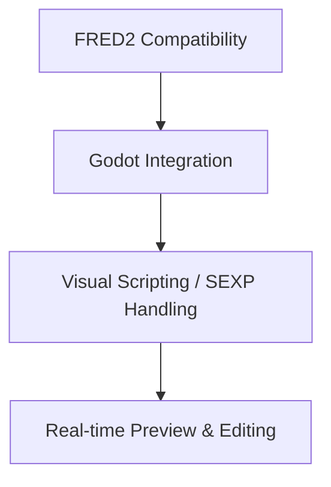

# Mission Editor Implementation Plan (GFRED)

This document outlines the strategy for implementing a Godot-based mission editor (GFRED) that maintains compatibility with Wing Commander Saga's mission design while leveraging Godot 4.4's native features. It incorporates analysis of the original FRED2 C++ codebase.

## Core Requirements



### Key Features (Based on FRED2)
1.  **Visual Mission Editing**
    *   3D space editing (Multiple viewports: perspective, top-down, ortho - `fredrender.cpp`).
    *   Waypoint management (Paths, individual points - `waypointpathdlg.cpp`).
    *   Event timeline/list editor (`eventeditor.cpp`).
    *   Ship/object placement and orientation (`fredview.cpp`, `orienteditor.cpp`).
    *   Wing management (`wing.cpp`, `wing_editor.cpp`).
    *   Grid system with snapping (`grid.cpp`, `adjustgriddlg.cpp`).
    *   Background and environment setup (starfield, nebula, asteroids - `bgbitmapdlg.cpp`, `asteroideditordlg.cpp`).
2.  **Scripting System (SEXP)**
    *   Visual node-based SEXP editor (`sexp_tree.cpp`).
    *   SEXP to GDScript conversion/interpretation (Requires custom implementation).
    *   Event triggers and conditions (`eventeditor.cpp`).
    *   Goal conditions (`missiongoalsdlg.cpp`).
    *   Conditional logic for briefings, debriefings, campaigns (`briefingeditordlg.cpp`, `debriefingeditordlg.cpp`, `campaigneditordlg.cpp`).
    *   Variable management (mission, campaign, player persistent - `addvariabledlg.cpp`, `modifyvariabledlg.cpp`).
3.  **Validation & Utility Tools**
    *   Mission testing integration (running the mission - `OnRunFreeSpace` in `fredview.cpp`).
    *   Error checking (`global_error_check` in `fredview.cpp`).
    *   Statistics display (`OnMiscStatistics` in `fredview.cpp`).
    *   Voice acting script generation (`VoiceActingManager` class in `voiceactingmanager.cpp`).
    *   Import tools (FS1 missions - `OnFileImportFSM`, weapon loadouts - `OnFileImportWeapons` in `freddoc.cpp`).

## Architecture

### Node Structure (Proposed)
```
MissionEditor (EditorPlugin)
├── DockManager (Control) # Manages various editor panels
│   ├── ObjectBrowser (ItemList/Tree)
│   ├── PropertyEditor (VBoxContainer with specific editors)
│   ├── EventEditor (Tree/GraphEdit)
│   ├── GoalEditor (Tree/GraphEdit)
│   ├── MessageEditor (ItemList/TextEdit)
│   └── ... (Other specialized editors)
├── ViewportContainer (SubViewportContainer)
│   ├── GridManager (Node3D) # Handles grid rendering and logic
│   ├── Viewport3D (SubViewport)
│   │   ├── Camera3D (EditorCamera)
│   │   ├── WorldEnvironment
│   │   └── MissionRoot (Node3D) # Parent for all mission objects
│   └── Viewport2D (SubViewport) # Optional for 2D views/briefing
├── ToolManager (Node) # Handles interaction modes
│   ├── SelectionTool (Node)
│   ├── PlacementTool (Node)
│   ├── WaypointTool (Node)
│   └── TransformGizmo (Node3D)
├── MissionDataManager (Node) # Handles loading, saving, state
│   ├── UndoRedoManager (UndoRedo)
│   └── AutosaveTimer (Timer)
└── InputManager (Node) # Handles mouse/keyboard input for the editor viewports (`fredview.cpp`)
```

## Document Management System (CFREDDoc)

Based on the FRED2 implementation (`freddoc.cpp`, `freddoc.h`, `missionsave.cpp`, `missionsave.h`), our mission editor needs a robust document management system.

### Mission File Handling
```mermaid
graph TD
    A[Mission File (.fs2)] --> B(Load Mission);
    B -- Parse --> C(Mission Data Structs);
    C -- Create/Update --> D(Godot Scene Nodes);
    D -- Edit --> E(User Modifications);
    E -- Save --> F(Save Mission);
    F -- Write --> A;
    G(Autosave Timer) --> F;
    H(Undo/Redo System) <--> E;
    H -- Creates --> I(Backup Files);
    I -- Restore --> C;
```

### Key Components (Based on `CFREDDoc` and `CFred_mission_save`)
1.  **Document Controller (`MissionDataManager` Node)**
    *   Mission loading/parsing (`load_mission` equivalent in `freddoc.cpp`): Handles reading `.fs2` files, populating internal data structures (like `Ships`, `Wings`, `Mission_events`, `Mission_goals`), and creating/updating Godot scene nodes. Needs error handling for unknown ship/weapon classes (`Num_unknown_ship_classes`, etc.). Handles player start conversion (`objp->type = OBJ_START`). Resolves alternate names (`Fred_alt_names`) and callsigns (`Fred_callsigns`).
    *   Mission saving (`save_mission_file` equivalent in `missionsave.cpp`): Writes mission data back to `.fs2` format.
        *   Uses a temporary file (`saving.xxx`) for safety.
        *   Performs error checking during save (`err` variable tracks section errors).
        *   Creates a backup (`.bak`) of the existing file before overwriting.
        *   Handles read-only file attributes (`GetFileAttributes`).
    *   Autosave functionality (`autosave_mission_file` in `freddoc.cpp`): Saves periodically to numbered backup files (e.g., `Backup.001`, `Backup.002`, rotating up to `BACKUP_DEPTH`). Triggered by modifications (`Autosave_disabled` flag).
    *   Undo/redo system (`autoload`, `check_undo` in `freddoc.cpp`): Leverages Godot's `UndoRedo` system. FRED2 used backup files (`MISSION_BACKUP_NAME`). Stores descriptions for undo actions (`undo_desc`). `Undo_available`, `Undo_count` track state.
    *   Modified flag tracking (`SetModifiedFlag`, `Local_modified` in `freddoc.cpp`): Uses Godot's resource/scene saving state or a custom flag.
    *   Backup file management (`cf_delete`, `cf_rename`): Handles rotation and deletion of backup files.
    *   Handles mission reset/new (`OnNewDocument`, `editor_init_mission` in `freddoc.cpp`).
    *   Manages mission path and filename (`mission_pathname`, `Mission_filename` in `freddoc.h`).
    *   Integrates global error checking (`global_error_check` in `fredview.cpp`).

### Mission Save System (`CFred_mission_save` in `missionsave.cpp/h`)
1.  **Save Process (`save_mission_file`)**
    *   Create a temporary file (`saving.xxx`).
    *   Write mission data section by section in the correct order (calls `save_*` functions).
    *   Perform error checking (`err` code indicates failure point).
    *   If successful, create a backup (`.bak`) of the current file (`cf_rename`).
    *   Rename the temporary file to the final mission file name (`cf_rename`).
2.  **Autosave Process (`autosave_mission_file`)**
    *   Saves to `MISSION_BACKUP_NAME.001`.
    *   Rotates existing backups (`.001` -> `.002`, etc., up to `BACKUP_DEPTH`) using `cf_rename`.
    *   Triggered by changes, potentially with a timer.
3.  **Data Sections (Order based on `missionsave.cpp`)**
    *   `#Mission Info` (`save_mission_info`): `$Version`, `$Name`, `$Author`, `$Created`, `$Modified`, `$Notes`/`$End Notes`, `$Mission Desc`/`$end_multi_text`, `+Game Type Flags`, `+Flags` (includes `MISSION_FLAG_FULLNEB`, `MISSION_FLAG_RED_ALERT`, `MISSION_FLAG_SCRAMBLE`), `+Num Players`, `+Num Respawns`, `+Max Respawn Time` (FSO), `+Disallow Support`, `+Hull Repair Ceiling` (FSO), `+Subsystem Repair Ceiling` (FSO), `+All Teams Attack`, `+Player Entry Delay`, `+Viewer pos`/`orient`, `+SquadReassignName`/`Logo`, `$Starting wing names` (FSO), `$Squadron wing names` (FSO), `$Team-versus-team wing names` (FSO), `$Load Screen 640/1024` (FSO), `$Skybox Model` (FSO), `+Skybox Flags` (FSO), `$AI Profile` (FSO), `$Contrail Speed Threshold` (FSO).
    *   `#Plot Info` (`save_plot_info`): Primarily legacy FS1 fields (`$Tour`, `$Pre-Briefing Cutscene`, etc.), potentially skipped or adapted for campaign links if needed. FRED2 saves "Blah".
    *   `#Sexp_variables` (`save_variables`): `$Variables` list with index, name, default value, type ("number", "string", "block"), and optional flags ("network-variable", "player-persistent", "campaign-persistent").
    *   `#Cutscenes` (`save_cutscenes`): `$Fiction Viewer Cutscene`, `$Command Brief Cutscene`, `$Briefing Cutscene`, `$Pre-game Cutscene`, `$Debriefing Cutscene` followed by filename and `+formula` (SEXP).
    *   `#Fiction Viewer` (`save_fiction`): `$File`, optional `$Font`.
    *   `#Command Briefing` (`save_cmd_briefs`): `$Stage Text`/`$end_multi_text`, `$Ani Filename`, `+Wave Filename`. Saves per team.
    *   `#Briefing` (`save_briefing`): `$start_briefing`/`$end_briefing`, `$num_stages`. Each stage (`$start_stage`/`$end_stage`) has `$multi_text`/`$end_multi_text`, `$voice`, `$camera_pos`/`orient`/`time`, `$num_lines` (with `$line_start`/`end`), `$num_icons`, `$Flags`, `$Formula`. Each icon (`$start_icon`/`$end_icon`) has `$type`, `$team`, `$class`, `$pos`, optional `$label`, `+id`, `$hlight`, `$mirror` (FSO). Saves per team.
    *   `#Debriefing_info` (`save_debriefing`): `$Num stages`. Each stage has `$Formula`, `$Multi text`/`$end_multi_text`, `$Voice`, `$Recommendation text`/`$end_multi_text`. Saves per team.
    *   `#Players` (`save_players`): `$Starting Shipname`, `$Ship Choices` (list of class names or `@variable` and counts or `@variable`), `+Weaponry Pool` (list of weapon names or `@variable` and counts or `@variable`). Includes `#Alternate Types` (`$Alt`) and `#Callsigns` (`$Callsign`). Saves per team.
    *   `#Objects` (`save_objects`): Iterates through `Ships` array. Saves ship properties (see below).
    *   `#Wings` (`save_wings`): Iterates through `Wings` array. Saves wing properties (see below).
    *   `#Events` (`save_events`): `$Formula`, `+Name`, `+Repeat Count`, `+Trigger Count` (FSO), `+Interval`, `+Score`, `+Chained` (delay), `+Objective`/`+Objective key`, `+Team`.
    *   `#Goals` (`save_goals`): `$Type`, `+Name`, `$MessageNew`/`$end_multi_text`, `$Formula`, `+Invalid`, `+No music`, `+Score`, `+Team`.
    *   `#Waypoints` (`save_waypoints`): Jump nodes (`$Jump Node`, `$Jump Node Name`, `+Model File`, `+Alphacolor`, `+Hidden`). Waypoint paths (`$Name`, `$List` of vector points).
    *   `#Messages` (`save_messages`): Optional `$Command Sender`/`Persona`. Messages have `$Name`, `$Team`, `$MessageNew`/`$end_multi_text`, `+Persona`, `+AVI Name`, `+Wave Name`.
    *   `#Reinforcements` (`save_reinforcements`): `$Name`, `$Type`, `$Num times`, `+Arrival Delay`, `+No Messages` (list), `+Yes Messages` (list).
    *   `#Background bitmaps` (`save_bitmaps`): `$Num stars`, `$Ambient light level`, `+Neb2`/`+Neb2Flags` (FullNeb), `+Nebula`/`+Color`/`+Pitch`/`+Bank`/`+Heading` (FS1 neb), `$Bitmap List` (multiple allowed, FSO), `$Sun`/`+Angles`/`+Scale`, `$Starbitmap`/`+Angles`/`+ScaleX`/`+ScaleY`/`+DivX`/`+DivY`, `$Environment Map` (FSO).
    *   `#Asteroid Fields` (`save_asteroid_fields`): `$Density`, `+Field Type`, `+Debris Genre`, `+Field Debris Type` (multiple), `$Average Speed`, `$Minimum`/`$Maximum` bounds, `+Inner Bound` (with `$Minimum`/`$Maximum`).
    *   `#Music` (`save_music`): `$Event Music`, `$Substitute Event Music` (FSO), `$Briefing Music`, `$Substitute Briefing Music` (FSO), `$Debriefing Success/Average/Fail Music`, `$Fiction Viewer Music` (FSO).
    *   `#End`: Marks the end of the file.
4.  **Format Compatibility**
    *   Support for different file formats (`Format_fs2_open`, `Format_fs2_retail`, `Format_fs1_retail` flags in `fredview.h`).
    *   Special tag conversion for retail compatibility (`convert_special_tags_to_retail` in `missionsave.cpp`). Replaces `$quote` with `''`, `$semicolon` with `,`.
    *   Conditional saving of FSO features based on format flags (e.g., `if (Format_fs2_open != FSO_FORMAT_RETAIL)`).
    *   Use of FSO version comments (`;;FSO x.y.z;;`) for newer features, managed by `fso_comment_push`/`pop`. `fout_version` ensures comment is prepended if needed. `bypass_comment` removes existing comments if feature isn't saved.
5.  **Error Handling**
    *   Section-by-section error checking during save (`err` variable in `CFred_mission_save`).
    *   Error codes indicate which section failed (e.g., -2 for mission info, -7 for objects).
    *   Detailed error reporting via `MessageBox`.
6.  **Ship and Object Data (`save_objects`, `save_common_object_data` in `missionsave.cpp`)**
    *   Ship properties: `$Name`, `$Class`, `$Team`, `$Location` (Vector3), `$Orientation` (Matrix), `$AI Behavior`, `+AI Class`.
    *   Arrival/Departure: `$Arrival Location`, `$Departure Location`, `+Arrival Distance`, `$Arrival Anchor`, `$Departure Anchor`, `+Arrival Delay`, `+Departure delay`, `+Arrival Paths` (FSO), `+Departure Paths` (FSO), `$Arrival Cue` (SEXP), `$Departure Cue` (SEXP).
    *   Flags: `+Flags` (list of strings like "cargo-known", "ignore-count", "protect-ship", "reinforcement", "no-shields", "escort", "player-start", "no-arrival-music", "no-arrival-warp", "no-departure-warp", "locked", "invulnerable", "hidden-from-sensors", "scannable", "kamikaze", "no-dynamic", "red-alert-carry", "beam-protect-ship", "guardian", "special-warp", "vaporize", "stealth", "friendly-stealth-invisible"), `+Flags2` (FSO list: "primitive-sensors", "no-subspace-drive", "nav-carry-status", "affected-by-gravity", "toggle-subsystem-scanning", "targetable-as-bomb", "no-builtin-messages", "primaries-locked", "secondaries-locked", "no-death-scream", "always-death-scream", "nav-needslink", "hide-ship-name", "set-class-dynamically", "lock-all-turrets", "afterburners-locked", "force-shields-on", "hide-log-entries", "no-arrival-log", "no-departure-log", "is_harmless").
    *   Subsystem status (`+Subsystem` blocks): `$Damage` (current hits), `+Cargo Name`. Turret weapon loadouts saved within subsystem block (`save_turret_info`).
    *   Weapon loadouts (`+Primary Banks`, `+Secondary Banks`, `+Sbank Ammo`): Overrides from ship class defaults.
    *   Docking information (`+Docked With`, `$Docker Point`, `$Dockee Point`): Saved for initially docked ships (`save_single_dock_instance`). Handles multi-docking save differences.
    *   AI Goals (`$AI Goals`): Saved via `save_ai_goals` (outputs SEXP list).
    *   Special effects/properties: `$Special Explosion` (FSO, with `+Damage`, `+Blast`, `+Inner Radius`, `+Outer Radius`, `+Shockwave Speed`), `+Special Hitpoints` (FSO), `+Special Shield Points` (FSO), `+Kamikaze Damage`, `+Hotkey`, `+Destroy At` (time), `+Orders Accepted` (bitmask), `+Group`, `+Score`, `+Assist Score Percentage` (FSO), `+Persona Index`, `$Texture Replace` (FSO, with `+old`, `+new`).
    *   Alternate type names (`$Alt`) and callsigns (`$Callsign`).
    *   Initial state: `+Initial Velocity`, `+Initial Hull`, `+Initial Shields`.
7.  **Waypoint and Jump Node System (`save_waypoints` in `missionsave.cpp`)**
    *   Waypoint lists: `$Name`, `$List` (list of `( x, y, z )` points). Saved via `save_waypoint_list`.
    *   Jump nodes: `$Jump Node` (Vector3 position), `$Jump Node Name`. Optional `+Model File`, `+Alphacolor`, `+Hidden`.

### Campaign File Handling (`save_campaign_file` in `missionsave.cpp`)
Based on FRED2's `save_campaign_file` function, the campaign system should:

```mermaid
graph TD
    A[Save Campaign] --> B(Sort Campaign Tree - `Campaign_tree_viewp->sort_elements()`);
    B --> C(Write Campaign Header - `$Name`, `$Type`, `+Description`, `+Num Players`, `$Flags`, Cutscenes, `+Starting Ships/Weapons`);
    C -- For Each Mission --> D(Write Mission Data);
    D -- Write --> E(Mission Name & Flags - `$Mission`, `+Flags`, `+Main Hall`, `+Debriefing Persona Index`);
    D -- Write --> F(SEXP Branching Logic - `+Formula`);
    F -- Write --> G(Mission Links - `next-mission`, `end-of-campaign`);
    D -- Write --> H(Mission Loop Data - `+Mission Loop`, `+Mission Loop Text`, `+Mission Loop Brief Anim/Sound`, `+Formula`);
    D -- Write --> I(Level & Position - `+Level`, `+Position`);
    I --> C;
    C --> J(Write End Marker - `#End`);
```

1.  **Campaign Structure (`campaign` struct in `missioncampaign.h`)**
    *   `$Name`, `$Type`, `+Description`.
    *   `+Num Players` (for multiplayer).
    *   `$Flags` (e.g., `CF_CUSTOM_TECH_DATABASE`, `CF_RESET_RANK`).
    *   `+Campaign Intro Cutscene`, `+Campaign End Cutscene`.
    *   `+Starting Ships`, `+Starting Weapons` (lists of allowed classes).
    *   `Campaign.missions` array (`cmission` struct): `$Mission` (filename), `+Flags`, `+Main Hall`, `+Debriefing Persona Index`, `+Level`, `+Position`.
2.  **Mission Links (`campaign_tree_link` struct in `CampaignTreeView.h`, `Links` array)**
    *   `+Formula` (SEXP `cond` structure). Saved via `save_campaign_sexp`.
    *   Links `from` mission index to `to` mission index (`next-mission` SEXP action).
    *   End-of-campaign links (`to == -1`) use `end-of-campaign` SEXP action.
3.  **Mission Loop Handling**
    *   Special link where `from == to` (`mission_loop` flag in `campaign_tree_link`).
    *   `+Mission Loop` section contains `+Formula` (SEXP condition).
    *   Optional `+Mission Loop Text`, `+Mission Loop Brief Anim`, `+Mission Loop Brief Sound`.

## Dialog System

Based on FRED2's extensive dialog system (`*dlg.cpp/h`, `*editor.cpp/h`), we need to implement the following dialogs, likely as separate Godot scenes or complex Control nodes:

1.  **Ship Editor Dialog (`CShipEditorDlg`)**
    *   Ship properties: Name (`m_ship_name`), Class (`m_ship_class`), Team (`m_team`), Cargo (`m_cargo1`), Persona (`m_persona`).
    *   Loadout configuration (Invokes `WeaponEditorDlg`).
    *   AI behavior settings (Invokes `ShipGoalsDlg`).
    *   AI Class (`m_ai_class`).
    *   Arrival/departure settings: Location (`m_arrival_location`, `m_departure_location`), Delay (`m_arrival_delay`, `m_departure_delay`), Distance (`m_arrival_dist`), Target (`m_arrival_target`, `m_departure_target`), Path Restrictions (`OnRestrictArrival`, `OnRestrictDeparture`).
    *   Arrival/Departure SEXP Cues (`m_arrival_tree`, `m_departure_tree`).
    *   Hotkey assignments (`m_hotkey`).
    *   Player ship designation (`m_player_ship`, `OnSetAsPlayerShip`).
    *   Special flags: No arrival/departure warp (`m_no_arrival_warp`, `m_no_departure_warp`), No arrival/departure log (`m_no_arrival_log`, `m_no_departure_log`).
    *   Score (`m_score`) and Assist Score (`m_assist_score`).
    *   Navigation buttons (`OnPrev`, `OnNext`).
    *   Access to other dialogs: Initial Status (`OnInitialStatus`), Flags (`OnFlags`), Ignore Orders (`OnIgnoreOrders`), Special Explosion (`OnSpecialExp`), Textures (`OnTextures`), Special Hitpoints (`OnSpecialHitpoints`), Alt Ship Classes (`OnAltShipClass`).
    *   Handles multi-edit state (`multi_edit`).
    *   Manages alternate ship names (`ship_alt_name_init/close`) and callsigns (`ship_callsign_init/close`).

2.  **Ship Flags Dialog (`ship_flags_dlg`)**
    *   Toggles for numerous ship flags (`shipp->flags`, `objp->flags`, `shipp->flags2`, `Ai_info[shipp->ai_index].ai_flags`):
        *   `SF_SCANNABLE` (Scannable)
        *   `SF_RED_ALERT_STORE_STATUS` (Red alert carry)
        *   `SF_REINFORCEMENT` (Reinforcement) - Managed via `set_reinforcement`.
        *   `OF_PROTECTED` (Protect ship)
        *   `OF_BEAM_PROTECTED` (Beam protect ship)
        *   `AIF_NO_DYNAMIC` (No dynamic goals)
        *   `SF_NO_ARRIVAL_MUSIC` (No arrival music)
        *   `AIF_KAMIKAZE` (Kamikaze) - Includes damage setting (`m_kdamage`).
        *   `OF_INVULNERABLE` (Invulnerable)
        *   `OF_TARGETABLE_AS_BOMB` (Targetable as bomb)
        *   `SF_IGNORE_COUNT` (Ignore count)
        *   `SF_HIDDEN_FROM_SENSORS` (Hidden from sensors)
        *   `SF2_PRIMITIVE_SENSORS` (Primitive sensors)
        *   `SF2_NO_SUBSPACE_DRIVE` (No subspace drive)
        *   `SF2_AFFECTED_BY_GRAVITY` (Affected by gravity)
        *   `SF_ESCORT` (Escort) - Includes priority setting (`m_escort_value`).
        *   `SF_CARGO_REVEALED` (Cargo known)
        *   `OF_SPECIAL_WARPIN` (Special warpin effect)
        *   `ship_guardian_threshold` (Guardian) - Non-zero value enables.
        *   `SF_VAPORIZE` (Vaporize on death)
        *   `SF2_STEALTH` (Stealth)
        *   `SF2_FRIENDLY_STEALTH_INVIS` (Friendly stealth invisible)
        *   `SF2_NAVPOINT_CARRY` (Navpoint carry status)
        *   `SF2_NAVPOINT_NEEDSLINK` (Navpoint needs link)
        *   `SF2_HIDE_SHIP_NAME` (Hide ship name)
        *   `SF2_HIDE_LOG_ENTRIES` (Hide log entries)
        *   `SF2_IS_HARMLESS` (Is harmless)
        *   `SF_KILL_BEFORE_MISSION` (Destroy before mission) - Includes time setting (`m_destroy_value`).
        *   `SF2_NO_BUILTIN_MESSAGES` (Disable builtin messages)
        *   `SF2_SET_CLASS_DYNAMICALLY` (Set class dynamically)
        *   `SF2_NO_DEATH_SCREAM` (No death scream)
        *   `SF2_ALWAYS_DEATH_SCREAM` (Always death scream)
        *   `SF2_TOGGLE_SUBSYSTEM_SCANNING` (Toggle subsystem scanning)
    *   Handles multi-edit state (tri-state checkboxes).

3.  **Ship Goals Dialog (`ShipGoalsDlg`)**
    *   AI goal management (`goalp` points to `Ai_info[ship].goals` or `Wings[wing].ai_goals`).
    *   Up to `ED_MAX_GOALS` (10) goals can be set.
    *   Goal behaviors (`m_behavior` array): Dropdown list filtered by ship capabilities (`ai_query_goal_valid`). Based on `Ai_goal_list`.
    *   Goal priority settings (`m_priority` array): 0-200.
    *   Target selection (`m_object` array): Dropdown list filtered by goal type (ships, wings, waypoints, paths). Stores type mask (`TYPE_SHIP`, `TYPE_WING`, etc.) with index.
    *   Subsystem targeting (`m_subsys` array): For `AI_GOAL_DESTROY_SUBSYSTEM`. Populated based on selected target ship.
    *   Docking point specification (`m_subsys` for docker, `m_dock2` for dockee): For `AI_GOAL_DOCK`. Populated based on selected ships.
    *   Handles multi-ship goal editing (common goals shown, others blanked).
    *   Goal validation (`verify_orders`, `error_check_initial_orders`).

4.  **Ship Special Damage Dialog (`ShipSpecialDamage`)**
    *   Custom explosion settings (`use_special_explosion` flag).
    *   Shockwave configuration (`use_shockwave` flag).
    *   Inner radius (`m_inner_rad`, `special_exp_inner`).
    *   Outer radius (`m_outer_rad`, `special_exp_outer`).
    *   Damage (`m_damage`, `special_exp_damage`).
    *   Blast (`m_blast`, `special_exp_blast`).
    *   Shockwave speed (`m_shock_speed`, `special_exp_shockwave_speed`).

5.  **Ship Special Hitpoints Dialog (`ShipSpecialHitpoints`)**
    *   Custom hull strength (`m_hull`, `special_hitpoints`). Enabled by `m_special_hitpoints_enabled`.
    *   Custom shield strength (`m_shields`, `special_shield`). Enabled by `m_special_shield_enabled`.
    *   Overrides ship class defaults (`Ship_info`).

6.  **Ship Textures Dialog (`CShipTexturesDlg`)**
    *   Texture replacement management (`Fred_texture_replacements` array).
    *   Lists original textures from the ship model (`pm->maps[i].textures`).
    *   Allows specifying new texture names (`m_new_texture`).
    *   Validates new texture filenames on save (`bm_load`, `bm_load_animation`).
    *   Stores replacements per ship name.

7.  **Wing Management System (`wing.cpp`, `wing.h`)**
    *   Handles wing creation, deletion, and modification logic.

    ```mermaid
    graph TD
        A[Select Ships] --> B{Form Wing?};
        B -- Yes --> C[Create Wing Dialog (Name)];
        C --> D[Validate Ships/Limits];
        D -- OK --> E[Assign Wing Number];
        E --> F[Rename Ships (e.g., Alpha 1)];
        E --> G[Set Wing Properties (Leader, etc.)];
        B -- No --> H[Cancel];

        I[Select Wing/Ships] --> J{Disband Wing?};
        J -- Yes --> K[Check Dependencies];
        K -- OK --> L[Remove Wing Association];
        L --> M[Rename Ships (Original/Generic)];
        J -- No --> N[Cancel];

        O[Select Wing] --> P{Delete Wing?};
        P -- Yes --> Q[Check Dependencies];
        Q -- OK --> R[Delete All Ships in Wing];
        R --> S[Remove Wing Definition];
        P -- No --> T[Cancel];
    ```

    ### Wing Creation and Management (`create_wing`, `delete_wing`, `remove_wing`, `remove_ship_from_wing`)
    1.  **Wing Creation Process (`create_wing`)**
        *   Triggered by `OnFormWing`.
        *   Requires marked ships (`OF_MARKED`).
        *   Validates ship types (`STI_AI_CAN_FORM_WING`). Ignores invalid types (`illegal_ships`).
        *   Enforces maximum ships per wing (`MAX_SHIPS_PER_WING`).
        *   Prompts for wing name (`create_wing_dlg`). Validates name against existing ships/wings/paths.
        *   Finds a free wing slot (`find_free_wing`).
        *   Assigns wing number (`Ships[ship].wingnum`).
        *   Sets leader (`Wings[wing].special_ship`) based on `cur_object_index`.
        *   Renames ships automatically (`sprintf(msg, "%s %d", Wings[wing].name, i + 1)`).
        *   Warns if ships from different teams are included.
        *   Ignores waypoints (`waypoints`).
        *   Sets default properties (waves=1, threshold=0, cues=true/false).
        *   Updates custom wing name indices (`update_custom_wing_indexes`).
    2.  **Wing Deletion (`delete_wing`)**
        *   Checks dependencies (SEXP references, AI goals) using `reference_handler`.
        *   Deletes associated reinforcement entry (`delete_reinforcement`).
        *   Invalidates references (`invalidate_references`).
        *   Deletes all member ships (`delete_object`).
        *   Clears wing definition (`Wings[wing].wave_count = 0`).
        *   Decrements `Num_wings`.
        *   Updates custom wing name indices.
    3.  **Wing Disbanding (`remove_wing`)**
        *   Triggered by `OnDisbandWing`. Requires exactly one whole wing marked (`query_single_wing_marked`).
        *   Checks dependencies.
        *   Removes wing association from each ship (`remove_ship_from_wing`, `remove_player_from_wing`).
        *   Renames ships back to generic names (`sprintf(buf, "%s %d", Ship_info[Ships[ship].ship_info_index].name, ship)`).
        *   Clears wing definition.
        *   Decrements `Num_wings`.
        *   Updates custom wing name indices.
    4.  **Wing Member Management (`remove_ship_from_wing`)**
        *   Removes a single ship from its wing.
        *   If wing becomes empty (or below `min`), potentially deletes the wing.
        *   Adjusts leader (`special_ship`) if the leader is removed.
        *   Shifts remaining members and renames them.
        *   Adjusts wave threshold if necessary.
        *   Resets ship's wing number (`Ships[ship].wingnum = -1`).

    ### Wing Formations (`Wing_formations`, `initialize_wings`)
    1.  **Formation System**
        *   Predefined formations stored in `Wing_formations` array (only one defined in `wing.cpp`).
        *   `formation` struct holds `num_vectors` and `offsets` array.
        *   `initialize_wings` sets up default formation(s).
        *   (Note: Actual application/rendering of formation seems missing in provided `wing.cpp`, likely handled elsewhere, possibly `ai_form_on_wing` or rendering code).

    ### Wing Properties (`wing` struct)
    1.  **Basic Properties**
        *   `name`: Wing name.
        *   `special_ship`: Index of the wing leader within the `ship_index` array.
        *   `squad_filename`: Filename for squad logo/insignia texture.
        *   `hotkey`: Assigned hotkey index (0-8 for F5-F12, -1 for none).
    2.  **Wave System**
        *   `num_waves`: Number of waves (respawns).
        *   `threshold`: Minimum number of ships remaining before the next wave arrives.
        *   `wave_delay_min`, `wave_delay_max`: Min/max delay time between waves.
    3.  **Wing Flags (`flags` bitfield)**
        *   `WF_IGNORE_COUNT`: Ignore count in statistics.
        *   `WF_NO_ARRIVAL_MUSIC`: No arrival music.
        *   `WF_NO_ARRIVAL_MESSAGE`: No arrival message.
        *   `WF_NO_ARRIVAL_WARP`: No arrival warp effect.
        *   `WF_NO_DEPARTURE_WARP`: No departure warp effect.
        *   `WF_NO_ARRIVAL_LOG`: No arrival log entry.
        *   `WF_NO_DEPARTURE_LOG`: No departure log entry.
        *   `WF_NO_DYNAMIC`: No dynamic AI goals assigned by game logic.
        *   `WF_REINFORCEMENT`: Is a reinforcement unit.
    4.  **Arrival/Departure Settings**
        *   `arrival_location`, `departure_location`: Enum defining location (hyperspace, docking bay, specific ship).
        *   `arrival_delay`, `departure_delay`: Time delay before arrival/departure.
        *   `arrival_distance`: Distance from anchor for certain arrival types.
        *   `arrival_anchor`, `departure_anchor`: Index of anchor ship or special anchor type.
        *   `arrival_path_mask`, `departure_path_mask`: Bitmask for restricting docking bay paths.
        *   `arrival_cue`, `departure_cue`: SEXP node index for arrival/departure conditions.
    5.  **Wing Goals (`ai_goals` array)**
        *   AI goals applied to the entire wing.
        *   Managed via `ShipGoalsDlg`.

    ### Wing Editor Dialog (`wing_editor`)
    *   Wing formation settings (Dropdown `IDC_WING_CRUISE_FORMATION`, `IDC_WING_ATTACK_FORMATION` - Note: FRED2 code seems to only have one formation type).
    *   Wing member management: List (`IDC_WING_SHIPS`), Add/Delete buttons (`IDC_WING_ADD_SHIP`, `IDC_WING_DELETE_SHIP`). Automatic renaming handled by core wing logic.
    *   Special ship designation (Leader): Dropdown (`IDC_WING_SPECIAL_SHIP`).
    *   Custom wing names: Text edit (`IDC_WING_NAME`). Validation against existing names.
    *   Wing squad logo/insignia selection: Text edit (`IDC_WING_SQUAD_LOGO`) and Browse button (`IDC_WING_SQUAD_LOGO_BUTTON`).
    *   Wing reinforcement status: Checkbox (`IDC_REINFORCEMENT`). Managed via `set_reinforcement`.
    *   Hotkey assignment: Dropdown (`IDC_HOTKEY`).
    *   Wave settings:
        *   Number of waves: Edit box + Spin (`IDC_WING_WAVES`, `IDC_SPIN_WAVES`).
        *   Wave threshold: Edit box + Spin (`IDC_WING_WAVE_THRESHOLD`, `IDC_SPIN_WAVE_THRESHOLD`).
        *   Wave delay: Min/Max edit boxes (`IDC_ARRIVAL_DELAY_MIN`, `IDC_ARRIVAL_DELAY_MAX`).
    *   Wing-specific flags: Checkboxes (`IDC_IGNORE_COUNT`, `IDC_NO_ARRIVAL_MUSIC`, `IDC_NO_ARRIVAL_MESSAGE`, `IDC_NO_ARRIVAL_WARP`, `IDC_NO_DEPARTURE_WARP`, `IDC_NO_WING_ARRIVAL_LOG`, `IDC_NO_WING_DEPARTURE_LOG`, `IDC_NO_DYNAMIC`).
    *   Arrival/departure settings:
        *   Location: Dropdowns (`IDC_ARRIVAL_LOCATION`, `IDC_DEPARTURE_LOCATION`).
        *   Delay: Edit boxes + Spin (`IDC_ARRIVAL_DELAY`, `IDC_DEPARTURE_DELAY`, `IDC_ARRIVAL_DELAY_SPIN`, `IDC_DEPARTURE_DELAY_SPIN`).
        *   Distance: Edit box (`IDC_ARRIVAL_DISTANCE`).
        *   Target/Anchor: Dropdowns (`IDC_ARRIVAL_TARGET`, `IDC_DEPARTURE_TARGET`). Populated by `management_add_ships_to_combo`.
        *   Path Restrictions: Buttons (`IDC_RESTRICT_ARRIVAL`, `IDC_RESTRICT_DEPARTURE`) invoke `restrict_paths` dialog.
    *   SEXP trees for arrival and departure conditions (`m_arrival_tree`, `m_departure_tree`).
    *   Navigation between wings: Prev/Next buttons (`IDC_PREV`, `IDC_NEXT`). Uses `cur_wing`.

8.  **Event Editor Dialog (`event_editor`)**
    *   Event creation (`OnButtonNewEvent`), deletion (`OnDelete`), insertion (`OnInsert`).
    *   SEXP tree (`m_event_tree`) for trigger conditions and actions (`formula`).
    *   Event properties: Name (`m_events[i].name`), Repeat Count (`m_repeat_count`), Trigger Count (`m_trigger_count`), Interval (`m_interval`), Score (`m_event_score`), Chaining (`m_chained`, `m_chain_delay`), Objective Text (`m_obj_text`, `m_obj_key_text`), Team (`m_team`).
    *   Manages associated messages (`m_messages` vector, `m_cur_msg`). Includes message text, name, persona, AVI/WAV files. Uses `save_message`.

9.  **Briefing Editor Dialog (`briefing_editor_dlg`)**
    *   Stage management (`m_cur_stage`, `OnAddStage`, `OnDeleteStage`, `OnInsertStage`).
    *   Camera positioning (`camera_pos`, `camera_orient`, `camera_time`, `OnSaveView`, `OnGotoView`).
    *   Icon placement (`OnMakeIcon`, `OnDeleteIcon`): Creates `OBJ_POINT` objects in the editor view. Stores icon properties (`brief_icon` struct: type, team, ship_class, pos, label, id, flags).
    *   Voice (`m_voice`, `OnBrowse`) and animation (`m_ani_filename` - seems missing in briefing, present in cmd brief) integration.
    *   Icon highlighting (`m_hilight`) and flipping (`m_flipicon`).
    *   Line connections between icons (`m_lines`, `OnLines`).
    *   SEXP formula (`m_tree`) for stage conditions.
    *   Handles multiple briefings per team (`m_current_briefing`).
    *   Cutscene flags (`m_cut_prev`, `m_cut_next`).
    *   Music selection (`m_briefing_music`, `m_substitute_briefing_music`).

10. **Campaign Editor Dialog (`campaign_editor`)**
    *   Displays campaign properties: Name (`m_name`), Type (`m_type`), Description (`m_desc`), Player Count (`m_num_players`), Intro/End Cutscenes (`m_intro_cutscene`, `m_end_cutscene`), Flags (`m_custom_tech_db`, `m_reset_rank`).
    *   Manages mission links via SEXP tree (`m_tree`). Each root node represents a branch condition.
    *   Displays selected mission properties: Main Hall (`IDC_MAIN_HALL`), Debriefing Persona (`IDC_DEBRIEFING_PERSONA`).
    *   Handles mission loop properties: Description (`m_loop_desc`), Briefing Animation (`m_loop_brief_anim`), Briefing Sound (`m_loop_brief_sound`). Toggled by `OnToggleLoop`.
    *   Integrates with `campaign_tree_view` for visual tree display and mission placement.
    *   Integrates with `campaign_filelist_box` (`m_filelist`) for adding missions.

11. **Mission Goals Dialog (`CMissionGoalsDlg`)**
    *   Goal management: Create (`OnButtonNewGoal`), edit, delete (via SEXP tree context menu).
    *   Goal properties: Name (`m_name`), Description (`m_goal_desc`), Type (`m_goal_type`: Primary, Secondary, Bonus), Score (`m_goal_score`).
    *   Goal validity flags (`m_goal_invalid`).
    *   Team assignments (`m_team`) for multiplayer missions.
    *   SEXP tree integration (`m_goals_tree`) for goal conditions (`formula`).
    *   Special flags: No music (`m_no_music`).
    *   Filters display by goal type (`m_display_goal_types`).

12. **Mission Notes Dialog (`CMissionNotesDlg`)**
    *   Mission metadata: Title (`m_mission_title`), Author (`m_designer_name`), Created/Modified dates (read-only).
    *   Mission notes (`m_mission_notes`).
    *   Mission description (`m_mission_desc`).
    *   Mission type settings: Single (`IDC_SINGLE`), Multi (`IDC_MULTI`), Training (`IDC_TRAINING`). Multiplayer subtypes: Coop (`IDC_COOP`), Team vs Team (`IDC_TEAMVTEAM`), Dogfight (`IDC_DOGFIGHT`).
    *   Mission flags: Red alert (`m_red_alert`), Scramble (`m_scramble`), Full War (`m_full_war`), Allow Dock Trees (`m_daisy_chained_docking`), No Promotion (`m_no_promotion`), No Builtin Msgs (`m_no_builtin_msgs`), No Traitor (`m_no_traitor`), Toggle Trails (`m_toggle_trails`), Support Repairs Hull (`m_support_repairs_hull`), Beam Free All (`m_beam_free_all_by_default`), Player Start AI (`m_player_start_using_ai`), No Briefing (`m_no_briefing`), No Debriefing (`m_no_debriefing`), Autopilot Cinematics (`m_autpilot_cinematics`), 2D Mission (`m_2d_mission`), Deactivate Autopilot (`m_no_autpilot`).
    *   Support ship settings: Disallow (`m_disallow_support`), Hull Repair Ceiling (`m_max_hull_repair_val`), Subsystem Repair Ceiling (`m_max_subsys_repair_val`).
    *   Respawn settings: Count (`m_num_respawns`), Max Delay (`m_max_respawn_delay`).
    *   Music and sound settings: Event Music (`m_event_music`, `m_substitute_event_music`), Command Persona (`m_command_persona`), Command Sender (`m_command_sender`).
    *   Loading screen configuration: 640x480 (`m_loading_640`), 1024x768 (`m_loading_1024`). Browse buttons (`OnLoad640`, `OnLoad1024`).
    *   AI profile selection (`m_ai_profile`).
    *   Custom wing name management (`OnCustomWingNames`).
    *   Squadron assignment (`m_squad_name`, `m_squad_filename`, `OnSquadLogo`).
    *   Contrail threshold (`m_contrail_threshold`, `m_contrail_threshold_flag`).

13. **Ship Selection Dialog (`ship_select`)**
    *   Lists ships, player starts, and waypoints (`m_ship_list`).
    *   Lists wings and waypoint paths (`m_wing_list`).
    *   Filtering options: Ships (`m_filter_ships`), Player Starts (`m_filter_starts`), Waypoints (`m_filter_waypoints`).
    *   Team/IFF-based filtering (`m_filter_iff` array, `OnFilterShipsIFF`).
    *   Wing selection integration: Selecting a wing selects/deselects its members.
    *   Selection manipulation: All (`OnAll`), Clear (`OnClear`), Invert (`OnInvert`).
    *   Updates `OF_TEMP_MARKED` flag on objects based on list selection. Applies changes to `OF_MARKED` on OK.

14. **Additional Dialogs**
    *   **Background Settings (`bg_bitmap_dlg`)**: Manages starfield (`m_slider`), nebula (`m_nebula_index`, `m_nebula_color`, pitch/bank/heading), suns (`OnAddSun`, `OnDelSun`), background bitmaps (`OnAddBitmap`, `OnDelBitmap`), subspace flag (`m_subspace`), fullneb settings (`m_fullneb`, `m_neb_intensity`, `m_neb2_texture`, poof flags), ambient light (`m_amb_red`, etc.), skybox model (`m_skybox_model`), environment map (`m_envmap`).
    *   **Asteroid Field Configuration (`asteroid_editor`)**: Enables/disables field (`m_enable_asteroids`), sets density (`m_density`), speed (`m_avg_speed`), bounds (`m_min_x` etc., `m_max_x` etc.), inner bounds (`m_enable_inner_bounds`, `m_box_min_x` etc.), field type (`m_field_type`: Active/Passive), debris genre (`m_debris_genre`: Asteroid/Ship), debris types (ship classes or asteroid subtypes).
    *   **Waypoint Path Management (`waypoint_path_dlg`)**: Edits path name (`m_name`). Validation against existing names.
    *   **Variable Management (`CAddVariableDlg`, `CModifyVariableDlg`)**: Creates and modifies SEXP variables, setting name, type (number/string), default value, and persistence flags. Includes validation and checks for usage before modification/deletion.
    *   **Command Briefing Editor (`cmd_brief_dlg`)**: Manages stages (`m_cur_stage`), text (`m_text`), animation file (`m_ani_filename`), and voice file (`m_wave_filename`).
    *   **Debriefing Editor (`debriefing_editor_dlg`)**: Manages stages (`m_cur_stage`), text (`m_text`), recommendation text (`m_rec_text`), voice file (`m_voice`), and SEXP formula (`m_tree`). Handles multiple debriefings per team (`m_current_debriefing`).
    *   **Fiction Viewer Settings (`FictionViewerDlg`)**: Sets story file (`m_story_file`), font file (`m_font_file`), and music (`m_fiction_music`).
    *   **Path Restriction Dialog (`restrict_paths`)**: Check list box (`m_path_list`) to enable/disable specific arrival/departure paths based on the anchor ship's model (`m_model`). Saves result to a bitmask (`*m_path_mask`).
    *   **Global Ship Flags Dialog (`SetGlobalShipFlags`)**: Buttons to apply flags (`OF_NO_SHIELDS`, `SF2_NO_SUBSPACE_DRIVE`, `SF2_PRIMITIVE_SENSORS`, `SF2_AFFECTED_BY_GRAVITY`) to all ships, often filtering by type (e.g., fighters/bombers).
    *   **Text View Dialog (`text_view_dlg`)**: Displays ship table data (`ships.tbl`, `*-shp.tbm`) for reference (`set(ship_class)`).
    *   **Weapon Editor Dialog (`WeaponEditorDlg`)**: Edits ship/turret weapon loadouts (`cur_weapon` points to `ship_weapon` struct). Configures primary (`m_gun1` etc.) and secondary (`m_missile1` etc.) weapons, sets ammunition levels (`m_ammo1` etc.) with maximum limits based on ship class (`get_max_ammo_count_for_bank`). Handles multi-ship editing. AI class selection (`m_ai_class`).
    *   **Voice Acting Manager (`VoiceActingManager`)**: Generates voice file names (`generate_filename`) based on abbreviations (`m_abbrev_*`) and numbering. Creates voice acting scripts (`OnGenerateScript`) by extracting text from briefings, messages, etc., using a template (`m_script_entry_format`). Allows filtering export by section.
    *   **Adjust Grid Dialog (`adjust_grid_dlg`)**: Sets grid center (`m_x`, `m_y`, `m_z`) and orientation (XY, XZ, YZ planes). Modifies `The_grid`.
    *   **Shield System Dialog (`shield_sys_dlg`)**: Globally enables/disables shields based on team (`m_team`) or ship type (`m_type`). Modifies `Shield_sys_teams` and `Shield_sys_types` arrays, which are then used to set `OF_NO_SHIELDS` flag on ships.
    *   **Ignore Orders Dialog (`ignore_orders_dlg`)**: Sets which player orders a ship/wing will ignore (`orders_accepted` bitmask). Dynamically shows checkboxes based on ship class defaults (`ship_get_default_orders_accepted`).
    *   **Alternate Ship Classes Dialog (`AltShipClassDlg`)**: Manages alternate ship classes for dynamic class switching (`Ships[].s_alt_classes` vector). Allows setting class via ship type (`m_set_from_ship_class`) or SEXP variable (`m_set_from_variables`). Marks one class as default (`m_default_to_class`).

## Rendering System (`fredrender.cpp`, `fredrender.h`)

The rendering system needs to provide clear visual feedback for mission editing (`render_frame`):

### Viewport Management
1.  **Multiple View Support**
    *   FRED2 uses a single 3D view, but the concept can be extended. Godot's `SubViewportContainer` and `SubViewport` are ideal.
    *   Camera control logic (`process_controls`, `physics_sim_editor`) handles different view modes (external camera `viewpoint == 0`, attached camera `viewpoint == 1`). View position/orientation stored in `view_pos`/`view_orient` or `Objects[view_obj].pos/orient`. Final view uses `eye_pos`, `eye_orient`.
    *   Camera position saving/restoring (`OnSaveCamera`, `OnRestoreCamera` using `saved_cam_pos`, `saved_cam_orient`).
2.  **Visual Aids**
    *   Coordinate grid (`fred_render_grid`, `The_grid` struct): Customizable spacing (`AdjustGridDlg`), anti-aliasing (`Aa_gridlines`). Renders lines based on grid properties (`gpoints1` etc.). Toggleable (`Show_grid`). Grid position lines (`render_model_x`, `render_model_x_htl`) show object height relative to grid. Toggleable (`Show_grid_positions`).
    *   Distance measurement (`display_distances`): Renders lines and text between marked objects (`OF_MARKED`). Toggleable (`Show_distances`).
    *   Object orientation indicators: Small sphere with a line indicating forward vector (`draw_orient_sphere`, `draw_orient_sphere2`). Size scales slightly with distance (`LOLLIPOP_SIZE`).
    *   Starfield background (`stars_draw`). Toggleable (`Show_stars`).
    *   Horizon line (`g3_draw_horizon_line`). Toggleable (`Show_horizon`).
    *   Compass (`render_compass`, `draw_compass_arrow`). Toggleable (`Show_compass`).
    *   Object info display (`display_ship_info`): Shows name, type, coordinates near the object. Toggleable (`Show_ship_info`, `Show_coordinates`). Cursor hover info (`Cursor_over`).
3.  **Selection Visualization**
    *   Outline highlighting (`Fred_outline` global variable): White for current object (`cur_object_index`), yellow for marked objects (`OF_MARKED`), IFF color for others. Applied during model rendering (`model_render` with `MR_SHOW_OUTLINE`). Toggleable (`Show_outlines`).
    *   Gizmos for transformation: Implied by editing modes (`Editing_mode`), but specific gizmo rendering not detailed in provided code. Godot's `EditorNode3DGizmo` can be used.
    *   Box selection rendering (`render_active_rect`, `box_marking`).
    *   Subsystem highlighting (`display_active_ship_subsystem`, `fredhtl_render_subsystem_bounding_box`, `Render_subsys` global): Draws bounding box around the selected subsystem (`cur_subsys`). Triggered by `OnNextSubsys`/`Prev`/`Cancel`.
4.  **Object Rendering (`render_models`, `render_one_model_htl`, `render_one_model_nohtl` in `fredrender.cpp`)**
    *   Ship models (`model_render`): Rendered with options for outlines (`MR_SHOW_OUTLINE`), dock points (`MR_BAY_PATHS`), AI paths (`MR_SHOW_PATHS`), lighting (`MR_NO_LIGHTING`), detail level (`MR_FULL_DETAIL`). Toggleable (`Show_ship_models`). Uses replacement textures (`Ships[z].ship_replacement_textures`). Filters based on `Show_ships` and `Show_iff` flags.
    *   Simplified icons (`draw_orient_sphere`, `draw_orient_sphere2`): Used when models are turned off or for non-ship objects (waypoints, starts). Size scales slightly with distance (`LOLLIPOP_SIZE`). Filters based on `Show_starts`, `Show_waypoints`.
    *   Waypoint visualization (`render_waypoints`): Renders spheres (lollipops) and lines connecting waypoints in a path (`rpd_line`). Current (`cur_waypoint`, `cur_waypoint_list`) / marked (`WL_MARKED`) waypoints are highlighted.
    *   Wing formation visualization: Not explicitly shown in rendering code, likely handled by AI positioning.
    *   Subsystem highlighting (See Selection Visualization).
    *   Texture replacement preview (Handled by `model_render` using `ship_replacement_textures`).
    *   Special effect visualization: Shockwaves, special explosions not explicitly rendered in editor view.
    *   Docking point visualization (`MR_BAY_PATHS` flag in `model_render`). Toggleable (`Show_dock_points`).
    *   Jump nodes (`jumpnode_render_all`).
    *   Asteroid fields (`draw_asteroid_field`): Renders bounding boxes (outer and inner). Toggleable (`Show_asteroid_field`).
    *   Background bitmaps (`stars_draw`).

## Input Handling (`fredview.cpp`, `fredrender.cpp`)

Based on FRED2's implementation, our input system should support:

1.  **Selection Modes (`OnLButtonDown`, `OnMouseMove`, `OnLButtonUp`, `select_object` in `fredview.cpp`)**
    *   Point selection: Clicking on an object (`select_object` uses ray casting `object_check_collision` or proximity check). `Cursor_over` stores hovered object index.
    *   Box selection (`box_marking`): Dragging a rectangle to select multiple objects (`select_objects` - not shown, but implied).
    *   Modifier keys:
        *   Ctrl+Click (`MK_CONTROL`): Create object (`create_object_on_grid`) or duplicate selection (`Dup_drag`).
        *   Shift+Click (`MK_SHIFT`): Add/Remove from selection (toggles mark).
    *   Selection locking (`Selection_lock`, `OnSelectionLock`): Prevents changing selection.
    *   Wing-based selection (`OnMarkWing`).
    *   List-based selection (`OnSelectList` invokes `ship_select` dialog).
    *   Clearing selection (`unmark_all`, `OnClear` in `ship_select`).
    *   Inverting selection (`OnInvert` in `ship_select`).
2.  **Transformation Controls (`drag_objects`, `drag_rotate_objects` in `fredview.cpp`)**
    *   Triggered by dragging (`button_down`, `moved`). Stores original state (`original_pos`, `rotation_backup`). Cancel drag (`cancel_drag`) restores state.
    *   Move mode (`Editing_mode == 1`): Drags selected objects along the grid plane or constrained axis. Uses ray casting (`fvi_ray_plane`) against grid (`The_grid`) or constraint plane (`Anticonstraint`). Updates object position (`objp->pos`) and calls `object_moved`.
    *   Rotate mode (`Editing_mode == 2`): Rotates selected objects based on mouse movement (`mouse_dx`, `mouse_dy`). Calculates rotation matrix (`rotmat`) and applies it (`vm_matrix_x_matrix`). Updates object orientation (`objp->orient`) and calls `object_moved`.
    *   Axis constraints (`Constraint`, `Anticonstraint`, `Single_axis_constraint`): Set via toolbar/menu (`OnConstrainX`, `OnConstrainY`, etc.). Applied during drag operations.
    *   Group transformation: Leader object (`cur_object_index`) determines movement/rotation delta.
        *   Group Rotation (`Group_rotate`): Other marked objects rotate and translate relative to the leader (`vm_vec_rotate`, `vm_vec_add`).
        *   Local Rotation (`!Group_rotate`): Other marked objects only translate with the leader (`vm_vec_add2`), but rotate individually around their own centers based on mouse input delta (`vm_matrix_x_matrix`).
    *   Snap-to-grid: Implicitly handled by grid-based movement calculations.
3.  **Camera Controls (`process_controls`, `Flying_controls_mode` in `fredrender.cpp`)**
    *   Flying controls (`Flying_controls_mode == 1`): Uses physics simulation (`physics_sim_editor`) based on keyboard/mouse input mapped via `grid_read_camera_controls`. Speed/rotation sensitivity set by `physics_speed`, `physics_rot`. Updates `view_pos`, `view_orient`.
    *   Keypad controls (`Flying_controls_mode == 0`): Direct movement/rotation based on keypad keys (`process_movement_keys`). Updates `view_pos`, `view_orient`.
    *   Saved camera positions (`OnSaveCamera`, `OnRestoreCamera` using `saved_cam_pos`, `saved_cam_orient`).
    *   "Look at selection" (`OnLookatObj`, `Lookat_mode`): Orients camera towards `cur_object_index` (`vm_vector_2_matrix`).
    *   Zoom Extents/Selected (`OnZoomExtents`, `OnZoomSelected`, `view_universe`). Calculates bounding box of selection and adjusts camera distance.
4.  **Editing Modes (`Editing_mode` global)**
    *   Select mode (`Editing_mode == 0`).
    *   Move mode (`Editing_mode == 1`).
    *   Rotate mode (`Editing_mode == 2`).
    *   Set via toolbar/menu (`OnSelect`, `OnSelectAndMove`, `OnSelectAndRotate`).
5.  **Keyboard Shortcuts (`OnKeyDown`, `OnKeyUp` in `fredview.cpp`)**
    *   System keys (`process_system_keys`): Cycle constraint ('), Rotate mode (R), Selection lock (Space), Cancel drag (Esc).
    *   Movement/Rotation keys (Keypad, A, Z).
    *   Object navigation (`OnNextObj`, `OnPrevObj`).
    *   Deletion (`OnEditDelete`, `OnEditDeleteWing`).
    *   Level/Align object (`OnLevelObj`, `OnAlignObj`, `level_controlled`, `verticalize_controlled`).
    *   Hide/Show objects (`OnHideObjects`, `OnShowHiddenObjects`).
    *   Undo (`OnEditUndo`).

## SEXP System (`sexp_tree.cpp`, `sexp_tree.h`)

Based on FRED2's SEXP (Symbolic Expression) system, we need to implement:

1.  **SEXP Tree (`sexp_tree` class derived from `CTreeCtrl`)**
    *   Visual representation using MFC `CTreeCtrl`. Godot equivalent: `Tree` control.
    *   Node-based editing: Adding, replacing, deleting nodes via context menus (`OnCommand`) or keyboard shortcuts (`OnKeydown`).
    *   Node types (`SEXPT_*` defines): `SEXPT_OPERATOR`, `SEXPT_NUMBER`, `SEXPT_STRING`, `SEXPT_VARIABLE`. Distinguished by icons (`BITMAP_*` defines). `SEXPT_VALID` flag indicates correctness.
    *   Node flags (`EDITABLE`, `OPERAND`, `COMBINED`). `EDITABLE` determines if label can be changed directly.
    *   Tree structure stored internally in `tree_nodes` vector (`sexp_tree_item` struct), mapping to `HTREEITEM` handles. Uses pooling (`TREE_NODE_INCREMENT`).
    *   Parent-child relationship tracking (`parent`, `child`, `next` indices).
2.  **SEXP Operators (`Operators` array in `sexp.cpp`)**
    *   Defined with text, value (`OP_*`), min/max args, argument types (`OPF_*`), return type (`OPR_*`).
    *   Categorized for menus (`op_menu`, `op_submenu` structs).
    *   Validation: Argument count (`min`, `max`), argument types (`query_operator_argument_type`), return type (`query_operator_return_type`). `sexp_query_type_match` checks compatibility.
    *   Default arguments generated (`add_default_operator`, `get_default_value`).
3.  **SEXP Variables (`Sexp_variables` array in `sexp.cpp`)**
    *   Managed by `CAddVariableDlg`, `CModifyVariableDlg`. Functions: `sexp_variable_count`, `sexp_add_variable`, `sexp_fred_modify_variable`, `sexp_variable_delete`, `sexp_variable_sort`.
    *   Stored with name, default value (`text`), type (`SEXP_VARIABLE_NUMBER`, `SEXP_VARIABLE_STRING`), and persistence flags (`SEXP_VARIABLE_PLAYER_PERSISTENT`, `SEXP_VARIABLE_CAMPAIGN_PERSISTENT`, `SEXP_VARIABLE_NETWORK`). `SEXP_VARIABLE_SET` flag indicates usage. `SEXP_VARIABLE_BLOCK` for special internal variables.
    *   Referenced in SEXP tree using `@variable-name`. Displayed in tree as `variable-name(default-value)`.
    *   Reference tracking (`get_variable_count`, `get_loadout_variable_count`).
4.  **SEXP Tree Handlers (`sexp_tree` methods)**
    *   Node allocation/deallocation (`allocate_node`, `free_node`, `free_node2`). Uses a vector with pooling (`find_free_node`).
    *   Node modification (`set_node`, `replace_operator`, `replace_data`, `replace_variable_data`).
    *   Adding nodes (`add_operator`, `add_data`, `add_variable_data`).
    *   Loading/Saving (`load_tree`, `save_tree`, `load_branch`, `save_branch`): Converts between internal tree structure and linear `Sexp_nodes` array used for mission saving.
    *   Clipboard operations (`ID_EDIT_COPY`, `ID_EDIT_PASTE`, `ID_EDIT_CUT`): Uses `Sexp_clipboard` global to store index of copied node in `Sexp_nodes`.
    *   Tree traversal and manipulation (`count_args`, `find_argument_number`, `verify_and_fix_arguments`).
    *   Modified state tracking (`modified` pointer, linked to dialog).
5.  **SEXP UI Components (`sexp_tree`, dialogs)**
    *   Context menus (`OnRclickTree`): Dynamically built based on selected node type and context (parent operator, argument position). Enables/disables add/replace options based on type compatibility. Uses `get_listing_opf` to populate data choices (ships, wings, numbers, etc.).
    *   In-place label editing (`OnBeginlabeleditTree`, `OnEndlabeleditTree`, `edit_label`).
    *   Drag and drop support (`OnBegindrag`, `OnMouseMove`, `OnLButtonUp`): Allows reordering root nodes (events, goals). Uses `CreateDragImage`.
    *   Image list (`CImageList`) for node type visualization (Operator, Data, Variable, Root, Chained, Dots).
    *   Help text display (`help_box`, `mini_help_box`, `update_help`): Shows operator description (`Sexp_help` struct) and argument help based on selection. Toggleable (`Show_sexp_help`).

## Mission Goals System (`missiongoalsdlg.cpp`, `missiongoalsdlg.h`)

Based on FRED2's mission goals implementation:

1.  **Goal Management (`CMissionGoalsDlg`)**
    *   Create (`OnButtonNewGoal`), edit, delete (via SEXP tree context menu `ROOT_DELETED` handler).
    *   Goal tree visualization (`m_goals_tree` of type `goal_sexp_tree`): Each root node is a goal.
    *   Goal type filtering (`m_display_goal_types` dropdown): Primary, Secondary, Bonus. Controls which goals are shown in the tree (`create_tree`).
    *   Maximum goal limit (`MAX_GOALS`).
    *   Stores goals temporarily in `m_goals` array during editing. `m_sig` array tracks original index.
2.  **Goal Properties (`mission_goal` struct in `missiongoals.h`)**
    *   Name (`m_name`, `name`). Must be unique. Renaming updates references (`update_sexp_references`).
    *   Description/Message (`m_goal_desc`, `message`).
    *   Type (`m_goal_type`, `type` bitmask: `GOAL_TYPE_MASK`). Set via dropdown.
    *   Validity flag (`m_goal_invalid`, `type` bitmask: `INVALID_GOAL`). Checkbox toggle.
    *   Score value (`m_goal_score`, `score`). Edit box.
    *   Team assignment (`m_team`, `team`) for multiplayer missions. Dropdown.
    *   Special flags: No music (`m_no_music`, `flags` bitmask: `MGF_NO_MUSIC`). Checkbox toggle.
    *   SEXP formula (`formula`) for goal completion conditions (must return boolean). Edited via `m_goals_tree`.
3.  **Goal Validation**
    *   Syntax checking for goal formulas (`check_sexp_syntax` called via `fred_check_sexp` in `global_error_check`).
    *   Goal name uniqueness checked during save/update (`OnOk`).
    *   Return type checking for goal formulas (must be boolean, enforced by `fred_check_sexp`).
4.  **Goal UI Components (`CMissionGoalsDlg`)**
    *   Goal tree view (`m_goals_tree`, `IDC_GOALS_TREE`) with integrated SEXP editor.
    *   Goal property editors: Name (`IDC_GOAL_NAME`), Description (`IDC_GOAL_DESC`), Type (`IDC_GOAL_TYPE_DROP`), Score (`IDC_GOAL_SCORE`).
    *   Team assignment dropdown (`IDC_OBJ_TEAM`). Enabled for multiplayer team missions.
    *   Special flag toggles: Invalid (`IDC_GOAL_INVALID`), No Music (`IDC_NO_MUSIC`).
    *   Display filter dropdown (`IDC_DISPLAY_GOAL_TYPES_DROP`).

## AI System (`ai.cpp`, `aigoals.cpp`, `objectdock.cpp`, etc.)

Based on FRED2's AI implementation:

1.  **AI Goals (`ai_goal` struct in `aigoals.h`, `Ai_info[].goals`, `Wings[].ai_goals`)**
    *   Managed via `ShipGoalsDlg`.
    *   Priority settings (0-200, `MAX_EDITOR_GOAL_PRIORITY`).
    *   Goal types (`ai_mode` enum): Chase, Guard, Waypoints, Dock, Undock, Warp, Destroy Subsystem, Disable, Disarm, Evade, Stay Near, Stay Still, Play Dead, Keep Safe Distance, Chase Any. Defined in `ai/aigoals.h`. List for editor in `Ai_goal_list`.
    *   Wing-based goals apply to all ships in the wing.
    *   Targets specified by name (`ship_name`). Can be ship, wing, waypoint path, or waypoint name. Stored internally with type mask (`TYPE_SHIP`, `TYPE_WING`, etc.).
    *   Docking goals specify docker and dockee points (`docker.name`, `dockee.name`).
    *   Subsystem goals specify subsystem name (`docker.name`).
2.  **AI Behaviors (`behavior` in `ai_info` struct)**
    *   Determines overall AI personality/skill. Selected via AI Class dropdown (`m_ai_class` in `WeaponEditorDlg`). Mapped from `Ai_class_names`.
    *   Influences accuracy, evasion, courage, etc. (Defined in `ai_profiles.cpp`).
3.  **Docking System (`objectdock.cpp`, `objectdock.h`)**
    *   Dock points defined in ship models (`polymodel->docking_bays`). Accessed via `model_get_dock_name`, `model_get_dock_index_type`, `model_get_num_dock_points`. List generated by `get_docking_list`.
    *   Docker/dockee relationship managed via `dock_instance` linked list on `object` struct.
    *   Docking validity checked (`ship_docking_valid`).
    *   Initial docking state set in editor (`initial_status` dialog, `update_docking_info`). Uses temporary `dockpoint_array`.
    *   AI handles docking maneuvers (`ai_dock_with_object`, `ai_do_objects_undocked_stuff`).
    *   Path restriction system (`restrict_paths` dialog, `arrival_path_mask`, `departure_path_mask`) controls allowed paths for docking bay arrivals/departures.
4.  **AI Profiles (`ai_profiles.cpp`, `ai_profiles.h`)**
    *   Mission-wide AI settings (`The_mission.ai_profile`). Selected in `MissionNotesDlg` (`IDC_AI_PROFILE`).
    *   Overrides default AI parameters (accuracy, agility, etc.).

## Background and Environment (`starfield.cpp`, `nebula.cpp`, `asteroid.cpp`, `bgbitmapdlg.cpp`)

Based on FRED2's background handling:

1.  **Starfield Management (`starfield_editor` dialog, `bg_bitmap_dlg`)**
    *   Star density control (`Num_stars`, `m_slider`). Max limit `MAX_STARS`.
    *   Sun placement (`Backgrounds[].suns` vector): Multiple suns allowed per background layer (`MAX_BACKGROUNDS`). Properties: filename (`s_name`), orientation (`s_pitch`, `s_bank`, `s_heading`), scale (`s_scale`). Managed via `OnAddSun`, `OnDelSun`.
    *   Background bitmap management (`Backgrounds[].bitmaps` vector): Multiple bitmaps per layer. Properties: filename (`b_name`), orientation (`b_pitch`, `b_bank`, `b_heading`), scale (`b_scale_x`, `b_scale_y`), tiling (`b_div_x`, `b_div_y`). Managed via `OnAddBitmap`, `OnDelBitmap`.
    *   Multiple background layers (`Backgrounds` array, `MAX_BACKGROUNDS`). Selected via `IDC_BACKGROUND_NUM`. Can be swapped (`OnSwapBackground`) or imported (`OnImportBackground`).
2.  **Nebula Settings (`bg_bitmap_dlg`)**
    *   FS1-style Nebula (`Nebula_index`, `Mission_palette`, `Nebula_pitch`, `Nebula_bank`, `Nebula_heading`): Selected via dropdowns (`IDC_NEBPATTERN`, `IDC_NEBCOLOR`). Uses `Nebula_filenames`, `Nebula_colors`.
    *   Full Nebula (`The_mission.flags & MISSION_FLAG_FULLNEB`, `m_fullneb`): Uses `Neb2_texture_name`, intensity/AWACS range (`Neb2_awacs`, `m_neb_intensity`), lightning storm type (`Mission_parse_storm_name`), poof effect flags (`Neb2_poof_flags`, `m_poof_*`). Toggleable trails (`m_toggle_trails`).
3.  **Asteroid Fields (`asteroid_editor` dialog, `Asteroid_field` struct)**
    *   Enable/disable (`m_enable_asteroids`).
    *   Density (`m_density`, `num_initial_asteroids`). Max `MAX_ASTEROIDS`.
    *   Average speed (`m_avg_speed`, `vel` vector).
    *   Outer bounds (`m_min_x` etc., `m_max_x` etc.).
    *   Inner bounds (`m_enable_inner_bounds`, `m_box_min_x` etc.). Requires minimum thickness (`MIN_BOX_THICKNESS`).
    *   Field type (`m_field_type`): Active (`FT_ACTIVE`) or Passive (`FT_PASSIVE`).
    *   Debris genre (`m_debris_genre`): Asteroid (`DG_ASTEROID`) or Ship (`DG_SHIP`).
    *   Debris types (`field_debris_type` array): Asteroid subtypes (checkboxes `IDC_SUBTYPE*`) or ship debris species/sizes (comboboxes `IDC_SHIP_DEBRIS*`).
4.  **Environmental Effects (`bg_bitmap_dlg`)**
    *   Ambient light level (`The_mission.ambient_light_level`): RGB sliders (`m_amb_red`, `m_amb_green`, `m_amb_blue`).
    *   Skybox model (`The_mission.skybox_model`, `m_skybox_model`). Includes flags (`The_mission.skybox_flags`, `m_sky_flag_*` checkboxes like `MR_NO_LIGHTING`, `MR_ALL_XPARENT`, etc.).
    *   Environment map (`The_mission.envmap_name`, `m_envmap`). `ENVMAP` global stores loaded bitmap handle.

## Conversion Strategy

(No changes needed based on the provided C++ code snippets - this section is about the overall plan)

## Implementation Phases

(No changes needed based on the provided C++ code snippets - this section is about the overall plan)

## Technical Considerations

### Resource Management
*   FRED2 uses integer IDs for dialog controls (`IDC_*`) defined in `resource.h`. Godot uses node paths or unique names.
*   Centralized resource management in Godot can be achieved using Autoloads (singletons) or custom Resource files.

### Godot Features
*   Use `EditorPlugin` for GFRED integration.
*   Leverage `UndoRedo` system (FRED2 has its own backup file system).
*   Implement custom `Resource` types for ships, weapons, missions, etc.
*   Use `SubViewport` for editing views.
*   Utilize Godot's built-in dialog system (`AcceptDialog`, `FileDialog`, custom scenes) instead of MFC dialogs.

### Performance
*   (FRED2 performance considerations are less relevant to Godot, but the concepts apply).
*   Godot handles spatial partitioning (via physics server), LOD (via `VisibleOnScreenNotifier3D`, manual scripting), background processing (via `Thread`, `WorkerThreadPool`), and scene management automatically to a large extent.

## Migration Tools

### Python Conversion Script
```python
def convert_mission(mission_file):
    """Convert FRED2 mission to Godot scene"""
    mission_data = parse_fred_mission(mission_file)
    godot_scene = build_godot_scene(mission_data)
    return godot_scene
```

### SEXP to GDScript Converter
```python
def convert_sexp_to_gdscript(sexp_node):
    """Convert SEXP expressions to GDScript code"""
    if sexp_node.is_operator():
        return map_operator_to_gdscript(sexp_node)
    elif sexp_node.is_variable():
        return f"mission_vars.get('{sexp_node.name}')"
    else:
        return sexp_node.value
```

### SEXP Tree Implementation in GDScript

```gdscript
class_name SEXPTree
extends Control

# Node types
const SEXPT_UNUSED = 0x0000
const SEXPT_OPERATOR = 0x0010
const SEXPT_NUMBER = 0x0020
const SEXPT_STRING = 0x0040
const SEXPT_VARIABLE = 0x0080
const SEXPT_VALID = 0x1000

# Node flags
const NOT_EDITABLE = 0x00
const OPERAND = 0x01
const EDITABLE = 0x02
const COMBINED = 0x04

# Tree node structure
class SEXPTreeNode:
    var type: int = SEXPT_UNUSED
    var parent: int = -1
    var child: int = -1
    var next: int = -1
    var flags: int = 0
    var text: String = ""
    var handle = null  # Will be a TreeItem in Godot

# Main tree implementation
var tree_nodes: Array[SEXPTreeNode] = []
var total_nodes: int = 0
var root_item: int = -1
var modified: bool = false
var help_box: RichTextLabel = null

func _init():
    # Initialize tree
    clear_tree()

func clear_tree(op: String = ""):
    total_nodes = 0
    tree_nodes.clear()
    
    if op != "":
        # Create root node with operator
        var node = allocate_node(-1)
        set_node(node, SEXPT_OPERATOR | SEXPT_VALID, op)
        build_tree()

func allocate_node(parent: int = -1, after: int = -1) -> int:
    # Find or create a new node
    var node = find_free_node()
    if node < 0:
        # Expand the array if needed
        var old_size = tree_nodes.size()
        for i in range(100):  # TREE_NODE_INCREMENT
            var item = SEXPTreeNode.new()
            tree_nodes.append(item)
        node = old_size
    
    # Initialize the node
    tree_nodes[node].type = 0x0001  # SEXPT_UNINIT
    tree_nodes[node].parent = -1
    tree_nodes[node].child = -1
    tree_nodes[node].next = -1
    tree_nodes[node].flags = 0
    tree_nodes[node].text = "<uninitialized tree node>"
    tree_nodes[node].handle = null
    total_nodes += 1
    
    # Link to parent if provided
    if parent != -1:
        var i = tree_nodes[parent].child
        if i == -1:
            tree_nodes[parent].child = node
        else:
            while (i != after) and (tree_nodes[i].next != -1):
                i = tree_nodes[i].next
            tree_nodes[node].next = tree_nodes[i].next
            tree_nodes[i].next = node
    
    tree_nodes[node].parent = parent
    return node

func set_node(node: int, type: int, text: String):
    tree_nodes[node].type = type
    tree_nodes[node].text = text

func build_tree():
    # Clear and rebuild the visual tree
    # This would create TreeItems in a Godot Tree control
    add_sub_tree(0, null)  # Root is null in Godot

func save_tree(node: int = -1) -> int:
    # Convert tree to SEXP format for saving
    if node < 0:
        node = root_item
    return save_branch(node)

func load_tree(index: int, default_op: String = "true"):
    # Load tree from SEXP format
    clear_tree()
    root_item = 0
    
    if index < 0:
        var cur = allocate_node(-1)
        set_node(cur, SEXPT_OPERATOR | SEXPT_VALID, default_op)
        build_tree()
        return
    
    # Load from SEXP nodes
    load_branch(index, -1)
    build_tree()

# Variable handling
func get_variable_count(var_name: String) -> int:
    # Count references to a variable in the tree
    var count = 0
    for node in tree_nodes:
        if node.type & SEXPT_VARIABLE:
            if var_name in node.text:
                count += 1
    return count

func modify_variable(old_name: String, new_name: String, type: int):
    # Update all references to a variable
    for i in range(tree_nodes.size()):
        if tree_nodes[i].type & SEXPT_VARIABLE:
            if old_name in tree_nodes[i].text:
                # Replace variable name in all references
                var text = tree_nodes[i].text
                text = text.replace(old_name, new_name)
                tree_nodes[i].text = text
                tree_nodes[i].type = type | SEXPT_VARIABLE
                
                # Update visual representation
                if tree_nodes[i].handle:
                    tree_nodes[i].handle.set_text(0, text)
```

### Wing Implementation in GDScript

```gdscript
class_name Wing
extends Resource

# Wing constants
const MAX_SHIPS_PER_WING = 6
const MAX_WING_WAVES = 10

# Wing flags
const WF_IGNORE_COUNT = (1 << 0)
const WF_NO_ARRIVAL_MUSIC = (1 << 1)
const WF_NO_ARRIVAL_MESSAGE = (1 << 2)
const WF_NO_ARRIVAL_WARP = (1 << 3)
const WF_NO_DEPARTURE_WARP = (1 << 4)
const WF_NO_ARRIVAL_LOG = (1 << 5)
const WF_NO_DEPARTURE_LOG = (1 << 6)
const WF_NO_DYNAMIC = (1 << 7)

# Wing properties
@export var name: String = ""
@export var squad_logo: String = ""
@export var special_ship: int = 0  # Wing leader index
@export var hotkey: int = -1
@export var flags: int = 0

# Wave properties
@export var num_waves: int = 1
@export var threshold: int = 0
@export var wave_delay_min: int = 0
@export var wave_delay_max: int = 0

# Arrival/departure properties
@export var arrival_location: int = 0
@export var arrival_delay: int = 0
@export var arrival_distance: float = 0.0
@export var arrival_anchor: int = -1
@export var arrival_path_mask: int = 0
@export var arrival_cue: int = -1  # SEXP index

@export var departure_location: int = 0
@export var departure_delay: int = 0
@export var departure_anchor: int = -1
@export var departure_path_mask: int = 0
@export var departure_cue: int = -1  # SEXP index

# Ship references
@export var ship_index: Array[int] = []
@export var wave_count: int = 0

# AI goals
@export var ai_goals: Array = []

func _init():
    # Initialize with default values
    ship_index.resize(MAX_SHIPS_PER_WING)
    for i in range(MAX_SHIPS_PER_WING):
        ship_index[i] = -1
    
    # Initialize AI goals
    ai_goals.resize(5)  # MAX_AI_GOALS
    for i in range(ai_goals.size()):
        ai_goals[i] = {
            "ai_mode": 0,  # AI_GOAL_NONE
            "priority": -1,
            "target_name": "",
            "target_type": -1,
            "subsystem": -1
        }

func has_flag(flag: int) -> bool:
    return (flags & flag) != 0

func set_flag(flag: int, value: bool) -> void:
    if value:
        flags |= flag
    else:
        flags &= ~flag

func add_ship(ship_id: int) -> bool:
    if wave_count >= MAX_SHIPS_PER_WING:
        return false
    
    ship_index[wave_count] = ship_id
    wave_count += 1
    return true

func remove_ship(ship_id: int) -> bool:
    for i in range(wave_count):
        if ship_index[i] == ship_id:
            # If this is the special ship, reset to first ship
            if special_ship == i:
                special_ship = 0
            
            # Move last ship to this position if not the last one
            if i < wave_count - 1:
                ship_index[i] = ship_index[wave_count - 1]
            
            wave_count -= 1
            return true
    
    return false

func get_formation_position(ship_index: int, leader_transform: Transform3D) -> Vector3:
    # Implementation would use the wing formation data to calculate positions
    # This is a simplified version
    if ship_index == special_ship:
        return leader_transform.origin
    
    # Basic formation offset (would use actual formation data in real implementation)
    var offset = Vector3.ZERO
    match ship_index:
        1: offset = Vector3(-5, 1, -5)
        2: offset = Vector3(5, 1, -5)
        3: offset = Vector3(-10, 2, -10)
        4: offset = Vector3(10, 2, -10)
        5: offset = Vector3(0, 3, -15)
    
    return leader_transform.origin + leader_transform.basis * offset
```

### Variable Management Implementation

```gdscript
class_name SEXPVariableManager
extends Resource

# Variable types
const SEXP_VARIABLE_NUMBER = 0x0001
const SEXP_VARIABLE_STRING = 0x0002
const SEXP_VARIABLE_PLAYER_PERSISTENT = 0x0004
const SEXP_VARIABLE_CAMPAIGN_PERSISTENT = 0x0008
const SEXP_VARIABLE_NETWORK = 0x0010
const SEXP_VARIABLE_SET = 0x0020
const SEXP_VARIABLE_BLOCK = 0x0040

# Variable structure
class SEXPVariable:
    var variable_name: String = ""
    var text: String = ""  # Default value
    var type: int = 0
    
    func is_number() -> bool:
        return (type & SEXP_VARIABLE_NUMBER) != 0
        
    func is_string() -> bool:
        return (type & SEXP_VARIABLE_STRING) != 0
        
    func is_persistent() -> bool:
        return (type & (SEXP_VARIABLE_PLAYER_PERSISTENT | SEXP_VARIABLE_CAMPAIGN_PERSISTENT)) != 0

# Variable storage
var variables: Array[SEXPVariable] = []
var max_variables: int = 100  # MAX_SEXP_VARIABLES

func _init():
    # Initialize empty variables
    for i in range(max_variables):
        var var_item = SEXPVariable.new()
        variables.append(var_item)

func add_variable(name: String, default_value: String, type: int) -> int:
    # Find first unused slot
    var index = -1
    for i in range(max_variables):
        if (variables[i].type & SEXP_VARIABLE_SET) == 0:
            index = i
            break
    
    if index == -1:
        push_error("Maximum number of SEXP variables reached")
        return -1
    
    # Set up the variable
    variables[index].variable_name = name
    variables[index].text = default_value
    variables[index].type = type | SEXP_VARIABLE_SET
    
    # Sort variables by name
    sort_variables()
    
    return index

func modify_variable(index: int, name: String, default_value: String, type: int) -> bool:
    if index < 0 or index >= max_variables:
        return false
        
    if (variables[index].type & SEXP_VARIABLE_SET) == 0:
        return false
    
    # Update the variable
    variables[index].variable_name = name
    variables[index].text = default_value
    variables[index].type = type | SEXP_VARIABLE_SET
    
    return true

func delete_variable(index: int) -> bool:
    if index < 0 or index >= max_variables:
        return false
        
    if (variables[index].type & SEXP_VARIABLE_SET) == 0:
        return false
    
    # Clear the variable
    variables[index].variable_name = ""
    variables[index].text = ""
    variables[index].type = 0
    
    return true

func get_variable_index(name: String) -> int:
    for i in range(max_variables):
        if (variables[i].type & SEXP_VARIABLE_SET) != 0:
            if variables[i].variable_name == name:
                return i
    return -1

func sort_variables():
    # Sort variables by name (only the ones that are set)
    var temp_vars = []
    
    # Collect set variables
    for i in range(max_variables):
        if (variables[i].type & SEXP_VARIABLE_SET) != 0:
            temp_vars.append(variables[i])
    
    # Sort by name
    temp_vars.sort_custom(func(a, b): return a.variable_name < b.variable_name)
    
    # Clear all variables
    for i in range(max_variables):
        variables[i].variable_name = ""
        variables[i].text = ""
        variables[i].type = 0
    
    # Copy back sorted variables
    for i in range(temp_vars.size()):
        variables[i].variable_name = temp_vars[i].variable_name
        variables[i].text = temp_vars[i].text
        variables[i].type = temp_vars[i].type
```

## Testing Plan

1. **Unit Tests**
   - Individual components
   - Tool functionality
   - SEXP conversion
   - Variable management
   - Operator validation
   - Tree structure integrity

2. **Integration Tests**  
   - Full mission loading
   - Event triggering
   - AI behavior
   - SEXP tree evaluation
   - Variable persistence
   - Campaign branching logic

3. **Compatibility Tests**
   - Original mission files
   - Modded content
   - Cross-platform
   - Backward compatibility with FRED2 missions
   - Forward compatibility with future Godot versions

4. **UI Tests**
   - Dialog functionality
   - Tree editing operations
   - Context menu behavior
   - Drag and drop operations
   - Keyboard shortcuts
   - Help system accuracy

## Next Steps
1. Prototype core editing tools
2. Develop dialog system framework
3. Implement SEXP conversion
4. Create testing framework
5. Build documentation
6. Implement variable management system
7. Develop SEXP tree visualization
8. Create operator argument validation
9. Build context-sensitive help system
10. Implement mission save/load functionality
