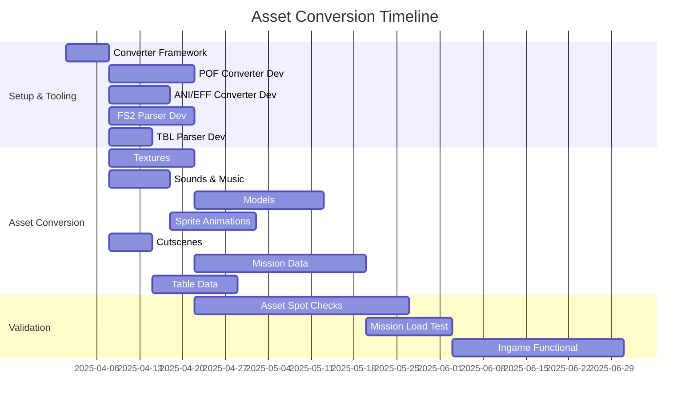
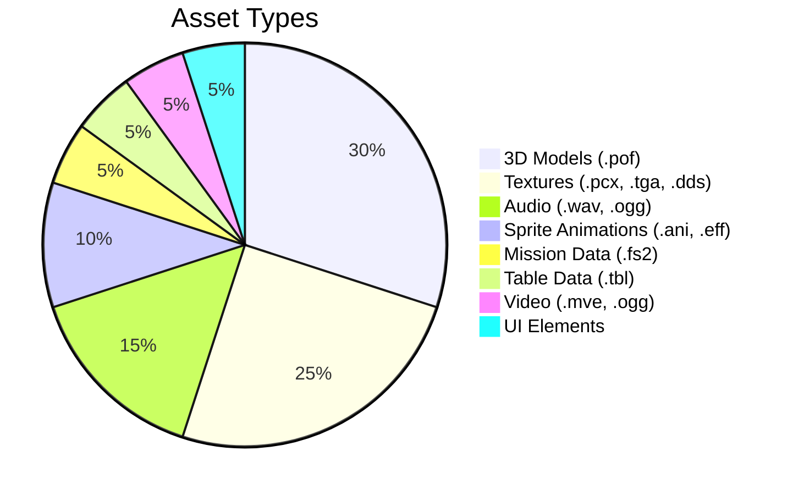

# Asset Conversion Pipeline

This document outlines the process for converting Wing Commander Saga's assets to Godot-compatible formats while maintaining their original quality and functionality.

# Asset Conversion Strategy

This document outlines the process for converting Wing Commander Saga assets to Godot-compatible formats while maintaining the original game's visual and audio fidelity.

1. Data Extraction & Conversion Pipeline

   A. Analysis & Documentation
   - Document WC Saga file system structure (`cfile.md`, `cfilesystem.md`) including packed files (`.vp`).
   - Analyze proprietary file formats (.fs2, .pof, .ani, .eff, table formats) and create format specs.
   - Create test suite for format validation.
   - Map asset relationships and dependencies.

   B. Core Conversion Infrastructure
   - Create base converter framework (Python recommended).
   - Implement file system traversal and management (handle `.vp` extraction).
   - Build logging and error handling system.
   - Create progress tracking and reporting.
   - Develop validation framework.

   C. Media Extractors
   - Audio Conversion System:
     - Extract compressed audio files
     - Convert to OGG/WAV with metadata
     - Handle sound effects and music separately
   - Image Processing:
     - Extract texture files (PCX, TGA, DDS, PNG, JPG) and palettes. (`bmpman.md`)
     - Convert to Godot-compatible formats (PNG, WebP) preserving alpha channels.
     - Handle sprite sheets (.ANI, .EFF) and UI elements.
     - Address DDS compression formats (DXT1, DXT3, DXT5) during conversion. (`ddsutils.md`)
   - Video Processing:
     - Identify source formats (MVE, OGG Theora). (`cutscene.cpp`, `movie.cpp`)
     - Extract video files
     - Convert to WebM format (recommended) or OGV.
     - Preserve quality and aspect ratios.
   - Text & Localization:
     - Extract string tables and text resources (`*.tbl` files).
     - Convert to JSON or Godot Translation (`.po`) format.
     - Preserve formatting and metadata.

   D. 3D Asset Pipeline
   - Model Extraction:
     - Parse model file structures (.pof). (`model_part1.md`)
     - Extract vertex data, faces, UVs, normals.
     - Extract hardpoints, collision data, docking points, thruster points, glow points, paths, insignias.
     - Handle material references (texture names).
   - Model Conversion:
     - Convert to GLTF intermediate format.
     - Process materials and textures (assign converted textures).
     - Handle multiple LODs if present.
   - 2D/Sprite Animation Processing:
     - Extract sprite-based animation data (.ANI, .EFF). (`animplay.cpp`, `packunpack.cpp`)
     - Handle RLE compression variants during extraction.
     - Convert frames to Godot SpriteFrames resources.
     - Preserve frame timing (FPS), keyframes, looping, and ping-pong behavior metadata.
     - Address potential color translation requirements (palettes).
   - Collision Data:
     - Extract collision meshes (potentially from shield mesh data or BSP). (`model_part1.md`)
     - Convert to Godot collision shapes (`CollisionShape3D` with appropriate `Shape3D` resource).
     - Preserve physics properties if applicable (though most physics are likely runtime).

   E. Mission & Game Data
   - Mission Structure:
     - Parse mission files (.fs2 format). (`mission_part1.md`, `fred2_part2_missionsave.md`)
     - Extract core components: Mission Info, Player Starts, Ships, Wings, Waypoints, Events, Goals, Messages, Briefings, Debriefings, Reinforcements, Variables (S-Expressions).
     - Convert mission structure to a Godot-friendly format (JSON, YAML, or custom Godot Resource `.tres`).
     - Preserve event triggers (S-Expressions) and conditions - requires careful mapping to Godot signals/scripting logic or direct Sexp evaluation if feasible.
   - Game Logic Data:
     - Extract game rules and parameters from tables (`ships.tbl`, `weapons.tbl`, `ai_profiles.tbl`, `iff_defs.tbl`, `species_defs.tbl`, `rank.tbl`, `medals.tbl`, etc.). (`species_defs.md`, `stats.md`)
     - Convert ship/weapon specifications, AI profiles, IFF rules, species data, etc., into Godot Resources (`.tres`).
     - Preserve AI behavior definitions and parameters.
     - Handle localization strings (`*.tbl` text sections).

   F. Pipeline Integration
   - Create automated batch processing system.
   - Implement asset dependency resolution (e.g., models needing specific textures).
   - Add incremental conversion support (re-convert only changed source assets).
   - Create conversion progress tracking.
   - Add error recovery and resume capability.

   G. Quality Assurance
   - Implement automated testing (e.g., check file existence, basic format validation).
   - Create validation checks for each asset type (e.g., texture dimensions, model vertex count).
   - Add visual preview tools (simple Godot scenes to view converted assets).
   - Create comparison tools for original vs converted (where feasible).
   - Document conversion process and target Godot formats/structures.

   H. Asset Organization
   - Design Godot project structure (`assets/`, `resources/`).
   - Create resource naming conventions.
   - Implement asset categorization system (subfolders).
   - Set up version control guidelines (Git LFS for large assets).
   - Create asset metadata system (potentially within `.import` files or separate metadata files).


## Image Assets

```mermaid
graph LR
    A[Source Assets (.pcx, .tga, .dds, .ani, .eff)] --> B[Texture/Sprite Conversion]
    B --> C[Optimization (e.g., WebP)]
    C --> D[Godot Import (PNG, WebP, SpriteFrames)]
```

### Conversion Pipeline
1. **Texture Conversion (PCX, TGA, DDS, PNG, JPG -> PNG/WebP)**
   - Use tools like ImageMagick, `texconv`, or custom scripts. (`bmpman.md`, `ddsutils.md`)
   - Preserve alpha channels.
   - Handle DDS formats (DXT1/3/5).
   - Maintain original color palettes if needed for specific effects, otherwise convert to standard RGBA.

2. **Sprite Sheets (.ANI, .EFF -> SpriteFrames)**
   - Develop a tool to parse .ANI/.EFF formats, handling RLE decompression. (`animplay.cpp`, `packunpack.cpp`)
   - Extract individual frames.
   - Assemble frames into Godot `SpriteFrames` resources.
   - Store metadata (FPS, looping, keyframes) alongside the resource or within it if possible.
   - Generate `.tres` resource files.

3. **UI Elements**
   - Convert to Control-compatible formats (PNG).
   - Create theme resources (`Theme`).
   - 9-patch scaling where needed (`NinePatchRect`).

## Audio Assets

### Sound Effects
- Convert WAV to OGG Vorbis or keep as WAV.
- Normalize volume levels.
- Add metadata tags (if needed, though likely handled by resource definition).
- Create `GameSounds` resource mapping IDs/names to `AudioStream` resources.

### Music
- Convert to streaming OGG Vorbis.
- Loop point preservation (Godot's Ogg import options).
- Volume balancing (can be done in Godot via `AudioStreamPlayer`).

## 3D Models

```mermaid
graph TD
    A[POF Models] --> B[Conversion to GLTF]
    B --> C[Material Setup in Godot]
    C --> D[Collision Shape Generation]
    D --> E[LOD Setup (if applicable)]
    E --> F[Godot Scene (.tscn)]
```

### Model Conversion
1. Use POF to GLTF converter (custom tool needed). (`model_part1.md`)
2. Preserve during conversion (or store as metadata):
   - Hardpoints (as `Marker3D` positions/orientations).
   - Collision meshes (export separately or generate in Godot).
   - Texture mappings (UVs).
   - Docking points, thruster points, etc. (as `Marker3D`).
   - Submodel hierarchy and offsets.

3. Create Godot scenes (`.tscn`) with:
   - Proper node hierarchy (`Node3D` for submodels).
   - `MeshInstance3D` for visuals.
   - `CollisionShape3D` for physics.
   - `Marker3D` nodes for points.
   - Material overrides applied.

## Mission Data
### Source Format (.fs2)
- Text-based format using S-Expressions. (`mission_part1.md`, `fred2_part2_missionsave.md`)
- Defines mission elements: ships, wings, waypoints, goals, events, messages, briefings, etc.
- Contains initial ship placements, AI orders, event triggers, and mission logic.

### Conversion Tools
- Python scripts to parse mission files (.fs2).
- Convert mission structure and data to JSON or Godot Resource (`.tres`) format.
- Preserve:
  - Waypoints (`Path3D` nodes or Vector3 arrays).
  - Events (Map to Godot signals or custom event system. S-Expressions need careful handling: either parse into a Godot-executable format like function calls/signal connections, or use a Lua/Sexp evaluation library if integrated).
  - Objectives/Goals (Store goal definitions and conditions as data, manage state via script).
  - Dialog triggers (Link messages to events/conditions).
  - Ship/Wing definitions (Convert to data referencing ship/weapon resources).
  - Briefing/Debriefing data (Store text, voice paths, camera positions, icon data).

## Video Assets
### Source Formats
- .mve (Interplay MVE)
- .ogg (Theora/Vorbis)
### Conversion Tools
- FFmpeg or similar tools.
- Target Format: WebM (VP9/Opus) or OGV (Theora/Vorbis).
- Preserve audio track and aspect ratio.

## Directory Structure

```
assets/
├── converted/
│   ├── ships/         # GLTF models, .tscn scenes
│   ├── weapons/       # GLTF models, .tscn scenes
│   ├── textures/      # PNG/WebP textures
│   ├── animations/    # SpriteFrames resources (.tres)
│   ├── effects/       # Particle scenes, shaders
│   ├── ui/            # UI textures, fonts
│   ├── sounds/        # OGG/WAV sound effects
│   ├── music/         # OGG music tracks
│   ├── voices/        # OGG voice files
│   └── cutscenes/     # WebM/OGV video files
├── source/            # Original extracted assets (optional, for reference)
│   ├── wcsaga_models/
│   ├── wcsaga_textures/
│   └── ...
└── processing/        # Intermediate files during conversion
    ├── temp/
    └── logs/
resources/             # Godot-specific resource files
├── ships/             # ShipData.tres files
├── weapons/           # WeaponData.tres files
├── missions/          # MissionData.tres or JSON files
├── game_data/         # GameSounds.tres, MusicTracks.tres, etc.
└── ui/                # Theme.tres files
```

## Conversion Scripts

### Python Requirements
```python
import os
import json
# Libraries for parsing POF, ANI, FS2, TBL (likely custom or adapted)
# Image manipulation (Pillow)
# Potentially audio processing (pydub, soundfile)
# Potentially video processing (ffmpeg bindings)
from PIL import Image
import numpy as np
# import imageio # May not be needed if using Pillow/ffmpeg
# import pyogg # Godot handles OGG playback
```

### Sample Conversion Code (Conceptual)
```python
# (Texture conversion example remains similar)

def convert_ani(source_ani, target_tres_path):
    # 1. Parse ANI header (width, height, num_frames, fps, flags)
    # 2. Loop through frames:
    #    - Decompress frame data (RLE variants)
    #    - Save frame as PNG temporarily
    # 3. Create SpriteFrames resource in Godot (via script or manually)
    #    - Add each frame PNG
    #    - Set animation properties (fps, looping from flags)
    # 4. Save SpriteFrames resource to target_tres_path
    pass

def convert_mission(source_fs2, target_resource_path):
    # 1. Parse FS2 S-Expressions
    # 2. Create MissionData resource (custom Godot resource class)
    # 3. Populate resource fields:
    #    - mission_info (name, author, etc.)
    #    - player_starts (ship choices, weapon pools)
    #    - ships (list of ship definitions: name, class, position, team, ai_goals_sexp)
    #    - wings (list of wing definitions: name, ships, arrival/departure cues_sexp)
    #    - goals (list of goal definitions: name, type, condition_sexp, message)
    #    - events (list of event definitions: condition_sexp, action_sexp)
    #    - messages (dictionary mapping message names to text/voice/persona)
    #    - briefing/debriefing data
    # 4. Save resource using ResourceSaver.save()
    pass
```

## Validation Process

1. Visual comparison (Models, Textures, Animations, UI).
2. Pixel-perfect testing (where applicable, e.g., UI layout).
3. Audio waveform analysis (check for conversion artifacts).
4. Functional testing in-engine (Mission loading, event triggers, animations playing correctly, cutscenes playing).
5. Data validation (check converted resource files against original table data).

## Timeline



## Next Steps
1. Finalize converter framework design.
2. Develop/adapt parsers for POF, ANI/EFF, FS2, TBL formats.
3. Define Godot Resource structures for mission and game data.
4. Implement batch conversion scripts.
5. Set up validation procedures and tools.


## Asset Types Overview



## Conversion Tools

### Core Conversion Script
```python
class AssetConverter:
    def __init__(self):
        # Expanded supported formats
        self.supported_formats = {
            'models': ['.pof'],
            'textures': ['.pcx', '.tga', '.dds', '.png', '.jpg'],
            'audio': ['.wav', '.ogg'],
            'animations': ['.ani', '.eff'],
            'missions': ['.fs2'],
            'tables': ['.tbl'],
            'video': ['.mve', '.ogg'] # Note: .ogg could be audio or video
        }

    def convert_asset(self, source_path, target_dir):
        """Main conversion method"""
        ext = os.path.splitext(source_path)[1].lower()
        filename = os.path.basename(source_path)

        if ext in self.supported_formats['models']:
            return self.convert_model(source_path, target_dir)
        elif ext in self.supported_formats['textures']:
            return self.convert_texture(source_path, target_dir)
        elif ext in self.supported_formats['audio']:
             # Check if it's OGG video first? Need better logic.
            if ext == '.ogg' and self.is_video(source_path):
                 return self.convert_video(source_path, target_dir)
            return self.convert_audio(source_path, target_dir)
        elif ext in self.supported_formats['animations']:
            return self.convert_animation(source_path, target_dir)
        elif ext in self.supported_formats['missions']:
            return self.convert_mission(source_path, target_dir)
        elif ext in self.supported_formats['tables']:
            return self.convert_table(source_path, target_dir)
        elif ext in self.supported_formats['video'] or (ext == '.ogg' and self.is_video(source_path)):
             return self.convert_video(source_path, target_dir)
        # Add specific methods like convert_model, convert_animation, etc.

    def is_video(self, path):
        # Placeholder: Implement logic to differentiate OGG audio/video
        # Could check file headers or rely on naming conventions/directories
        return False # Default to audio for .ogg unless determined otherwise
```

## Conversion Process

### 1. 3D Models
- **Source Formats**: .pof (PCS2)
- **Target Format**: .gltf/.glb (Scene), `.tres` (Metadata Resource)
- **Conversion Steps**:
  1. Parse POF, extract geometry, UVs, hierarchy, points (dock, weapon, etc.).
  2. Export geometry/hierarchy to GLTF.
  3. Export metadata (points, subsystem links) to a `.tres` file associated with the model scene.
  4. In Godot: Generate collision shapes, setup materials referencing converted textures.

### 2. Textures
- **Source Formats**: .pcx, .tga, .dds, .png, .jpg
- **Target Format**: .png/.webp
- **Conversion Steps**:
  1. Load source texture.
  2. Handle palettes (convert to RGBA or preserve if needed).
  3. Handle DDS compression (DXT1/3/5).
  4. Convert to PNG or WebP.
  5. Generate mipmaps (can be done in Godot import).

### 2b. Sprite Animations
- **Source Formats**: .ani, .eff
- **Target Format**: Godot `SpriteFrames` (.tres) + PNG spritesheet
- **Conversion Steps**:
  1. Parse source file, decompress frames.
  2. Assemble frames into a spritesheet PNG.
  3. Create `SpriteFrames` resource referencing the spritesheet.
  4. Store metadata (FPS, looping, keyframes) in the `.tres` file.

### 3. Audio
- **Source Formats**: .wav, .ogg
- **Target Format**: .ogg (compressed) / .wav (uncompressed)
- **Conversion Steps**:
  1. Load source audio.
  2. Normalize levels (optional, can be done in Godot).
  3. Convert to target format (OGG preferred for size).

### 4. Video
- **Source Formats**: .mve, .ogg (Theora)
- **Target Format**: .ogv, .webm
- **Conversion Steps**:
  1. Use FFmpeg or similar tools for conversion.
  2. Ensure audio track is included.

### 5. Mission Data
- **Source Format**: .fs2 (S-Expression based)
- **Target Format**: JSON / Godot Resource (.tres)
- **Conversion Steps**:
  1. Parse S-Expressions using a Python library or custom parser.
  2. Map mission elements (ships, wings, goals, events) to target structure (Dictionary or custom Resource class).
  3. Convert S-Expression logic to a Godot-compatible representation (e.g., dictionaries representing conditions/actions, or potentially GDScript snippets if generating code).

### 6. Table Data
- **Source Format**: .tbl (Custom text format)
- **Target Format**: Godot Resource (.tres) / JSON
- **Conversion Steps**:
  1. Parse TBL format (handle `$Name`, `+Property`, etc.).
  2. Create corresponding Godot Resource types (e.g., `ShipData.tres`, `WeaponData.tres`).
  3. Populate and save resources.

## Directory Structure

```
assets/
├── converted/
│   ├── models/        # GLTF models
│   ├── textures/      # PNG/WebP textures
│   ├── animations/    # PNG spritesheets
│   ├── sounds/        # OGG/WAV sound effects
│   ├── music/         # OGG music tracks
│   ├── voices/        # OGG voice files
│   └── cutscenes/     # WebM/OGV video files
├── source/            # Original extracted assets (optional)
│   ├── wcsaga_models/
│   ├── wcsaga_textures/
│   └── ...
└── processing/        # Intermediate files
    ├── temp/
    └── logs/
resources/             # Godot-specific resource files
├── ships/             # ShipData.tres, ModelMetadata.tres
├── weapons/           # WeaponData.tres
├── missions/          # MissionData.tres or JSON files
├── animations/        # SpriteFrames.tres files
├── game_data/         # GameSounds.tres, MusicTracks.tres, SpeciesData.tres, etc.
├── ui/                # Theme.tres files
└── shaders/           # Shader resources (.gdshader)
```

## Quality Control

### Validation Checks
1. **Models**:
   - Polygon count within limits.
   - UV maps intact.
   - Material assignments correct (referencing converted textures).
   - `Marker3D` points correctly positioned/oriented.
2. **Textures**:
   - No color banding or compression artifacts.
   - Alpha channels preserved.
   - Resolution appropriate.
3. **Sprite Animations**:
   - Correct number of frames in `SpriteFrames`.
   - FPS and looping properties match original.
   - Visual fidelity compared to original.
4. **Audio**:
   - No clipping or distortion.
   - Consistent volume levels (relative).
   - Proper looping points (if applicable).
5. **Video**:
   - Playback smooth, audio synced.
   - Aspect ratio correct.
6. **Mission/Table Data**:
   - All necessary fields populated in `.tres`/JSON.
   - References (ship names, weapon names) are valid.
   - S-Expression logic representation is consistent.

## Batch Processing

```python
def batch_convert(source_dir, target_dir):
    """Process all assets in a directory"""
    converter = AssetConverter() # Instantiate the converter
    for root, dirs, files in os.walk(source_dir):
        # Determine target subdirectory based on source root/file type
        relative_path = os.path.relpath(root, source_dir)
        current_target_dir = os.path.join(target_dir, relative_path) # Adjust as needed
        os.makedirs(current_target_dir, exist_ok=True)

        for file in files:
            source_path = os.path.join(root, file)
            try:
                # Pass appropriate target directory based on asset type
                converter.convert_asset(source_path, current_target_dir) # Modify convert_asset to use target_dir
            except Exception as e:
                print(f"Error converting {source_path}: {e}")
                # Log error
```

## Performance Considerations

1. **Parallel Processing**:
   ```python
   # Use multiprocessing for CPU-bound tasks like parsing/conversion logic
   import concurrent.futures
   # ... inside batch_convert ...
   # with concurrent.futures.ProcessPoolExecutor() as executor:
   #     futures = [executor.submit(converter.convert_asset, source_path, current_target_dir) for source_path in file_list]
   #     # Handle results/errors
   ```

2. **Memory Management**:
   - Process large assets (big textures, complex models, long videos) individually or in chunks.
   - Ensure file handles are closed properly.
   - Clear large data structures between file conversions if memory becomes an issue.

## Error Handling

1. **Logging System**:
   ```python
   import logging
   logging.basicConfig(filename='conversion.log', level=logging.INFO,
                       format='%(asctime)s - %(levelname)s - %(message)s')

   def log_conversion(source, target, status, message=""):
       if status == 'success':
           logging.info(f"{source} -> {target}: {status} {message}")
       else:
           logging.error(f"{source} -> {target}: {status} {message}")
   ```
   *(Integrate logging calls into `AssetConverter` methods)*

2. **Recovery Options**:
   - Implement try-except blocks around individual file conversions in `batch_convert`.
   - Maintain a list of failed conversions for later review/retry.
   - Consider a mechanism to track successfully converted files to allow resuming interrupted batches.

## Integration with Godot

### Import Settings
1. **3D Models (.gltf)**:
   - Godot importer settings: Generate collision shapes (convex/concave), import animations (if any), set scale.
   - Link `.tres` metadata resource via script in the `.tscn` scene.
2. **Textures (.png, .webp)**:
   - Godot importer settings: Configure compression (VRAM), generate mipmaps, set filter modes (linear/nearest), detect sRGB.
3. **Sprite Animations (`SpriteFrames.tres`)**:
   - Load directly as resources.
4. **Audio (.ogg, .wav)**:
   - Godot importer settings: Looping mode, normalization (optional).
5. **Video (.ogv, .webm)**:
   - Load directly as `VideoStream` resources.

## Testing Procedure

1. **Visual Inspection**:
   - Open converted scenes/resources in Godot editor.
   - Compare models, textures, UI elements against screenshots/videos of the original.
   - Play animations and cutscenes.
   - Check for artifacts, missing elements, incorrect colors/lighting.
2. **Functional Testing**:
   - Load a converted mission in a test scene.
   - Verify ship spawning, basic AI movement.
   - Test weapon firing sounds and basic effects.
   - Check if mission goals/events trigger (basic placeholders).
   - Verify audio playback (music, sfx, voice).

## Next Steps

1. Implement core conversion scripts for each major asset type (POF, ANI, FS2, TBL).
2. Create test conversion batch with representative samples of each asset type.
3. Develop validation tools/scripts (e.g., comparing file counts, basic data checks).
4. Set up automated pipeline using batch scripts and potentially task runners.
