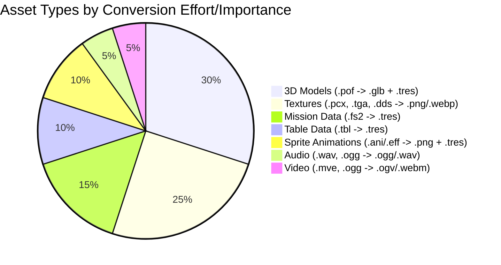

# Asset Conversion Pipeline

This document outlines the process for converting Wing Commander Saga's assets to Godot-compatible formats while maintaining their original quality and functionality, including visual and audio fidelity.

## 1. Data Extraction & Conversion Pipeline Strategy

The core strategy involves analyzing original formats, developing conversion tools, processing assets by type, integrating them into Godot, and ensuring quality.

   **A. Analysis & Documentation**
   *   Document WC Saga file system structure (`cfile.md`, `cfilesystem.md`) including packed files (`.vp`).
   *   Analyze proprietary file formats (.fs2, .pof, .ani, .eff, table formats) and create format specs.
   *   Create test suite for format validation.
   *   Map asset relationships and dependencies.
   *   **Identify Relations (Scripting - See `tasks/08_scripting.md`):**
        *   **SEXP System (`parse/sexp.*`, `parse/parselo.*`):** Mapped to Godot's `SexpNode`, `SexpEvaluator`, `SexpOperatorHandler`, `SexpVariableManager`, `SexpConstants` (`scripts/scripting/sexp/`). Requires a parser (offline, python script in migration_tools) to convert `.fs2` SEXP text to `SexpNode` resources within `MissionData.tres`.
        *   **Hook System (`parse/scripting.*`, `parse/lua.*`):** Mapped to Godot's `ScriptState`, `ConditionedHook`, `ScriptCondition`, `ScriptAction`, `ScriptHook` (`scripts/scripting/hook_system/`). Requires `ScriptSystem` Autoload (`scripts/core_systems/script_system.gd` - MISSING) for integration and loading definitions from converted `scripting.tbl`/`*-sct.tbm`. Requires `GlobalConstants.gd` (MISSING).
        *   **Expression Parser (`variables/variables.*`):** Not currently implemented in Godot.
        *   **Encryption (`parse/encrypt.*`):** Not currently implemented in Godot. Optional.

   **B. Potential Godot Solutions & Integration**
   *   **SEXP Evaluation:** Use the implemented `SexpEvaluator` (`scripts/scripting/sexp/sexp_evaluator.gd`) and `SexpOperatorHandler` (`scripts/scripting/sexp/sexp_operators.gd`) to execute SEXP logic stored as `SexpNode` trees within the converted `MissionData.tres` (see `scripts/resources/mission/mission_data.gd`).
   *   **Hook System:** Use the implemented `ScriptState` (`scripts/scripting/hook_system/script_state.gd`) and related Resource classes (`ConditionedHook`, etc.) to manage conditional GDScript execution. Hook definitions need to be loaded (by `ScriptSystem` - `scripts/core_systems/script_system.gd`) from converted `scripting.tbl`/`*-sct.tbm` data (likely into `.tres` or JSON format first). Game events trigger checks via Godot signals connected to `ScriptSystem`.
   *   **Table Data:** Load converted `.tbl` data (e.g., `ShipData.tres`, `WeaponData.tres`, `AIProfile.tres`) using Godot's `load()` function into custom Resource scripts (e.g., `scripts/resources/ship_weapon/ship_data.gd`, `scripts/resources/ship_weapon/weapon_data.gd`, `scripts/resources/ai/ai_profile.gd`). Mission data (`.fs2`) is converted to `MissionData.tres` (defined by `scripts/resources/mission/mission_data.gd`) and loaded via `MissionLoader.gd`.

   **C. Media Extractors & Conversion**
   *   **Audio Conversion System:**
        *   Extract compressed audio files (WAV, OGG).
        *   Convert to OGG Vorbis (preferred for size/streaming) or keep as WAV (uncompressed). Normalize volume levels (optional).
        *   Handle sound effects and music separately. Preserve loop points for music (via Godot import settings).
        *   Create `GameSounds` resource mapping IDs/names to `AudioStream` resources.
   *   **Image Processing:**
        *   Extract texture files (PCX, TGA, DDS, PNG, JPG) and palettes. (`bmpman.md`)
        *   Convert to Godot-compatible formats (PNG, WebP) preserving alpha channels. Handle DDS compression formats (DXT1, DXT3, DXT5) during conversion. (`ddsutils.md`)
        *   Handle sprite sheets (.ANI, .EFF): Parse formats, handle RLE decompression (`animplay.cpp`, `packunpack.cpp`). Extract individual frames. Assemble frames into Godot `SpriteFrames` resources (`.tres`) + PNG spritesheets. Store metadata (FPS, looping, keyframes) in the `.tres` file.
        *   Handle UI Elements: Convert to PNG. Create `Theme` resources. Handle 9-patch scaling (`NinePatchRect`).
   *   **Video Processing:**
        *   Identify source formats (MVE, OGG Theora). (`cutscene.cpp`, `movie.cpp`)
        *   Extract video files.
        *   Convert to WebM (VP9/Opus - recommended) or OGV (Theora/Vorbis) using FFmpeg or similar.
        *   Preserve quality, aspect ratios, and audio tracks.

   **D. 3D Asset Pipeline**
   *   **Model Extraction:**
        *   Parse model file structures (.pof). (`model_part1.md`)
        *   Extract vertex data, faces, UVs, normals.
        *   Extract hardpoints, collision data, docking points, thruster points, glow points, paths, insignias.
        *   Handle material references (texture names).
   *   **Model Conversion:**
        *   Use POF to GLTF converter (custom tool needed).
        *   Export geometry/hierarchy to GLTF.
        *   Export metadata (points, subsystem links) to a separate `.tres` file (e.g., `ModelMetadata.tres`) associated with the model scene.
        *   Process materials and assign converted textures during import/setup in Godot.
        *   Handle multiple LODs if present.
   *   **Collision Data:**
        *   Extract collision meshes (potentially from shield mesh data or BSP). (`model_part1.md`)
        *   Convert to Godot collision shapes (`CollisionShape3D` with appropriate `Shape3D` resource) during import or scene setup.

   **E. Outline Target Godot Project Structure (Relevant Parts)**
   *   `resources/missions/`: Stores `MissionData.tres` files, containing mission structure and SEXP node trees (`SexpNode` resources).
   *   `resources/ships/`, `resources/weapons/`, `resources/ai/profiles/`, etc.: Store corresponding `.tres` files converted from `.tbl` data.
   *   `resources/scripting/`: May hold `.tres` definitions for `ConditionedHook`s if not generated procedurally from converted table data by `ScriptSystem`.
   *   `resources/localization/`: Stores `.po` or `.csv` files for translations.
   *   `scripts/scripting/sexp/`: Contains the SEXP evaluation runtime (`SexpEvaluator.gd`, `SexpOperatorHandler.gd`, `SexpVariableManager.gd`, `SexpNode.gd`, `SexpConstants.gd`).
   *   `scripts/scripting/hook_system/`: Contains the Hook system runtime (`ScriptState.gd`, `ConditionedHook.gd`, `ScriptCondition.gd`, `ScriptAction.gd`, `ScriptHook.gd`).
   *   `scripts/resources/`: Contains the GDScript classes defining the structure of the custom Resource types, organized into subfolders:
        *   `scripts/resources/ai/`: `AIGoal.gd`, `AIProfile.gd`
        *   `scripts/resources/game_data/`: `GameSounds.gd`, `MusicEntry.gd`, `SoundEntry.gd`, `SpeciesInfo.gd`
        *   `scripts/resources/mission/`: `MissionData.gd`, `ShipInstanceData.gd`, `WingInstanceData.gd`, `MissionObjectiveData.gd`, `MissionEventData.gd`, `BriefingData.gd`, `DebriefingData.gd`, `MessageData.gd`, `PersonaData.gd`, `MissionLogEntry.gd`, etc.
        *   `scripts/resources/player/`: `PlayerData.gd`, `RankInfo.gd`, `MedalInfo.gd`, etc.
        *   `scripts/resources/ship_weapon/`: `ShipData.gd`, `WeaponData.gd`, `ArmorData.gd`, `SubsystemDefinition.gd`, etc.
   *   `scripts/core_systems/script_system.gd`: Autoload for managing `ScriptState` and signal connections.
   *   `scripts/globals/global_constants.gd`: Defines global enums and constants.

   **F. Pipeline Integration**
   *   Create automated batch processing system (`batch_convert` script).
   *   Implement asset dependency resolution (e.g., models needing specific textures).
   *   Add incremental conversion support (re-convert only changed source assets).
   *   Create conversion progress tracking and logging.
   *   Add error recovery and resume capability.

   **G. Quality Assurance & Validation**
   *   Implement automated testing (e.g., check file existence, basic format validation).
   *   Create validation checks for each asset type (e.g., texture dimensions, model vertex count, resource field checks).
   *   Add visual preview tools (simple Godot scenes to view converted assets).
   *   Create comparison tools for original vs converted (where feasible).
   *   Document conversion process and target Godot formats/structures.
   *   **Validation Checks:**
        1.  **Models**: Polygon count, UVs, Material assignments, `Marker3D` points.
        2.  **Textures**: No artifacts, alpha preserved, resolution.
        3.  **Sprite Animations**: Frame count, FPS, looping, visual fidelity.
        4.  **Audio**: No clipping/distortion, levels, looping.
        5.  **Video**: Smooth playback, audio sync, aspect ratio.
        6.  **Mission/Table Data**: Fields populated, valid references, SEXP structure consistency.
   *   **Testing Procedure:**
        1.  **Visual Inspection**: Open converted assets/scenes in Godot, compare with original visuals. Play animations/cutscenes.
        2.  **Functional Testing**: Load converted missions, test spawning, basic AI, weapon firing, effects, goal triggers, audio playback.

   **H. Asset Organization & Integration**
   *   Design Godot project structure (`assets/`, `resources/`).
   *   Create resource naming conventions.
   *   Implement asset categorization system (subfolders).
   *   Set up version control guidelines (Git LFS for large assets).
   *   Create asset metadata system (potentially within `.import` files or separate metadata files).
   *   **Godot Import Settings:**
        1.  **3D Models (.gltf)**: Configure collision generation, animation import, scale. Link `.tres` metadata via script.
        2.  **Textures (.png, .webp)**: Configure compression (VRAM), mipmaps, filtering, sRGB.
        3.  **Sprite Animations (`SpriteFrames.tres`)**: Load directly.
        4.  **Audio (.ogg, .wav)**: Configure looping, normalization.
        5.  **Video (.ogv, .webm)**: Load directly as `VideoStream`.

## 2. Target Directory Structure

```
assets/
├── converted/
│   ├── models/        # GLTF models (.glb)
│   ├── textures/      # PNG/WebP textures (models, effects, UI)
│   ├── animations/    # PNG spritesheets (from ANI/EFF)
│   ├── sounds/        # OGG/WAV sound effects
│   ├── music/         # OGG music tracks
│   ├── voices/        # OGG voice files
│   └── cutscenes/     # WebM/OGV video files
├── source/            # Original extracted assets (optional, for reference)
│   ├── wcsaga_models/
│   ├── wcsaga_textures/
│   └── ...
└── processing/        # Intermediate files during conversion
    ├── temp/
    └── logs/
resources/             # Godot-specific resource files (.tres) defining game data
├── ships/             # ShipData.tres, ModelMetadata.tres
├── weapons/           # WeaponData.tres
├── missions/          # MissionData.tres (converted from .fs2)
├── animations/        # SpriteFrames.tres files (metadata for spritesheets)
├── game_data/         # GameSounds.tres, MusicTracks.tres, SpeciesData.tres, Rank.tres, Medals.tres, etc.
├── ai/                # AIProfile.tres, BehaviorTree.tres
├── armor/             # ArmorData.tres
├── hud/               # HUDConfigData.tres, HUDGaugeConfig.tres, Theme.tres
├── ui/                # General UI Theme.tres files (if separate from HUD)
├── localization/      # .po / .csv files (converted from tstrings.tbl)
└── shaders/           # Shader resources (.gdshader) - Although shaders are code, they act as resources here.
```
*(Note: This structure aligns with `tasks/project_structure.md`)*

## 3. Conversion Tools & Scripts

### Core Conversion Script (Conceptual Python)
```python
import os
import json
import logging
import concurrent.futures
# Libraries for parsing POF, ANI, FS2, TBL (likely custom or adapted)
# Image manipulation (Pillow)
# Potentially audio processing (pydub, soundfile)
# Potentially video processing (ffmpeg bindings)
from PIL import Image
import numpy as np

logging.basicConfig(filename='conversion.log', level=logging.INFO,
                    format='%(asctime)s - %(levelname)s - %(message)s')

class AssetConverter:
    def __init__(self):
        self.supported_formats = {
            'models': ['.pof'],
            'textures': ['.pcx', '.tga', '.dds', '.png', '.jpg'], # Source formats
            'audio': ['.wav', '.ogg'],
            'animations': ['.ani', '.eff'],
            'missions': ['.fs2'],
            'tables': ['.tbl'],
            'video': ['.mve', '.ogg'] # Note: .ogg could be audio or video
        }
        # Add target directories mapping if needed

    def convert_asset(self, source_path, target_base_dir):
        """Main conversion method"""
        ext = os.path.splitext(source_path)[1].lower()
        filename = os.path.basename(source_path)
        target_path = "" # Determine target path based on type and target_base_dir

        try:
            if ext in self.supported_formats['models']:
                target_path = self.convert_model(source_path, target_base_dir)
            elif ext in self.supported_formats['textures']:
                target_path = self.convert_texture(source_path, target_base_dir)
            elif ext in self.supported_formats['audio']:
                if ext == '.ogg' and self.is_video(source_path): # Basic check
                     target_path = self.convert_video(source_path, target_base_dir)
                else:
                     target_path = self.convert_audio(source_path, target_base_dir)
            elif ext in self.supported_formats['animations']:
                target_path = self.convert_animation(source_path, target_base_dir)
            elif ext in self.supported_formats['missions']:
                target_path = self.convert_mission(source_path, target_base_dir)
            elif ext in self.supported_formats['tables']:
                target_path = self.convert_table(source_path, target_base_dir)
            elif ext in self.supported_formats['video'] or (ext == '.ogg' and self.is_video(source_path)):
                 target_path = self.convert_video(source_path, target_base_dir)
            else:
                 logging.warning(f"Unsupported file type skipped: {source_path}")
                 return

            if target_path:
                 logging.info(f"{source_path} -> {target_path}: success")
            # else: log failure if convert methods return None on error

        except Exception as e:
            logging.error(f"{source_path} -> FAILED: {e}", exc_info=True)


    def is_video(self, path):
        # Placeholder: Implement logic to differentiate OGG audio/video
        return False

    # --- Add specific conversion methods ---
    def convert_model(self, source, target_dir):
        # Call POF to GLTF + Metadata converter
        # Return target GLTF path or None on failure
        pass
    def convert_texture(self, source, target_dir):
        # Call Image converter (handle DDS, PCX etc.) -> PNG/WebP
        # Return target image path or None on failure
        pass
    def convert_audio(self, source, target_dir):
        # Call Audio converter -> OGG/WAV
        # Return target audio path or None on failure
        pass
    def convert_animation(self, source, target_dir):
        # Call ANI/EFF converter -> PNG spritesheet + SpriteFrames.tres
        # Return target .tres path or None on failure
        pass
    def convert_mission(self, source, target_dir):
        # Call FS2 converter -> MissionData.tres
        # Return target .tres path or None on failure
        pass
    def convert_table(self, source, target_dir):
        # Call TBL converter -> Specific Resource.tres or JSON
        # Return target path or None on failure
        pass
    def convert_video(self, source, target_dir):
        # Call Video converter -> OGV/WebM
        # Return target video path or None on failure
        pass

def batch_convert(source_dir, target_assets_dir, target_resources_dir):
    """Process all assets in a directory"""
    converter = AssetConverter()
    # Use ProcessPoolExecutor for potential parallelism
    # with concurrent.futures.ProcessPoolExecutor() as executor:
    #     futures = []
    for root, dirs, files in os.walk(source_dir):
        for file in files:
            source_path = os.path.join(root, file)
            # Determine target base dir (assets vs resources) based on file type/extension
            target_base = target_resources_dir if file.endswith(('.fs2', '.tbl')) else target_assets_dir
            # Submit task to executor or call directly
            # futures.append(executor.submit(converter.convert_asset, source_path, target_base))
            converter.convert_asset(source_path, target_base) # Direct call example
    # Handle results/errors from futures if using executor
```

## 4. Asset Types Overview


*(Adjusted pie chart to reflect relative effort/complexity)*

## 5. Timeline

```mermaid
gantt
    title Asset Conversion Timeline
    dateFormat  YYYY-MM-DD
    section Setup & Tooling
    Converter Framework & VP Extractor :a1, 2025-04-01, 7d
    POF Converter Dev (GLTF + Metadata) :a2, after a1, 14d
    ANI/EFF Converter Dev (PNG + SpriteFrames) :a3, after a1, 10d
    FS2 Parser & MissionData Converter Dev :a4, after a1, 14d
    TBL Parser & Resource Converter Dev :a5, after a1, 10d
    Image/Audio/Video Converter Setup :a6, after a1, 5d
    section Asset Conversion (Batch Runs)
    Textures & UI Elements :b1, after a6, 14d
    Sounds & Music & Voices :b2, after a6, 10d
    Models & Metadata :b3, after a2, 21d
    Sprite Animations :b4, after a3, 14d
    Cutscenes :b5, after a6, 7d
    Mission Data (.fs2) :b6, after a4, 28d
    Table Data (.tbl) :b7, after a5, 14d
    section Validation & Integration
    Asset Spot Checks & Previews :c1, during b1, 40d # Overlaps conversion
    Mission Load & Basic Functionality Test :c2, after b6, 14d
    Ingame Asset Functional Tests :c3, after c2, 28d
```

## 6. Next Steps

1.  Finalize converter framework design and core utilities (logging, error handling, batch processing).
2.  Develop/adapt parsers for the most complex formats: POF, ANI/EFF, FS2, TBL.
3.  Define the exact structure and fields for all target Godot Resource types (`MissionData.gd`, `ShipData.gd`, `WeaponData.gd`, `ModelMetadata.gd`, etc.).
4.  Implement the conversion logic within the `AssetConverter` methods for each type.
5.  Set up the batch conversion script and test with sample assets.
6.  Establish validation procedures and tools (preview scenes, data comparison scripts).
