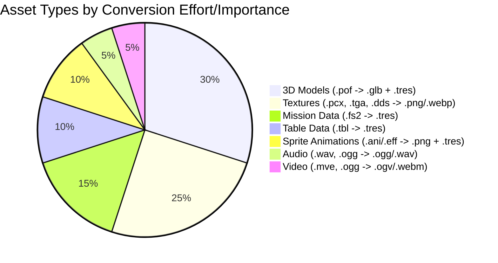

# Asset Conversion Pipeline

This document outlines the process for converting Wing Commander Saga's assets to Godot-compatible formats while maintaining their original quality and functionality, including visual and audio fidelity.

## 1. Data Extraction & Conversion Pipeline Strategy

The core strategy involves analyzing original formats, developing conversion tools, processing assets by type, integrating them into Godot, and ensuring quality.

   **A. Analysis & Documentation**
   *   Document WC Saga file system structure (`cfile.md`, `cfilesystem.md`) including packed files (`.vp`).
   *   Analyze proprietary file formats (.fs2, .pof, .ani, .eff, table formats) and create format specs.
   *   Create test suite for format validation.
   *   Map asset relationships and dependencies.
   *   **Identify Relations (Scripting - See `tasks/08_scripting.md`):**
        *   **SEXP System (`parse/sexp.*`, `parse/parselo.*`):** Mapped to Godot's `SexpNode`, `SexpEvaluator`, `SexpOperatorHandler`, `SexpVariableManager`, `SexpConstants` (`scripts/scripting/sexp/`). Requires a GDScript parser (offline, see `migration_tools/gdscript_converters/fs2_parsers/sexp_parser.gd`) to convert `.fs2` SEXP text into embedded `SexpNode` resources within the main `MissionData.tres`.
        *   **Hook System (`parse/scripting.*`, `parse/lua.*`):** Mapped to Godot's `ScriptState`, `ConditionedHook`, `ScriptCondition`, `ScriptAction`, `ScriptHook` (`scripts/scripting/hook_system/`). Requires `ScriptSystem` Autoload (`scripts/core_systems/script_system.gd` - MISSING) for integration and loading definitions from converted `scripting.tbl`/`*-sct.tbm` (likely converted to `.tres` via GDScript). Requires `GlobalConstants.gd` (MISSING).
        *   **Expression Parser (`variables/variables.*`):** Not currently implemented in Godot.
        *   **Encryption (`parse/encrypt.*`):** Not currently implemented in Godot. Optional.

   **B. Potential Godot Solutions & Integration**
   *   **SEXP Evaluation:** Use the implemented `SexpEvaluator` (`scripts/scripting/sexp/sexp_evaluator.gd`) and `SexpOperatorHandler` (`scripts/scripting/sexp/sexp_operators.gd`) to execute SEXP logic stored as `SexpNode` trees within the converted `MissionData.tres` (see `scripts/resources/mission/mission_data.gd`).
   *   **Hook System:** Use the implemented `ScriptState` (`scripts/scripting/hook_system/script_state.gd`) and related Resource classes (`ConditionedHook`, etc.) to manage conditional GDScript execution. Hook definitions need to be loaded (by `ScriptSystem` - `scripts/core_systems/script_system.gd`) from converted `scripting.tbl`/`*-sct.tbm` data (likely into `.tres` or JSON format first). Game events trigger checks via Godot signals connected to `ScriptSystem`.
   *   **Table Data:** Load converted `.tbl` data (e.g., `ShipData.tres`, `WeaponData.tres`, `AIProfile.tres`, generated via GDScript converters) using Godot's `load()` function into custom Resource scripts (e.g., `scripts/resources/ship_weapon/ship_data.gd`, `scripts/resources/ship_weapon/weapon_data.gd`, `scripts/resources/ai/ai_profile.gd`). Mission data (`.fs2`) is converted to `MissionData.tres` (defined by `scripts/resources/mission/mission_data.gd`, generated by `migration_tools/gdscript_converters/fs2_tres_converter.gd`) and loaded via `MissionLoader.gd`.

   **C. Media Extractors & Conversion (External Tools + GDScript)**
   *   **Audio Conversion System:**
        *   Extract compressed audio files (WAV, OGG) (e.g., using `vp_extractor.py`).
        *   Convert to OGG Vorbis (preferred for size/streaming) or keep as WAV (uncompressed). Normalize volume levels (optional). **Use external tools (e.g., FFmpeg, Audacity CLI) for batch processing.**
        *   Handle sound effects and music separately. Preserve loop points for music (via Godot import settings).
        *   Create `GameSounds` resource (`.tres`) **using GDScript**, mapping IDs/names to imported `AudioStream` resources.
   *   **Image Processing:**
        *   Extract texture files (PCX, TGA, DDS, PNG, JPG) and palettes. (`bmpman.md`)
        *   Convert to Godot-compatible formats (PNG, WebP) preserving alpha channels. Handle DDS compression formats (DXT1, DXT3, DXT5) during conversion. **Use external tools (e.g., ImageMagick, custom Python scripts with Pillow/Wand) for batch processing.** (`ddsutils.md`)
        *   Handle sprite sheets (.ANI, .EFF): Parse formats, handle RLE decompression (`animplay.cpp`, `packunpack.cpp`). Extract individual frames (potentially using external tools or GDScript if feasible). Assemble frames into Godot `SpriteFrames` resources (`.tres`) + PNG spritesheets **using GDScript**. Store metadata (FPS, looping, keyframes) in the `.tres` file.
        *   Handle UI Elements: Convert to PNG (**external tools**). Create `Theme` resources (`.tres`) **using GDScript or the Godot editor**. Handle 9-patch scaling (`NinePatchRect`).
   *   **Video Processing:**
        *   Identify source formats (MVE, OGG Theora). (`cutscene.cpp`, `movie.cpp`)
        *   Extract video files (e.g., using `vp_extractor.py`).
        *   Convert to WebM (VP9/Opus - recommended) or OGV (Theora/Vorbis) **using external tools like FFmpeg.**
        *   Preserve quality, aspect ratios, and audio tracks.

   **D. 3D Asset Pipeline**
   *   **Model Extraction:**
        *   Parse model file structures (.pof). (`model_part1.md`)
        *   Extract vertex data, faces, UVs, normals.
        *   Extract hardpoints, collision data, docking points, thruster points, glow points, paths, insignias.
        *   Handle material references (texture names).
   *   **Model Conversion:**
        *   Use POF to GLTF converter (custom tool needed, potentially Python or C++).
        *   Export geometry/hierarchy to GLTF/GLB.
        *   Export metadata (points, subsystem links) to a separate `.tres` file (e.g., `ModelMetadata.tres`) associated with the model scene, **generated using a GDScript tool** that reads POF data or an intermediate format.
        *   Process materials and assign converted textures during import/setup in Godot.
        *   Handle multiple LODs if present.
   *   **Collision Data:**
        *   Extract collision meshes (potentially from shield mesh data or BSP). (`model_part1.md`)
        *   Convert to Godot collision shapes (`CollisionShape3D` with appropriate `Shape3D` resource) during import or scene setup (**potentially automated via GDScript `EditorImportPlugin`**).

   **E. Outline Target Godot Project Structure (Relevant Parts)**
   *   `resources/missions/`: Stores `MissionData.tres` files, containing mission structure and SEXP node trees (`SexpNode` resources), **generated by GDScript converters**.
   *   `resources/ships/`, `resources/weapons/`, `resources/ai/profiles/`, etc.: Store corresponding `.tres` files **converted from `.tbl` data via GDScript**.
   *   `resources/scripting/`: May hold `.tres` definitions for `ConditionedHook`s if not generated procedurally from converted table data by `ScriptSystem` (**using GDScript**).
   *   `resources/localization/`: Stores `.po` or `.csv` files for translations (**converted from `tstrings.tbl` via GDScript**).
   *   `scripts/scripting/sexp/`: Contains the SEXP evaluation runtime (`SexpEvaluator.gd`, `SexpOperatorHandler.gd`, `SexpVariableManager.gd`, `SexpNode.gd`, `SexpConstants.gd`).
   *   `scripts/scripting/hook_system/`: Contains the Hook system runtime (`ScriptState.gd`, `ConditionedHook.gd`, `ScriptCondition.gd`, `ScriptAction.gd`, `ScriptHook.gd`).
   *   `scripts/resources/`: Contains the GDScript classes defining the structure of the custom Resource types, organized into subfolders:
        *   `scripts/resources/ai/`: `AIGoal.gd`, `AIProfile.gd`
        *   `scripts/resources/game_data/`: `GameSounds.gd`, `MusicEntry.gd`, `SoundEntry.gd`, `SpeciesInfo.gd`
        *   `scripts/resources/mission/`: `MissionData.gd`, `ShipInstanceData.gd`, `WingInstanceData.gd`, `MissionObjectiveData.gd`, `MissionEventData.gd`, `BriefingData.gd`, `DebriefingData.gd`, `MessageData.gd`, `PersonaData.gd`, `MissionLogEntry.gd`, etc.
        *   `scripts/resources/player/`: `PlayerData.gd`, `RankInfo.gd`, `MedalInfo.gd`, etc.
        *   `scripts/resources/ship_weapon/`: `ShipData.gd`, `WeaponData.gd`, `ArmorData.gd`, `SubsystemDefinition.gd`, etc.
   *   `scripts/core_systems/script_system.gd`: Autoload for managing `ScriptState` and signal connections.
   *   `scripts/globals/global_constants.gd`: Defines global enums and constants.

   **F. Pipeline Integration**
   *   Create automated batch processing system (**orchestrated via GDScript or shell scripts calling Godot CLI**).
   *   Implement asset dependency resolution (e.g., models needing specific textures).
   *   Add incremental conversion support (re-convert only changed source assets).
   *   Create conversion progress tracking and logging (**within GDScript tools**).
   *   Add error recovery and resume capability.

   **G. Quality Assurance & Validation**
   *   Implement automated testing (e.g., check file existence, basic format validation, **GDScript checks on `.tres` resources**).
   *   Create validation checks for each asset type (e.g., texture dimensions, model vertex count, **resource field checks via GDScript**).
   *   Add visual preview tools (simple Godot scenes to view converted assets).
   *   Create comparison tools for original vs converted (where feasible).
   *   Document conversion process and target Godot formats/structures.
   *   **Validation Checks:**
        1.  **Models**: Polygon count, UVs, Material assignments, `Marker3D` points.
        2.  **Textures**: No artifacts, alpha preserved, resolution.
        3.  **Sprite Animations**: Frame count, FPS, looping, visual fidelity.
        4.  **Audio**: No clipping/distortion, levels, looping.
        5.  **Video**: Smooth playback, audio sync, aspect ratio.
        6.  **Mission/Table Data**: Fields populated, valid references, SEXP structure consistency.
   *   **Testing Procedure:**
        1.  **Visual Inspection**: Open converted assets/scenes in Godot, compare with original visuals. Play animations/cutscenes.
        2.  **Functional Testing**: Load converted missions, test spawning, basic AI, weapon firing, effects, goal triggers, audio playback.

   **H. Asset Organization & Integration**
   *   Design Godot project structure (`assets/`, `resources/`).
   *   Create resource naming conventions.
   *   Implement asset categorization system (subfolders).
   *   Set up version control guidelines (Git LFS for large assets).
   *   Create asset metadata system (potentially within `.import` files or separate metadata files).
   *   **Godot Import Settings:**
        1.  **3D Models (.gltf)**: Configure collision generation, animation import, scale. Link `.tres` metadata via script.
        2.  **Textures (.png, .webp)**: Configure compression (VRAM), mipmaps, filtering, sRGB.
        3.  **Sprite Animations (`SpriteFrames.tres`)**: Load directly.
        4.  **Audio (.ogg, .wav)**: Configure looping, normalization.
        5.  **Video (.ogv, .webm)**: Load directly as `VideoStream`.

## 2. Target Directory Structure

```
assets/
├── converted/
│   ├── models/        # GLTF models (.glb)
│   ├── textures/      # PNG/WebP textures (models, effects, UI)
│   ├── animations/    # PNG spritesheets (from ANI/EFF)
│   ├── sounds/        # OGG/WAV sound effects
│   ├── music/         # OGG music tracks
│   ├── voices/        # OGG voice files
│   └── cutscenes/     # WebM/OGV video files
├── source/            # Original extracted assets (optional, for reference)
│   ├── wcsaga_models/
│   ├── wcsaga_textures/
│   └── ...
└── processing/        # Intermediate files during conversion
    ├── temp/
    └── logs/
resources/             # Godot-specific resource files (.tres) defining game data
├── ships/             # ShipData.tres, ModelMetadata.tres
├── weapons/           # WeaponData.tres
├── missions/          # MissionData.tres (converted from .fs2)
├── animations/        # SpriteFrames.tres files (metadata for spritesheets)
├── game_data/         # GameSounds.tres, MusicTracks.tres, SpeciesData.tres, Rank.tres, Medals.tres, etc.
├── ai/                # AIProfile.tres, BehaviorTree.tres
├── armor/             # ArmorData.tres
├── hud/               # HUDConfigData.tres, HUDGaugeConfig.tres, Theme.tres
├── ui/                # General UI Theme.tres files (if separate from HUD)
├── localization/      # .po / .csv files (converted from tstrings.tbl)
└── shaders/           # Shader resources (.gdshader) - Although shaders are code, they act as resources here.
```
*(Note: This structure aligns with `tasks/project_structure.md`)*

## 3. Conversion Tools & Scripts

### Core Conversion Approach (GDScript + External Tools)

The primary conversion logic for game data formats (FS2, TBL, POF metadata, ANI/EFF metadata) will reside in **GDScript** tools located in `migration_tools/gdscript_converters/`. These can be run either as `@tool` scripts within the Godot editor or via the command line for batch processing.

For media assets (images, audio, video), **external command-line tools** (like FFmpeg, ImageMagick) or potentially Python scripts will be used for efficiency and access to specialized libraries. GDScript tools might then be used to create associated Godot resources (e.g., `SpriteFrames.tres`, `GameSounds.tres`).

### Conceptual GDScript Converter Structure (`@tool` script example)

```gdscript
# migration_tools/gdscript_converters/master_converter.gd
@tool
extends EditorScript

# Configuration
var source_asset_dir = "res://../wcsaga_extracted_assets/" # Example path
var target_assets_dir = "res://assets/converted/"
var target_resources_dir = "res://resources/"

# References to specific converters
var fs2_converter = preload("fs2_tres_converter.gd").new()
var tbl_converter = preload("tbl_tres_converter.gd").new() # Assumed exists
var ani_eff_converter = preload("ani_eff_tres_converter.gd").new() # Assumed exists
var pof_metadata_converter = preload("pof_metadata_tres_converter.gd").new() # Assumed exists
# ... other GDScript converters

func _run():
	print("Starting asset conversion...")
	# Use DirAccess to scan source_asset_dir recursively
	var dir = DirAccess.open(source_asset_dir)
	if dir:
		process_directory(dir, source_asset_dir)
	else:
		printerr("Failed to open source directory: ", source_asset_dir)
		return

	print("Conversion process finished.")

func process_directory(dir: DirAccess, current_path: String):
	dir.list_dir_begin()
	var file_name = dir.get_next()
	while file_name != "":
		var full_path = current_path.path_join(file_name)
		if dir.current_is_dir() and file_name != "." and file_name != "..":
			var sub_dir = DirAccess.open(full_path)
			if sub_dir:
				process_directory(sub_dir, full_path)
			else:
				printerr("Failed to open subdirectory: ", full_path)
		elif not dir.current_is_dir():
			convert_file(full_path)

		file_name = dir.get_next()
	dir.list_dir_end()


func convert_file(source_path: String):
	var extension = source_path.get_extension().to_lower()
	var filename = source_path.get_file()
	print("Processing: ", source_path)

	# --- GDScript Converters ---
	if extension == "fs2":
		fs2_converter.convert(source_path, target_resources_dir.path_join("missions"))
	elif extension == "tbl":
		tbl_converter.convert(source_path, target_resources_dir) # Needs logic to determine subfolder
	elif extension == "ani" or extension == "eff":
		# Assumes external tool already created PNG spritesheet in target_assets_dir/animations/
		var spritesheet_path = target_assets_dir.path_join("animations").path_join(filename.get_basename() + ".png")
		if FileAccess.file_exists(spritesheet_path):
			ani_eff_converter.create_spriteframes(source_path, spritesheet_path, target_resources_dir.path_join("animations"))
		else:
			printerr("Spritesheet not found for animation: ", source_path)
	elif extension == "pof":
		# Assumes external tool already created GLB in target_assets_dir/models/
		var glb_path = target_assets_dir.path_join("models").path_join(filename.get_basename() + ".glb")
		if FileAccess.file_exists(glb_path):
			pof_metadata_converter.create_metadata(source_path, glb_path, target_resources_dir.path_join("ships")) # Needs logic for subfolder
		else:
			printerr("GLB model not found for POF: ", source_path)

	# --- External Tool Calls (Conceptual - Requires OS.execute or dedicated script) ---
	elif extension in ["pcx", "tga", "dds"]:
		# Example: call ImageMagick or Python script
		# OS.execute("convert", [source_path, target_assets_dir.path_join("textures").path_join(filename.get_basename() + ".png")])
		print("  -> Requires external image conversion to PNG/WebP")
	elif extension in ["wav", "ogg"]: # Assuming source OGG is audio here
		# Example: call FFmpeg
		# OS.execute("ffmpeg", ["-i", source_path, target_assets_dir.path_join("sounds").path_join(filename.get_basename() + ".ogg")])
		print("  -> Requires external audio conversion to OGG/WAV")
	elif extension in ["mve"] or (extension == "ogg"): # Add check if OGG is video
		# Example: call FFmpeg
		# OS.execute("ffmpeg", ["-i", source_path, target_assets_dir.path_join("cutscenes").path_join(filename.get_basename() + ".webm")])
		print("  -> Requires external video conversion to WebM/OGV")

	# Add more types as needed
	else:
		# print("Skipping unsupported/media file: ", filename)
		pass # Ignore files not handled by GDScript here

# Add helper functions for specific converters as needed (e.g., tbl_converter.convert)
# These specific converters would handle parsing and saving .tres files.
# Example:
# class TBLConverter:
#     func convert(source_tbl_path, target_resource_base_dir):
#         var filename = source_tbl_path.get_file()
#         var resource_type = determine_resource_type(filename) # e.g., ShipData, WeaponData
#         var target_dir = target_resource_base_dir.path_join(determine_subdir(resource_type))
#         var target_path = target_dir.path_join(filename.get_basename() + ".tres")
#
#         # 1. Parse TBL data (using FileAccess, String methods, etc.)
#         var parsed_data = parse_tbl(source_tbl_path)
#         if parsed_data == null: return
#
#         # 2. Create appropriate Resource instance
#         var resource = load(determine_script_path(resource_type)).new()
#
#         # 3. Populate resource fields from parsed_data
#         populate_resource(resource, parsed_data)
#
#         # 4. Ensure target directory exists
#         DirAccess.make_dir_recursive_absolute(target_dir)
#
#         # 5. Save the resource
#         var error = ResourceSaver.save(resource, target_path)
#         if error != OK:
#             printerr("Failed to save resource: ", target_path, " Error code: ", error)
#         else:
#             print("Saved: ", target_path)

```

## 4. Asset Types Overview


*(Adjusted pie chart to reflect relative effort/complexity)*

## 5. Timeline

```mermaid
gantt
    title Asset Conversion Timeline
    dateFormat  YYYY-MM-DD
    section Setup & Tooling
    Converter Framework & VP Extractor :a1, 2025-04-01, 7d
    POF Converter Dev (GLTF + Metadata) :a2, after a1, 14d
    ANI/EFF Converter Dev (PNG + SpriteFrames) :a3, after a1, 10d
    FS2 Parser & MissionData Converter Dev :a4, after a1, 14d
    TBL Parser & Resource Converter Dev :a5, after a1, 10d
    Image/Audio/Video Converter Setup :a6, after a1, 5d
    section Asset Conversion (Batch Runs)
    Textures & UI Elements :b1, after a6, 14d
    Sounds & Music & Voices :b2, after a6, 10d
    Models & Metadata :b3, after a2, 21d
    Sprite Animations :b4, after a3, 14d
    Cutscenes :b5, after a6, 7d
    Mission Data (.fs2) :b6, after a4, 28d
    Table Data (.tbl) :b7, after a5, 14d
    section Validation & Integration
    Asset Spot Checks & Previews :c1, during b1, 40d # Overlaps conversion
    Mission Load & Basic Functionality Test :c2, after b6, 14d
    Ingame Asset Functional Tests :c3, after c2, 28d
```

## 6. Next Steps

1.  **Refine GDScript Converters:** Enhance existing converters (`fs2_tres_converter.gd`) and develop new ones for TBL, ANI/EFF metadata, POF metadata, etc., within `migration_tools/gdscript_converters/`. Ensure they correctly parse source data and generate valid `.tres` files based on the definitions in `scripts/resources/`.
2.  **Develop/Adapt Parsers:** Implement robust parsing logic within the GDScript converters for the specific file formats (TBL, ANI/EFF headers, POF metadata sections). Leverage Godot's `FileAccess` and string manipulation capabilities.
3.  **Finalize Resource Definitions:** Ensure all necessary custom Resource scripts (`.gd` files in `scripts/resources/`) are defined with the correct `@export` variables corresponding to the data being converted.
4.  **Set Up External Tool Chain:** Configure and script the necessary external tools (FFmpeg, ImageMagick, POF->GLB converter) for media and model geometry conversion. Ensure their outputs land where the GDScript tools expect them.
5.  **Implement Master Script:** Develop the master GDScript (`master_converter.gd` or similar) or shell script to orchestrate the entire process, calling both GDScript converters and external tools in the correct order.
6.  **Establish Validation:** Create GDScript-based validation tools to check the integrity and correctness of the generated `.tres` resources. Implement preview scenes in Godot to visually inspect converted assets.
