# Wing Commander Saga: Godot Conversion Analysis - Component 04: Core Systems

This document analyzes the core systems from the original Wing Commander Saga C++ codebase and proposes an implementation strategy for the Godot conversion project, following the guidelines in `tasks/00_analysis_setup.md`.

*Source Code Folders:* `freespace2/`, `object/`, `gamesequence/`, `globalincs/`, `playerman/`, `scoring/`, `stats/`, `medals/`, `rank/`, `localization/`, `math/`, `species_defs/`

## 1. Original System Overview

The Core Systems encompass the fundamental engine loop, time management, object creation/tracking, game state transitions, player profile management, statistics, global constants, localization, math utilities, species definitions, and error handling. These systems form the backbone upon which all other gameplay features are built.

```mermaid
graph TD
    Core[Core Systems] --> GL[Game Loop & Time]
    Core --> OM[Object Management]
    Core --> GS[Game Sequence]
    Core --> PM[Player Management]
    Core --> STATS[Statistics & Scoring]
    Core --> GLOB[Globals & Constants]
    Core --> LCL[Localization]
    Core --> MATH[Math Utilities]
    Core --> SPEC[Species Definitions]
    Core --> ERR[Error Handling]

    GL --> FrameTime(Frametime Calc);
    GL --> MissionTime(Mission Time);
    GL --> TimeComp(Time Compression);
    GL --> Pause(Pausing);
    GL --> Paging(Level Paging);
    GL --> Init(Initialization);
    GL --> Shutdown(Shutdown);
    GL --> Effects(Screen Effects);

    OM --> ObjCreate(Object Creation/Deletion);
    OM --> ObjTrack(Object Tracking/Lists);
    OM --> ObjSig(Signature Management);
    OM --> ObjPair(Collision Pair Management);
    OM --> ObjRender(Object Rendering Sort);
    OM --> ObjSound(Object Sound Association);
    OM --> Docking(Docking Management);

    GS --> StateStack(State Stack);
    GS --> EventQueue(Event Queue);
    GS --> Transitions(State Transitions);

    PM --> ProfileLoad(Profile Loading/Saving);
    PM --> PilotData(Pilot Data Struct);
    PM --> CampaignTrack(Campaign Tracking);

    STATS --> Scoring(Scoring Logic);
    STATS --> Rank(Rank System);
    STATS --> Medals(Medal System);
    STATS --> StatsTrack(Statistics Tracking);
    STATS --> DamageTrack(Damage Tracking);

    GLOB --> Limits(Max Limits);
    GLOB --> GameModes(Game Modes);
    GLOB --> ViewerModes(Viewer Modes);
    GLOB --> DetailLevels(Detail Levels);
    GLOB --> Colors(Global Colors);

    LCL --> LangSelect(Language Selection);
    LCL --> StringTables(String Tables - TBL/TBM);
    LCL --> XSTR(XSTR Macro/Lookup);
    LCL --> Formatting(Token Replacement);

    MATH --> VecMat(Vector/Matrix Ops);
    MATH --> Rand(Random Numbers);
    MATH --> Intersect(Intersection Tests);
    MATH --> Spline(Splines);
    MATH --> FixedPoint(Fixed Point - Original);

    SPEC --> SpeciesData(Species Data);
    SPEC --> Visuals(Visual Properties - Debris, Thrusters);
    SPEC --> Gameplay(Gameplay Properties - IFF, AWACS);

    ERR --> Logging(Logging);
    ERR --> Asserts(Assertions);
    ERR --> CrashHandling(Crash Handling - Original);
```



## 2. Detailed Code Analysis

### 2.1. Key Features

1.  **Game Loop & Time Management (`freespace2/freespace.cpp`)**
    *   **Main Loop (`game_frame`):** Orchestrates input, simulation, rendering, UI updates per frame.
    *   **Frametime (`Frametime`, `flFrametime`):** Calculates frame duration, used for physics/simulation updates. Supports capping (`Framerate_cap`).
    *   **Mission Time (`Missiontime`):** Tracks elapsed time within a mission.
    *   **Time Compression (`Game_time_compression`):** Allows speeding up/slowing down game time (`Engine.time_scale` equivalent).
    *   **Pausing (`Game_paused`):** Stops/resumes game time and updates.
    *   **Screen Effects:** Screen flashes (`game_flash`), camera shake (`game_shudder_apply`).
    *   **Level Paging (`level_page_in`):** Loads assets for the current level.
    *   **Initialization/Shutdown (`game_init`, `game_level_init`, `game_shutdown`):** Handles game and level setup/cleanup.
    *   **Difficulty Scaling:** Applies scaling factors based on `Game_skill_level`.

2.  **Object Management (`object/object.cpp`, `object/objcollide.cpp`, `object/objectsnd.cpp`, `object/objectdock.cpp`)**
    *   **Object Structure (`object`):** Core data structure holding position, orientation, physics, type, instance data, flags, parent/child links, signature, hull/shield strength, sound handles, docking info.
    *   **Lifecycle:** Creation (`obj_create`), deletion (`obj_delete`), tracking via linked lists (`obj_used_list`, `obj_free_list`).
    *   **Signature Management:** Unique IDs (`signature`) for object identification across network/saves.
    *   **Collision Pair Management (`obj_pair`):** Tracks potential collision pairs to optimize checks.
    *   **Rendering Sort (`objectsort.cpp`):** Sorts objects for rendering (less relevant with modern Z-buffers).
    *   **Sound Association (`obj_snd`):** Links sounds to specific objects or positions.
    *   **Docking Management (`dock_instance`):** Handles docking relationships and movement of docked objects.

3.  **Game Sequence System (`gamesequence/gamesequence.cpp`)**
    *   **State Stack (`state_stack`, `GS_STACK_SIZE`):** Manages game states (MainMenu, Gameplay, Briefing, etc.).
    *   **State Transitions:** Functions to push (`gameseq_push_state`), pop (`gameseq_pop_state`), and set (`gameseq_set_state`) states. Includes entry/exit hooks (`game_enter_state`, `game_leave_state`).
    *   **Event Queue (`event_queue`, `MAX_GAMESEQ_EVENTS`):** Asynchronous event system (`GS_EVENT_*`) for triggering state changes (`gameseq_post_event`, `gameseq_process_events`).

4.  **Player Management (`playerman/player.cpp`, `playerman/managepilot.cpp`)**
    *   **Player Structure (`player`):** Holds player-specific data (callsign, stats, campaign progress, options, current ship object, AI info, target info, etc.).
    *   **Profile Loading/Saving:** Manages pilot files (`.plr`), loading/saving player progress, stats, and settings (`write_pilot_file`, `read_pilot_file`).
    *   **Campaign Tracking:** Stores campaign state (`Player->current_campaign`, `Player->missions_completed`, persistent variables).

5.  **Statistics & Scoring (`stats/scoring.cpp`, `stats/medals.cpp`, `stats/rank.cpp`, `stats/stats.cpp`)**
    *   **Scoring Structure (`scoring_struct`):** Tracks mission and all-time stats (score, kills, assists, shots fired/hit, friendly fire, deaths, flight time).
    *   **Rank System (`rank_stuff`, `rank.tbl`):** Defines ranks, points required, insignia, promotion logic (`scoring_eval_rank`).
    *   **Medal System (`medal_stuff`, `medals.tbl`):** Defines medals, badges, award criteria (`scoring_eval_badges`).
    *   **Damage Tracking:** Records damage dealt by attackers to targets (`ship.damage_ship_id`, `ship.damage_ship`) for kill/assist evaluation.
    *   **Evaluation Logic:** Functions to evaluate kills (`scoring_eval_kill`), assists (`scoring_eval_assists`), hits (`scoring_eval_hit`), and merge mission stats (`scoring_do_accept`).

6.  **Globals & Constants (`globalincs/globals.h`, `globalincs/systemvars.h`, `globalincs/alphacolors.h`)**
    *   **Limits:** Defines maximum counts for various entities (`MAX_SHIPS`, `MAX_WEAPONS`, `MAX_OBJECTS`, etc.).
    *   **Game Modes (`GM_*`):** Flags defining game context (Normal, Multiplayer, Campaign, Dead, etc.).
    *   **Viewer Modes (`VM_*`):** Flags defining camera view (External, Chase, Padlock, etc.).
    *   **Detail Levels (`Detail`, `Game_detail_flags`):** Controls graphics/gameplay detail settings.
    *   **Global Colors (`Color_*`):** Predefined color constants for UI and effects.

7.  **Localization (`localization/localize.cpp`, `localization/fhash.cpp`)**
    *   **Multi-language Support:** Handles different languages (English, German, French, Polish) defined in `Lcl_languages`.
    *   **String Tables (`tstrings.tbl`, `*-lcl.tbm`):** Loads localized strings based on current language setting (`Lcl_current_lang`).
    *   **XSTR Macro/Lookup:** Provides runtime string lookup (`XSTR("Default", id)`), falling back to default text if localized version isn't found. Uses `Xstr_table`.
    *   **External Lookup:** Optimized lookup for large tables using file pointers (`Lcl_pointers`).
    *   **Token Replacement:** Replaces placeholders like `$callsign`, `$rank` (`lcl_replace_stuff`).
    *   **Character Encoding:** Handles special characters for different languages (`lcl_fix_umlauts`, `lcl_fix_polish`).

8.  **Math Utilities (`math/vecmat.cpp`, `math/floating.cpp`, `math/fix.cpp`, `math/fvi.cpp`, `math/spline.cpp`, `math/staticrand.cpp`)**
    *   **Vector/Matrix Ops:** Standard 3D vector and 3x3 matrix operations.
    *   **Random Numbers:** Standard (`rand`, `frand`) and static/seeded (`static_rand`, `static_randf`) random number generation.
    *   **Intersection Tests:** Ray/segment vs. plane/sphere/bounding box tests (`fvi_*`). Point-in-face tests.
    *   **Splines:** Bezier (`bez_spline`) and Hermite (`herm_spline`) curve evaluation.
    *   **Fixed Point:** Original engine used fixed-point math (`fix`).

9.  **Species Definitions (`species_defs/species_defs.cpp`)**
    *   **Species Data (`species_info`):** Defines properties per species (Terran, Vasudan, Shivan). Parsed from `species_defs.tbl`.
    *   **Visuals:** Specifies default debris textures, shield hit animations, thruster flame/glow animations.
    *   **Gameplay:** Defines default IFF, AWACS multiplier.

10. **Error Handling (`globalincs/windebug.cpp`, `exceptionhandler/exceptionhandler.cpp`)**
    *   **Assertions (`Assert`, `Assertion`):** Debug checks.
    *   **Warnings/Errors (`Warning`, `Error`):** Reporting issues, potentially fatal.
    *   **Logging:** `mprintf`, `nprintf` for debug output.
    *   **Crash Handling (Windows):** SEH (`RecordExceptionInfo`), call stack dumping (`DumpCallsStack`).

### 2.2. List Potential Godot Solutions

1.  **Game Loop & Time Management:**
    *   **Loop:** Godot's main loop (`_process`, `_physics_process`).
    *   **Frametime:** `delta` parameter in `_process` / `_physics_process`. Capping via `ProjectSettings.application/run/max_fps`.
    *   **Mission Time:** Global variable in a Singleton (e.g., `GameManager.mission_time`).
    *   **Time Compression:** `Engine.time_scale`.
    *   **Pausing:** `get_tree().paused`.
    *   **Screen Effects:** Shaders (`ShaderMaterial` on `ColorRect` or post-processing), `Camera3D` manipulation (offset, rotation noise).
    *   **Level Paging:** `ResourceLoader.load_threaded_request`/`get`, scene instantiation (`PackedScene.instantiate()`). Loading screens via UI scenes (`CanvasLayer`).
    *   **Initialization/Shutdown:** Godot engine handles its own. Game init in Autoload `_ready()`. Level init in scene `_ready()`. Cleanup via `_exit_tree()` or `queue_free()`.
    *   **Difficulty Scaling:** Apply multipliers stored in `GameSettings` Singleton based on selected skill level.

2.  **Object Management:**
    *   **Object Structure:** Base `Node3D` with attached `BaseObject.gd` script. Derived scenes/scripts for specific types (Ship, Weapon, Asteroid).
    *   **Lifecycle:** `PackedScene.instantiate()`, `Node.queue_free()`.
    *   **Tracking:** Use Godot Groups (`add_to_group`, `get_tree().get_nodes_in_group`) or a dedicated `ObjectManager` Singleton with Dictionaries mapping signatures/instance IDs to nodes.
    *   **Signature Management:** Use `Node.get_instance_id()` or assign custom unique IDs (`int` or `StringName`) stored as metadata or script variables.
    *   **Collision Pairs:** Godot's physics engine handles broadphase; detailed pair management likely unnecessary.
    *   **Rendering Sort:** Handled by Godot's renderer (Z-buffer, transparency sorting).
    *   **Sound Association:** `AudioStreamPlayer3D` nodes attached to object scenes.
    *   **Docking:** `Marker3D` for points, GDScript logic (potentially `DockingManager` Singleton) to manage relationships and transforms. `Generic6DOFJoint3D` for physics-based docking if desired.

3.  **Game Sequence System:**
    *   **State Management:** Custom `GameSequenceManager` Singleton (Autoload) managing a stack (`Array`) of scene paths or state identifiers (Enums). Use `get_tree().change_scene_to_file()` or `change_scene_to_packed()` for transitions.
    *   **Event Queue:** Use Godot's built-in signal system or a custom event bus Singleton (`SignalBus.gd`) with signals for different game events.

4.  **Player Management:**
    *   **Player Structure:** `PlayerData` custom `Resource` (`.tres`) or Singleton script holding player state.
    *   **Profile Loading/Saving:** Use `ConfigFile` or `ResourceSaver`/`ResourceLoader` to save/load `PlayerData` resource to/from `user://` directory.
    *   **Campaign Tracking:** Store campaign progress within `PlayerData` or a separate `CampaignSaveData` resource.

5.  **Statistics & Scoring:**
    *   **Scoring Structure:** Store stats within the `PlayerData` resource/script.
    *   **Rank/Medal System:** Define `RankInfo` and `MedalInfo` custom resources (`.tres`). Load definitions from converted table data (JSON or `.tres`).
    *   **Damage Tracking:** Implement damage tracking within the `ShipBase.gd` script (e.g., a Dictionary mapping attacker ID to damage dealt).
    *   **Evaluation Logic:** `ScoringManager` Singleton (Autoload) containing functions like `evaluate_kill`, `evaluate_assist`, `evaluate_rank`, `evaluate_medals`.

6.  **Globals & Constants:**
    *   **Limits/Constants:** Define as `const` variables within relevant scripts or a dedicated `GlobalConstants.gd` Autoload script.
    *   **Game/Viewer Modes:** Use Enums within a `GlobalConstants.gd` or `GameManager.gd` script. Store current mode in a global variable (e.g., `GameManager.current_game_mode`).
    *   **Detail Levels:** `GameSettings` Singleton holding a `detail_level` variable or a custom `DetailSettings` resource. Apply settings in relevant systems (graphics, particles, AI).
    *   **Global Colors:** Define as `const Color` variables in `GlobalConstants.gd` or within a `Theme` resource.

7.  **Localization:**
    *   **System:** Use Godot's built-in Translation system (`TranslationServer`, `.po`/`.csv` files, `tr()`).
    *   **Tables:** Convert `tstrings.tbl` and `*-lcl.tbm` to `.csv` or `.po` format using a script.
    *   **XSTR:** Replace `XSTR("Default", id)` with `tr("Default")` or `tr("KEY_" + str(id))`.
    *   **External Lookup:** Not needed with Godot's system.
    *   **Token Replacement:** Use `String.format()` or the `%` operator (e.g., `tr("GREETING %s") % PlayerData.callsign`).
    *   **Character Encoding:** Godot uses UTF-8 natively. Ensure fonts support required characters.

8.  **Math Utilities:**
    *   **Vector/Matrix:** Use Godot's `Vector3`, `Basis`, `Transform3D`, `Quat`. Implement specific missing functions (e.g., `vm_vec_delta_ang_norm`) as static GDScript functions in a `MathUtils.gd` script.
    *   **Random Numbers:** Use `randi()`, `randf()`, `randfn()`, `RandomNumberGenerator` class.
    *   **Intersection Tests:** Use `PhysicsDirectSpaceState3D` (`intersect_ray`, `intersect_shape`), `Geometry3D` static methods. Implement specific missing tests in `MathUtils.gd`.
    *   **Splines:** Use `Curve3D` resource.
    *   **Fixed Point:** Use Godot's `float` (64-bit precision available via project settings or `float64` type hint if needed, though standard `float` is usually sufficient).

9.  **Species Definitions:**
    *   **Data:** Define `SpeciesInfo` custom resource (`.tres`) containing name, default IFF (Enum or StringName), AWACS multiplier, visual asset paths (`PackedScene` for effects, `Texture2D` for debris), FRED color.
    *   **Loading:** Parse `species_defs.tbl` (or converted JSON/resource) into `SpeciesInfo` resources. Store in a Dictionary in a `SpeciesManager` Singleton.
    *   **Usage:** Access species info via `SpeciesManager.get_species_info(species_index)`.

10. **Error Handling:**
    *   **Assertions:** Use Godot's `assert()`.
    *   **Warnings/Errors:** Use `push_warning()`, `push_error()`, `printerr()`.
    *   **Logging:** Use `print()`, `printerr()`, or Godot's `Logger` class for more control. Log to file using `FileAccess`.
    *   **Crash Handling:** Godot provides basic crash logs. Custom handling via `OS.crash_handler` is possible but complex.

### 2.3. Outline Target Code Structure

```
wcsaga_godot/
├── resources/
│   ├── game_data/
│   │   ├── player_data_default.tres # Default player profile
│   │   ├── ranks.tres               # Converted rank data
│   │   ├── medals.tres              # Converted medal data
│   │   └── species/                 # SpeciesInfo resources
│   │       ├── terran.tres
│   │       └── ...
│   ├── localization/                # .po or .csv files
│   │   ├── en.po
│   │   └── de.po
│   └── ...
├── scenes/
│   ├── core/
│   │   ├── game_manager.tscn        # Node for GameManager singleton logic
│   │   ├── object_manager.tscn      # Node for ObjectManager singleton logic
│   │   ├── game_sequence_manager.tscn # Node for GameSequenceManager singleton logic
│   │   ├── scoring_manager.tscn     # Node for ScoringManager singleton logic
│   │   └── species_manager.tscn     # Node for SpeciesManager singleton logic
│   │   # Add entries for other core system singletons if they have associated scenes
│   └── ...
├── scripts/
│   ├── core_systems/
│   │   ├── game_manager.gd          # Main game loop integration, time, pausing
│   │   ├── object_manager.gd        # Object tracking, lookup by signature/ID
│   │   ├── base_object.gd           # Base script for all game objects (ships, weapons, etc.)
│   │   ├── game_sequence_manager.gd # State machine logic
│   │   ├── scoring_manager.gd       # Scoring, rank, medal evaluation
│   │   └── species_manager.gd       # Manages loading/accessing SpeciesInfo
│   ├── resources/ # Resource definition scripts moved here
│   │   ├── player/
│   │   │   ├── player_data.gd       # Resource script for player profile/stats
│   │   │   ├── rank_info.gd         # Resource script for rank definitions
│   │   │   └── medal_info.gd        # Resource script for medal definitions
│   │   ├── game_data/
│   │   │   └── species_info.gd      # Resource script for species definitions
│   │   └── ... # Other resource subfolders
│   ├── globals/
│   │   ├── global_constants.gd      # MAX limits, GM_*, VM_* enums, global colors
│   │   ├── game_settings.gd         # Detail level, difficulty, player options
│   │   └── math_utils.gd            # Static helper functions for vector/matrix math
│   ├── localization/
│   │   └── lcl_utils.gd             # (Optional) Helpers for token replacement if needed beyond String.format
│   └── ...
```
*(Ensure consistency with `00_analysis_setup.md` Section IV)*

### 2.4. Identify Important Methods, Classes, and Data Structures

*   **C++:**
    *   `game_frame()`: Main loop. (Mapped to Godot `_process`/`_physics_process`).
    *   `game_set_frametime()`: Time calculation. (Replaced by `delta`).
    *   `game_level_init()`, `game_post_level_init()`: Level setup. (Mapped to scene `_ready()` functions).
    *   `game_level_close()`: Level cleanup. (Mapped to `_exit_tree()` or `queue_free()`).
    *   `obj_create()`, `obj_delete()`, `obj_move_all()`: Object lifecycle/update. (Mapped to Godot nodes, `instantiate`, `queue_free`, `_physics_process`).
    *   `object` struct: (Mapped to `Node3D` + `BaseObject.gd`).
    *   `gameseq_*()` functions: State management. (Mapped to `GameSequenceManager.gd`).
    *   `player` struct: (Mapped to `PlayerData.tres` resource/script).
    *   `write_pilot_file()`, `read_pilot_file()`: Profile I/O. (Mapped to `ResourceSaver`/`Loader` or `ConfigFile`).
    *   `scoring_struct`: (Mapped to data within `PlayerData`).
    *   `scoring_*()` functions: Stat evaluation. (Mapped to `ScoringManager.gd`).
    *   `rank_stuff`, `medal_stuff`: (Mapped to `RankInfo.tres`, `MedalInfo.tres`).
    *   `lcl_*()` functions, `XSTR()`: Localization. (Mapped to Godot `TranslationServer`, `tr()`).
    *   `vm_*()` functions: Math. (Mapped to Godot built-ins or `MathUtils.gd`).
    *   `species_info`: (Mapped to `SpeciesInfo.tres`).
    *   `Assert`, `Warning`, `Error`: (Mapped to Godot `assert`, `push_warning`, `push_error`, `printerr`).

*   **Godot:**
    *   `Node`, `Node3D`, `RigidBody3D`, `CharacterBody3D`, `Area3D`: Base building blocks.
    *   `Resource`, `PackedScene`: Data storage and scene templates.
    *   `GDScript Classes`: (`GameManager`, `ObjectManager`, `BaseObject`, `PlayerData`, `ScoringManager`, `SpeciesInfo`, etc.).
    *   `Engine.time_scale`: Time compression.
    *   `get_tree().paused`: Pausing.
    *   `ResourceLoader`, `ResourceSaver`, `ConfigFile`: Loading/saving data.
    *   `TranslationServer`, `tr()`: Localization.
    *   `Vector3`, `Basis`, `Transform3D`, `Quat`: Math types.
    *   `PhysicsDirectSpaceState3D`: Intersection tests.
    *   `Curve3D`: Splines.
    *   `RandomNumberGenerator`: Random numbers.
    *   `Signal`: Event handling.
    *   `Group`: Object tracking.
    *   `Autoload/Singleton`: Global managers.

### 2.5. Identify Relations

*   **GameManager** (or main loop script) drives updates, calling `_process` / `_physics_process` on active nodes. Reads `delta`, handles pausing, time compression.
*   **GameSequenceManager** controls which main scene (representing a state) is active in the `SceneTree`. Responds to events posted via signals or its own methods.
*   **ObjectManager** tracks active game objects (Ships, Weapons, etc.), providing lookup services. Objects register/unregister themselves on `_ready`/`_exit_tree`.
*   **BaseObject** scripts (on Ships, Weapons) handle their own physics updates (`_physics_process`), respond to collisions (signals from physics bodies/areas), manage internal state (hull, shields), and interact with other managers (e.g., calling `ScoringManager.add_damage`).
*   **PlayerData** resource holds persistent player state, loaded/saved by `GameManager` or `CampaignManager`.
*   **ScoringManager** receives damage/kill events (via signals or direct calls) from objects/collision handlers, updates stats in `PlayerData`, evaluates ranks/medals based on loaded `RankInfo`/`MedalInfo` resources.
*   **Localization** is handled globally via `tr()`, using data loaded from `.po`/`.csv` files configured in project settings.
*   **SpeciesManager** loads `SpeciesInfo` resources, providing data to ships for visuals (thrusters, debris) and potentially AI/IFF.
*   **GlobalConstants/GameSettings** provide configuration accessed by various systems.

## 3. Implementation Strategy

1.  **Setup Singletons/Autoloads:** Create core manager scripts (`GameManager`, `ObjectManager`, `GameSequenceManager`, `ScoringManager`, `SpeciesManager`, `GlobalConstants`, `GameSettings`) and configure them as Autoloads.
2.  **Define Core Resources:** Create GDScript files for custom resources (`PlayerData.gd`, `RankInfo.gd`, `MedalInfo.gd`, `SpeciesInfo.gd`).
3.  **Implement Game Loop Basics:** In `GameManager`, handle basic time management (`delta`, `Engine.time_scale`), pausing (`get_tree().paused`), and mission time tracking.
4.  **Implement Game Sequence:** Build the state stack logic in `GameSequenceManager`. Create basic scenes for key states (MainMenu, Gameplay). Implement state transitions using `change_scene_to_file`.
5.  **Implement Object Management:** Define `BaseObject.gd`. Implement basic object tracking in `ObjectManager` (using Groups or Dictionaries).
6.  **Implement Player Management:** Create default `PlayerData.tres`. Implement loading/saving logic (using `ConfigFile` or `ResourceSaver`).
7.  **Implement Stats/Scoring:** Convert `rank.tbl`, `medals.tbl` to resources. Implement basic stat tracking and evaluation functions in `ScoringManager`.
8.  **Implement Localization:** Convert `tstrings.tbl` to `.csv` or `.po`. Set up Godot's localization system. Replace `XSTR` calls with `tr()`.
9.  **Implement Species:** Convert `species_defs.tbl` to `SpeciesInfo.tres` resources. Implement `SpeciesManager` to load and provide access.
10. **Integrate Systems:** Connect systems via signals or direct calls as needed (e.g., object collisions trigger scoring updates).

## 4. Technical Considerations

*   **Singletons vs. Scene Nodes:** Use Singletons (Autoloads) for truly global managers (GameSequence, ObjectManager, Scoring, Globals). Systems tightly coupled to the gameplay scene (like a specific MissionManager instance) might be better as regular nodes within that scene.
*   **Data Storage:** Use custom `Resource` (`.tres`) files for structured, static data (Ranks, Medals, Species, Ship/Weapon definitions). Use `ConfigFile` or JSON for simpler key-value settings or player profiles if preferred over resources.
*   **Performance:** Object management needs to be efficient. Using Godot Groups is generally fast for broad lookups. Dictionaries offer O(1) lookup if using unique IDs/signatures as keys. Avoid iterating large lists every frame.
*   **Determinism:** If strict determinism is needed (e.g., for lockstep multiplayer replay), replace `randf()`/`randi()` with `RandomNumberGenerator` using a fixed seed synchronized across clients. Avoid using `float` directly for critical state if precision issues are a concern (though usually acceptable).
