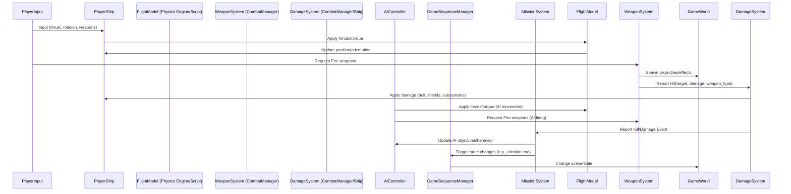

# Core Systems Architecture Plan

This document outlines the architecture for Wing Commander Saga's core systems in Godot 4.4, focusing on maintaining original gameplay while leveraging Godot's native features.

## System Overview

```mermaid
graph TD
    A[Game Engine] --> B[Core Systems]
    B --> C[Ship System]
    B --> D[Combat System]
    B --> E[AI System]
    B --> F[Flight Model]
    B --> G[Damage System]
    B --> H[Physics System]
    B --> I[Sound System]
    B --> J[Particle System]
    B --> K[Game Sequence System]
    B --> L[Localization System]
    B --> M[Math Utilities]
    B --> N[Species Definitions]
    B --> O[Statistics System]
    B --> P[Variables System]
    B --> Q[Global Constants/Variables]
    B --> R[Error Handling]

    C --> C1[Ship Types]
    C --> C2[Subsystems]
    C --> C3[Hardpoints]

    D --> D1[Weapons]
    D --> D2[Targeting]
    D --> D3[Collision]

    E --> E1[Behavior Trees]
    E --> E2[Pathfinding]
    E --> E3[Decision Making]

    F --> F1[Newtonian Model]
    F --> F2[Afterburner]
    F --> F3[Flight Assist]

    G --> G1[Shield System]
    G --> G2[Hull Damage]
    G --> G3[Subsystem Damage]

    K --> K1[State Stack]
    K --> K2[Event Queue]
    K --> K3[State Transitions]

    L --> L1[Language Selection]
    L --> L2[String Tables]
    L --> L3[XSTR System]

    M --> M1[Vector Operations]
    M --> M2[Matrix Operations]
    M --> M3[Random Number Generation]
    M --> M4[Fixed Point (Original)]
    M --> M5[Intersection Tests]

    N --> N1[Species Data]
    N --> N2[Visual Properties]
    N --> N3[Gameplay Properties]

    O --> O1[Player Statistics]
    O --> O2[Medal System]
    O --> O3[Rank System]

    P --> P1[Expression Parser]
    P --> P2[Variable Types]
    P --> P3[Game Variable Access]

    Q --> Q1[Limits (MAX_SHIPS, etc.)]
    Q --> Q2[Game Modes (GM_*)]
    Q --> Q3[Viewer Modes (VM_*)]
    Q --> Q4[Detail Levels]
    Q --> Q5[Global Colors]

    R --> R1[Logging]
    R --> R2[Assertions]
    R --> R3[Crash Handling (Original)]
```

## Key Components

### Core Game Loop & Time Management (from freespace2.cpp)
- **Main Loop (`game_frame`)**: Handles input processing (`game_process_keys`, `read_player_controls`), simulation updates (`game_simulation_frame`), rendering (`game_render_frame_setup`, `game_render_frame`, `game_render_post_frame`), and UI updates. Godot's `_process` and `_physics_process` in relevant nodes will handle this.
- **Frametime (`Frametime`, `flFrametime`)**: Calculated each frame (`game_set_frametime`), potentially capped (`Framerate_cap`). Used for physics and simulation updates. Godot provides `delta` in `_process` and `_physics_process`.
- **Mission Time (`Missiontime`)**: Tracks elapsed time within a mission (`game_update_missiontime`). A global variable or singleton property in Godot.
- **Time Compression (`Game_time_compression`, `Desired_time_compression`)**: Allows speeding up or slowing down game time, can be locked (`Time_compression_locked`). Godot's `Engine.time_scale` can be used, or custom logic applied to `delta`.
- **Pausing (`Game_paused`, `game_pause`, `game_unpause`)**: Stops/resumes game time and potentially other updates. Godot's `get_tree().paused` property manages this. Single-step debugging (`game_single_step`) is also present, achievable with Godot's debugger.
- **Screen Effects**:
    - **Flash (`game_flash`, `game_flash_diminish`)**: Applies temporary color flashes to the screen (e.g., for damage). Implementable via shaders or UI overlays.
    - **Shudder (`game_shudder_apply`, `apply_view_shake`)**: Applies camera shake effects. Godot's `Camera3D` can be manipulated directly or via noise functions.
    - **Big Explosion Flash (`big_explosion_flash`)**: Specific flash effect for large explosions. Similar to `game_flash`.
- **Level Paging (`level_page_in`)**: Loads necessary assets (ships, weapons, effects, etc.) for the current level, managed via `game_busy` callbacks. Godot's background loading (`ResourceLoader.load_threaded_request`, `ResourceLoader.load_threaded_get`) and scene instantiation can replace this. Loading screens (`game_loading_callback`) will be implemented using Godot UI scenes.
- **Initialization (`game_init`, `game_level_init`, `game_post_level_init`)**: Handles overall game setup and per-level setup (seeding random numbers, initializing subsystems, loading mission data). Godot handles engine init; game-specific init goes in Autoloads (`_ready`) and scene `_ready` functions.
- **Shutdown (`game_shutdown`, `game_level_close`)**: Cleans up resources upon exiting the game or level. Godot handles most cleanup automatically; use `_exit_tree()` for custom cleanup.

### 1. Ship System
- **Ship Types**:
  - **Fighters**: Arrow, Rapier, Hellcat, Excalibur, Dralthi, Vaktoth
  - **Bombers**: Longbow, Paktahn, Devastator
  - **Capital Ships**: Carriers, Cruisers, Destroyers, Corvettes
- **Subsystems**:
  - **Engines**: Main engines, maneuvering thrusters, afterburners
  - **Weapons**: Gun mounts, missile racks, turrets
  - **Shields**: Front, rear, left, right quadrants
  - **Power**: Generator, distribution, capacitors
  - **Sensors**: Radar, targeting, communications
- **Hardpoints**:
  - **Weapon mounts**: Primary and secondary weapon positions
  - **Turrets**: Tracking, firing arcs, rotation speeds
  - **Engine mounts**: Thruster positions, exhaust effects
- **Resource Types**:
  ```gdscript
  # Represents data loaded from ship tables (.tbl)
  class_name ShipResource extends Resource

  @export var ship_name: String
  @export var ship_class: String  # Fighter, Bomber, Capital, etc.
  @export var mesh: Mesh
  @export var collision_shape: Shape3D
  @export var hardpoints: Array[HardpointResource]
  @export var subsystems: Array[SubsystemResource]

  # Flight characteristics
  @export_group("Flight Properties")
  @export var max_speed: float
  @export var acceleration: float
  @export var rotation_rates: Vector3
  @export var mass: float
  @export var inertia_tensor: Basis

  # Combat properties
  @export_group("Combat Properties")
  @export var max_hull: float
  @export var max_shields: float
  @export var shield_recharge_rate: float
  @export var armor_rating: float

  # Visual properties
  @export_group("Visual Properties")
  @export var engine_particles: PackedScene
  @export var damage_model: PackedScene
  @export var explosion_effect: PackedScene
  ```
- **Global Limits (from globals.h)**:
  - `MAX_SHIPS`: Maximum number of ships allowed.
  - `MAX_SHIP_CLASSES`: Maximum defined ship types.
  - `MAX_WEAPONS`: Maximum weapon instances.
  - `MAX_WEAPON_TYPES`: Maximum defined weapon types.
  - `MAX_OBJECTS`: Maximum game objects.

### 2. Combat System
- **Weapon Types**:
  - **Energy weapons**: Lasers, plasma, ion, particle
  - **Projectile weapons**: Mass drivers, railguns, ballistic
  - **Missiles**: Heat-seeking, aspect-seeking, image recognition
  - **Special weapons**: EMP, flak, mines, torpedoes
- **Targeting System**:
  - Target acquisition and tracking
  - Lead indicators
  - Lock-on mechanics
  - Target prioritization
- **Damage Model**:
  - Shield penetration and absorption
  - Armor reduction
  - Hull damage with location-based effects
  - Subsystem targeting and progressive failure
  - Critical hits and cascading damage
- **Damage Tracking (`scoring_add_damage`)**: Records damage dealt by specific ships to a target ship (`Ships[].damage_ship_id`, `Ships[].damage_ship`). Used for kill/assist evaluation.

### 3. AI System
- **Behaviors**:
  ```mermaid
  stateDiagram
      [*] --> Idle
      Idle --> Patrol: No threats
      Patrol --> Search: Contact detected
      Search --> Engage: Enemy confirmed
      Engage --> Attack: Within range
      Attack --> Evade: Under heavy fire
      Evade --> Reposition: Threat reduced
      Reposition --> Attack: Safe position
      Attack --> Pursue: Target fleeing
      Pursue --> Attack: Target in range
      Attack --> RTB: Mission complete/Low health
      Evade --> RTB: Critical damage
      RTB --> [*]: Docked
  ```
- **Difficulty Levels**:
  - **Cadet**: Slower reactions, less accurate, predictable patterns
  - **Veteran**: Balanced reactions, moderate accuracy, varied tactics
  - **Ace**: Quick reactions, high accuracy, advanced maneuvers, coordinated attacks
- **Tactical Awareness**:
  - Threat assessment
  - Wingman coordination
  - Formation flying
  - Target selection based on threat level
  - Awareness of mission objectives
- **Difficulty Scaling (from freespace2.cpp, ai_profiles.tbl)**: Various parameters (reaction time, accuracy, weapon usage, shield management, countermeasure chance, fire delay, turn time) are scaled based on `Game_skill_level` defined in `ai_profiles.tbl`.

### 4. Flight Model
- **Physics Implementation**:
  - Newtonian physics with game-appropriate adjustments
  - Realistic inertia with optional dampening
  - Mass-based handling differences
- **Afterburner System**:
  - Fuel consumption and regeneration
  - Heat management
  - Performance boost characteristics
  - Visual and audio effects
- **Flight Assist Modes**:
  - Full assist (arcade-style)
  - Partial assist (balanced)
  - No assist (simulation)
  - Custom assist profiles
- **Newtonian Dampening (from ai_profiles.tbl)**: Optional flag (`use newtonian dampening`) for more realistic physics.

### 5. Damage System
- **Shield Management**:
  - Quadrant-based shield system
  - Directional damage absorption
  - Recharge mechanics and delays
  - Shield collapse and recovery
- **Hull Integrity**:
  - Progressive visual damage
  - Performance degradation
  - Critical systems failure
  - Explosion and destruction sequences
- **Subsystem Damage**:
  - Targeted subsystem effects
  - Cascading failures
  - Emergency repairs
  - Performance impacts
- **Damage Scaling (from ai_profiles.tbl)**: Optional flag (`disable weapon damage scaling`) to turn off damage scaling against large ships (like FS1).

### 6. Physics System
- **Collision Detection**:
  - Ship-to-ship collisions
  - Projectile impacts
  - Environmental collisions
- **Space Environment**:
  - Nebula effects on sensors and shields
  - Asteroid fields
  - Gravity wells
  - Jump points
- **Capship Collisions (from ai_profiles.tbl)**: Optional flag (`do capship vs capship collisions`) to enable/disable collisions between large ships.

### 7. Game Sequence System (from gamesequence.cpp, freespace2.cpp)
- **State Management**:
  - Stack-based state machine (`state_stack`, `gs_current_stack`) for game states (e.g., `GS_STATE_MAIN_MENU`, `GS_STATE_GAME_PLAY`). Max stack depth `GS_STACK_SIZE` (10).
  - `gameseq_set_state()`: Changes the current state, clearing the event queue.
  - `gameseq_push_state()`: Pushes a new state onto the stack.
  - `gameseq_pop_state()`: Pops the current state, returning to the previous one.
  - `game_enter_state()` / `game_leave_state()`: Hooks called during state transitions.
- **Event Queue**:
  - Events (`GS_EVENT_*` defined in `gamesequence.h`) are posted using `gameseq_post_event()`. Max queue size `MAX_GAMESEQ_EVENTS` (20).
  - Events are processed in the main loop via `gameseq_process_events()`, which calls `game_process_event()` for each event.
- **Godot Approach**:
  ```gdscript
  # Godot equivalent using SceneTree and potentially a custom state manager Node
  class_name GameSequenceManager
  extends Node

  # Use signals for state changes instead of direct function calls if possible
  signal state_changed(old_state_name, new_state_name)
  signal state_pushed(new_state_name)
  signal state_popped(popped_state_name)

  # State representation (could be scene paths, node names, or enums)
  var state_stack: Array = []
  var current_state_name: String = ""
  var previous_state_name: String = ""

  # Event queue (consider using Godot's Signal system or a custom queue)
  # Events could be simple Enums or custom Event Resources
  var event_queue: Array = []

  func _process(delta):
      _process_event_queue()
      # Current state's _process logic would run here (handled by SceneTree)

  func push_state(new_state_scene_path: String) -> void:
      # Load and instance the new scene
      # Emit state_pushed
      # Potentially pause the previous state's scene

  func pop_state() -> void:
      # Free the current state's scene
      # Emit state_popped
      # Resume the previous state's scene

  func set_state(new_state_scene_path: String) -> void:
      # Free the current state's scene
      # Load and instance the new scene
      # Emit state_changed

  func post_event(event_data) -> void:
      # Add event to queue (consider custom Event resource or Dictionary/Enum)
      event_queue.append(event_data)

  func _process_event_queue() -> void:
      # Process events, potentially emitting signals for different event types
      # Example: emit_signal("game_event_received", event_data)
      # Clear processed events
      pass
  ```

### 8. Localization System (from localization.cpp, localization.h)
- **Multi-language Support**:
  - English, German, French, Polish supported in original (`LCL_*` constants).
  - Character encoding handling (`lcl_fix_umlauts`, `lcl_fix_polish`). Godot uses UTF-8.
  - Font substitution for special characters (Handled by Godot's font system).
- **String Tables**:
  - Main table: `tstrings.tbl`. Parsed based on language (`#English`, `#German`, etc.).
  - Modular tables: `*-lcl.tbm` files merged in.
  - Dynamic string loading (`lcl_ext_lookup` using pre-calculated file pointers `Lcl_pointers`).
  - String formatting with variables (`lcl_replace_stuff` for `$callsign`, `$rank`, etc.).
- **XSTR System**:
  - `XSTR("Default Text", id)` macro embedded default text and ID.
  - Runtime lookup: Use localized string if ID found, else use default.
  - `Xstr_table` array held loaded strings in memory.
- **Implementation Details**:
  - Language codes (`gr`, `fr`, `pl`) used for file/path extensions (`lcl_add_dir`).
- **Godot Approach**:
  - Use Godot's built-in localization system (CSV/PO files, `tr()`). This handles loading, language switching, and basic formatting.
  - Convert `tstrings.tbl` and `*-lcl.tbm` files to CSV or PO format.
  - Replace `XSTR("Text", id)` with `tr("Text")` or `tr("STRING_KEY_" + str(id))`.
  - Use `String.format()` or `%` operator for dynamic replacements (`tr("GREETING %s") % PlayerData.callsign`).
  - Godot's UTF-8 support simplifies character handling. Ensure fonts support required characters.
  - Use Godot's resource path remapping (`ProjectSettings.locale/translation_remaps`) instead of manual path manipulation.
  ```gdscript
  # Example using Godot's built-in system
  # Assumes strings are in CSV/PO files loaded via Project Settings

  func _ready():
      # Set language via TranslationServer
      TranslationServer.set_locale("de") # Example: German

  func get_example_string() -> String:
      # Using the default text as the key (common practice)
      var greeting = tr("Hello $callsign!")

      # Using a unique key (requires mapping keys in localization files)
      # var greeting_keyed = tr("ID_GREETING")

      # Formatting
      var formatted_greeting = greeting % { "$callsign": PlayerData.callsign }
      # Or: var formatted_greeting = greeting.replace("$callsign", PlayerData.callsign)

      return formatted_greeting
  ```

### 9. Math Utilities (from math.h, fix.h, floating.h, fvi.h, spline.h, staticrand.h, vecmat.h)
- **Vector/Matrix Operations (`vecmat.h`)**: Godot's `Vector3`, `Basis`, `Transform3D`, `Quat` cover most operations (dot, cross, normalize, rotate, unrotate, matrix multiplication, angle extraction). Some specific functions (`vm_vec_delta_ang_norm`, `vm_matrix_interpolate`) might need custom GDScript versions.
- **Random Number Generation (`floating.h`, `staticrand.h`)**: Godot's `randf`, `randi`, `randfn`, and `RandomNumberGenerator` class provide equivalents for `frand`, `frand_range`, `static_rand`, `static_randf`. `RandomNumberGenerator` allows seeded, deterministic random numbers.
- **Intersection Tests (`fvi.h`)**: Functions like `fvi_ray_plane`, `fvi_segment_sphere`, `fvi_ray_boundingbox`. Godot's `PhysicsDirectSpaceState3D` (`intersect_ray`, `intersect_shape`) can replace many. Specific tests like `fvi_polyedge_sphereline` might need custom implementation using Godot's geometry functions.
- **Splines (`spline.h`)**: Bezier and Hermite splines. Godot's `Curve` and `Curve3D` resources are suitable replacements (`Curve3D.sample_baked()`).
- **Fixed Point Math (`fix.h`)**: Original used fixed-point (`fix`). Godot uses `float`. Direct port unlikely needed unless strict determinism is required (e.g., lockstep networking).

### 10. Species Definitions System (from species_defs.h, species_defs.cpp)
- **Species Data**:
  - Terran, Kilrathi, Vasudan, etc.
  - Default IFF settings (`default_iff`).
  - Team relationships (Implicit via IFF table).
- **Visual Properties**:
  - Species-specific debris textures (`debris_texture`).
  - Shield impact animations (`shield_anim`).
  - Thruster effects (`thruster_info` struct containing `thrust_pair` for flames/glows, plus secondary/tertiary glow bitmaps).
- **Gameplay Properties**:
  - AWACS multipliers (`awacs_multiplier`).
  - Species-specific bonuses (Not explicitly shown, but possible).
  - AI behavior modifiers (Not explicitly shown, but possible).
- **Implementation Details**:
  - Parsed from `species_defs.tbl` (`parse_species_tbl`).
  - `parse_thrust_anims` and `parse_thrust_glows` handle loading thruster visual assets.
- **Godot Approach**:
  ```gdscript
  # resources/species/species_info.gd
  class_name SpeciesInfo
  extends Resource

  @export var species_name: String
  @export var default_iff: int # Consider using StringName or Enum for IFF
  @export var awacs_multiplier: float = 1.0
  @export var fred_color: Color = Color.WHITE # Color used in FRED editor
  @export_group("Visuals")
  @export var debris_texture: Texture2D
  @export var shield_hit_anim: SpriteFrames # Or PackedScene for particle effect
  @export var thruster_flame_normal: PackedScene # Particle effect scene
  @export var thruster_flame_afterburner: PackedScene
  @export var thruster_glow_normal: PackedScene # Particle effect scene
  @export var thruster_glow_afterburner: PackedScene
  # Add secondary/tertiary glows if needed, likely as separate particle systems/textures
  # @export var thruster_secondary_glow_normal: Texture2D
  # @export var thruster_secondary_glow_afterburner: Texture2D
  # @export var thruster_tertiary_glow_normal: Texture2D
  # @export var thruster_tertiary_glow_afterburner: Texture2D

  # Add gameplay properties as needed
  # @export var species_bonus: float = 0.0
  ```

### 11. Statistics and Medals System (from scoring.h, medals.h, stats.h)
- **Player Statistics (`scoring_struct`)**:
  - Tracks score, rank, medals array, kills per ship type (`kills`), total kills (`kill_count`, `kill_count_ok`), assists, shots fired/hit (primary/secondary), friendly fire hits (`p_bonehead_hits`, `s_bonehead_hits`), friendly kills (`bonehead_kills`), missions flown, flight time, last flown timestamp.
  - Mission-specific stats (`m_*` prefixed variables) are tracked separately during a mission.
- **Medal System (`medal_stuff`, `medals.tbl`)**:
  - Defines medals (`Medals` vector), their names, bitmaps, number of versions (e.g., bronze, silver, gold), kill requirements (`kills_needed` for badges), promotion text, and voice lines.
  - `parse_medal_tbl()` loads medal definitions from `medals.tbl`.
  - `scoring_eval_badges()` checks total kill counts against `kills_needed` to award badges (specific medals).
- **Rank System (`rank_stuff`, `rank.tbl`)**:
  - Defines ranks (`Ranks` array), points required (`points`), rank insignia bitmap, promotion voice base, and promotion text.
  - `parse_rank_tbl()` loads rank definitions from `rank.tbl`.
  - `scoring_eval_rank()` determines promotions based on total score vs `points` required. Can be overridden by `PLAYER_FLAGS_PROMOTED`.
- **Scoring Logic**:
  - `scoring_level_init()`: Resets mission-specific stats (`m_*` variables in `scoring_struct`).
  - `scoring_add_damage()`: Tracks damage dealt by different ships to a target ship, storing attacker signature and damage amount in `damage_ship_id` and `damage_ship` arrays on the target ship.
  - `scoring_eval_kill()`: Determines the killer based on damage percentage (`Kill_percentage` threshold, default 30%) and awards points/kill stats. Considers team alignment for friendly fire penalties.
  - `scoring_eval_assists()`: Awards assists based on damage percentage (`Assist_percentage` threshold, default 15%).
  - `scoring_eval_hit()`: Tracks shots hit and friendly fire hits for accuracy stats.
  - `scoring_level_close()` / `scoring_do_accept()`: Merges mission stats into the player's permanent record (`Player->stats`) if the mission was successful (`accepted` flag).
  - `scoring_get_scale_factor()`: Applies difficulty scaling (`Scoring_scale_factors`) to scores awarded.
- **Godot Approach**:
  - Create `PlayerData` resource or singleton to hold `scoring_struct` equivalent.
  - Create `RankInfo` and `MedalInfo` resources, load from converted `.tres` or JSON files (parsed from `rank.tbl`, `medals.tbl`).
  - Implement `ScoringManager` node (singleton or scene node) with methods mirroring the C++ functions (`add_damage`, `evaluate_kill`, `evaluate_assists`, `evaluate_rank`, `evaluate_medals`, `level_init`, `level_close`). Use signals for promotions/medals earned.
  ```gdscript
  # Example ScoringManager structure
  class_name ScoringManager
  extends Node

  signal medal_earned(medal_info: MedalInfo)
  signal rank_changed(old_rank_info: RankInfo, new_rank_info: RankInfo)
  signal badge_earned(medal_info: MedalInfo) # Badges are specific medals

  # Load RankInfo and MedalInfo resources into dictionaries/arrays
  var ranks: Array[RankInfo]
  var medals: Array[MedalInfo]

  # Store damage tracking data (e.g., Dictionary[target_node: Dictionary[attacker_node: damage]])
  var damage_trackers: Dictionary = {}
  var mission_stats: Dictionary = {} # Temporary stats for current mission

  # Configurable thresholds (load from settings or AI profile)
  var kill_percentage: float = 0.30
  var assist_percentage: float = 0.15
  var scoring_scale_factor: float = 1.0 # Based on difficulty

  func level_init(player_data: PlayerData):
      # Reset mission stats dictionary
      mission_stats = { "kills": {}, "assists": 0, "score": 0, ... }
      damage_trackers.clear()
      # Set scale factor based on GameSettings.skill_level

  func add_damage(target_node: Node3D, attacker_node: Node3D, damage: float):
      # Update damage_trackers, considering target's total_damage_received

  func evaluate_kill(killed_node: Node3D):
      # Determine killer based on damage_trackers and kill_percentage
      # Award points, update kill stats in mission_stats for the killer
      # Emit signals if medals/ranks/badges are earned based on mission/total stats
      # Call evaluate_assists

  func evaluate_assists(killed_node: Node3D, killer_node: Node3D):
      # Award assists based on damage_trackers and assist_percentage
      # Update mission_stats for assisting players

  func evaluate_rank(player_data: PlayerData):
      # Check total score against RankInfo resources

  func evaluate_medals(player_data: PlayerData):
      # Check mission goals, stats against MedalInfo resources

  func level_close(player_data: PlayerData, accepted: bool):
      # Merge mission_stats into player_data.stats if accepted
      pass
  ```

### 12. Variables System (Details likely in parse/sexp related files)
- **Expression Parsing**:
  - Mathematical expression evaluation
  - Logical expression evaluation
  - Function support
- **Variable Types**:
  - Constants
  - Game variables
  - Expressions
  - Operators
- **Game Variable Access**:
  - Ship properties
  - Mission variables
  - Global game state
- **Implementation Approach**:
  - Original system likely used S-Expressions (SEXP) parsed from mission files.
  - Godot has a built-in `Expression` class which can parse and execute mathematical and simple logical expressions.
  - For more complex game logic access (ship properties, mission state), a custom parser or direct GDScript calls within mission logic might be needed. Godot's `Callable` and potentially custom expression functions could be used.
  ```gdscript
  # Example using Godot's Expression class
  class_name VariableEvaluator
  extends RefCounted

  var expression: Expression

  func _init(expression_string: String):
      expression = Expression.new()
      # Define input names based on expected context (e.g., ship properties)
      var error = expression.parse(expression_string, ["ship_hull", "target_shields"])

  func evaluate(context_object = null) -> Variant:
      # context_object could be the ship node or a dictionary of values
      if expression.has_execute_failed():
          printerr("Expression parse failed: ", expression.get_error_text())
          return null

      # Provide context values based on input names
      var inputs = []
      if context_object:
          inputs = [context_object.get("hull_strength"), context_object.get_target().get("shield_strength")] # Example
      else:
          inputs = [0, 0] # Default values if no context

      var result = expression.execute(inputs, null, false) # Use base_instance=null for simple vars

      if expression.has_execute_failed():
          printerr("Expression execution failed: ", expression.get_error_text())
          return null
      return result

  # Example usage:
  # var evaluator = VariableEvaluator.new("ship_hull < 50 and target_shields == 0")
  # var condition_met = evaluator.evaluate(PlayerShip) # Pass the player ship node
  ```

### 13. Global Constants/Variables (from globals.h, systemvars.h)
- **Limits**: `MAX_SHIPS`, `MAX_WEAPONS`, `MAX_OBJECTS`, `MAX_SHIP_CLASSES`, `MAX_WINGS`, etc. Define these as constants in a global script (Autoload) or relevant class scripts.
- **Game Modes (`GM_*`)**: Flags like `GM_NORMAL`, `GM_MULTIPLAYER`, `GM_CAMPAIGN_MODE`, `GM_DEAD`. Use a global Enum or bitflags in a singleton.
- **Viewer Modes (`VM_*`)**: Flags like `VM_EXTERNAL`, `VM_CHASE`, `VM_PADLOCK_ANY`. Use a global Enum or bitflags.
- **Detail Levels (`Detail`, `Game_detail_flags`)**: Structure defining graphics/gameplay detail settings. Use a custom Resource or Dictionary in a global settings singleton.
- **Global Colors (`alphacolors.h`)**: Predefined `Color` constants. Define these in a global script or theme.

### 14. Error Handling (from exceptionhandler.cpp, windebug.cpp)
- **Original**: Windows-specific SEH (`RecordExceptionInfo`), Asserts (`Assert`, `Assertion`), Warnings (`Warning`), Errors (`Error`), custom call stack dumping (`DumpCallsStack`).
- **Godot Approach**:
  - Use Godot's built-in logging (`print`, `printerr`, `push_warning`, `push_error`).
  - Use Godot's `assert()` function.
  - Godot provides stack traces on error in the editor debugger and logs.
  - For release builds, consider a custom error handler using `OS.crash_handler` or catching unhandled exceptions if necessary, logging to a file using `FileAccess`.

## Architecture Design

### Node Hierarchy
```
GameWorld (Node3D) # Main scene for gameplay
├── WorldEnvironment # Handles background, lighting, fog
├── SpaceEnvironment
│   ├── Background (stars, nebulae - could be part of WorldEnvironment)
│   ├── AsteroidFieldManager # Spawns/manages asteroids
│   ├── NavPointManager # Manages nav points
│   └── JumpPointManager # Manages jump points
├── ShipManager # Spawns and tracks ships
│   ├── PlayerShip (CharacterBody3D or RigidBody3D)
│   │   ├── ShipModel (Node3D containing MeshInstance3D, AnimationPlayer)
│   │   ├── SubsystemManager # Node managing subsystem nodes/data
│   │   │   ├── Engines
│   │   │   ├── WeaponsController
│   │   │   ├── ShieldController
│   │   │   └── PowerSystem
│   │   ├── HardpointManager # Node managing hardpoint Marker3Ds
│   │   │   ├── WeaponMount1 (Marker3D)
│   │   │   ├── WeaponMount2 (Marker3D)
│   │   │   └── MissileRack (Marker3D)
│   │   └── VisualEffectsManager # Node managing particle effects, etc.
│   │       ├── EngineGlow (GPUParticles3D/CPUParticles3D)
│   │       ├── ShieldImpacts (Node3D for positioning effects)
│   │       └── DamageEffects (Node3D for positioning effects)
│   └── AIController # Attached script or separate node handling AI logic
│       # AI ships instanced under ShipManager
├── CombatManager # Handles weapon firing, damage application
│   ├── WeaponManager # Spawns/pools projectiles/beams
│   │   ├── ProjectilePool # Node managing projectile instances
│   │   ├── BeamEffects # Node managing beam visuals
│   │   └── ExplosionEffects # Node managing explosion visuals/pooling
│   └── DamageSystem # Script/Node handling damage logic
│       ├── CollisionProcessor # Likely part of Godot physics callback
│       ├── ShieldManager # Script logic within ship or CombatManager
│       └── SubsystemDamage # Script logic within ship or CombatManager
├── PhysicsSystem # Largely handled by Godot, maybe custom integrator script
│   # Collision layers/masks configured in Project Settings
├── CoreSystems # Global Singletons (Autoloads) or nodes in main scene
│   ├── GameSequenceManager # Handles game state transitions
│   ├── LocalizationManager # Handles string lookups (if not using built-in)
│   ├── SpeciesManager # Holds loaded SpeciesInfo resources
│   ├── ScoringManager # Tracks stats, ranks, medals
│   ├── VariableManager # Handles expression evaluation (if needed)
│   └── GlobalSettings # Holds constants, game modes, detail levels
└── MissionSystem # Node managing current mission state
    ├── ObjectivesManager # Tracks mission goals
    ├── TriggerManager # Handles mission event triggers
    ├── WaypointManager # Manages waypoints
    └── EventManager # Processes mission events/scripting calls
```

### Data Flow


## Implementation Strategy

### Phase 1: Foundation (Core Systems)
1.  **Ship Base Implementation**
    *   Create base ship scene (`CharacterBody3D` or `RigidBody3D`).
    *   Define `ShipResource` (`.gd` script extending `Resource`).
    *   Implement basic subsystem framework (placeholder nodes/scripts).
    *   Setup hardpoint system using `Marker3D`.
    *   Build ship resource loader (script to load `.tres` files).
2.  **Flight Model Development**
    *   Implement basic movement in ship script using Godot physics (`move_and_slide` or `apply_force`/`apply_torque`).
    *   Consider custom integrator (`_integrate_forces`) if needed for Newtonian feel.
    *   Create basic flight assist toggle.
    *   Develop basic afterburner mechanics (speed boost, simple fuel).
3.  **Basic Combat Framework**
    *   Create base weapon resource/script.
    *   Implement projectile spawning (instancing scenes).
    *   Setup collision layers/masks for ships and projectiles.
    *   Build basic damage application (reducing hull variable).
4.  **Game Sequence Implementation**
    *   Create `GameSequenceManager` Autoload script.
    *   Define core game state scenes (MainMenu, Gameplay, Pause).
    *   Implement basic `push_state`, `pop_state`, `set_state` using `get_tree().change_scene_to_file` or similar.
    *   Implement basic event posting/processing (e.g., using signals).
5.  **Localization System**
    *   Choose approach: Godot built-in or custom manager.
    *   Convert `tstrings.tbl` to CSV/PO or custom format (e.g., JSON).
    *   Implement basic string lookup (`tr()` or custom function).
    *   Setup basic language switching.
6.  **Math Utilities**
    *   Identify core `vecmat` functions needed early on.
    *   Map to Godot equivalents (`Vector3`, `Basis` methods).
    *   Implement essential custom functions if needed.
    *   Setup `RandomNumberGenerator` for deterministic random numbers.

### Phase 2: Advanced Systems
1.  **AI System Implementation**
    *   Choose AI approach (State Machine, Behavior Tree).
    *   Implement basic AI states (patrol, engage, evade) in `AIController` script.
    *   Develop target selection logic (`find_target` function).
    *   Build basic formation following.
2.  **Damage Model Refinement**
    *   Implement quadrant-based shields (data structure, damage application logic).
    *   Create subsystem damage effects (apply status effects, reduce efficiency).
    *   Develop progressive visual damage (shader or model swapping).
3.  **Subsystem Interactions**
    *   Create power management system (allocate power, handle shortages).
    *   Implement system dependencies (e.g., weapons require power).
4.  **Species Definitions**
    *   Create `SpeciesInfo` resource script.
    *   Convert `species_defs.tbl` to `.tres` files or JSON.
    *   Load and use species data for visuals (thrusters, debris) and IFF.
5.  **Statistics and Medals**
    *   Create `PlayerData` resource/singleton.
    *   Implement `ScoringManager` node/singleton.
    *   Convert `rank.tbl`, `medals.tbl` to resources.
    *   Implement stat tracking, rank/medal evaluation logic.
6.  **Variables System**
    *   Implement expression evaluation using Godot's `Expression` class or custom logic for mission scripting.

### Phase 3: Polish and Integration
1.  **Performance Optimization**
    *   Implement object pooling (`NodePool` script) for projectiles, effects.
    *   Setup LOD using `VisibleOnScreenNotifier3D` and model swapping/simplification.
    *   Optimize physics (collision layers, integrator).
2.  **Difficulty Balancing**
    *   Load AI profile data based on skill level.
    *   Tune AI parameters, weapon stats.
3.  **Visual Effects Enhancement**
    *   Refine particle effects (`GPUParticles3D`).
    *   Develop shaders for shields, damage, weapons.

## Technical Considerations

### Godot Features Utilization
- **Physics System**:
  - Use Godot's 3D physics engine (`GodotPhysics` or `JoltPhysics`) with custom layers/masks.
  - `Area3D` for triggers, weapon ranges.
  - Custom integrator (`_integrate_forces`) in `RigidBody3D` or script-based movement in `CharacterBody3D` for flight model.
  - `PhysicsMaterial` for friction/bounce (less relevant for space).
- **Shader System**:
  - Use Godot Shading Language (GLSL-like) for custom visual effects (shields, engine heat, damage, weapons).
  - Visual Shaders for simpler effects.
- **Animation System**:
  - `AnimationPlayer` for model animations (landing gear, turrets).
  - `AnimationTree` for blending animations (e.g., flight states).
  - Procedural animation via GDScript (`_process` or `Tween`).
- **Particle System**:
  - `GPUParticles3D` for large-scale effects (engine trails, explosions, debris).
  - `CPUParticles3D` for smaller, more controlled effects.

### Performance Optimization
- **Spatial Partitioning**: Godot handles this internally with its octree/BVH for rendering and physics broadphase.
- **Visibility**: `VisibleOnScreenNotifier3D` nodes trigger signals when objects enter/exit the camera view. Use this for culling logic (disabling processing, hiding nodes).
- **Object Pooling**: Implement custom node pooling scripts to reuse frequently instanced scenes (projectiles, explosions).
- **LOD Management**: Use `VisibleOnScreenNotifier3D` distance checks or `GeometryInstance3D.lod_bias` combined with multi-mesh models or separate scenes for different detail levels.
- **Multithreading**: Use `Thread`, `Mutex`, `Semaphore` for custom background tasks. Godot 4 automatically threads rendering and physics to some extent. Use `WorkerThreadPool` for task distribution.

## Conversion Tools

### Python Support Scripts

```python
def convert_ship_data(ship_table_path, output_dir):
    """Convert original ship data to Godot resource"""
    # Load original ship data
    with open(ship_table_path, 'r') as f:
        ship_data = parse_ship_table(f.read())
    
    # Process each ship
    for ship in ship_data:
        # Create resource dictionary
        godot_resource = {
            'resource_type': 'ShipResource',
            'ship_name': ship['name'],
            'ship_class': ship['class'],
            'max_speed': float(ship['max_speed']),
            'acceleration': float(ship['accel']),
            'rotation_rates': {
                'pitch': float(ship['pitch_rate']),
                'yaw': float(ship['yaw_rate']),
                'roll': float(ship['roll_rate'])
            },
            'mass': float(ship['mass']),
            'max_hull': float(ship['hull_strength']),
            'max_shields': float(ship['shield_strength']),
            'shield_recharge_rate': float(ship['shield_recharge']),
            'armor_rating': float(ship['armor']),
            'hardpoints': convert_hardpoints(ship['hardpoints']),
            'subsystems': convert_subsystems(ship['subsystems'])
        }
        
        # Convert 3D model
        model_path = convert_model(ship['model_file'], output_dir)
        godot_resource['mesh_path'] = model_path
        
        # Save as Godot resource
        save_godot_resource(godot_resource, os.path.join(output_dir, f"{ship['name']}.tres"))
```

```python
def convert_weapon_data(weapon_table_path, output_dir):
    """Convert original weapon data to Godot resources"""
    # Load original weapon data
    with open(weapon_table_path, 'r') as f:
        weapon_data = parse_weapon_table(f.read())
    
    # Process each weapon
    for weapon in weapon_data:
        # Determine weapon type
        weapon_type = determine_weapon_type(weapon)
        
        # Create base resource dictionary
        godot_resource = {
            'resource_type': f"{weapon_type}Resource",
            'weapon_name': weapon['name'],
            'damage': float(weapon['damage']),
            'fire_rate': float(weapon['fire_rate']),
            'energy_cost': float(weapon['energy']),
            'range': float(weapon['range']),
            'speed': float(weapon.get('speed', 0)),
        }
        
        # Add type-specific properties
        if weapon_type == 'Laser':
            godot_resource.update({
                'beam_color': convert_color(weapon['color']),
                'beam_width': float(weapon['width']),
                'beam_duration': float(weapon.get('duration', 0.1))
            })
        elif weapon_type == 'Missile':
            godot_resource.update({
                'tracking_strength': float(weapon['tracking']),
                'lock_time': float(weapon['lock_time']),
                'explosive_radius': float(weapon['blast_radius'])
            })
        
        # Convert effects
        godot_resource['impact_effect'] = convert_effect(weapon['impact_effect'], output_dir)
        godot_resource['muzzle_effect'] = convert_effect(weapon['muzzle_effect'], output_dir)
        
        # Save as Godot resource
        save_godot_resource(godot_resource, os.path.join(output_dir, f"{weapon['name']}.tres"))
```

```python
def convert_ai_behavior(ai_table_path, output_dir):
    """Convert original AI behavior data to Godot resources"""
    # Load original AI data
    with open(ai_table_path, 'r') as f:
        ai_data = parse_ai_table(f.read())
    
    # Process each AI profile
    for profile in ai_data:
        # Create behavior tree structure
        behavior_tree = {
            'resource_type': 'BehaviorTree',
            'name': profile['name'],
            'root': create_behavior_node(profile['root_behavior']),
            'properties': {
                'aggression': float(profile['aggression']),
                'self_preservation': float(profile['preservation']),
                'skill': float(profile['skill']),
                'teamwork': float(profile['teamwork'])
            }
        }
        
        # Save as Godot resource
        save_godot_resource(behavior_tree, os.path.join(output_dir, f"{profile['name']}_ai.tres"))
```

## Testing Approach

1.  **Unit Tests** (using GodotUnit or gdUnit addon)
    *   **Ship Physics Tests**: Test `_integrate_forces` or movement functions with various inputs.
    *   **Weapon System Tests**: Test weapon resource loading, damage calculation functions.
    *   **Damage Calculation Tests**: Test shield/hull/subsystem damage logic functions.
    *   **Scoring Tests**: Test kill/assist evaluation logic.
2.  **Integration Tests**
    *   **Combat Tests**: Scenes with player vs. AI, AI vs. AI to test targeting, firing, damage.
    *   **Mission Scenario Tests**: Load simple mission resources, test objective triggers and event execution.
    *   **AI Interaction Tests**: Test wingman commands, formation flying in dedicated test scenes.
3.  **Performance Tests**
    *   **Large Scale Battle Tests**: Scenes with many ships to test rendering and physics performance using Godot's profiler.
    *   **Stress Tests**: Spawn many projectiles/effects simultaneously.
    *   **Memory Management Tests**: Use Godot's debugger/profiler to monitor memory usage over time.
4.  **Comparison Tests**
    *   **Original vs. Godot Behavior**: Side-by-side video comparison or data logging to verify key mechanics feel similar.

## Next Steps

1.  **Prototype Core Systems**
    *   Develop flight model prototype (`CharacterBody3D` or `RigidBody3D`).
    *   Implement `ShipResource` and basic ship scene structure.
    *   Create basic weapon firing and projectile scene.
2.  **Create Asset Pipeline**
    *   Develop/adapt tools for model, texture, sound conversion.
    *   Convert core ship/weapon assets.
3.  **Build Testing Framework**
    *   Set up GodotUnit/gdUnit.
    *   Create initial unit tests for math/physics.
4.  **Develop Technical Demos**
    *   Flight model demo scene.
    *   Basic combat scenario scene.
