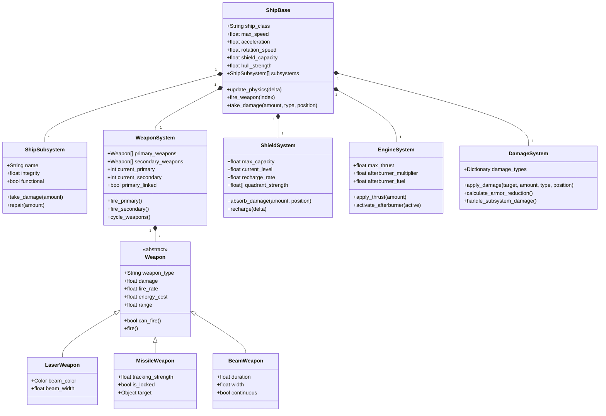

# Ship and Weapon Systems Conversion Plan

This document outlines the strategy for converting Wing Commander Saga's ship and weapon systems to Godot while maintaining the original game's flight model and combat mechanics.

## System Architecture



## Key Components to Convert

1. **Ship Physics**
   - Newtonian flight model with inertia
   - Afterburner mechanics (fuel consumption, heat, thrust multiplier)
   - Inertia dampening and flight assist systems
   - Ship-specific handling characteristics

2. **Weapon Systems**
   - Energy weapons (lasers, plasma, ion)
   - Projectile weapons (mass drivers, ballistic)
   - Missile systems (heat-seeking, aspect-seeking, image recognition)
   - Beam weapons (continuous, pulsed)
   - Special weapons (EMP, flak, shockwave)
   - Weapon groups and linking

3. **Damage Model**
   - Shield absorption with quadrant-based system
   - Hull damage with armor reduction
   - Subsystem targeting and progressive damage
   - Critical hits and failure cascades
   - Damage types (energy, kinetic, explosive, etc.)

4. **Combat Systems**
   - Target tracking and lock-on mechanics
   - Weapon leading and prediction algorithms
   - Countermeasures (chaff, flares, ECM)
   - Radar and sensor systems
   - Stealth mechanics

5. **Special Effects**
   - Weapon trails and particle effects
   - Shield impact visualization
   - Explosion and damage effects
   - Afterburner visuals

## III. C++ Codebase Analysis (Ship & Weapon Systems)

Based on the provided C++ code snippets (`ship.h`, `shipcontrails.cpp`, `shipfx.cpp`, `shiphit.cpp`, `afterburner.cpp`, `awacs.cpp`, `shield.cpp`, `weapons.cpp`, `beam.cpp`, `corkscrew.cpp`, `emp.cpp`, `flak.cpp`, `muzzleflash.cpp`, `shockwave.cpp`, `swarm.cpp`, `trails.cpp`).

### A. Key Features

*   **Ship Representation:** `ship` struct holds runtime state (position, velocity, energy, ammo, subsystems, damage, flags). `ship_info` struct holds static class data (model, physics properties, weapon mounts, shield/hull strength, sounds).
*   **Weapon Management:** `ship_weapon` struct manages primary/secondary/tertiary banks, ammo, cooldowns, linking. `weapon_info` struct defines weapon properties (damage, speed, lifetime, homing, effects).
*   **Subsystems:** `ship_subsys` struct represents individual components (turrets, engines, sensors) with health, status, targeting logic, and potential AWACS capabilities.
*   **Damage Model:** Hull and subsystem damage tracking (`current_hits`, `max_hits`). Shield system with quadrant-based absorption. Armor types (`ArmorType` class) modify incoming damage based on type. Critical hits and subsystem destruction effects.
*   **Physics & Movement:** Newtonian physics (`physics_info` within `object` struct), afterburner mechanics (`afterburner_fuel`, consumption/recharge rates), engine wash effects, contrails, maneuvering thrusters (`man_thruster`).
*   **Weapon Types:**
    *   Lasers: Defined by `WRT_LASER`, potentially with glow effects.
    *   Missiles: Homing (Heat, Aspect, Javelin), Swarm, Corkscrew, Countermeasures. Defined by `WP_MISSILE`.
    *   Beams: Various types (A-E), potentially with warmup/warmdown, particle effects, sections. Defined by `WIF_BEAM`.
    *   Special: EMP, Flak, Shockwave generation.
*   **Effects:** Muzzle flashes (`mflash_info`), weapon trails (`trail`), shield impacts, sparks (`ship_spark`), explosions (fireballs, debris, shockwaves), ship destruction sequences (including large ship blowups).
*   **Targeting & AI Interaction:** Turret targeting logic (`turret_targeting_order`), AWACS detection (`awacs_get_level`), target priority (`ai_target_priority`), homing logic (`weapon_home`), countermeasures interaction.
*   **Warp Effects:** Warp-in/out animations, sounds, speed calculations (`WarpEffect` class and derived types like `WE_Default`, `WE_BSG`, `WE_Homeworld`, `WE_Hyperspace`).
*   **Cloaking:** Cloak stages, timing, alpha blending (`shipfx_cloak_frame`).

### B. Potential Godot Solutions

*   **Ship Representation:**
    *   `ShipBase` (Node3D/RigidBody3D) for core ship scene.
    *   `ShipData` (Resource) to hold static `ship_info` data.
    *   GDScript on `ShipBase` to manage runtime `ship` struct state.
*   **Weapon Management:**
    *   `WeaponSystem` (Node) child of `ShipBase`.
    *   `WeaponData` (Resource) for `weapon_info`.
    *   `WeaponHardpoint` (Node3D) scenes instantiated under `WeaponSystem`.
    *   GDScript for weapon logic (firing, cooldown, ammo, energy).
*   **Subsystems:**
    *   `ShipSubsystem` (Node) child of `ShipBase`, potentially with specific derived classes (TurretSubsystem, EngineSubsystem).
    *   `SubsystemData` (Resource) for static `model_subsystem` info.
    *   GDScript for subsystem health, status, targeting.
*   **Damage Model:**
    *   `DamageSystem` (Node) child of `ShipBase`.
    *   `ArmorData` (Resource) for `ArmorType`.
    *   GDScript for applying damage, shield absorption, armor calculation, subsystem damage propagation.
*   **Physics & Movement:**
    *   `RigidBody3D` with custom integrator (`_integrate_forces`) for flight model.
    *   GDScript for afterburner logic, engine wash triggers.
    *   `GPUParticles3D` or custom trails for contrails/engine wash.
*   **Weapon Types:**
    *   Base `Weapon` class (GDScript) on `WeaponHardpoint`.
    *   Derived classes (`LaserWeapon`, `MissileWeapon`, `BeamWeapon`, `FlakWeapon`, `EMPWeapon`, etc.).
    *   Separate scenes/scripts for projectiles (`ProjectileBase`, `LaserProjectile`, `MissileProjectile`).
    *   `BeamWeapon` might use `Line3D` or custom mesh generation.
*   **Effects:**
    *   `GPUParticles3D` for sparks, explosions, muzzle flashes.
    *   `AnimationPlayer` for animated effects (explosions).
    *   Shaders for shield impacts, cloaking.
    *   Custom trail rendering script or `Line3D`.
    *   `Shockwave` scene/script using mesh deformation or shaders.
*   **Targeting & AI Interaction:**
    *   GDScript within `ShipSubsystem` (for turrets) and `AIController` (for main ship).
    *   Signals for communication between systems (e.g., target selected, weapon fired).
    *   Area3D for AWACS detection range.
*   **Warp Effects:**
    *   `AnimationPlayer` and `ShaderMaterial` for visual warp effects.
    *   GDScript to control timing and ship state during warp.
*   **Cloaking:**
    *   `ShaderMaterial` on the ship's mesh for alpha blending/distortion.
    *   GDScript to manage cloak state and timing.

### C. Important Methods, Classes, and Data Structures

*   **Structs:**
    *   `ship`: Central runtime data for a ship instance.
    *   `ship_info`: Static data defining a ship class.
    *   `ship_weapon`: Manages weapon banks, ammo, cooldowns for a ship or subsystem.
    *   `weapon`: Runtime data for a weapon projectile/instance.
    *   `weapon_info`: Static data defining a weapon type.
    *   `ship_subsys`: Runtime data for a ship subsystem.
    *   `model_subsystem`: Static data defining a subsystem type (part of `ship_info`).
    *   `ArmorType`: Defines damage resistance properties.
    *   `shockwave_create_info`: Parameters for creating shockwaves.
    *   `trail_info`: Parameters for weapon trails.
    *   `mflash_info`: Muzzle flash definition.
    *   `beam`, `beam_info`, `beam_weapon_info`, `beam_weapon_section_info`: Beam weapon specifics.
    *   `cscrew_info`: Corkscrew missile data.
    *   `swarm_info`, `turret_swarm_info`: Swarm missile data.
*   **Classes:**
    *   `WarpEffect` (and derived): Abstract base and implementations for warp visuals/logic.
    *   `weapon_explosions`: Manages loading and selecting explosion animations.
*   **Key Functions:**
    *   `weapon_create()`: Instantiates a weapon object.
    *   `weapon_hit()`: Handles weapon impact logic (damage, effects, sound).
    *   `weapon_process_post()`: Updates weapon state (lifetime, homing, trails).
    *   `weapon_home()`: Implements missile homing logic.
    *   `ship_apply_local_damage()`, `ship_apply_global_damage()`: Applies damage to ships.
    *   `do_subobj_hit_stuff()`: Calculates and applies damage distribution to subsystems.
    *   `do_subobj_destroyed_stuff()`: Handles subsystem destruction effects.
    *   `apply_damage_to_shield()`: Calculates shield absorption.
    *   `afterburners_start()`, `afterburners_stop()`, `afterburners_update()`: Manage afterburner state.
    *   `beam_fire()`, `beam_move_all_post()`, `beam_render_all()`: Core beam weapon functions.
    *   `shockwave_create()`, `shockwave_move_all()`: Shockwave management.
    *   `shipfx_warpin_start()`, `shipfx_warpout_start()`, `shipfx_..._frame()`: Manage warp effects.
    *   `shipfx_cloak_frame()`, `shipfx_start_cloak()`, `shipfx_stop_cloak()`: Manage cloaking.
    *   `awacs_get_level()`: Calculates AWACS detection strength.
    *   `trail_create()`, `trail_move_all()`, `trail_render_all()`: Trail management.
    *   `mflash_create()`: Creates muzzle flash effects.

### D. Relations

*   `object` struct contains `physics_info`. Ship objects (`OBJ_SHIP`) link to a `ship` struct instance. Weapon objects (`OBJ_WEAPON`) link to a `weapon` struct instance.
*   `ship` contains `ship_weapon` (for primary/secondary) and a list of `ship_subsys`.
*   `ship_subsys` can contain its own `ship_weapon` (for turrets).
*   `ship` and `ship_subsys` reference `ship_info` and `model_subsystem` respectively for static data.
*   `weapon` references `weapon_info`.
*   Damage functions (`ship_apply_local_damage`, `do_subobj_hit_stuff`) interact with `ship`, `ship_subsys`, `ArmorType`, and potentially `weapon_info` (for damage type).
*   Physics functions (`physics_apply_whack`, `physics_apply_shock`) modify `physics_info`.
*   Weapon creation (`weapon_create`, `beam_fire`) is called from `ship` or `ship_subsys` logic.
*   Weapon update (`weapon_process_post`) calls homing (`weapon_home`), trail (`trail_...`), swarm (`swarm_update_direction`), corkscrew (`cscrew_process_post`), etc. based on `weapon_info` flags.
*   Effects functions (`shipfx_...`, `mflash_create`, `shockwave_create`, `fireball_create`, `debris_create`) are called during impacts (`weapon_hit`), subsystem destruction (`do_subobj_destroyed_stuff`), or ship death.
*   Shield logic (`apply_damage_to_shield`, `do_shield_effect`) interacts with ship state and rendering.
*   AWACS logic (`awacs_get_level`) reads `ship_subsys` data (AWACS components) and affects targeting/visibility.

## IV. Conversion Approach

### 1. Ship Physics

The original Wing Commander Saga uses a custom physics model that balances realism with arcade-style gameplay. We'll implement this in Godot using a combination of RigidBody3D for basic physics and custom code for the specific flight model behaviors.

```gdscript
class_name ShipBase
extends RigidBody3D

@export_group("Flight Properties")
@export var ship_class: String
@export var max_speed: float = 100.0
@export var acceleration: float = 20.0
@export var rotation_speed: Vector3 = Vector3(1.0, 1.0, 1.0)
@export var dampening_factor: float = 0.1
@export var flight_assist: bool = true

@export_group("Afterburner")
@export var afterburner_multiplier: float = 2.0
@export var afterburner_capacity: float = 100.0
@export var afterburner_recharge_rate: float = 5.0
@export var afterburner_consumption_rate: float = 10.0

var current_velocity: Vector3 = Vector3.ZERO
var target_velocity: Vector3 = Vector3.ZERO
var afterburner_active: bool = false
var afterburner_fuel: float = 100.0

func _physics_process(delta):
    # Get input
    var input_vector = Input.get_vector("move_left", "move_right", "move_forward", "move_back")
    
    # Calculate thrust
    var thrust = -transform.basis.z * input_vector.y * acceleration
    
    # Apply afterburner if active and has fuel
    if Input.is_action_pressed("afterburner") and afterburner_fuel > 0:
        thrust *= afterburner_multiplier
        afterburner_active = true
        afterburner_fuel -= afterburner_consumption_rate * delta
    else:
        afterburner_active = false
        # Recharge afterburner when not in use
        afterburner_fuel = min(afterburner_fuel + afterburner_recharge_rate * delta, afterburner_capacity)
    
    # Calculate rotation
    var torque = Vector3(
        input_vector.y * rotation_speed.x,  # Pitch
        input_vector.x * rotation_speed.y,  # Yaw
        Input.get_axis("roll_left", "roll_right") * rotation_speed.z  # Roll
    )
    
    # Apply flight assist if enabled
    if flight_assist:
        # Gradually approach target velocity
        target_velocity = -transform.basis.z * max_speed * input_vector.y
        current_velocity = current_velocity.lerp(target_velocity, dampening_factor)
        linear_velocity = current_velocity
    else:
        # Direct force application for more realistic physics
        apply_central_force(thrust)
    
    # Apply rotation
    apply_torque(torque)
    
    # Limit maximum speed
    if linear_velocity.length() > max_speed * (afterburner_active ? afterburner_multiplier : 1.0):
        linear_velocity = linear_velocity.normalized() * max_speed * (afterburner_active ? afterburner_multiplier : 1.0)
```

### 2. Weapon Systems

Wing Commander Saga features a variety of weapon types with different behaviors. We'll implement a modular weapon system with specialized classes for each weapon type.

```gdscript
class_name WeaponSystem
extends Node3D

signal weapon_fired(weapon_index, weapon_type)
signal weapon_cycled(new_index, weapon_type)
signal ammo_changed(current, maximum)
signal energy_changed(current, maximum)

@export var primary_weapons: Array[Weapon] = []
@export var secondary_weapons: Array[Weapon] = []
@export var energy_capacity: float = 100.0
@export var energy_recharge_rate: float = 10.0

var current_primary: int = 0
var current_secondary: int = 0
var primary_linked: bool = false
var secondary_linked: bool = false
var current_energy: float = 100.0

func _ready():
    current_energy = energy_capacity
    
    # Initialize weapon hardpoints
    for weapon in primary_weapons:
        weapon.initialize(self)
    
    for weapon in secondary_weapons:
        weapon.initialize(self)

func _process(delta):
    # Recharge energy
    if current_energy < energy_capacity:
        current_energy = min(current_energy + energy_recharge_rate * delta, energy_capacity)
        energy_changed.emit(current_energy, energy_capacity)

func fire_primary():
    if primary_weapons.size() == 0:
        return
        
    if primary_linked:
        # Fire all weapons that can fire
        for weapon in primary_weapons:
            if weapon.can_fire() and current_energy >= weapon.energy_cost:
                weapon.fire()
                current_energy -= weapon.energy_cost
                energy_changed.emit(current_energy, energy_capacity)
    else:
        # Fire only selected weapon
        var weapon = primary_weapons[current_primary]
        if weapon.can_fire() and current_energy >= weapon.energy_cost:
            weapon.fire()
            current_energy -= weapon.energy_cost
            energy_changed.emit(current_energy, energy_capacity)
            weapon_fired.emit(current_primary, "primary")

func fire_secondary():
    if secondary_weapons.size() == 0:
        return
        
    var weapon = secondary_weapons[current_secondary]
    if weapon.can_fire():
        weapon.fire()
        weapon_fired.emit(current_secondary, "secondary")
        ammo_changed.emit(weapon.current_ammo, weapon.max_ammo)

func cycle_primary():
    if primary_weapons.size() <= 1:
        return
        
    current_primary = (current_primary + 1) % primary_weapons.size()
    weapon_cycled.emit(current_primary, "primary")

func cycle_secondary():
    if secondary_weapons.size() <= 1:
        return
        
    current_secondary = (current_secondary + 1) % secondary_weapons.size()
    weapon_cycled.emit(current_secondary, "secondary")
```

### 3. Weapon Type Implementations

```gdscript
class_name Weapon
extends Node3D

@export var weapon_name: String = "Default Weapon"
@export var damage: float = 10.0
@export var fire_rate: float = 0.2
@export var energy_cost: float = 5.0
@export var range: float = 1000.0
@export var speed: float = 500.0
@export var max_ammo: int = -1  # -1 for infinite

var current_ammo: int = -1
var can_fire: bool = true
var cooldown_timer: Timer
var weapon_system: WeaponSystem

func _ready():
    cooldown_timer = Timer.new()
    cooldown_timer.one_shot = true
    add_child(cooldown_timer)
    cooldown_timer.timeout.connect(_on_cooldown_end)
    
    if max_ammo > 0:
        current_ammo = max_ammo

func initialize(system: WeaponSystem):
    weapon_system = system

func can_fire() -> bool:
    return can_fire and (current_ammo > 0 or current_ammo == -1)

func fire():
    if not can_fire():
        return
        
    _perform_fire()
    
    # Start cooldown
    can_fire = false
    cooldown_timer.start(fire_rate)
    
    # Reduce ammo if applicable
    if current_ammo > 0:
        current_ammo -= 1

func _perform_fire():
    # To be overridden by subclasses
    pass

func _on_cooldown_end():
    can_fire = true
```

```gdscript
class_name LaserWeapon
extends Weapon

@export var beam_color: Color = Color(1.0, 0.0, 0.0, 1.0)
@export var beam_width: float = 0.2
@export var projectile_scene: PackedScene

func _perform_fire():
    var projectile = projectile_scene.instantiate()
    get_tree().root.add_child(projectile)
    projectile.global_transform = global_transform
    projectile.damage = damage
    projectile.speed = speed
    projectile.range = range
    projectile.color = beam_color
    projectile.width = beam_width
```

```gdscript
class_name MissileWeapon
extends Weapon

@export var tracking_strength: float = 0.5
@export var lock_time: float = 2.0
@export var projectile_scene: PackedScene

var target: Object = null
var lock_timer: float = 0.0
var is_locked: bool = false

func _process(delta):
    if target:
        lock_timer += delta
        if lock_timer >= lock_time:
            is_locked = true

func set_target(new_target):
    if new_target != target:
        target = new_target
        lock_timer = 0.0
        is_locked = false

func _perform_fire():
    var missile = projectile_scene.instantiate()
    get_tree().root.add_child(missile)
    missile.global_transform = global_transform
    missile.damage = damage
    missile.speed = speed
    missile.tracking_strength = tracking_strength
    
    if is_locked and target:
        missile.set_target(target)
```

### 4. Shield System

```gdscript
class_name ShieldSystem
extends Node

signal shield_hit(position, strength)
signal shield_depleted()
signal shield_recharged()

@export var max_capacity: float = 100.0
@export var recharge_rate: float = 5.0
@export var recharge_delay: float = 3.0
@export var quadrant_count: int = 4  # 0=front, 1=right, 2=back, 3=left

var current_level: float = 100.0
var quadrant_strength: Array[float] = []
var last_hit_time: float = 0.0

func _ready():
    current_level = max_capacity
    
    # Initialize quadrants
    quadrant_strength.resize(quadrant_count)
    for i in range(quadrant_count):
        quadrant_strength[i] = max_capacity / quadrant_count

func _process(delta):
    # Check if enough time has passed since last hit
    if Time.get_ticks_msec() - last_hit_time > recharge_delay * 1000:
        # Recharge shields
        var was_depleted = current_level <= 0
        
        current_level = min(current_level + recharge_rate * delta, max_capacity)
        
        # Distribute to quadrants
        for i in range(quadrant_count):
            quadrant_strength[i] = min(quadrant_strength[i] + (recharge_rate * delta / quadrant_count), max_capacity / quadrant_count)
        
        if was_depleted and current_level > 0:
            shield_recharged.emit()

func absorb_damage(amount: float, position: Vector3) -> float:
    # Calculate which quadrant was hit
    var quadrant = get_hit_quadrant(position)
    
    # Update last hit time
    last_hit_time = Time.get_ticks_msec()
    
    # Calculate how much damage the shield absorbs
    var absorbed = min(quadrant_strength[quadrant], amount)
    
    # Update shield levels
    quadrant_strength[quadrant] -= absorbed
    current_level -= absorbed
    
    # Emit signal for visual effects
    shield_hit.emit(position, absorbed / amount)
    
    # Check if shields are depleted
    if current_level <= 0:
        shield_depleted.emit()
    
    # Return remaining damage that penetrates the shield
    return amount - absorbed

func get_hit_quadrant(hit_position: Vector3) -> int:
    # Calculate angle from ship forward to hit position
    var local_hit = global_transform.basis.z.angle_to(hit_position - global_position)
    
    # Convert to quadrant index
    return int(fmod(local_hit + PI/quadrant_count, 2*PI) / (2*PI/quadrant_count))
```

### 5. Damage System

```gdscript
class_name DamageSystem
extends Node

signal hull_damaged(amount, position)
signal subsystem_damaged(subsystem_name, amount)
signal ship_destroyed()

@export var hull_strength: float = 200.0
@export var armor_rating: float = 0.2  # Damage reduction percentage
@export var critical_threshold: float = 0.25  # Hull percentage where critical hits start

var current_hull: float = 200.0
var subsystems: Dictionary = {}  # name -> integrity

func _ready():
    current_hull = hull_strength
    
    # Initialize subsystems
    for child in get_children():
        if child is ShipSubsystem:
            subsystems[child.name] = child.integrity

func take_damage(amount: float, damage_type: String, position: Vector3 = Vector3.ZERO):
    # Apply armor reduction
    var effective_damage = amount * (1.0 - armor_rating)
    
    # Apply damage to hull
    current_hull -= effective_damage
    hull_damaged.emit(effective_damage, position)
    
    # Check for critical hits
    if current_hull / hull_strength <= critical_threshold:
        apply_critical_hit(damage_type)
    
    # Check if destroyed
    if current_hull <= 0:
        current_hull = 0
        ship_destroyed.emit()

func apply_critical_hit(damage_type: String):
    # Random chance to damage a subsystem
    if randf() < 0.3:  # 30% chance
        var subsystem_keys = subsystems.keys()
        if subsystem_keys.size() > 0:
            var random_subsystem = subsystem_keys[randi() % subsystem_keys.size()]
            damage_subsystem(random_subsystem, 10.0 + randf() * 20.0)  # 10-30 damage

func damage_subsystem(subsystem_name: String, amount: float):
    if subsystems.has(subsystem_name):
        var subsystem = get_node(subsystem_name)
        if subsystem is ShipSubsystem:
            subsystem.take_damage(amount)
            subsystem_damaged.emit(subsystem_name, amount)
```

## Godot Implementation Structure

```
scenes/ships/
├── base_ship.tscn                # Base ship scene template
├── fighter/                      # Fighter-class ships
│   ├── arrow.tscn
│   ├── rapier.tscn
│   └── ...
├── bomber/                       # Bomber-class ships
│   ├── longbow.tscn
│   └── ...
├── capital/                      # Capital ships
│   ├── carrier.tscn
│   └── ...
└── components/                   # Reusable ship components
    ├── weapon_hardpoint.tscn
    ├── engine_exhaust.tscn
    └── ...

scripts/ship/
├── ship_base.gd                  # Base ship class
├── ship_types/                   # Ship type specializations
│   ├── fighter_ship.gd
│   ├── bomber_ship.gd
│   └── capital_ship.gd
├── systems/                      # Ship systems
│   ├── weapon_system.gd
│   ├── shield_system.gd
│   ├── engine_system.gd
│   ├── damage_system.gd
│   └── power_system.gd
├── subsystems/                   # Ship subsystems
│   ├── ship_subsystem.gd
│   ├── engine_subsystem.gd
│   ├── weapon_subsystem.gd
│   └── ...
└── physics/                      # Physics implementations
    ├── flight_model.gd
    └── inertia_dampener.gd

scripts/weapon/
├── weapon.gd                     # Base weapon class
├── weapon_types/                 # Weapon specializations
│   ├── laser_weapon.gd
│   ├── missile_weapon.gd
│   ├── beam_weapon.gd
│   └── special_weapons/
│       ├── emp_weapon.gd
│       ├── flak_weapon.gd
│       └── ...
├── projectiles/                  # Projectile implementations
│   ├── projectile_base.gd
│   ├── laser_projectile.gd
│   ├── missile_projectile.gd
│   └── ...
└── effects/                      # Weapon visual effects
    ├── muzzle_flash.gd
    ├── impact_effect.gd
    └── trail_effect.gd

resources/ships/
├── ship_templates/               # Ship configuration resources
│   ├── fighter_template.tres
│   ├── bomber_template.tres
│   └── ...
└── weapon_templates/             # Weapon configuration resources
    ├── laser_template.tres
    ├── missile_template.tres
    └── ...
```

## Conversion Challenges and Solutions

1. **Physics Model**
   - **Challenge**: Wing Commander Saga uses a custom physics implementation that balances realism with arcade-style gameplay.
   - **Godot Approach**: Use RigidBody3D as a base, but implement a custom physics layer to handle the specific flight model behaviors.
   - **Solution**: Create a hybrid system that uses Godot's physics for basic collisions but overrides velocity and rotation calculations to match the original game's feel.

2. **Weapon Effects**
   - **Challenge**: The original game has complex particle systems for weapon effects, trails, and impacts.
   - **Godot Approach**: Use Godot's GPU Particles3D system combined with Line3D for beam weapons.
   - **Solution**: Create a library of particle effects that can be instantiated and configured for different weapon types, with parameters exposed for easy tweaking.

3. **Damage System**
   - **Challenge**: Wing Commander Saga has a complex subsystem damage model with cascading failures.
   - **Godot Approach**: Implement a hierarchical node structure with ShipSubsystem nodes as children of the main ship.
   - **Solution**: Create a damage propagation system that can affect parent systems when subsystems fail, with event signals to trigger visual and gameplay effects.

4. **Missile Guidance**
   - **Challenge**: The original game has sophisticated missile guidance algorithms with different seeker types.
   - **Godot Approach**: Implement custom guidance behaviors using Godot's physics system.
   - **Solution**: Create a modular missile guidance system with different seeker components that can be mixed and matched.

5. **Shield Visualization**
   - **Challenge**: Shield impacts need to show at the correct position on a spherical shield.
   - **Godot Approach**: Use shader-based effects for shield visualization.
   - **Solution**: Create a custom shader that can show impacts at specific world-space positions on a spherical shield mesh.

6. **Special Weapon Effects**
   - **Challenge**: Special weapons like EMP, flak, and beam weapons have unique behaviors.
   - **Godot Approach**: Combine Godot's particle systems with custom code for special effects.
   - **Solution**: Create specialized weapon classes that handle their unique behaviors and visual effects.

## Testing Strategy

1. **Flight Model Tests**
   - **Basic Movement**: Verify acceleration, deceleration, and top speed match original game
   - **Rotation Control**: Test pitch, yaw, and roll rates against reference values
   - **Afterburner**: Validate thrust increase, fuel consumption, and recharge rates
   - **Inertia**: Confirm that ships maintain momentum appropriately
   - **Ship-Specific Handling**: Ensure each ship class has distinct handling characteristics

2. **Weapon System Tests**
   - **Firing Mechanics**: Test fire rates, energy consumption, and ammo tracking
   - **Weapon Linking**: Verify linked weapon groups fire correctly
   - **Projectile Physics**: Test projectile speed, range, and collision detection
   - **Damage Application**: Confirm damage values are applied correctly to targets
   - **Special Weapons**: Test unique weapon behaviors like EMP effects

3. **Damage System Tests**
   - **Shield Mechanics**: Test shield absorption, quadrant damage, and recharge
   - **Hull Damage**: Verify hull damage calculations and armor reduction
   - **Subsystem Damage**: Test progressive damage to ship subsystems
   - **Critical Hits**: Verify critical hit chances and effects
   - **Destruction Sequence**: Test ship destruction effects and game state changes

4. **Combat AI Tests**
   - **Target Selection**: Verify AI prioritizes targets appropriately
   - **Attack Patterns**: Test different attack behaviors for fighter vs capital ships
   - **Evasive Maneuvers**: Confirm AI can dodge incoming fire
   - **Formation Flying**: Test wing formations and coordinated attacks
   - **Wingman Commands**: Test AI response to player commands

5. **Performance Tests**
   - **Frame Rate**: Measure performance with multiple ships and weapons
   - **Memory Usage**: Monitor memory consumption during extended gameplay
   - **Physics Load**: Test physics performance in large-scale battles
   - **Particle Effects**: Verify particle system performance with many effects

## Migration Tools

```python
def convert_ship_data(ship_table_path, output_dir):
    """Convert ship table data to Godot resource files"""
    ship_data = parse_ship_table(ship_table_path)
    
    for ship in ship_data:
        resource = ShipResource.new()
        resource.ship_class = ship['name']
        resource.max_speed = ship['max_speed']
        resource.acceleration = ship['accel']
        
        output_path = os.path.join(output_dir, f"{ship['name']}.tres")
        ResourceSaver.save(resource, output_path)
```

## Next Steps

1. Implement base ship physics
2. Create weapon system framework
3. Develop damage model
4. Build testing scenarios
5. Create ship data converter
