# Wing Commander Saga: Godot Conversion Analysis - Component 05: Ship & Weapon Systems

This document analyzes the ship and weapon systems from the original Wing Commander Saga C++ codebase and proposes an implementation strategy for the Godot conversion project, following the guidelines in `tasks/00_analysis_setup.md`.

*Source Code Folders:* `ship/`, `weapon/`, `beam/`, `corkscrew/`, `emp/`, `flak/`, `muzzleflash/`, `shockwave/`, `swarm/`, `trails/`, `afterburner/`, `awacs/`, `shield/`

## 1. Original System Overview

This component group covers the core logic for player and AI ships, including their movement physics integration, shield mechanics, subsystem management, damage model, and afterburners. It also encompasses the diverse array of weapon types (lasers, missiles, beams, flak, EMP, swarm missiles), their firing logic, ammunition/energy management, and associated visual/audio effects (muzzle flashes, trails, impacts, shockwaves).

```mermaid
graph TD
    SW[Ship & Weapon Systems] --> SHIP[Ship Logic]
    SW --> WPN[Weapon Logic]
    SW --> DMG[Damage & Shields]
    SW --> FX[Effects]

    SHIP --> PHYS(Physics Integration);
    SHIP --> SUBSYS(Subsystem Management);
    SUBSYS --> TURRET(Turrets);
    SUBSYS --> ENGINE(Engines);
    SUBSYS --> SENSORS(Sensors/AWACS);
    SUBSYS --> NAV(Navigation);
    SUBSYS --> COMM(Communication);
    SHIP --> AB(Afterburner);
    SHIP --> CLOAK(Cloaking);
    SHIP --> WARP(Warp Drive);
    SHIP --> DOCK(Docking Logic);

    WPN --> FIRE(Firing Logic);
    WPN --> AMMO(Ammo/Energy Management);
    WPN --> TYPES(Weapon Types);
    TYPES --> LASER(Lasers);
    TYPES --> MISSILE(Missiles);
    MISSILE --> HOMING(Homing - Heat, Aspect, Javelin);
    MISSILE --> SWARM(Swarm);
    MISSILE --> CORKSCREW(Corkscrew);
    MISSILE --> CMEASURE(Countermeasures);
    TYPES --> BEAM(Beams);
    TYPES --> FLAK(Flak);
    TYPES --> EMP(EMP);
    WPN --> TARGET(Targeting Integration);
    TARGET --> LEAD(Lead Prediction);
    TARGET --> LOCK(Locking);

    DMG --> SHIELD(Shield System);
    SHIELD --> QUAD(Quadrants);
    SHIELD --> RECHARGE(Recharge);
    DMG --> HULL(Hull Integrity);
    DMG --> ARMOR(Armor Types/Reduction);
    DMG --> SUBSYS_DMG(Subsystem Damage);
    DMG --> CRITICAL(Critical Hits);
    DMG --> REPAIR(Repair System Link);

    FX --> MUZZLE(Muzzle Flashes);
    FX --> TRAILS(Weapon Trails);
    FX --> IMPACTS(Impact Effects - Sparks, Decals);
    FX --> SHIELD_FX(Shield Hit Visuals);
    FX --> EXPLODE(Explosions/Fireballs);
    FX --> SHOCKWAVE(Shockwaves);
    FX --> WARP_FX(Warp Visuals);
    FX --> CLOAK_FX(Cloak Visuals);
    FX --> ENGINE_FX(Engine Glow/Wash/Contrails);
```



## 2. Detailed Code Analysis Guidelines (Applied Here)

This analysis follows the refined guidelines from `tasks/00_analysis_setup.md`:

*   **Specificity:** Features are broken down into specific mechanics (e.g., "Shield Quadrants", "Corkscrew Missiles").
*   **Godot Mapping:** Each feature is mapped to concrete Godot nodes, resources, or techniques with justifications.
*   **Structure:** The proposed Godot structure adheres to the project standard, including necessary folders and file types. Naming is consistent.
*   **Critical Elements:** Key C++ structs, classes, and functions are identified and mapped to their Godot counterparts.
*   **Relations:** Interactions with other systems (Physics, AI, Effects, Core, Model) are explicitly described.

## 3. C++ Codebase Analysis (Ship & Weapon Systems)

Based on the provided C++ code snippets (`ship.h`, `shipcontrails.cpp`, `shipfx.cpp`, `shiphit.cpp`, `afterburner.cpp`, `awacs.cpp`, `shield.cpp`, `weapons.cpp`, `beam.cpp`, `corkscrew.cpp`, `emp.cpp`, `flak.cpp`, `muzzleflash.cpp`, `shockwave.cpp`, `swarm.cpp`, `trails.cpp`).

### A. Key Features

*   **Ship Representation:** `ship` struct holds runtime state (position, velocity, energy, ammo, subsystems, damage, flags, timers, AI link, weapon state, warp/cloak state, etc.). `ship_info` struct holds static class data (model ref, physics properties, weapon mounts, shield/hull strength, sounds, subsystem definitions, species, AI class, etc.). (from `ship.h`)
*   **Weapon Management:** `ship_weapon` struct manages primary/secondary/tertiary banks, ammo counts (`primary_bank_ammo`, `secondary_bank_ammo`), cooldowns (`next_primary_fire_stamp`, `next_secondary_fire_stamp`), linking (`SF_PRIMARY_LINKED`), and rearm times. `weapon_info` struct defines static weapon properties (damage, speed, lifetime, homing type/params, effects, flags `WIF_*`, `WIF2_*`). (from `ship.h`, `weapon.h`)
*   **Subsystems:** `ship_subsys` struct represents runtime state of individual components (turrets, engines, sensors, comms, nav, warp) with health (`current_hits`, `max_hits`), status (disrupted, destroyed), targeting logic (for turrets), and links to static `model_subsystem` data. `model_subsystem` (part of `ship_info`) defines static properties like type, mount point, FOV, turn rates, weapon banks, AWACS properties. (from `ship.h`, `model.h`)
*   **Damage Model:** Hull (`hull_strength`) and subsystem damage tracking (`current_hits`). Shield system (`shield_quadrant`) with quadrant-based absorption and recharge (`shield_recharge_index`). Armor types (`ArmorType` class, `armor_type_idx`, `shield_armor_type_idx`) modify incoming damage based on type (`damage_type_idx`). Critical hits and subsystem destruction effects (`do_subobj_destroyed_stuff`). Damage application logic (`ship_apply_local_damage`, `ship_apply_global_damage`). (from `shiphit.cpp`, `shield.cpp`, `ship.h`)
*   **Physics & Movement:** Newtonian physics integration (`physics_info` within `object` struct). Afterburner mechanics (`afterburner_fuel`, consumption/recharge rates, `PF_AFTERBURNER_ON` flag). Engine wash effects (`wash_intensity`). Contrails (`trail_ptr`). Maneuvering thrusters (`man_thruster`). (from `afterburner.cpp`, `shipcontrails.cpp`, `physics.cpp`)
*   **Weapon Types:**
    *   **Lasers:** Defined by `WRT_LASER`, potentially with glow effects (`laser_glow_bitmap`). Ballistic primaries (`SIF_BALLISTIC_PRIMARIES`). (from `weapon.h`)
    *   **Missiles:** Homing (Heat `WIF_HOMING_HEAT`, Aspect `WIF_HOMING_ASPECT`, Javelin `WIF_HOMING_JAVELIN`), Swarm (`WIF_SWARM`, `swarm.cpp`), Corkscrew (`WIF_CORKSCREW`, `corkscrew.cpp`), Countermeasures (`WIF_CMEASURE`). Defined by `WP_MISSILE`. Arming time/distance (`arm_time`, `arm_dist`). (from `weapon.h`, `swarm.cpp`, `corkscrew.cpp`)
    *   **Beams:** Various types (A-E), potentially with warmup/warmdown sounds/times, particle effects, sections (`beam_weapon_section_info`). Defined by `WIF_BEAM`. (from `beam.cpp`, `beam.h`, `weapon.h`)
    *   **Special:** EMP (`WIF_EMP`, `emp.cpp`), Flak (`WIF_FLAK`, `flak.cpp`), Shockwave generation (`shockwave` struct in `weapon_info`). (from `emp.cpp`, `flak.cpp`, `weapon.h`)
*   **Effects:** Muzzle flashes (`mflash_info`, `muzzleflash.cpp`). Weapon trails (`trail_info`, `trails.cpp`). Shield impacts (`do_shield_effect`, `shield.cpp`). Sparks (`ship_spark`, `shipfx.cpp`). Explosions (fireballs, debris, shockwaves - `fireballs.cpp`, `debris.cpp`, `shockwave.cpp`). Ship destruction sequences (`shipfx_large_blowup_init`, `shipfx.cpp`).
*   **Targeting & AI Interaction:** Turret targeting logic (`turret_targeting_order`, `turret_enemy_objnum`). AWACS detection (`awacs_get_level`, `awacs.cpp`). Target priority (`ai_target_priority`). Homing logic (`weapon_home`). Countermeasures interaction (`cmeasure_maybe_alert_success`). (from `ship.h`, `weapon.cpp`, `awacs.cpp`)
*   **Warp Effects:** Warp-in/out animations, sounds, speed calculations (`WarpEffect` class and derived types like `WE_Default`, `WE_BSG`, `WE_Homeworld`, `WE_Hyperspace`). Managed via `shipfx_warpin_start`, `shipfx_warpout_start`, etc. (from `shipfx.cpp`, `shipfx.h`)
*   **Cloaking:** Cloak stages (`cloak_stage`), timing (`time_until_full_cloak`), alpha blending (`cloak_alpha`). Managed via `shipfx_cloak_frame`, `shipfx_start_cloak`, `shipfx_stop_cloak`. (from `shipfx.cpp`, `ship.h`)

### B. Potential Godot Solutions

*   **Ship Representation:**
    *   **Scene:** `ShipBase.tscn` (inheriting from `RigidBody3D` or `CharacterBody3D`) as the root node for each ship instance.
    *   **Resource:** `ShipData.tres` (extends `Resource`, script `ship_data.gd`) to hold static `ship_info` data (model path, physics constants, weapon mounts, subsystem definitions, shield/hull values, sounds, species, AI class, flags `SIF_*`, `SIF2_*`).
    *   **Script:** `ShipBase.gd` attached to the root node. Manages runtime state (current hull/shields, energy, ammo, subsystem status, flags `SF_*`, `SF2_*`, timers, AI link, warp/cloak state). Contains references to child nodes (WeaponSystem, ShieldSystem, DamageSystem, EngineSystem, Subsystem nodes).
*   **Weapon Management:**
    *   **Node:** `WeaponSystem.gd` (extends `Node`) attached to `ShipBase`. Manages weapon banks, energy, ammo pools, firing logic, cycling, linking.
    *   **Resource:** `WeaponData.tres` (extends `Resource`, script `weapon_data.gd`) for static `weapon_info` (damage, speed, lifetime, homing params, effects, flags `WIF_*`, `WIF2_*`, sounds, model path, beam info, trail info, etc.).
    *   **Scene:** `WeaponHardpoint.tscn` (extends `Node3D`) representing a mount point. Instantiated under `WeaponSystem`. Contains logic for a specific weapon instance (cooldown timer).
    *   **Script:** `Weapon.gd` (base class, attached to `WeaponHardpoint.tscn`), with derived classes (`LaserWeapon.gd`, `MissileWeapon.gd`, `BeamWeapon.gd`, `FlakWeapon.gd`, `EMPWeapon.gd`, `SwarmWeapon.gd`, `CorkscrewWeapon.gd`) implementing specific firing logic and projectile creation.
    *   **Projectiles:** Separate scenes (`ProjectileBase.tscn`, `LaserProjectile.tscn`, `MissileProjectile.tscn`, etc.) with attached scripts (`ProjectileBase.gd`, `LaserProjectile.gd`, `MissileProjectile.gd`) handling movement, lifetime, homing, collision, and effects.
*   **Subsystems:**
    *   **Node:** `ShipSubsystem.gd` (extends `Node`) attached to specific `Node3D` locations within the `ShipBase` scene hierarchy (representing the submodel). Manages runtime health, status (disrupted, destroyed).
    *   **Resource:** Subsystem definitions stored within `ShipData.tres` (linking to submodel names/paths, defining type, static health, turret properties, AWACS params, etc.).
    *   **Derived Nodes/Scripts:** `TurretSubsystem.gd`, `EngineSubsystem.gd`, `SensorSubsystem.gd` for specialized logic (turret aiming, engine effects, sensor range/disruption). Turrets would contain a child `WeaponSystem` node.
*   **Damage Model:**
    *   **Node:** `DamageSystem.gd` (extends `Node`) attached to `ShipBase`. Handles receiving damage signals/calls, applying armor reduction, distributing damage to hull and subsystems.
    *   **Resource:** `ArmorData.tres` (extends `Resource`, script `armor_data.gd`) defining damage resistances per type (maps to `ArmorType`). Referenced by `ShipData` and potentially `SubsystemData`.
    *   **Script Logic:** Damage application (`apply_damage`), shield interaction (calling `ShieldSystem.absorb_damage`), hull reduction, subsystem damage propagation (finding nearby subsystems), critical hit checks.
*   **Physics & Movement:**
    *   **Node:** Use `RigidBody3D` for ships.
    *   **Script:** Implement custom integrator (`_integrate_forces` in `ShipBase.gd` or a dedicated `FlightModel.gd` script) to replicate the specific Newtonian flight model, damping, acceleration curves, and afterburner effects described in `physics.cpp`. Read physics constants from `ShipData.tres`.
    *   **Effects:** `GPUParticles3D` for contrails/engine wash, controlled by `EngineSubsystem.gd` or `ShipBase.gd`.
*   **Weapon Types:**
    *   **Lasers:** `LaserProjectile.tscn` (potentially a simple `Node3D` with a `MeshInstance3D` for the beam visual and script for movement/collision). `LaserWeapon.gd` instantiates this.
    *   **Missiles:** `MissileProjectile.tscn` (likely `RigidBody3D` or `CharacterBody3D`) with `MissileProjectile.gd` handling movement, lifetime, and homing logic (steering towards target). Homing types implemented within this script based on `WeaponData`.
    *   **Swarm/Corkscrew:** Specific logic within `MissileProjectile.gd` or derived scripts, potentially using `Curve3D` or mathematical functions for pathing, managed by `SwarmWeapon.gd`/`CorkscrewWeapon.gd`.
    *   **Beams:** `BeamWeapon.gd` uses `RayCast3D` for hit detection. Visuals via custom mesh generation (`ImmediateMesh`), `Line3D`, or shaders. Damage applied over time to hit objects.
    *   **Flak:** `FlakWeapon.gd` fires a projectile (`FlakProjectile.tscn`) which detonates after a set range (`det_range` from `WeaponData`), creating an area effect (instantiating an `Area3D` or using `PhysicsServer3D.body_test_motion` for damage).
    *   **EMP:** `EMPWeapon.gd` fires a projectile (`EMPProjectile.tscn`) that triggers an EMP effect on impact (calling `EmpManager.apply_emp`).
*   **Effects:**
    *   **Muzzle Flash:** Instantiate `MuzzleFlash.tscn` (using `GPUParticles3D` or `AnimatedSprite3D`) at the weapon hardpoint, configured by `WeaponData`. Managed by `MuzzleFlashManager.gd` or directly by `Weapon.gd`.
    *   **Trails:** `RibbonTrailMesh` or `TubeTrailMesh` nodes attached to projectiles, configured by `trail_info` in `WeaponData`. Managed by `TrailManager.gd` or projectile scripts.
    *   **Shield Impacts:** Triggered by `ShieldSystem.absorb_damage`. Visual effect using shaders on the shield mesh or instantiating a particle effect (`GPUParticles3D`) at the impact point.
    *   **Sparks:** Instantiate `SparkEffect.tscn` (`GPUParticles3D`) at impact points, managed by `DamageSystem.gd`.
    *   **Explosions/Fireballs:** Instantiate `Explosion.tscn` (`GPUParticles3D`, `AnimationPlayer`, `OmniLight3D`, `AudioStreamPlayer3D`) managed by `ExplosionManager.gd`. Use different scenes/configurations based on `weapon_expl_info`.
    *   **Shockwaves:** Instantiate `Shockwave.tscn` (potentially a growing `MeshInstance3D` with a shader or `GPUParticles3D`). `Shockwave.gd` script handles expansion, lifetime, and damage application (using `Area3D` or physics queries). Managed by `ShockwaveManager.gd`.
*   **Targeting & AI Interaction:**
    *   Turret aiming logic in `TurretSubsystem.gd`.
    *   AWACS detection range implemented using `Area3D` on sensor subsystems. `awacs_get_level` logic implemented in a global utility or `SensorSubsystem.gd`.
    *   Homing logic in `MissileProjectile.gd`.
    *   Countermeasure interaction: Missiles check for nearby countermeasures (`Area3D` or distance checks) and potentially change target or detonate based on effectiveness values.
*   **Warp Effects:**
    *   Instantiate `WarpEffect.tscn` managed by `WarpEffectManager.gd`. Scene uses `AnimationPlayer`, shaders (`ShaderMaterial`), and potentially `GPUParticles3D` for visuals. `WarpEffect.gd` script controls timing and ship state changes (e.g., disabling physics during warp).
*   **Cloaking:**
    *   Apply a `ShaderMaterial` with cloaking effect (alpha blend, distortion) to the ship's `MeshInstance3D`. Control shader uniforms (`alpha`, `distortion_amount`) via GDScript (`ShipBase.gd`) based on cloak stage and timing.

### C. Outline Target Godot Project Structure

```
wcsaga_godot/
├── resources/
│   ├── ships/              # ShipData resources (.tres)
│   │   ├── hercules.tres
│   │   └── ...
│   ├── weapons/            # WeaponData resources (.tres)
│   │   ├── laser_light.tres
│   │   ├── missile_heatseeker.tres
│   │   ├── beam_cannon.tres
│   │   └── ...
│   ├── subsystems/         # (Optional) SubsystemData resources if needed separately
│   ├── armor/              # ArmorData resources (.tres)
│   └── effects/            # Resources for effects (particle materials, etc.)
├── scenes/
│   ├── ships_weapons/      # Ship and Weapon scenes (.tscn)
│   │   ├── base_ship.tscn
│   │   ├── hercules.tscn
│   │   ├── components/
│   │   │   ├── weapon_hardpoint.tscn
│   │   │   ├── turret_base.tscn
│   │   │   └── engine_nozzle.tscn
│   │   ├── projectiles/
│   │   │   ├── projectile_base.tscn
│   │   │   ├── laser_projectile.tscn
│   │   │   └── missile_projectile.tscn
│   │   └── weapons/ # Scenes for complex weapons like beams
│   │       └── beam_weapon_visual.tscn
│   ├── effects/            # Effect scenes (.tscn)
│   │   ├── explosion_medium.tscn
│   │   ├── shield_impact.tscn
│   │   ├── muzzle_flash.tscn
│   │   ├── shockwave.tscn
│   │   ├── warp_effect.tscn
│   │   └── spark_effect.tscn
│   └── ...
├── scripts/
│   ├── ship_weapon_systems/ # Main component scripts
│   │   ├── ship_base.gd          # Base ship logic, physics integration, state
│   │   ├── weapon_system.gd      # Manages weapon banks, firing, energy/ammo
│   │   ├── shield_system.gd      # Manages shield state, recharge, damage absorption
│   │   ├── damage_system.gd      # Applies damage, handles hull/subsystem integrity
│   │   ├── engine_system.gd      # Handles afterburner logic, potentially thrust effects
│   │   ├── subsystems/           # Subsystem logic
│   │   │   ├── ship_subsystem.gd   # Base subsystem state
│   │   │   ├── turret_subsystem.gd # Turret aiming, firing control
│   │   │   ├── engine_subsystem.gd # Engine specific logic/effects
│   │   │   └── sensor_subsystem.gd # Sensor/AWACS logic
│   │   ├── weapons/              # Weapon instance logic
│   │   │   ├── weapon.gd           # Base weapon logic (cooldown)
│   │   │   ├── laser_weapon.gd
│   │   │   ├── missile_weapon.gd
│   │   │   ├── beam_weapon.gd
│   │   │   ├── flak_weapon.gd
│   │   │   ├── emp_weapon.gd
│   │   │   ├── swarm_weapon.gd
│   │   │   └── corkscrew_weapon.gd
│   │   └── projectiles/          # Projectile logic
│   │       ├── projectile_base.gd  # Movement, lifetime, collision
│   │       ├── laser_projectile.gd
│   │       └── missile_projectile.gd # Homing logic
│   ├── resources/          # Scripts defining custom Resource types
│   │   ├── ship_data.gd
│   │   ├── weapon_data.gd
│   │   ├── subsystem_data.gd # (If needed)
│   │   └── armor_data.gd
│   ├── effects/            # Scripts for managing effects
│   │   ├── explosion_manager.gd  # Singleton/Autoload
│   │   ├── shockwave_manager.gd  # Singleton/Autoload
│   │   ├── trail_manager.gd      # Singleton/Autoload
│   │   ├── muzzle_flash_manager.gd # Singleton/Autoload
│   │   ├── warp_effect_manager.gd # Singleton/Autoload
│   │   └── spark_manager.gd      # Singleton/Autoload
│   └── ...
├── shaders/
│   ├── shield_impact.gdshader
│   ├── cloak.gdshader
│   └── engine_wash.gdshader
│   └── ...
```

### D. Identify Important Methods, Classes, and Data Structures

*   **C++ Structs/Classes:**
    *   `ship`: Runtime ship state. -> `ShipBase.gd` properties.
    *   `ship_info`: Static ship data. -> `ShipData.tres` resource.
    *   `ship_weapon`: Runtime weapon bank state. -> `WeaponSystem.gd` properties.
    *   `weapon`: Runtime projectile state. -> `ProjectileBase.gd` properties.
    *   `weapon_info`: Static weapon data. -> `WeaponData.tres` resource.
    *   `ship_subsys`: Runtime subsystem state. -> `ShipSubsystem.gd` properties.
    *   `model_subsystem`: Static subsystem data. -> Defined within `ShipData.tres`.
    *   `ArmorType`: Damage resistance. -> `ArmorData.tres` resource.
    *   `shockwave_create_info`: Shockwave parameters. -> Properties within `WeaponData.tres` or passed to `ShockwaveManager`.
    *   `trail_info`: Trail parameters. -> Properties within `WeaponData.tres` or passed to `TrailManager`.
    *   `mflash_info`: Muzzle flash definition. -> Properties within `WeaponData.tres` or passed to `MuzzleFlashManager`.
    *   `beam_info`, `beam_weapon_info`, `beam_weapon_section_info`: Beam specifics. -> Properties within `WeaponData.tres`.
    *   `cscrew_info`: Corkscrew state. -> Managed within `CorkscrewWeapon.gd` or `MissileProjectile.gd`.
    *   `swarm_info`, `turret_swarm_info`: Swarm state. -> Managed within `SwarmWeapon.gd` or `MissileProjectile.gd`.
    *   `WarpEffect` (and derived): Warp logic/visuals. -> `WarpEffect.tscn` scene with `WarpEffect.gd` script, managed by `WarpEffectManager.gd`.
*   **C++ Key Functions:**
    *   `weapon_create()`: -> `WeaponSystem.gd` instantiates projectile scenes.
    *   `weapon_hit()`: -> Collision handling logic in `ProjectileBase.gd` or `CollisionHandler.gd`, calls `DamageSystem.apply_damage`.
    *   `weapon_process_post()`: -> `_physics_process()` in `ProjectileBase.gd` (lifetime, homing).
    *   `weapon_home()`: -> Homing logic within `MissileProjectile.gd`.
    *   `ship_apply_local_damage()`, `ship_apply_global_damage()`: -> `DamageSystem.apply_damage()`.
    *   `do_subobj_hit_stuff()`: -> Damage distribution logic within `DamageSystem.gd`.
    *   `do_subobj_destroyed_stuff()`: -> Subsystem destruction logic in `ShipSubsystem.gd` or `DamageSystem.gd`, triggers effects.
    *   `apply_damage_to_shield()`: -> `ShieldSystem.absorb_damage()`.
    *   `afterburners_start()`, `afterburners_stop()`, `afterburners_update()`: -> Methods in `EngineSystem.gd` or `ShipBase.gd`.
    *   `beam_fire()`, `beam_move_all_post()`, `beam_render_all()`: -> Logic within `BeamWeapon.gd` and potentially a `BeamVisual.tscn/gd`.
    *   `shockwave_create()`, `shockwave_move_all()`: -> `ShockwaveManager.create_shockwave()`, logic within `Shockwave.gd`.
    *   `shipfx_warpin_start()`, `shipfx_warpout_start()`, `shipfx_..._frame()`: -> `WarpEffectManager.create_warp_in/out()`, logic within `WarpEffect.gd`.
    *   `shipfx_cloak_frame()`, `shipfx_start_cloak()`, `shipfx_stop_cloak()`: -> Methods in `ShipBase.gd` controlling cloak shader/state.
    *   `awacs_get_level()`: -> Method in `SensorSubsystem.gd` or global utility.
    *   `trail_create()`, `trail_move_all()`, `trail_render_all()`: -> `TrailManager.create_trail()`, logic within trail node scripts.
    *   `mflash_create()`: -> `MuzzleFlashManager.create_flash()`.

### E. Identify Relations

*   **ShipBase** integrates **Physics** (`_integrate_forces`), manages child **Systems** (Weapon, Shield, Damage, Engine), holds **Subsystems**, and references **ShipData**.
*   **WeaponSystem** manages **Weapon** instances (hardpoints), interacts with **ShipBase** for energy/ammo, and instantiates **Projectiles**. Reads **WeaponData**.
*   **DamageSystem** receives hit info (from **Projectiles** or **CollisionHandler**), interacts with **ShieldSystem**, applies damage to **ShipBase** (hull) and **ShipSubsystems**. Reads **ArmorData**.
*   **ShieldSystem** absorbs damage, manages quadrants, recharges. Interacts with **ShipBase** for energy. Visuals controlled via shaders.
*   **EngineSystem** handles afterburner state, interacts with **ShipBase** for fuel/energy and physics modifications. Triggers **Effects** (engine glow/wash).
*   **Projectiles** handle their own movement (**Physics**), lifetime, homing (**AI**/**Targeting**), collision detection (**Physics**), and trigger **Effects** (impacts, trails) and **Damage** application. Read **WeaponData**.
*   **Effects Managers** (Explosion, Shockwave, Trail, etc.) are called by various systems (Weapons, Projectiles, DamageSystem) to instantiate visual/audio effects scenes.
*   **AI System** interacts with **WeaponSystem** (firing decisions), **Targeting** (selecting targets/subsystems), **ShipBase** (movement commands), and potentially **ShieldSystem** (smart shield management). Reads **AIProfile**.
*   **Model System** provides the visual meshes and structure referenced by **ShipBase**, **Subsystems**, and **Projectiles**. `Marker3D`s define mount points. `AnimationPlayer` handles submodel movement.
*   **Core Systems** manage object lifecycle and the main game loop driving updates.

## 5. Conversion Strategy Notes

*   **Data-Driven Design:** Rely heavily on Godot `Resource` files (`ShipData`, `WeaponData`, `ArmorData`, etc.) to define ship and weapon properties. This makes balancing and modification easier than hardcoding values.
*   **Component-Based:** Use Godot nodes as components (`WeaponSystem`, `ShieldSystem`, `DamageSystem`, `EngineSystem`, `TurretSubsystem`) attached to the main `ShipBase` scene.
*   **Physics:** Use `RigidBody3D` but implement `_integrate_forces` in `ShipBase.gd` (or a dedicated `FlightModel.gd`) to precisely replicate the FS2 flight model, reading parameters from `ShipData`.
*   **Weapons:** Create a base `Weapon.gd` script for hardpoints and derive specific types. Projectiles should be separate scenes with their own logic.
*   **Effects:** Use Godot's particle systems (`GPUParticles3D`), shaders (`ShaderMaterial`), and `AnimationPlayer`. Create reusable effect scenes managed by Singleton managers.
*   **Subsystems:** Represent subsystems as nodes within the ship hierarchy. Link their state (health, disruption) to the main `ShipBase.gd` script. Turrets need specific aiming and firing logic (`TurretSubsystem.gd`).
*   **Signals:** Use signals extensively for communication between systems (e.g., `Projectile.collided`, `DamageSystem.hull_damaged`, `ShieldSystem.shield_depleted`, `WeaponSystem.weapon_fired`).

## 6. Testing Strategy (Refined)

1.  **Flight Model Tests:** Verify acceleration, max speed (forward/reverse), rotation rates, damping, afterburner thrust/fuel mechanics against `ship_info` and `physics_info` data for multiple ship classes. Test glide mode (`PF_GLIDING`).
2.  **Weapon System Tests:** Test firing rates (`fire_wait`), energy consumption (`energy_consumed`), ammo usage, weapon linking (`SF_PRIMARY_LINKED`), cycling for all weapon types defined in `WeaponData`. Verify projectile creation.
3.  **Projectile Tests:** Test projectile speed (`max_speed`), lifetime (`lifetime`), range, collision detection, homing logic (aspect, heat, javelin - `WIF_HOMING_*`), swarm/corkscrew behavior (`WIF_SWARM`, `WIF_CORKSCREW`), arming time/distance (`arm_time`, `arm_dist`).
4.  **Damage System Tests:** Test shield absorption (`apply_damage_to_shield`), quadrant mapping, recharge. Test hull damage application, including armor reduction (`ArmorType`, `armor_factor`). Test subsystem damage distribution (`do_subobj_hit_stuff`) and destruction effects. Verify damage types.
5.  **Subsystem Tests:** Test turret tracking/firing (`TurretSubsystem.gd`), engine functionality/failure, sensor disruption (link to HUD/Radar), AWACS range/effect (`awacs_get_level`).
6.  **Effects Tests:** Verify muzzle flashes (`mflash_create`), trails (`trail_create`), shield impacts (`do_shield_effect`), sparks (`shipfx_emit_spark`), explosions (`fireball_create`), shockwaves (`shockwave_create`), warp (`shipfx_warpin_start`), and cloak visuals/audio match descriptions and trigger correctly.
7.  **Integration Tests:** Combine ships, weapons, AI, and effects in combat scenarios. Test ship-ship collisions, weapon impacts, subsystem targeting, and ship destruction sequences.

## 7. Next Steps

1.  Define and implement `ShipData.tres` and `WeaponData.tres` resource structures and associated `.gd` scripts.
2.  Implement the base `ShipBase.gd` script with `_integrate_forces` for the core flight model.
3.  Implement `WeaponSystem.gd` and base `Weapon.gd` / `ProjectileBase.gd` scripts.
4.  Implement `ShieldSystem.gd` and `DamageSystem.gd`.
5.  Create basic laser weapon and projectile implementation.
6.  Develop test scenes for flight model validation and basic weapon firing/impact.
