# Wing Commander Saga: Godot Conversion Analysis - Component 05: Ship & Weapon Systems

This document analyzes the ship and weapon systems from the original Wing Commander Saga C++ codebase and proposes an implementation strategy for the Godot conversion project, following the guidelines in `tasks/00_analysis_setup.md`.

*Source Code Folders:* `ship/`, `weapon/`, `beam/`, `corkscrew/`, `emp/`, `flak/`, `muzzleflash/`, `shockwave/`, `swarm/`, `trails/`, `afterburner/`, `awacs/`, `shield/`

## 1. Original System Overview

This component group covers the core logic for player and AI ships, including their movement physics integration, shield mechanics, subsystem management, damage model, and afterburners. It also encompasses the diverse array of weapon types (lasers, missiles, beams, flak, EMP, swarm missiles), their firing logic, ammunition/energy management, and associated visual/audio effects (muzzle flashes, trails, impacts, shockwaves).

```mermaid
graph TD
    SW[Ship & Weapon Systems] --> SHIP[Ship Logic]
    SW --> WPN[Weapon Logic]
    SW --> DMG[Damage & Shields]
    SW --> FX[Effects]

    SHIP --> PHYS(Physics Integration);
    SHIP --> SUBSYS(Subsystem Management);
    SUBSYS --> TURRET(Turrets);
    SUBSYS --> ENGINE(Engines);
    SUBSYS --> SENSORS(Sensors/AWACS);
    SUBSYS --> NAV(Navigation);
    SUBSYS --> COMM(Communication);
    SHIP --> AB(Afterburner);
    SHIP --> CLOAK(Cloaking);
    SHIP --> WARP(Warp Drive);
    SHIP --> DOCK(Docking Logic);

    WPN --> FIRE(Firing Logic);
    WPN --> AMMO(Ammo/Energy Management);
    WPN --> TYPES(Weapon Types);
    TYPES --> LASER(Lasers);
    TYPES --> MISSILE(Missiles);
    MISSILE --> HOMING(Homing - Heat, Aspect, Javelin);
    MISSILE --> SWARM(Swarm);
    MISSILE --> CORKSCREW(Corkscrew);
    MISSILE --> CMEASURE(Countermeasures);
    TYPES --> BEAM(Beams);
    TYPES --> FLAK(Flak);
    TYPES --> EMP(EMP);
    WPN --> TARGET(Targeting Integration);
    TARGET --> LEAD(Lead Prediction);
    TARGET --> LOCK(Locking);

    DMG --> SHIELD(Shield System);
    SHIELD --> QUAD(Quadrants);
    SHIELD --> RECHARGE(Recharge);
    DMG --> HULL(Hull Integrity);
    DMG --> ARMOR(Armor Types/Reduction);
    DMG --> SUBSYS_DMG(Subsystem Damage);
    DMG --> CRITICAL(Critical Hits);
    DMG --> REPAIR(Repair System Link);

    FX --> MUZZLE(Muzzle Flashes);
    FX --> TRAILS(Weapon Trails);
    FX --> IMPACTS(Impact Effects - Sparks, Decals);
    FX --> SHIELD_FX(Shield Hit Visuals);
    FX --> EXPLODE(Explosions/Fireballs);
    FX --> SHOCKWAVE(Shockwaves);
    FX --> WARP_FX(Warp Visuals);
    FX --> CLOAK_FX(Cloak Visuals);
    FX --> ENGINE_FX(Engine Glow/Wash/Contrails);
```



## 2. Detailed Code Analysis Guidelines (Applied Here)

This analysis follows the refined guidelines from `tasks/00_analysis_setup.md`:

*   **Specificity:** Features are broken down into specific mechanics (e.g., "Shield Quadrants", "Corkscrew Missiles").
*   **Godot Mapping:** Each feature is mapped to concrete Godot nodes, resources, or techniques with justifications.
*   **Structure:** The proposed Godot structure adheres to the project standard, including necessary folders and file types. Naming is consistent.
*   **Critical Elements:** Key C++ structs, classes, and functions are identified and mapped to their Godot counterparts.
*   **Relations:** Interactions with other systems (Physics, AI, Effects, Core, Model) are explicitly described.

## 3. C++ Codebase Analysis (Ship & Weapon Systems)

Based on the provided C++ code snippets (`ship.h`, `shipcontrails.cpp`, `shipfx.cpp`, `shiphit.cpp`, `afterburner.cpp`, `awacs.cpp`, `shield.cpp`, `weapons.cpp`, `beam.cpp`, `corkscrew.cpp`, `emp.cpp`, `flak.cpp`, `muzzleflash.cpp`, `shockwave.cpp`, `swarm.cpp`, `trails.cpp`).

### A. Key Features

*   **Ship Representation:** `ship` struct holds runtime state (position, velocity, energy, ammo, subsystems, damage, flags, timers, AI link, weapon state, warp/cloak state, etc.). `ship_info` struct holds static class data (model ref, physics properties, weapon mounts, shield/hull strength, sounds, subsystem definitions, species, AI class, etc.). (from `ship.h`)
*   **Weapon Management:** `ship_weapon` struct manages primary/secondary/tertiary banks, ammo counts (`primary_bank_ammo`, `secondary_bank_ammo`), cooldowns (`next_primary_fire_stamp`, `next_secondary_fire_stamp`), linking (`SF_PRIMARY_LINKED`), and rearm times. `weapon_info` struct defines static weapon properties (damage, speed, lifetime, homing type/params, effects, flags `WIF_*`, `WIF2_*`). (from `ship.h`, `weapon.h`)
*   **Subsystems:** `ship_subsys` struct represents runtime state of individual components (turrets, engines, sensors, comms, nav, warp) with health (`current_hits`, `max_hits`), status (disrupted, destroyed), targeting logic (for turrets), and links to static `model_subsystem` data. `model_subsystem` (part of `ship_info`) defines static properties like type, mount point, FOV, turn rates, weapon banks, AWACS properties. (from `ship.h`, `model.h`)
*   **Damage Model:** Hull (`hull_strength`) and subsystem damage tracking (`current_hits`). Shield system (`shield_quadrant`) with quadrant-based absorption and recharge (`shield_recharge_index`). Armor types (`ArmorType` class, `armor_type_idx`, `shield_armor_type_idx`) modify incoming damage based on type (`damage_type_idx`). Critical hits and subsystem destruction effects (`do_subobj_destroyed_stuff`). Damage application logic (`ship_apply_local_damage`, `ship_apply_global_damage`). (from `shiphit.cpp`, `shield.cpp`, `ship.h`)
*   **Physics & Movement:** Newtonian physics integration (`physics_info` within `object` struct). Afterburner mechanics (`afterburner_fuel`, consumption/recharge rates, `PF_AFTERBURNER_ON` flag). Engine wash effects (`wash_intensity`). Contrails (`trail_ptr`). Maneuvering thrusters (`man_thruster`). (from `afterburner.cpp`, `shipcontrails.cpp`, `physics.cpp`)
*   **Weapon Types:**
    *   **Lasers:** Defined by `WRT_LASER`, potentially with glow effects (`laser_glow_bitmap`). Ballistic primaries (`SIF_BALLISTIC_PRIMARIES`). (from `weapon.h`)
    *   **Missiles:** Homing (Heat `WIF_HOMING_HEAT`, Aspect `WIF_HOMING_ASPECT`, Javelin `WIF_HOMING_JAVELIN`), Swarm (`WIF_SWARM`, `swarm.cpp`), Corkscrew (`WIF_CORKSCREW`, `corkscrew.cpp`), Countermeasures (`WIF_CMEASURE`). Defined by `WP_MISSILE`. Arming time/distance (`arm_time`, `arm_dist`). (from `weapon.h`, `swarm.cpp`, `corkscrew.cpp`)
    *   **Beams:** Various types (A-E), potentially with warmup/warmdown sounds/times, particle effects, sections (`beam_weapon_section_info`). Defined by `WIF_BEAM`. (from `beam.cpp`, `beam.h`, `weapon.h`)
    *   **Special:** EMP (`WIF_EMP`, `emp.cpp`), Flak (`WIF_FLAK`, `flak.cpp`), Shockwave generation (`shockwave` struct in `weapon_info`). (from `emp.cpp`, `flak.cpp`, `weapon.h`)
*   **Effects:** Muzzle flashes (`mflash_info`, `muzzleflash.cpp`). Weapon trails (`trail_info`, `trails.cpp`). Shield impacts (`do_shield_effect`, `shield.cpp`). Sparks (`ship_spark`, `shipfx.cpp`). Explosions (fireballs, debris, shockwaves - `fireballs.cpp`, `debris.cpp`, `shockwave.cpp`). Ship destruction sequences (`shipfx_large_blowup_init`, `shipfx.cpp`).
*   **Targeting & AI Interaction:** Turret targeting logic (`turret_targeting_order`, `turret_enemy_objnum`). AWACS detection (`awacs_get_level`, `awacs.cpp`). Target priority (`ai_target_priority`). Homing logic (`weapon_home`). Countermeasures interaction (`cmeasure_maybe_alert_success`). (from `ship.h`, `weapon.cpp`, `awacs.cpp`)
*   **Warp Effects:** Warp-in/out animations, sounds, speed calculations (`WarpEffect` class and derived types like `WE_Default`, `WE_BSG`, `WE_Homeworld`, `WE_Hyperspace`). Managed via `shipfx_warpin_start`, `shipfx_warpout_start`, etc. (from `shipfx.cpp`, `shipfx.h`)
*   **Cloaking:** Cloak stages (`cloak_stage`), timing (`time_until_full_cloak`), alpha blending (`cloak_alpha`). Managed via `shipfx_cloak_frame`, `shipfx_start_cloak`, `shipfx_stop_cloak`. (from `shipfx.cpp`, `ship.h`)

### B. Potential Godot Solutions (Refined based on current implementation)

*   **Ship Representation:**
    *   **Scene:** `ShipBase.tscn` (inheriting from `RigidBody3D`) as the root node for each ship instance. **(Implemented)**
    *   **Resource:** `ShipData.tres` (extends `Resource`, script `scripts/resources/ship_data.gd`) holds static `ship_info` data. **(Implemented)**
    *   **Script:** `scripts/ship/ship_base.gd` attached to the root node. Manages runtime state (hull, energy, flags, timers, AI link, warp/cloak state). Contains references to child nodes (`WeaponSystem`, `ShieldSystem`, `DamageSystem`, `EngineSystem`, Subsystem nodes). **(Implemented)**
*   **Weapon Management:**
    *   **Node:** `scripts/ship/weapon_system.gd` (extends `Node`) attached to `ShipBase`. Manages weapon banks, energy, ammo pools, firing logic, cycling, linking. **(Implemented)**
    *   **Resource:** `WeaponData.tres` (extends `Resource`, script `scripts/resources/weapon_data.gd`) for static `weapon_info`. **(Implemented)**
    *   **Scene:** `WeaponHardpoint.tscn` (extends `Node3D`) representing a mount point. Instantiated under `WeaponSystem`. *(Assumption: This scene likely exists but wasn't provided)*.
    *   **Script:** `scripts/weapon/weapon.gd` (base class `WeaponInstance`, attached to `WeaponHardpoint.tscn`). Derived classes `scripts/weapon/laser_weapon.gd`, `scripts/weapon/missile_weapon.gd` implement specific firing logic. **(Partially Implemented - Base, Laser, Missile)**.
    *   **Projectiles:** Separate scenes (`ProjectileBase.tscn`, `LaserProjectile.tscn`, `MissileProjectile.tscn`, etc.). *(Assumption: These scenes likely exist but weren't provided)*. Attached scripts `scripts/weapon/projectiles/projectile_base.gd`, `scripts/weapon/projectiles/laser_projectile.gd`, `scripts/weapon/projectiles/missile_projectile.gd` handle movement, lifetime, homing, collision, and effects. **(Partially Implemented - Base, Laser, Missile)**.
    *   **(Implementation Note: Specific logic for Beam (`scripts/weapon/beam_weapon.gd`), Flak (`scripts/weapon/flak_weapon.gd`), EMP (`scripts/weapon/emp_weapon.gd`), Swarm (`scripts/weapon/swarm_weapon.gd`), Corkscrew (`scripts/weapon/corkscrew_weapon.gd`) weapons from C++ needs full implementation in derived classes or base logic. Current scripts are mostly placeholders.)**
*   **Subsystems:**
    *   **Node:** `scripts/ship/subsystems/ship_subsystem.gd` (extends `Node`) attached to specific `Node3D` locations within the `ShipBase` scene hierarchy. Manages runtime health, status. **(Implemented)**
    *   **Resource:** Subsystem definitions stored within `ShipData.tres` as an array of `SubsystemDefinition` resources (`scripts/resources/subsystem_definition.gd`). **(Implemented)**
    *   **Derived Nodes/Scripts:** `scripts/ship/subsystems/turret_subsystem.gd`, `scripts/ship/subsystems/engine_subsystem.gd`, `scripts/ship/subsystems/sensor_subsystem.gd` for specialized logic. Turrets contain a child `WeaponSystem` node. **(Implemented)**
*   **Damage Model:**
    *   **Node:** `scripts/ship/damage_system.gd` (extends `Node`) attached to `ShipBase`. Handles receiving damage, applying armor reduction, distributing damage to hull and subsystems. **(Implemented)**
    *   **Resource:** `ArmorData.tres` (extends `Resource`, script `scripts/resources/armor_data.gd`) defining damage resistances. Referenced by `ShipData` and `SubsystemDefinition`. **(Implemented)**
    *   **Script Logic:** Damage application (`apply_local_damage`, `apply_global_damage`), shield interaction (calling `ShieldSystem.absorb_damage`), hull reduction, subsystem damage propagation (`_apply_subsystem_damage`), critical hit checks. **(Implemented, critical hits need verification)**.
*   **Physics & Movement:**
    *   **Node:** Uses `RigidBody3D` for ships (`scripts/ship/ship_base.gd`). **(Implemented)**
    *   **Script:** Custom integrator `_integrate_forces` implemented in `scripts/ship/ship_base.gd`. Reads physics constants from `ShipData.tres`. **(Implemented)**
    *   **Effects:** `GPUParticles3D` for contrails/engine wash. *(Needs Implementation/Verification in `EngineSubsystem.gd` or `ShipBase.gd`)*.
*   **Weapon Types:**
    *   **Lasers:** `LaserProjectile.tscn` with `scripts/weapon/projectiles/laser_projectile.gd`. Fired by `scripts/weapon/laser_weapon.gd`. **(Implemented)**
    *   **Missiles:** `MissileProjectile.tscn` (likely `RigidBody3D`) with `scripts/weapon/projectiles/missile_projectile.gd` handling movement, lifetime, and homing. Fired by `scripts/weapon/missile_weapon.gd`. **(Implemented)**
    *   **Swarm/Corkscrew:** Specific logic needs implementation within `MissileProjectile.gd` or derived scripts/scenes, managed by `scripts/weapon/swarm_weapon.gd`/`scripts/weapon/corkscrew_weapon.gd`. **(Needs Implementation)**
    *   **Beams:** `scripts/weapon/beam_weapon.gd` uses `RayCast3D`. Visuals via custom mesh/shaders needed. Damage applied over time. **(Partially Implemented - Basic structure exists, needs visuals and damage logic)**.
    *   **Flak:** `scripts/weapon/flak_weapon.gd` needs to fire a projectile (`FlakProjectile.tscn`) which detonates, creating an area effect. **(Needs Implementation)**
    *   **EMP:** `scripts/weapon/emp_weapon.gd` needs to fire a projectile (`EMPProjectile.tscn`) that triggers an EMP effect on impact (calling `ShipBase.apply_emp_effect`). **(Needs Implementation)**
*   **Effects:**
    *   **Muzzle Flash:** Instantiate `MuzzleFlash.tscn`. *(Needs Implementation - Likely managed by `WeaponInstance.gd` derived classes or an `EffectManager`)*.
    *   **Trails:** `RibbonTrailMesh` or `TubeTrailMesh` nodes attached to projectiles. *(Needs Implementation - Likely managed by projectile scripts or an `EffectManager`)*.
    *   **Shield Impacts:** Triggered by `ShieldSystem.absorb_damage`. Visual effect using shaders or particles. *(Needs Implementation in `ShieldSystem.gd` or via signals)*.
    *   **Sparks:** Instantiate `SparkEffect.tscn`. *(Needs Implementation - Likely managed by `DamageSystem.gd`)*.
    *   **Explosions/Fireballs:** Instantiate `Explosion.tscn`. *(Needs Implementation - Likely managed by `ExplosionManager.gd` or similar)*.
    *   **Shockwaves:** Instantiate `Shockwave.tscn`. *(Needs Implementation - Likely managed by `ShockwaveManager.gd` or similar)*.
    *   **(Note: Effects management structure using Singletons/Autoloads is proposed but not yet implemented).**
*   **Targeting & AI Interaction:**
    *   Turret aiming logic in `scripts/ship/subsystems/turret_subsystem.gd`. **(Implemented)**
    *   AWACS detection range using `Area3D` on sensor subsystems. `awacs_get_level` logic needs implementation in `scripts/ship/subsystems/sensor_subsystem.gd` or global utility. **(Needs Implementation/Verification)**.
    *   Homing logic in `scripts/weapon/projectiles/missile_projectile.gd`. **(Implemented)**
    *   Countermeasure interaction: Missiles need logic to check for nearby countermeasures. **(Needs Implementation)**
*   **Warp Effects:**
    *   Instantiate `WarpEffect.tscn`. *(Needs Implementation - Likely managed by `WarpEffectManager.gd` or similar)*.
*   **Cloaking:**
    *   Apply a `ShaderMaterial` controlled via `scripts/ship/ship_base.gd`. **(Needs Implementation)**

### C. Outline Target Godot Project Structure (Refined based on current implementation)

```
wcsaga_godot/
├── resources/
│   ├── ships/              # ShipData resources (.tres) - (Exists, content TBD)
│   ├── weapons/            # WeaponData resources (.tres) - (Exists, content TBD)
│   ├── armor/              # ArmorData resources (.tres) - (Exists, content TBD)
│   └── effects/            # Resources for effects - (Exists, content TBD)
│   └── ai/                 # AIProfile resources (.tres) - (Exists, content TBD)
│   └── ...                 # Other resource types (GameSounds, RankInfo, etc.) - (Exists)
├── scenes/
│   ├── ships_weapons/      # Ship and Weapon scenes (.tscn) - (Exists, content TBD)
│   │   ├── base_ship.tscn  # (Likely exists)
│   │   ├── hercules.tscn   # (Example, likely exists)
│   │   ├── components/     # (Likely exists)
│   │   │   ├── weapon_hardpoint.tscn # (Likely exists)
│   │   │   ├── turret_base.tscn      # (Likely exists)
│   │   │   └── engine_nozzle.tscn    # (Likely exists)
│   │   ├── projectiles/    # (Likely exists)
│   │   │   ├── projectile_base.tscn  # (Likely exists)
│   │   │   ├── laser_projectile.tscn # (Likely exists)
│   │   │   └── missile_projectile.tscn # (Likely exists)
│   │   └── weapons/        # (Likely exists)
│   │       └── beam_weapon_visual.tscn # (Needs creation)
│   ├── effects/            # Effect scenes (.tscn) - (Needs creation)
│   │   ├── explosion_medium.tscn
│   │   ├── shield_impact.tscn
│   │   ├── muzzle_flash.tscn
│   │   ├── shockwave.tscn
│   │   ├── warp_effect.tscn
│   │   └── spark_effect.tscn
│   └── ...
├── scripts/
│   ├── ship/                 # Ship component scripts - (Exists)
│   │   ├── ship_base.gd          # (Exists)
│   │   ├── weapon_system.gd      # (Exists)
│   │   ├── shield_system.gd      # (Exists)
│   │   ├── damage_system.gd      # (Exists)
│   │   ├── engine_system.gd      # (Exists)
│   │   └── subsystems/           # (Exists)
│   │       ├── ship_subsystem.gd   # (Exists)
│   │       ├── turret_subsystem.gd # (Exists)
│   │       ├── engine_subsystem.gd # (Exists)
│   │       └── sensor_subsystem.gd # (Exists)
│   ├── weapon/               # Weapon component scripts - (Exists)
│   │   ├── weapon_instance.gd    # (Missing/Not Provided)
│   │   ├── laser_weapon.gd       # (Exists)
│   │   ├── missile_weapon.gd     # (Exists)
│   │   ├── beam_weapon.gd        # (Exists - Needs Implementation)
│   │   ├── flak_weapon.gd        # (Exists - Needs Implementation)
│   │   ├── emp_weapon.gd         # (Exists - Needs Implementation)
│   │   ├── swarm_weapon.gd       # (Exists - Needs Implementation)
│   │   └── corkscrew_weapon.gd   # (Exists - Needs Implementation)
│   │   └── projectiles/          # (Exists)
│   │       ├── projectile_base.gd  # (Exists)
│   │       ├── laser_projectile.gd # (Exists)
│   │       └── missile_projectile.gd # (Exists)
│   ├── resources/            # Scripts defining custom Resource types - (Exists)
│   │   ├── ai_goal.gd            # (Exists) Defines AI goal structure
│   │   ├── ai_profile.gd         # (Exists) Defines AI behavior parameters
│   │   ├── armor_data.gd         # (Exists) Defines damage resistances
│   │   ├── game_sounds.gd        # (Exists) Defines sound/music entries and manages playback
│   │   ├── kill_info.gd          # (Exists) Tracks kill statistics
│   │   ├── medal_info.gd         # (Exists) Defines medal/badge information
│   │   ├── music_entry.gd        # (Exists) Defines music track properties
│   │   ├── pilot_tips.gd         # (Exists) Holds pilot tips
│   │   ├── player_data.gd        # (Exists) Defines player profile data
│   │   ├── rank_info.gd          # (Exists) Defines rank information
│   │   ├── ship_data.gd          # (Exists) Defines static ship properties
│   │   ├── sound_entry.gd        # (Exists) Defines sound effect properties
│   │   ├── species_info.gd       # (Exists) Defines species-specific properties
│   │   ├── subsystem.gd          # (Exists) Base class/data for runtime subsystem state (Note: Seems redundant with ship_subsystem.gd)
│   │   ├── subsystem_definition.gd # (Exists) Defines static subsystem properties (used within ShipData)
│   │   ├── support_info.gd       # (Exists) Tracks support ship status
│   │   ├── threat.gd             # (Exists) Defines threat information
│   │   ├── weapon_data.gd        # (Exists) Defines static weapon properties
│   │   ├── weapon_group.gd       # (Exists) Defines weapon group state (ammo, linking)
│   │   └── wingman.gd            # (Exists) Defines wingman status and orders
│   ├── effects/              # Scripts for managing effects - (Needs creation)
│   │   ├── explosion_manager.gd
│   │   ├── shockwave_manager.gd
│   │   ├── trail_manager.gd
│   │   ├── muzzle_flash_manager.gd
│   │   ├── warp_effect_manager.gd
│   │   └── spark_manager.gd
│   ├── ai/                   # AI component scripts - (Exists)
│   ├── core_systems/         # Core system scripts - (Exists)
│   ├── globals/              # Global constants/singletons - (Exists)
│   │   └── global_constants.gd # (Exists) Defines global constants and enums
│   ├── hud/                  # HUD scripts - (Exists)
│   ├── missions/             # Mission logic scripts - (Exists)
│   └── player/               # Player control scripts - (Exists)
├── shaders/                  # (Exists, content TBD)
│   ├── shield_impact.gdshader
│   ├── cloak.gdshader
│   └── engine_wash.gdshader
│   └── ...
```

### D. Identify Important Methods, Classes, and Data Structures

*   **C++ Structs/Classes:**
    *   `ship`: Runtime ship state. -> `ShipBase.gd` properties.
    *   `ship_info`: Static ship data. -> `ShipData.tres` resource (`ship_data.gd`).
    *   `ship_weapon`: Runtime weapon bank state. -> `WeaponSystem.gd` properties.
    *   `weapon`: Runtime projectile state. -> `ProjectileBase.gd` properties.
    *   `weapon_info`: Static weapon data. -> `WeaponData.tres` resource (`weapon_data.gd`).
    *   `ship_subsys`: Runtime subsystem state. -> `ShipSubsystem.gd` properties.
    *   `model_subsystem`: Static subsystem data. -> Defined within `ShipData.tres` (`ShipData.SubsystemDefinition`).
    *   `ArmorType`: Damage resistance. -> `ArmorData.tres` resource (`armor_data.gd`).
    *   `shockwave_create_info`: Shockwave parameters. -> Properties within `WeaponData.tres` or passed to `ShockwaveManager`. *(Note: Effects management TBD)*.
    *   `trail_info`: Trail parameters. -> Properties within `WeaponData.tres` or passed to `TrailManager`. *(Note: Effects management TBD)*.
    *   `mflash_info`: Muzzle flash definition. -> Properties within `WeaponData.tres` or passed to `MuzzleFlashManager`. *(Note: Effects management TBD)*.
    *   `beam_info`, `beam_weapon_info`, `beam_weapon_section_info`: Beam specifics. -> Properties within `WeaponData.tres`. *(Note: Beam logic needs implementation)*.
    *   `cscrew_info`: Corkscrew state. -> Managed within `CorkscrewWeapon.gd` or `MissileProjectile.gd`. *(Note: Needs implementation)*.
    *   `swarm_info`, `turret_swarm_info`: Swarm state. -> Managed within `SwarmWeapon.gd` or `MissileProjectile.gd`. *(Note: Needs implementation)*.
    *   `WarpEffect` (and derived): Warp logic/visuals. -> `WarpEffect.tscn` scene with `WarpEffect.gd` script, managed by `WarpEffectManager.gd`. *(Note: Needs implementation)*.
*   **C++ Key Functions:**
    *   `weapon_create()`: -> `WeaponSystem._fire_weapon_bank()` instantiates projectile scenes.
    *   `weapon_hit()`: -> Collision handling logic in `ProjectileBase._on_body_entered()` and `ProjectileBase._apply_impact()`, calls `DamageSystem.apply_local_damage`.
    *   `weapon_process_post()`: -> `ProjectileBase._physics_process()` (lifetime), `MissileProjectile._homing_logic()` (homing).
    *   `weapon_home()`: -> Homing logic within `MissileProjectile._homing_logic()`.
    *   `ship_apply_local_damage()`, `ship_apply_global_damage()`: -> `DamageSystem.apply_local_damage()`, `DamageSystem.apply_global_damage()`.
    *   `do_subobj_hit_stuff()`: -> Damage distribution logic within `DamageSystem._apply_subsystem_damage()`.
    *   `do_subobj_destroyed_stuff()`: -> Subsystem destruction logic in `ShipSubsystem.destroy_subsystem()`, triggers effects (via signal or DamageSystem). *(Note: Visual effects part needs implementation)*.
    *   `apply_damage_to_shield()`: -> `ShieldSystem.absorb_damage()`.
    *   `afterburners_start()`, `afterburners_stop()`, `afterburners_update()`: -> Methods in `EngineSystem.gd` (`start_afterburner`, `stop_afterburner`, `_process`).
    *   `beam_fire()`, `beam_move_all_post()`, `beam_render_all()`: -> Logic within `BeamWeapon.gd` and potentially a `BeamVisual.tscn/gd`. *(Note: Needs implementation)*.
    *   `shockwave_create()`, `shockwave_move_all()`: -> `ShockwaveManager.create_shockwave()`, logic within `Shockwave.gd`. *(Note: Effects management TBD)*.
    *   `shipfx_warpin_start()`, `shipfx_warpout_start()`, `shipfx_..._frame()`: -> `WarpEffectManager.create_warp_in/out()`, logic within `WarpEffect.gd`. *(Note: Effects management TBD)*.
    *   `shipfx_cloak_frame()`, `shipfx_start_cloak()`, `shipfx_stop_cloak()`: -> Methods in `ShipBase.gd` controlling cloak shader/state. *(Note: Needs implementation)*.
    *   `awacs_get_level()`: -> Method in `SensorSubsystem.gd` or global utility. *(Note: Needs verification)*.
    *   `trail_create()`, `trail_move_all()`, `trail_render_all()`: -> `TrailManager.create_trail()`, logic within trail node scripts. *(Note: Effects management TBD)*.
    *   `mflash_create()`: -> `MuzzleFlashManager.create_flash()`. *(Note: Effects management TBD)*.

### E. Identify Relations (Refined based on current implementation)

*   **ShipBase** (`scripts/ship/ship_base.gd`) integrates **Physics** (`_integrate_forces`), manages child **Systems** (`WeaponSystem`, `ShieldSystem`, `DamageSystem`, `EngineSystem`), holds **Subsystems** (`scripts/ship/subsystems/ship_subsystem.gd` nodes), references **ShipData** (`scripts/resources/ship_data.gd`), and manages ETS. **(Implemented)**
*   **WeaponSystem** (`scripts/ship/weapon_system.gd`) manages **Weapon** instances (`scripts/weapon/weapon.gd` and derived scripts on hardpoints), interacts with **ShipBase** for energy/ammo, and instantiates **Projectiles**. Reads **WeaponData** (`scripts/resources/weapon_data.gd`). Handles weapon sequences (Swarm/Corkscrew) via `ShipBase`. **(Implemented)**
*   **DamageSystem** (`scripts/ship/damage_system.gd`) receives hit info (from **Projectiles** via collision or direct call), interacts with **ShieldSystem** (`absorb_damage`), applies damage to **ShipBase** (hull) and **ShipSubsystems** (`_apply_subsystem_damage`). Reads **ArmorData** (`scripts/resources/armor_data.gd`). Emits signals for damage/destruction. **(Implemented)**
*   **ShieldSystem** (`scripts/ship/shield_system.gd`) absorbs damage, manages quadrants, recharges. Interacts with **ShipBase** for energy. Visuals controlled via shaders. **(Implemented)**
*   **EngineSystem** (`scripts/ship/engine_system.gd`) handles afterburner state, interacts with **ShipBase** for fuel/energy and physics modifications. Triggers **Effects** (engine glow/wash - Needs Implementation). **(Implemented)**
*   **Projectiles** (`scripts/weapon/projectiles/*.gd`) handle their own movement (**Physics**), lifetime, homing (**AI**/**Targeting** - in `MissileProjectile.gd`), collision detection (**Physics** - `_on_body_entered`), and trigger **Effects** (impacts, trails - via `_apply_impact` - Needs Implementation) and **Damage** application (calling `DamageSystem.apply_local_damage`). Read **WeaponData**. **(Partially Implemented - Base, Laser, Missile)**
*   **Effects Managers** (Explosion, Shockwave, Trail, etc.) are needed to be called by various systems (DamageSystem, ProjectileBase, WeaponInstance) to instantiate visual/audio effects scenes. **(Needs Implementation)**.
*   **AI System** (Likely in `scripts/ai/`) interacts with **WeaponSystem** (firing decisions), **Targeting** (selecting targets/subsystems), **ShipBase** (movement commands), and potentially **ShieldSystem**. Reads **AIProfile** (`scripts/resources/ai_profile.gd`). **(Partially Implemented - AI resources exist, controller logic TBD)**.
*   **Model System** provides visual meshes referenced by **ShipBase**, **Subsystems**, and **Projectiles**. `Marker3D`s define mount points. `AnimationPlayer` handles submodel movement. **(Implicitly handled by Godot)**.
*   **Core Systems** (`scripts/core_systems/`) manage object lifecycle and the main game loop. **(Exists, specific interactions TBD)**.

## 5. Conversion Strategy Notes

*   **Data-Driven Design:** Rely heavily on Godot `Resource` files (`ShipData`, `WeaponData`, `ArmorData`, etc.) to define ship and weapon properties. This makes balancing and modification easier than hardcoding values.
*   **Component-Based:** Use Godot nodes as components (`WeaponSystem`, `ShieldSystem`, `DamageSystem`, `EngineSystem`, `TurretSubsystem`) attached to the main `ShipBase` scene.
*   **Physics:** Use `RigidBody3D` but implement `_integrate_forces` in `ShipBase.gd` (or a dedicated `FlightModel.gd`) to precisely replicate the FS2 flight model, reading parameters from `ShipData`.
*   **Weapons:** Create a base `Weapon.gd` script for hardpoints and derive specific types. Projectiles should be separate scenes with their own logic.
*   **Effects:** Use Godot's particle systems (`GPUParticles3D`), shaders (`ShaderMaterial`), and `AnimationPlayer`. Create reusable effect scenes managed by Singleton managers.
*   **Subsystems:** Represent subsystems as nodes within the ship hierarchy. Link their state (health, disruption) to the main `ShipBase.gd` script. Turrets need specific aiming and firing logic (`TurretSubsystem.gd`).
*   **Signals:** Use signals extensively for communication between systems (e.g., `Projectile.collided`, `DamageSystem.hull_damaged`, `ShieldSystem.shield_depleted`, `WeaponSystem.weapon_fired`).

## 6. Testing Strategy (Refined)

1.  **Flight Model Tests:** Verify acceleration, max speed (forward/reverse), rotation rates, damping, afterburner thrust/fuel mechanics against `ship_info` and `physics_info` data for multiple ship classes. Test glide mode (`PF_GLIDING`).
2.  **Weapon System Tests:** Test firing rates (`fire_wait`), energy consumption (`energy_consumed`), ammo usage, weapon linking (`SF_PRIMARY_LINKED`), cycling for all weapon types defined in `WeaponData`. Verify projectile creation.
3.  **Projectile Tests:** Test projectile speed (`max_speed`), lifetime (`lifetime`), range, collision detection, homing logic (aspect, heat, javelin - `WIF_HOMING_*`), swarm/corkscrew behavior (`WIF_SWARM`, `WIF_CORKSCREW`), arming time/distance (`arm_time`, `arm_dist`).
4.  **Damage System Tests:** Test shield absorption (`apply_damage_to_shield`), quadrant mapping, recharge. Test hull damage application, including armor reduction (`ArmorType`, `armor_factor`). Test subsystem damage distribution (`do_subobj_hit_stuff`) and destruction effects. Verify damage types.
5.  **Subsystem Tests:** Test turret tracking/firing (`TurretSubsystem.gd`), engine functionality/failure, sensor disruption (link to HUD/Radar), AWACS range/effect (`awacs_get_level`).
6.  **Effects Tests:** Verify muzzle flashes (`mflash_create`), trails (`trail_create`), shield impacts (`do_shield_effect`), sparks (`shipfx_emit_spark`), explosions (`fireball_create`), shockwaves (`shockwave_create`), warp (`shipfx_warpin_start`), and cloak visuals/audio match descriptions and trigger correctly.
7.  **Integration Tests:** Combine ships, weapons, AI, and effects in combat scenarios. Test ship-ship collisions, weapon impacts, subsystem targeting, and ship destruction sequences.

## 7. Next Steps

1.  Define and implement `ShipData.tres` and `WeaponData.tres` resource structures and associated `.gd` scripts.
2.  Implement the base `ShipBase.gd` script with `_integrate_forces` for the core flight model.
3.  Implement `WeaponSystem.gd` and base `Weapon.gd` / `ProjectileBase.gd` scripts.
4.  Implement `ShieldSystem.gd` and `DamageSystem.gd`.
5.  Create basic laser weapon and projectile implementation.
6.  Develop test scenes for flight model validation and basic weapon firing/impact.
