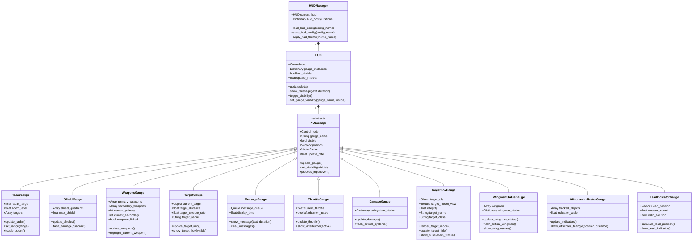
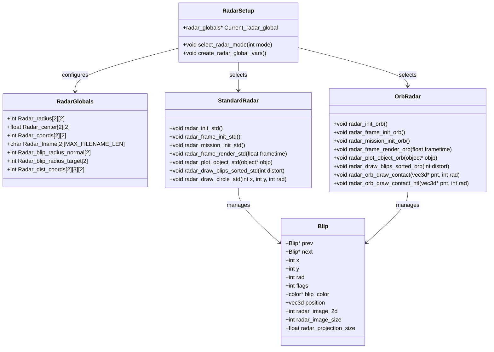

# HUD System Conversion Plan

This document outlines the strategy for converting Wing Commander Saga's HUD system to Godot while preserving the original game's interface style and functionality.

## Original Code Analysis

The original HUD system in Wing Commander Saga is built on several key components, analyzed below following the structure from `tasks/00_analysis_setup.md`:

1.  **HUD Configuration System**
    *   Uses a table-driven approach with `hud_gauges.tbl` files
    *   Supports multiple resolutions (640x480 and 1024x768)
    *   Allows per-ship customization of HUD layouts
    *   Supports modular table loading with `*-hdg.tbm` files

2.  **Gauge Management**
    *   Each gauge has a defined position, size, and behavior
    *   Gauges can inherit properties from parent gauges
    *   Supports custom gauges defined in configuration files
    *   Uses a coordinate system with optional percentage-based positioning

3.  **Shield System**
    *   Quadrant-based shield system (4 quadrants)
    *   Visual feedback for shield hits with flashing effects
    *   Support for different ship icons based on ship type
    *   Mini shield display for target ships

4.  **Reticle System**
    *   Multiple reticle styles (FS1 and FS2)
    *   Integrated threat warnings for missiles and weapons
    *   Throttle display with afterburner indication
    *   Weapon status indicators

5.  **Squad Message System**
    *   Hierarchical menu system for issuing commands
    *   Support for commanding individual ships, wings, or all fighters
    *   Order history tracking
    *   Reinforcement request system

6.  **Target Tracking System**
    *   Advanced target selection and tracking
    *   Multiple targeting modes (nearest, next/previous, hostile, friendly)
    *   Subsystem targeting with damage visualization
    *   Target lead indicators for weapons
    *   Target distance and closure rate calculations

7.  **Target Information Display**
    *   Detailed target information box with ship class, name, and status
    *   Hull integrity visualization with color-coded status
    *   Cargo scanning functionality with progress display
    *   Target subsystem status and damage indicators
    *   Support for wireframe model display modes

8.  **Wingman Status Display**
    *   Visual representation of wingman health and status
    *   Support for multiple wings with customizable layouts
    *   Status indicators (alive, dead, departed)
    *   Flash notifications for critical wingman status changes
    *   Wing name abbreviations and position indicators

9.  **Offscreen Indicator System**
    *   Triangular indicators for offscreen targets
    *   Distance information for offscreen objects
    *   Different indicator styles based on target type and status
    *   Special indicators for mission-critical targets

10. **Threat Warning System**
    *   Visual and audio warnings for incoming missiles
    *   Proximity indicators with distance-based urgency
    *   Missile tracking with lead time calculations
    *   Support for different warning styles based on missile type

### A. HUD Parsing (`hudparse.cpp`, `hudparse.h`)

1.  **Key Features:**
    *   Loads and parses `hud_gauges.tbl` files.
    *   Handles default HUD configurations for different resolutions (640x480, 1024x768).
    *   Supports ship-specific HUD overrides (`ship_huds`).
    *   Manages custom gauge definitions (`custom_gauge_coords`, `custom_gauge_images`, etc.).
    *   Calculates final gauge positions based on parent gauges and percentage-based positioning.
    *   Handles different reticle styles (FS1 vs FS2) affecting gauge appearance.
    *   Parses modular table files (`*-hdg.tbm`).
    *   Sets global HUD parameters like `Hud_unit_multiplier`, `Hud_lead_alternate`, `Targetbox_wire`.

2.  **Potential Godot Solutions:**
    *   Use `ConfigFile` or `JSON` to parse `.tbl` files (or convert tables to `.tres` or `.json`).
    *   Store HUD configurations (default, per-ship) as custom `Resource` files (`.tres`).
    *   Implement gauge definitions as custom `Resource` types inheriting from a base `HUDGaugeConfig` resource.
    *   Use Godot's UI system (Control nodes) for layout, potentially with custom scripts for percentage positioning and inheritance.
    *   Manage different resolutions using Godot's built-in scaling mechanisms or separate theme resources.
    *   Handle modular tables by iterating through specified directories and loading matching files.
    *   Store global HUD settings in a Singleton (Autoload) script or a dedicated `Resource`.

3.  **Target Code Structure:**
    ```
    scripts/hud/
    ├── hud_manager.gd         # Singleton/Autoload to manage loading/switching HUD configs
    ├── hud_config.gd          # Custom Resource for storing HUD layout/gauge data
    └── gauges/
        └── hud_gauge_config.gd # Base Resource for gauge definitions (position, image, etc.)
    resources/hud/
    ├── configurations/        # Stores .tres files for default and ship-specific HUDs
    │   ├── default_hud_640.tres
    │   ├── default_hud_1024.tres
    │   └── ship_specific/
    │       └── hercules_hud.tres
    └── hud_gauges.tres        # Converted or original table data (if parsed directly)
    ```

4.  **Important Methods, Classes, Data Structures:**
    *   `struct hud_info`: Stores all configuration data for a specific HUD layout (coordinates, filenames, flags). Godot equivalent: `HUDConfig` resource.
    *   `struct gauge_info`: Defines properties for each gauge type (parent, coordinate offsets, defaults, image/text destinations). Godot equivalent: `HUDGaugeConfig` resource.
    *   `gauges[]`: Global array holding `gauge_info` for standard and custom gauges. Godot equivalent: Could be a Dictionary within `HUDConfig` or separate resource arrays.
    *   `load_hud_defaults()`: Initializes default gauge positions/filenames based on resolution. Godot equivalent: Factory method or default values within `HUDConfig`.
    *   `calculate_gauges()`: Adjusts gauge positions based on parent gauges. Godot equivalent: Logic within the HUD layout system or `HUDGauge` nodes.
    *   `parse_hud_gauges_tbl()`: Main parsing function for `hud_gauges.tbl`. Godot equivalent: Loading/parsing logic in `HUDManager`.
    *   `set_current_hud()`: Switches the active HUD configuration based on ship class. Godot equivalent: Method in `HUDManager`.
    *   `parse_custom_gauge()`: Handles parsing of custom gauge definitions. Godot equivalent: Part of the `HUDManager`'s loading logic.

5.  **Relations:**
    *   `hudparse.cpp` is central to loading all HUD layout data.
    *   It reads data from `.tbl` files (and potentially `.tbm` modular files).
    *   It populates `hud_info` structures (one default, one per ship class).
    *   The `current_hud` pointer determines which `hud_info` is active.
    *   Other HUD modules (like `hudescort.cpp`, `hudshield.cpp`) read coordinates and filenames from the `current_hud` structure.
    *   Relies on `ship.cpp` (`ship_info_lookup`) to map ship names to indices.

### B. Reticle System (`hudreticle.cpp`, `hudreticle.h`)

1.  **Key Features:**
    *   Renders the central reticle and associated arcs (top, left, right).
    *   Displays throttle level graphically, including afterburner indication.
    *   Shows current speed numerically next to the throttle bar.
    *   Indicates weapon selection (primary/secondary banks, linking status).
    *   Provides threat warnings (dumbfire laser/weapon hits, missile lock attempts, full missile lock).
    *   Supports different reticle styles (FS1 vs FS2) with distinct graphics and layouts.
    *   Handles HUD offsets (`HUD_nose_x`, `HUD_nose_y`) for camera shake effects.

2.  **Potential Godot Solutions:**
    *   Use `TextureRect` or custom `_draw()` calls within `Control` nodes for rendering reticle components (arcs, center).
    *   Employ `TextureProgress` or custom drawing for the throttle bar.
    *   Use `Label` nodes for displaying speed and weapon names/status.
    *   Implement threat warnings using animated sprites (`AnimatedSprite2D` within `Control`) or custom drawing with timers for flashing.
    *   Manage different reticle styles by swapping themes, scenes, or using conditional logic within scripts based on `Hud_reticle_style`.
    *   Apply HUD offsets directly to the root HUD `CanvasLayer` or individual gauge controls.

3.  **Target Code Structure:**
    ```
    scenes/hud/gauges/
    ├── reticle_gauge.tscn       # Main scene for the reticle group
    └── reticle_gauge.gd         # Script managing reticle elements
    scripts/hud/gauges/
    ├── hud_reticle_gauge.gd     # Main logic
    ├── hud_throttle_gauge.gd    # Specific logic for throttle display
    └── hud_threat_gauge.gd      # Logic for threat warnings
    resources/hud/textures/reticle/ # Reticle graphics
    ├── fs1/
    │   ├── reticle_fs1.png
    │   └── ... (arcs, warnings)
    └── fs2/
        ├── reticle_fs2.png
        └── ... (arcs, warnings)
    ```

4.  **Important Methods, Classes, Data Structures:**
    *   `Reticle_gauges[]`: Array of `hud_frames` storing animation data for reticle components. Godot: Use `SpriteFrames` resource or individual `TextureRect` nodes.
    *   `hud_init_reticle()`: Loads reticle animations. Godot: `_ready()` function in `hud_reticle_gauge.gd`.
    *   `hud_update_reticle()`: Updates threat warning status based on player state. Godot: Part of the main HUD update loop or a dedicated threat update function.
    *   `hud_show_throttle()`: Renders the throttle gauge, speed display, and afterburner status. Godot: Method in `hud_throttle_gauge.gd`.
    *   `hud_show_reticle_weapons()`: Renders weapon selection indicators. Godot: Method in `hud_reticle_gauge.gd` or `hud_weapons_gauge.gd`.
    *   `hud_show_lock_threat()`, `hud_show_dumbfire_threat()`: Render specific threat warnings. Godot: Methods in `hud_threat_gauge.gd`.
    *   `hud_show_center_reticle()`, `hud_show_top_arc()`, `hud_show_right_arc()`, `hud_show_left_arc()`: Render individual parts of the reticle. Godot: Likely handled within `hud_reticle_gauge.gd`'s `_draw()` or via child nodes.
    *   `Threat_dumbfire_timer`, `Threat_lock_timer`, `Threat_dumbfire_frame`, `Threat_lock_frame`: State variables for managing threat warning animations. Godot: Member variables in `hud_threat_gauge.gd`.

5.  **Relations:**
    *   Reads coordinates and filenames based on `Hud_reticle_style` and `gr_screen.res` from `Reticle_frame_names` and `Reticle_frame_coords`.
    *   Depends on `Player` state (`Player->threat_flags`, `Player->ci.forward`, `Player_obj->phys_info`, `Player_ship->weapons`).
    *   Interacts with `hudtargetbox.cpp` (`hud_targetbox_flash_expired`) for coordinating flashing effects.
    *   Plays sounds (`SND_THREAT_FLASH`) via `gamesnd.cpp`.
    *   Uses `hud.cpp` functions (`hud_set_gauge_color`, `hud_aabitmap`, `hud_aabitmap_ex`).

### C. Shield System (`hudshield.cpp`, `hudshield.h`)

1.  **Key Features:**
    *   Displays player and target shield strength using quadrant-based icons.
    *   Supports custom shield icons per ship type (`Hud_shield_filenames`, `Shield_gauges`).
    *   Generates generic shield icons for ships without custom ones using 3D rendering (`model_render`).
    *   Shows shield hit effects (flashing) per quadrant.
    *   Displays a mini-shield icon for the target (`Shield_mini_gauge`).
    *   Includes logic for shield equalization (`hud_shield_equalize`) and quadrant augmentation (`hud_augment_shield_quadrant`).
    *   Handles shield hit registration and timer updates (`hud_shield_quadrant_hit`, `hud_shield_hit_update`).

2.  **Potential Godot Solutions:**
    *   Use `TextureRect` nodes for displaying shield icons (both custom and potentially pre-rendered generic ones).
    *   Implement quadrant strength display using custom drawing (`_draw()`) within a `Control` node, coloring segments based on strength.
    *   Use shaders or `Tween` animations for flashing effects on hit.
    *   The mini-shield can be a separate, smaller instance of the shield gauge scene.
    *   Shield management logic (equalize, augment) belongs in the `ShipBase` or a dedicated `ShieldComponent` script, not directly in the HUD script. The HUD script reads data from the ship.
    *   Hit registration and timers should also be managed by the `ShipBase`/`ShieldComponent`.

3.  **Target Code Structure:**
    ```
    scenes/hud/gauges/
    ├── shield_gauge.tscn        # Scene for the main shield display
    ├── shield_gauge.gd          # Script for shield display logic
    └── shield_mini_gauge.tscn   # Scene for the mini shield display
    scripts/hud/gauges/
    └── hud_shield_gauge.gd      # Controls drawing, reads data from ship
    scripts/ship/components/
    └── shield_component.gd      # Manages shield state, equalization, hits (optional)
    resources/hud/textures/shields/ # Shield icon assets
    ├── player_shield_base.png
    ├── target_shield_base.png
    └── ship_specific/
        └── hercules_shield.png
    ```

4.  **Important Methods, Classes, Data Structures:**
    *   `Shield_gauges[]`: Array of `hud_frames` for custom ship shield icons. Godot: Dictionary mapping ship type to `Texture2D` resources.
    *   `Shield_mini_gauge`: `hud_frames` for the mini target shield icon. Godot: `TextureRect` node or `Texture2D` resource.
    *   `Shield_hit_data[]`: Array storing hit status and timers for player and target. Godot: Data managed within the ship's shield component.
    *   `hud_shield_show()`: Main function to render player or target shield display. Godot: `_draw()` or update method in `hud_shield_gauge.gd`.
    *   `hud_shield_show_mini()`: Renders the mini target shield display. Godot: Method in a dedicated mini-shield script or part of the main target box logic.
    *   `hud_shield_maybe_flash()`: Determines if a quadrant should flash based on timers. Godot: Logic within the shield gauge drawing code.
    *   `hud_shield_quadrant_hit()`: Registers a hit, starting the flash timer. Godot: Method in the ship's shield component, signaling the HUD to update.
    *   `hud_shield_hit_update()`: Updates flash timers. Godot: Part of the ship's shield component `_process` or timer logic.
    *   `hud_shield_equalize()`, `hud_augment_shield_quadrant()`: Core shield management logic. Godot: Methods in the ship's shield component.

5.  **Relations:**
    *   Reads shield strength (`objp->shield_quadrant`) and max strength (`get_max_shield_quad`) from the `Object` and `Ship` data.
    *   Uses ship info (`Ship_info`) to get custom shield icon index or determine if generic rendering is needed.
    *   Uses `hudparse.cpp` (`current_hud`) for coordinates (`Player_shield_coords`, `Target_shield_coords`, `Shield_mini_coords`).
    *   Interacts with `hudtargetbox.cpp` (`hud_targetbox_start_flash`) for hull hit flashing.
    *   Calls `model_render` for generic shield icon generation.
    *   Plays sounds (`SND_SHIELD_XFER_OK`) via `gamesnd.cpp`.

### D. Squad Message System (`hudsquadmsg.cpp`, `hudsquadmsg.h`)

1.  **Key Features:**
    *   Provides a hierarchical menu system for issuing commands to wingmen and ships.
    *   Supports different command targets: individual ships, wings, all fighters.
    *   Includes specific commands like Attack, Disable, Disarm, Protect, Ignore, Form Up, Cover Me, Engage, Capture, Rearm/Repair, Depart.
    *   Handles reinforcement requests.
    *   Manages menu state (`Squad_msg_mode`) and navigation (`First_menu_item`, `Num_menu_items`).
    *   Validates commands based on target type, status, and player target.
    *   Stores command history (`Squadmsg_history`).
    *   Displays the menu visually with key bindings.
    *   Handles multiplayer command synchronization (`send_player_order_packet`).

2.  **Potential Godot Solutions:**
    *   Implement the menu using Godot's `Control` nodes (`VBoxContainer`, `Label`, `Button`).
    *   Manage menu state and navigation within a dedicated `SquadMessageManager` script (potentially attached to the HUD or as a Singleton).
    *   Use `InputEventKey` processing to handle number keys (1-0), PageUp/PageDown, and Esc.
    *   Define command types and validation logic within the `SquadMessageManager` or separate helper scripts/resources.
    *   Store command history in an `Array` within the manager.
    *   Use Godot's networking API (`MultiplayerAPI`, RPCs) for sending commands in multiplayer.
    *   Reinforcement logic would likely tie into the mission scripting system.

3.  **Target Code Structure:**
    ```
    scenes/ui/squad_message_menu.tscn # Scene for the squad message UI
    scripts/hud/
    ├── squad_message_manager.gd    # Manages menu state, commands, history
    └── squad_message_menu.gd       # Handles UI display and input for the menu
    scripts/ai/
    └── command_handler.gd          # Receives and processes commands on AI ships (optional helper)
    resources/hud/
    └── squad_commands.tres         # Resource defining available commands, text, validation rules
    ```

4.  **Important Methods, Classes, Data Structures:**
    *   `enum Squad_msg_mode`: Defines the different states of the menu (Type Select, Ship Select, etc.). Godot: Use GDScript `enum`.
    *   `struct mmode_item`: Holds text and instance data for a menu item. Godot: Could be a `Dictionary` or a custom `Resource`.
    *   `MsgItems[]`: Array storing the current menu items. Godot: `Array` of Dictionaries or custom Resources.
    *   `Comm_order_types[]`, `Comm_orders[]`: Arrays defining command categories and specific commands. Godot: Could be `Array`s or `Dictionary`s in the `SquadMessageManager` or loaded from a `Resource`.
    *   `struct squadmsg_history`: Stores details of an issued command. Godot: Custom `class` or `Resource`.
    *   `Squadmsg_history`: Vector storing the command history. Godot: `Array`.
    *   `hud_squadmsg_do_frame()`: Main update loop for the squad message UI. Godot: `_process()` or `_input()` in `squad_message_menu.gd`.
    *   `hud_squadmsg_display_menu()`: Renders the current menu view. Godot: Update function in `squad_message_menu.gd` to populate UI nodes.
    *   `hud_squadmsg_send_ship_command()`, `hud_squadmsg_send_wing_command()`, `hud_squadmsg_send_to_all_fighters()`: Functions to issue commands to AI/network. Godot: Methods in `SquadMessageManager`, potentially calling RPCs or AI functions.
    *   `hud_squadmsg_is_target_order_valid()`, `hud_squadmsg_ship_order_valid()`: Validation logic. Godot: Helper functions within `SquadMessageManager`.

5.  **Relations:**
    *   Reads player target (`Player_ai->target_objnum`, `Player_ai->targeted_subsys`).
    *   Accesses ship data (`Ships[]`, `Wings[]`) to populate menus and validate commands.
    *   Interacts with the AI system (`ai_add_ship_goal_player`, `ai_add_wing_goal_player`) to issue orders.
    *   Plays sounds (`SND_SQUADMSGING_ON`, `SND_SQUADMSGING_OFF`, `SND_GENERAL_FAIL`) via `gamesnd.cpp`.
    *   Uses HUD functions (`hud_set_gauge_color`, `hud_aabitmap`) for rendering menu backgrounds.
    *   Interacts with mission scripting (`Sexp_nodes`) for reinforcement availability checks.
    *   Uses multiplayer functions (`multi_can_message`, `send_player_order_packet`) for network play.

### E. Targeting System (`hudtarget.cpp`, `hudtarget.h`)

1.  **Key Features:**
    *   Core targeting logic: next/previous target, closest hostile/friendly, target nearest attacker, target ship attacking target, target subsystem.
    *   Handles targeting different object types (ships, weapons, asteroids, debris, jump nodes).
    *   Implements targeting modes (auto-targeting, target nearest hostile turret).
    *   Manages target hotkeys (saving, selecting, clearing, pruning dead targets).
    *   Calculates and displays lead indicators based on selected primary weapon.
    *   Renders offscreen indicators (triangles) with distance information.
    *   Displays missile lock indicators and homing missile warnings.
    *   Shows target brackets that dynamically resize.
    *   Handles cargo scanning and display.
    *   Integrates with AWACS for target visibility/targetability checks.
    *   Manages HUD color based on IFF status.
    *   Displays weapon energy and afterburner gauges (though rendering might be in `hudreticle.cpp` or `hud.cpp`).
    *   Shows countermeasures count.
    *   Displays auto-target and auto-speed match icons.

2.  **Potential Godot Solutions:**
    *   Targeting logic (finding next/prev/closest) implemented in a `TargetingComponent` script attached to the player ship or a global `TargetingManager` Singleton.
    *   Store target hotkeys in the `Player` data or a global save file.
    *   Lead indicator calculation in the `TargetingComponent` or `HUDTargetingGauge` script, using weapon data resources. Render via custom drawing (`_draw`) or a dedicated `Node2D`.
    *   Offscreen indicators rendered via custom drawing in a `HUDOffscreenGauge` script.
    *   Missile lock indicators managed by `HUDLockGauge` script, potentially using `AnimatedSprite2D` or custom drawing. Homing warnings handled similarly or by `HUDThreatGauge`.
    *   Target brackets drawn by `HUDBrackets` script using custom drawing, dynamically scaling based on distance/size.
    *   Cargo scanning logic in `TargetingComponent`, updating a progress variable read by the `HUDTargetBox`.
    *   AWACS checks performed by the `TargetingComponent` before allowing targeting.
    *   IFF color logic centralized in a helper function or Singleton, used by various HUD elements.
    *   Energy/Afterburner/Countermeasure displays handled by their respective gauge scripts (`HUDEnergyGauge`, `HUDThrottleGauge`, `HUDCMeasureGauge`).
    *   Auto-target/speed icons managed by `HUDAutoGauges` script.

3.  **Target Code Structure:**
    ```
    scripts/player/
    └── targeting_component.gd    # Core targeting logic, hotkeys, AWACS checks
    scripts/hud/gauges/
    ├── hud_targeting_gauge.gd    # Manages overall targeting display elements
    ├── hud_lead_indicator.gd     # Calculates and draws lead indicator
    ├── hud_offscreen_gauge.gd    # Draws offscreen triangles/indicators
    ├── hud_lock_gauge.gd         # Handles missile lock display
    ├── hud_brackets.gd           # Draws target brackets
    ├── hud_cmeasure_gauge.gd     # Displays countermeasure count
    └── hud_auto_gauges.gd        # Displays auto-target/speed icons
    resources/hud/textures/
    ├── lead_indicator.png
    └── target_brackets/          # Bracket textures (if not drawn procedurally)
    ```

4.  **Important Methods, Classes, Data Structures:**
    *   `TARGET_SHIP_IGNORE_FLAGS`: Defines ship flags that prevent targeting. Godot: Constants or helper function in `TargetingComponent`.
    *   `hud_target_common()`: Core logic for cycling targets (next/prev). Godot: Method in `TargetingComponent`.
    *   `hud_target_closest()`: Finds the nearest valid target based on criteria. Godot: Method in `TargetingComponent`.
    *   `hud_target_live_turret()`: Targets the nearest/next hostile turret on the current target. Godot: Method in `TargetingComponent`.
    *   `hud_target_subobject_common()`: Cycles through targetable subsystems. Godot: Method in `TargetingComponent`.
    *   `hud_target_in_reticle_new()` / `hud_target_in_reticle_old()`: Targets object closest to the reticle center. Godot: Method in `TargetingComponent`.
    *   `hud_target_hotkey_*()`: Functions for managing hotkeyed targets. Godot: Methods in `TargetingComponent` or `Player` data script.
    *   `hud_show_lead_indicator()`: Calculates and displays the lead indicator. Godot: Method in `HUDLeadIndicator` script.
    *   `hud_draw_offscreen_indicator()`: Renders the offscreen triangle and distance. Godot: Method in `HUDOffscreenGauge`.
    *   `hud_do_lock_indicator()`: Manages missile lock progress and display. Godot: Method in `HUDLockGauge`.
    *   `hud_show_brackets()`: Renders the main target brackets. Godot: Method in `HUDBrackets`.
    *   `hud_cargo_scan_update()`: Updates and displays cargo scan progress/results. Godot: Logic split between `TargetingComponent` and `HUDTargetBox`.
    *   `hud_set_iff_color()`: Sets the drawing color based on target IFF. Godot: Global helper function or method in an IFF manager Singleton.

5.  **Relations:**
    *   Heavily relies on `Player` state (`Player_ai`, `Player_ship`, `Player->flags`).
    *   Accesses `Objects[]`, `Ships[]`, `Weapons[]`, `Asteroids[]`, `Debris[]`, `JumpNodes[]` for target data.
    *   Uses `ship_subsys` data for subsystem targeting.
    *   Interacts with `hudconfig.h` (`HUD_config`) for gauge visibility and settings.
    *   Uses `hudparse.h` (`current_hud`) for gauge coordinates/filenames.
    *   Calls rendering functions from `hudbrackets.cpp`.
    *   Uses AWACS functions (`awacs_get_level`) from `awacs.cpp`.
    *   Plays sounds (`SND_TARGET_FAIL`, `SND_TARGET_ACQUIRE`, etc.) via `gamesnd.cpp`.
    *   Uses IFF functions (`iff_matches_mask`, `iff_get_color_by_team*`) from `iff_defs.cpp`.

### F. Target Box (`hudtargetbox.cpp`, `hudtargetbox.h`)

1.  **Key Features:**
    *   Displays detailed information about the current target.
    *   Renders a 3D model of the target ship/object in a dedicated view window.
    *   Supports wireframe rendering modes for the target model.
    *   Shows target name, class, distance, speed, hull integrity, and shield strength.
    *   Displays cargo contents after scanning.
    *   Indicates targeted subsystem name and health.
    *   Shows ship status (DISABLED, DISRUPTED, Docked status).
    *   Displays ship orders and time-to-goal (if applicable and visible based on IFF).
    *   Handles flashing effects for various status changes (hull damage, subsystem destroyed, cargo revealed, docked status).
    *   Integrates with sensor damage effects (static overlay).

2.  **Potential Godot Solutions:**
    *   Use a `SubViewport` with a dedicated `Camera3D` to render the target model.
    *   Control nodes (`Label`, `TextureRect`, `TextureProgress`) for displaying text info, background graphics, and integrity bars.
    *   Implement wireframe mode using Godot's material overrides or custom shaders.
    *   Manage flashing effects using `Tween` animations or timers controlling modulate/visibility properties of labels/icons.
    *   Static effect can be an `AnimatedSprite2D` or shader overlay controlled by sensor strength.
    *   Cargo/Order display logic handled within the target box script, reading data from the target ship/object.

3.  **Target Code Structure:**
    ```
    scenes/hud/gauges/
    └── target_monitor.tscn      # Main scene for the target box gauge
    scripts/hud/gauges/
    └── hud_target_monitor.gd    # Script managing target box display, 3D view, info updates
    resources/hud/textures/targetbox/
    ├── target_view_bg.png
    ├── integrity_bar.png
    └── extra_info_bg.png
    ```

4.  **Important Methods, Classes, Data Structures:**
    *   `Target_window_coords`: Defines the viewport area for the 3D model. Godot: `SubViewport` node properties.
    *   `Targetbox_coords`: Coordinates for various text labels (Name, Class, Dist, etc.). Godot: `Label` node positions within the scene.
    *   `Targetbox_flash_timers`, `Targetbox_flash_flags`: Manage flashing state for different info elements. Godot: Timers or `Tween` nodes managed by the script.
    *   `Targetbox_wire`, `Lock_targetbox_mode`: Global flags controlling wireframe mode. Godot: Settings potentially stored in a global Singleton or `HUDConfig` resource.
    *   `hud_render_target_model()`: Main function orchestrating the rendering of the target box. Godot: Likely split into `_process()`/`_draw()` and helper functions in `hud_target_monitor.gd`.
    *   `hud_render_target_setup()` / `hud_render_target_close()`: Sets up and tears down the 3D rendering environment for the target model. Godot: Handled implicitly by `SubViewport` or via setup methods called before rendering the viewport texture.
    *   `hud_render_target_ship_info()`: Displays text information specific to ships. Godot: Helper function in `hud_target_monitor.gd`.
    *   `hud_blit_target_integrity()`: Renders the hull integrity bar and status text. Godot: Helper function or part of `_draw()`/update logic.
    *   `hud_targetbox_init_flash()`, `hud_targetbox_start_flash()`, `hud_targetbox_maybe_flash()`: Functions for managing the flashing effects. Godot: Methods within `hud_target_monitor.gd`.
    *   `hud_targetbox_static_maybe_blit()`: Handles rendering the static effect when sensors are damaged. Godot: Method in `hud_target_monitor.gd`.

5.  **Relations:**
    *   Reads target data extensively from `Player_ai` (target object, targeted subsystem), `Objects[]`, `Ships[]`, `Weapons[]`, `Asteroids[]`, `Debris[]`, `JumpNodes[]`.
    *   Uses `hudparse.cpp` (`current_hud`) for coordinates.
    *   Calls `model_render` and `submodel_render` for the 3D view.
    *   Uses `hudshield.cpp` (`get_shield_pct`) and `ship.cpp` (`get_hull_pct`) for integrity values.
    *   Interacts with `hudmessage.cpp` for displaying subsystem names (`ship_subsys_get_name`).
    *   Uses IFF functions (`iff_get_color*`) for coloring text/elements.
    *   Depends on `hudtarget.cpp` for cargo scanning state (`Player->cargo_inspect_time`).
    *   Uses docking information (`object_is_docked`, `dock_count_direct_docked_objects`) from `objectdock.cpp`.

### G. Wingman Status (`hudwingmanstatus.cpp`, `hudwingmanstatus.h`)

1.  **Key Features:**
    *   Displays the status (hull integrity, alive/dead/departed) of player's wingmen.
    *   Organizes display by wing (up to `MAX_SQUADRON_WINGS`).
    *   Uses graphical elements (dots, backgrounds) for status representation.
    *   Shows abbreviated wing names.
    *   Flashes wingman status on significant events (e.g., taking heavy damage).
    *   Updates status periodically.
    *   Handles multiplayer team configurations (hiding enemy wings in TvT).

2.  **Potential Godot Solutions:**
    *   Use a main `Control` node (`HUDWingmanStatusGauge`) containing child nodes for each wing.
    *   Each wing display could be a separate scene instance or dynamically generated `Control` nodes.
    *   Use `TextureRect` for background elements and status dots (potentially using sprite sheets).
    *   Use `Label` nodes for wing name abbreviations.
    *   Implement flashing using `Tween` animations or timers modulating dot colors/visibility.
    *   Update logic driven by a `Timer` node or the main HUD update loop, fetching data from the `GameState` or wing/ship manager.

3.  **Target Code Structure:**
    ```
    scenes/hud/gauges/
    └── wingman_status_gauge.tscn # Main container for wingman status display
    scripts/hud/gauges/
    └── hud_wingman_gauge.gd      # Manages layout, updates, and rendering of wingman status
    resources/hud/textures/wingman_status/
    ├── wingman_bg_left.png
    ├── wingman_bg_middle.png
    ├── wingman_bg_right.png
    └── wingman_dots.png          # Sprite sheet for status dots (alive, dead, damaged, etc.)
    ```

4.  **Important Methods, Classes, Data Structures:**
    *   `Wingman_status_frames[]`: Array of `hud_frames` for background and dot graphics. Godot: `TextureRect` nodes using textures from resources.
    *   `struct Wingman_status`: Stores hull and status for each ship within a wing. Godot: Could be a `Dictionary` or custom `Resource` managed by a wing/squadron manager script.
    *   `HUD_wingman_status[]`: Array holding the status for all displayable wings. Godot: `Array` within the `HUDWingmanGauge` script or a global manager.
    *   `hud_init_wingman_status_gauge()`: Loads graphics and initializes status arrays. Godot: `_ready()` function in `hud_wingman_gauge.gd`.
    *   `hud_wingman_status_update()`: Periodically updates the status data by checking ship states. Godot: Timer callback or part of `_process()` in the gauge script.
    *   `hud_wingman_status_render()`: Main rendering function, calls helper blitting functions. Godot: `_process()` or a dedicated update display function in `hud_wingman_gauge.gd`.
    *   `hud_wingman_status_blit_*()`: Helper functions to draw specific parts (backgrounds, dots, names). Godot: Helper functions within `hud_wingman_gauge.gd`.
    *   `hud_wingman_status_maybe_flash()`: Handles the flashing logic for individual wingmen. Godot: Logic within the gauge script, potentially using `Tween`s.
    *   `hud_wingman_status_set_index()`: Assigns wing/position indices to ships for display mapping. Godot: Logic likely handled when ships are added to wings/squadrons.

5.  **Relations:**
    *   Reads ship data (`Ships[]`, `Objects[]`) to determine hull strength and status flags (`SF_DEPARTING`).
    *   Uses wing data (`Wings[]`, `Squadron_wing_names[]`) for organization and naming.
    *   Relies on `hudparse.cpp` (`current_hud`) for coordinates.
    *   Uses HUD functions (`hud_set_gauge_color`, `hud_aabitmap`) for rendering.
    *   Interacts with multiplayer state (`Net_player`, `Netgame`) for team-based filtering.

### H. Core HUD Logic (`hud.cpp`, `hud.h`)

1.  **Key Features:**
    *   Main HUD rendering loop (`HUD_render_2d`, `HUD_render_3d`).
    *   Initializes and manages all HUD components.
    *   Handles HUD drawing toggles (`HUD_draw`, `HUD_draw_user`).
    *   Manages HUD contrast settings (`HUD_contrast`).
    *   Applies global HUD offsets for camera shake (`HUD_offset_x`, `HUD_offset_y`, `HUD_nose_x`, `HUD_nose_y`).
    *   Manages HUD color palette and alpha levels (`HUD_color_*`, `HUD_color_defaults`).
    *   Handles gauge popups and flashing timers (`HUD_popup_timers`, `HUD_gauge_flash_*`).
    *   Displays global notifications (Mission Time, Kills, Support Ship status, EMP effect, Netlag, Red Alert, Subspace Drive status, Objective updates).
    *   Plays looped engine sounds based on throttle (`update_throttle_sound`).
    *   Provides utility functions for drawing (`hud_aabitmap`, `hud_aabitmap_ex`) and color setting (`hud_set_gauge_color`, `hud_set_iff_color`).

2.  **Potential Godot Solutions:**
    *   A main `HUD` scene (`hud.tscn`) acting as a `CanvasLayer`, containing instances of all individual gauge scenes.
    *   A central `hud.gd` script attached to the root `CanvasLayer` node to manage overall HUD state, visibility, updates, and coordinate gauge interactions.
    *   Use Godot's `Theme` resource for managing HUD colors and potentially fonts.
    *   Implement HUD shake by offsetting the `CanvasLayer` transform.
    *   Use `Timer` nodes for managing popup durations and flashing intervals.
    *   Global notifications can be implemented as separate gauge scenes/scripts managed by `hud.gd`.
    *   Engine sound logic could be moved to the player ship script, controlling an `AudioStreamPlayer`.
    *   Utility functions can become static methods in `hud.gd` or helper methods within individual gauge scripts.

3.  **Target Code Structure:**
    ```
    scenes/in_flight/
    └── hud.tscn                 # Root CanvasLayer for the HUD
    scripts/hud/
    ├── hud.gd                   # Main HUD controller script
    ├── hud_globals.gd           # Singleton/Autoload for shared HUD settings/state (optional)
    └── effects/                 # Scripts for global HUD effects (shake, EMP overlay)
        ├── hud_shake_effect.gd
        └── hud_emp_overlay.gd
    resources/hud/
    └── hud_theme.tres           # Theme resource for colors, fonts, styles
    ```

4.  **Important Methods, Classes, Data Structures:**
    *   `HUD_init()`: Initializes all HUD components. Godot: `_ready()` in `hud.gd`.
    *   `hud_update_frame()`: Updates HUD state based on game state. Godot: `_process()` in `hud.gd`.
    *   `HUD_render_2d()`, `HUD_render_3d()`: Main rendering functions calling individual gauge render functions. Godot: `_process()` in `hud.gd` would call update methods on child gauge nodes; drawing handled by nodes themselves.
    *   `HUD_init_colors()`: Sets up the color palette. Godot: Loading and applying the `hud_theme.tres`.
    *   `hud_set_gauge_color()`, `hud_set_iff_color()`, `hud_set_default_color()`: Color setting utilities. Godot: Theme access or helper functions.
    *   `hud_gauge_active()`, `hud_gauge_is_popup()`, `hud_gauge_popup_active()`: Check gauge visibility/popup state based on `HUD_config`. Godot: Methods in `hud.gd` or `hud_globals.gd`.
    *   `hud_gauge_popup_start()`, `hud_gauge_start_flash()`: Manage popup timers and flashing. Godot: Methods in `hud.gd` potentially using `Timer` nodes or `Tween`s.
    *   `HUD_set_offsets()`: Calculates and applies HUD shake offsets. Godot: Method in `hud.gd` modifying the `CanvasLayer` transform.
    *   `HUD_reset_clip()`, `HUD_set_clip()`: Clipping utilities. Godot: Handled by `Control` node clipping properties or `SubViewport`s if needed.

5.  **Relations:**
    *   Acts as the central coordinator for all other HUD modules.
    *   Reads configuration from `hudconfig.h` (`HUD_config`).
    *   Calls initialization and rendering functions for all other HUD components (`hudtarget.cpp`, `hudshield.cpp`, `hudreticle.cpp`, etc.).
    *   Depends on `Player` state for various checks (e.g., `Viewer_mode`, `Player_obj`).
    *   Uses global game state (`Missiontime`, `Game_mode`, `Net_player`).
    *   Interacts with sound system (`gamesnd.cpp`) for engine sounds, warnings.
    *   Uses EMP status (`emp_active_local`) from `emp.cpp`.

### I. Radar System (`radar.cpp`, `radarorb.cpp`, `radarsetup.cpp`, `radar*.h`)

1.  **Key Features:**
    *   Provides two distinct radar modes: Standard (2D top-down) and Orb (3D perspective).
    *   Manages radar globals (`Radar_globals`) like radius, center coordinates, filenames based on resolution and mode.
    *   Plots objects (ships, weapons, jump nodes) on the radar based on type, distance, IFF, and AWACS level.
    *   Uses a blip system (`blip` struct, `Blip_*_list`) to represent objects, sorted by brightness and type.
    *   Handles blip appearance: color based on IFF, size based on target status, distortion/flicker based on sensor damage or AWACS level.
    *   Supports custom radar images for specific ship types.
    *   Renders radar background graphics and range indicators.
    *   Implements sensor damage effects (static overlay, radar failure).
    *   Handles different radar range settings (Short, Long, Infinity).
    *   Orb mode includes 3D rendering of contacts and orientation rings.

2.  **Potential Godot Solutions:**
    *   Implement radar as a `Control` node (`HUDRadarGauge`).
    *   Use custom drawing (`_draw()`) for rendering the radar background, rings, and blips.
    *   Store blip data in an `Array` of custom `RadarBlip` classes or Dictionaries.
    *   Implement Standard vs Orb mode using separate drawing functions within the script or potentially different scenes/scripts selected by the `HUDManager`.
    *   Handle blip appearance (color, distortion, flicker) within the `_draw()` function based on blip state.
    *   Use `TextureRect` or `draw_texture_rect` for custom radar images.
    *   Sensor damage/static effect implemented with shader overlays or `AnimatedSprite2D`.
    *   Range settings managed as variables within the `HUDRadarGauge` script.
    *   Orb mode's 3D rendering could potentially use a `SubViewport` with a dedicated 3D scene, though custom 2D drawing mimicking 3D might be more performant/simpler.

3.  **Target Code Structure:**
    ```
    scenes/hud/gauges/
    ├── radar_gauge.tscn         # Main radar gauge scene
    └── radar_gauge.gd           # Script handling radar logic and drawing
    scripts/hud/gauges/
    ├── hud_radar_gauge.gd       # Main logic, mode switching, drawing
    └── radar_blip.gd            # Class definition for radar blips (optional)
    resources/hud/textures/radar/
    ├── radar_background_std.png
    ├── radar_background_orb.png
    ├── radar_blip_standard.png  # Default blip graphic
    └── ship_radar_images/       # Custom ship radar icons
        └── hercules_radar.png
    ```

4.  **Important Methods, Classes, Data Structures:**
    *   `struct radar_globals`: Stores configuration per radar mode/resolution. Godot: Data likely stored within the `HUDRadarGauge` script or a `RadarConfig` resource.
    *   `struct blip`: Holds data for a single radar contact. Godot: Custom `RadarBlip` class or `Dictionary`.
    *   `Blip_*_list[]`: Linked lists for sorting blips. Godot: Use `Array.sort_custom()` or manual sorting into different `Array`s.
    *   `radar_init_*()`: Initialization functions for each mode. Godot: Combined into `_ready()` or specific mode setup functions.
    *   `radar_plot_object_*()`: Determines if/how an object appears on radar. Godot: Helper function called during the update loop.
    *   `radar_stuff_blip_info_*()`: Assigns color and type to a blip. Godot: Part of the object plotting logic.
    *   `radar_draw_blips_sorted_*()`: Renders all blips in the correct order. Godot: Main part of the `_draw()` function.
    *   `radar_draw_circle_*()`, `radar_orb_draw_contact*()`: Low-level drawing functions for individual blips. Godot: Helper drawing functions called by `_draw()`.
    *   `radar_frame_render_*()`: Main rendering loop for each mode. Godot: `_draw()` function in `hud_radar_gauge.gd`.
    *   `select_radar_mode()`: Switches function pointers based on selected mode. Godot: Set a mode variable and use conditional logic (`match` statement) in update/draw functions.

5.  **Relations:**
    *   Reads data from `Objects[]`, `Ships[]`, `Weapons[]`, `JumpNodes[]`.
    *   Depends on `Player` state (`Player_obj`, `Player_ai->target_objnum`, `Player_ship->team`).
    *   Uses AWACS data (`awacs_get_level`) from `awacs.cpp`.
    *   Uses IFF functions (`iff_get_color*`) from `iff_defs.cpp`.
    *   Reads HUD configuration (`HUD_config`) for range settings.
    *   Uses sensor subsystem strength (`ship_get_subsystem_strength`) from `ship.cpp`.
    *   Interacts with EMP state (`emp_active_local`) from `emp.cpp`.
    *   Uses HUD rendering functions (`hud_set_gauge_color`, `hud_aabitmap`) from `hud.cpp`.
    *   Plays sounds (`SND_STATIC`) via `gamesnd.cpp`.

## System Architecture



## Key Components to Convert

1. **Radar System**
   - Supports two distinct radar modes: Standard (2D) and Orb (3D)
   - Uses a blip system to represent different object types (ships, weapons, jump nodes)
   - Implements IFF (Identification Friend or Foe) color coding
   - Features distortion effects for damaged sensors or EMP
   - Includes range selection (2k, 10k, infinity)
   - Provides special indicators for targeted objects
   - Supports different display modes for capital ships vs. fighters
   - Implements radar image support for ship identification
   - Features sensor strength-based visibility and AWACS detection

2. **Core HUD Elements**
   - **Radar Display**: 3D space representation with contacts
   - **Shield Indicators**: Quadrant-based shield status
   - **Weapon Energy Gauges**: Primary and secondary weapon status
   - **Target Information**: Distance, speed, hull integrity
   - **Throttle Control**: Speed indicator with afterburner status
   - **ETS System**: Energy distribution between systems (weapons, shields, engines)

3. **Dynamic Elements**
   - **Damage Indicators**: Subsystem status and critical warnings
   - **Message System**: Prioritized message queue with timing
   - **Mission Objectives**: Current objectives with status tracking
   - **Wingman Status**: Formation and health indicators
   - **Threat Warnings**: Incoming missile and collision alerts
   - **Kill Tally**: Mission and campaign statistics
   - **Support Ship Interface**: Repair and rearm status
   - **Mission Time**: Mission clock with time compression indicator

4. **Special Effects**
   - **Target Brackets**: Dynamic sizing based on distance and type
   - **Weapon Linking**: Visual indicators for linked weapon groups
   - **Missile Lock Warnings**: Audio and visual missile alerts
   - **Critical System Flashing**: Alert indicators for damaged systems
   - **HUD Color Modes**: Different color schemes (green, amber, blue)
   - **Targeting Reticle**: Dynamic aiming assistance with lead indicators
   - **Offscreen Indicators**: Arrows pointing to offscreen targets
   - **Network Lag Indicator**: Visual feedback for multiplayer latency
   - **EMP Effects**: Visual distortion during electromagnetic pulse events

5. **HUD Configuration**
   - **Layout Options**: Different HUD layouts (classic, modern, minimal)
   - **Element Visibility**: Toggleable HUD components
   - **Position Customization**: Adjustable element positions
   - **Scale Options**: Size adjustments for readability
   - **Color Customization**: User-defined color schemes
   - **Popup Behavior**: Configure which elements appear only when needed
   - **Contrast Settings**: High-contrast mode for nebula environments

## Radar System Architecture

The original radar system is built around several key components:



### Radar Modes

1. **Standard Radar (2D)**
   - Traditional top-down 2D representation
   - Uses screen coordinates for blip positioning
   - Draws contacts as special characters or images
   - Implements flicker effects for sensor distortion
   - Supports multiple resolution configurations

2. **Orb Radar (3D)**
   - 3D representation with perspective
   - Uses 3D coordinates and projection
   - Draws contacts as 3D objects with connecting lines
   - Implements 3D rings for orientation reference
   - Supports HTL (High-Tech Level) rendering mode
   - Features alpha blending based on orientation

### Blip System

The radar uses a sophisticated blip system to represent different objects:

- **Blip Types**:
  - Normal ships
  - Warping ships
  - NavBuoys and cargo
  - Bombs and weapons
  - Jump nodes
  - Tagged ships

- **Blip Properties**:
  - Position (2D or 3D)
  - Color (based on IFF)
  - Radius (normal or targeted)
  - Flags (current target, distorted, etc.)
  - Custom radar image (for ship identification)

- **Special Effects**:
  - Distortion for damaged sensors
  - Flicker for partially detected objects
  - Static overlay for EMP or sensor damage
  - Crosshairs for targeted objects
  - Pulsating/blinking for emphasis

## Conversion Approach

### 1. Base HUD Gauge System
```gdscript
class_name HUDGauge
extends Control

signal gauge_updated
signal visibility_changed(visible)

@export_group("Gauge Properties")
@export var gauge_name: String = "BaseGauge"
@export var update_rate: float = 0.1  # Seconds between updates
@export var always_visible: bool = true
@export var flash_on_critical: bool = false
@export var flash_color: Color = Color(1.0, 0.0, 0.0, 0.8)
@export var flash_rate: float = 0.2

var time_since_update: float = 0.0
var is_visible: bool = true
var is_flashing: bool = false
var flash_timer: float = 0.0
var original_modulate: Color

func _ready():
    original_modulate = modulate
    set_visibility(is_visible)

func _process(delta):
    # Handle flashing effect
    if is_flashing:
        flash_timer += delta
        if flash_timer >= flash_rate:
            flash_timer = 0.0
            modulate = modulate.is_equal_approx(original_modulate) ? flash_color : original_modulate
    
    # Update gauge at specified rate
    time_since_update += delta
    if time_since_update >= update_rate:
        time_since_update = 0.0
        update_gauge()

# To be implemented by child classes
func update_gauge():
    gauge_updated.emit()

func set_visibility(visible: bool):
    is_visible = visible
    self.visible = visible
    visibility_changed.emit(visible)

func start_flashing():
    if flash_on_critical:
        is_flashing = true
        flash_timer = 0.0

func stop_flashing():
    is_flashing = false
    modulate = original_modulate

func process_input(event: InputEvent) -> bool:
    # Override in child classes to handle input
    return false
```

### 2. Radar Implementation - Standard Mode

```gdscript
class_name HUDRadarStandard
extends HUDRadarBase

signal target_selected(target)
signal range_changed(new_range)

@export_group("Radar Properties")
@export var radar_texture: Texture2D
@export var contact_friendly_color: Color = Color(0.0, 1.0, 0.0)
@export var contact_hostile_color: Color = Color(1.0, 0.0, 0.0)
@export var contact_neutral_color: Color = Color(1.0, 1.0, 0.0)
@export var contact_nav_color: Color = Color(0.0, 0.5, 1.0)
@export var contact_tagged_color: Color = Color(1.0, 0.5, 0.0)
@export var contact_bomb_color: Color = Color(1.0, 0.0, 1.0)
@export var contact_jump_node_color: Color = Color(0.0, 0.7, 1.0)
@export var crosshair_color: Color = Color(1.0, 1.0, 1.0, 0.8)

# Blip character offsets
var small_blip_offset: Vector2
var large_blip_offset: Vector2

# Blip special characters
var small_blip_char: String = "•"
var large_blip_char: String = "◉"

# Radar state
var current_target_pos: Vector2
var flicker_timers: Array[float] = [0.0, 0.0]
var flicker_states: Array[bool] = [false, false]
var static_playing: bool = false
var static_next_time: float = 0.0
var sensor_strength: float = 1.0

func _ready():
    super._ready()
    gauge_name = "Radar"
    
    # Calculate blip character offsets
    var font = get_theme_font("font", "Label")
    var font_size = get_theme_font_size("font_size", "Label")
    
    var size = font.get_string_size(small_blip_char, HORIZONTAL_ALIGNMENT_CENTER, -1, font_size)
    small_blip_offset = Vector2(-size.x/2, -size.y/2)
    
    size = font.get_string_size(large_blip_char, HORIZONTAL_ALIGNMENT_CENTER, -1, font_size)
    large_blip_offset = Vector2(-size.x/2, -size.y/2)

func update_gauge():
    # Get targets from game state
    targets = GameState.get_radar_targets()
    
    # Update sensor strength
    if GameState.player_ship:
        sensor_strength = GameState.player_ship.get_subsystem_strength("sensors")
    
    # Update flicker timers
    for i in range(flicker_timers.size()):
        if flicker_timers[i] > 0:
            flicker_timers[i] -= get_process_delta_time()
            if flicker_timers[i] <= 0:
                flicker_timers[i] = 0.0
                flicker_states[i] = false
    
    # Update static effect timer
    if static_next_time > 0 and Time.get_ticks_msec() > static_next_time:
        static_playing = not static_playing
        static_next_time = Time.get_ticks_msec() + randf_range(50, 750)
    
    # Force static if EMP is active
    if GameState.is_emp_active():
        static_playing = true
    
    # Update radar display
    queue_redraw()
    super.update_gauge()

func _draw():
    # Draw radar background
    draw_texture(radar_texture, Vector2.ZERO)
    
    # Draw range rings
    var center = size / 2
    var max_radius = min(center.x, center.y)
    
    # Draw outer ring
    draw_arc(center, max_radius, 0, TAU, 32, Color(0.5, 0.5, 0.5, 0.5), 1.0)
    # Draw middle ring
    draw_arc(center, max_radius * 0.66, 0, TAU, 32, Color(0.5, 0.5, 0.5, 0.3), 1.0)
    # Draw inner ring
    draw_arc(center, max_radius * 0.33, 0, TAU, 32, Color(0.5, 0.5, 0.5, 0.3), 1.0)
    
    # Draw cardinal directions
    var direction_color = Color(0.7, 0.7, 0.7, 0.7)
    draw_line(center, center + Vector2(0, -max_radius), direction_color, 1.0)  # North
    draw_line(center, center + Vector2(max_radius, 0), direction_color, 1.0)   # East
    draw_line(center, center + Vector2(0, max_radius), direction_color, 1.0)   # South
    draw_line(center, center + Vector2(-max_radius, 0), direction_color, 1.0)  # West
    
    # Draw range text
    var range_text = ""
    match current_range_setting:
        RangeSetting.SHORT:
            range_text = "2k"
        RangeSetting.LONG:
            range_text = "10k"
        RangeSetting.INFINITY:
            range_text = "∞"
    
    draw_string(get_theme_font("font", "Label"), 
                Vector2(size.x - 30, size.y - 10), 
                range_text, 
                HORIZONTAL_ALIGNMENT_RIGHT, 
                -1, 
                get_theme_font_size("font_size", "Label"), 
                Color(0.7, 1.0, 0.7))
    
    # If sensors are damaged, draw static and return
    if sensor_strength < 0.5 or static_playing:
        draw_radar_static()
        return
    
    # Draw targets
    draw_radar_blips()
    
    # Draw target crosshairs if needed
    if current_target_pos != Vector2.ZERO:
        draw_crosshairs(current_target_pos)

func draw_radar_blips():
    var center = size / 2
    var max_radius = min(center.x, center.y)
    
    # Sort targets by type for proper layering
    var sorted_targets = {
        "jump_node": [],
        "warping": [],
        "navbuoy": [],
        "normal": [],
        "bomb": [],
        "tagged": []
    }
    
    for target in targets:
        var target_pos_3d = target.position - GameState.player_ship.position
        
        # Convert 3D position to 2D radar coordinates
        var radar_pos = Vector2(
            target_pos_3d.x / effective_range,
            -target_pos_3d.z / effective_range
        ) * max_radius + center
        
        # Skip if outside radar
        if (radar_pos - center).length() > max_radius:
            continue
        
        # Determine target type
        var target_type = "normal"
        if target.is_jump_node:
            target_type = "jump_node"
        elif target.is_warping:
            target_type = "warping"
        elif target.is_navbuoy or target.is_cargo:
            target_type = "navbuoy"
        elif target.is_bomb or target.is_weapon:
            target_type = "bomb"
        elif target.is_tagged:
            target_type = "tagged"
        
        # Store target with its position for drawing
        sorted_targets[target_type].append({
            "target": target,
            "position": radar_pos,
            "is_bright": target.distance <= bright_range or target.is_targeted,
            "is_distorted": target.is_hidden_from_sensors or sensor_strength < 1.0
        })
    
    # Draw each type in order
    for type in ["jump_node", "warping", "navbuoy", "normal", "bomb", "tagged"]:
        for blip_data in sorted_targets[type]:
            draw_blip(blip_data)

func draw_blip(blip_data):
    var target = blip_data.target
    var pos = blip_data.position
    var is_bright = blip_data.is_bright
    var is_distorted = blip_data.is_distorted
    
    # Determine color based on IFF and brightness
    var color
    if target.is_tagged:
        color = contact_tagged_color
    elif target.is_jump_node:
        color = contact_jump_node_color
    elif target.is_bomb or target.is_weapon:
        color = contact_bomb_color
    else:
        match target.iff:
            "friendly": color = contact_friendly_color
            "hostile": color = contact_hostile_color
            "neutral": color = contact_neutral_color
            "nav": color = contact_nav_color
            _: color = contact_neutral_color
    
    # Adjust color brightness
    if not is_bright:
        color = color.darkened(0.4)
    
    # Set color
    draw_set_transform(Vector2.ZERO, 0, Vector2.ONE)
    draw_set_transform_matrix(Transform2D.IDENTITY)
    
    # Draw the blip
    if is_distorted:
        draw_distorted_blip(pos, color, target.is_targeted)
    elif target.radar_image_2d >= 0:
        draw_radar_image(pos, color, target.radar_image_2d, target.radar_image_size, target.is_targeted)
    else:
        draw_normal_blip(pos, color, target.is_targeted)
    
    # Store current target position for crosshairs
    if target.is_targeted:
        current_target_pos = pos

func draw_normal_blip(pos: Vector2, color: Color, is_target: bool):
    draw_set_transform(Vector2.ZERO, 0, Vector2.ONE)
    
    if is_target:
        draw_string_outline(get_theme_font("font", "Label"), 
                           pos + large_blip_offset, 
                           large_blip_char, 
                           HORIZONTAL_ALIGNMENT_LEFT, 
                           -1, 
                           get_theme_font_size("font_size", "Label"), 
                           color)
    else:
        draw_string_outline(get_theme_font("font", "Label"), 
                           pos + small_blip_offset, 
                           small_blip_char, 
                           HORIZONTAL_ALIGNMENT_LEFT, 
                           -1, 
                           get_theme_font_size("font_size", "Label"), 
                           color)

func draw_distorted_blip(pos: Vector2, color: Color, is_target: bool):
    # For distorted blips, add random offset
    var offset = Vector2(
        randf_range(-10, 10),
        randf_range(-10, 10)
    )
    
    # If EMP is active, scale the distortion
    if GameState.is_emp_active():
        var emp_intensity = GameState.get_emp_intensity()
        offset *= emp_intensity
    
    # For flickering blips, determine if we should draw
    var flicker_index = int(pos.x + pos.y) % 2
    
    if flicker_timers[flicker_index] <= 0:
        flicker_timers[flicker_index] = randf_range(0.05, 1.0)
        flicker_states[flicker_index] = not flicker_states[flicker_index]
    
    if not flicker_states[flicker_index]:
        return
    
    # Draw the distorted blip
    draw_normal_blip(pos + offset, color, is_target)

func draw_radar_image(pos: Vector2, color: Color, image_idx: int, size: int, is_target: bool):
    var texture = GameState.get_radar_image(image_idx)
    if not texture:
        draw_normal_blip(pos, color, is_target)
        return
    
    var scale = 1.0
    if is_target:
        # Apply special effects for targets
        if GameState.radar_target_id_flags & GameState.RTIF_PULSATE:
            scale *= 1.3 + (sin(10 * Time.get_ticks_msec() / 1000.0) * 0.3)
        
        if GameState.radar_target_id_flags & GameState.RTIF_BLINK:
            if int(Time.get_ticks_msec() / 100) % 20 < 10:
                return
        
        if GameState.radar_target_id_flags & GameState.RTIF_ENLARGE:
            scale *= 1.3
    
    # Calculate size based on image dimensions and desired size
    var img_size = texture.get_size()
    var aspect_ratio = img_size.y / img_size.x
    var width = size * scale
    var height = width * aspect_ratio
    
    # Draw the image
    draw_set_transform(pos - Vector2(width/2, height/2), 0, Vector2(scale, scale))
    draw_texture_rect(texture, Rect2(0, 0, width, height), false, color)
    draw_set_transform(Vector2.ZERO, 0, Vector2.ONE)

func draw_radar_static():
    var center = size / 2
    var max_radius = min(center.x, center.y)
    
    # Draw random static dots
    for _i in range(100):
        var angle = randf() * TAU
        var distance = randf() * max_radius
        var pos = center + Vector2(cos(angle), sin(angle)) * distance
        
        var color = Color(randf(), randf(), randf(), randf() * 0.5 + 0.2)
        draw_rect(Rect2(pos, Vector2(2, 2)), color)

func draw_crosshairs(pos: Vector2):
    var length = 8
    var gap = 4
    
    draw_line(Vector2(pos.x - length - gap, pos.y), Vector2(pos.x - gap, pos.y), crosshair_color, 1.0)
        
        # Draw weapon name
        draw_string(weapon_font, Vector2(20, y_offset), weapon.name, HORIZONTAL_ALIGNMENT_LEFT, -1, font_size, color)
        
        # Draw weapon ammo
        var ammo_text = "∞"
        if weapon.max_ammo > 0:
            ammo_text = str(weapon.current_ammo) + "/" + str(weapon.max_ammo)
        
        draw_string(weapon_font, Vector2(180, y_offset), ammo_text, HORIZONTAL_ALIGNMENT_RIGHT, -1, font_size, color)
        
        y_offset += font_size + 5
```

### 5. Target Box Implementation

```gdscript
class_name HUDTargetBox
extends HUDGauge

signal target_selected(target)
signal target_subsystem_selected(subsystem)
signal target_scanned(target, cargo_info)

@export_group("Target Box Properties")
@export var target_view_size: Vector2 = Vector2(130, 110)
@export var target_model_zoom: float = 1.5
@export var target_font: Font
@export var target_font_size: int = 14
@export var scan_duration: float = 5.0
@export var flash_duration: float = 0.5
@export var wireframe_mode: int = 0  # 0=normal, 1=wireframe, 2=both

var target_viewport: SubViewport
var target_camera: Camera3D
var target_object: Node3D
var target_name: String = ""
var target_class: String = ""
var target_distance: float = 0.0
var target_speed: float = 0.0
var target_hull: float = 1.0
var target_shields: float = 1.0
var target_subsystem: String = ""
var target_subsystem_health: float = 1.0
var scan_progress: float = 0.0
var is_scanning: bool = false
var flash_timers: Dictionary = {}
var static_effect_active: bool = false

func _ready():
    super._ready()
    gauge_name = "TargetBox"
    
    # Setup 3D viewport for target model
    target_viewport = SubViewport.new()
    target_viewport.size = target_view_size
    target_viewport.transparent_bg = true
    target_viewport.render_target_update_mode = SubViewport.UPDATE_WHEN_VISIBLE
    
    # Setup camera
    target_camera = Camera3D.new()
    target_camera.current = true
    target_viewport.add_child(target_camera)
    
    # Initialize flash timers
    flash_timers = {
        "name": 0.0,
        "hull": 0.0,
        "subsystem": 0.0,
        "cargo": 0.0,
        "status": 0.0,
        "docked": 0.0
    }
    
    add_child(target_viewport)

func update_gauge():
    var target = GameState.get_current_target()
    
    if target:
        # Update target information
        target_name = target.get_display_name()
        target_class = target.get_class_name()
        target_distance = GameState.get_distance_to_target(target)
        target_speed = target.get_speed()
        target_hull = target.get_hull_integrity()
        target_shields = target.get_shield_strength()
        
        # Check sensor strength - show static if sensors damaged
        static_effect_active = GameState.player_ship.get_subsystem_strength("sensors") < 0.5
        
        # Update target model if changed
        if target != target_object:
            if target_object:
                target_viewport.remove_child(target_object)
            
            target_object = target.create_display_model()
            if target_object:
                target_viewport.add_child(target_object)
                
                # Position camera to view model properly
                var model_size = target.get_model_size()
                target_camera.position = Vector3(0, 0, model_size * 2)
                target_camera.look_at(Vector3.ZERO)
                
                # Apply wireframe mode if needed
                if wireframe_mode > 0:
                    apply_wireframe_mode(target_object)
        
        # Update subsystem if targeted
        var subsystem = GameState.get_targeted_subsystem()
        if subsystem:
            target_subsystem = subsystem.get_name()
            target_subsystem_health = subsystem.get_health()
        else:
            target_subsystem = ""
            target_subsystem_health = 1.0
        
        # Update scanning progress
        if is_scanning:
            scan_progress += get_process_delta_time() / scan_duration
            if scan_progress >= 1.0:
                scan_progress = 1.0
                is

## Godot Implementation Structure

```
scenes/in_flight/
├── hud.tscn                  # Main HUD scene
├── hud.gd                    # Main HUD controller
└── hud_config.tscn           # HUD configuration UI

scripts/hud/
├── hud_gauge.gd              # Base gauge class
├── hud_manager.gd            # HUD configuration manager
├── gauges/                   # Individual gauge implementations
│   ├── hud_radar_gauge.gd
│   ├── hud_shields_gauge.gd
│   ├── hud_weapons_gauge.gd
│   ├── hud_target_gauge.gd
│   ├── hud_messages_gauge.gd
│   ├── hud_throttle_gauge.gd
│   ├── hud_damage_gauge.gd
│   ├── hud_ets_gauge.gd      # Energy Transfer System
│   ├── hud_threat_gauge.gd
│   ├── hud_wingman_gauge.gd
│   ├── hud_objectives_gauge.gd
│   ├── hud_kills_gauge.gd
│   ├── hud_nav_gauge.gd
│   └── hud_targeting_gauge.gd
└── effects/                  # Visual effect scripts
    ├── hud_flash_effect.gd
    ├── hud_damage_overlay.gd
    └── hud_target_brackets.gd

resources/hud/
├── textures/                 # HUD graphic assets
│   ├── radar_texture.png
│   ├── shield_texture.png
│   ├── weapon_icons/
│   ├── damage_overlays/
│   └── target_brackets/
├── fonts/                    # HUD fonts
│   ├── hud_main_font.ttf
│   └── hud_digital_font.ttf
├── themes/                   # HUD color themes
│   ├── green_theme.tres
│   ├── amber_theme.tres
│   └── red_theme.tres
└── configurations/           # Saved HUD layouts
    ├── classic_layout.tres
    ├── modern_layout.tres
    └── minimal_layout.tres
```

## Conversion Challenges

1. **Pixel-Perfect Matching**
   - **Original**: Fixed resolution assets designed for specific screen dimensions
   - **Godot**: Scalable UI system designed for multiple resolutions
   - **Solution**: 
     - Use viewport stretching with integer scaling for pixel-perfect rendering
     - Create resolution-independent assets where possible
     - Implement custom drawing code for critical elements that need pixel precision
     - Use shader-based rendering for elements that need to match original exactly
     - Support multiple resolution configurations (original used GR_640 and GR_1024)

2. **Dynamic Elements**
   - **Original**: Hardcoded positions with direct screen drawing
   - **Godot**: Node-based UI with container-driven layout
   - **Solution**:
     - Create a hybrid approach using Control nodes with custom drawing
     - Implement anchor-based layout with script-controlled positioning
     - Use Container nodes for elements that benefit from automatic layout
     - Create a coordinate transformation system to convert between game world and UI space
     - Implement HUD_offset_x/y for camera shake and view effects

3. **Performance Optimization**
   - **Original**: Direct rendering with minimal overhead
   - **Godot**: Scene tree with potential overhead from many nodes
   - **Solution**:
     - Use custom drawing via _draw() for complex gauges instead of many child nodes
     - Implement batched processing for HUD updates
     - Use object pooling for frequently created elements (messages, alerts)
     - Optimize update rates for different gauges based on importance
     - Implement visibility culling for off-screen elements
     - Use update_interval timers instead of per-frame updates for non-critical gauges

4. **HUD Configuration System**
   - **Original**: Fixed HUD layout with limited customization
   - **Godot**: Need for flexible, user-configurable system
   - **Solution**:
     - Create a data-driven HUD configuration system
     - Implement serializable layout resources
     - Build a drag-and-drop HUD editor for player customization
     - Support multiple saved configurations
     - Implement HUD_config_type structure with show_flags and popup_flags
     - Support saving/loading of HUD configuration files (.hcf)

5. **Special Effects Integration**
   - **Original**: Custom effects tightly integrated with rendering
   - **Godot**: Need to recreate effects in Godot's rendering system
   - **Solution**:
     - Use Godot's shader system for visual effects like EMP and damage
     - Implement animation players for gauge transitions and flashing
     - Create custom draw methods for specialized effects
     - Use audio streams for synchronized sound effects
     - Implement a flash system for critical alerts and warnings

6. **Message System Conversion**
   - **Original**: Complex message queue with prioritization
   - **Godot**: Need to recreate message handling system
   - **Solution**:
     - Implement a message queue with priority levels
     - Create a scrollback buffer for message history
     - Support different message sources (player, wingmen, command)
     - Implement color coding based on message importance
     - Add support for timed messages and fading

## Testing Strategy

1. **Visual Fidelity Tests**
   - Compare screenshots side-by-side
   - Verify gauge animations
   - Check color accuracy
   - Test different color schemes (green, amber, blue)
   - Verify correct scaling at different resolutions

2. **Functionality Tests**
   - Radar target tracking and selection
   - Shield damage display and quadrant accuracy
   - Weapon energy updates and recharge rates
   - ETS system energy distribution
   - Message system priority and scrollback
   - Target bracketing and offscreen indicators
   - Missile lock-on sequence and warnings

3. **Performance Tests**
   - Stress test with many targets
   - Check frame rate impact
   - Memory usage monitoring
   - Test with multiple simultaneous effects
   - Measure update frequency optimization effectiveness

## Migration Tools

```python
def convert_hud_assets(source_dir, output_dir):
    """Convert HUD image assets to Godot-compatible formats"""
    for file in os.listdir(source_dir):
        if file.endswith('.pcx'):
            img = convert_pcx_to_png(os.path.join(source_dir, file))
            img.save(os.path.join(output_dir, f"{file[:-4]}.png"))
            
        # Handle palette conversions
        if file.endswith('.pal'):
            convert_palette_to_gradient(file)
            
def extract_hud_coordinates(cpp_file):
    """Extract hardcoded coordinates from C++ files"""
    coords = {}
    with open(cpp_file, 'r') as f:
        content = f.read()
        # Extract coordinate arrays using regex
        pattern = r'(\w+)_coords\[GR_NUM_RESOLUTIONS\]\[\d+\]\s*=\s*\{([^}]+)\}'
        matches = re.findall(pattern, content)
        for name, values in matches:
            coords[name] = parse_coordinate_values(values)
    return coords
    
def generate_godot_theme(hud_colors):
    """Generate Godot theme resource from HUD color definitions"""
    theme = {}
    for name, color_values in hud_colors.items():
        theme[name] = Color(color_values[0]/255.0, color_values[1]/255.0, 
                            color_values[2]/255.0, color_values[3]/255.0)
    return theme

def parse_hud_gauge_table(table_file):
    """Parse HUD gauge table files to extract gauge definitions"""
    gauges = {}
    with open(table_file, 'r') as f:
        content = f.read()
        # Extract gauge definitions
        sections = re.findall(r'#(\w+)\s+([^#]+)', content)
        for section_name, section_content in sections:
            if section_name == "Custom Gauges":
                gauge_defs = re.findall(r'\$Name:\s*([^\n]+).*?(?=\$Name:|$)', 
                                       section_content, re.DOTALL)
                for gauge_def in gauge_defs:
                    name = re.search(r'\$Name:\s*([^\n]+)', gauge_def).group(1).strip()
                    gauges[name] = parse_gauge_properties(gauge_def)
    return gauges

def extract_squadmsg_commands():
    """Extract squad message command definitions"""
    commands = []
    # Parse command definitions from hudsquadmsg.cpp
    pattern = r'temp_comm_orders\[\]\s*=\s*\{([^}]+)\}'
    # Extract and convert to Godot-friendly format
    return commands
```

## Additional Implementation Details

### HUD Gauge System

```gdscript
class_name HUDGaugeManager
extends Node

# Gauge types from original code
enum GaugeType {
    PLAYER_SHIELD,
    TARGET_SHIELD,
    SHIELD_MINI,
    AFTERBURNER,
    WEAPON_ENERGY,
    WEAPON_ENERGY_TEXT,
    ESCORT_LIST,
    # Additional gauge types...
}

# Resolution options
enum Resolution {
    RES_640x480,
    RES_1024x768,
    RES_CUSTOM
}

# Stores loaded gauge configurations
var gauge_configs = {}
var current_resolution = Resolution.RES_1024x768
var current_ship_class = -1

func _ready():
    load_default_gauge_positions()
    load_gauge_tables("res://resources/hud/hud_gauges.tres")
    
func load_default_gauge_positions():
    # Initialize default positions for all gauges
    # This mirrors the original load_hud_defaults function
    pass
    
func load_gauge_tables(path):
    # Load gauge configurations from resource file
    # Equivalent to parse_hud_gauges_tbl in original code
    pass
    
func set_current_ship(ship_class):
    # Change HUD configuration based on ship class
    # Mirrors set_current_hud in original code
    current_ship_class = ship_class
    apply_ship_specific_layout()
    
func get_gauge_position(gauge_type):
    # Get position for a specific gauge, accounting for
    # current resolution and ship-specific overrides
    pass
```

### Shield Hit System

```gdscript
class_name ShieldHitManager
extends Node

const SHIELD_HIT_DURATION = 1.4  # seconds
const SHIELD_FLASH_INTERVAL = 0.2  # seconds
const NUM_SHIELD_QUADRANTS = 4
const HULL_HIT_OFFSET = 4

# Shield hit data for player and target
var shield_hit_data = {
    "player": {
        "shield_hit_status": 0,
        "shield_show_bright": 0,
        "shield_hit_timers": [],
        "shield_hit_next_flash": []
    },
    "target": {
        "shield_hit_status": 0,
        "shield_show_bright": 0,
        "shield_hit_timers": [],
        "shield_hit_next_flash": []
    }
}

# Quadrant translation from original code
var quadrant_xlate = [1, 0, 2, 3]

func _ready():
    # Initialize timers
    for i in range(NUM_SHIELD_QUADRANTS + 1):  # +1 for hull
        shield_hit_data.player.shield_hit_timers.append(0.0)
        shield_hit_data.player.shield_hit_next_flash.append(0.0)
        shield_hit_data.target.shield_hit_timers.append(0.0)
        shield_hit_data.target.shield_hit_next_flash.append(0.0)
    
func register_shield_hit(is_player, quadrant):
    # Register a hit on a shield quadrant
    # This mirrors hud_shield_quadrant_hit in original code
    var data = shield_hit_data.player if is_player else shield_hit_data.target
    
    if quadrant >= 0:
        var q = quadrant_xlate[quadrant]
        data.shield_hit_timers[q] = SHIELD_HIT_DURATION
    else:
        # Hull hit
        data.shield_hit_timers[HULL_HIT_OFFSET] = SHIELD_HIT_DURATION
        # Trigger hull flash effect
        
func process(delta):
    # Update shield hit timers and flashing effects
    _update_shield_hit_data(shield_hit_data.player, delta)
    _update_shield_hit_data(shield_hit_data.target, delta)
    
func _update_shield_hit_data(data, delta):
    # Update timers and flash states
    for i in range(NUM_SHIELD_QUADRANTS + 1):
        if data.shield_hit_timers[i] > 0:
            data.shield_hit_timers[i] -= delta
            
            if data.shield_hit_timers[i] <= 0:
                data.shield_hit_timers[i] = 0
                data.shield_hit_status &= ~(1 << i)
                data.shield_show_bright &= ~(1 << i)
            elif data.shield_hit_next_flash[i] <= 0:
                data.shield_hit_next_flash[i] = SHIELD_FLASH_INTERVAL
                data.shield_show_bright ^= (1 << i)
            else:
                data.shield_hit_next_flash[i] -= delta
```

### Squad Message System

```gdscript
class_name SquadMessageManager
extends Node

# Command types from original code
enum CommandType {
    ATTACK_TARGET,
    DISABLE_TARGET,
    DISARM_TARGET,
    PROTECT_TARGET,
    IGNORE_TARGET,
    FORMATION,
    COVER_ME,
    ENGAGE_ENEMY,
    CAPTURE_TARGET,
    REARM_REPAIR_ME,
    ABORT_REARM_REPAIR,
    DEPART
}

# Menu modes
enum MenuMode {
    TYPE_SELECT,
    SHIP_SELECT,
    WING_SELECT,
    SHIP_COMMAND,
    WING_COMMAND,
    REINFORCEMENTS,
    REPAIR_REARM,
    REPAIR_REARM_ABORT,
    ALL_FIGHTERS
}

var current_mode = MenuMode.TYPE_SELECT
var menu_items = []
var first_menu_item = 0
var num_menu_items = 0
var current_target = null
var current_subsystem = null
var shortcut_command = -1

# Command history
class CommandHistoryEntry:
    var order_to = -1  # Ship or wing index
    var order = -1     # Command type
    var target = -1    # Target ship index
    var order_from = -1  # Ordering ship index
    var special_index = -1  # For subsystem targeting
    var order_time = 0.0    # Mission time when order was given

var command_history = []

func _ready():
    # Initialize command system
    pass
    
func toggle_message_mode():
    # Toggle squad message mode on/off
    # This mirrors hud_squadmsg_toggle in original code
    pass
    
func process_menu_input(event):
    # Handle menu navigation and selection
    # Returns true if input was handled
    pass
    
func display_menu():
    # Draw the current menu
    # This mirrors hud_squadmsg_display_menu in original code
    pass
    
func send_ship_command(ship_index, command):
    # Send a command to a specific ship
    # This mirrors hud_squadmsg_send_ship_command in original code
    # Add to command history
    var entry = CommandHistoryEntry.new()
    entry.order_to = ship_index
    entry.order = command
    entry.order_from = GameState.player_ship.index
    entry.order_time = GameState.mission_time
    command_history.append(entry)
    
    # Execute command in AI system
    return true
```

## Radar Implementation Details

### Radar Rendering Process

The original radar implementation follows a specific rendering pipeline:

1. **Initialization**
   - `radar_init_std()` / `radar_init_orb()`: Sets up radar resources, loads textures, initializes colors
   - `radar_mission_init_std()` / `radar_mission_init_orb()`: Resets radar state at mission start

2. **Frame Processing**
   - `radar_frame_init_std()` / `radar_frame_init_orb()`: Prepares radar for rendering each frame
   - `radar_frame_render_std()` / `radar_frame_render_orb()`: Main rendering function that:
     - Checks sensor subsystem status
     - Handles radar damage effects
     - Renders radar background
     - Draws range indicators
     - Renders blips with appropriate effects
     - Plays static sound effects when needed

3. **Object Processing**
   - `radar_plot_object_std()` / `radar_plot_object_orb()`: Processes each game object to determine:
     - If it should appear on radar (based on type, distance, AWACS level)
     - Its position on the radar display
     - Its color and appearance based on IFF and status
     - Special effects (distortion, flicker) based on sensor status

4. **Blip Management**
   - Blips are stored in linked lists by type and brightness
   - `radar_stuff_blip_info_std()` / `radar_stuff_blip_info_orb()`: Determines blip color and type
   - `radar_draw_blips_sorted_std()` / `radar_draw_blips_sorted_orb()`: Renders blips in correct order
   - `radar_draw_circle_std()` / `radar_orb_draw_contact()`: Renders individual blips

### Key Radar Features to Preserve

1. **AWACS Detection System**
   ```cpp
   awacs_level = awacs_get_level(objp, Player_ship);
   if (awacs_level < 0.0f && !See_all) {
     return; // Object not detected by AWACS
   }
   ```
   - Objects only appear on radar if detected by AWACS
   - Detection level affects appearance (distortion)
   - Different ships have different AWACS capabilities

2. **Sensor Damage Effects**
   ```cpp
   sensors_str = ship_get_subsystem_strength(Player_ship, SUBSYSTEM_SENSORS);
   if (ship_subsys_disrupted(Player_ship, SUBSYSTEM_SENSORS)) {
     sensors_str = MIN_SENSOR_STR_TO_RADAR - 1;
   }
   ```
   - Damaged sensors cause radar static
   - Below threshold, radar becomes completely unavailable
   - EMP effects cause temporary radar disruption

3. **Blip Type Prioritization**
   ```cpp
   // Draw each type in order
   for (int is_bright = 0; is_bright < 2; is_bright++) {
     draw_radar_blips_std(BLIP_TYPE_JUMP_NODE, is_bright, distort);
     draw_radar_blips_std(BLIP_TYPE_WARPING_SHIP, is_bright, distort);
     draw_radar_blips_std(BLIP_TYPE_NAVBUOY_CARGO, is_bright, distort);
     draw_radar_blips_std(BLIP_TYPE_NORMAL_SHIP, is_bright, distort);
     draw_radar_blips_std(BLIP_TYPE_BOMB, is_bright, distort);
     draw_radar_blips_std(BLIP_TYPE_TAGGED_SHIP, is_bright, distort);
   }
   ```
   - Blips are drawn in specific order to ensure proper layering
   - Bright blips (closer objects) drawn on top of dim blips (distant objects)
   - Special objects (tagged ships, bombs) have visual priority

4. **3D to 2D Projection (Standard Radar)**
   ```cpp
   // Convert 3D position to 2D radar coordinates
   float rscale = (float)acos(pos.xyz.z / dist) / 3.14159f;
   float zdist = fl_sqrt((pos.xyz.x * pos.xyz.x) + (pos.xyz.y * pos.xyz.y));
   float new_x_dist = (pos.xyz.x / zdist) * rscale * radx;
   float new_y_dist = (pos.xyz.y / zdist) * rscale * rady;
   ```
   - Uses spherical projection to map 3D space to 2D radar
   - Maintains relative positions and distances
   - Handles edge clipping for objects near radar boundary

5. **3D Perspective Rendering (Orb Radar)**
   ```cpp
   // Setup 3D view for orb radar
   g3_start_frame(1);
   float old_zoom = View_zoom;
   View_zoom = .75;
   g3_set_view_matrix(&Orb_eye_position, &vmd_identity_matrix, View_zoom);
   ```
   - Uses actual 3D rendering for orb radar mode
   - Maintains separate camera and view settings
   - Renders orientation rings for spatial awareness

6. **Radar Range Settings**
   ```cpp
   switch (HUD_config.rp_dist) {
     case RR_SHORT:
       gr_printf(coords[0], coords[1], XSTR("2k", 467));
       break;
     case RR_LONG:
       gr_printf(coords[0], coords[1], XSTR("10k", 468));
       break;
     case RR_INFINITY:
       sprintf(buf, NOX("%c"), Lcl_special_chars);
       gr_printf(coords[0], coords[1], buf);
       break;
   }
   ```
   - Three distinct range settings (2k, 10k, infinity)
   - Range affects which objects appear on radar
   - Visual indicator shows current range setting

7. **Custom Ship Radar Images**
   ```cpp
   if (Iff_ship_info.radar_image_2d_idx >= 0) {
     b->radar_image_2d = Iff_ship_info.radar_image_2d_idx;
     b->radar_image_size = Iff_ship_info.radar_image_size;
   }
   ```
   - Ships can have custom radar images instead of generic blips
   - Images can be scaled based on ship size
   - Special effects for targeted ships (pulsating, blinking)

### Technical Considerations for Godot Implementation

1. **Radar Base Class**
   - Create a common base class for both radar types
   - Implement mode switching through inheritance
   - Share common functionality (range settings, color definitions)

```gdscript
class_name HUDRadarBase
extends HUDGauge

enum RangeSetting {
    SHORT,    # 2,000 units
    LONG,     # 10,000 units
    INFINITY  # Unlimited range
}

# Common properties
@export var radar_ranges: Array[float] = [2000.0, 10000.0, 100000.0]
@export var bright_range_multiplier: float = 0.5  # Objects within this fraction of range are "bright"

var current_range_setting: int = RangeSetting.LONG
var effective_range: float = 10000.0
var bright_range: float = 5000.0
var targets: Array = []

func _ready():
    super._ready()
    update_range_settings()

func update_range_settings():
    effective_range = radar_ranges[current_range_setting]
    bright_range = effective_range * bright_range_multiplier
    
func cycle_range():
    current_range_setting = (current_range_setting + 1) % RangeSetting.size()
    update_range_settings()
    
func process_input(event: InputEvent) -> bool:
    if event is InputEventKey and event.pressed:
        if event.keycode == KEY_R:  # Example key for range cycling
            cycle_range()
            return true
    return false
```

2. **Blip Management System**
   - Create a Blip class to encapsulate blip properties
   - Implement sorting and layering for proper rendering
   - Support custom radar images for ships

```gdscript
class RadarBlip:
    var target_object  # Reference to game object
    var position: Vector3  # 3D position
    var screen_pos: Vector2  # 2D position on radar
    var color: Color
    var is_bright: bool
    var is_distorted: bool
    var is_target: bool
    var blip_type: int
    var radar_image: int = -1
    var radar_image_size: float = 1.0
    
    func _init(obj, pos: Vector3, bright: bool, distort: bool, type: int):
        target_object = obj
        position = pos
        is_bright = bright
        is_distorted = distort
        blip_type = type
```

3. **Sensor and AWACS Integration**
   - Implement sensor damage effects
   - Create AWACS detection system
   - Support EMP effects on radar

```gdscript
func get_sensor_status() -> float:
    if not GameState.player_ship:
        return 1.0
        
    var sensor_str = GameState.player_ship.get_subsystem_strength("sensors")
    
    # Check for disruption
    if GameState.player_ship.is_subsystem_disrupted("sensors"):
        sensor_str = 0.0
        
    # Apply EMP effects if active
    if GameState.is_emp_active():
        sensor_str *= (1.0 - GameState.get_emp_intensity())
        
    return sensor_str
    
func should_show_on_radar(obj) -> bool:
    # Check if object is within range
    var dist = obj.position.distance_to(GameState.player_ship.position)
    if dist > effective_range:
        return false
        
    # Check AWACS detection
    var awacs_level = GameState.get_awacs_level(obj)
    if awacs_level <= 0.0 and not GameState.debug_see_all:
        return false
        
    # Check object type
    match obj.type:
        "ship":
            return true
        "weapon":
            return obj.is_bomb or obj.shown_on_radar
        "jump_node":
            return not obj.is_hidden
        _:
            return false
```

## Next Steps

1. Create base HUD scene structure
2. Implement core gauge system
3. Convert radar display
   - Implement HUDRadarBase class with common functionality
   - Create Standard and Orb radar implementations
   - Implement blip management system
   - Add sensor damage and AWACS detection
4. Recreate shield indicators
5. Implement message system
6. Build ETS energy management system
7. Create targeting and bracketing system
8. Develop HUD configuration interface
9. Build testing framework
10. Implement performance optimizations
11. Implement squad messaging system
12. Create ship-specific HUD layouts
13. Add support for custom gauge definitions
14. Implement threat warning system
15. Create HUD configuration file parser
