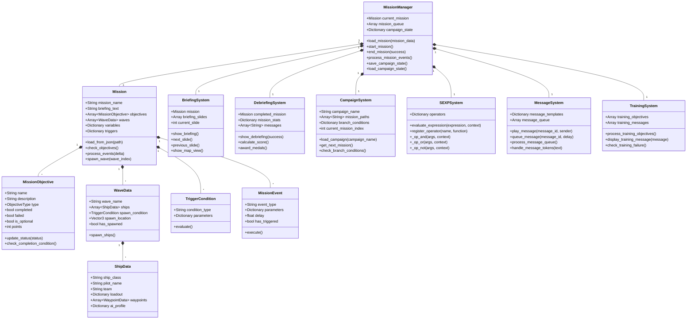
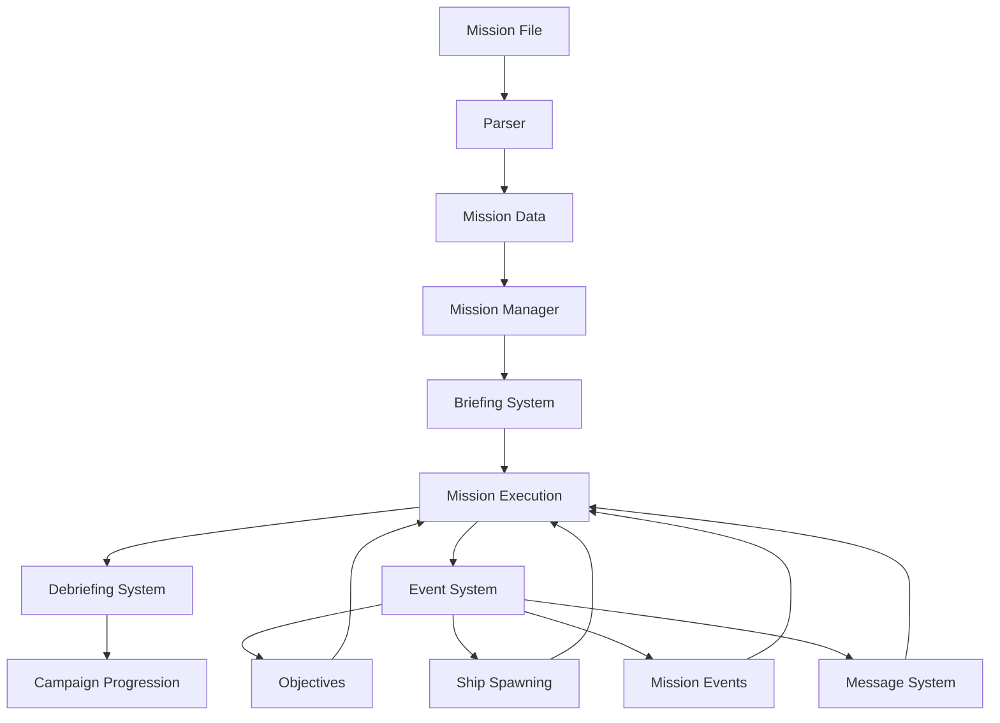

# Mission System Conversion Plan

This document outlines the strategy for converting Wing Commander Saga's mission system to Godot while maintaining the original game's mission structure and flow.

## System Architecture



## Mission System Flow



## Key Components to Convert

1. **Mission Loading and Parsing**
   - **FSM (Mission File) Parsing**: Convert binary FSM format to Godot-compatible JSON/Resource
   - **Ship and Object Placement**: Accurate positioning of all mission entities
   - **Waypoint System**: Navigation paths for AI ships
   - **Initial State Setup**: Starting conditions, variables, and triggers
   - **Mission Metadata**: Difficulty settings, time limits, and special conditions

2. **Briefing System**
   - **Briefing Text and Narration**: Mission context and objectives presentation
   - **Map Display**: Interactive tactical map with ship positions
   - **Ship Loadout Configuration**: Weapon and equipment selection
   - **Wingman Assignment**: Squadron composition and wing assignments
   - **Mission Planning**: Optional waypoint setting for player and wingmen

3. **Mission Flow and Events**
   - **Objective Tracking**: Primary, secondary, and bonus objectives
   - **Event Triggers**: Time-based, location-based, and condition-based events
   - **Dynamic Spawning**: Enemy wave generation based on conditions
   - **Success/Failure Conditions**: Mission outcome determination
   - **In-mission Communication**: Radio messages and command system

4. **SEXP (Script Expression) System**
   - **Condition Evaluation**: Boolean logic for mission events
   - **Action Execution**: Mission state modifications
   - **Variable Handling**: Mission-specific and campaign-wide variables
   - **Operator Implementation**: Recreation of all SEXP operators in GDScript
   - **Custom Script Integration**: Extension points for mission-specific logic

5. **Message System**
   - **Message Templates**: Predefined messages with variables
   - **Message Queue**: Priority-based message scheduling
   - **Voice Integration**: Synchronized voice playback with text
   - **Token Replacement**: Dynamic content in messages
   - **Sender Personas**: Different character personalities and styles

6. **Training System**
   - **Directive Display**: Visual presentation of mission objectives
   - **Training Messages**: Context-sensitive help and instructions
   - **Failure Detection**: Training-specific failure conditions
   - **Progress Tracking**: Monitoring player actions against expected behavior
   - **Interactive Guidance**: Responsive training based on player actions

7. **Debriefing System**
   - **Results Display**: Mission outcome and statistics
   - **Performance Evaluation**: Scoring based on objectives and performance
   - **Medal Awards**: Recognition for achievements
   - **Campaign Progress Tracking**: State persistence between missions
   - **Branching Path Determination**: Next mission selection based on performance

## Conversion Approach

### 1. Mission Data Structure

```gdscript
class_name MissionData
extends Resource

signal objective_updated(objective)
signal wave_spawned(wave_index)
signal mission_event_triggered(event)
signal mission_completed(success)
signal mission_started
signal mission_ended

@export_group("Mission Information")
@export var mission_name: String
@export var mission_description: String
@export var campaign_id: String
@export var mission_id: String
@export var next_mission: String
@export var alternate_next_mission: String
@export var failure_next_mission: String

@export_group("Briefing")
@export var briefing_text: Array[String]
@export var briefing_music: AudioStream
@export var briefing_background: Texture2D
@export var briefing_map_data: Resource

@export_group("Mission Content")
@export var objectives: Array[MissionObjective]
@export var waves: Array[WaveData]
@export var events: Array[MissionEvent]
@export var triggers: Array[TriggerCondition]
@export var variables: Dictionary
@export var music_tracks: Dictionary
@export var background_scene: PackedScene
@export var nav_points: Array[Vector3]

# Runtime properties
var is_active: bool = false
var mission_time: float = 0.0
var player_ship: Node
var active_ships: Dictionary = {}
var mission_success: bool = false
var mission_failed: bool = false

func _init():
    # Initialize with default values
    pass

func load_from_json(path: String) -> bool:
    var file = FileAccess.open(path, FileAccess.READ)
    if not file:
        printerr("Failed to open mission file: ", path)
        return false
    
    var json_text = file.get_as_text()
    file.close()
    
    var json = JSON.new()
    var error = json.parse(json_text)
    if error != OK:
        printerr("JSON Parse Error: ", json.get_error_message(), " at line ", json.get_error_line())
        return false
    
    var data = json.get_data()
    
    # Load mission data from JSON
    mission_name = data.get("name", "Unnamed Mission")
    mission_description = data.get("description", "")
    campaign_id = data.get("campaign_id", "")
    mission_id = data.get("mission_id", "")
    next_mission = data.get("next_mission", "")
    alternate_next_mission = data.get("alternate_next_mission", "")
    failure_next_mission = data.get("failure_next_mission", "")
    
    # Load briefing data
    var briefing_data = data.get("briefing", {})
    briefing_text = briefing_data.get("text", [])
    
    # Load objectives
    var objectives_data = data.get("objectives", [])
    objectives.clear()
    for obj_data in objectives_data:
        var objective = MissionObjective.new()
        objective.name = obj_data.get("name", "Unnamed Objective")
        objective.description = obj_data.get("description", "")
        objective.type = obj_data.get("type", MissionObjective.OBJECTIVE_TYPE.PRIMARY)
        objective.is_optional = obj_data.get("optional", false)
        objective.points = obj_data.get("points", 100)
        objective.completion_condition = obj_data.get("completion_condition", {})
        objectives.append(objective)
    
    # Load waves
    var waves_data = data.get("waves", [])
    waves.clear()
    for wave_data in waves_data:
        var wave = WaveData.new()
        wave.wave_name = wave_data.get("name", "Wave")
        wave.spawn_condition = _parse_trigger_condition(wave_data.get("spawn_condition", {}))
        
        # Load ships in wave
        var ships_data = wave_data.get("ships", [])
        for ship_data in ships_data:
            var ship = ShipData.new()
            ship.ship_class = ship_data.get("class", "fighter")
            ship.pilot_name = ship_data.get("pilot", "")
            ship.team = ship_data.get("team", "hostile")
            ship.loadout = ship_data.get("loadout", {})
            ship.ai_profile = ship_data.get("ai_profile", {})
            
            # Load waypoints
            var waypoints_data = ship_data.get("waypoints", [])
            for wp_data in waypoints_data:
                var waypoint = WaypointData.new()
                waypoint.position = Vector3(wp_data.get("x", 0), wp_data.get("y", 0), wp_data.get("z", 0))
                waypoint.radius = wp_data.get("radius", 100)
                waypoint.speed = wp_data.get("speed", 100)
                ship.waypoints.append(waypoint)
            
            wave.ships.append(ship)
        
        waves.append(wave)
    
    # Load events
    var events_data = data.get("events", [])
    events.clear()
    for event_data in events_data:
        var event = MissionEvent.new()
        event.event_type = event_data.get("type", "")
        event.parameters = event_data.get("parameters", {})
        event.delay = event_data.get("delay", 0.0)
        event.trigger_condition = _parse_trigger_condition(event_data.get("condition", {}))
        events.append(event)
    
    # Load variables
    variables = data.get("variables", {})
    
    # Load nav points
    var nav_points_data = data.get("nav_points", [])
    nav_points.clear()
    for nav_data in nav_points_data:
        nav_points.append(Vector3(nav_data.get("x", 0), nav_data.get("y", 0), nav_data.get("z", 0)))
    
    return true

func _parse_trigger_condition(condition_data: Dictionary) -> TriggerCondition:
    var trigger = TriggerCondition.new()
    trigger.condition_type = condition_data.get("type", "always")
    trigger.parameters = condition_data.get("parameters", {})
    return trigger

func start():
    is_active = true
    mission_time = 0.0
    mission_success = false
    mission_failed = false
    
    # Initialize objectives
    for objective in objectives:
        objective.reset()
    
    # Initialize waves
    for wave in waves:
        wave.has_spawned = false
    
    # Initialize events
    for event in events:
        event.has_triggered = false
    
    # Emit signal that mission has started
    mission_started.emit()

func process(delta: float):
    if not is_active:
        return
    
    mission_time += delta
    
    # Process triggers and events
    _process_events(delta)
    
    # Check objectives
    _check_objectives()
    
    # Check for mission completion
    _check_mission_completion()

func _process_events(delta: float):
    # Check wave spawning
    for i in range(waves.size()):
        var wave = waves[i]
        if not wave.has_spawned and wave.spawn_condition.evaluate(self):
            _spawn_wave(i)
            wave.has_spawned = true
            wave_spawned.emit(i)
    
    # Process mission events
    for event in events:
        if not event.has_triggered and event.trigger_condition.evaluate(self):
            event.execute(self)
            event.has_triggered = true
            mission_event_triggered.emit(event)

func _spawn_wave(wave_index: int):
    var wave = waves[wave_index]
    
    # Create ships from wave data
    for ship_data in wave.ships:
        var ship_instance = _create_ship_from_data(ship_data)
        if ship_instance:
            active_ships[ship_instance.get_instance_id()] = ship_instance

func _create_ship_from_data(ship_data: ShipData) -> Node:
    # This would be implemented to instantiate the appropriate ship type
    # based on the ship_data and add it to the scene
    var ship_scene = load("res://scenes/ships/" + ship_data.ship_class + ".tscn")
    if not ship_scene:
        printerr("Failed to load ship scene: ", ship_data.ship_class)
        return null
    
    var ship_instance = ship_scene.instantiate()
    
    # Set ship properties
    ship_instance.pilot_name = ship_data.pilot_name
    ship_instance.team = ship_data.team
    
    # Apply loadout
    if ship_instance.has_method("apply_loadout"):
        ship_instance.apply_loadout(ship_data.loadout)
    
    # Set AI profile
    if ship_instance.has_method("set_ai_profile"):
        ship_instance.set_ai_profile(ship_data.ai_profile)
    
    # Set waypoints
    if ship_instance.has_method("set_waypoints"):
        ship_instance.set_waypoints(ship_data.waypoints)
    
    # Add to scene
    get_tree().root.add_child(ship_instance)
    
    return ship_instance

func _check_objectives():
    var all_primary_complete = true
    
    for objective in objectives:
        # Update objective status based on its completion condition
        if not objective.is_completed and not objective.is_failed:
            objective.check_completion_condition(self)
        
        # Check if all primary objectives are complete
        if objective.type == MissionObjective.OBJECTIVE_TYPE.PRIMARY and not objective.is_completed:
            all_primary_complete = false
    
    # Check for mission success
    if all_primary_complete and not mission_success and not mission_failed:
        mission_success = true
        mission_completed.emit(true)

func _check_mission_completion():
    # Check for failure conditions
    # This would be expanded based on specific failure conditions
    
    # Example: Player ship destroyed
    if player_ship and not is_instance_valid(player_ship):
        if not mission_success and not mission_failed:
            mission_failed = true
            mission_completed.emit(false)

func end():
    is_active = false
    
    # Clean up any mission-specific resources
    # ...
    
    mission_ended.emit()
```

### 2. Objective System

```gdscript
class_name MissionObjective
extends Resource

signal status_changed(objective)

enum OBJECTIVE_TYPE {
    PRIMARY,
    SECONDARY,
    BONUS
}

@export var name: String = "Unnamed Objective"
@export var description: String = ""
@export var type: OBJECTIVE_TYPE = OBJECTIVE_TYPE.PRIMARY
@export var is_completed: bool = false
@export var is_failed: bool = false
@export var is_optional: bool = false
@export var points: int = 100
@export var completion_condition: Dictionary = {}

# Runtime properties
var is_visible: bool = true
var progress: float = 0.0  # For objectives with partial completion

func _init():
    # Initialize with default values
    pass

func reset():
    is_completed = false
    is_failed = false
    progress = 0.0

func update_status(completed: bool, failed: bool = false):
    var status_changed = is_completed != completed or is_failed != failed
    
    is_completed = completed
    is_failed = failed
    
    if status_changed:
        status_changed.emit(self)

func update_progress(new_progress: float):
    progress = clamp(new_progress, 0.0, 1.0)
    
    # Auto-complete if progress reaches 100%
    if progress >= 1.0 and not is_completed:
        update_status(true)

func check_completion_condition(mission: MissionData) -> bool:
    # This would be expanded to evaluate different types of conditions
    var condition_type = completion_condition.get("type", "")
    var params = completion_condition.get("parameters", {})
    
    match condition_type:
        "destroy_all":
            # Check if all ships of a specific type/team are destroyed
            var team = params.get("team", "")
            var ship_class = params.get("ship_class", "")
            
            var all_destroyed = true
            for ship_id in mission.active_ships:
                var ship = mission.active_ships[ship_id]
                if (team == "" or ship.team == team) and (ship_class == "" or ship.ship_class == ship_class):
                    if is_instance_valid(ship) and not ship.is_destroyed:
                        all_destroyed = false
                        break
            
            if all_destroyed:
                update_status(true)
                return true
        
        "reach_nav":
            # Check if player has reached a nav point
            var nav_index = params.get("nav_index", 0)
            var radius = params.get("radius", 1000.0)
            
            if nav_index >= 0 and nav_index < mission.nav_points.size() and is_instance_valid(mission.player_ship):
                var distance = mission.player_ship.global_position.distance_to(mission.nav_points[nav_index])
                if distance <= radius:
                    update_status(true)
                    return true
        
        "protect":
            # Check if a specific ship is still alive
            var target_name = params.get("target", "")
            
            var target_alive = false
            for ship_id in mission.active_ships:
                var ship = mission.active_ships[ship_id]
                if is_instance_valid(ship) and ship.pilot_name == target_name and not ship.is_destroyed:
                    target_alive = true
                    break
            
            if not target_alive:
                update_status(false, true)  # Failed
                return false
        
        "time_limit":
            # Check if mission has exceeded time limit
            var time_limit = params.get("seconds", 0.0)
            
            if time_limit > 0 and mission.mission_time >= time_limit:
                update_status(false, true)  # Failed
                return false
        
        "always":
            # Always true condition (useful for scripted objectives)
            return true
    
    return false
```

### 3. Mission Manager

```gdscript
class_name MissionManager
extends Node

signal mission_loaded(mission_data)
signal mission_started
signal mission_completed(success)
signal mission_ended
signal objective_updated(objective)
signal campaign_progressed(next_mission)

@export var current_mission: MissionData
@export var campaign_system: CampaignSystem

var mission_queue: Array[String] = []
var campaign_state: Dictionary = {}
var mission_stats: Dictionary = {}
var briefing_system: BriefingSystem
var debriefing_system: DebriefingSystem
var sexp_system: SEXPSystem

func _ready():
    briefing_system = BriefingSystem.new()
    add_child(briefing_system)
    
    debriefing_system = DebriefingSystem.new()
    add_child(debriefing_system)
    
    sexp_system = SEXPSystem.new()
    add_child(sexp_system)
    
    # Connect signals
    briefing_system.briefing_completed.connect(_on_briefing_completed)
    debriefing_system.debriefing_completed.connect(_on_debriefing_completed)

func load_campaign(campaign_name: String):
    campaign_system.load_campaign(campaign_name)
    campaign_state = {
        "campaign_name": campaign_name,
        "current_mission_index": 0,
        "completed_missions": [],
        "player_stats": {
            "kills": 0,
            "missions_completed": 0,
            "score": 0
        },
        "variables": {}
    }
    
    # Queue first mission
    var first_mission = campaign_system.get_next_mission()
    if first_mission:
        mission_queue.append(first_mission)

func load_mission(mission_path: String):
    # Clear any existing mission
    if current_mission:
        current_mission.queue_free()
        current_mission = null
    
    # Create new mission
    current_mission = MissionData.new()
    
    # Load mission data
    if current_mission.load_from_json(mission_path):
        # Connect signals
        current_mission.mission_started.connect(_on_mission_started)
        current_mission.mission_completed.connect(_on_mission_completed)
        current_mission.objective_updated.connect(_on_objective_updated)
        
        # Initialize briefing
        briefing_system.setup_briefing(current_mission)
        
        mission_loaded.emit(current_mission)
        return true
    else:
        printerr("Failed to load mission: ", mission_path)
        current_mission = null
        return false

func start_briefing():
    if current_mission:
        briefing_system.show_briefing()

func _on_briefing_completed():
    # Start mission after briefing
    start_mission()

func start_mission():
    if current_mission:
        # Initialize mission stats
        mission_stats = {
            "start_time": Time.get_unix_time_from_system(),
            "kills": 0,
            "objectives_completed": 0,
            "objectives_failed": 0,
            "damage_taken": 0,
            "shots_fired": 0,
            "shots_hit": 0
        }
        
        # Start the mission
        current_mission.start()
        mission_started.emit()

func _process(delta):
    if current_mission and current_mission.is_active:
        current_mission.process(delta)

func _on_mission_started():
    # Additional setup when mission starts
    pass

func _on_mission_completed(success: bool):
    # Update campaign state
    if success:
        campaign_state["completed_missions"].append(current_mission.mission_id)
        campaign_state["player_stats"]["missions_completed"] += 1
    
    # Calculate final stats
    mission_stats["end_time"] = Time.get_unix_time_from_system()
    mission_stats["duration"] = mission_stats["end_time"] - mission_stats["start_time"]
    
    # Setup debriefing
    debriefing_system.setup_debriefing(current_mission, mission_stats, success)
    
    # End mission
    current_mission.end()
    
    # Show debriefing
    debriefing_system.show_debriefing()

func _on_debriefing_completed():
    mission_ended.emit()
    
    # Determine next mission
    var next_mission_path = ""
    if current_mission.mission_success:
        # Check for alternate path based on performance
        if _should_take_alternate_path():
            next_mission_path = current_mission.alternate_next_mission
        else:
            next_mission_path = current_mission.next_mission
    else:
        next_mission_path = current_mission.failure_next_mission
    
    # If no specific next mission, get from campaign
    if next_mission_path.is_empty() and campaign_system:
        next_mission_path = campaign_system.get_next_mission()
    
    if not next_mission_path.is_empty():
        mission_queue.append(next_mission_path)
        campaign_progressed.emit(next_mission_path)

func _on_objective_updated(objective):
    objective_updated.emit(objective)
    
    # Update mission stats
    if objective.is_completed:
        mission_stats["objectives_completed"] += 1
    elif objective.is_failed:
        mission_stats["objectives_failed"] += 1

func _should_take_alternate_path() -> bool:
    # Logic to determine if player performance warrants alternate path
    # This could be based on score, time, or specific achievements
    
    # Example: Check if all bonus objectives were completed
    var all_bonus_complete = true
    for objective in current_mission.objectives:
        if objective.type == MissionObjective.OBJECTIVE_TYPE.BONUS and not objective.is_completed:
            all_bonus_complete = false
            break
    
    return all_bonus_complete

func save_campaign_state():
    # Save campaign progress to disk
    var save_path = "user://campaigns/" + campaign_state["campaign_name"] + ".save"
    var dir = DirAccess.open("user://")
    if not dir.dir_exists("campaigns"):
        dir.make_dir("campaigns")
    
    var file = FileAccess.open(save_path, FileAccess.WRITE)
    if file:
        file.store_string(JSON.stringify(campaign_state))
        file.close()
        return true
    else:
        printerr("Failed to save campaign state")
        return false

func load_campaign_state(campaign_name: String) -> bool:
    var save_path = "user://campaigns/" + campaign_name + ".save"
    
    if not FileAccess.file_exists(save_path):
        printerr("No save file found for campaign: ", campaign_name)
        return false
    
    var file = FileAccess.open(save_path, FileAccess.READ)
    if not file:
        printerr("Failed to open save file: ", save_path)
        return false
    
    var json_text = file.get_as_text()
    file.close()
    
    var json = JSON.new()
    var error = json.parse(json_text)
    if error != OK:
        printerr("JSON Parse Error: ", json.get_error_message())
        return false
    
    campaign_state = json.get_data()
    
    # Load campaign
    campaign_system.load_campaign(campaign_name)
    campaign_system.set_current_mission_index(campaign_state["current_mission_index"])
    
    return true
```

### 4. SEXP (Script Expression) System

```gdscript
class_name SEXPSystem
extends Node

# Dictionary of all available SEXP operators
var operators: Dictionary = {}

func _init():
    # Register all operators
    _register_operators()

func _register_operators():
    # Logical operators
    operators["and"] = func(args, context): return _op_and(args, context)
    operators["or"] = func(args, context): return _op_or(args, context)
    operators["not"] = func(args, context): return _op_not(args, context)
    
    # Comparison operators
    operators["equal"] = func(args, context): return _op_equal(args, context)
    operators["greater-than"] = func(args, context): return _op_greater_than(args, context)
    operators["less-than"] = func(args, context): return _op_less_than(args, context)
    
    # Mission state operators
    operators["is-destroyed"] = func(args, context): return _op_is_destroyed(args, context)
    operators["is-disabled"] = func(args, context): return _op_is_disabled(args, context)
    operators["is-subsystem-destroyed"] = func(args, context): return _op_is_subsystem_destroyed(args, context)
    
    # Player state operators
    operators["has-arrived-at-waypoint"] = func(args, context): return _op_has_arrived_at_waypoint(args, context)
    operators["is-in-range"] = func(args, context): return _op_is_in_range(args, context)
    
    # Time operators
    operators["has-time-elapsed"] = func(args, context): return _op_has_time_elapsed(args, context)
    operators["has-time-passed"] = func(args, context): return _op_has_time_passed(args, context)
    
    # Variable operators
    operators["get-variable"] = func(args, context): return _op_get_variable(args, context)
    operators["set-variable"] = func(args, context): return _op_set_variable(args, context)
    operators["modify-variable"] = func(args, context): return _op_modify_variable(args, context)

func evaluate_expression(expression, context):
    # Parse and evaluate a SEXP expression
    if typeof(expression) == TYPE_ARRAY:
        var operator_name = expression[0]
        var args = expression.slice(1)
        
        if operators.has(operator_name):
            return operators[operator_name].call(args, context)
        else:
            printerr("Unknown SEXP operator: ", operator_name)
            return false
    elif typeof(expression) == TYPE_STRING:
        # Handle string literals or variable references
        if expression.begins_with("$"):
            # Variable reference
            var var_name = expression.substr(1)
            return context.get_variable(var_name)
        else:
            # String literal
            return expression
    elif typeof(expression) in [TYPE_INT, TYPE_FLOAT, TYPE_BOOL]:
        # Numeric or boolean literal
        return expression
    
    return null

# Operator implementations
func _op_and(args, context):
    for arg in args:
        if not evaluate_expression(arg, context):
            return false
    return true

func _op_or(args, context):
    for arg in args:
        if evaluate_expression(arg, context):
            return true
    return false

func _op_not(args, context):
    if args.size() != 1:
        printerr("'not' operator requires exactly one argument")
        return false
    
    return not evaluate_expression(args[0], context)
```

## Implementation Structure

```
scenes/missions/
├── briefing.tscn
├── debriefing.tscn
└── mission.tscn

scripts/missions/
├── mission_manager.gd
├── mission_data.gd
├── mission_objective.gd
├── wave_data.gd
├── sexp_system.gd
└── events/
    ├── mission_event.gd
    ├── trigger_condition.gd
    └── event_types/
        ├── message_event.gd
        ├── spawn_event.gd
        └── objective_event.gd

resources/missions/
├── mission1.tres
├── mission2.tres
└── templates/
    ├── objective_templates.tres
    ├── wave_templates.tres
    └── event_templates.tres
```

## Conversion Challenges

1. **FSM File Parsing**
   - Original: Custom binary format
   - Godot: Need conversion to JSON/Resource
   - Solution: Create FSM-to-JSON converter

2. **Event System**
   - Original: SEXP-based scripting
   - Godot: Need equivalent system
   - Solution: Custom event bus with GDScript

3. **Dynamic Loading**
   - Original: Loads assets during mission
   - Godot: Better with preloading
   - Solution: Resource preloader system

4. **Coordinate Systems**
   - Original: Right-handed Z-up
   - Godot: Left-handed Y-up
   - Solution: Transform all coordinates during import

5. **Timing Systems**
   - Original: Frame-based timing
   - Godot: Delta-time based
   - Solution: Convert all timing to use Godot's delta time

## Testing Strategy

1. **Mission Loading Tests**
   - Verify all objects placed correctly
   - Check waypoint connections
   - Validate initial ship states

2. **Objective Tests**
   - Trigger completion conditions
   - Test failure states
   - Verify optional objectives

3. **Flow Tests**
   - Mission success/failure paths
   - Branching mission outcomes
   - Campaign progression

## Migration Tools

```python
def convert_fsm_to_json(fsm_path, output_dir):
    """Convert FSM mission files to Godot-compatible JSON"""
    with open(fsm_path, 'rb') as f:
        data = parse_fsm(f.read())
        
    json_data = {
        'name': data.header.name,
        'briefing': convert_briefing(data.briefing),
        'objectives': convert_objectives(data.objectives),
        'waves': convert_waves(data.waves)
    }
    
    output_path = os.path.join(output_dir, f"{data.header.name}.json")
    with open(output_path, 'w') as f:
        json.dump(json_data, f, indent=2)
```

## Next Steps

1. Create FSM parser/converter
2. Implement mission manager
3. Build briefing/debriefing UI
4. Create objective tracking system
5. Develop testing scenarios

