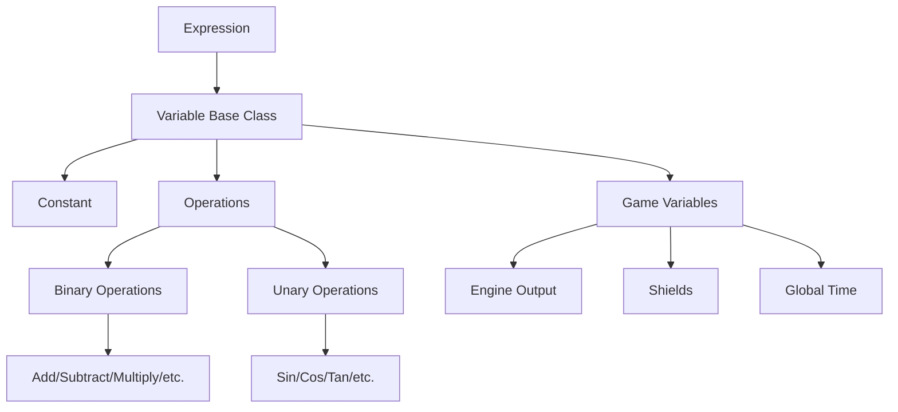

# Scripting System

The scripting system in Wing Commander Saga provides a way to evaluate mathematical expressions and access game variables dynamically. This document outlines how to implement this system in Godot.

## Overview

The original C++ implementation includes:
- Expression parsing and evaluation
- Mathematical operations
- Trigonometric and other mathematical functions
- Game-specific variables
- Text encryption/decryption for secure data storage

## Original C++ Implementation

The original Wing Commander Saga scripting system consists of:

1. **Variable System**: A hierarchical class structure for different types of variables
   - Base `variable` class with derived types for constants, operations, and game variables
   - Support for binary operations (add, subtract, multiply, divide, etc.)
   - Support for unary operations (sin, cos, tan, etc.)
   - Game-specific variables (engine output, shields, global time)

2. **Expression Parser**: Converts string expressions into a tree of variable objects
   - Handles mathematical notation
   - Supports parentheses and operator precedence
   - Converts infix notation to postfix for evaluation
   - Optimizes constant expressions at parse time

3. **Encryption System**: Provides data security for script files
   - Multiple encryption formats (7-bit, 8-bit, and "new" format)
   - Signature-based format detection
   - Block-based encryption with checksums

4. **Lua Scripting System**: Provides a more powerful scripting interface
   - Script hooks for various game events
   - Conditional script execution based on game state
   - Global and local variable access
   - Object-oriented API for game objects

5. **Hook System**: Allows scripts to be triggered on specific events
   - Hooks for game initialization, HUD drawing, simulation updates
   - Conditional hooks based on ship type, mission, state, etc.
   - Support for overriding default behavior

## Architecture



## Implementation Plan

### 1. Variable System

Create a base `Variable` class in GDScript with derived classes for different variable types:

```gdscript
class_name Variable
extends RefCounted

enum VariableType {
    BASE,
    CONSTANT,
    OPERATION,
    EXPRESSION,
    GAME
}

var type: int

func _init(t: int = VariableType.BASE):
    type = t

func value(data = null) -> float:
    return 0.0

func get_type() -> int:
    return type
```

### 2. Constants and Operations

Implement constant values and mathematical operations:

```gdscript
class_name Constant
extends Variable

var val: float

func _init(in_val: float):
    super._init(VariableType.CONSTANT)
    val = in_val

func value(_data = null) -> float:
    return val
```

Operations should be implemented as separate classes with appropriate inheritance:

```gdscript
class_name BinaryOperation
extends Variable

var operand1: Variable
var operand2: Variable

func _init(op1: Variable, op2: Variable):
    super._init(VariableType.OPERATION)
    operand1 = op1
    operand2 = op2
    
func _notification(what):
    if what == NOTIFICATION_PREDELETE:
        # Clean up references when object is deleted
        operand1 = null
        operand2 = null
```

Implement specific binary operations:

```gdscript
class_name AddOperation
extends BinaryOperation

func value(data = null) -> float:
    return operand1.value(data) + operand2.value(data)
```

Implement unary operations:

```gdscript
class_name UnaryOperation
extends Variable

var operand: Variable

func _init(op: Variable):
    super._init(VariableType.OPERATION)
    operand = op
    
func _notification(what):
    if what == NOTIFICATION_PREDELETE:
        # Clean up references when object is deleted
        operand = null
```

The original C++ code supports these operations:

1. **Binary Operations**:
   - Addition (`+`)
   - Subtraction (`-`)
   - Multiplication (`*`)
   - Division (`/`)
   - Modulo (`%`)
   - Power (`^`)
   - Root (`#`)
   - Logarithm base (`~`)
   - Equality comparison (`=`)
   - Greater than (`>`)
   - Less than (`<`)

2. **Unary Operations**:
   - Trigonometric: `sin`, `cos`, `tan`
   - Hyperbolic: `hypsin`, `hypcos`, `hyptan`
   - Inverse trigonometric: `arcsin`, `arccos`, `arctan`
   - Logarithmic: `log` (base 10), `ln` (natural)
   - Angle conversion: `deg` (to degrees), `rad` (to radians)
   - Mathematical: `sqrt`, `abs`, `!` (factorial), `sign`
   - Fractional: `ipart` (integer part), `fpart` (fractional part)
   - Logical: `not`

### 3. Expression Parser

Create an expression parser that can convert string expressions into a tree of variable objects:

```gdscript
class_name Expression
extends Variable

var head: Variable

func _init(expr_str: String):
    super._init(VariableType.EXPRESSION)
    var parser = ExpressionParser.new()
    head = parser.parse(expr_str)

func value(data = null) -> float:
    return head.value(data)
```

The original C++ expression parser handles:

1. **Infix to Postfix Conversion**: Converts standard mathematical notation to postfix notation for easier evaluation
   ```
   Original: 2 + 3 * 4
   Postfix: 2,3,4,*,+
   ```

2. **Operator Precedence**: Respects mathematical order of operations
   ```
   Precedence levels:
   - Level 1: Comparison operators (=, >, <)
   - Level 2: Addition and subtraction (+, -)
   - Level 3: Multiplication, division, modulo (*, /, %)
   - Level 4: Power, root, logarithm (^, #, ~)
   ```

3. **Special Syntax for Game Variables**: Uses colon-based syntax to access game variables
   ```
   :object{engine_output}  // Access ship's engine output
   :global{time}           // Access global game time
   :texture{n_frames}      // Access texture frame count
   ```

4. **Constant Optimization**: Evaluates constant expressions at parse time
   ```
   Expression: 2 + 3 * 4
   Optimized to: Constant(14)
   ```

5. **Implied Multiplication**: Handles cases where multiplication is implied
   ```
   2(3+4) is interpreted as 2*(3+4)
   ```

6. **Special Constants**: Automatically replaces constants like PI and E with their values

Implementation of the parser in GDScript:

```gdscript
class_name ExpressionParser
extends RefCounted

var unary_operations = [
    "hypsin", "hypcos", "hyptan", "arcsin", "arccos", "arctan",
    "sin", "cos", "tan", "log", "ln", "sqrt", "deg", "rad",
    "!", "abs", "ipart", "fpart", "sign", "not"
]

func parse(expr_str: String) -> Variable:
    # Convert to postfix notation
    var postfix = convert_to_postfix(expr_str)
    
    # Parse the postfix expression
    return build_expression_tree(postfix)
    
func convert_to_postfix(expr: String) -> String:
    # Implementation of the shunting yard algorithm
    # ...
    
func build_expression_tree(postfix: String) -> Variable:
    # Build a tree of Variable objects from postfix notation
    # ...
```

### 4. Game Variables

Implement game-specific variables that can access game state:

```gdscript
class_name GameVariable
extends Variable

func _init():
    super._init(VariableType.GAME)
```

The original C++ code includes several game-specific variables:

1. **Object Variables**: Access properties of game objects
   ```gdscript
   class_name EngineOutput
   extends GameVariable

   func value(data = null) -> float:
       if data and data.obj and data.obj.has_method("get_engine_output"):
           return data.obj.get_engine_output()
       return 0.0
   ```

2. **Global Variables**: Access global game state
   ```gdscript
   class_name GlobalTime
   extends GameVariable

   func value(_data = null) -> float:
       return Time.get_ticks_msec() / 1000.0
   ```

3. **Texture Variables**: Access texture properties
   ```gdscript
   class_name TextureFrameCount
   extends GameVariable

   func value(data = null) -> float:
       if data and data.texture:
           return data.texture.n_frames
       return 1.0
   ```

4. **Variable Matrix**: A 4x4 matrix of expressions used for transformations
   ```gdscript
   class_name VariableMatrix
   extends RefCounted

   var matrix = []  # Array of Expression objects
   var size = [0, 0]  # Dimensions of the matrix

   func _init():
       # Initialize empty 4x4 matrix
       matrix = []
       for i in range(16):
           matrix.append(null)

   func set_element(i: int, j: int, expr_str: String) -> void:
       assert(i < 4 and j < 4)
       
       # Update matrix dimensions
       if i + 1 > size[0]:
           size[0] = i + 1
       if j + 1 > size[1]:
           size[1] = j + 1
           
       # Check if we can optimize for identity matrix elements
       if expr_str.is_valid_float():
           var value = float(expr_str)
           if i == j and value == 1.0:
               return  # Don't store identity diagonal
           if i != j and value == 0.0:
               return  # Don't store zero off-diagonal
       
       # Store the expression
       var idx = j * 4 + i
       if matrix[idx]:
           matrix[idx] = null  # Clear existing expression
       
       matrix[idx] = Expression.new(expr_str)
   
   func get_element(i: int, j: int, obj = null) -> float:
       assert(i < 4 and j < 4)
       
       var idx = j * 4 + i
       if matrix[idx]:
           return matrix[idx].value(VariableCallData.new(obj))
       
       # Default values for identity matrix
       if i == j:
           return 1.0
       return 0.0
   
   func get_size(dimension: int) -> int:
       return size[dimension % 2]
   ```

The variable call data structure for passing context to variables:

```gdscript
class_name VariableCallData
extends RefCounted

var obj  # Game object reference
var texture = {
    "n_frames": 1,
    "fps": 1
}

func _init(o = null, t = null):
    obj = o
    if t:
        texture = t
```

### 5. Encryption System

Port the encryption/decryption functionality for secure data storage:

```gdscript
class_name ScriptEncryption
extends RefCounted

const ENCRYPT_NEW_SIGNATURE = 0x5c331a55
const ENCRYPT_SIGNATURE = 0xdeadbeef
const ENCRYPT_SIGNATURE_8BIT = 0xcacacaca
const NUM_LVL1_KEYS = 11

static var lvl1_keys = [
    0xa820, 0x71f0, 0x88da, 0x1fff, 0x2718,
    0xe6a1, 0x42b8, 0x0ce9, 0x10ec, 0xd77d, 0x3fa9
]

static var encrypt_initialized = false

static func initialize() -> void:
    if encrypt_initialized:
        return
        
    var temp_var = 0xe2A8
    for i in range(NUM_LVL1_KEYS):
        lvl1_keys[i] ^= (temp_var >> 2)
    
    encrypt_initialized = true

static func encrypt(text: String, use_8bit: bool = false, new_encrypt: bool = true) -> PackedByteArray:
    initialize()
    
    var result = PackedByteArray()
    
    if new_encrypt:
        # Implement new encryption format
        # Add signature
        result.resize(4)
        result.encode_u32(0, ENCRYPT_NEW_SIGNATURE)
        
        # Process text in blocks
        var block_checksum = 0xffff
        var text_bytes = text.to_utf8_buffer()
        var pos = 0
        
        while pos < text_bytes.size():
            # Determine block size
            var block_size = min(NUM_LVL1_KEYS * 2, text_bytes.size() - pos)
            
            # Create block
            var block = PackedByteArray()
            block.resize(block_size)
            for i in range(block_size):
                block[i] = text_bytes[pos + i]
            
            # Encrypt block
            for i in range(block_size / 2):
                var value = block.decode_u16(i * 2)
                value ^= (lvl1_keys[i] ^ block_checksum)
                block.encode_u16(i * 2, value)
            
            # Update checksum
            block_checksum = checksum_add_short(block_checksum, block)
            
            # Add block to result
            result.append_array(block)
            pos += block_size
    else:
        # Implement old encryption format
        # Add signature
        result.resize(4)
        if use_8bit:
            result.encode_u32(0, ENCRYPT_SIGNATURE_8BIT)
        else:
            result.encode_u32(0, ENCRYPT_SIGNATURE)
        
        # Process text
        var text_bytes = text.to_utf8_buffer()
        var byte_offset = 4
        var bit_offset = 0
        
        for i in range(text_bytes.size()):
            var c = text_bytes[i]
            
            # Special case for character 0x92
            if c == 0x92:
                c = 0x27
                
            if use_8bit:
                # 8-bit encryption is simple
                result.resize(byte_offset + 1)
                result[byte_offset] = c
                byte_offset += 1
            else:
                # 7-bit encryption is more complex
                # Implementation details here...
                pass
        
        # XOR scrambling
        for i in range(4, result.size()):
            result[i] ^= (i - 4)
    
    return result

static func decrypt(scrambled_text: PackedByteArray) -> String:
    initialize()
    
    if scrambled_text.size() < 4:
        return scrambled_text.get_string_from_utf8()
    
    # Check signature
    var signature = scrambled_text.decode_u32(0)
    
    if signature == ENCRYPT_NEW_SIGNATURE:
        # New encryption format
        var result = PackedByteArray()
        var block_checksum = 0xffff
        var pos = 4  # Skip signature
        
        while pos < scrambled_text.size():
            # Determine block size
            var block_size = min(NUM_LVL1_KEYS * 2, scrambled_text.size() - pos)
            
            # Extract block
            var block = PackedByteArray()
            block.resize(block_size)
            for i in range(block_size):
                block[i] = scrambled_text[pos + i]
            
            # Make a copy for checksum
            var block_copy = block.duplicate()
            
            # Decrypt block
            for i in range(block_size / 2):
                var value = block.decode_u16(i * 2)
                value ^= (lvl1_keys[i] ^ block_checksum)
                block.encode_u16(i * 2, value)
            
            # Update checksum
            block_checksum = checksum_add_short(block_checksum, block_copy)
            
            # Add block to result
            result.append_array(block)
            pos += block_size
            
        return result.get_string_from_utf8()
    elif signature == ENCRYPT_SIGNATURE or signature == ENCRYPT_SIGNATURE_8BIT:
        # Old encryption format
        # Implementation details here...
        pass
    else:
        # Not encrypted
        return scrambled_text.get_string_from_utf8()

static func checksum_add_short(seed: int, buffer: PackedByteArray) -> int:
    var sum1 = seed
    var sum2 = seed
    
    for i in range(buffer.size()):
        sum1 += buffer[i]
        if sum1 >= 255:
            sum1 -= 255
        sum2 += sum1
    
    sum2 %= 255
    return (sum1 << 8) + sum2

static func is_encrypted(data: PackedByteArray) -> bool:
    if data.size() < 4:
        return false
        
    var signature = data.decode_u32(0)
    return signature == ENCRYPT_NEW_SIGNATURE or signature == ENCRYPT_SIGNATURE or signature == ENCRYPT_SIGNATURE_8BIT

static func get_encryption_type(data: PackedByteArray) -> String:
    if data.size() < 4:
        return "Not encrypted"
        
    var signature = data.decode_u32(0)
    
    if signature == ENCRYPT_SIGNATURE:
        return "FreeSpace 1 type encryption, 7-bit"
    elif signature == ENCRYPT_SIGNATURE_8BIT:
        return "FreeSpace 1 type encryption, 8-bit"
    elif signature == ENCRYPT_NEW_SIGNATURE:
        return "FreeSpace 2 type encryption"
    else:
        return "Not encrypted or unknown encryption type"
```

The encryption system provides three different formats:

1. **FreeSpace 1 7-bit Encryption**: The original format that packs 7-bit characters
2. **FreeSpace 1 8-bit Encryption**: A simpler format that preserves 8-bit characters
3. **FreeSpace 2 Encryption**: A more secure block-based format with checksums

Each format is identified by a signature at the beginning of the encrypted data:
- `0xdeadbeef` for FreeSpace 1 7-bit encryption
- `0xcacacaca` for FreeSpace 1 8-bit encryption
- `0x5c331a55` for FreeSpace 2 encryption

The encryption system can be used for:
- Securing mission scripts
- Protecting saved game data
- Encrypting configuration files
- Securing network communications

## Integration with Godot

### Resource System

Create a custom resource type for storing expressions:

```gdscript
class_name ExpressionResource
extends Resource

@export var expression_string: String
var compiled_expression: Expression

func _init(expr: String = ""):
    expression_string = expr
    if not expr.is_empty():
        compiled_expression = Expression.new(expr)

func evaluate(data = null) -> float:
    if compiled_expression:
        return compiled_expression.value(data)
    return 0.0
```

### Usage in Game Systems

The expression system can be used in various game systems:

1. **Ship Systems**: Dynamic calculation of shield regeneration, engine power, etc.
2. **Mission Scripting**: Conditional events based on mathematical expressions
3. **HUD Elements**: Dynamic positioning or scaling based on expressions
4. **AI Behavior**: Decision making based on evaluated expressions

### Example Usage

```gdscript
# Creating and evaluating an expression
var expr = Expression.new("sin(x) + cos(y) * 2")
var result = expr.value({"x": 0.5, "y": 1.0})

# Using in a ship system
func calculate_shield_regen_rate() -> float:
    var expr = shield_regen_expression.evaluate({
        "current_power": current_power,
        "damage_level": damage_level
    })
    return expr
```

## Migration from C++

When migrating the original C++ code:

1. Map the class hierarchy to GDScript classes
2. Convert the expression parsing logic to use Godot's string manipulation
3. Replace direct memory management with Godot's reference counting
4. Use Godot's built-in math functions where applicable
5. Adapt the variable system to work with Godot's node hierarchy

## Performance Considerations

1. Cache compiled expressions when possible
2. Use Godot's built-in expression evaluation for simple cases
3. Consider using GDExtension for performance-critical parts if needed
4. Implement a pooling system for frequently used variable objects

## Lua Scripting System

The original C++ code includes a Lua scripting system that allows for more complex scripting than the expression system. This system should be implemented in Godot using GDScript:

```gdscript
class_name ScriptState
extends RefCounted

var state_name: String
var lua_state: Object  # Would be LuaAPI in a real implementation
var conditional_hooks: Array[ConditionedHook] = []
var script_images: Array[Dictionary] = []

func _init(name: String):
    state_name = name

func create_lua_state() -> int:
    # Initialize Lua state and libraries
    # In Godot, we would use GDScript instead
    return OK

func parse_chunk(debug_str: String = "") -> ScriptHook:
    # Parse a chunk of script code
    var hook = ScriptHook.new()
    # Implementation details...
    return hook

func run_bytecode(hook: ScriptHook, format: String = "", data = null) -> int:
    # Run the bytecode in the hook
    # Implementation details...
    return OK

func run_condition(action: int, format: String = "", data = null, obj = null) -> int:
    # Run conditional hooks that match the given action
    var num = 0
    for hook in conditional_hooks:
        if hook.conditions_valid(action, obj):
            hook.run(self, action, format, data)
            num += 1
    return num

func is_condition_override(action: int, obj = null) -> bool:
    # Check if any conditional hook overrides the given action
    for hook in conditional_hooks:
        if hook.conditions_valid(action, obj):
            if hook.is_override(self, action):
                return true
    return false

func set_hook_var(name: String, format: String, data = null) -> void:
    # Set a variable in the hook variable table
    # Implementation details...
    pass

func get_hook_var(name: String, format: String = "", data = null) -> bool:
    # Get a variable from the hook variable table
    # Implementation details...
    return false

func parse_condition(filename: String = "") -> bool:
    # Parse a condition from the current script
    # Implementation details...
    return false
```

The `ScriptHook` class represents a hook into the scripting system:

```gdscript
class_name ScriptHook
extends RefCounted

var h_language: int = 0  # Language type (Lua, etc.)
var h_index: int = -1    # Index in the script registry
var o_language: int = 0  # Override language
var o_index: int = -1    # Override index

func is_valid() -> bool:
    return h_index >= 0
```

The `ConditionedHook` class represents a hook that is only executed when certain conditions are met:

```gdscript
class_name ConditionedHook
extends RefCounted

const MAX_HOOK_CONDITIONS = 8

var conditions: Array[ScriptCondition] = []
var actions: Array[ScriptAction] = []

func _init():
    for i in range(MAX_HOOK_CONDITIONS):
        conditions.append(ScriptCondition.new())

func add_condition(sc: ScriptCondition) -> bool:
    for i in range(MAX_HOOK_CONDITIONS):
        if conditions[i].condition_type == ScriptCondition.CHC_NONE:
            conditions[i] = sc
            return true
    return false

func add_action(sa: ScriptAction) -> bool:
    if not sa.hook.is_valid():
        return false
    actions.append(sa)
    return true

func conditions_valid(action: int, obj = null) -> bool:
    # Check if all conditions are valid for the given action and object
    # Implementation details...
    return true

func run(sys: ScriptState, action: int, format: String = "", data = null) -> bool:
    # Run all actions of the given type
    for sa in actions:
        if sa.action_type == action:
            sys.run_bytecode(sa.hook, format, data)
    return true

func is_override(sys: ScriptState, action: int) -> bool:
    # Check if any action of the given type is an override
    for sa in actions:
        if sa.action_type == action:
            if sys.is_override(sa.hook):
                return true
    return false
```

The `ScriptCondition` and `ScriptAction` classes represent conditions and actions for conditional hooks:

```gdscript
class_name ScriptCondition
extends RefCounted

enum {
    CHC_NONE = -1,
    CHC_MISSION = 0,
    CHC_SHIP = 1,
    CHC_SHIPCLASS = 2,
    CHC_SHIPTYPE = 3,
    CHC_STATE = 4,
    CHC_CAMPAIGN = 5,
    CHC_WEAPONCLASS = 6,
    CHC_OBJECTTYPE = 7,
    CHC_KEYPRESS = 8,
    CHC_VERSION = 9,
    CHC_APPLICATION = 10
}

var condition_type: int = CHC_NONE
var data: Dictionary = {"name": ""}

func _init():
    condition_type = CHC_NONE
    data = {"name": ""}
```

```gdscript
class_name ScriptAction
extends RefCounted

enum {
    CHA_NONE = -1,
    CHA_WARPOUT = 0,
    CHA_WARPIN = 1,
    CHA_DEATH = 2,
    CHA_ONFRAME = 3,
    CHA_COLLIDESHIP = 4,
    CHA_COLLIDEWEAPON = 5,
    CHA_COLLIDEDEBRIS = 6,
    CHA_COLLIDEASTEROID = 7,
    CHA_HUDDRAW = 8,
    CHA_OBJECTRENDER = 9,
    CHA_SPLASHSCREEN = 10,
    CHA_GAMEINIT = 11,
    CHA_MISSIONSTART = 12,
    CHA_MISSIONEND = 13,
    CHA_MOUSEMOVED = 14,
    CHA_MOUSEPRESSED = 15,
    CHA_MOUSERELEASED = 16,
    CHA_KEYPRESSED = 17,
    CHA_KEYRELEASED = 18,
    CHA_ONSTATESTART = 19,
    CHA_ONSTATEEND = 20
}

var action_type: int = CHA_NONE
var hook: ScriptHook = ScriptHook.new()

func _init():
    action_type = CHA_NONE
    hook = ScriptHook.new()
```

## Hook System Implementation

The hook system allows scripts to be triggered on specific events in the game. In Godot, this can be implemented using signals and the ScriptState class:

```gdscript
# In a global autoload script
extends Node

# Global script hooks
var script_system = ScriptState.new("WCSaga_Godot")
var script_global_hook = ScriptHook.new()
var script_splash_hook = ScriptHook.new()
var script_simulation_hook = ScriptHook.new()
var script_hud_hook = ScriptHook.new()
var script_gameinit_hook = ScriptHook.new()

func _ready():
    # Initialize the script system
    script_system.create_lua_state()
    
    # Parse script tables
    parse_script_tables()
    
    # Connect signals to run hooks
    get_tree().connect("process_frame", _on_frame)
    # ... other connections

func parse_script_tables():
    # Parse scripting.tbl and other script tables
    # Implementation details...
    pass

func _on_frame():
    # Run the simulation hook on each frame
    script_system.run_bytecode(script_simulation_hook)
    
    # Run conditional hooks for the frame action
    script_system.run_condition(ScriptAction.CHA_ONFRAME)

func run_hud_hook():
    # Run the HUD hook when drawing the HUD
    if not script_system.is_condition_override(ScriptAction.CHA_HUDDRAW):
        script_system.run_bytecode(script_hud_hook)
    
    # Run conditional hooks for the HUD draw action
    script_system.run_condition(ScriptAction.CHA_HUDDRAW)

# ... other hook functions
```

## S-Expression System

The original C++ code includes a powerful S-expression (SEXP) system for mission scripting. This system is used to define mission logic, events, and conditions. In Godot, this can be implemented as follows:

```gdscript
class_name SexpNode
extends RefCounted

enum NodeType {
    LIST = 1,
    ATOM = 2
}

enum AtomType {
    LIST = 0,
    OPERATOR = 1,
    NUMBER = 2,
    STRING = 3
}

var text: String = ""
var op_index: int = -1
var type: int = NodeType.LIST
var subtype: int = 0
var first: int = -1  # Index of first child node
var rest: int = -1   # Index of next sibling node
var value: int = 0
var flags: int = 0
```

The SEXP system includes hundreds of operators organized into categories, each with a specific purpose:

1. **Arithmetic Operators** (`OP_CATEGORY_ARITHMETIC`):
   - `OP_PLUS`: Addition
   - `OP_MINUS`: Subtraction
   - `OP_MUL`: Multiplication
   - `OP_DIV`: Division
   - `OP_MOD`: Modulo
   - `OP_RAND`: Random number
   - `OP_ABS`: Absolute value
   - `OP_MIN`: Minimum value
   - `OP_MAX`: Maximum value
   - `OP_AVG`: Average value

2. **Logical Operators** (`OP_CATEGORY_LOGICAL`):
   - `OP_TRUE`, `OP_FALSE`: Boolean constants
   - `OP_AND`, `OP_OR`, `OP_NOT`: Boolean operations
   - `OP_EQUALS`, `OP_GREATER_THAN`, `OP_LESS_THAN`: Comparisons
   - `OP_STRING_EQUALS`: String comparison
   - `OP_HAS_TIME_ELAPSED`: Time-based condition

3. **Conditional Operators** (`OP_CATEGORY_CONDITIONAL`):
   - `OP_WHEN`: Execute when condition is true
   - `OP_EVERY_TIME`: Execute every time condition is true
   - `OP_ANY_OF`: True if any condition is true
   - `OP_EVERY_OF`: True if all conditions are true
   - `OP_RANDOM_OF`: Randomly select one condition
   - `OP_IN_SEQUENCE`: Execute conditions in sequence

4. **Status Operators** (`OP_CATEGORY_STATUS`):
   - Ship status: shields, hits, distance, etc.
   - Player status: kills, score, weapons, etc.
   - Mission status: time, players, skill level, etc.

5. **Change Operators** (`OP_CATEGORY_CHANGE`):
   - Ship modifications: invisibility, invulnerability, etc.
   - Weapon modifications: ammo, targeting, etc.
   - Mission modifications: messages, goals, etc.
   - Visual effects: camera, HUD, etc.

6. **AI Operators** (`OP_CATEGORY_AI`):
   - `OP_AI_CHASE`: Chase a target
   - `OP_AI_DOCK`: Dock with a ship
   - `OP_AI_WAYPOINTS`: Follow waypoints
   - `OP_AI_DESTROY_SUBSYS`: Target a subsystem
   - `OP_AI_GUARD`: Guard a ship
   - `OP_AI_EVADE_SHIP`: Evade a ship
   - `OP_AI_STAY_NEAR_SHIP`: Stay near a ship
   - `OP_AI_IGNORE`: Ignore a ship

7. **Navpoint Operators** (`OP_CATEGORY_NAVPOINTS`):
   - `OP_NAV_ADD_WAYPOINT`: Add a waypoint
   - `OP_NAV_ADD_SHIP`: Add a ship as a navpoint
   - `OP_NAV_HIDE`, `OP_NAV_UNHIDE`: Hide/show navpoints
   - `OP_NAV_SET_VISITED`: Mark navpoint as visited

8. **Objective Operators** (`OP_CATEGORY_OBJECTIVE`):
   - `OP_IS_DESTROYED_DELAY`: Check if ship is destroyed
   - `OP_IS_DISABLED_DELAY`: Check if ship is disabled
   - `OP_HAS_DOCKED_DELAY`: Check if ship has docked
   - `OP_WAYPOINTS_DONE_DELAY`: Check if waypoints are completed

9. **Time Operators** (`OP_CATEGORY_TIME`):
   - `OP_MISSION_TIME`: Get mission time
   - `OP_TIME_SHIP_DESTROYED`: Time since ship was destroyed
   - `OP_TIME_SHIP_ARRIVED`: Time since ship arrived
   - `OP_TIME_DOCKED`: Time since ship docked

The SEXP system also includes a variable system for storing and retrieving values:

```gdscript
class_name SexpVariable
extends RefCounted

enum VariableType {
    NUMBER = 1 << 4,
    STRING = 1 << 5,
    UNKNOWN = 1 << 6,
    NOT_USED = 1 << 7,
    BLOCK = 1 << 0,
    PLAYER_PERSISTENT = 1 << 3,
    CAMPAIGN_PERSISTENT = 1 << 29,
    NETWORK = 1 << 28
}

var type: int = 0
var text: String = ""
var variable_name: String = ""
```

The SEXP evaluation system processes the SEXP tree and executes the appropriate actions:

```gdscript
class_name SexpEvaluator
extends RefCounted

const SEXP_TRUE = 1
const SEXP_FALSE = 0
const SEXP_KNOWN_FALSE = -2147483647
const SEXP_KNOWN_TRUE = -2147483646
const SEXP_UNKNOWN = -2147483645
const SEXP_NAN = -2147483644
const SEXP_NAN_FOREVER = -2147483643
const SEXP_CANT_EVAL = -2147483642

# Helper functions for traversing the SEXP tree
static func car(node_index: int, nodes: Array[SexpNode]) -> int:
    if node_index < 0:
        return -1
    return nodes[node_index].first

static func cdr(node_index: int, nodes: Array[SexpNode]) -> int:
    if node_index < 0:
        return -1
    return nodes[node_index].rest

static func eval_sexp(node_index: int, nodes: Array[SexpNode], referenced_node: int = -1) -> int:
    if node_index < 0:
        return SEXP_FALSE
        
    var node = nodes[node_index]
    
    # If it's an atom, return its value
    if node.type == NodeType.ATOM:
        if node.subtype == AtomType.NUMBER:
            return int(node.text)
        elif node.subtype == AtomType.STRING:
            return SEXP_TRUE  # Strings evaluate to true
        elif node.subtype == AtomType.OPERATOR:
            # Evaluate the operator
            var op_code = node.op_index
            var first_arg = car(node_index, nodes)
            
            # Handle different operator types
            match op_code:
                # Logical operators
                "OP_TRUE": return SEXP_TRUE
                "OP_FALSE": return SEXP_FALSE
                "OP_AND": 
                    var arg = first_arg
                    while arg >= 0:
                        if eval_sexp(arg, nodes, referenced_node) == SEXP_FALSE:
                            return SEXP_FALSE
                        arg = cdr(arg, nodes)
                    return SEXP_TRUE
                "OP_OR":
                    var arg = first_arg
                    while arg >= 0:
                        if eval_sexp(arg, nodes, referenced_node) == SEXP_TRUE:
                            return SEXP_TRUE
                        arg = cdr(arg, nodes)
                    return SEXP_FALSE
                # ... other operators
    
    return SEXP_FALSE

static func is_sexp_true(node_index: int, nodes: Array[SexpNode], referenced_node: int = -1) -> bool:
    var result = eval_sexp(node_index, nodes, referenced_node)
    return result == SEXP_TRUE or result == SEXP_KNOWN_TRUE
```

### SEXP Tree Structure

The SEXP system uses a tree structure to represent expressions. Each node in the tree is either a list or an atom. Lists contain other nodes, while atoms are terminal nodes that represent operators, numbers, or strings.

For example, the expression `(+ 2 3)` would be represented as:

```
Node 0: List
  first -> Node 1
  rest -> -1
  
Node 1: Atom (Operator "+")
  first -> Node 2
  rest -> -1
  
Node 2: Atom (Number "2")
  first -> -1
  rest -> Node 3
  
Node 3: Atom (Number "3")
  first -> -1
  rest -> -1
```

This tree structure allows for complex nested expressions and conditions to be represented and evaluated.

### Implementation in Godot

In Godot, the SEXP system can be implemented using a combination of GDScript classes and resources:

1. **SexpNode Resource**: A resource that represents a node in the SEXP tree
2. **SexpTree Resource**: A resource that contains an array of SexpNodes
3. **SexpEvaluator Class**: A class that evaluates SEXP trees
4. **SexpParser Class**: A class that parses text into SEXP trees
5. **SexpOperators Singleton**: A singleton that defines all available operators

This implementation would allow for mission scripts to be defined in text files and loaded into the game at runtime, providing a powerful and flexible scripting system for mission logic.

## Next Steps

1. Implement the base Variable class and its derivatives
2. Create the expression parser
3. Implement game-specific variables
4. Port the encryption system
5. Implement the Lua scripting system using GDScript
6. Create the hook system for game events
7. Implement the S-expression system for mission scripting
8. Create integration tests to verify functionality
9. Document the API for use in other game systems
