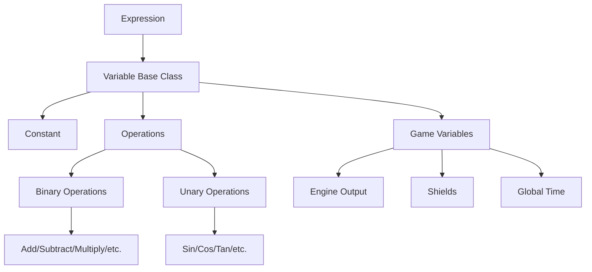

# Wing Commander Saga: Godot Conversion Analysis - Component 08: Scripting System

This document analyzes the scripting systems from the original Wing Commander Saga C++ codebase (Expression Parser, SEXP, Lua Hooks, Encryption) and proposes an implementation strategy for the Godot conversion project, following the guidelines in `tasks/00_analysis_setup.md`.

*Source Code Folders:* `parse/`, `variables/`

## 1. Overview

The original Wing Commander Saga scripting capabilities consist of several interconnected systems:

1.  **Expression Parser & Variable System:** Evaluates mathematical and logical expressions, accessing game state variables. Used for things like dynamic calculations in tables or potentially simple conditions.
2.  **S-Expression (SEXP) System:** A Lisp-like syntax used extensively for defining mission logic, events, goals, AI behaviors, and conditional checks. This is the primary mission scripting engine.
3.  **Lua Scripting & Hook System:** A more powerful, general-purpose scripting layer using Lua, triggered by various game events (hooks). Allows for more complex custom logic beyond SEXP capabilities.
4.  **Encryption System:** Secures script files and potentially other data tables.
5.  **General Parsing Utilities:** Low-level functions for reading table files (`.tbl`, `.tbm`).

The Godot implementation will focus on:
*   Replicating the SEXP system's functionality, likely using a hybrid approach (parsing SEXP structure, evaluating with GDScript).
*   Replacing the Lua hook system with GDScript functions triggered by Godot's signal system, while potentially retaining the conditional hook structure.
*   Implementing the encryption system if needed for loading original encrypted files.
*   The simple expression parser might be less critical if its uses are covered by SEXP or direct GDScript, but its variable system provides insight into game state access.

## 2. Original C++ Implementation Details

### 2.1. Variable System & Expression Parser (`variables/variables.cpp`, `variables/variables.h`)

*   **Variable System:**
    *   Hierarchical class structure (`variable` base) for constants (`constant`), operations (`operate`, `unary`), game state access (`game_variable`), and parsed expressions (`expression`).
    *   Specific classes for binary ops (`add`, `sub`, `mult`, `div`, `mod`, `power`, `root`, `logb`, `comp_equal`, etc.) and unary ops (`sin_op`, `cos_op`, `log_op`, `sqrt_op`, `not`, etc.).
    *   Game variable classes (`engine_output`, `shields`, `global_time`, `n_frames_op`, `fps_op`) access specific game state.
    *   `variable_call_data` struct passes context (current object, texture) for evaluation.
    *   `var_matrix` class handles 4x4 matrices of expressions.
*   **Expression Parser:**
    *   Parses infix mathematical strings into a tree of `variable` objects.
    *   Handles operator precedence, parentheses, implied multiplication, constants (PI, E).
    *   Uses infix-to-postfix conversion (`postfix` function).
    *   Builds expression tree from postfix (`expression::parse_next`).
    *   Optimizes constant sub-expressions at parse time.
    *   Parses special game variable syntax (`:object{...}`, `:global{...}`, `:texture{...}`) via `expression::get_object_variable`.

### 2.2. Encryption System (`parse/encrypt.cpp`, `parse/encrypt.h`)

*   Provides data security for script files and potentially other data.
*   Supports multiple encryption formats: FreeSpace 1 7-bit (`0xdeadbeef`), FreeSpace 1 8-bit (`0xcacacaca`), and FreeSpace 2 "new" format (`0x5c331a55`).
*   Uses signatures for format detection (`is_encrypted`, `is_old_encrypt`, `encrypt_type`).
*   FS2 format uses block-based XOR encryption with checksums (`encrypt_new`, `unencrypt_new`, `chksum_add_short`, `Lvl1_keys`).
*   FS1 formats use bit-shifting (7-bit) or direct copy (8-bit) followed by XOR scrambling (`encrypt`, `unencrypt`).
*   Initializes keys on first use (`encrypt_init`).

### 2.3. Lua Scripting System (`parse/scripting.cpp`, `parse/scripting.h`, `parse/lua.h`)

*   Provides a more powerful scripting interface using Lua.
*   `script_state` class: Manages the Lua environment (`lua_State* LuaState`), loads/runs scripts, handles hooks and variables.
*   `script_hook` struct: Represents a compiled script chunk (identified by language and registry index). Can include an override hook.
*   Lua C API integration: Uses functions like `luaL_loadbuffer`, `lua_pcall`, `luaL_ref`, etc.
*   Bridging (`parse/lua.h`, `parse/lua.cpp` - *inferred*): Defines helper functions (`ade_get_args`, `ade_set_args`) and structures (`ade_odata`, `ade_table_entry`, `ade_obj`) to pass data between C++ and Lua, including game objects.
*   Hook Variables: Allows setting/getting variables within the Lua hook context (`SetHookVar`, `GetHookVar`, `RemHookVar`, `OpenHookVarTable`, `CloseHookVarTable`).
*   Global Variables: Access to Lua global variables (`GetGlobal`, `RemGlobal`).
*   Script Execution: `RunBytecode` executes a `script_hook`. `EvalString` evaluates a Lua string directly.

### 2.4. Hook System (`parse/scripting.cpp`, `parse/scripting.h`)

*   Allows Lua scripts (or potentially other script types) to be triggered on specific game events.
*   `script_init`: Initializes the system, parses `scripting.tbl` and modular `*-sct.tbm` files.
*   Global Hooks: Predefined hooks like `Script_globalhook`, `Script_splashhook`, `Script_simulationhook`, `Script_hudhook`, `Script_gameinithook`.
*   Conditional Hooks (`ConditionedHook` class): Hooks that execute only if specific conditions are met.
    *   `script_condition` struct: Defines conditions based on game state (Mission, Ship, Ship Class, State, Campaign, etc. - see `Script_conditions` array and `CHC_*` constants).
    *   `script_action` struct: Defines the game event that triggers the hook (OnFrame, OnDeath, HUDDraw, KeyPressed, etc. - see `Script_actions` array and `CHA_*` constants).
    *   `ParseCondition`: Parses conditional hook definitions from tables.
    *   `RunCondition`: Executes conditional hooks matching a specific action and context.
    *   `IsConditionOverride`: Checks if a conditional hook overrides default behavior.

### 2.5. S-Expression (SEXP) System (`parse/sexp.h`, `parse/sexp.cpp` - *inferred*)

*   A Lisp-like system (`(operator arg1 arg2 ...)`) used extensively for mission logic, events, and conditions.
*   Tree Structure: Uses `sexp_node` (list or atom) to represent expressions. Atoms can be operators, numbers, or strings. Traversed using `CAR`, `CDR`, etc.
*   Operators (`Operators[]`, `OP_*` defines): Hundreds of predefined operations covering arithmetic, logic, game status checks, game state changes, AI control, nav points, objectives, time checks, etc. Organized into categories (`OP_CATEGORY_*`) and subcategories.
*   Evaluation: `eval_sexp` recursively evaluates a node, returning constants like `SEXP_TRUE`, `SEXP_FALSE`, `SEXP_UNKNOWN`. `is_sexp_true` checks the result.
*   Variables (`sexp_variable`, `Sexp_variables[]`): Allows storing/retrieving numbers and strings, with persistence options (player, campaign). Accessed using `@variable_name` syntax in tables. `modify_variable`, `get_index_sexp_variable_name`.
*   Syntax Checking: `check_sexp_syntax` validates tree structure and argument types (`OPF_*`, `OPR_*` defines). Returns error codes (`SEXP_CHECK_*`).
*   Parsing (`parse/parselo.cpp`, `parse/sexp.cpp`): Handled by general table parsing functions, converting text representations into the SEXP node tree.

### 2.6. General Parsing Utilities (`parse/parselo.cpp`, `parse/parselo.h`)

*   A suite of functions for reading table files (`.tbl`, `.tbm`), handling comments, whitespace, tokens, strings, numbers, lists, vectors, matrices, and errors. Used by mission, SEXP, and script table parsers. Key functions include `read_file_text`, `reset_parse`, `required_string`, `optional_string`, `stuff_string`, `stuff_int`, `stuff_float`, `stuff_vector`, `stuff_string_list`, `stuff_int_list`, `alloc_block`.

## 3. Architecture Diagram (Expression Parser Focus)

## 4. Godot Implementation Plan

### 4.1. Variable System & Expression Parser (GDScript)

*   **Status:** Not Implemented.
*   **Original C++ Files:** `variables/variables.cpp`, `variables/variables.h`
*   **Goal:** Replicate the simple mathematical expression parser if needed, primarily for understanding game variable access. SEXP system is more critical for mission logic.
*   **Planned Godot Files:** `scripts/scripting/variables/variable_base.gd`, `scripts/scripting/variables/variable_call_data.gd`, `scripts/scripting/variables/variable_matrix.gd`, `scripts/scripting/parser/expression_parser.gd` (and specific operation/variable classes).
*   **Planned Variable System:**
    *   Create base `Variable` class (`scripts/scripting/variables/variable_base.gd`) extending `RefCounted`.
    *   Implement derived classes: `Constant`, `BinaryOperation`, `UnaryOperation`, `GameVariable`, `Expression`.
    *   Implement specific operation classes (`AddOperation`, `SinOperation`, etc.) using Godot math functions.
    *   Implement game variable classes (`EngineOutput`, `GlobalTime`, etc.) accessing game state via Singletons or context data.
    *   Implement `VariableCallData` (`scripts/scripting/variables/variable_call_data.gd`) as `RefCounted` or `Resource` to pass context (e.g., ship node reference).
    *   Implement `VariableMatrix` (`scripts/scripting/variables/variable_matrix.gd`) using `Array` of `Expression` objects/resources.
*   **Expression Parser:**
    *   Create `ExpressionParser` class (`scripts/scripting/parser/expression_parser.gd`).
    *   Implement Shunting-yard algorithm for infix-to-postfix conversion.
    *   Implement postfix evaluation to build the `Variable` tree.
    *   Handle operator precedence, parentheses, constants (PI, E), implied multiplication.
    *   Implement parsing for game variable syntax (`:object{...}`).
    *   Implement constant folding optimization.
*   **Notes:** This system is currently lower priority than SEXP and Hooks. Its functionality might be partially covered by other systems.

### 4.2. Encryption System (GDScript)

*   **Status:** Not Implemented.
*   **Original C++ Files:** `parse/encrypt.cpp`, `parse/encrypt.h`
*   **Goal:** Implement if needed to decrypt original encrypted files (e.g., mission files if they were encrypted, though typically they aren't). Not needed for encrypting new Godot data unless specifically required.
*   **Planned Implementation:**
    *   Create `ScriptEncryption` Singleton/Autoload (`scripts/globals/script_encryption.gd`).
    *   Implement `encrypt` and `decrypt` static methods using `PackedByteArray`.
    *   Port algorithms for FS1 7-bit, FS1 8-bit, and FS2 "new" formats, including signature checks and checksums.
    *   Use Godot byte utilities (`encode_u32`, `decode_u16`, etc.).
    *   Manage key initialization.
*   **Notes:** Only necessary if original encrypted files need to be read directly.

### 4.3. Lua Scripting & Hook System (GDScript Replacement)

*   **Status:** Implemented (Core Logic), Integration Pending.
*   **Original C++ Files:** `parse/scripting.cpp`, `parse/scripting.h`, `parse/lua.h`, `parse/lua.cpp` (inferred)
*   **Goal:** Replace Lua logic with GDScript, leveraging Godot's signal system for hooks. Retain the conditional hook structure.
*   **Implemented Files:**
    *   `scripts/scripting/hook_system/script_state.gd`: Manages `ConditionedHook` instances.
    *   `scripts/scripting/hook_system/conditioned_hook.gd`: Resource grouping conditions and actions.
    *   `scripts/scripting/hook_system/script_condition.gd`: Resource defining a single condition.
    *   `scripts/scripting/hook_system/script_action.gd`: Resource linking an action type to a `ScriptHook`.
    *   `scripts/scripting/hook_system/script_hook.gd`: Resource holding `Callable`s for hook functions.
*   **Planned Implementation Details:**
    *   **Hook System Core:**
        *   `ScriptState` class (`scripts/scripting/hook_system/script_state.gd`) manages hooks. (Implemented)
        *   `ScriptHook` class (`scripts/scripting/hook_system/script_hook.gd`) represents a target GDScript function (using `Callable`). (Implemented)
        *   `ConditionedHook` class (`scripts/scripting/hook_system/conditioned_hook.gd`) groups conditions and actions. (Implemented)
        *   `ScriptCondition` (`scripts/scripting/hook_system/script_condition.gd`) and `ScriptAction` (`scripts/scripting/hook_system/script_action.gd`) classes use enums mirroring `CHC_*` and `CHA_*`. (Implemented, requires `GlobalConstants.gd`)
    *   **Planned Integration:**
        *   Create `ScriptSystem` Autoload (`scripts/core_systems/script_system.gd`) holding a `ScriptState` instance. (**MISSING**)
        *   Implement `parse_script_tables()` in `ScriptSystem` to load hook definitions from converted table data (e.g., JSON or `.tres`) into `ScriptState`.
        *   Connect Godot signals (e.g., `Ship.died`, `SceneTree.process_frame`, `InputEvent`) to handler methods in `ScriptSystem`.
        *   Handler methods in `ScriptSystem` call `ScriptState.run_condition()` with the appropriate `ActionType` and context object.
        *   `ScriptCondition.is_valid()` methods check game state. (Implemented)
        *   `ScriptHook.execute()` calls the target GDScript function via the stored `Callable`. (Implemented)
    *   **Override Logic:** `ScriptHook.check_override()` and `ScriptState.is_condition_override()` are implemented. Game logic needs to call `is_condition_override()` before executing default behavior.
*   **Notes:** Requires `scripts/core_systems/script_system.gd` for integration and loading hook definitions. Requires `scripts/globals/global_constants.gd` for `HookActionType` and `HookConditionType` enums.

### 4.4. S-Expression (SEXP) System (Hybrid GDScript Approach)

*   **Status:** Implemented (Core Logic), Parsing Pending.
*   **Original C++ Files:** `parse/sexp.h`, `parse/sexp.cpp` (inferred), `parse/parselo.cpp` (for text parsing)
*   **Goal:** Parse the SEXP structure from mission files and evaluate it using GDScript to drive mission logic. Maintain compatibility with existing mission SEXP logic.
*   **Implemented Files:**
    *   `scripts/scripting/sexp/sexp_node.gd`: Resource representing a node (list/atom) in the SEXP tree.
    *   `scripts/scripting/sexp/sexp_constants.gd`: Defines constants (`OP_*`, `SEXP_*`, etc.).
    *   `scripts/scripting/sexp/sexp_evaluator.gd`: Recursively evaluates `SexpNode` trees.
    *   `scripts/scripting/sexp/sexp_operators.gd`: Autoload Node containing handler functions (`_op_*`) for operators.
    *   `scripts/scripting/sexp/sexp_variables.gd`: Autoload Node managing SEXP variables (`@variable_name`).
*   **Planned Implementation Details:**
    *   **Parsing:**
        *   `SexpNode` class/Resource (`scripts/scripting/sexp/sexp_node.gd`) represents the tree structure. (Implemented)
        *   Create `SexpParser` class (`scripts/scripting/sexp/sexp_parser.gd`) to parse the Lisp-like text format from converted mission data (`MissionData.tres`) into an `SexpNode` tree. (**MISSING** - May be part of offline tools).
    *   **Evaluation:**
        *   `SexpEvaluator` class (`scripts/scripting/sexp/sexp_evaluator.gd`) recursively evaluates the tree. (Implemented)
        *   `SexpOperatorHandler` Node/Singleton (`scripts/scripting/sexp/sexp_operators.gd`) contains GDScript functions for operators. (Implemented, needs operator functions filled in).
        *   `is_sexp_true(node, context)` helper in `SexpEvaluator` interprets results. (Implemented)
    *   **Variables:**
        *   `SexpVariableManager` Singleton (`scripts/scripting/sexp/sexp_variables.gd`) stores variables. (Implemented)
        *   `SexpEvaluator` accesses this manager. (Implemented)
    *   **Constants:** `SexpConstants` script (`scripts/scripting/sexp/sexp_constants.gd`) defines constants. (Implemented)
*   **Notes:** Requires `SexpParser` (runtime or offline) to create the `SexpNode` trees. `SexpOperatorHandler` needs implementations for all required operators.

### 4.5. General Parsing Utilities

*   **Status:** Handled by Godot built-ins / Offline Tools.
*   **Original C++ Files:** `parse/parselo.cpp`, `parse/parselo.h`
*   **Goal:** Replace low-level C++ file reading and tokenizing.
*   **Implementation Approach:**
    *   Use Godot's `FileAccess` for reading files. (Built-in)
    *   Use Godot's built-in string manipulation methods (`split`, `strip_edges`, `to_int`, `to_float`, `find`, etc.) for tokenizing.
    *   For complex table formats (`.tbl`), create dedicated parser classes (e.g., `TblParser.gd`) possibly using regular expressions (`RegEx` class) or state machines. These parsers will be part of the offline conversion tools (`migration_tools/`).

## 5. Integration with Godot

*   **Expression System:** (Not Implemented) If implemented, `ExpressionResource` could be used for dynamic calculations via `expression_resource.evaluate(context_data)`.
*   **Encryption System:** (Not Implemented) If implemented, would be called by file loaders before parsing encrypted data.
*   **Hook System:** Requires integration. A `ScriptSystem` Autoload (or similar manager) needs to:
    1.  Load hook definitions (likely from converted `.tbl` data) into the `ScriptState` instance.
    2.  Connect relevant game signals (e.g., `Ship.died`, `InputEvent`, `SceneTree.process_frame`) to handler functions.
    3.  These handlers call `ScriptState.run_condition(action_type, context)`.
    4.  Game logic checks `ScriptState.is_condition_override(action_type, context)` before executing default behaviors where needed.
*   **SEXP System:** Requires integration. A `MissionManager` (or similar) needs to:
    1.  Load/parse SEXP text (from `MissionData.tres`) into `SexpNode` trees (using a `SexpParser` or pre-converted resources).
    2.  During mission updates (`_process`), call `SexpEvaluator.is_sexp_true(condition_node, context)` for events/goals.
    3.  If true, call `SexpEvaluator.eval_sexp(action_node, context)` for the corresponding actions.
    4.  The `SexpOperatorHandler` functions (called by the evaluator) interact with game systems (AI, Ship, Message Managers, etc.) to perform actions.

## 6. Migration Notes

*   The most significant effort lies in porting the SEXP system, particularly the vast operator library within `SexpOperatorHandler`.
*   Replacing Lua hooks with GDScript signals requires careful mapping of original hook actions (`CHA_*`) to appropriate Godot signals and ensuring context data is passed correctly.
*   The simple expression parser is likely less critical than SEXP but provides a pattern for accessing game variables.
*   Encryption is only needed if dealing with original encrypted assets/data.

## 7. Performance Considerations

*   **SEXP Evaluation:** Evaluating complex SEXP trees frequently could be a bottleneck. Consider caching results of static conditions or optimizing operator implementations.
*   **Hook System:** Excessive signal emissions or complex condition checks in `is_valid` could impact performance. Use signals judiciously.
*   **Expression Parser:** Parsing expressions at runtime should be avoided if possible; pre-parse and store the tree structure (e.g., in `ExpressionResource`).

## 8. Next Steps

1.  **Prioritize SEXP:** Focus on implementing the SEXP parser, evaluator, variable manager, and a core set of essential operators. This is crucial for mission logic.
2.  **Implement Hook System:** Set up the `ScriptSystem` Autoload and the core classes (`ScriptState`, `ScriptHook`, etc.). Define key signals in game systems and connect them. Implement the table parser for hook definitions.
3.  **Implement Encryption:** If required for loading specific data.
4.  **Implement Expression Parser:** If deemed necessary after SEXP/Hook systems are functional.
5.  Integrate systems incrementally and test thoroughly.
