# Wing Commander Saga: Menu UI System

## Overview

The Menu UI system in Wing Commander Saga provides a comprehensive framework for creating and managing user interfaces throughout the game. This includes main menus, dialog boxes, option screens, and other interactive UI elements.

The UI system is designed to handle various screens including the Ready Room (mission selection), Tech Room (ship/weapon database), Training Menu, and other specialized interfaces that maintain the Wing Commander aesthetic while providing necessary game functionality.

The system includes specialized components like the Lab Viewer for examining 3D models and textures, and the Control Configuration screen for customizing input bindings.

## Original C++ Implementation

The original Wing Commander Saga UI system is built around several key classes and specialized screen implementations:

- **UI_GADGET**: Base class for all UI elements with common functionality
  - Handles mouse interaction, focus, hotkeys, and drawing
  - Supports bitmap-based rendering with multiple frames
  - Manages parent-child relationships between UI elements
  - Provides common functionality like enable/disable, hide/show
  - Implements mouse capturing and event propagation
  - Uses coordinate-based positioning with explicit x,y coordinates

- **UI_WINDOW**: Container for UI elements with event handling
  - Manages gadget focus and input processing
  - Handles keyboard and mouse events
  - Supports bitmap backgrounds and masks for irregular shapes
  - Provides XSTR support for localization
  - Implements tooltip rendering

- **UI_BUTTON**: Interactive button implementation
  - Supports normal, highlighted, pressed, and disabled states
  - Handles repeating buttons (held down)
  - Provides callback functions for various states (pressed, highlighted, disabled)
  - Supports custom cursors when hovering
  - Implements hotkey binding

- **UI_CHECKBOX**: Toggle checkbox implementation
  - Maintains checked/unchecked state
  - Supports text labels
  - Handles mouse and keyboard toggling
  - Provides bitmap-based or drawn rendering

- **UI_RADIO**: Radio button implementation
  - Groups radio buttons together
  - Ensures only one button in a group is selected
  - Similar interface to checkbox but with different behavior
  - Supports text labels and bitmap-based rendering

- **UI_LISTBOX**: Scrollable list implementation
  - Displays a scrollable list of text items
  - Supports item selection and toggling
  - Handles keyboard navigation and search-by-typing
  - Integrates with scrollbar for navigation
  - Supports checkboxes for each item

- **UI_INPUTBOX**: Text input field implementation
  - Handles text input with validation
  - Supports password mode with character masking
  - Provides character filtering options
  - Implements cursor animation
  - Supports various input flags (letter-only, number-only, etc.)

- **UI_SCROLLBAR**: Scrollbar for navigating content
  - Supports dragging the thumb/handle
  - Provides up/down buttons
  - Calculates positions based on content size
  - Integrates with scrollable content

- **UI_SLIDER/UI_DOT_SLIDER**: Value selection sliders
  - Supports horizontal value selection
  - Provides visual feedback of selected value
  - Handles mouse dragging and button navigation
  - Supports bitmap-based or drawn rendering

- **UI_ICON**: Static or interactive icon implementation
  - Displays bitmap icons with different states
  - Supports highlighting on mouse over
  - Simpler than buttons but with similar state handling

- **UI_KEYTRAP**: Keyboard event handler
  - Captures specific key presses
  - Triggers callback functions
  - Invisible UI element for keyboard shortcuts

The system uses a combination of bitmap-based rendering and primitive drawing operations, with support for hotspots, keyboard navigation, and event callbacks. It also includes helper functions for drawing UI elements like boxes, lines, and text.

### Specialized UI Screens

- **Ready Room (readyroom.cpp)**: Mission selection interface
  - Displays available standalone missions and campaign missions
  - Handles mission filtering and selection
  - Manages campaign progression and mission loading
  - Uses bitmap-based UI with hotspot regions
  - Implements scrollable lists with pagination

- **Tech Room (techmenu.cpp)**: Technical database interface
  - Displays information about ships, weapons, and intelligence
  - Features 3D model viewing with rotation controls
  - Supports animated weapon demonstrations
  - Implements tabbed interface for different data categories
  - Provides scrollable text descriptions with pagination

- **Training Menu (trainingmenu.cpp)**: Training mission selection
  - Simple menu interface for selecting training missions
  - Uses the "snazzyui" system for region-based interaction
  - Implements bitmap masking for irregular clickable areas

- **Snazzy UI (snazzyui.cpp)**: Region-based UI interaction system
  - Handles mouse interaction with bitmap-masked regions
  - Supports keyboard shortcuts for menu options
  - Implements highlighting and selection effects
  - Uses a data-driven approach with region definitions

- **Lab Viewer (lab.cpp)**: Model and texture viewer
  - Provides interactive 3D model viewing with rotation controls
  - Supports model detail level switching
  - Allows toggling of various rendering options (thrusters, lighting, wireframe)
  - Implements special effects like lightning arcs and thruster animations
  - Features trackball-style mouse control for model manipulation
  - Includes UI for selecting ships and weapons to view

- **Control Config (controlsconfig.cpp)**: Input configuration interface
  - Allows binding of keyboard keys and joystick buttons to game actions
  - Organizes controls into tabbed categories (targeting, ship, weapons, computer)
  - Provides conflict detection and resolution
  - Supports modifier keys (shift, alt)
  - Includes axis configuration for joysticks
  - Implements search functionality to find specific controls
  - Provides undo capability for configuration changes

## Godot Implementation Strategy

### Core Architecture

```mermaid
graph TD
    A[UI System] --> B[Menu Scenes]
    A --> C[UI Components]
    A --> D[Theme System]
    A --> P[Popup System]
    A --> Q[Context Help]
    A --> R[Pilot Management]
    A --> S[Control Config]
    A --> Z[Mission UI]
    B --> E[Main Menu]
    B --> F[Options Menu]
    B --> G[Mission Briefing]
    B --> H[Debriefing]
    C --> I[Custom Controls]
    C --> J[UI Animations]
    D --> K[WC Saga Theme]
    D --> L[Font System]
    P --> M[Standard Popups]
    P --> N[Death Popup]
    P --> O[Input Popup]
    R --> T[Pilot Profiles]
    R --> U[Campaign Progress]
    R --> V[Statistics]
    S --> W[Key Bindings]
    S --> X[Joystick Config]
    S --> Y[Conflict Detection]
    Z --> ZA[Ship Selection]
    Z --> ZB[Weapon Selection]
    Z --> ZC[Red Alert]
    Z --> ZD[Mission Briefing]
```



### Component Mapping

| Original Component | Godot Equivalent | Implementation Approach |
|--------------------|------------------|-------------------------|
| UI_WINDOW | Control node | Custom Control scene with input handling and child management |
| UI_BUTTON | Button | Extended Button class with additional states and callbacks |
| UI_CHECKBOX | CheckBox | Extended CheckBox with custom styling and toggle behavior |
| UI_RADIO | CheckButton | Extended CheckButton with ButtonGroup for radio behavior |
| UI_LISTBOX | ItemList | Custom Control combining ItemList with ScrollContainer |
| UI_INPUTBOX | LineEdit | Extended LineEdit with validation and custom cursor |
| UI_SCROLLBAR | ScrollContainer | Custom scrollbar implementation for precise control |
| UI_SLIDER | HSlider/VSlider | Extended sliders with custom drawing and behavior |
| UI_ICON | TextureRect | Extended TextureRect with state handling |
| UI_KEYTRAP | InputEventHandler | Custom input handling through _input() method |
| Popup System | AcceptDialog/ConfirmationDialog | Extended dialog system with custom styling and behavior |
| Context Help | CanvasLayer with Control nodes | Custom help overlay system with highlighting and tooltips |
| Ready Room | Custom Scene | Mission selection interface with campaign/standalone tabs |
| Tech Room | Custom Scene | Database viewer with 3D model display and information panels |
| Snazzy UI | Custom Control | Region-based interaction system using mask textures |
| Lab Viewer | Custom Scene | 3D model viewer with SubViewport and Camera3D |
| Control Config | Custom Scene | Input configuration interface with conflict detection |

#### Implementation Details

- **Base UI Class**: Create a `WCSagaUIElement` base class that extends Control and implements common functionality from UI_GADGET
- **Theme System**: Develop a comprehensive theme resource that defines all visual aspects
- **Input Management**: Create an input manager that handles keyboard, mouse, and gamepad input consistently
- **Focus System**: Implement a custom focus system that matches the original behavior
- **Bitmap Support**: Create a system for handling multi-frame bitmaps for UI elements

### Specialized Screen Implementation

#### Ready Room (Mission Selection)

```gdscript
class_name WCSagaReadyRoom
extends Control

# Constants from original implementation
const MODE_CAMPAIGNS = 0
const MODE_MISSIONS = 1

# Properties
var current_mode: int = MODE_CAMPAIGNS
var mission_list: Array[MissionEntry] = []
var campaign_list: Array[CampaignEntry] = []
var selected_line: int = 0
var scroll_offset: int = 0
var current_campaign: String = ""

# Implementation
func _ready():
    # Initialize UI components
    setup_buttons()
    load_campaign_data()
    load_mission_data()
    build_listing()
    
func setup_buttons():
    # Set up all button connections
    $MissionTab.pressed.connect(_on_mission_tab_pressed)
    $CampaignTab.pressed.connect(_on_campaign_tab_pressed)
    $CommitButton.pressed.connect(_on_commit_pressed)
    $ScrollUpButton.pressed.connect(_on_scroll_up_pressed)
    $ScrollDownButton.pressed.connect(_on_scroll_down_pressed)
    
func build_listing():
    # Build the appropriate listing based on current mode
    clear_list()
    if current_mode == MODE_MISSIONS:
        build_mission_listing()
    else:
        build_campaign_listing()
        
func _on_commit_pressed():
    # Start the selected mission or campaign
    if selected_line >= 0:
        if current_mode == MODE_MISSIONS:
            start_standalone_mission(mission_list[selected_line].filename)
        else:
            start_campaign_mission(campaign_list[selected_line].filename)
```

#### Tech Room (Database Viewer)

```gdscript
class_name WCSagaTechRoom
extends Control

# Tab constants
enum {
    SHIPS_DATA_TAB,
    WEAPONS_DATA_TAB,
    INTEL_DATA_TAB
}

# Properties
var current_tab: int = SHIPS_DATA_TAB
var ship_list: Array[TechEntry] = []
var weapon_list: Array[TechEntry] = []
var intel_list: Array[TechEntry] = []
var current_list: Array[TechEntry] = []
var selected_entry: int = 0
var scroll_offset: int = 0
var text_offset: int = 0
var ship_model_instance: Node3D
var ship_rotation: float = 0.0
var trackball_active: bool = false

# Implementation
func _ready():
    # Initialize UI components
    setup_tabs()
    load_ship_data()
    load_weapon_data()
    load_intel_data()
    change_tab(current_tab)
    
func _process(delta):
    # Handle model rotation
    if current_tab == SHIPS_DATA_TAB and ship_model_instance:
        if not trackball_active:
            ship_rotation += PI2 * delta / 5.2
            update_ship_rotation()
            
func setup_tabs():
    # Set up tab buttons
    $ShipsTab.pressed.connect(func(): change_tab(SHIPS_DATA_TAB))
    $WeaponsTab.pressed.connect(func(): change_tab(WEAPONS_DATA_TAB))
    $IntelTab.pressed.connect(func(): change_tab(INTEL_DATA_TAB))
    
func change_tab(tab: int):
    # Change to the specified tab
    current_tab = tab
    selected_entry = 0
    scroll_offset = 0
    text_offset = 0
    
    # Set the appropriate list
    match current_tab:
        SHIPS_DATA_TAB:
            current_list = ship_list
            setup_ship_view()
        WEAPONS_DATA_TAB:
            current_list = weapon_list
            setup_weapon_view()
        INTEL_DATA_TAB:
            current_list = intel_list
            setup_intel_view()
            
    select_entry(0)
    
func select_entry(index: int):
    # Select the specified entry
    if index >= 0 and index < current_list.size():
        selected_entry = index
        
        # Update display based on tab
        match current_tab:
            SHIPS_DATA_TAB:
                load_ship_model(current_list[index].model_path)
            WEAPONS_DATA_TAB, INTEL_DATA_TAB:
                load_animation(current_list[index].anim_path)
                
        # Update description text
        update_description_text(current_list[index].description)
```

#### Snazzy UI System

```gdscript
class_name WCSagaSnazzyUI
extends Control

# Constants
const ESC_PRESSED = -2

# Signals
signal region_clicked(region_id: int)
signal region_hovered(region_id: int)

# Properties
var regions: Array[SnazzyRegion] = []
var mask_texture: Texture2D
var mask_data: PackedByteArray
var mouse_left_was_down: bool = false
var current_hover_region: int = -1

# Region class
class SnazzyRegion:
    var mask_value: int
    var key: String
    var text: String
    var click_sound: int
    
    func _init(p_mask: int, p_key: String, p_text: String, p_sound: int = -1):
        mask_value = p_mask
        key = p_key
        text = p_text
        click_sound = p_sound

# Implementation
func _ready():
    # Set up input handling
    set_process_input(true)
    
func setup_from_file(menu_name: String):
    # Load menu data from file
    var config = ConfigFile.new()
    if config.load("res://resources/menus/" + menu_name + ".tres") == OK:
        # Load mask texture
        var mask_path = config.get_value("menu", "mask_texture")
        mask_texture = load(mask_path)
        
        # Extract mask data
        var img = mask_texture.get_image()
        mask_data = img.get_data()
        
        # Load regions
        var region_count = config.get_value("menu", "region_count")
        for i in range(region_count):
            var section = "region_" + str(i)
            var mask = config.get_value(section, "mask")
            var key = config.get_value(section, "key")
            var text = config.get_value(section, "text")
            var sound = config.get_value(section, "sound", -1)
            
            regions.append(SnazzyRegion.new(mask, key, text, sound))
    
func _input(event):
    # Handle keyboard input
    if event is InputEventKey and event.pressed:
        for region in regions:
            if region.key == char(event.unicode):
                emit_signal("region_clicked", region.mask)
                play_click_sound(region.click_sound)
                return
                
        # Check for ESC
        if event.keycode == KEY_ESCAPE:
            emit_signal("region_clicked", ESC_PRESSED)
            
func _process(_delta):
    # Handle mouse interaction
    var mouse_pos = get_local_mouse_position()
    
    # Get pixel value at mouse position
    var pixel_value = get_pixel_value(mouse_pos)
    
    # Check for hover
    var hover_region = -1
    for region in regions:
        if pixel_value == region.mask:
            hover_region = region.mask
            break
            
    # Emit hover signal if changed
    if hover_region != current_hover_region:
        current_hover_region = hover_region
        emit_signal("region_hovered", hover_region)
        
    # Check for click
    if Input.is_mouse_button_pressed(MOUSE_BUTTON_LEFT):
        mouse_left_was_down = true
    elif mouse_left_was_down:
        mouse_left_was_down = false
        if hover_region >= 0:
            emit_signal("region_clicked", hover_region)
            
            # Play click sound
            for region in regions:
                if region.mask == hover_region:
                    play_click_sound(region.click_sound)
                    break
                    
func get_pixel_value(pos: Vector2) -> int:
    # Get the pixel value from the mask at the given position
    if not mask_texture or not mask_data:
        return 0
        
    var img_width = mask_texture.get_width()
    var img_height = mask_texture.get_height()
    
    if pos.x < 0 or pos.y < 0 or pos.x >= img_width or pos.y >= img_height:
        return 0
        
    var offset = int(pos.y) * img_width + int(pos.x)
    if offset >= 0 and offset < mask_data.size():
        return mask_data[offset]
    
    return 0
    
func play_click_sound(sound_id: int):
    if sound_id >= 0:
        GameSounds.play_interface_sound(sound_id)
```

### Implementation Approach

1. **Theme Creation**
   - Develop a consistent WC Saga theme using Godot's theme system
   - Create custom styles for all UI elements
   - Implement font rendering with appropriate styling

2. **Core UI Components**
   - Create base UI scene templates for common UI patterns
   - Implement custom controls where needed
   - Develop transition and animation systems

3. **Menu Hierarchy**
   - Main menu with appropriate submenus
   - Options and configuration screens
   - Mission briefing and debriefing interfaces
   - Pilot and campaign management screens

4. **Input Handling**
   - Keyboard, mouse, and gamepad support
   - Focus navigation system
   - Hotkey management

## Key Features to Implement

### UI_BUTTON Implementation

The original UI_BUTTON implementation includes several key features:

```gdscript
class_name WCSagaButton
extends Button

# Button states from original code
enum ButtonState {
    NORMAL,
    HIGHLIGHT,
    PRESSED,
    DISABLED
}

# Button flags from original code
enum ButtonFlags {
    REPEATS = 1,
    IGNORE_FOCUS = 2,
    SKIP_FIRST_HIGHLIGHT = 4
}

# Properties
var current_state: int = ButtonState.NORMAL
var flags: int = 0
var repeat_delay: float = 0.1
var repeat_timer: Timer
var highlight_callback: Callable
var disabled_callback: Callable
var custom_cursor: Texture2D
var previous_cursor: Texture2D
var hotkey: int = -1
var hotkey_if_focus: int = KEY_SPACE

# Implementation of key methods
func _ready():
    # Setup timer for repeating buttons
    repeat_timer = Timer.new()
    repeat_timer.one_shot = true
    add_child(repeat_timer)
    repeat_timer.timeout.connect(_on_repeat_timer_timeout)
    
    # Connect signals
    mouse_entered.connect(_on_mouse_entered)
    mouse_exited.connect(_on_mouse_exited)

func set_repeating(value: bool):
    if value:
        flags |= ButtonFlags.REPEATS
    else:
        flags &= ~ButtonFlags.REPEATS

func _on_mouse_entered():
    if disabled:
        return
        
    if custom_cursor != null:
        previous_cursor = Input.get_current_cursor_shape()
        Input.set_custom_mouse_cursor(custom_cursor)
    
    if highlight_callback.is_valid():
        highlight_callback.call()

func _on_mouse_exited():
    if previous_cursor != null:
        Input.set_custom_mouse_cursor(previous_cursor)
        previous_cursor = null
```

### UI_LISTBOX Implementation

The original UI_LISTBOX includes complex functionality that requires a custom implementation:

```gdscript
class_name WCSagaListBox
extends Control

# Properties
var items: Array[String] = []
var check_list: Array[bool] = []
var first_item: int = 0
var current_item: int = -1
var num_items_displayed: int = 0
var scrollbar: WCSagaScrollBar
var key_buffer: String = ""
var key_buffer_timeout: float = 1.0
var last_typed: float = 0.0

# Implementation
func _ready():
    # Setup scrollbar
    scrollbar = WCSagaScrollBar.new()
    add_child(scrollbar)
    scrollbar.value_changed.connect(_on_scrollbar_changed)
    
    # Calculate visible items
    var font = get_theme_font("font")
    var font_height = get_theme_font_size("font_size")
    num_items_displayed = int(size.y / font_height)
    
    # Setup input handling
    set_process_input(true)

func _input(event):
    # Handle keyboard navigation
    if event is InputEventKey and event.pressed:
        if event.keycode == KEY_UP:
            select_previous()
            get_viewport().set_input_as_handled()
        elif event.keycode == KEY_DOWN:
            select_next()
            get_viewport().set_input_as_handled()
        elif event.keycode == KEY_PAGEUP:
            select_previous(num_items_displayed)
            get_viewport().set_input_as_handled()
        elif event.keycode == KEY_PAGEDOWN:
            select_next(num_items_displayed)
            get_viewport().set_input_as_handled()
        elif event.keycode == KEY_HOME:
            select_first()
            get_viewport().set_input_as_handled()
        elif event.keycode == KEY_END:
            select_last()
            get_viewport().set_input_as_handled()
        elif event.keycode == KEY_SPACE:
            toggle_current()
            get_viewport().set_input_as_handled()
        else:
            # Handle search by typing
            var character = char(event.unicode)
            if character.is_valid_identifier():
                var current_time = Time.get_ticks_msec() / 1000.0
                if current_time > last_typed + key_buffer_timeout:
                    key_buffer = ""
                
                key_buffer += character
                last_typed = current_time
                
                # Search for matching item
                for i in range(items.size()):
                    if items[i].to_lower().begins_with(key_buffer.to_lower()):
                        select_item(i)
                        break
```

### UI_INPUTBOX Implementation

The original UI_INPUTBOX has several features that need custom implementation:

```gdscript
class_name WCSagaInputBox
extends LineEdit

# Input flags from original code
enum InputFlags {
    INVISIBLE = 1,
    KEY_THROUGH = 2,
    ESC_CLEAR = 4,
    ESC_FOCUS = 8,
    PASSWORD = 16,
    EAT_USED = 32,
    LETTER_FIRST = 64,
    NO_LETTERS = 128,
    NO_NUMERALS = 256,
    TEXT_CENTER = 512,
    NO_BACKGROUND = 1024
}

# Properties
var flags: int = 0
var valid_chars: String = ""
var invalid_chars: String = ""
var cursor_frames: Array[Texture2D] = []
var cursor_frame_index: int = 0
var cursor_animation_timer: Timer
var cursor_fps: float = 10.0
var changed_flag: bool = false
var pressed_flag: bool = false

# Implementation
func _ready():
    # Setup cursor animation
    cursor_animation_timer = Timer.new()
    cursor_animation_timer.wait_time = 1.0 / cursor_fps
    cursor_animation_timer.autostart = true
    add_child(cursor_animation_timer)
    cursor_animation_timer.timeout.connect(_on_cursor_animation_timeout)
    
    # Connect signals
    text_changed.connect(_on_text_changed)
    text_submitted.connect(_on_text_submitted)

func set_valid_chars(chars: String):
    valid_chars = chars

func set_invalid_chars(chars: String):
    invalid_chars = chars

func _on_text_changed(new_text: String):
    changed_flag = true
    
    # Validate input if needed
    if flags & InputFlags.LETTER_FIRST and new_text.length() > 0:
        var first_char = new_text[0]
        if not first_char.is_valid_identifier():
            text = text.substr(0, text.length() - 1)
            accept_event()
    
    if flags & InputFlags.NO_LETTERS:
        for i in range(new_text.length()):
            if new_text[i].is_valid_identifier() and not new_text[i].is_valid_integer():
                text = text.substr(0, i) + text.substr(i + 1)
                accept_event()
                break
    
    if flags & InputFlags.NO_NUMERALS:
        for i in range(new_text.length()):
            if new_text[i].is_valid_integer():
                text = text.substr(0, i) + text.substr(i + 1)
                accept_event()
                break
    
    # Check valid/invalid chars
    if valid_chars != "":
        for i in range(new_text.length()):
            if not valid_chars.contains(new_text[i]):
                text = text.substr(0, i) + text.substr(i + 1)
                accept_event()
                break
    
    if invalid_chars != "":
        for i in range(new_text.length()):
            if invalid_chars.contains(new_text[i]):
                text = text.substr(0, i) + text.substr(i + 1)
                accept_event()
                break
```

### Popup System Implementation

The original Wing Commander Saga popup system includes several key components:

```gdscript
class_name WCSagaPopup
extends Control

# Popup flags from original code
enum PopupFlags {
    TITLE = 1 << 10,
    TITLE_BIG = 1 << 11,
    BODY_BIG = 1 << 12,
    TITLE_RED = 1 << 13,
    TITLE_GREEN = 1 << 14,
    TITLE_BLUE = 1 << 15,
    TITLE_WHITE = 1 << 16,
    BODY_RED = 1 << 17,
    BODY_GREEN = 1 << 18,
    BODY_BLUE = 1 << 19,
    USE_NEGATIVE_ICON = 1 << 20,
    USE_AFFIRMATIVE_ICON = 1 << 21,
    RUN_STATE = 1 << 22,
    IGNORE_ESC = 1 << 23,
    ALLOW_DEAD_KEYS = 1 << 24,
    NO_NETWORKING = 1 << 25,
    NO_SPECIAL_BUTTONS = 1 << 26,
    INPUT = 1 << 0
}

# Properties
var buttons: Array[Button] = []
var button_regions: Array[Control] = []
var input_box: LineEdit
var slider: VScrollBar
var background: TextureRect
var title: String = ""
var message_lines: Array[String] = []
var input_text: String = ""
var max_input_text_len: int = 255
var default_choice: int = 0
var is_active: bool = false

# Implementation
func _ready():
    # Setup background and window
    background = TextureRect.new()
    add_child(background)
    
    # Connect signals and setup input handling
    set_process_input(true)

func popup(flags: int, choices: Array[String], format: String, args: Array) -> int:
    # Initialize popup with choices and formatted message
    # Display popup and handle user interaction
    # Return selected choice or -1 for cancel
    pass

func popup_input(flags: int, caption: String, max_len: int = -1) -> String:
    # Initialize input popup with caption
    # Display popup with input field
    # Return entered text or null if canceled
    pass

func process_keys(key: int, flags: int) -> int:
    # Handle keyboard input for popup navigation and selection
    pass

func draw_button_text():
    # Draw text for each button with proper styling
    pass

func draw_message_text(flags: int):
    # Draw title and message text with proper styling
    pass
```

### Death Popup Implementation

The original Wing Commander Saga includes a specialized popup for player death:

```gdscript
class_name WCSagaDeathPopup
extends Control

# Constants
const POPUPDEAD_DO_RESPAWN = 0
const POPUPDEAD_DO_OBSERVER = 1
const POPUPDEAD_DO_MAIN_HALL = 2

# Properties
var buttons: Array[Button] = []
var button_regions: Array[Control] = []
var background: TextureRect
var button_text: Array[String] = []
var default_choice: int = 0
var active: bool = false
var choice: int = -1
var num_choices: int = 0
var multi_type: int = -1
var timer: int = 0

# Implementation
func start():
    # Initialize death popup with appropriate options based on game mode
    # Display popup and handle user interaction
    pass

func process_keys(key: int) -> int:
    # Handle keyboard input for popup navigation and selection
    pass

func draw_button_text():
    # Draw text for each button with proper styling
    pass
```

### Context Help System Implementation

The original Wing Commander Saga includes a context-sensitive help system:

```gdscript
class_name WCSagaContextHelp
extends CanvasLayer

# Constants
const MAX_HELP_OVERLAYS = 16
const HELP_MAX_ITEM = 50
const HELP_PADDING = 1
const HELP_MAX_PLINE_VERTICES = 21
const HELP_PLINE_THICKNESS = 2

# Help overlay types
const SS_OVERLAY = 0          # Ship Selection
const WL_OVERLAY = 1          # Weapon Loadout
const BR_OVERLAY = 2          # Briefing
const MH_OVERLAY = 3          # Main Hall
const BARRACKS_OVERLAY = 4    # Barracks
const CONTROL_CONFIG_OVERLAY = 5  # Control Config
const DEBRIEFING_OVERLAY = 6  # Debriefing
const MULTI_CREATE_OVERLAY = 7    # Multiplayer Create
const MULTI_START_OVERLAY = 8     # Multiplayer Start
const MULTI_JOIN_OVERLAY = 9      # Multiplayer Join
const MH2_OVERLAY = 10        # Main Hall 2
const HOTKEY_OVERLAY = 11     # Hotkey
const CAMPAIGN_ROOM_OVERLAY = 12  # Campaign Room
const SIM_ROOM_OVERLAY = 13   # Simulator Room
const TECH_ROOM_OVERLAY = 14  # Tech Room
const CMD_BRIEF_OVERLAY = 15  # Command Brief

# Properties
var help_overlay_flags: int = 0
var current_helpid: int = -1
var help_left_bracket_bitmap: int
var help_right_bracket_bitmap: int
var grey_shader: ShaderMaterial

# Implementation
func _ready():
    # Initialize help system
    create_grey_shader()
    help_overlay_reset_all()
    help_overlay_init()

func help_overlay_active(overlay_id: int) -> bool:
    # Check if a specific overlay is active
    return help_overlay_flags & (1 << overlay_id)

func help_overlay_set_state(overlay_id: int, state: int):
    # Activate or deactivate a specific overlay
    if state > 0:
        help_overlay_flags |= (1 << overlay_id)
        current_helpid = overlay_id
    else:
        help_overlay_flags &= ~(1 << overlay_id)

func context_help_grey_screen():
    # Apply grey shader to screen for help overlay
    var rect = ColorRect.new()
    rect.material = grey_shader
    rect.size = Vector2(get_viewport().size)
    add_child(rect)

func help_overlay_blit(overlay_id: int):
    # Draw help overlay elements (lines, text, brackets)
    pass

func launch_context_help():
    # Launch context help based on current game state
    pass
```

## Technical Considerations

1. **Bitmap vs. Vector Graphics**
   - Original UI used bitmap graphics with specific frames for different states
   - Implementation options:
     - Use Godot's native theme system with custom styles for each state
     - Use sprite sheets with AtlasTexture for bitmap-based UI
     - Create hybrid approach with vector containers and bitmap details
   - Consider scaling for different resolutions with proper filtering

2. **Region-Based Interaction**
   - Original used bitmap masks for detecting mouse interaction regions
   - Godot implementation options:
     - Use Control nodes with proper shapes for regular UI elements
     - Implement custom mask-based detection for complex shapes
     - Create a hybrid approach using Control nodes with custom _gui_input handling
   - Consider performance implications of pixel-perfect detection vs. shape-based detection

2. **Input Handling**
   - Original used direct key checking with constants like KEY_SPACEBAR
   - Godot equivalents:
     ```gdscript
     # Original C++ constants to Godot equivalents
     KEY_MAPPING = {
         "KEY_SPACEBAR": KEY_SPACE,
         "KEY_ENTER": KEY_ENTER,
         "KEY_ESC": KEY_ESCAPE,
         "KEY_BACKSP": KEY_BACKSPACE,
         "KEY_UP": KEY_UP,
         "KEY_DOWN": KEY_DOWN,
         "KEY_LEFT": KEY_LEFT,
         "KEY_RIGHT": KEY_RIGHT,
         "KEY_PAGEUP": KEY_PAGEUP,
         "KEY_PAGEDOWN": KEY_PAGEDOWN,
         "KEY_HOME": KEY_HOME,
         "KEY_END": KEY_END
     }
     ```
   - Implement input priority system to match original behavior

3. **UI Layout**
   - Original used fixed positioning with explicit coordinates
   - Godot implementation options:
     - Use Container nodes with custom anchors for responsive layout
     - Create fixed layout for authentic experience with scaling for different resolutions
     - Implement layout manager that can switch between fixed and responsive modes
   - Support both 4:3 and widescreen aspect ratios

4. **3D Model Integration**
   - Tech Room displays 3D ship models with rotation
   - Implementation approach:
     - Use SubViewport with Camera3D for model display
     - Implement trackball rotation with mouse input
     - Create lighting setup that matches original aesthetic
     - Support model switching with proper cleanup

4. **Theming**
   - Create a comprehensive theme resource:
     ```gdscript
     # Example theme setup
     var theme = Theme.new()
     
     # Fonts
     var default_font = load("res://assets/fonts/wcsaga_font.ttf")
     theme.set_font("font", "Label", default_font)
     
     # Colors
     theme.set_color("font_color", "Label", Color(0, 0.8, 0, 1))  # Green text
     theme.set_color("font_color_hover", "Button", Color(0, 1, 0, 1))
     theme.set_color("font_color_pressed", "Button", Color(0.5, 1, 0.5, 1))
     
     # Styles
     var button_normal = StyleBoxTexture.new()
     button_normal.texture = load("res://assets/ui/button_normal.png")
     theme.set_stylebox("normal", "Button", button_normal)
     ```
   - Support runtime theme switching for different UI contexts
   - Implement consistent styling across all UI elements

5. **Hotspot System**
   - Original used a mask-based hotspot system for irregularly shaped UI elements
   - Implementation options:
     - Use Control.mouse_filter and shape-based hit testing
     - Create a mask texture system similar to the original
     - Use Godot's native Control node hierarchy with proper clipping

## Implementation Phases

1. **Foundation (Phase 1)**
   - Create base `WCSagaUIElement` class extending Control
   - Implement theme system with all required styles
   - Create basic input handling and focus management
   - Develop bitmap rendering system for UI elements
   - Implement hotspot and mask system
   - Create SnazzyUI system for region-based interaction
   - Develop input mapping system for control configuration

2. **Core Components (Phase 2)**
   - Implement all basic UI controls:
     - WCSagaButton
     - WCSagaCheckBox
     - WCSagaRadio
     - WCSagaInputBox
     - WCSagaListBox
     - WCSagaScrollBar
     - WCSagaSlider
   - Create test scene to verify component functionality
   - Implement keyboard navigation between elements

3. **Main Menu (Phase 3)**
   - Create main menu scene structure
   - Implement menu navigation and transitions
   - Connect menu options to game systems
   - Add background animations and effects
   - Implement pilot selection and management

4. **Game UI (Phase 4)**
   - Create mission briefing and debriefing screens
   - Implement options and configuration menus
   - Develop campaign map and mission selection
   - Create loadout and ship selection screens
   - Implement in-game pause menu

5. **Popup System (Phase 5)**
   - Implement base popup dialog framework
   - Create standard message popup with configurable buttons
   - Develop input popup for text entry
   - Implement death popup for mission failure
   - Add popup styling and animations
   - Integrate sound effects for popup interactions

6. **Context Help System (Phase 6)**
   - Implement context help manager
   - Create help overlay rendering system
   - Develop help data resource format
   - Implement screen-specific help overlays
   - Add help activation and navigation controls
   - Integrate help system with all game screens

7. **Polish (Phase 7)**
   - Add sound effects for all UI interactions
   - Refine animations and transitions
   - Optimize performance for all target platforms
   - Ensure consistent styling across all screens
   - Implement gamepad and alternative input support

## Resources

- **Godot UI Documentation**
  - [Control Nodes](https://docs.godotengine.org/en/stable/classes/class_control.html)
  - [Theme System](https://docs.godotengine.org/en/stable/tutorials/ui/gui_skinning.html)
  - [Input Handling](https://docs.godotengine.org/en/stable/tutorials/inputs/inputevent.html)
  - [SubViewport](https://docs.godotengine.org/en/stable/classes/class_subviewport.html)
  - [Texture Masks](https://docs.godotengine.org/en/stable/tutorials/2d/masking.html)

- **Original WC Saga UI Assets**
  - Bitmap graphics for UI elements
  - Font definitions and metrics
  - UI layout specifications
  - Sound effect mappings

- **UI Sound Effects**
  - Button clicks and highlights
  - Menu navigation sounds
  - Error and confirmation sounds
  - Ambient UI background effects

- **Font Resources**
  - Main UI font (convert from original)
  - Secondary and accent fonts
  - Symbol and icon fonts

## Code Structure

The UI system will be organized into the following directory structure:

```
scenes/ui/
├── components/           # Base UI components
│   ├── button.gd         # WCSagaButton implementation
│   ├── checkbox.gd       # WCSagaCheckBox implementation
│   ├── inputbox.gd       # WCSagaInputBox implementation
│   ├── listbox.gd        # WCSagaListBox implementation
│   ├── radio.gd          # WCSagaRadio implementation
│   ├── scrollbar.gd      # WCSagaScrollBar implementation
│   ├── slider.gd         # WCSagaSlider implementation
│   └── ui_element.gd     # Base WCSagaUIElement class
├── screens/              # Complete UI screens
│   ├── main_menu.tscn    # Main menu scene
│   ├── options.tscn      # Options menu scene
│   ├── briefing.tscn     # Mission briefing scene
│   ├── debriefing.tscn   # Mission debriefing scene
│   ├── ready_room.tscn   # Mission selection scene
│   ├── tech_room.tscn    # Technical database scene
│   ├── lab_viewer.tscn   # Model viewer scene
│   ├── control_config.tscn # Control configuration scene
│   └── pilot.tscn        # Pilot management scene
├── popups/               # Popup dialog system
│   ├── popup.gd          # Base popup implementation
│   ├── popup.tscn        # Base popup scene
│   ├── death_popup.gd    # Death popup implementation
│   ├── death_popup.tscn  # Death popup scene
│   └── input_popup.gd    # Input popup implementation
├── help/                 # Context help system
│   ├── context_help.gd   # Context help manager
│   ├── help_overlay.gd   # Help overlay implementation
│   ├── help_data.tres    # Help overlay data resource
│   └── help_icons/       # Help overlay icons and textures
├── theme/                # Theme resources
│   ├── wcsaga_theme.tres # Main theme resource
│   ├── fonts/            # Font resources
│   └── textures/         # UI textures
├── snazzy/               # Snazzy UI system
│   ├── snazzy_ui.gd      # Base SnazzyUI implementation
│   ├── region.gd         # Region definition class
│   ├── mask_detector.gd  # Mask-based interaction detector
│   └── menu_loader.gd    # Menu definition loader
├── lab/                  # Lab viewer system
│   ├── lab_viewer.gd     # Main lab viewer implementation
│   ├── model_display.gd  # 3D model display component
│   ├── lab_controls.gd   # Lab viewer control panel
│   └── effect_manager.gd # Special effects for model display
├── controls/             # Control configuration system
│   ├── control_config.gd # Main control config implementation
│   ├── binding_manager.gd # Input binding management
│   ├── conflict_detector.gd # Conflict detection system
│   ├── axis_config.gd    # Joystick axis configuration
│   └── input_mapper.gd   # Input mapping utilities
└── managers/             # UI management systems
    ├── input_manager.gd  # Input handling and mapping
    ├── focus_manager.gd  # Focus navigation system
    ├── sound_manager.gd  # UI sound effects
    └── ui_manager.gd     # Overall UI management
```

## Mission UI Specific Components

### Ship Selection System
The Ship Selection system allows players to choose ships for themselves and wingmen before missions:

```gdscript
class_name WCSagaShipSelect
extends Control

# Ship selection constants
const MAX_SHIP_CLASSES = 256
const MAX_WING_BLOCKS = 3
const MAX_WING_SLOTS = 4
const MAX_ICONS_ON_SCREEN = 4
const NUM_ICON_FRAMES = 4

# Ship slot status flags
enum SlotStatus {
    EMPTY = 1,
    FILLED = 2,
    DISABLED = 4,
    LOCKED = 8,
    IS_PLAYER = 16,
    IGNORE = 32
}

# Properties
var selected_ship_class: int = -1
var hot_slot: int = -1
var hot_icon: int = -1
var ship_icons: Dictionary = {}
var wing_slots: Array = []
var ship_pool: Dictionary = {}
var active_list: Array = []
var ship_anim_class: int = -1
var ship_model_num: int = -1
var ship_rotation: float = 0.0
var carried_icon = null

# Methods
func initialize_ship_pool(team_data) -> void:
    # Initialize available ships from team data
    pass
    
func draw_ship_icons() -> void:
    # Draw available ship icons in selection list
    pass
    
func draw_wing_block(block_num, hot_slot, selected_slot, class_select) -> void:
    # Draw a wing formation block with ship slots
    pass
    
func start_ship_animation(ship_class, play_sound = false) -> void:
    # Start animation for selected ship
    pass
    
func pick_from_ship_list(screen_offset, ship_class) -> int:
    # Handle picking a ship from the available list
    return 0
    
func pick_from_wing(wing_block, wing_slot) -> void:
    # Handle picking a ship from a wing slot
    pass
    
func drop_on_wing(from_slot, ship_class, to_slot) -> void:
    # Handle dropping a ship on a wing slot
    pass
    
func reset_to_defaults() -> void:
    # Reset ship selections to mission defaults
    pass
    
func commit_pressed() -> void:
    # Finalize ship selections and proceed
    pass
```

### Weapon Selection System
The Weapon Selection system allows players to configure weapons loadouts for ships:

```gdscript
class_name WCSagaWeaponSelect
extends Control

# Weapon selection constants
const MAX_WEAPON_TYPES = 256
const MAX_SHIP_PRIMARY_BANKS = 3
const MAX_SHIP_SECONDARY_BANKS = 6
const MAX_SHIP_WEAPONS = MAX_SHIP_PRIMARY_BANKS + MAX_SHIP_SECONDARY_BANKS
const MAX_WEAPON_ICONS_ON_SCREEN = 8
const NUM_WEAPON_ICON_FRAMES = 4

# Properties
var selected_slot: int = -1
var selected_weapon_class: int = -1
var hot_weapon_icon: int = -1
var hot_weapon_bank: int = -1
var hot_weapon_bank_icon: int = -1
var weapon_icons: Dictionary = {}
var weapon_pool: Dictionary = {}
var primary_list: Array = []
var secondary_list: Array = []
var primary_list_start: int = 0
var secondary_list_start: int = 0
var weapon_anim_class: int = -1
var carried_icon = null
var last_ship_class: int = -1

# Methods
func initialize_weapon_pool(team_data) -> void:
    # Initialize available weapons from team data
    pass
    
func draw_weapon_icons() -> void:
    # Draw available weapon icons in selection lists
    pass
    
func draw_ship_weapons(index) -> void:
    # Draw weapons configured on the selected ship
    pass
    
func start_weapon_animation(weapon_class) -> void:
    # Start animation for selected weapon
    pass
    
func pick_icon_from_list(index) -> void:
    # Handle picking a weapon from the available list
    pass
    
func pick_from_ship_slot(slot_num) -> void:
    # Handle picking a weapon from a ship weapon slot
    pass
    
func drop_on_slot(bank_num) -> int:
    # Handle dropping a weapon on a weapon bank slot
    return 0
    
func reset_to_defaults() -> void:
    # Reset weapon selections to defaults
    pass
    
func render_weapon_desc(frametime) -> void:
    # Render weapon description text
    pass
    
func apply_loadout_to_wing() -> void:
    # Apply current loadout to all ships in wing
    pass
```

### Red Alert System
The Red Alert system provides transition between missions with status preservation:

```gdscript
class_name WCSagaRedAlert
extends Control

# Red Alert constants
const RED_ALERT_WARN_TIME = 4000
const MAX_RED_ALERT_SLOTS = 32
const MAX_RED_ALERT_SUBSYSTEMS = 64

# Properties
var red_alert_new_mission_timestamp: int
var red_alert_num_slots_used: int = 0
var red_alert_voice_started: bool = false
var red_alert_wingman_status: Array = []
var red_alert_precursor_mission: String = ""
var background_bitmap: int
var flash_font: int
var flash_time: float = 0.0
var flash_up: bool = false

# Methods
func red_alert_voice_load() -> void:
    # Load voice files for red alert
    pass
    
func red_alert_voice_play() -> void:
    # Play red alert voice
    pass
    
func red_alert_voice_stop() -> void:
    # Stop red alert voice
    pass
    
func red_alert_button_pressed(button) -> void:
    # Handle button press in red alert screen
    pass
    
func red_alert_blit_title() -> void:
    # Draw flashing title
    pass
    
func red_alert_store_wingman_status() -> void:
    # Store status of wingmen between missions
    pass
    
func red_alert_bash_wingman_status() -> void:
    # Apply stored wingman status to new mission
    pass
    
func red_alert_check_status() -> int:
    # Check if red alert transition should occur
    return 0
```

### ChatBox System
The ChatBox system provides in-game communication capabilities for multiplayer and mission-related messages:

```gdscript
class_name WCSagaChatBox
extends Control

# ChatBox flags
enum ChatBoxFlags {
    SMALL = 1,
    BIG = 2,
    MULTI_PAUSED = 4,
    DRAW_BOX = 8,
    BUTTONS = 16
}

# Properties
var chat_lines: Array[String] = []
var chat_indents: Array[int] = []
var chat_colors: Array[Color] = []
var input_box: WCSagaInputBox
var max_lines: int = 10
var current_add_line: int = 0
var start_display_index: int = 0
var recall_lines: Array[String] = []
var recall_index: int = 0
var recall_count: int = 0
var recall_last: int = -1
```

### Fiction Viewer
The Fiction Viewer displays story-related text content with navigation controls:

```gdscript
class_name WCSagaFictionViewer
extends Control

# Properties
var text_coordinates: Rect2
var slider: WCSagaScrollBar
var top_text_line: int = 0
var text_max_lines: int = 0
var fiction_text: String
var fiction_font: Font
```

### Mission Briefing System
The Mission Briefing system presents mission information with stages, animations, and voice narration:

```gdscript
class_name WCSagaBriefing
extends Control

# Properties
var current_stage: int = 0
var num_stages: int = 0
var stages: Array[BriefStage] = []
var voice_enabled: bool = true
var auto_advance: bool = true
var map_view: Node3D
var text_window: Control
```

### Command Briefing
The Command Briefing provides high-level mission context with animated sequences:

```gdscript
class_name WCSagaCommandBrief
extends Control

# Properties
var current_stage: int = 0
var num_stages: int = 0
var stages: Array[CmdBriefStage] = []
var current_anim: AnimatedTexture
var voice_enabled: bool = true
```

### Mission Debriefing
The Debriefing system provides post-mission analysis, statistics and awards:

```gdscript
class_name WCSagaDebriefing
extends Control

# Properties
var stages: Array[DebriefStage] = []
var current_stage: int = 0
var num_stages: int = 0
var stats_mode: bool = false
var award_active: bool = false
var recommend_active: bool = false
var medal_bitmap: Texture
var rank_bitmap: Texture
var badge_bitmap: Texture
```

### Mission Pause Screen
The Pause system provides in-mission pause functionality with various options:

```gdscript
class_name WCSagaPause
extends Control

# Pause types
enum PauseType {
    NORMAL,
    VIEWER
}

# Properties
var pause_type: int = PauseType.NORMAL
var background_bitmap: Texture
var saved_screen: Texture
var external_view_mode: bool = false
```

### Mission Loop Briefing
The Loop Briefing presents optional mission information with accept/decline options:

```gdscript
class_name WCSagaLoopBrief
extends Control

# Properties
var anim: AnimatedTexture
var sound: AudioStreamPlayer
var loop_text: String
```

### Lab Viewer System
The Lab Viewer provides an interactive way to examine 3D models and textures:

```gdscript
class_name WCSagaLabViewer
extends Control

# Constants
const LAB_FLAG_NORMAL = 0
const LAB_FLAG_NO_ROTATION = 1 << 0
const LAB_FLAG_SHOW_INSIGNIA = 1 << 1
const LAB_FLAG_SHOW_DEBRIS = 1 << 2
const LAB_FLAG_SUBMODEL_ROTATE = 1 << 3
const LAB_FLAG_LIGHTNING_ARCS = 1 << 4
const LAB_FLAG_FULLY_LOAD = 1 << 5

const LAB_MODE_NONE = 0
const LAB_MODE_SHIP = 1
const LAB_MODE_WEAPON = 2

# Properties
var current_mode: int = LAB_MODE_NONE
var selected_index: int = -1
var model_instance: Node3D
var model_lod: int = 0
var model_flags: int = 0
var viewer_zoom: float = 1.2
var viewer_position: Vector3 = Vector3.ZERO
var viewer_rotation: float = 0.0
var viewer_flags: int = LAB_MODE_NONE
var trackball_mode: int = 1
var trackball_active: bool = false
var thrust_length: float = 1.0
var thrust_afterburn: bool = false

# Methods
func _ready():
    # Initialize UI components
    setup_buttons()
    setup_model_view()
    
func _process(delta):
    # Handle model rotation and effects
    if current_mode != LAB_MODE_NONE and model_instance and !(viewer_flags & LAB_FLAG_NO_ROTATION):
        viewer_rotation += PI * 2 * delta / 5.0
        update_model_rotation()
        
    # Add special effects if enabled
    if viewer_flags & LAB_FLAG_LIGHTNING_ARCS:
        add_model_arcs()
        
    if model_flags & MR_SHOW_THRUSTERS:
        add_model_thrusters()
        
func setup_buttons():
    # Set up all button connections
    $ShipTab.pressed.connect(func(): change_mode(LAB_MODE_SHIP))
    $WeaponTab.pressed.connect(func(): change_mode(LAB_MODE_WEAPON))
    $RotationToggle.pressed.connect(toggle_rotation)
    $InsigniaToggle.pressed.connect(toggle_insignia)
    $DebrisToggle.pressed.connect(toggle_debris)
    $SubmodelRotateToggle.pressed.connect(toggle_submodel_rotation)
    $LightningToggle.pressed.connect(toggle_lightning)
    
func change_mode(mode: int):
    # Change the viewer mode
    current_mode = mode
    clear_model()
    populate_item_list()
    
func change_model(model_path: String, lod: int = 0, index: int = -1):
    # Change the displayed model
    clear_model()
    
    if model_path:
        model_instance = load_model(model_path)
        model_lod = lod
        selected_index = index
        setup_model_view()
        
func add_model_arcs():
    # Add lightning arc effects to the model
    # Implementation depends on visual effect system
    pass
    
func add_model_thrusters():
    # Add thruster effects to the model
    # Implementation depends on particle system
    pass
    
func toggle_rotation():
    # Toggle model rotation
    if viewer_flags & LAB_FLAG_NO_ROTATION:
        viewer_flags &= ~LAB_FLAG_NO_ROTATION
    else:
        viewer_flags |= LAB_FLAG_NO_ROTATION
```

### Control Configuration System
The Control Configuration system allows customizing input bindings:

```gdscript
class_name WCSagaControlConfig
extends Control

# Tab constants
const TARGET_TAB = 0
const SHIP_TAB = 1
const WEAPON_TAB = 2
const COMPUTER_TAB = 3

# Properties
var current_tab: int = TARGET_TAB
var selected_line: int = 0
var selected_item: int = -1
var binding_mode: bool = false
var search_mode: bool = false
var scroll_offset: int = 0
var control_lines: Array = []
var conflicts: Dictionary = {}
var conflicts_tabs: Array = [false, false, false, false]
var config_item_undo = null

# Methods
func _ready():
    # Initialize UI components
    setup_tabs()
    setup_buttons()
    control_config_list_prepare()
    
func setup_tabs():
    # Set up tab buttons
    $TargetTab.pressed.connect(func(): change_tab(TARGET_TAB))
    $ShipTab.pressed.connect(func(): change_tab(SHIP_TAB))
    $WeaponTab.pressed.connect(func(): change_tab(WEAPON_TAB))
    $ComputerTab.pressed.connect(func(): change_tab(COMPUTER_TAB))
    
func change_tab(tab: int):
    # Change to the specified tab
    current_tab = tab
    scroll_offset = 0
    selected_line = 0
    control_config_list_prepare()
    
func control_config_list_prepare():
    # Prepare the list of controls for the current tab
    control_lines.clear()
    
    for i in range(GameSettings.control_config.size()):
        var config = GameSettings.control_config[i]
        if config.tab == current_tab:
            control_lines.append({
                "label": config.text,
                "cc_index": i,
                "y": control_lines.size() * (get_theme_font("font").get_height() + 2)
            })
            
    # Add axis controls if on ship tab
    if current_tab == SHIP_TAB:
        for j in range(GameSettings.joy_axis_actions.size()):
            control_lines.append({
                "label": GameSettings.joy_axis_action_text[j],
                "cc_index": j | 0x80000, # JOY_AXIS flag
                "y": control_lines.size() * (get_theme_font("font").get_height() + 2)
            })
    
func control_config_do_bind():
    # Enter binding mode for the selected control
    if selected_line < 0:
        return
        
    binding_mode = true
    search_mode = false
    
    # Disable all buttons except cancel
    for button in get_tree().get_nodes_in_group("config_buttons"):
        if button.name != "CancelButton":
            button.disabled = true
            
    $CancelButton.disabled = false
    
func control_config_conflict_check():
    # Check for conflicts in control bindings
    conflicts.clear()
    for i in range(4):
        conflicts_tabs[i] = false
        
    for i in range(GameSettings.control_config.size() - 1):
        for j in range(i + 1, GameSettings.control_config.size()):
            # Check for key conflicts
            if GameSettings.control_config[i].key_id >= 0 and GameSettings.control_config[i].key_id == GameSettings.control_config[j].key_id:
                if not conflicts.has(i):
                    conflicts[i] = {"key": j, "joy": -1}
                else:
                    conflicts[i].key = j
                    
                if not conflicts.has(j):
                    conflicts[j] = {"key": i, "joy": -1}
                else:
                    conflicts[j].key = i
                    
                conflicts_tabs[GameSettings.control_config[i].tab] = true
                conflicts_tabs[GameSettings.control_config[j].tab] = true
                
            # Check for joystick conflicts
            if GameSettings.control_config[i].joy_id >= 0 and GameSettings.control_config[i].joy_id == GameSettings.control_config[j].joy_id:
                if not conflicts.has(i):
                    conflicts[i] = {"key": -1, "joy": j}
                else:
                    conflicts[i].joy = j
                    
                if not conflicts.has(j):
                    conflicts[j] = {"key": -1, "joy": i}
                else:
                    conflicts[j].joy = i
                    
                conflicts_tabs[GameSettings.control_config[i].tab] = true
                conflicts_tabs[GameSettings.control_config[j].tab] = true
                
    # Check for axis conflicts
    var conflicts_axes = {}
    for i in range(GameSettings.joy_axis_actions.size() - 1):
        for j in range(i + 1, GameSettings.joy_axis_actions.size()):
            if GameSettings.axis_map_to[i] >= 0 and GameSettings.axis_map_to[i] == GameSettings.axis_map_to[j]:
                conflicts_axes[i] = j
                conflicts_axes[j] = i
                conflicts_tabs[SHIP_TAB] = true
```
