# Wing Commander Saga: Menu UI System

## Overview

The Menu UI system in Wing Commander Saga provides a comprehensive framework for creating and managing user interfaces throughout the game. This includes main menus, dialog boxes, option screens, and other interactive UI elements.

The UI system is designed to handle various screens including the Ready Room (mission selection), Tech Room (ship/weapon database), Training Menu, and other specialized interfaces that maintain the Wing Commander aesthetic while providing necessary game functionality.

The system includes specialized components like the Lab Viewer for examining 3D models and textures, and the Control Configuration screen for customizing input bindings.

## Original C++ Implementation

The original Wing Commander Saga UI system is built around several key classes and specialized screen implementations:

### Core UI Classes (ui.cpp, gadget.cpp, window.cpp, uidefs.h, uidraw.cpp, uimouse.cpp)

- **UI_GADGET**: Base class for all UI elements with common functionality.
  - **C++ Implementation Details:**
    - Handles mouse interaction (`is_mouse_on`, `capture_mouse`), focus (`set_focus`, `has_focus`), hotkeys (`set_hotkey`).
    - Supports bitmap-based rendering (`set_bmaps`, `bmap_ids`) with multiple frames.
    - Manages parent-child relationships (`set_parent`, `children`, `next`, `prev`).
    - Provides common functionality like enable/disable (`enable`, `disable`), hide/show (`hide`, `unhide`).
    - Implements mouse capturing (`capture_mouse`, `mouse_captured`) and event propagation.
    - Uses coordinate-based positioning (`update_dimensions`, `get_dimensions`).
    - Supports dragging (`drag_with_children`, `start_drag_with_children`).
    - `process()` method handles basic gadget logic, often overridden by subclasses.
    - `draw()` method handles rendering, often overridden.
    - `destroy()` method handles cleanup.

- **UI_WINDOW**: Container for UI elements with event handling.
  - **C++ Implementation Details:**
    - Manages gadget focus (`selected_gadget`) and input processing (`process`, `keypress`, `last_keypress`).
    - Handles keyboard and mouse events (`ui_mouse_process`, `game_check_key`).
    - Supports bitmap backgrounds (`set_foreground_bmap`) and masks (`set_mask_bmap`) for irregular shapes.
    - Provides XSTR support for localization (`add_XSTR`, `draw_xstrs`).
    - Implements tooltip rendering (`tooltip_handler`, `render_tooltip`).
    - Manages gadget lists (`first_gadget`).
    - `create()` initializes the window.
    - `destroy()` cleans up resources, including gadgets and bitmaps.
    - `draw()` renders the window background, gadgets, and tooltips.
    - `process()` handles input events and updates gadget states.
    - Includes helper drawing functions (`ui_draw_box_out`, `ui_draw_box_in`, `ui_hline`, `ui_vline`, etc. defined in `uidraw.cpp`).
    - Mouse state is tracked via `ui_mouse` struct (`uimouse.cpp`).

### UI Widgets (button.cpp, checkbox.cpp, radio.cpp, listbox.cpp, inputbox.cpp, scrollbar.cpp, slider.cpp, icon.cpp, keytrap.cpp)

- **UI_BUTTON**: Interactive button implementation.
  - **C++ Implementation Details:**
    - Supports normal (`B_NORMAL`), highlighted (`B_HIGHLIGHT`), pressed (`B_PRESSED`), and disabled (`B_DISABLED`) states using `bmap_ids`.
    - Handles repeating buttons (`BF_REPEATS`, `next_repeat`, `B_REPEAT_TIME`).
    - Provides callback functions for various states (`set_callback`, `set_highlight_action`, `set_disabled_action`).
    - Supports custom cursors (`set_custom_cursor_bmap`, `maybe_show_custom_cursor`).
    - Implements hotkey binding (`set_hotkey`, `set_hotkey_if_focus`).
    - Tracks state flags like `BF_DOWN`, `BF_CLICKED`, `BF_JUST_PRESSED`, `BF_DOUBLE_CLICKED`.
    - `process()` method updates button state based on mouse and keyboard input.
    - `pressed()`, `double_clicked()`, `just_pressed()` methods query button state.

- **UI_CHECKBOX**: Toggle checkbox implementation.
  - **C++ Implementation Details:**
    - Maintains checked/unchecked state (`flag`).
    - Supports text labels (`text`).
    - Handles mouse and keyboard toggling (`process`).
    - Provides bitmap-based (`set_bmaps`, `bmap_ids` with states like `CBOX_UP_CLEAR`, `CBOX_UP_MARKED`, etc.) or drawn rendering (`draw`).
    - `changed()` returns true if state changed in the last frame.
    - `checked()` returns the current state.
    - `set_state()` allows external state modification.

- **UI_RADIO**: Radio button implementation.
  - **C++ Implementation Details:**
    - Groups radio buttons together (`group`).
    - Ensures only one button in a group is selected (logic within `process`).
    - Similar interface to checkbox but with different behavior.
    - Supports text labels (`text`) and bitmap-based rendering (`set_bmaps`, `bmap_ids` with states like `RADIO_UP_CLEAR`, `RADIO_UP_MARKED`, etc.).
    - `checked()` returns the current state.

- **UI_LISTBOX**: Scrollable list implementation.
  - **C++ Implementation Details:**
    - Displays a scrollable list of text items (`list`, `num_items`).
    - Supports item selection (`current_item`, `selected_item`) and toggling (`toggled_item`, `check_list`).
    - Handles keyboard navigation (`KEY_UP`, `KEY_DOWN`, `KEY_PGUP`, `KEY_PGDN`, `KEY_HOME`, `KEY_END`) and search-by-typing (`key_buffer`, `last_typed`).
    - Integrates with `UI_SCROLLBAR` (`scrollbar`) for navigation (`first_item`).
    - Supports checkboxes for each item (`check_list`).
    - `create()` initializes the listbox and potentially the scrollbar.
    - `process()` handles input and updates selection/scroll state.
    - `draw()` renders the visible items.
    - `add_string()` adds an item dynamically.
    - `sel_changed()` indicates if the selection changed.

- **UI_INPUTBOX**: Text input field implementation.
  - **C++ Implementation Details:**
    - Handles text input (`text`, `position`, `length`) with validation (`validate_input`).
    - Supports password mode (`UI_INPUTBOX_FLAG_PASSWD`, `passwd_text`) with character masking (`INPUTBOX_PASSWD_CHAR`).
    - Provides character filtering options (`valid_chars`, `invalid_chars`, flags like `UI_INPUTBOX_FLAG_NO_LETTERS`, `UI_INPUTBOX_FLAG_NO_NUMERALS`).
    - Implements cursor animation (`init_cursor`, `cursor_first_frame`, `cursor_nframes`, `cursor_fps`).
    - Supports various input flags (`UI_INPUTBOX_FLAG_ESC_CLR`, `UI_INPUTBOX_FLAG_TEXT_CEN`, etc.).
    - `create()` initializes the input box.
    - `process()` handles key presses (character input, backspace, enter, escape).
    - `get_text()` retrieves the current text.
    - `set_text()` sets the text content.
    - `changed()` indicates if text changed in the last frame.
    - `pressed()` indicates if Enter was pressed.

- **UI_SCROLLBAR**: Scrollbar for navigating content.
  - **C++ Implementation Details:**
    - Supports dragging the thumb/handle (`dragging`, `drag_y`, `drag_starting`).
    - Provides up/down buttons (`up_button`, `down_button`).
    - Calculates positions (`bar_position`, `bar_size`) based on content size (`start`, `stop`, `window_size`).
    - Integrates with scrollable content (typically via callbacks or direct polling of `position`).
    - `create()` initializes the scrollbar and its buttons.
    - `process()` handles button presses and dragging logic.
    - `draw()` renders the scrollbar track and thumb.
    - `getpos()` returns the current scroll position.
    - `changed()` indicates if the position changed.

- **UI_SLIDER/UI_DOT_SLIDER/UI_SLIDER2/UI_DOT_SLIDER_NEW**: Value selection sliders.
  - **C++ Implementation Details:**
    - Supports horizontal/vertical value selection (`pos`, `num_pos`).
    - Provides visual feedback of selected value (often using multi-frame bitmaps).
    - Handles mouse dragging (`button.process`, `capture_mouse`) and optional end button navigation (`up_button`, `down_button`).
    - Supports bitmap-based (`set_bmaps`) or drawn rendering.
    - `UI_SLIDER2` uses callbacks (`upCallback`, `downCallback`) for value changes.
    - `create()` initializes the slider with range and appearance.
    - `process()` updates the slider position based on input.
    - `draw()` renders the slider state.

- **UI_ICON**: Static or interactive icon implementation.
  - **C++ Implementation Details:**
    - Displays bitmap icons (`bmap_ids`) with different states (normal, highlight, selected, disabled).
    - Supports highlighting on mouse over (`is_mouse_on`).
    - Simpler than buttons but with similar state handling (`process`).
    - `create()` initializes the icon.
    - `draw()` renders the appropriate bitmap frame.

- **UI_KEYTRAP**: Keyboard event handler.
  - **C++ Implementation Details:**
    - Captures specific key presses (`hotkey`).
    - Triggers callback functions (`user_function`).
    - Invisible UI element (`draw()` does nothing).
    - `create()` sets up the key and callback.
    - `process()` checks for the specified key press.
    - `pressed()` indicates if the key was pressed in the last frame.

The system uses a combination of bitmap-based rendering and primitive drawing operations, with support for hotspots, keyboard navigation, and event callbacks. It also includes helper functions for drawing UI elements like boxes, lines, and text.

### Specialized UI Screens

- **Ready Room (readyroom.cpp)**: Mission selection interface.
  - **C++ Implementation Details:**
    - Displays available standalone missions (`Standalone_mission_names`) and campaign missions (`Campaign_mission_names`).
    - Handles mission filtering and selection (`sim_room_build_listing`, `Selected_line`).
    - Manages campaign progression (`Campaign` global struct) and mission loading (`sim_room_commit`).
    - Uses bitmap-based UI (`Background_bitmap`) with hotspot regions (`Buttons`).
    - Implements scrollable lists (`sim_room_lines`, `Scroll_offset`, `Num_lines`) with pagination (`sim_room_scroll_screen_up/down`).
    - Distinguishes between campaign and standalone modes (`MODE_CAMPAIGNS`, `MODE_MISSIONS`).
    - Uses `popup_till_condition` for loading feedback.
    - Filters missions based on type and campaign progress.
    - `sim_room_init()` loads data and sets up the UI.
    - `sim_room_do_frame()` handles input, updates UI state, and draws the screen.
    - `sim_room_close()` cleans up resources.

- **Tech Room (techmenu.cpp)**: Technical database interface.
  - **C++ Implementation Details:**
    - Displays information about ships (`Ship_list`), weapons (`Weapon_list`), and intelligence (`Intel_list`).
    - Features 3D model viewing (`Techroom_ship_modelnum`) with rotation controls (`Techroom_ship_rot`, `Trackball_active`).
    - Supports animated weapon demonstrations (`generic_anim_render`).
    - Implements tabbed interface (`Tab`) for different data categories (`SHIPS_DATA_TAB`, `WEAPONS_DATA_TAB`, `INTEL_DATA_TAB`).
    - Provides scrollable text descriptions (`techroom_render_desc`) with pagination (`Text_offset`).
    - `techroom_init()` loads data, sets up UI elements (buttons, sliders).
    - `techroom_do_frame()` handles input, updates UI state (tab changes, selection, scrolling), renders lists, descriptions, and the 3D model/animation.
    - `techroom_select_new_entry()` loads data for the selected item.
    - `techroom_ships_render()` handles 3D ship model rendering and rotation.
    - `techroom_anim_render()` handles weapon/intel animation rendering.
    - `techroom_close()` unloads resources.

- **Training Menu (trainingmenu.cpp)**: Training mission selection.
  - **C++ Implementation Details:**
    - Simple menu interface for selecting training missions.
    - Uses the "snazzyui" system (`snazzy_menu_do`) for region-based interaction.
    - Implements bitmap masking (`trainingMenuMask`, `mask_data`) for irregular clickable areas.
    - Defines regions (`MENU_REGION`) with associated masks, keys, and text.
    - `training_menu_init()` loads background/mask bitmaps and region data.
    - `training_menu_do_frame()` handles input via `snazzy_menu_do` and processes choices.
    - `training_menu_close()` releases resources.

- **Snazzy UI (snazzyui.cpp)**: Region-based UI interaction system.
  - **C++ Implementation Details:**
    - Handles mouse interaction with bitmap-masked regions (`snazzy_menu_do`).
    - Detects mouse position and reads pixel value from the mask (`mask_data`).
    - Supports keyboard shortcuts (`k` parameter in `snazzy_menu_do`).
    - Implements highlighting (`SNAZZY_OVER`) and selection (`SNAZZY_CLICKED`) effects/actions.
    - Uses a data-driven approach with region definitions (`MENU_REGION`).
    - `read_menu_tbl()` parses menu definitions from `menu.tbl`.
    - `snazzy_menu_add_region()` populates the region data structure.

- **Lab Viewer (lab.cpp)**: Model and texture viewer.
  - **C++ Implementation Details:**
    - Provides interactive 3D model viewing (`Lab_model_num`) with rotation controls (`Lab_viewer_rotation`, `Trackball_active`, `Trackball_mode`).
    - Supports model detail level switching (`Lab_model_LOD`).
    - Allows toggling of various rendering options (`Lab_model_flags`, `Lab_viewer_flags` like `MR_SHOW_THRUSTERS`, `LAB_FLAG_LIGHTNING_ARCS`, `MR_SHOW_OUTLINE`).
    - Implements special effects like lightning arcs (`labviewer_add_model_arcs`) and thruster animations (`labviewer_add_model_thrusters`).
    - Features trackball-style mouse control (`vm_trackball`) for model manipulation.
    - Includes UI (`GUIScreen`, `Window`, `Button`, `Tree`) for selecting ships (`LAB_MODE_SHIP`) and weapons (`LAB_MODE_WEAPON`) to view.
    - `lab_init()` sets up the GUI screen and loads initial data.
    - `lab_do_frame()` handles input, updates UI, and renders the model (`labviewer_render_model`) or bitmap (`labviewer_render_bitmap`).
    - `labviewer_change_model()` loads a new model.
    - `lab_close()` cleans up resources.

- **Control Config (controlsconfig.cpp)**: Input configuration interface.
  - **C++ Implementation Details:**
    - Allows binding of keyboard keys (`Control_config[].key_id`) and joystick buttons/axes (`Control_config[].joy_id`, `Axis_map_to`) to game actions (`config_item`).
    - Organizes controls into tabbed categories (`Tab` variable: `TARGET_TAB`, `SHIP_TAB`, etc.).
    - Provides conflict detection (`control_config_conflict_check`, `Conflicts`, `Conflicts_axes`) and resolution (`control_config_clear_other`).
    - Supports modifier keys (`KEY_SHIFTED`, `KEY_ALTED`).
    - Includes axis configuration (`Axis_map_to`, `Invert_axis`) for joysticks.
    - Implements search functionality (`control_config_do_search`).
    - Provides undo capability (`Config_item_undo`, `control_config_undo_last`).
    - Uses `UI_WINDOW`, `UI_BUTTON`, and custom list rendering logic.
    - `control_config_init()` sets up the UI, loads data, and checks for initial conflicts.
    - `control_config_do_frame()` handles input, updates UI state (tabs, selection, binding mode), draws the list, and highlights conflicts.
    - `control_config_list_prepare()` builds the list of controls for the current tab.
    - `control_config_bind_key/joy/axis()` handles the binding process.
    - `control_config_close()` saves changes and cleans up.

### Mission UI Specific Components (missionshipchoice.cpp, missionweaponchoice.cpp, missionbrief.cpp, etc.)

- **Ship Selection System (missionshipchoice.cpp)**
  - **C++ Implementation Details:**
    - Manages available ships (`Ss_pool`) and player/wingman assignments (`Wss_slots`, `Ss_wings`).
    - Uses icons (`ss_icon_info`, `Ss_icons`) with different states (normal, hot, selected, disabled).
    - Handles drag-and-drop logic (`ss_icon_being_carried`, `ss_set_carried_icon`, `ss_drop`).
    - Displays wing formations (`draw_wing_block`).
    - Allows scrolling through available ships (`SS_active_list_start`).
    - `ship_select_init()` sets up the screen, loads icons and initial assignments.
    - `ship_select_do()` handles input (mouse clicks, drags), updates UI state, renders icons and wing slots.
    - `pick_from_ship_list()`, `pick_from_wing()` handle icon pickup.
    - `ss_apply()` applies changes based on drop actions (swap, dump, grab).
    - `create_wings()` finalizes ship assignments for the mission start.

- **Weapon Selection System (missionweaponchoice.cpp)**
  - **C++ Implementation Details:**
    - Manages available weapons (`Wl_pool`) and loadouts for selected ships (`Wss_slots`).
    - Displays primary (`Plist`) and secondary (`Slist`) weapon lists with scrolling.
    - Uses icons (`wl_icon_info`, `Wl_icons`) with states.
    - Handles drag-and-drop (`wl_icon_being_carried`, `wl_set_carried_icon`, `wl_drop`).
    - Displays weapon banks on the selected ship (`wl_draw_ship_weapons`).
    - Shows weapon descriptions and animations (`wl_render_weapon_desc`, `start_weapon_animation`).
    - Calculates weapon fit based on capacity (`wl_calc_missile_fit`, `wl_calc_ballistic_fit`).
    - `weapon_select_init()` sets up the screen, loads icons, initializes weapon pool and lists.
    - `weapon_select_do()` handles input, updates UI state, renders icons, banks, and descriptions.
    - `wl_pick_icon_from_list()`, `pick_from_ship_slot()` handle icon pickup.
    - `wl_apply()` applies changes based on drop actions.
    - `wl_reset_to_defaults()` reverts loadout changes.

- **Red Alert System (redalert.cpp)**
  - **C++ Implementation Details:**
    - Handles transitions between linked missions (`Red_alert_precursor_mission`).
    - Stores wingman status (hull, subsystems, weapons) from the previous mission (`Red_alert_wingman_status`, `red_alert_store_wingman_status`).
    - Applies stored status to the new mission (`red_alert_bash_wingman_status`).
    - Displays a warning screen with a timer (`RED_ALERT_WARN_TIME`).
    - Plays specific voice warnings (`red_alert_voice_play`).
    - `red_alert_init()` sets up the screen and loads voice.
    - `red_alert_do_frame()` handles input, draws the screen elements (flashing title), and checks the timer.
    - `red_alert_close()` cleans up.

- **ChatBox System (chatbox.cpp)**
  - **C++ Implementation Details:**
    - Provides in-game text input (`Chat_inputbox`) and display area.
    - Handles different sizes/modes (`CHATBOX_FLAG_SMALL`, `CHATBOX_FLAG_BIG`, `CHATBOX_FLAG_MULTI_PAUSED`).
    - Manages chat lines (`Brief_chat_lines`), colors (`Color_netplayer`), and scrolling (`Brief_start_display_index`).
    - Supports message recall (`Chatbox_recall_lines`, `chatbox_recall_up/down`).
    - Parses message targets (`chatbox_get_msg_target_type`).
    - `chatbox_create()` initializes the chatbox UI elements.
    - `chatbox_process()` handles input keys and updates the input box/recall buffer.
    - `chatbox_add_line()` adds a new message to the display.
    - `chatbox_render()` draws the chat lines and input box.

- **Fiction Viewer (fictionviewer.cpp)**
  - **C++ Implementation Details:**
    - Displays pre-mission text (`Fiction_viewer_text`).
    - Uses a scrollbar (`Fiction_viewer_slider`) for navigation.
    - Loads text from specified files (`fiction_viewer_load`).
    - Uses a potentially custom font (`Fiction_viewer_fontnum`).
    - `fiction_viewer_init()` loads text, font, and sets up UI.
    - `fiction_viewer_do_frame()` handles input (scrolling, accept), renders text.
    - `fiction_viewer_close()` cleans up resources.

- **Mission Briefing System (missionbrief.cpp)**
  - **C++ Implementation Details:**
    - Presents mission information in stages (`brief_stage`, `Current_brief_stage`, `Num_brief_stages`).
    - Displays briefing text (`brief_render_text`) with scrolling.
    - Shows animated map (`brief_render_map`) with icons (`brief_icon`).
    - Handles voice narration (`brief_voice_play`, `brief_voice_stop`).
    - Supports automatic advancement (`Player->auto_advance`) or manual stage navigation (buttons).
    - Allows icon closeups (`Closeup_icon`, `brief_render_closeup`).
    - `brief_init()` loads briefing data, initializes UI, map, voice.
    - `brief_do_frame()` handles input, updates stage/scroll state, renders map, text, icons, handles voice playback.
    - `brief_set_new_stage()` transitions camera and loads stage data.
    - `brief_close()` cleans up resources.

- **Command Briefing (missioncmdbrief.cpp)**
  - **C++ Implementation Details:**
    - Similar structure to Mission Briefing but typically uses full-screen animations (`Cur_Anim`).
    - Presents stages (`cmd_brief_stage`) with text and voice (`cmd_brief_voice_play`).
    - `cmd_brief_init()` loads command brief data, initializes UI and voice.
    - `cmd_brief_do_frame()` handles input, updates stage, renders animation and text, handles voice.
    - `cmd_brief_new_stage()` loads data for the new stage.
    - `cmd_brief_close()` cleans up.

- **Mission Debriefing (missiondebrief.cpp)**
  - **C++ Implementation Details:**
    - Presents post-mission results in stages (`debrief_stage`, `Debrief_stages`).
    - Shows mission outcome text (`debrief_render_text`).
    - Displays statistics (`debrief_stats_render`, `DEBRIEF_MISSION_STATS`, `DEBRIEF_ALLTIME_STATS`).
    - Shows kill lists (`debrief_setup_ship_kill_stats`, `DEBRIEF_MISSION_KILLS`, `DEBRIEF_ALLTIME_KILLS`).
    - Handles awards (medals, promotions, badges) (`debrief_award_init`, `Award_active`).
    - Supports recommendations (`Recommend_active`).
    - Handles multiplayer specifics (player list, kick option).
    - `debrief_init()` loads debriefing data, initializes UI, stats, awards, voice.
    - `debrief_do_frame()` handles input, updates stage/tab/scroll state, renders text/stats/awards.
    - `debrief_text_init()` prepares text for the current stage/mode.
    - `debrief_accept()` finalizes debriefing and proceeds.
    - `debrief_close()` cleans up.

- **Mission Pause Screen (missionpause.cpp)**
  - **C++ Implementation Details:**
    - Provides in-mission pause functionality (`Paused` flag).
    - Supports different pause types (`PAUSE_TYPE_NORMAL`, `PAUSE_TYPE_VIEWER`).
    - Saves/restores screen (`Pause_saved_screen`) for normal pause.
    - May include debug options (`pause_debug_init/do/close`).
    - `pause_init()` saves screen, stops sounds/music.
    - `pause_do()` handles input (ESC to resume).
    - `pause_close()` restores screen, resumes sounds/music.

- **Mission Loop Briefing (missionloopbrief.cpp)**
  - **C++ Implementation Details:**
    - Presents optional mission information (`Campaign.missions[].mission_loop_desc`).
    - Shows an associated animation (`Loop_anim`).
    - Plays associated sound/voice (`Loop_sound`).
    - Provides Accept/Decline options (`loop_brief_button_pressed`).
    - `loop_brief_init()` loads text, animation, sound, sets up UI.
    - `loop_brief_do()` handles input, renders text and animation.
    - `loop_brief_close()` cleans up resources, sets campaign state based on choice.

### Popup System (popup.cpp, popupdead.cpp)

- **Popup System (popup.cpp)**
  - **C++ Implementation Details:**
    - Generic popup dialog system (`popup`, `popup_do`).
    - Supports multiple choices (`nchoices`, `button_text`, `keypress`).
    - Handles flags for appearance and behavior (`PF_TITLE`, `PF_BODY_BIG`, `PF_USE_AFFIRMATIVE_ICON`, `PF_IGNORE_ESC`, `PF_INPUT`).
    - Manages text display (`popup_split_lines`, `popup_draw_msg_text`).
    - Handles button rendering and input (`popup_check_buttons`, `popup_process_keys`).
    - Supports text input fields (`PF_INPUT`, `Popup_input`).
    - `popup_init()` sets up the window, buttons, and text.
    - `popup_do()` runs the popup loop until a choice is made or aborted.
    - `popup_close()` cleans up resources.

- **Death Popup (popupdead.cpp)**
  - **C++ Implementation Details:**
    - Specialized popup shown on player death (`popupdead_start`).
    - Offers different options based on game mode (Respawn, Observer, Return to Flight Deck).
    - Uses constants like `POPUPDEAD_DO_RESPAWN`, `POPUPDEAD_DO_OBSERVER`.
    - Handles button input (`popupdead_check_buttons`, `popupdead_process_keys`).
    - May include a timer for automatic respawn in multiplayer (`Popupdead_timer`).
    - `popupdead_start()` initializes the popup with appropriate choices.
    - `popupdead_do_frame()` handles input and timer logic.
    - `popupdead_close()` cleans up.

### Context Help System (gamehelp.cpp)

- **Context Help System (contexthelp.cpp)**
  - **C++ Implementation Details:**
    - Provides context-sensitive help overlays (`help_overlay`).
    - Uses flags (`Help_overlay_flags`) to track active overlays (e.g., `SS_OVERLAY`, `WL_OVERLAY`).
    - Defines overlay content (lines, text, brackets) in `help.tbl`.
    - `parse_helptbl()` loads overlay data.
    - `launch_context_help()` activates the appropriate overlay based on game state.
    - `help_overlay_maybe_blit()` draws the active overlay if present.
    - `context_help_grey_screen()` applies a grey shader to the background.
    - `help_overlay_set_state()` activates/deactivates overlays.

## Godot Implementation Strategy

### Core Architecture

```mermaid
graph TD
    A[UI System] --> B[Menu Scenes]
    A --> C[UI Components]
    A --> D[Theme System]
    A --> P[Popup System]
    A --> Q[Context Help]
    A --> R[Pilot Management]
    A --> S[Control Config]
    A --> Z[Mission UI]
    B --> E[Main Menu]
    B --> F[Options Menu]
    B --> G[Mission Briefing]
    B --> H[Debriefing]
    C --> I[Custom Controls]
    C --> J[UI Animations]
    D --> K[WC Saga Theme]
    D --> L[Font System]
    P --> M[Standard Popups]
    P --> N[Death Popup]
    P --> O[Input Popup]
    R --> T[Pilot Profiles]
    R --> U[Campaign Progress]
    R --> V[Statistics]
    S --> W[Key Bindings]
    S --> X[Joystick Config]
    S --> Y[Conflict Detection]
    Z --> ZA[Ship Selection]
    Z --> ZB[Weapon Selection]
    Z --> ZC[Red Alert]
    Z --> ZD[Mission Briefing]
```



### Component Mapping

| Original Component | Godot Equivalent | Implementation Approach |
|--------------------|------------------|-------------------------|
| UI_WINDOW | Control node | Custom Control scene with input handling and child management |
| UI_BUTTON | Button | Extended Button class with additional states and callbacks |
| UI_CHECKBOX | CheckBox | Extended CheckBox with custom styling and toggle behavior |
| UI_RADIO | CheckButton | Extended CheckButton with ButtonGroup for radio behavior |
| UI_LISTBOX | ItemList | Custom Control combining ItemList with ScrollContainer |
| UI_INPUTBOX | LineEdit | Extended LineEdit with validation and custom cursor |
| UI_SCROLLBAR | ScrollContainer | Custom scrollbar implementation for precise control |
| UI_SLIDER | HSlider/VSlider | Extended sliders with custom drawing and behavior |
| UI_ICON | TextureRect | Extended TextureRect with state handling |
| UI_KEYTRAP | InputEventHandler | Custom input handling through _input() method |
| Popup System | AcceptDialog/ConfirmationDialog | Extended dialog system with custom styling and behavior |
| Context Help | CanvasLayer with Control nodes | Custom help overlay system with highlighting and tooltips |
| Ready Room | Custom Scene | Mission selection interface with campaign/standalone tabs |
| Tech Room | Custom Scene | Database viewer with 3D model display and information panels |
| Snazzy UI | Custom Control | Region-based interaction system using mask textures |
| Lab Viewer | Custom Scene | 3D model viewer with SubViewport and Camera3D |
| Control Config | Custom Scene | Input configuration interface with conflict detection |

#### Implementation Details

- **Base UI Class**: Create a `WCSagaUIElement` base class that extends Control and implements common functionality from UI_GADGET
- **Theme System**: Develop a comprehensive theme resource that defines all visual aspects
- **Input Management**: Create an input manager that handles keyboard, mouse, and gamepad input consistently
- **Focus System**: Implement a custom focus system that matches the original behavior
- **Bitmap Support**: Create a system for handling multi-frame bitmaps for UI elements

### Specialized Screen Implementation

#### Ready Room (Mission Selection)

```gdscript
class_name WCSagaReadyRoom
extends Control

# Constants from original implementation
const MODE_CAMPAIGNS = 0
const MODE_MISSIONS = 1

# Properties
var current_mode: int = MODE_CAMPAIGNS
var mission_list: Array[MissionEntry] = []
var campaign_list: Array[CampaignEntry] = []
var selected_line: int = 0
var scroll_offset: int = 0
var current_campaign: String = ""

# Implementation
func _ready():
    # Initialize UI components
    setup_buttons()
    load_campaign_data()
    load_mission_data()
    build_listing()

func setup_buttons():
    # Set up all button connections
    $MissionTab.pressed.connect(_on_mission_tab_pressed)
    $CampaignTab.pressed.connect(_on_campaign_tab_pressed)
    $CommitButton.pressed.connect(_on_commit_pressed)
    $ScrollUpButton.pressed.connect(_on_scroll_up_pressed)
    $ScrollDownButton.pressed.connect(_on_scroll_down_pressed)

func build_listing():
    # Build the appropriate listing based on current mode
    clear_list()
    if current_mode == MODE_MISSIONS:
        build_mission_listing()
    else:
        build_campaign_listing()

func _on_commit_pressed():
    # Start the selected mission or campaign
    if selected_line >= 0:
        if current_mode == MODE_MISSIONS:
            start_standalone_mission(mission_list[selected_line].filename)
        else:
            start_campaign_mission(campaign_list[selected_line].filename)
```

#### Tech Room (Database Viewer)

```gdscript
class_name WCSagaTechRoom
extends Control

# Tab constants
enum {
    SHIPS_DATA_TAB,
    WEAPONS_DATA_TAB,
    INTEL_DATA_TAB
}

# Properties
var current_tab: int = SHIPS_DATA_TAB
var ship_list: Array[TechEntry] = []
var weapon_list: Array[TechEntry] = []
var intel_list: Array[TechEntry] = []
var current_list: Array[TechEntry] = []
var selected_entry: int = 0
var scroll_offset: int = 0
var text_offset: int = 0
var ship_model_instance: Node3D
var ship_rotation: float = 0.0
var trackball_active: bool = false

# Implementation
func _ready():
    # Initialize UI components
    setup_tabs()
    load_ship_data()
    load_weapon_data()
    load_intel_data()
    change_tab(current_tab)

func _process(delta):
    # Handle model rotation
    if current_tab == SHIPS_DATA_TAB and ship_model_instance:
        if not trackball_active:
            ship_rotation += PI2 * delta / 5.2
            update_ship_rotation()

func setup_tabs():
    # Set up tab buttons
    $ShipsTab.pressed.connect(func(): change_tab(SHIPS_DATA_TAB))
    $WeaponsTab.pressed.connect(func(): change_tab(WEAPONS_DATA_TAB))
    $IntelTab.pressed.connect(func(): change_tab(INTEL_DATA_TAB))

func change_tab(tab: int):
    # Change to the specified tab
    current_tab = tab
    selected_entry = 0
    scroll_offset = 0
    text_offset = 0

    # Set the appropriate list
    match current_tab:
        SHIPS_DATA_TAB:
            current_list = ship_list
            setup_ship_view()
        WEAPONS_DATA_TAB:
            current_list = weapon_list
            setup_weapon_view()
        INTEL_DATA_TAB:
            current_list = intel_list
            setup_intel_view()

    select_entry(0)

func select_entry(index: int):
    # Select the specified entry
    if index >= 0 and index < current_list.size():
        selected_entry = index

        # Update display based on tab
        match current_tab:
            SHIPS_DATA_TAB:
                load_ship_model(current_list[index].model_path)
            WEAPONS_DATA_TAB, INTEL_DATA_TAB:
                load_animation(current_list[index].anim_path)

        # Update description text
        update_description_text(current_list[index].description)
```

#### Snazzy UI System

```gdscript
class_name WCSagaSnazzyUI
extends Control

# Constants
const ESC_PRESSED = -2

# Signals
signal region_clicked(region_id: int)
signal region_hovered(region_id: int)

# Properties
var regions: Array[SnazzyRegion] = []
var mask_texture: Texture2D
var mask_data: PackedByteArray
var mouse_left_was_down: bool = false
var current_hover_region: int = -1

# Region class
class SnazzyRegion:
    var mask_value: int
    var key: String
    var text: String
    var click_sound: int

    func _init(p_mask: int, p_key: String, p_text: String, p_sound: int = -1):
        mask_value = p_mask
        key = p_key
        text = p_text
        click_sound = p_sound

# Implementation
func _ready():
    # Set up input handling
    set_process_input(true)

func setup_from_file(menu_name: String):
    # Load menu data from file
    var config = ConfigFile.new()
    if config.load("res://resources/menus/" + menu_name + ".tres") == OK:
        # Load mask texture
        var mask_path = config.get_value("menu", "mask_texture")
        mask_texture = load(mask_path)

        # Extract mask data
        var img = mask_texture.get_image()
        mask_data = img.get_data()

        # Load regions
        var region_count = config.get_value("menu", "region_count")
        for i in range(region_count):
            var section = "region_" + str(i)
            var mask = config.get_value(section, "mask")
            var key = config.get_value(section, "key")
            var text = config.get_value(section, "text")
            var sound = config.get_value(section, "sound", -1)

            regions.append(SnazzyRegion.new(mask, key, text, sound))

func _input(event):
    # Handle keyboard input
    if event is InputEventKey and event.pressed:
        for region in regions:
            if region.key == char(event.unicode):
                emit_signal("region_clicked", region.mask)
                play_click_sound(region.click_sound)
                return

        # Check for ESC
        if event.keycode == KEY_ESCAPE:
            emit_signal("region_clicked", ESC_PRESSED)

func _process(_delta):
    # Handle mouse interaction
    var mouse_pos = get_local_mouse_position()

    # Get pixel value at mouse position
    var pixel_value = get_pixel_value(mouse_pos)

    # Check for hover
    var hover_region = -1
    for region in regions:
        if pixel_value == region.mask:
            hover_region = region.mask
            break

    # Emit hover signal if changed
    if hover_region != current_hover_region:
        current_hover_region = hover_region
        emit_signal("region_hovered", hover_region)

    # Check for click
    if Input.is_mouse_button_pressed(MOUSE_BUTTON_LEFT):
        mouse_left_was_down = true
    elif mouse_left_was_down:
        mouse_left_was_down = false
        if hover_region >= 0:
            emit_signal("region_clicked", hover_region)

            # Play click sound
            for region in regions:
                if region.mask == hover_region:
                    play_click_sound(region.click_sound)
                    break

func get_pixel_value(pos: Vector2) -> int:
    # Get the pixel value from the mask at the given position
    if not mask_texture or not mask_data:
        return 0

    var img_width = mask_texture.get_width()
    var img_height = mask_texture.get_height()

    if pos.x < 0 or pos.y < 0 or pos.x >= img_width or pos.y >= img_height:
        return 0

    var offset = int(pos.y) * img_width + int(pos.x)
    if offset >= 0 and offset < mask_data.size():
        return mask_data[offset]

    return 0

func play_click_sound(sound_id: int):
    if sound_id >= 0:
        GameSounds.play_interface_sound(sound_id)
```

#### Lab Viewer (lab.cpp)
- **C++ Implementation Details:**
  - **Modes:** `LAB_MODE_NONE`, `LAB_MODE_SHIP`, `LAB_MODE_WEAPON`.
  - **Flags:** `LAB_FLAG_NO_ROTATION`, `LAB_FLAG_SHOW_INSIGNIA`, `LAB_FLAG_SHOW_DEBRIS`, `LAB_FLAG_SUBMODEL_ROTATE`, `LAB_FLAG_LIGHTNING_ARCS`, `LAB_FLAG_FULLY_LOAD`.
  - **Model Handling:** `Lab_model_num`, `Lab_model_LOD`, `labviewer_change_model()`, `model_load()`, `model_render()`.
  - **Rendering Options:** `Lab_model_flags` (e.g., `MR_SHOW_THRUSTERS`, `MR_SHOW_OUTLINE`, `MR_NO_LIGHTING`).
  - **Camera/View:** `Lab_viewer_zoom`, `Lab_viewer_pos`, `Lab_viewer_orient`, `Lab_viewer_rotation`, `Trackball_mode`, `Trackball_active`.
  - **Effects:** `labviewer_add_model_arcs()`, `labviewer_add_model_thrusters()`.
  - **UI:** Uses `GUIScreen`, `Window`, `Button`, `Tree` for navigation and options. `labviewer_make_ship_window()`, `labviewer_make_weap_window()`, `labviewer_make_render_options_window()`.
  - **Initialization:** `lab_init()` sets up the screen, toolbar, and initial state.
  - **Frame Update:** `lab_do_frame()` handles input, updates rotation/effects, renders the model/bitmap, and processes GUI events.
  - **Cleanup:** `lab_close()` releases resources (models, bitmaps, GUI).

#### Control Config (controlsconfig.cpp)
- **C++ Implementation Details:**
  - **Data Structures:** `config_item` struct stores key/joy bindings, default values, text, tab, type. `Control_config[]` array holds all configurable actions. `Axis_map_to[]`, `Invert_axis[]` store joystick axis settings.
  - **Tabs:** `TARGET_TAB`, `SHIP_TAB`, `WEAPON_TAB`, `COMPUTER_TAB` define categories.
  - **UI Elements:** Uses `UI_WINDOW`, `UI_BUTTON` (for tabs, actions like Bind, Reset, Accept, Clear, scroll buttons), and custom list rendering logic.
  - **List Management:** `Cc_lines[]` array stores display information for the current tab. `control_config_list_prepare()` populates this based on `Tab`. Scrolling handled by `Scroll_offset`, `Selected_line`, and helper functions (`control_config_scroll_...`).
  - **Binding:** `Binding_mode` flag controls the state. `control_config_do_bind()` initiates binding. Input polling (`game_poll`, `joy_down_count`, `mouse_down`, `control_config_detect_axis`) captures new key/button/axis. `control_config_bind_key/joy/axis()` updates the `Control_config` or `Axis_map_to` arrays.
  - **Conflict Detection:** `control_config_conflict_check()` iterates through `Control_config` and `Axis_map_to` to find duplicate assignments. `Conflicts[]`, `Conflicts_axes[]`, `Conflicts_tabs[]` store conflict information. Conflicts are visually indicated (flashing text/buttons).
  - **Undo/Reset:** `Config_item_undo` linked list stores previous states. `get_undo_block()`, `free_undo_block()`, `control_config_undo_last()` manage undo stack. `control_config_do_reset()` reverts to default bindings (`key_default`, `joy_default`, `Axis_map_to_defaults`).
  - **Search:** `Search_mode` flag enables finding controls by pressing the bound key/button.
  - **Modifiers/Invert:** Toggles (`control_config_toggle_modifier`, `control_config_toggle_invert`) modify `KEY_SHIFTED`/`KEY_ALTED` bits or `Invert_axis` flags.
  - **Initialization:** `control_config_init()` sets up the UI window, buttons, loads initial data, performs first conflict check.
  - **Frame Update:** `control_config_do_frame()` processes input, handles button presses, updates UI state, draws the list, highlights selection/conflicts, manages binding/search modes.
  - **Cleanup:** `control_config_close()` saves changes to pilot file, frees allocated memory (like `Joy_axis_action_text`).

### Popup System Implementation (popup.cpp, popupdead.cpp)

- **Popup System (popup.cpp)**
  - **C++ Implementation Details:**
    - **Flags:** `PF_TITLE`, `PF_BODY_BIG`, `PF_USE_AFFIRMATIVE_ICON`, `PF_IGNORE_ESC`, `PF_INPUT`, etc., control appearance and behavior.
    - **Structure:** `popup_info` struct holds text (`raw_text`, `title`, `msg_lines`), button choices (`nchoices`, `button_text`, `keypress`), and input data (`input_text`).
    - **Initialization:** `popup()` function takes flags, choices, and formatted text string (using `va_list`). `popup_init()` sets up the `UI_WINDOW`, `UI_BUTTON`s, and optional `UI_INPUTBOX`. `popup_split_lines()` formats text.
    - **Input Handling:** `popup_do()` runs the main loop. `popup_process_keys()` handles keyboard input (Enter, Esc, Up/Down, shortcuts). `popup_check_buttons()` handles button clicks.
    - **Rendering:** `popup_draw_msg_text()`, `popup_draw_title()`, `popup_draw_button_text()` handle drawing elements. Buttons use specific filenames based on context (`popup_get_button_filename`).
    - **Input Popups:** `popup_input()` variant specifically for text entry.
    - **Cleanup:** `popup_close()` destroys the window and frees resources.

- **Death Popup (popupdead.cpp)**
  - **C++ Implementation Details:**
    - **Constants:** `POPUPDEAD_DO_RESPAWN`, `POPUPDEAD_DO_OBSERVER`, `POPUPDEAD_DO_MAIN_HALL` define return choices.
    - **State:** `Popupdead_active` flag tracks visibility. `Popupdead_choice` stores the selected option. `Popupdead_num_choices` varies based on game mode (single/multi, observer status). `Popupdead_multi_type` stores the multiplayer context.
    - **UI:** Uses `UI_WINDOW` and `UI_BUTTON`s similar to the generic popup.
    - **Timing:** Multiplayer respawn might have a timer (`Popupdead_timer`, `The_mission.max_respawn_delay`).
    - **Initialization:** `popupdead_start()` creates the window and buttons based on game mode.
    - **Input Handling:** `popupdead_do_frame()` runs the loop. `popupdead_process_keys()` and `popupdead_check_buttons()` handle input.
    - **Cleanup:** `popupdead_close()` destroys the window.

### Context Help System Implementation (gamehelp.cpp)

- **Context Help System (contexthelp.cpp)**
  - **C++ Implementation Details:**
    - **Overlays:** Defined by constants (`SS_OVERLAY`, `WL_OVERLAY`, etc.). `Help_overlay_flags` bitmask tracks active overlays. `current_helpid` stores the currently active one.
    - **Data Structures:** `help_overlay` struct stores lists of `help_pline` (polylines), `help_text`, `help_left_bracket`, `help_right_bracket` for each overlay and resolution.
    - **Parsing:** `parse_helptbl()` reads overlay definitions from `help.tbl`.
    - **Activation:** `launch_context_help()` determines the correct overlay based on `gameseq_get_state()` and calls `help_overlay_set_state()`.
    - **Rendering:** `help_overlay_maybe_blit()` checks the flag and calls `context_help_grey_screen()` (applies `Grey_shader`) and `help_overlay_blit()` if active. `help_overlay_blit()` iterates through the overlay's elements (plines, text, brackets) and draws them using `gr_pline_special`, `gr_printf`, `gr_bitmap`.
    - **Resources:** Loads bracket bitmaps (`help_left_bracket_bitmap`, `help_right_bracket_bitmap`).
    - **Initialization:** `context_help_init()` creates the grey shader, resets flags, and calls `help_overlay_init()` (which loads bitmaps and parses the table).
    - **Cleanup:** `close_help()` frees allocated text strings.

### Implementation Approach

1. **Theme Creation**
   - Develop a consistent WC Saga theme using Godot's theme system
   - Create custom styles for all UI elements
   - Implement font rendering with appropriate styling

2. **Core UI Components**
   - Create base UI scene templates for common UI patterns
   - Implement custom controls where needed
   - Develop transition and animation systems

3. **Menu Hierarchy**
   - Main menu with appropriate submenus
   - Options and configuration screens
   - Mission briefing and debriefing interfaces
   - Pilot and campaign management screens

4. **Input Handling**
   - Keyboard, mouse, and gamepad support
   - Focus navigation system
   - Hotkey management

## Key Features to Implement

### UI_BUTTON Implementation

The original UI_BUTTON implementation includes several key features:

```gdscript
class_name WCSagaButton
extends Button

# Button states from original code
enum ButtonState {
    NORMAL,
    HIGHLIGHT,
    PRESSED,
    DISABLED
}

# Button flags from original code
enum ButtonFlags {
    REPEATS = 1,
    IGNORE_FOCUS = 2,
    SKIP_FIRST_HIGHLIGHT = 4
}

# Properties
var current_state: int = ButtonState.NORMAL
var flags: int = 0
var repeat_delay: float = 0.1
var repeat_timer: Timer
var highlight_callback: Callable
var disabled_callback: Callable
var custom_cursor: Texture2D
var previous_cursor: Texture2D
var hotkey: int = -1
var hotkey_if_focus: int = KEY_SPACE

# Implementation of key methods
func _ready():
    # Setup timer for repeating buttons
    repeat_timer = Timer.new()
    repeat_timer.one_shot = true
    add_child(repeat_timer)
    repeat_timer.timeout.connect(_on_repeat_timer_timeout)

    # Connect signals
    mouse_entered.connect(_on_mouse_entered)
    mouse_exited.connect(_on_mouse_exited)

func set_repeating(value: bool):
    if value:
        flags |= ButtonFlags.REPEATS
    else:
        flags &= ~ButtonFlags.REPEATS

func _on_mouse_entered():
    if disabled:
        return

    if custom_cursor != null:
        previous_cursor = Input.get_current_cursor_shape()
        Input.set_custom_mouse_cursor(custom_cursor)

    if highlight_callback.is_valid():
        highlight_callback.call()

func _on_mouse_exited():
    if previous_cursor != null:
        Input.set_custom_mouse_cursor(previous_cursor)
        previous_cursor = null
```

### UI_LISTBOX Implementation

The original UI_LISTBOX includes complex functionality that requires a custom implementation:

```gdscript
class_name WCSagaListBox
extends Control

# Properties
var items: Array[String] = []
var check_list: Array[bool] = []
var first_item: int = 0
var current_item: int = -1
var num_items_displayed: int = 0
var scrollbar: WCSagaScrollBar
var key_buffer: String = ""
var key_buffer_timeout: float = 1.0
var last_typed: float = 0.0

# Implementation
func _ready():
    # Setup scrollbar
    scrollbar = WCSagaScrollBar.new()
    add_child(scrollbar)
    scrollbar.value_changed.connect(_on_scrollbar_changed)

    # Calculate visible items
    var font = get_theme_font("font")
    var font_height = get_theme_font_size("font_size")
    num_items_displayed = int(size.y / font_height)

    # Setup input handling
    set_process_input(true)

func _input(event):
    # Handle keyboard navigation
    if event is InputEventKey and event.pressed:
        if event.keycode == KEY_UP:
            select_previous()
            get_viewport().set_input_as_handled()
        elif event.keycode == KEY_DOWN:
            select_next()
            get_viewport().set_input_as_handled()
        elif event.keycode == KEY_PAGEUP:
            select_previous(num_items_displayed)
            get_viewport().set_input_as_handled()
        elif event.keycode == KEY_PAGEDOWN:
            select_next(num_items_displayed)
            get_viewport().set_input_as_handled()
        elif event.keycode == KEY_HOME:
            select_first()
            get_viewport().set_input_as_handled()
        elif event.keycode == KEY_END:
            select_last()
            get_viewport().set_input_as_handled()
        elif event.keycode == KEY_SPACE:
            toggle_current()
            get_viewport().set_input_as_handled()
        else:
            # Handle search by typing
            var character = char(event.unicode)
            if character.is_valid_identifier():
                var current_time = Time.get_ticks_msec() / 1000.0
                if current_time > last_typed + key_buffer_timeout:
                    key_buffer = ""

                key_buffer += character
                last_typed = current_time

                # Search for matching item
                for i in range(items.size()):
                    if items[i].to_lower().begins_with(key_buffer.to_lower()):
                        select_item(i)
                        break
```

### UI_INPUTBOX Implementation

The original UI_INPUTBOX has several features that need custom implementation:

```gdscript
class_name WCSagaInputBox
extends LineEdit

# Input flags from original code
enum InputFlags {
    INVISIBLE = 1,
    KEY_THROUGH = 2,
    ESC_CLEAR = 4,
    ESC_FOCUS = 8,
    PASSWORD = 16,
    EAT_USED = 32,
    LETTER_FIRST = 64,
    NO_LETTERS = 128,
    NO_NUMERALS = 256,
    TEXT_CENTER = 512,
    NO_BACKGROUND = 1024
}

# Properties
var flags: int = 0
var valid_chars: String = ""
var invalid_chars: String = ""
var cursor_frames: Array[Texture2D] = []
var cursor_frame_index: int = 0
var cursor_animation_timer: Timer
var cursor_fps: float = 10.0
var changed_flag: bool = false
var pressed_flag: bool = false

# Implementation
func _ready():
    # Setup cursor animation
    cursor_animation_timer = Timer.new()
    cursor_animation_timer.wait_time = 1.0 / cursor_fps
    cursor_animation_timer.autostart = true
    add_child(cursor_animation_timer)
    cursor_animation_timer.timeout.connect(_on_cursor_animation_timeout)

    # Connect signals
    text_changed.connect(_on_text_changed)
    text_submitted.connect(_on_text_submitted)

func set_valid_chars(chars: String):
    valid_chars = chars

func set_invalid_chars(chars: String):
    invalid_chars = chars

func _on_text_changed(new_text: String):
    changed_flag = true

    # Validate input if needed
    if flags & InputFlags.LETTER_FIRST and new_text.length() > 0:
        var first_char = new_text[0]
        if not first_char.is_valid_identifier():
            text = text.substr(0, text.length() - 1)
            accept_event()

    if flags & InputFlags.NO_LETTERS:
        for i in range(new_text.length()):
            if new_text[i].is_valid_identifier() and not new_text[i].is_valid_integer():
                text = text.substr(0, i) + text.substr(i + 1)
                accept_event()
                break

    if flags & InputFlags.NO_NUMERALS:
        for i in range(new_text.length()):
            if new_text[i].is_valid_integer():
                text = text.substr(0, i) + text.substr(i + 1)
                accept_event()
                break

    # Check valid/invalid chars
    if valid_chars != "":
        for i in range(new_text.length()):
            if not valid_chars.contains(new_text[i]):
                text = text.substr(0, i) + text.substr(i + 1)
                accept_event()
                break

    if invalid_chars != "":
        for i in range(new_text.length()):
            if invalid_chars.contains(new_text[i]):
                text = text.substr(0, i) + text.substr(i + 1)
                accept_event()
                break
```

### Popup System Implementation (popup.cpp)

- **C++ Implementation Details:**
  - **Flags:** `PF_TITLE`, `PF_BODY_BIG`, `PF_USE_AFFIRMATIVE_ICON`, `PF_IGNORE_ESC`, `PF_INPUT`, etc., control appearance and behavior.
  - **Structure:** `popup_info` struct holds text (`raw_text`, `title`, `msg_lines`), button choices (`nchoices`, `button_text`, `keypress`), and input data (`input_text`).
  - **Initialization:** `popup()` function takes flags, choices, and formatted text string (using `va_list`). `popup_init()` sets up the `UI_WINDOW`, `UI_BUTTON`s, and optional `UI_INPUTBOX`. `popup_split_lines()` formats text.
  - **Input Handling:** `popup_do()` runs the main loop. `popup_process_keys()` handles keyboard input (Enter, Esc, Up/Down, shortcuts). `popup_check_buttons()` handles button clicks.
  - **Rendering:** `popup_draw_msg_text()`, `popup_draw_title()`, `popup_draw_button_text()` handle drawing elements. Buttons use specific filenames based on context (`popup_get_button_filename`).
  - **Input Popups:** `popup_input()` variant specifically for text entry.
  - **Cleanup:** `popup_close()` destroys the window and frees resources.

```gdscript
class_name WCSagaPopup
extends Control

# Popup flags from original code
enum PopupFlags {
    TITLE = 1 << 10,
    TITLE_BIG = 1 << 11,
    BODY_BIG = 1 << 12,
    TITLE_RED = 1 << 13,
    TITLE_GREEN = 1 << 14,
    TITLE_BLUE = 1 << 15,
    TITLE_WHITE = 1 << 16,
    BODY_RED = 1 << 17,
    BODY_GREEN = 1 << 18,
    BODY_BLUE = 1 << 19,
    USE_NEGATIVE_ICON = 1 << 20,
    USE_AFFIRMATIVE_ICON = 1 << 21,
    RUN_STATE = 1 << 22,
    IGNORE_ESC = 1 << 23,
    ALLOW_DEAD_KEYS = 1 << 24,
    NO_NETWORKING = 1 << 25,
    NO_SPECIAL_BUTTONS = 1 << 26,
    INPUT = 1 << 0
}

# Properties
var buttons: Array[Button] = []
var button_regions: Array[Control] = []
var input_box: LineEdit
var slider: VScrollBar
var background: TextureRect
var title: String = ""
var message_lines: Array[String] = []
var input_text: String = ""
var max_input_text_len: int = 255
var default_choice: int = 0
var is_active: bool = false

# Implementation
func _ready():
    # Setup background and window
    background = TextureRect.new()
    add_child(background)

    # Connect signals and setup input handling
    set_process_input(true)

func popup(flags: int, choices: Array[String], format: String, args: Array) -> int:
    # Initialize popup with choices and formatted message
    # Display popup and handle user interaction
    # Return selected choice or -1 for cancel
    pass

func popup_input(flags: int, caption: String, max_len: int = -1) -> String:
    # Initialize input popup with caption
    # Display popup with input field
    # Return entered text or null if canceled
    pass

func process_keys(key: int, flags: int) -> int:
    # Handle keyboard input for popup navigation and selection
    pass

func draw_button_text():
    # Draw text for each button with proper styling
    pass

func draw_message_text(flags: int):
    # Draw title and message text with proper styling
    pass
```

### Death Popup Implementation (popupdead.cpp)

- **C++ Implementation Details:**
  - **Constants:** `POPUPDEAD_DO_RESPAWN`, `POPUPDEAD_DO_OBSERVER`, `POPUPDEAD_DO_MAIN_HALL` define return choices.
  - **State:** `Popupdead_active` flag tracks visibility. `Popupdead_choice` stores the selected option. `Popupdead_num_choices` varies based on game mode (single/multi, observer status). `Popupdead_multi_type` stores the multiplayer context.
  - **UI:** Uses `UI_WINDOW` and `UI_BUTTON`s similar to the generic popup.
  - **Timing:** Multiplayer respawn might have a timer (`Popupdead_timer`, `The_mission.max_respawn_delay`).
  - **Initialization:** `popupdead_start()` creates the window and buttons based on game mode.
  - **Input Handling:** `popupdead_do_frame()` runs the loop. `popupdead_process_keys()` and `popupdead_check_buttons()` handle input.
  - **Cleanup:** `popupdead_close()` destroys the window.

```gdscript
class_name WCSagaDeathPopup
extends Control

# Constants
const POPUPDEAD_DO_RESPAWN = 0
const POPUPDEAD_DO_OBSERVER = 1
const POPUPDEAD_DO_MAIN_HALL = 2

# Properties
var buttons: Array[Button] = []
var button_regions: Array[Control] = []
var background: TextureRect
var button_text: Array[String] = []
var default_choice: int = 0
var active: bool = false
var choice: int = -1
var num_choices: int = 0
var multi_type: int = -1
var timer: int = 0

# Implementation
func start():
    # Initialize death popup with appropriate options based on game mode
    # Display popup and handle user interaction
    pass

func process_keys(key: int) -> int:
    # Handle keyboard input for popup navigation and selection
    pass

func draw_button_text():
    # Draw text for each button with proper styling
    pass
```

### Context Help System Implementation (gamehelp.cpp)

- **C++ Implementation Details:**
  - **Overlays:** Defined by constants (`SS_OVERLAY`, `WL_OVERLAY`, etc.). `Help_overlay_flags` bitmask tracks active overlays. `current_helpid` stores the currently active one.
  - **Data Structures:** `help_overlay` struct stores lists of `help_pline` (polylines), `help_text`, `help_left_bracket`, `help_right_bracket` for each overlay and resolution.
  - **Parsing:** `parse_helptbl()` reads overlay definitions from `help.tbl`.
  - **Activation:** `launch_context_help()` determines the correct overlay based on `gameseq_get_state()` and calls `help_overlay_set_state()`.
  - **Rendering:** `help_overlay_maybe_blit()` checks the flag and calls `context_help_grey_screen()` (applies `Grey_shader`) and `help_overlay_blit()` if active. `help_overlay_blit()` iterates through the overlay's elements (plines, text, brackets) and draws them using `gr_pline_special`, `gr_printf`, `gr_bitmap`.
  - **Resources:** Loads bracket bitmaps (`help_left_bracket_bitmap`, `help_right_bracket_bitmap`).
  - **Initialization:** `context_help_init()` creates the grey shader, resets flags, and calls `help_overlay_init()` (which loads bitmaps and parses the table).
  - **Cleanup:** `close_help()` frees allocated text strings.

```gdscript
class_name WCSagaContextHelp
extends CanvasLayer

# Constants
const MAX_HELP_OVERLAYS = 16
const HELP_MAX_ITEM = 50
const HELP_PADDING = 1
const HELP_MAX_PLINE_VERTICES = 21
const HELP_PLINE_THICKNESS = 2

# Help overlay types
const SS_OVERLAY = 0          # Ship Selection
const WL_OVERLAY = 1          # Weapon Loadout
const BR_OVERLAY = 2          # Briefing
const MH_OVERLAY = 3          # Main Hall
const BARRACKS_OVERLAY = 4    # Barracks
const CONTROL_CONFIG_OVERLAY = 5  # Control Config
const DEBRIEFING_OVERLAY = 6  # Debriefing
const MULTI_CREATE_OVERLAY = 7    # Multiplayer Create
const MULTI_START_OVERLAY = 8     # Multiplayer Start
const MULTI_JOIN_OVERLAY = 9      # Multiplayer Join
const MH2_OVERLAY = 10        # Main Hall 2
const HOTKEY_OVERLAY = 11     # Hotkey
const CAMPAIGN_ROOM_OVERLAY = 12  # Campaign Room
const SIM_ROOM_OVERLAY = 13   # Simulator Room
const TECH_ROOM_OVERLAY = 14  # Tech Room
const CMD_BRIEF_OVERLAY = 15  # Command Brief

# Properties
var help_overlay_flags: int = 0
var current_helpid: int = -1
var help_left_bracket_bitmap: int
var help_right_bracket_bitmap: int
var grey_shader: ShaderMaterial

# Implementation
func _ready():
    # Initialize help system
    create_grey_shader()
    help_overlay_reset_all()
    help_overlay_init()

func help_overlay_active(overlay_id: int) -> bool:
    # Check if a specific overlay is active
    return help_overlay_flags & (1 << overlay_id)

func help_overlay_set_state(overlay_id: int, state: int):
    # Activate or deactivate a specific overlay
    if state > 0:
        help_overlay_flags |= (1 << overlay_id)
        current_helpid = overlay_id
    else:
        help_overlay_flags &= ~(1 << overlay_id)

func context_help_grey_screen():
    # Apply grey shader to screen for help overlay
    var rect = ColorRect.new()
    rect.material = grey_shader
    rect.size = Vector2(get_viewport().size)
    add_child(rect)

func help_overlay_blit(overlay_id: int):
    # Draw help overlay elements (lines, text, brackets)
    pass

func launch_context_help():
    # Launch context help based on current game state
    pass
```

## Technical Considerations

1. **Bitmap vs. Vector Graphics**
   - Original UI used bitmap graphics with specific frames for different states
   - Implementation options:
     - Use Godot's native theme system with custom styles for each state
     - Use sprite sheets with AtlasTexture for bitmap-based UI
     - Create hybrid approach with vector containers and bitmap details
   - Consider scaling for different resolutions with proper filtering

2. **Region-Based Interaction**
   - Original used bitmap masks for detecting mouse interaction regions
   - Godot implementation options:
     - Use Control nodes with proper shapes for regular UI elements
     - Implement custom mask-based detection for complex shapes
     - Create a hybrid approach using Control nodes with custom _gui_input handling
   - Consider performance implications of pixel-perfect detection vs. shape-based detection

2. **Input Handling**
   - Original used direct key checking with constants like KEY_SPACEBAR
   - Godot equivalents:
     ```gdscript
     # Original C++ constants to Godot equivalents
     KEY_MAPPING = {
         "KEY_SPACEBAR": KEY_SPACE,
         "KEY_ENTER": KEY_ENTER,
         "KEY_ESC": KEY_ESCAPE,
         "KEY_BACKSP": KEY_BACKSPACE,
         "KEY_UP": KEY_UP,
         "KEY_DOWN": KEY_DOWN,
         "KEY_LEFT": KEY_LEFT,
         "KEY_RIGHT": KEY_RIGHT,
         "KEY_PAGEUP": KEY_PAGEUP,
         "KEY_PAGEDOWN": KEY_PAGEDOWN,
         "KEY_HOME": KEY_HOME,
         "KEY_END": KEY_END
     }
     ```
   - Implement input priority system to match original behavior

3. **UI Layout**
   - Original used fixed positioning with explicit coordinates
   - Godot implementation options:
     - Use Container nodes with custom anchors for responsive layout
     - Create fixed layout for authentic experience with scaling for different resolutions
     - Implement layout manager that can switch between fixed and responsive modes
   - Support both 4:3 and widescreen aspect ratios

4. **3D Model Integration**
   - Tech Room displays 3D ship models with rotation
   - Implementation approach:
     - Use SubViewport with Camera3D for model display
     - Implement trackball rotation with mouse input
     - Create lighting setup that matches original aesthetic
     - Support model switching with proper cleanup

4. **Theming**
   - Create a comprehensive theme resource:
     ```gdscript
     # Example theme setup
     var theme = Theme.new()

     # Fonts
     var default_font = load("res://assets/fonts/wcsaga_font.ttf")
     theme.set_font("font", "Label", default_font)

     # Colors
     theme.set_color("font_color", "Label", Color(0, 0.8, 0, 1))  # Green text
     theme.set_color("font_color_hover", "Button", Color(0, 1, 0, 1))
     theme.set_color("font_color_pressed", "Button", Color(0.5, 1, 0.5, 1))

     # Styles
     var button_normal = StyleBoxTexture.new()
     button_normal.texture = load("res://assets/ui/button_normal.png")
     theme.set_stylebox("normal", "Button", button_normal)
     ```
   - Support runtime theme switching for different UI contexts
   - Implement consistent styling across all UI elements

5. **Hotspot System**
   - Original used a mask-based hotspot system for irregularly shaped UI elements
   - Implementation options:
     - Use Control.mouse_filter and shape-based hit testing
     - Create a mask texture system similar to the original
     - Use Godot's native Control node hierarchy with proper clipping

## Implementation Phases

1. **Foundation (Phase 1)**
   - Create base `WCSagaUIElement` class extending Control
   - Implement theme system with all required styles
   - Create basic input handling and focus management
   - Develop bitmap rendering system for UI elements
   - Implement hotspot and mask system
   - Create SnazzyUI system for region-based interaction
   - Develop input mapping system for control configuration

2. **Core Components (Phase 2)**
   - Implement all basic UI controls:
     - WCSagaButton
     - WCSagaCheckBox
     - WCSagaRadio
     - WCSagaInputBox
     - WCSagaListBox
     - WCSagaScrollBar
     - WCSagaSlider
   - Create test scene to verify component functionality
   - Implement keyboard navigation between elements

3. **Main Menu (Phase 3)**
   - Create main menu scene structure
   - Implement menu navigation and transitions
   - Connect menu options to game systems
   - Add background animations and effects
   - Implement pilot selection and management

4. **Game UI (Phase 4)**
   - Create mission briefing and debriefing screens
   - Implement options and configuration menus
   - Develop campaign map and mission selection
   - Create loadout and ship selection screens
   - Implement in-game pause menu

5. **Popup System (Phase 5)**
   - Implement base popup dialog framework
   - Create standard message popup with configurable buttons
   - Develop input popup for text entry
   - Implement death popup for mission failure
   - Add popup styling and animations
   - Integrate sound effects for popup interactions

6. **Context Help System (Phase 6)**
   - Implement context help manager
   - Create help overlay rendering system
   - Develop help data resource format
   - Implement screen-specific help overlays
   - Add help activation and navigation controls
   - Integrate help system with all game screens

7. **Polish (Phase 7)**
   - Add sound effects for all UI interactions
   - Refine animations and transitions
   - Optimize performance for all target platforms
   - Ensure consistent styling across all screens
   - Implement gamepad and alternative input support

## Resources

- **Godot UI Documentation**
  - [Control Nodes](https://docs.godotengine.org/en/stable/classes/class_control.html)
  - [Theme System](https://docs.godotengine.org/en/stable/tutorials/ui/gui_skinning.html)
  - [Input Handling](https://docs.godotengine.org/en/stable/tutorials/inputs/inputevent.html)
  - [SubViewport](https://docs.godotengine.org/en/stable/classes/class_subviewport.html)
  - [Texture Masks](https://docs.godotengine.org/en/stable/tutorials/2d/masking.html)

- **Original WC Saga UI Assets**
  - Bitmap graphics for UI elements
  - Font definitions and metrics
  - UI layout specifications
  - Sound effect mappings

- **UI Sound Effects**
  - Button clicks and highlights
  - Menu navigation sounds
  - Error and confirmation sounds
  - Ambient UI background effects

- **Font Resources**
  - Main UI font (convert from original)
  - Secondary and accent fonts
  - Symbol and icon fonts

## Code Structure

The UI system will be organized into the following directory structure:

```
scenes/ui/
├── components/           # Base UI components
│   ├── button.gd         # WCSagaButton implementation
│   ├── checkbox.gd       # WCSagaCheckBox implementation
│   ├── inputbox.gd       # WCSagaInputBox implementation
│   ├── listbox.gd        # WCSagaListBox implementation
│   ├── radio.gd          # WCSagaRadio implementation
│   ├── scrollbar.gd      # WCSagaScrollBar implementation
│   ├── slider.gd         # WCSagaSlider implementation
│   └── ui_element.gd     # Base WCSagaUIElement class
├── screens/              # Complete UI screens
│   ├── main_menu.tscn    # Main menu scene
│   ├── options.tscn      # Options menu scene
│   ├── briefing.tscn     # Mission briefing scene
│   ├── debriefing.tscn   # Mission debriefing scene
│   ├── ready_room.tscn   # Mission selection scene
│   ├── tech_room.tscn    # Technical database scene
│   ├── lab_viewer.tscn   # Model viewer scene
│   ├── control_config.tscn # Control configuration scene
│   └── pilot.tscn        # Pilot management scene
├── popups/               # Popup dialog system
│   ├── popup.gd          # Base popup implementation
│   ├── popup.tscn        # Base popup scene
│   ├── death_popup.gd    # Death popup implementation
│   ├── death_popup.tscn  # Death popup scene
│   └── input_popup.gd    # Input popup implementation
├── help/                 # Context help system
│   ├── context_help.gd   # Context help manager
│   ├── help_overlay.gd   # Help overlay implementation
│   ├── help_data.tres    # Help overlay data resource
│   └── help_icons/       # Help overlay icons and textures
├── theme/                # Theme resources
│   ├── wcsaga_theme.tres # Main theme resource
│   ├── fonts/            # Font resources
│   └── textures/         # UI textures
├── snazzy/               # Snazzy UI system
│   ├── snazzy_ui.gd      # Base SnazzyUI implementation
│   ├── region.gd         # Region definition class
│   ├── mask_detector.gd  # Mask-based interaction detector
│   └── menu_loader.gd    # Menu definition loader
├── lab/                  # Lab viewer system
│   ├── lab_viewer.gd     # Main lab viewer implementation
│   ├── model_display.gd  # 3D model display component
│   ├── lab_controls.gd   # Lab viewer control panel
│   └── effect_manager.gd # Special effects for model display
├── controls/             # Control configuration system
│   ├── control_config.gd # Main control config implementation
│   ├── binding_manager.gd # Input binding management
│   ├── conflict_detector.gd # Conflict detection system
│   ├── axis_config.gd    # Joystick axis configuration
│   └── input_mapper.gd   # Input mapping utilities
└── managers/             # UI management systems
    ├── input_manager.gd  # Input handling and mapping
    ├── focus_manager.gd  # Focus navigation system
    ├── sound_manager.gd  # UI sound effects
    └── ui_manager.gd     # Overall UI management
```

## Mission UI Specific Components

### Ship Selection System (missionshipchoice.cpp)
- **C++ Implementation Details:**
  - **Constants:** `MAX_SHIP_CLASSES`, `MAX_WING_BLOCKS`, `MAX_WING_SLOTS`, `MAX_ICONS_ON_SCREEN`, `NUM_ICON_FRAMES`.
  - **Data Structures:** `ss_icon_info` (icon bitmaps, model index, animation), `ss_slot_info` (status flags, ship assignment index), `ss_wing_info` (slots per wing). `Ss_wings_teams`, `Ss_icons_teams` store data per team. `Ss_pool` tracks available ship counts. `SS_active_head` linked list manages the visible ship list.
  - **State:** `Selected_ss_class`, `Hot_ss_icon`, `Hot_ss_slot`, `Carried_ss_icon` track user interaction.
  - **Initialization:** `ss_init_pool()` populates available ships. `create_wings()` sets up wing structures based on mission data. `ss_init_units()` assigns initial ships to slots. `ss_load_all_icons()` loads icon bitmaps/models.
  - **Rendering:** `draw_ship_icons()` draws the available ship list. `draw_wing_block()` draws a wing formation with ship icons in slots, showing status (empty, filled, disabled, player, locked). `draw_ship_icon_with_number()` renders individual icons with counts.
  - **Interaction:** `pick_from_ship_list()`, `pick_from_wing()` handle picking up icons. `ss_drop()` handles dropping icons onto slots or back to the list, triggering logic in `ss_apply()` (swap, dump, grab). `ss_icon_being_carried()` checks drag state.
  - **Logic:** `ss_disabled_slot()` checks if a slot can be modified. `ss_valid_slot()` checks if a slot has a ship. `ss_synch_interface()` updates UI after changes.
  - **Multiplayer:** `ss_recalc_multiplayer_slots()` adjusts slot status based on network player assignments/locks. `send_wss_update_packet()` synchronizes changes.

```gdscript
class_name WCSagaShipSelect
extends Control

# Ship selection constants
const MAX_SHIP_CLASSES = 256
const MAX_WING_BLOCKS = 3
const MAX_WING_SLOTS = 4
const MAX_ICONS_ON_SCREEN = 4
const NUM_ICON_FRAMES = 4

# Ship slot status flags
enum SlotStatus {
    EMPTY = 1,
    FILLED = 2,
    DISABLED = 4,
    LOCKED = 8,
    IS_PLAYER = 16,
    IGNORE = 32
}

# Properties
var selected_ship_class: int = -1
var hot_slot: int = -1
var hot_icon: int = -1
var ship_icons: Dictionary = {}
var wing_slots: Array = []
var ship_pool: Dictionary = {}
var active_list: Array = []
var ship_anim_class: int = -1
var ship_model_num: int = -1
var ship_rotation: float = 0.0
var carried_icon = null

# Methods
func initialize_ship_pool(team_data) -> void:
    # Initialize available ships from team data
    pass

func draw_ship_icons() -> void:
    # Draw available ship icons in selection list
    pass

func draw_wing_block(block_num, hot_slot, selected_slot, class_select) -> void:
    # Draw a wing formation block with ship slots
    pass

func start_ship_animation(ship_class, play_sound = false) -> void:
    # Start animation for selected ship
    pass

func pick_from_ship_list(screen_offset, ship_class) -> int:
    # Handle picking a ship from the available list
    return 0

func pick_from_wing(wing_block, wing_slot) -> void:
    # Handle picking a ship from a wing slot
    pass

func drop_on_wing(from_slot, ship_class, to_slot) -> void:
    # Handle dropping a ship on a wing slot
    pass

func reset_to_defaults() -> void:
    # Reset ship selections to mission defaults
    pass

func commit_pressed() -> void:
    # Finalize ship selections and proceed
    pass
```

### Weapon Selection System (missionweaponchoice.cpp)
- **C++ Implementation Details:**
  - **Constants:** `MAX_WEAPON_TYPES`, `MAX_SHIP_PRIMARY_BANKS`, `MAX_SHIP_SECONDARY_BANKS`, `MAX_WEAPON_ICONS_ON_SCREEN`.
  - **Data Structures:** `wl_icon_info` (icon bitmaps, model index, animation, usability flag), `Wl_icons_teams` stores icons per team. `Wl_pool` tracks available weapon counts. `Plist`, `Slist` store indices for visible primary/secondary lists. `Wss_slots` (shared with ship select) stores the loadout for each ship slot.
  - **State:** `Selected_wl_slot` (currently selected ship slot), `Selected_wl_class` (currently selected weapon type), `Hot_weapon_icon`, `Hot_weapon_bank`, `Carried_wl_icon` track user interaction.
  - **Initialization:** `wl_init_pool()` populates available weapons. `wl_init_icon_lists()` builds the visible primary/secondary lists. `wl_load_all_icons()` loads icon bitmaps/models. `wl_fill_slots()` assigns default weapons based on ship class and pool availability.
  - **Rendering:** `draw_wl_icons()` draws the available weapon lists. `wl_draw_ship_weapons()` draws the weapons equipped on the selected ship's banks. `wl_render_icon_count()` displays ammo counts. `wl_render_weapon_desc()` shows weapon details (potentially with wipe effect). `wl_render_overhead_view()` shows the selected ship model with bank highlights.
  - **Interaction:** `wl_pick_icon_from_list()`, `pick_from_ship_slot()` handle picking up icons. `wl_drop()` handles dropping icons, triggering logic in `wl_apply()` (swap slot/slot, dump to list, grab from list, swap list/slot). `wl_icon_being_carried()` checks drag state.
  - **Logic:** `wl_set_disabled_weapons()` updates usability flags based on selected ship. `wl_get_default_weapons()` retrieves default loadout. `wl_remove_weps_from_pool()` adjusts pool counts when assigning weapons. `wl_calc_missile_fit/ballistic_fit()` determines ammo capacity. `wl_apply_current_loadout_to_all_ships_in_current_wing()` applies the selected loadout to other wing ships.
  - **Multiplayer:** `multi_ts_disabled_slot()` checks lock status. `send_wss_update_packet()` synchronizes changes.

```gdscript
class_name WCSagaWeaponSelect
extends Control

# Weapon selection constants
const MAX_WEAPON_TYPES = 256
const MAX_SHIP_PRIMARY_BANKS = 3
const MAX_SHIP_SECONDARY_BANKS = 6
const MAX_SHIP_WEAPONS = MAX_SHIP_PRIMARY_BANKS + MAX_SHIP_SECONDARY_BANKS
const MAX_WEAPON_ICONS_ON_SCREEN = 8
const NUM_WEAPON_ICON_FRAMES = 4

# Properties
var selected_slot: int = -1
var selected_weapon_class: int = -1
var hot_weapon_icon: int = -1
var hot_weapon_bank: int = -1
var hot_weapon_bank_icon: int = -1
var weapon_icons: Dictionary = {}
var weapon_pool: Dictionary = {}
var primary_list: Array = []
var secondary_list: Array = []
var primary_list_start: int = 0
var secondary_list_start: int = 0
var weapon_anim_class: int = -1
var carried_icon = null
var last_ship_class: int = -1

# Methods
func initialize_weapon_pool(team_data) -> void:
    # Initialize available weapons from team data
    pass

func draw_weapon_icons() -> void:
    # Draw available weapon icons in selection lists
    pass

func draw_ship_weapons(index) -> void:
    # Draw weapons configured on the selected ship
    pass

func start_weapon_animation(weapon_class) -> void:
    # Start animation for selected weapon
    pass

func pick_icon_from_list(index) -> void:
    # Handle picking a weapon from the available list
    pass

func pick_from_ship_slot(slot_num) -> void:
    # Handle picking a weapon from a ship weapon slot
    pass

func drop_on_slot(bank_num) -> int:
    # Handle dropping a weapon on a weapon bank slot
    return 0

func reset_to_defaults() -> void:
    # Reset weapon selections to defaults
    pass

func render_weapon_desc(frametime) -> void:
    # Render weapon description text
    pass

func apply_loadout_to_wing() -> void:
    # Apply current loadout to all ships in wing
    pass
```

### Red Alert System (redalert.cpp)
- **C++ Implementation Details:**
  - **Constants:** `RED_ALERT_WARN_TIME`, `MAX_RED_ALERT_SLOTS`, `MAX_RED_ALERT_SUBSYSTEMS`.
  - **Data Structure:** `red_alert_ship_status` struct stores name, hull, ship class, subsystem hits, and weapon loadout for each relevant ship. `Red_alert_wingman_status[]` array holds this data.
  - **State:** `Red_alert_num_slots_used`, `Red_alert_precursor_mission` (filename of the previous mission).
  - **Storage:** `red_alert_store_wingman_status()` iterates through active ships (`Ship_obj_list`) and departed ships (`Ships_exited`) marked with `SF_RED_ALERT_STORE_STATUS` or `SEF_RED_ALERT_CARRY`, populating `Red_alert_wingman_status`. `red_alert_store_weapons()` and `red_alert_store_subsys_status()` handle specific data saving.
  - **Application:** `red_alert_bash_wingman_status()` iterates through ships in the *new* mission, finds matching entries in `Red_alert_wingman_status` by name, and applies stored hull, ship class (potentially changing type), weapon loadout (`red_alert_bash_weapons`), and subsystem damage (`red_alert_bash_subsys_status`). Ships not found in the stored list might be removed (`red_alert_delete_ship`).
  - **Triggering:** `red_alert_check_status()` checks if the red alert transition should occur (based on mission flag `MISSION_FLAG_RED_ALERT`). `red_alert_start_mission()` initiates the warning timer (`Red_alert_new_mission_timestamp`).
  - **UI/Feedback:** `red_alert_init()` sets up the screen. `red_alert_do_frame()` handles input and draws elements. `red_alert_blit_title()` renders the flashing "Incoming Transmission" text. Voice warnings are handled by `red_alert_voice_load/play/stop`.

```gdscript
class_name WCSagaRedAlert
extends Control

# Red Alert constants
const RED_ALERT_WARN_TIME = 4000
const MAX_RED_ALERT_SLOTS = 32
const MAX_RED_ALERT_SUBSYSTEMS = 64

# Properties
var red_alert_new_mission_timestamp: int
var red_alert_num_slots_used: int = 0
var red_alert_voice_started: bool = false
var red_alert_wingman_status: Array = []
var red_alert_precursor_mission: String = ""
var background_bitmap: int
var flash_font: int
var flash_time: float = 0.0
var flash_up: bool = false

# Methods
func red_alert_voice_load() -> void:
    # Load voice files for red alert
    pass

func red_alert_voice_play() -> void:
    # Play red alert voice
    pass

func red_alert_voice_stop() -> void:
    # Stop red alert voice
    pass

func red_alert_button_pressed(button) -> void:
    # Handle button press in red alert screen
    pass

func red_alert_blit_title() -> void:
    # Draw flashing title
    pass

func red_alert_store_wingman_status() -> void:
    # Store status of wingmen between missions
    pass

func red_alert_bash_wingman_status() -> void:
    # Apply stored wingman status to new mission
    pass

func red_alert_check_status() -> int:
    # Check if red alert transition should occur
    return 0
```

### ChatBox System (chatbox.cpp)
- **C++ Implementation Details:**
  - **Flags:** `CHATBOX_FLAG_SMALL`, `CHATBOX_FLAG_BIG`, `CHATBOX_FLAG_MULTI_PAUSED`, `CHATBOX_FLAG_DRAW_BOX`, `CHATBOX_FLAG_BUTTONS` control appearance and behavior.
  - **Data:** `Brief_chat_lines` stores formatted message strings (including player index in the first byte). `Brief_chat_indents` stores indentation level. `Brief_chat_next_index`, `Brief_chat_prev_index` manage the circular buffer. `Num_brief_chat_lines`, `Brief_current_add_line`, `Brief_start_display_index` track buffer state and scrolling.
  - **Input:** `Chat_inputbox` handles text entry. `Chatbox_recall_lines` stores previous messages for recall using Up/Down keys (`chatbox_recall_up/down`).
  - **Initialization:** `chatbox_create()` sets up the UI window, input box, and optional buttons based on flags. `chatbox_chat_init()` initializes the line buffer.
  - **Message Handling:** `chatbox_add_line()` adds a new message, handling line splitting (`split_str`), player ID storage, indentation, and scrolling the display. `chatbox_get_msg_target_type/length()` parse multiplayer message targets (e.g., "/f:", "/h:").
  - **Rendering:** `chatbox_render()` draws the background (if enabled), chat lines (`chatbox_render_chat_lines` which uses player colors), and the input box.
  - **Interaction:** `chatbox_process()` handles key input (text entry, recall, scrolling via buttons). `chatbox_autosplit_line()` sends messages when Enter is pressed or line is full. `chatbox_toggle_size()` switches between small and big modes.

```gdscript
class_name WCSagaChatBox
extends Control

# ChatBox flags
enum ChatBoxFlags {
    SMALL = 1,
    BIG = 2,
    MULTI_PAUSED = 4,
    DRAW_BOX = 8,
    BUTTONS = 16
}

# Properties
var chat_lines: Array[String] = []
var chat_indents: Array[int] = []
var chat_colors: Array[Color] = []
var input_box: WCSagaInputBox
var max_lines: int = 10
var current_add_line: int = 0
var start_display_index: int = 0
var recall_lines: Array[String] = []
var recall_index: int = 0
var recall_count: int = 0
var recall_last: int = -1
```

### Fiction Viewer (fictionviewer.cpp)
- **C++ Implementation Details:**
  - **Data:** `Fiction_viewer_text` stores the loaded fiction content. `Fiction_viewer_fontnum` stores the specific font to use.
  - **State:** `Top_fiction_viewer_text_line` tracks the current scroll position. `Fiction_viewer_text_max_lines` stores the number of lines visible in the display area.
  - **UI:** Uses `UI_WINDOW`, `UI_SLIDER2` (`Fiction_viewer_slider`) for scrolling. Text is rendered within specific coordinates (`Fiction_viewer_text_coordinates`).
  - **Initialization:** `fiction_viewer_init()` loads the fiction text (`fiction_viewer_load`), font, background bitmap, and sets up the UI window and slider. `brief_color_text_init()` prepares the text for rendering.
  - **Rendering:** `fiction_viewer_do_frame()` calls `brief_render_text()` to draw the visible portion of the text based on `Top_fiction_viewer_text_line`.
  - **Interaction:** Handles scroll button presses (`fiction_viewer_scroll_up/down`) and slider interaction, updating `Top_fiction_viewer_text_line`. Accept button (`fiction_viewer_exit`) proceeds to the next game state.
  - **Cleanup:** `fiction_viewer_close()` frees resources (text buffer, bitmaps, UI).

```gdscript
class_name WCSagaFictionViewer
extends Control

# Properties
var text_coordinates: Rect2
var slider: WCSagaScrollBar
var top_text_line: int = 0
var text_max_lines: int = 0
var fiction_text: String
var fiction_font: Font
```

### Mission Briefing System (missionbrief.cpp)
- **C++ Implementation Details:**
  - **Stages:** Manages briefing stages (`brief_stage`, `Current_brief_stage`, `Num_brief_stages`). Each stage contains text, voice file, camera position/orientation, icons, and lines.
  - **Text Display:** Uses `brief_render_text()` to display text for the current stage, handling scrolling (`Top_brief_text_line`).
  - **Map Display:** Uses `brief_render_map()` to draw the 3D map, icons (`brief_icon`), and lines based on the current stage. Camera position interpolates between stages (`brief_camera_move`).
  - **Voice Narration:** `brief_voice_play()` handles playback of stage-specific voice files (`audiostream_play`). Supports auto-advance (`Player->auto_advance`) based on voice completion or text display time.
  - **Icon Interaction:** Allows clicking icons for closeups (`Closeup_icon`, `brief_render_closeup`, `brief_check_for_anim`).
  - **UI:** Uses `UI_WINDOW`, `UI_BUTTON`s for stage navigation (first, prev, next, last), text scrolling, pause/play, help, options, commit.
  - **Initialization:** `brief_init()` loads briefing data, initializes UI, map, voice system.
  - **Frame Update:** `brief_do_frame()` handles input, updates stage/scroll state, renders map, text, icons, handles voice playback and auto-advance logic.
  - **Cleanup:** `brief_close()` unloads resources.

```gdscript
class_name WCSagaBriefing
extends Control

# Properties
var current_stage: int = 0
var num_stages: int = 0
var stages: Array[BriefStage] = []
var voice_enabled: bool = true
var auto_advance: bool = true
var map_view: Node3D
var text_window: Control
```

### Command Briefing (missioncmdbrief.cpp)
- **C++ Implementation Details:**
  - **Stages:** Similar to Mission Briefing, manages stages (`cmd_brief_stage`, `Cur_stage`, `Cur_cmd_brief->num_stages`). Each stage has text, voice, and an animation file.
  - **Animation:** Displays a full-screen animation (`Cur_Anim`, `generic_anim_render`) for each stage instead of an interactive map.
  - **Text Display:** Uses `brief_render_text()` to display stage text.
  - **Voice Narration:** `cmd_brief_voice_play()` handles stage-specific voice playback. Auto-advance logic (`cmd_brief_check_stage_done`) waits for voice/animation completion or a timeout.
  - **UI:** Uses `UI_WINDOW`, `UI_BUTTON`s for stage navigation, pause/play, help, options, accept.
  - **Initialization:** `cmd_brief_init()` loads command brief data, initializes UI, voice, and loads the first animation.
  - **Frame Update:** `cmd_brief_do_frame()` handles input, updates stage, renders animation and text, handles voice playback and auto-advance.
  - **Cleanup:** `cmd_brief_close()` unloads resources.

```gdscript
class_name WCSagaCommandBrief
extends Control

# Properties
var current_stage: int = 0
var num_stages: int = 0
var stages: Array[CmdBriefStage] = []
var current_anim: AnimatedTexture
var voice_enabled: bool = true
```

### Mission Debriefing (missiondebrief.cpp)
- **C++ Implementation Details:**
  - **Stages:** Manages debriefing stages (`debrief_stage`, `Debrief_stages`, `Current_stage`, `Num_debrief_stages`). Stages are determined by evaluating S-expressions (`eval_sexp`). Special stages for promotions (`Promotion_stage`) and badges (`Badge_stage`) are inserted dynamically.
  - **Modes:** Switches between Debriefing text (`DEBRIEF_TAB`) and Statistics (`STATS_TAB`). Statistics mode has sub-stages for mission/all-time stats and kills.
  - **Text Display:** Uses `brief_render_text()` for debriefing text. `debrief_text_init()` prepares text based on current stage and mode (normal or recommendations).
  - **Statistics Display:** `debrief_stats_render()` displays stats using `show_stats_label()` and `show_stats_numbers()`. `debrief_setup_ship_kill_stats()` prepares the kill list data (`Debrief_stats_kills`).
  - **Awards:** `debrief_award_init()` checks for earned medals, promotions, badges. `Award_active` flag controls display. Bitmaps for rank (`Rank_bitmap`), medal (`Medal_bitmap`), badge (`Badge_bitmap`) are loaded. `debrief_draw_award_text()` renders award names.
  - **Voice:** Handles stage-specific voice playback (`debrief_voice_play`). Promotion/badge stages might have specific voice files (`Promotion_stage.voice`, `Badge_stage.voice`).
  - **UI:** Uses `UI_WINDOW`, `UI_BUTTON`s for tab switching, stage navigation, text scrolling, recommendations toggle, medals, help, options, accept. Multiplayer adds player list scrolling, pinfo popup, kick button.
  - **Multiplayer:** Handles synchronizing active stages (`debrief_set_multi_clients`, `debrief_multi_server_stuff`). Displays player list (`debrief_multi_list_draw`) and allows viewing stats for different players (`Multi_list_select`).
  - **Initialization:** `debrief_init()` loads data, initializes UI, stats, awards, voice.
  - **Frame Update:** `debrief_do_frame()` handles input, updates stage/tab/scroll state, renders text/stats/awards, handles voice.
  - **Cleanup:** `debrief_close()` cleans up resources, potentially backs out stats if not accepted (`scoring_backout_accept`).

```gdscript
class_name WCSagaDebriefing
extends Control

# Properties
var stages: Array[DebriefStage] = []
var current_stage: int = 0
var num_stages: int = 0
var stats_mode: bool = false
var award_active: bool = false
var recommend_active: bool = false
var medal_bitmap: Texture
var rank_bitmap: Texture
var badge_bitmap: Texture
```

### Mission Pause Screen (missionpause.cpp)
- **C++ Implementation Details:**
  - **State:** `Paused` flag indicates if the game is paused. `Pause_type` distinguishes between normal pause and viewer pause (debug).
  - **Normal Pause:** Saves the screen (`Pause_saved_screen`), stops sounds/music (`beam_pause_sounds`, `audiostream_pause_all`), displays a "Paused" message overlay (`Pause_background_bitmap`). Resuming restores the screen and sounds.
  - **Viewer Pause (Debug):** Uses a `UI_WINDOW` (`Pause_win`) with checkboxes (`Pause_single_step`, `Pause_physics`, `Pause_ai`, etc.) to toggle debug flags.
  - **Initialization:** `pause_init()` sets the paused state, handles sound/music, saves screen if normal pause. `pause_debug_init()` creates the debug UI.
  - **Frame Update:** `pause_do()` handles input (ESC to resume). `pause_debug_do()` processes debug UI interactions.
  - **Cleanup:** `pause_close()` restores screen, resumes sounds/music. `pause_debug_close()` destroys the debug UI.

```gdscript
class_name WCSagaPause
extends Control

# Pause types
enum PauseType {
    NORMAL,
    VIEWER
}

# Properties
var pause_type: int = PauseType.NORMAL
var background_bitmap: Texture
var saved_screen: Texture
var external_view_mode: bool = false
```

### Mission Loop Briefing (missionloopbrief.cpp)
- **C++ Implementation Details:**
  - **Context:** Shown when a campaign mission loop is available (`Campaign.loop_enabled`, `Campaign.loop_mission`).
  - **Content:** Displays mission loop description text (`Campaign.missions[].mission_loop_desc`), an associated animation (`Loop_anim`), and plays a specific sound/voice (`Loop_sound`).
  - **UI:** Uses `UI_WINDOW`, `UI_BUTTON`s for Accept (`LOOP_BRIEF_ACCEPT`) and Decline (`LOOP_BRIEF_DECLINE`).
  - **Initialization:** `loop_brief_init()` loads text, animation, sound, sets up UI.
  - **Frame Update:** `loop_brief_do()` handles input, renders text and animation.
  - **Outcome:** Button presses (`loop_brief_button_pressed`) determine whether to enter the loop (`Campaign.loop_enabled = 1`, set `Campaign.next_mission` to `Campaign.loop_mission`) or continue the main campaign path.
  - **Cleanup:** `loop_brief_close()` cleans up resources.

```gdscript
class_name WCSagaLoopBrief
extends Control

# Properties
var anim: AnimatedTexture
var sound: AudioStreamPlayer
var loop_text: String
```

## Implementation Phases

1. **Foundation (Phase 1)**
   - Create base `WCSagaUIElement` class extending Control
   - Implement theme system with all required styles
   - Create basic input handling and focus management
   - Develop bitmap rendering system for UI elements
   - Implement hotspot and mask system
   - Create SnazzyUI system for region-based interaction
   - Develop input mapping system for control configuration

2. **Core Components (Phase 2)**
   - Implement all basic UI controls:
     - WCSagaButton
     - WCSagaCheckBox
     - WCSagaRadio
     - WCSagaInputBox
     - WCSagaListBox
     - WCSagaScrollBar
     - WCSagaSlider
   - Create test scene to verify component functionality
   - Implement keyboard navigation between elements

3. **Main Menu (Phase 3)**
   - Create main menu scene structure
   - Implement menu navigation and transitions
   - Connect menu options to game systems
   - Add background animations and effects
   - Implement pilot selection and management

4. **Game UI (Phase 4)**
   - Create mission briefing and debriefing screens
   - Implement options and configuration menus
   - Develop campaign map and mission selection
   - Create loadout and ship selection screens
   - Implement in-game pause menu

5. **Popup System (Phase 5)**
   - Implement base popup dialog framework
   - Create standard message popup with configurable buttons
   - Develop input popup for text entry
   - Implement death popup for mission failure
   - Add popup styling and animations
   - Integrate sound effects for popup interactions

6. **Context Help System (Phase 6)**
   - Implement context help manager
   - Create help overlay rendering system
   - Develop help data resource format
   - Implement screen-specific help overlays
   - Add help activation and navigation controls
   - Integrate help system with all game screens

7. **Polish (Phase 7)**
   - Add sound effects for all UI interactions
   - Refine animations and transitions
   - Optimize performance for all target platforms
   - Ensure consistent styling across all screens
   - Implement gamepad and alternative input support

## Resources

- **Godot UI Documentation**
  - [Control Nodes](https://docs.godotengine.org/en/stable/classes/class_control.html)
  - [Theme System](https://docs.godotengine.org/en/stable/tutorials/ui/gui_skinning.html)
  - [Input Handling](https://docs.godotengine.org/en/stable/tutorials/inputs/inputevent.html)
  - [SubViewport](https://docs.godotengine.org/en/stable/classes/class_subviewport.html)
  - [Texture Masks](https://docs.godotengine.org/en/stable/tutorials/2d/masking.html)

- **Original WC Saga UI Assets**
  - Bitmap graphics for UI elements
  - Font definitions and metrics
  - UI layout specifications
  - Sound effect mappings

- **UI Sound Effects**
  - Button clicks and highlights
  - Menu navigation sounds
  - Error and confirmation sounds
  - Ambient UI background effects

- **Font Resources**
  - Main UI font (convert from original)
  - Secondary and accent fonts
  - Symbol and icon fonts

## Code Structure

The UI system will be organized into the following directory structure:

```
scenes/ui/
├── components/           # Base UI components
│   ├── button.gd         # WCSagaButton implementation
│   ├── checkbox.gd       # WCSagaCheckBox implementation
│   ├── inputbox.gd       # WCSagaInputBox implementation
│   ├── listbox.gd        # WCSagaListBox implementation
│   ├── radio.gd          # WCSagaRadio implementation
│   ├── scrollbar.gd      # WCSagaScrollBar implementation
│   ├── slider.gd         # WCSagaSlider implementation
│   └── ui_element.gd     # Base WCSagaUIElement class
├── screens/              # Complete UI screens
│   ├── main_menu.tscn    # Main menu scene
│   ├── options.tscn      # Options menu scene
│   ├── briefing.tscn     # Mission briefing scene
│   ├── debriefing.tscn   # Mission debriefing scene
│   ├── ready_room.tscn   # Mission selection scene
│   ├── tech_room.tscn    # Technical database scene
│   ├── lab_viewer.tscn   # Model viewer scene
│   ├── control_config.tscn # Control configuration scene
│   └── pilot.tscn        # Pilot management scene
├── popups/               # Popup dialog system
│   ├── popup.gd          # Base popup implementation
│   ├── popup.tscn        # Base popup scene
│   ├── death_popup.gd    # Death popup implementation
│   ├── death_popup.tscn  # Death popup scene
│   └── input_popup.gd    # Input popup implementation
├── help/                 # Context help system
│   ├── context_help.gd   # Context help manager
│   ├── help_overlay.gd   # Help overlay implementation
│   ├── help_data.tres    # Help overlay data resource
│   └── help_icons/       # Help overlay icons and textures
├── theme/                # Theme resources
│   ├── wcsaga_theme.tres # Main theme resource
│   ├── fonts/            # Font resources
│   └── textures/         # UI textures
├── snazzy/               # Snazzy UI system
│   ├── snazzy_ui.gd      # Base SnazzyUI implementation
│   ├── region.gd         # Region definition class
│   ├── mask_detector.gd  # Mask-based interaction detector
│   └── menu_loader.gd    # Menu definition loader
├── lab/                  # Lab viewer system
│   ├── lab_viewer.gd     # Main lab viewer implementation
│   ├── model_display.gd  # 3D model display component
│   ├── lab_controls.gd   # Lab viewer control panel
│   └── effect_manager.gd # Special effects for model display
├── controls/             # Control configuration system
│   ├── control_config.gd # Main control config implementation
│   ├── binding_manager.gd # Input binding management
│   ├── conflict_detector.gd # Conflict detection system
│   ├── axis_config.gd    # Joystick axis configuration
│   └── input_mapper.gd   # Input mapping utilities
└── managers/             # UI management systems
    ├── input_manager.gd  # Input handling and mapping
    ├── focus_manager.gd  # Focus navigation system
    ├── sound_manager.gd  # UI sound effects
    └── ui_manager.gd     # Overall UI management
